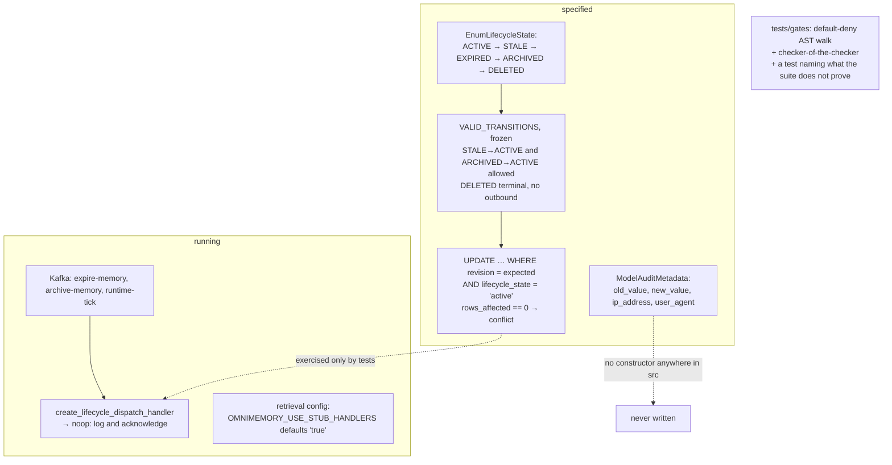

## 1. Executive Summary

OmniMemory is the memory domain of the ONEX platform — 119,000 lines of MIT
Python, mypy strict, Pydantic models throughout, Kafka-dispatched nodes, and
adapters for Qdrant, Memgraph, Valkey and Postgres.

**The thing worth reading is a test file.**

`tests/gates/test_consumer_group_name_authorization.py` is 519 lines enforcing
that no Kafka consumer-group name in `src/` is a string literal. It is a
default-deny AST walk: every `group_id=` / `consumer_group=` / `kafka_group_id=`
keyword and every default on a matching field "must be a call to (or a local
binding of) one of the canonical derivation helpers. A newly added string
literal FAILS by default — that is the whole point of the gate."

Then it does the part almost nobody does. It tests the checker:

> "A default-deny gate whose discrimination is never exercised is
> indistinguishable from a gate that always passes; these prove it catches
> literals, f-strings, and laundering while admitting real derivations."

Six `test_checker_*` cases run positive and negative controls over the AST walk
against inline fixtures, and the docstring records why they exist: they were
"added in the OMN-15639 round-2 remediation after a verifier demonstrated the
`apply_instance_discriminator` laundering hole live."

And then it does something rarer still —
`test_unauthorized_env_token_is_not_authorized` asserts, in executable form,
what the suite does **not** prove: the kernel's default environment token is
`local`, `local.omnimemory.*` is not in the IAM-granted pattern set, and
therefore "a green suite here… does NOT prove the deployed name is authorized;
the deployment must set the env token to `onex-dev`."

A test whose subject is the boundary of its own evidence. This atlas has read
two hundred and one systems and this is the first one.

**The second mechanism is a real compare-and-set on lifecycle.**
`handler_memory_expire.py` transitions a memory with a WHERE clause carrying
both the expected revision *and* the expected source state:

```sql
UPDATE memories
SET lifecycle_state = 'expired', expired_at = :now,
    lifecycle_revision = lifecycle_revision + 1, updated_at = :now
WHERE id = :memory_id
  AND lifecycle_revision = :expected_revision
  AND lifecycle_state = 'active'
-- If rows_affected == 0 -> conflict (another process updated first)
```

`_VALID_FROM_STATES = frozenset({EnumLifecycleState.ACTIVE})` with a comment
explaining the exclusion: "Including EXPIRED here would cause
`handle_with_retry()` to keep retrying on already-expired memories."

**And then the finding that governs the report.** The Kafka handler that
receives `expire-memory` and `archive-memory` commands does none of this:

> "No-op handler: lifecycle orchestrator not yet wired."

`create_lifecycle_dispatch_handler` — the name without *noop* — returns
`create_lifecycle_noop_dispatch_handler`. Its docstring records the change:
"Previously a fail-fast handler that raised RuntimeError; now a no-op with
structured logging so that upstream lifecycle commands… are gracefully
acknowledged instead of crashing the service (OMN-2437)."

A `RuntimeError` was replaced by an acknowledgement. Expire and archive commands
now succeed and do nothing.

## 2. Mental Model

There are two OmniMemories in this repository and they do not meet.

**The specified one** is excellent: typed enums, a frozen transition map, a
compare-and-set adapter with a conflict result and a retry helper, an audit
metadata model with `old_value`/`new_value`, and a gate suite that tests itself.

**The running one** acknowledges lifecycle commands without acting, builds
retrieval from in-memory test doubles unless `OMNIMEMORY_USE_STUB_HANDLERS` is
explicitly set to `"false"`, and never constructs the audit model at all.



## 3. Architecture

ONEX-compliant nodes, each with a `contract.yaml`, dispatched from Kafka topics
derived by helper functions rather than literals. `PluginMemory` registers at
the `onex.domain_plugins` entry point, wires message types, verifies handler
imports and subscribes to topics.

The README is unusually clear about ownership boundaries — domain models,
protocol interfaces, storage adapters and the runtime plugin stay; "the 15
runnable ONEX node handler implementations (those with `contract.yaml`) are
moving to `omnimarket`". A repository that publishes which half of itself is
leaving is doing its readers a service.

339 Python modules outside tests, 99 test files.

## 4. Essential Implementation Paths

**Transition** —
`nodes/node_memory_lifecycle_orchestrator/handlers/handler_memory_expire.py`
(`_EXPIRE_SQL`, `_READ_STATE_SQL`, `_VALID_FROM_STATES`, `handle_with_retry`).

**Validate** — `validators/validator_lifecycle_transition.py`
(`VALID_TRANSITIONS` as a `MappingProxyType` of frozensets,
`ModelTransitionValidationResult` frozen with `extra="forbid"` and a `reason`).

**Sweep** — `handlers/handler_memory_tick.py`: `lifecycle_state = 'active' AND
expires_at IS NOT NULL AND expires_at <= :now`, then `lifecycle_state =
'expired' AND archived_at IS NULL`.

**Dispatch** — `runtime/dispatch_handlers.py`
`create_lifecycle_noop_dispatch_handler` and its aliasing wrapper.

## 5. Memory Data Model

`lifecycle_state` and `lifecycle_revision` on a `memories` table, with
`expired_at`, `archived_at` and `updated_at`.

`EnumLifecycleState` is five states with the transitions written down: STALE can
return to ACTIVE ("refreshed / promoted"), ARCHIVED can return to ACTIVE
("promoted / restored"), and DELETED has an empty frozenset — terminal, and
described as "soft delete marker for audit trail". Revival paths named
explicitly rather than left implicit is the right way to write a lifecycle.

`EnumTrustLevel` looks like a trust state and is not one. Its six levels are
defined by score ranges — "UNTRUSTED: Score below 0.2, data should not be used"
— and `model_trust_score.py` derives the level from the float in
`_score_to_level()`. It is a confidence number with labels printed on it, which
is the distinction this atlas's `trust_state` mark exists to draw.

## 6. Retrieval Mechanics

`build_retrieval_config_from_env()` reads `OMNIMEMORY_USE_STUB_HANDLERS`,
**default `"true"`**: "When the value is anything other than `"false"`… in-memory
test doubles are used. Otherwise a `ModelHandlerQdrantConfig` is constructed."

So the default configuration retrieves from test doubles. That is a defensible
choice for a platform component whose deployments configure themselves, and it
is a fact a reader evaluating this as a memory system needs stated plainly.

`lifecycle_state` never appears in a retrieval query. It is read and written only
by the lifecycle orchestrator's own sweep and transition SQL, so an EXPIRED or
ARCHIVED memory is not filtered out on the read path by anything found here.

No memory-level scope key — tenant, user, project or agent — was found as a read
filter. `agent_id` exists on persona and coordinator models, not as a retrieval
predicate.

## 7. Write Mechanics

Writes go through ONEX nodes. Lifecycle changes go through the compare-and-set
described above, which is a genuine lost-update guard: the WHERE clause carries
the expected revision and the expected state, and zero affected rows is reported
as `conflict` rather than swallowed. `deactivate_with_retry` re-reads the current
revision and retries up to `max_retries`.

This is the pattern the atlas finds in only a handful of systems, and this
implementation is the most carefully documented of them — including the reason
EXPIRED is excluded from the valid source states.

Nothing calls it outside the test suite.

## 8. Agent Integration

Not an agent-facing memory in the usual sense: no MCP server, no CLI for a
coding agent. It is a domain package inside a distributed platform, consumed by
other ONEX services over Kafka, with a `docker-compose.yml` owning Qdrant,
Memgraph, Valkey and Kreuzberg.

## 9. Reliability, Safety, and Trust

**No marks.**

**Trust state — withheld.** `EnumTrustLevel` is a binning of a float.
`EnumLifecycleState` is a lifecycle with a real state machine, but it is not an
epistemic status and it does not reach the read path.

**Audit log — withheld, and this is the sharpest instance.**
`models/foundation/model_audit_metadata.py` defines `AuditEventDetails` with
`operation_type`, `resource_id`, `old_value`, `new_value`, `request_parameters`,
`response_status`, `error_details`, `ip_address` and `user_agent`, plus
`ResourceUsageMetadata` and `SecurityAuditDetails` beside it. `ModelAuditMetadata`
has no constructor anywhere in `src`. The schema is complete and the writer does
not exist.

**Scope, bitemporal, tombstone, human review, negative eval — no.**

**The no-op is the risk to name.** Converting a fail-fast handler into a logged
acknowledgement changes an upstream service's experience from a crash to a
success. The commented reason — not crashing the service while integration is
incomplete — is a real operational pressure, and the code is honest about it in
its docstring. But the honesty lives in a docstring; the wire protocol says the
expire succeeded.

## 10. Tests, Evals, and Benchmarks

**No paper. No retrieval benchmark.** 99 test files, mypy strict, ruff,
pre-commit.

`tests/gates/test_consumer_group_name_authorization.py` is the artifact worth
the visit, and it is worth it even if you never touch ONEX. Ten tests:

- `test_no_unmigrated_group_literals_in_src` — the default-deny AST walk.
- `test_legacy_unmigrated_allowlist_is_empty` — the escape hatch, asserted empty,
  so the exemption list cannot quietly grow.
- Six `test_checker_*` cases proving the walk "catches literals, f-strings, and
  laundering while admitting real derivations", including
  `test_checker_rejects_laundered_literal` and
  `test_checker_rejects_rebound_derived_name`.
- `test_derived_memory_group_is_iam_authorized` — positive *and* negative control
  against a pinned IAM pattern set vendored from Terraform, because "without the
  negative half a permissive translator would pass".
- `test_seam_scope_field_name_is_ephemeral_tag` — pins a field name across a
  package boundary the seam table does not cover, "so a core-lane rename fails
  here loudly instead of surfacing as a runtime `TypeError` while both lanes'
  own suites stay green".
- `test_unauthorized_env_token_is_not_authorized` — the test that states the
  suite's own limit.

**I ran nothing.**

## 11. For Your Own Build

### Steal

- **Test the checker, not just the thing checked.** "A default-deny gate whose
  discrimination is never exercised is indistinguishable from a gate that always
  passes." Every invariant you assert deserves a fixture proving it fails when
  violated — the atlas has read repositories with tens of thousands of lines of
  tests whose documented mutants are never executed.
- **Write a test for what your tests do not prove.** Naming the residual in
  executable form — here, that a green suite says nothing about the deployed
  environment token — is worth more than a paragraph in a PR body, because the
  paragraph is not run.
- **Assert the escape hatch is empty.** `_LEGACY_UNMIGRATED` "MUST stay empty at
  end state", enforced by its own test. An allowlist nobody checks is an
  allowlist that grows.
- **Put both the revision and the source state in the WHERE clause.** `WHERE id
  = ? AND lifecycle_revision = ? AND lifecycle_state = 'active'`, with
  `rows_affected == 0` surfaced as a conflict, gives you optimistic concurrency
  and an illegal-transition guard in the same statement.
- **Write down why a state is excluded from a retry set.** "Including EXPIRED
  here would cause `handle_with_retry()` to keep retrying on already-expired
  memories" is the comment that stops a future contributor from widening it.
- **Name the revival paths in the transition map.** STALE→ACTIVE and
  ARCHIVED→ACTIVE spelled out, DELETED with an empty frozenset. Someone reading
  the map learns the policy.
- **Publish which half of your repository is leaving.** The migration boundary
  document is a courtesy most large refactors skip.

### Avoid

- **Do not convert a fail-fast into a silent acknowledgement.** If the
  orchestrator is not wired, an upstream `expire-memory` should not receive
  success. Reject, dead-letter, or return an explicit not-implemented — the
  crash was information.
- **Do not name a function `create_lifecycle_dispatch_handler` when it returns
  the no-op.** The delegation is one line and the docstring is honest, but the
  call site reads as the real thing.
- **Do not let a score wear a state's clothes.** Six labels derived from a float
  by threshold are a float. If UNTRUSTED means "should not be used", something
  on the read path has to refuse it.
- **Do not ship an audit schema with no writer.** `old_value`, `new_value`,
  `ip_address` and `user_agent`, fully specified and never constructed, reads to
  a reviewer as an audit trail that exists.
- **Do not default a storage adapter to stubs.** `OMNIMEMORY_USE_STUB_HANDLERS`
  defaulting to `"true"` means the failure mode of a misconfigured deployment is
  a memory that silently forgets rather than one that fails to start.

### Fit

This is a platform component, not a library to adopt. If you are not building on
ONEX there is nothing here to install.

Read the gate file anyway. It is the best-argued test file in this atlas, and
its central claim — that an unexercised gate and an absent gate are the same
gate — applies to every invariant any of these two hundred and one systems assert.

## 12. Open Questions

- **Is the lifecycle wired anywhere outside this repository?** The 15 runnable
  nodes are migrating to `omnimarket`, which was not read.
- **What does OMN-2437 say?** The ticket that turned the fail-fast into a no-op
  is referenced and not public.
- **Does anything consume `EnumTrustLevel`?** Only `model_trust_score.py`
  references it; no consumer was found that refuses an UNTRUSTED item.
- **Is `ModelAuditMetadata` written by a sibling package?** No writer exists
  here; whether one exists in `omnibase_core` was not established.

## Appendix: File Index

**The gate** — `tests/gates/test_consumer_group_name_authorization.py` (the
rationale `:1-58`, the AST walk `:263`, the empty-allowlist assertion `:285`, the
six checker controls `:293-390`, the seam pin `:446`, the residual test `:472`)

**Lifecycle** — `src/omnimemory/enums/enum_lifecycle_state.py`,
`src/omnimemory/nodes/node_memory_lifecycle_orchestrator/validators/validator_lifecycle_transition.py`
(`VALID_TRANSITIONS` `:63-96`),
`.../handlers/handler_memory_expire.py` (the SQL pattern `:23-34`, `_EXPIRE_SQL`
`:381`, `_VALID_FROM_STATES` `:401-404`),
`.../handlers/handler_memory_tick.py`,
`.../adapters/adapter_postgres_deactivate_memory.py`

**Runtime** — `src/omnimemory/runtime/dispatch_handlers.py`
(`create_lifecycle_noop_dispatch_handler` `:360`,
`create_lifecycle_dispatch_handler` `:408`, `build_retrieval_config_from_env`
`:440`), `src/omnimemory/runtime/contract_topics.py`,
`src/omnimemory/runtime/plugin.py`

**Trust** — `src/omnimemory/enums/enum_trust_level.py`,
`src/omnimemory/models/foundation/model_trust_score.py` (`_score_to_level`
`:161`)

**Audit** — `src/omnimemory/models/foundation/model_audit_metadata.py`

**Documentation** — `README.md` (the three ownership roles),
`docs/migrations/MARKET_MIGRATION_BOUNDARY.md`

## History

**2026-08-09** — [`5dacb73c3319fad338870916bfb30025af5cf39c`](https://github.com/OmniNode-ai/omnimemory/commit/5dacb73c3319fad338870916bfb30025af5cf39c) — first reading. Screened before reading; the tree was read, never installed, and no test was run.
