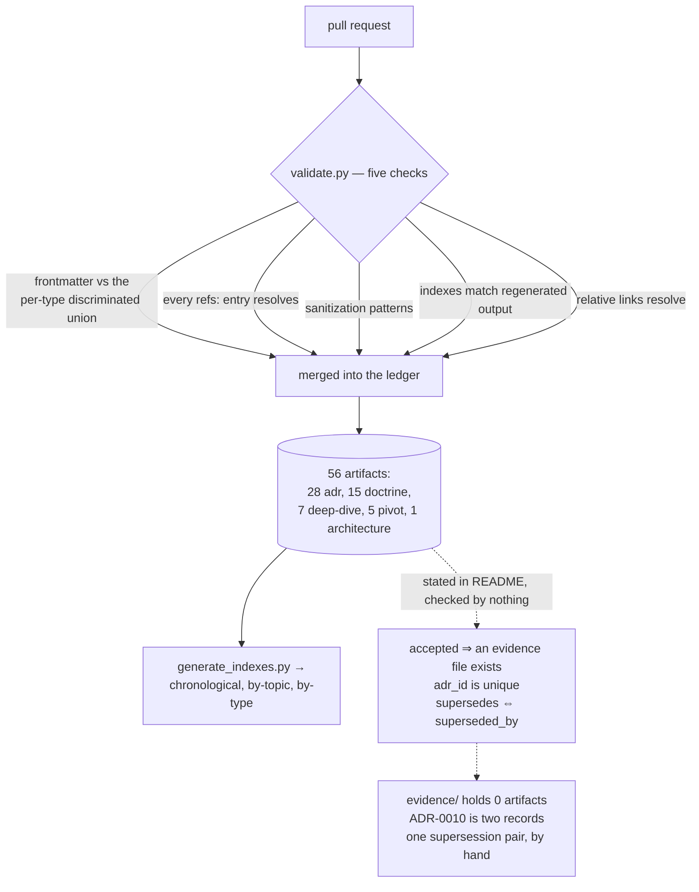

## 1. Executive Summary

This is OmniNode's public architectural provenance record: 89 files, Apache-2.0,
holding decision records, doctrine, pivots, deep dives and an architecture
document, each a Markdown file with typed YAML frontmatter. It is in this atlas
for the same reason [Cambium](../cambium/) and [breadcrumbs](../breadcrumbs/) are
— the store is a working method rather than a runtime, and the method is the
part worth reading.

The mechanism is good. `schemas/frontmatter.schema.json` is generated from
Pydantic models in `scripts/validate.py` and discriminates on `type`, so each of
the eight artifact kinds gets its own status vocabulary: an ADR is `proposed`,
`accepted`, `superseded`, `deprecated` or `rejected`; a pivot is `observed`,
`emerging`, `accepted`, `historical` or `superseded`; a doctrine document is
only `draft`, `accepted` or `deprecated`. That is a
discrete epistemic state on the claim itself rather than on a workflow, and CI
fails a file that carries a value outside its type's enum.

Five checks run on every pull request, and all five are real: frontmatter
against the schema, every `refs:` entry resolving to a file that exists,
sanitization patterns, index freshness against regenerated output, and relative
links. A separate gate scans commit messages and PR titles and bodies for the
same forbidden content, and it *"does NOT honor the `# sanitization-ok:` author
allowlist"* — the escape hatch that exists for artifacts is refused where the
author is writing prose nobody will review as an artifact.

**Then there is what the checks do not cover, and it is precisely the project's
own philosophy.** The README states it three ways: *"Truth must be proven"*,
*"Completion requires durable evidence"*, *"A decision is not accepted… until the
evidence artifact exists and is referenced."* `evidence/README.md` puts the rule
in one line: *"Every accepted ADR and confirmed pivot should have at least one
evidence file. Claims without evidence are hypotheses."*

`evidence/` contains a README and nothing else. So do `plans/` and
`experiments/`. Three of the nine documented artifact types have zero instances,
and the missing one is the type the whole philosophy rests on — against 28 ADRs
and 15 doctrine documents. The rule names two kinds specifically: 8 ADRs carry
`status: accepted` and 5 pivots do, so 13 artifacts fail it by name and 29 carry
an accepted-family status overall.

**And the ledger has a key collision.** `adrs/ADR-0010-adaptive-recursive-contract-bisection.md`
and `adrs/ADR-0010-required-context-parity-ratchet.md` both declare
`adr_id: ADR-0010` with different titles and different decisions. Nothing in the
validator checks that an id identifies one record, so a future `refs: [ADR-0010]`
or `supersedes: [ADR-0010]` resolves to whichever file a reader opens first.

## 2. Mental Model

A memory is a **file with a type and a status**. The type decides which fields
are legal and which statuses exist; the status decides whether the claim is
currently held.

```text
adr         proposed | accepted | superseded | deprecated | rejected   + adr_id, supersedes, superseded_by
pivot       observed | emerging | accepted | historical | superseded   + observed_date, confidence: low|medium|high
doctrine    draft | accepted | deprecated
architecture draft | accepted | superseded | deprecated
plan        draft | active | completed | superseded
evidence    draft | accepted | superseded
experiment  proposed | active | completed   + hypothesis, outcome: confirmed|refuted|inconclusive|None
deep-dive   draft | public-curated          + period
```

Two of those deserve a second look. A pivot carries a `confidence` of `low`,
`medium` or `high` *beside* its status, which is the separation this atlas
argues for — how sure you are is not the same axis as whether the claim is
current. And an experiment carries a `hypothesis` and an `outcome` that may be
`confirmed`, **`refuted`** or `inconclusive`. A schema with a first-class
refutation is rare in this corpus. There are no experiments.

Correction is supersession, expressed in frontmatter rather than by editing the
superseded text: the new artifact lists `supersedes: [ADR-0026]`, the old one
lists `superseded_by: [ADR-0027]` and moves to `status: superseded`, and both
files stay in the tree. The corpus contains exactly one such pair, and it is
correct in both directions — which is the good news and the caveat at once,
because the reciprocity is a convention rather than a check.

The distinction the design gets right, and which most Markdown knowledge bases
collapse, is that **an artifact records what was rejected as well as what was
chosen**. Every ADR carries an "Alternatives Considered" section with the reason
each was refused — ADR-0019's is *"self-attestation defeats the gate; agents
lie; an OCC receipt written by the party it certifies is not evidence"*. That is
a rejected-value record kept in prose, keyed by nothing and consulted by nothing,
which is the near-miss worth naming: the store knows what it ruled out and has no
way to be asked.



## 3. Architecture

There is no runtime. The repository is the system, and four Python scripts,
735 lines in total, are the enforcement:

- **`scripts/validate.py`** (372) — the Pydantic models, the five checks, and
  `--export-schema` so the committed JSON schema is generated rather than
  maintained.
- **`scripts/generate_indexes.py`** (188) — rebuilds `indexes/chronological.md`,
  `by-topic.md` and `by-type.md` from frontmatter.
- **`scripts/sanitization_patterns.py`** (57) — the shared pattern set: internal
  ticket references, internal IPs and hosts, private repository URLs,
  secrets-manager references, email addresses.
- **`scripts/check_text_sanitization.py`** (118) — the same patterns applied to
  commit messages, PR titles and bodies, and a commit range.

`.github/workflows/ci.yml` runs lint, `validate.py`, a schema-freshness check
and the sanitization job; `.pre-commit-config.yaml` wires the commit-message gate
locally.

### Deployment and ergonomics

`uv` and Python 3.12. Nothing is served, nothing is indexed, nothing runs on a
schedule. For a team that already reviews by pull request this costs one CI job;
for anything else there is nothing to deploy.

## 4. Essential Implementation Paths

**The schema** — `validate.py:60` onward declares one model per artifact type,
each pinning `status` to a `Literal[...]`, with `_discriminate` selecting the
model from the `type` field. `additionalProperties: false` in the exported schema
means an unknown key fails, so the frontmatter cannot quietly accumulate fields.

**Cross-references** — `check_cross_references` resolves every `refs:` entry and
fails on a miss. This is the provenance link that cannot dangle, and it is the
strongest routine here.

**Index freshness** — `check_index_freshness` regenerates the three indexes in
memory and compares them to what is committed, so a stale index fails the build
rather than misleading a reader. The retrieval surface is derived and verified,
which is the right relationship between a store and its index.

**Sanitization** — applied to artifacts with an `# sanitization-ok:` allowlist for
deliberate exceptions, and applied to commit messages and PR bodies *without*
it. The asymmetry is deliberate and documented in `CLAUDE.md`.

**What has no path** — there is no function anywhere that reads `status`,
`supersedes`, `superseded_by` or `adr_id` for anything other than schema
validation. The fields are typed, stored, and never interpreted.

## 5. Memory Data Model

| Directory | Artifacts | What the type means |
| --- | --- | --- |
| `doctrine/` | 15 | Stable platform principles |
| `adrs/` | 28 | The decision ledger, ids `ADR-0001`–`ADR-0027` |
| `deep-dives/` | 7 | Narrative records of architectural evolution |
| `pivots/` | 5 | Changes in understanding, before and after |
| `architecture/` | 1 | Technical design documents |
| `plans/` | **0** | Intended work |
| `experiments/` | **0** | Hypothesis-driven, with structured outcomes |
| `evidence/` | **0** | Links from claims to durable proof |

Twenty-eight ADR files carry twenty-seven distinct ids. Statuses across the
corpus: 29 `accepted`, 21 `proposed`, 8 `public-curated`, and one each of
`superseded`, `emerging` and `draft`.

Every artifact carries `topics: []` and `refs: []`. Topics group a generated
index and are not used as a filter; refs are validated to resolve and are not
used for anything else.

## 6. Retrieval Mechanics

The repository ships no query. Retrieval is opening one of three generated
indexes — chronological, by topic, by type — or grepping the tree, and
`README.md` names the intended entry point in prose: start at `doctrine/`, then
ADRs, then pivots.

For a corpus of 56 documents that is adequate and honest, and the freshness check
means the indexes can be trusted. It also means the store has no way to answer
the question its own status field makes askable — *"which accepted decisions are
still current"* — without a person reading every file.

## 7. Write Mechanics

A write is a pull request, and the gate is CI. Nothing is extracted, summarized
or consolidated; there is no background pass; the only derived artifacts are the
three indexes, and they are regenerated by hand and verified in CI.

Deletion is not modelled at all. The correction path is supersession, which
retains the superseded artifact and marks it — the behaviour this atlas argues
for — and there is no mechanism for removing a claim that should never have been
recorded, which is a different need and one the sanitization gate partly covers
by refusing the content at the boundary.

## 8. Agent Integration

`CLAUDE.md` is the whole integration: the commands, the gates, and four rules,
ending with a line stating when it was last checked against the code —
*"verified against `scripts/`, `.pre-commit-config.yaml`, and
`.github/workflows/ci.yml` on the 2026-06-21 refresh"*. A contract file that
records when it was last reconciled with the thing it describes is a small habit
worth copying, and this atlas has read many that do not.

The agent-facing content extends past the contract. ADR-0019 exists because an
implementing agent wrote its own verification receipt: *"In practice the
implementing agent was authoring its own OCC evidence companion, which defeats
the gate: agents lie, and self-attestation is not proof."* The decision is that
evidence comes only from an autogen tick or an independent verifier, and any
self-authored companion is re-verified before the work is accepted.

That is the right rule and it is recorded here as a decision, not implemented
here as a check — this repository holds the ledger, and the receipt gate it
describes lives in the platform's other repositories.

## 9. Reliability, Safety, and Trust

**Five checks, all of which fail the build.** Nothing here is advisory, and that
distinguishes it from most documentation repositories, where a convention is a
sentence in a contributing guide.

**Three invariants, none of which are checked**, and each is stated by the
repository as central:

1. *"Every accepted ADR and confirmed pivot should have at least one evidence
   file."* Eight accepted ADRs, five accepted pivots, zero evidence files. Under
   the repository's own next sentence — *"Claims without evidence are
   hypotheses"* — the ledger holds no accepted decisions at all, only hypotheses
   that say `accepted`.
2. **An id identifies one record.** `ADR-0010` identifies two, with different
   titles and unrelated decisions.
3. **Supersession is reciprocal.** ADR-0026 and ADR-0027 point at each other
   correctly. A future pair that does not would pass every check, leaving a
   superseded claim that still reads as current, or a current claim that
   silently supersedes nothing.

All three are cheap to add to a validator that already parses every file into a
typed model — a set for ids, a dictionary lookup for the back-link, and a count
of `refs:` entries pointing into `evidence/` for the first. The gap is not
capability; the machinery is already there and pointed elsewhere.

**Sanitization is the strongest safety property**, because it is enforced at
three surfaces including the two nobody reviews, and because refusing the
allowlist on commit messages shows the failure mode was thought about rather than
inherited.

## 10. Tests, Evals, and Benchmarks

No tests for the scripts. `validate.py` is 372 lines of parsing and comparison
with no test file, and its five checks are exercised only by running it over the
corpus in CI — which does mean a regression in a check would surface as the
corpus passing when it should not, silently, rather than as a red test.

There is nothing to benchmark, and the repository claims no numbers. Nothing was
run for this review; the counts here come from reading the frontmatter of every
artifact.

## 11. Patterns Worth Stealing

### Steal

- **Generate the schema from the models and fail CI when the committed copy
  drifts.** `--export-schema` plus a freshness check means the published contract
  cannot describe a validator that no longer exists.
- **Give each artifact type its own status vocabulary.** A doctrine principle
  that is `observed` or `emerging` is a genuinely different epistemic claim from
  an ADR that is `proposed`, and one shared enum would have flattened both.
- **Verify the index rather than trusting it.** Regenerate in memory, compare to
  what is committed, fail on a difference. It costs nothing and removes the
  commonest quiet defect in a file-backed store.
- **Deny the allowlist where nobody is reviewing.** An escape hatch that applies
  to reviewed artifacts and not to commit messages is a considered boundary, and
  the reasoning is in the contract file.
- **Date the contract file against the code.** One trailing comment saying when
  `CLAUDE.md` was last checked against `scripts/` and CI tells a reader how much
  to trust it.

### Avoid

- **Stating an invariant in a README and enforcing the schema instead.** The
  three rules this project describes as its philosophy are exactly the three a
  reader cannot rely on, and a validator that already builds a typed model of
  every file is fifteen lines from checking all three.
- **An id field that nothing constrains.** A ledger whose keys can collide has no
  reliable way to express supersession or reference, and the collision here is
  already in the tree.

### Fit

Right for a team that wants its architectural reasoning inspectable and is
willing to pay for it in pull requests. The five checks are a good floor, the
type-per-status model is better than most, and the whole thing is 735 lines of
Python over a directory of Markdown.

Wrong as agent memory in the sense the rest of this atlas means it. Nothing
retrieves, nothing scopes, nothing reads a status back, and no agent writes here
without a human opening a pull request — this is a record humans and agents
maintain together, not a store an agent uses during a task. Take the schema and
the checks; the runtime is somebody else's problem, and in OmniNode's case it is
[OmniIntelligence](../omniintelligence/) and [OmniMemory](../omnimemory/), read
separately.

## 12. Antipatterns / Risks

- **A philosophy with no instances.** `evidence/`, `plans/` and `experiments/`
  are documented, templated, indexed by type — and empty. The most load-bearing
  claim in the README has zero artifacts behind it.
- **A duplicate primary key in a decision ledger**, which makes `ADR-0010`
  ambiguous in any future reference.
- **Typed fields nothing consumes.** `status`, `supersedes`, `superseded_by`,
  `confidence`, `hypothesis`, `outcome`, `topics` and `refs` are validated and
  then never read by any code path except the index generator, which uses
  `topics` and `date` only. The sharpest case is `outcome: refuted` — a
  first-class record that a hypothesis failed, in a type with no instances.
- **No tests on the enforcement.** The five checks are the entire guarantee and
  none of them has a test asserting it still catches what it was written for.
- **Supersession by convention.** One correct pair, no check, and the failure is
  silent in the direction that matters — a superseded claim that still reads
  current.

## 13. Build-vs-Borrow Takeaways

Borrow the shape: typed frontmatter per artifact kind, a status enum that means
something, a generated schema, a generated index that is verified rather than
trusted, and a content gate that reaches the surfaces nobody reviews. That is a
better foundation than most hand-maintained knowledge bases have, and it is
small.

Then write the three checks this one is missing before the corpus grows, because
each becomes harder to add later: unique ids, reciprocal supersession, and an
evidence reference on anything claiming `accepted`. The third is the one that
turns the project's philosophy from a paragraph into a property.

## 14. Open Questions

- **Is the evidence rule enforced elsewhere?** ADR-0019 and ADR-0022 describe an
  OCC receipt gate in the platform's other repositories, so the proof artifacts
  may exist and simply not be linked from here. If they do, the missing thing is
  the link, and the link is the artifact type this repository defines.
- **Which ADR-0010 do later documents mean?** Neither is referenced by a `refs:`
  entry at this commit, so the collision has not yet been resolved by usage.
- **Why can a deep-dive only be `draft` or `public-curated`?** Its vocabulary is
  the one status set with no way to say a narrative was superseded, in a
  repository whose whole subject is that understanding changes. All seven
  deep-dives are `public-curated`.
- **What happens to a claim that was wrong rather than superseded?** The ADR enum
  has `rejected`, no artifact uses it, and the difference between "we decided
  against this" and "we decided this and it was untrue" is not modelled.

## Appendix: File Index

| Path | What it holds |
| --- | --- |
| `scripts/validate.py` | Pydantic models per artifact type; the five checks; `--export-schema` |
| `scripts/generate_indexes.py` | Rebuilds the three indexes from frontmatter |
| `scripts/sanitization_patterns.py` | The shared forbidden-content pattern set |
| `scripts/check_text_sanitization.py` | The same patterns over commit messages and PR text, without the allowlist |
| `schemas/frontmatter.schema.json` | Generated contract; CI fails if it drifts |
| `adrs/ADR-0019-no-self-authored-evidence.md` | *"agents lie, and self-attestation is not proof"* |
| `adrs/ADR-0026`, `ADR-0027` | The corpus's only supersession pair, correct in both directions |
| `adrs/ADR-0010-*.md` | Two files, one id |
| `evidence/README.md` | The rule with no instances |
| `CLAUDE.md` | The agent contract, dated against the code it describes |

## History

**2026-08-12** — [`37f76b13827987823dd71ef7fe3c9358dbc06a41`](https://github.com/OmniNode-ai/knowledge-base/commit/37f76b13827987823dd71ef7fe3c9358dbc06a41) — first reading. The screen found no auto-run surface, no build-time execution and a `uv.lock` unchanged for 81 days; `CLAUDE.md` is addressed to a reading agent and was read as data. Nothing was installed or run — the artifact counts, the status distribution, the empty directories and the duplicate `adr_id` come from reading the frontmatter of every file in the tree.
