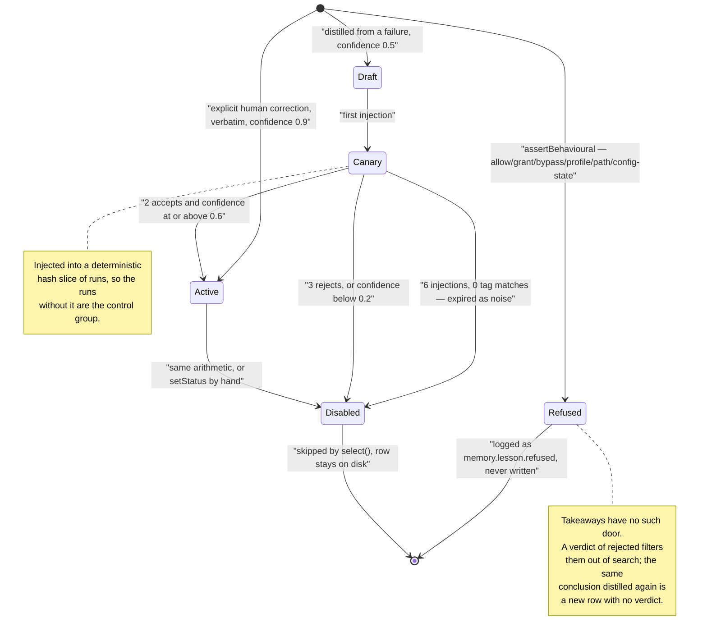

## 1. Executive Summary

Hats is a local agent runtime — 29,719 lines of TypeScript across `src/`, **zero
runtime dependencies**, Node ≥ 20.11, `bin: hats` — whose thesis is that an
agent's personality, guardrails and abilities should be files on disk rather than
prompt strings in a Python module. One agent changes hats per step instead of a
fleet of agents passing messages. It is published under the **PolyForm
Noncommercial 1.0.0 licence with an attribution notice** (`LICENSE.md`), so
commercial use needs a separate licence from the vendor; the mechanisms below are
readable and runnable, and what you may do with them is not the usual permissive
answer.

**The memory is five stores, deliberately not one.** `src/memory/types.ts` opens
by saying why: *"Collapsing these into one store gets all of them wrong, so they
are separate types with separate files and separate rules about who may write
them."* An authored `org-context.md` the system may read and never write; an
inferred `Persona` that is a size-bounded moving window; `Takeaway` question and
answer pairs from past runs; `Lesson` behavioural rules the system distilled from
its own failures; and the run transcript. `MemoryLayers.compose` renders them in
that order and labels each block with its authority — *"authored by the user —
authoritative"* above the org context, *"inferred, may be stale — defer to
anything they say now"* above the persona.

**The best mechanism here is a write-time refusal, and it is wired to a rule file
that names the function performing it.** `assertBehavioural`
(`src/memory/lessons.ts`) tests six regular expressions against every lesson
before it is stored, and throws `LESSON_REFUSED` when one matches: text that
tries to allow, enable, grant or unlock a tool, network, profile or permission;
text that tries to disable, bypass or skip a gate, guard, approval or boundary;
text naming a profile; an instruction-override; a path outside the workspace; and
a state assertion about the configuration. The reason is stated where the
patterns are: *"A lesson store that contains access-widening text and merely
declines to apply it is one refactor away from applying it."* The rule document
`packs/rules/lessons-behavioural-only.md` declares `strength: code` and
`enforced_by: memory.lessons.assertBehavioural`, and `src/registry/loader.ts`
refuses to load any non-prompt rule whose `enforced_by` is not a key in
`ENFORCEMENT_POINTS`. A guardrail written as data, carrying a checkable claim
about the code that enforces it, is rare in this corpus.

**Unproven lessons are staged through a deterministic canary slice.** A lesson
distilled from a failure enters as `draft` at confidence 0.5, becomes `canary` on
first injection, and while it is unproven `inCanarySlice` — an FNV-1a hash of
`runId:lessonId` against a 0.5 share — decides whether this run sees it. The runs
that do not are a control group, and the promotion rule reads only concrete
outcomes: two acceptances at confidence ≥ 0.6 promotes to `active`, three
rejections or confidence below 0.2 disables with `retiredReason: 'contradicted by
outcomes'`, and six injections with zero tag matches disables it as *"never
matched — expired as noise."*

**Where it is weakest is the accountability story, and the gap is specific.**
`src/core/audit.ts` is a hash-chained, `0600`, single-stream log with a closed
action vocabulary and a `verifyAuditChain` that recomputes it — and **no memory
mutation is ever written to it**. `data.written` and `data.deleted` are in the
vocabulary; nothing emits them, along with seven other actions of the twenty. The
module's own docstring argues that writes must be awaited and failures surfaced
*"instead of being counted and dropped"*, and exports `audit()` to do exactly
that; all thirteen call sites use the non-throwing `auditQuietly`, two of them
prefixed with `void`. Separately, `appendJsonl` accepts a file mode and explains
why — *"a store holding conversation content must never exist world-readable"* —
and the two memory stores that hold conversation content call it without one.

## 2. Mental Model

A memory here is one of five things, and which one it is decides who may write
it, how long it lives, and what it is allowed to say.

**The authored layer is the only one the system cannot write.** `OrgContext`
exposes `read`, `write` and `ensureTemplate`, and `write` is reached from
`hats init` and the user's editor — never from a tool, because no tool touches
memory except a read-only one. Its module comment states the rank directly:
*"The system may read this. The system may not write it."*

**The inferred layers become beliefs by distillation and stop being beliefs by
feedback.** After a run, a second model call is asked for one takeaway, zero or
more lessons and at most one persona fact. A takeaway is written with
`feedback: 'none'` and is retrievable immediately. A lesson from a failure is
written as a `draft`; a lesson from an explicit human correction is written
`active` at confidence 0.9, *"verbatim"*, because a correction is not a
hypothesis.

**Death is by verdict, by arithmetic, or by refusal at the door.** A takeaway
dies when the user marks its run `rejected` — `TakeawayStore.search` filters
`feedback !== 'rejected'` before scoring, so the record survives on disk and stops
being retrievable. A `corrected` takeaway is re-rendered by `render()` as
*"A (corrected by the user)"* carrying the correction text, so the original
answer never resurfaces even though it is still in the file. A lesson dies by
confidence arithmetic or by never matching. And a lesson that would widen access
never lives at all: `assertBehavioural` throws before `appendJsonl`, and
`MemoryLayers.distill` catches the refusal, logs `memory.lesson.refused` and
records it in `DistillResult.refused` — *"a refused lesson is a signal."*

The state machine below is the lesson's, because that is the layer with real
states; the takeaway's verdict is drawn beside it, since the two are moved by the
same feedback call.

## 3. Architecture

Nothing has to be running. Everything lives under `$HATS_HOME` (default
`~/.hats`): `config.json`, a `registry/` of skills and rules, per-workspace
directories holding `memory/`, `runs/`, `rag/` and `org-context.md`, and a single
`audit/audit.jsonl`. There is no database and no vector service, and the reason
is committed rather than implied — *"A workspace is thousands of chunks, cosine
over them is a few milliseconds, and a service to run would be a service to run."*

`src/core/store.ts` provides the two write disciplines the rest of the tree uses,
and the distinction is the right one: `writeJsonAtomic` (temp file plus rename)
for anything a reader must never see half-written, and `appendJsonl` for
append-only records, *"a single `appendFile` of one line"*, so **a crash can lose
the last line, never the file**. `readJsonl` skips a torn line rather than
failing. `rewriteJsonl` — used whenever a lesson's mutable fields change — goes
through `writeTextAtomic`, so the append-only store is rewritten wholesale on
every feedback event.

The path boundary is one function. `src/core/paths.ts` resolves symlinks before
checking containment, and says why it is not a `startsWith` at each call site.
Memory is scoped by living inside `workspaceDir(slug)`; there is no key on a
record that a query filters by.

### Deployment and ergonomics

`./start.sh` or `npm run build && node dist/src/cli/main.js`. Build-time
dependencies are `typescript` and `@types/node`; the runtime dependency list is
empty. A local model through Ollama is enough to run it end to end, and an
embedding model is optional — without one, takeaway retrieval falls back to BM25
and the document index runs in keyword mode and **says so in every result**
rather than implying a semantic understanding it does not have.

Every store is hand-repairable: JSONL and JSON under a documented path, readable
with `cat`. The audit log is the exception, and deliberately so — editing a line
breaks the hash chain that `verifyAuditChain` recomputes.

## 4. Essential Implementation Paths

- **Compose.** `src/engine/run.ts:runAgent` → `MemoryLayers.compose(request, runId)`
  (`src/memory/index.ts`) → four parallel reads → one Markdown block appended to
  the system prompt by `src/engine/compose.ts`, followed by
  `lessons.markInjected`, which is what advances the canary counters.
- **Distil.** `src/cli/repl.ts:distil` and `src/ui/server.ts` → `MemoryLayers.distill`
  → `askModelToDistil` on the `light` tier at `temperature: 0` → `extractJson` →
  `takeaways.add`, then `lessons.record` per proposal, then `persona.addFact`.
- **Refuse.** `src/memory/lessons.ts:assertBehavioural`, called from `record`
  before the append; `src/memory/persona.ts:describesEnvironment`, called from
  `addFact` before the write.
- **Feedback.** `hats feedback <runId> good|bad|correct` (`src/cli/main.ts`), the
  REPL's `/feedback`, or `POST /api/feedback` (`src/ui/server.ts`) →
  `MemoryLayers.feedback` → `takeaways.setFeedback` and `lessons.applyFeedback`,
  plus a new verbatim `active` lesson when the verdict is `corrected` and a note
  was given.
- **Retrieve.** `TakeawayStore.search` (BM25 or cosine, `rejected` filtered
  first); `LessonStore.select` (confidence, tags, canary slice);
  `src/rag/index.ts` for the document index, fused by `fuse()` at `K_RRF`.
- **Retention.** `src/core/retention.ts:sweepWorkspace` — runs at 30 days,
  transcripts at 7, audit never.
- **Enforcement registry.** `src/engine/gates.ts:ENFORCEMENT_POINTS` and
  `src/registry/loader.ts`, which refuses a `gate`- or `code`-strength rule whose
  `enforced_by` is not one of them.
- **Tests.** `test/memory.test.ts` (8 cases), `test/retention.test.ts` (3),
  `test/rag.test.ts` (11), `test/redact.test.ts` (7),
  `test/registry-invariants.test.ts` (5).

## 5. Memory Data Model

`src/memory/types.ts` is 71 lines and carries the whole model. A `Lesson` has
`id`, `text`, `scope`, `status`, `confidence`, `source`, `createdAt`,
`updatedAt`, `injectedRuns`, `matches`, `accepts`, `rejects`, `tags` and an
optional `retiredReason`. A `Takeaway` has `id`, `runId`, `question` (capped at
400 characters), `answer` (800), `createdAt`, `feedback`, an optional
`correction`, `tags` and an optional `embedding`. A `Persona` is a `summary`, a
`facts` array, a `runCount` and `updatedAt`.

**Provenance is a `source` enum on lessons and a `runId` on takeaways, and one
enum value has no producer.** `LessonSource` admits `failure | correction |
feedback | pack`; `distill` writes `'failure'`, `feedback` writes `'correction'`,
and nothing in the tree writes `'pack'` or `'feedback'`. The shipped `packs/`
directory contains rules and skills, not lessons, so the starter-pack inheritance
the working paper describes is a type in this tree rather than a mechanism.

**Temporal fields are record time only.** `createdAt` and `updatedAt` on lessons,
`createdAt` on takeaways, `updatedAt` on the persona. Nothing records when a
remembered fact was *true*, and no read path takes an as-of parameter, so
`bitemporal` is withheld. Run identifiers are the one place time is load-bearing:
`newRunId` produces `20260814T101500Z-a1b2c3`, and `retention.ts:runIdAge` parses
the stamp out of the directory name so a sweep never has to open the record.

**The scoping near-miss is worth naming precisely, because the field exists.**
`Lesson.scope` is `'run' | 'workspace' | 'global'`. It is written by `record`,
used inside `record` as part of the dedupe identity
(`similar(l.text, text) && l.scope === input.scope`), and printed by
`hats memory`. `LessonStore.select` — the only read path — filters on `status`,
on `confidence` and on the canary slice, and never on `scope`. A `global` lesson
and a `workspace` lesson therefore behave identically, and both are confined to
the workspace whose file they sit in. The isolation is real and the filesystem
delivers it; the stored key does not, which is exactly the case the rubric
excludes. `'run'` is never produced by any caller.

## 6. Retrieval Mechanics

Two retrieval systems run here and they are not the same thing.

**Takeaways** are scored by BM25 (`K1 = 1.2`, `B = 0.75`) over
`question + answer + tags`, or by cosine when a query embedding and stored
embeddings are both present. Two adjustments sit on top: `rejected` records are
removed before scoring, and an `accepted` record's score is multiplied by 1.15,
with the comment *"Accepted answers are worth slightly more than unrated ones."*
Retrieval is by relevance alone — there is no recency term and no decay, so a
takeaway from the first run competes on equal terms with one from an hour ago.

**Lessons** are not retrieved by relevance at all. `select` scores
`confidence * 2 + tagHit * 1.5 + Math.min(textHit, 4) * 0.25`, which is dominated
by confidence: a lesson at confidence 1.0 with no tag match outscores one at 0.5
that matches a tag. The design is defensible — a lesson is a standing working
practice, not an answer to this question — but it means the top-ranked lessons in
a mature workspace are the ones that have been accepted most often, whatever the
run is about.

**The workspace document index is the strongest retrieval code in the tree.**
`src/rag/chunk.ts` splits on headings, then paragraphs, then sentences, and each
passage carries the headings it sat under. `src/rag/index.ts` runs BM25 and
cosine as independent arms and fuses them by reciprocal rank —
`1 / (K_RRF + rank + 1)` — *"without needing the two scores to be on a comparable
scale, which they are not"* — and every hit is labelled `both`, `keyword` or
`semantic`, so the model is told which ranker found it. With no embedding model
the whole thing degrades to keyword mode and sets a `caveat` string that goes in
front of the model. Rebuilds are incremental by file content hash.

Composition is automatic and unbounded in one direction worth noting: the memory
block is assembled into the system prompt before the first call, and the number
of takeaways and lessons is capped by `memory.takeawayTopK` and
`memory.lessonTopK`, but the *length* of each is capped only by the 400/800
character limits at write time. Because the block sits in the system prompt and
changes per run, it is placed exactly where a provider's prompt-prefix cache is
invalidated — the same trade [Reasonix](../reasonix/) resolves in the other
direction.

## 7. Write Mechanics

**The agent cannot write memory.** Forty tool specs ship in `src/tools/builtin/`
and exactly one touches the memory layers — `recall_memory`, declared
`mutating: false`, `network: false`, `minProfile: 'read-only'`. There is no
`remember` tool, no `save_lesson`, no way for the model to decide mid-run that
something is worth keeping. Everything written to memory is written by the
post-run distiller or by a human giving feedback.

**Distillation is post-delivery and costs one extra model call per run.** The
callers deliver the answer first and then `await` `MemoryLayers.distill`, which
resolves the `light` tier and sends `DISTIL_SYSTEM` — a prompt whose rules are
stricter than most extraction prompts in this corpus: *"Propose one ONLY if
something actually went wrong… Never propose anything that would allow, enable,
grant, bypass, disable or skip a tool, a profile, a gate, an approval or a
boundary. Such lessons are refused and wasted… Zero lessons is the common and
correct answer."* When the model is absent or returns unparseable output, the
fallback is a mechanical takeaway of the question and the first 400 characters of
the answer, *"because losing continuity is worse than losing nuance."*

**Deduplication happens at write time on both inferred layers.** A lesson whose
token overlap with an existing lesson of the same scope exceeds 0.7 is not
appended — the existing lesson's confidence rises by 0.1 instead. A persona fact
overlapping an existing one above 0.6 replaces it, and the list is trimmed from
the front until it fits `personaMaxChars`, which makes the persona *"a moving
window over recent behaviour rather than an accumulating profile."*

**Deletion is where the design is thin, and the thinness is specific.** There is
no delete keyed on a value anywhere. `persona.forgetFact(fact)` removes one
inferred sentence and its docstring makes the case for why granularity matters —
*"Clearing the whole persona to remove one wrong sentence costs all the right
ones, so nobody does it."* `lessons.setStatus(id, 'disabled')` retires one lesson
and leaves the row. A rejected takeaway is *filtered*, not removed: the question
and answer stay in `takeaways.jsonl` indefinitely. Below that, the only granule
is `hats space prune memory`, which deletes the folder — and `src/core/space.ts`
labels it `reversibility: 'permanent'` and describes the loss rather than the
saving.

### Operational cost

The write path does not block the answer, and it does block the next turn: the
REPL prints the result, then awaits distillation before accepting input. A run
therefore costs one `light`-tier call beyond the run itself, on every run, whether
or not anything was learned — the prompt's own advice that zero lessons is the
common answer does not save the call. New memory is retrievable immediately;
there is no queue and no lag. No background pass ever re-reads or rewrites the
memory stores. The retention sweep touches runs and transcripts only.

**One asymmetry is worth stating plainly.** Three callers invoke `runAgent`:
`src/cli/repl.ts`, `src/ui/server.ts` and `src/schedule/runner.ts`. The first two
distil afterwards; the scheduler does not. An unattended run composes memory,
uses it, and contributes nothing back — which is also the path where no human is
present to give the feedback the lesson lifecycle depends on.

## 8. Agent Integration

The runtime is the integration: a CLI (`hats`), a REPL, a local HTTP panel, MCP
*client* support for third-party servers, and inbound channels that are absent by
default. There is no MCP server exposing this system's memory to another agent,
so adapting it elsewhere means calling `MemoryLayers` as a library.

The model's agency over memory is deliberately close to zero. It may call
`recall_memory` — whose description tells it to use the tool *"before asking the
human something they may already have told you"*, and whose empty result says
*"nothing remembered about this. This may genuinely be new — say so rather than
inventing continuity."* Everything else is injected without the model asking and
written without the model deciding.

**Human review is a first-class verb rather than a viewer.** `hats memory` prints
lessons with status and confidence and takeaways with their verdicts;
`hats feedback <runId> good|bad|correct [note]` and the REPL's `/feedback` write
verdicts; the panel adds `POST /api/feedback`, a persona fact you can forget
individually, and a control that disables a lesson. A person inspecting and
adjudicating what the system believes has somewhere to do it, and the adjudication
changes retrieval rather than filing a rating.

## 9. Reliability, Safety, and Trust

**The injection defence is the part of this system most worth studying, because
it is applied three times against one real incident.** A run failed with network
egress off and wrote itself the conclusion that the network was unavailable; the
user then turned egress on, and later runs kept refusing to call `fetch_url`
while `fetch_url` sat in the allowlist. The response is three separate
mechanisms at three different points, each carrying the incident date in a
comment:

- `ACCESS_PATTERNS[5]` in `lessons.ts` refuses any lesson asserting that a
  capability *is* or *was* on, off, disabled or missing — *"Your tool list is
  authoritative at the time you run — check it rather than remembering it."*
- `describesEnvironment` in `persona.ts` refuses the same shape as a persona
  fact, and is deliberately narrow: a capability word **and** a state word, so
  *"the user works offline a lot"* survives while *"network egress is disabled in
  this workspace"* does not.
- `src/engine/compose.ts` writes the live state into every system prompt with an
  explicit override — *"Tool network egress: ON… If you have a memory suggesting
  otherwise, it is stale — ignore it and call the tool."*

Two write-time refusals and one read-time override, for a class of memory that is
true when written and false thereafter. Most designs in this corpus have none.

**Trust states are real and applied.** The lesson lifecycle is described above;
the takeaway verdict withholds a record from retrieval. What no state does is
express uncertainty at retrieval time to the model beyond the rendered
`[status, confidence]` prefix on each injected lesson — which is, at least, more
than most.

**The audit gap is the finding.** `src/core/audit.ts` is a careful piece of work:
one stream rather than one per run because *"the question is 'everything done to
this workspace', which cannot be answered by a store partitioned by the thing you
are searching for"*; `0600`; serialised writes so *"two appends must not
interleave or the chain forks"*; a per-record `sha256` over the previous hash and
this body; `verifyAuditChain` to recompute it; and `auditForSubject` for the query
it is shaped around. Its docstring lists what belongs in it — *"permission and
grant changes, credential changes, data export, deletion, admin or tool access to
workspace data, and configuration changes"* — and then:

- Of the twenty actions in the closed vocabulary, **nine have no producer**:
  `config.changed`, `data.read`, `data.written`, `data.exported`, `data.deleted`,
  `schedule.created`, `schedule.deleted`, `tool.installed`, `registry.promoted`.
  Four of the six categories the docstring names for itself are among them.
- **No memory mutation is audited.** Distillation, a rejection verdict, a
  forgotten persona fact, a disabled lesson and a pruned memory folder all leave
  the accountability record untouched. The store keeps its own history only in
  the sense that a lesson's `retiredReason` and counters survive in place.
- `audit()` is the awaited, throwing form the docstring argues for, and **every
  one of the thirteen call sites uses `auditQuietly`** — whose own comment scopes
  it to *"paths where the caller genuinely cannot fail (shutdown)"* — with two
  additionally prefixed `void`, so even the swallowed promise is not awaited.

That is why `audit_log` is withheld. The mechanism is better than most systems
here have, and it does not reach memory.

**Privacy has one concrete gap.** `appendJsonl` takes an optional mode and
explains the case for it precisely: *"a store holding conversation content must
never exist world-readable, not even for the moment between creation and a later
chmod."* `audit.ts`, `credentials.ts` and the run transcript in `run.ts:340` all
pass `0600`. `lessons.ts:131` and `takeaways.ts:51` do not, and neither does the
`writeTextAtomic` behind `rewriteJsonl` or the persona's `writeJsonAtomic` — so
the files holding distilled questions, answers, corrections and an inferred
profile of the user are created at the process umask, typically `0644`. The
redaction pass in `src/core/redact.ts` is applied at the audit and log emitters,
not on the memory write path, so a secret the distiller copies into a takeaway is
stored as written.

**Enforcement of the rule system is one indirection deep.** `ENFORCEMENT_POINTS`
maps a name to a human-readable location string, and `loader.ts` checks that a
rule names a key of that map. Nothing checks that the value still describes real
code, and the map is maintained by hand — *"Adding a rule with a new
`enforced_by` means adding the code and the name here."* The check proves the
name is registered, not that the enforcement exists; `src/registry/revision.ts`
then refuses a revision that repoints `enforced_by` or lowers `strength`, which
is the more valuable half.

**Every architectural authority the code cites is missing from the tree.**
`ADR-0002` through `ADR-0011` are cited about a hundred times across `src/`, and
`REPO_RULES §2`–`§7` a dozen more, in exactly the places a reader most wants the
reasoning — `ADR-0003: JSON + JSONL, no database` heads `core/store.ts`,
`REPO_RULES §4.3` heads the path guard. Neither document is in the repository.
The comments are unusually good at saying *what* was decided; the citations
promise a *why* that cannot be opened.

## 10. Tests, Evals, and Benchmarks

298 top-level `test(...)` cases across 32 files under `test/`, run with
`node --test` against the compiled output, wired to CI in
`.github/workflows/ci.yml`. I did not run the suite. Memory coverage is direct:
`test/memory.test.ts` has eight cases covering the refusal, the correction path,
the confidence arithmetic, the canary promotion, the takeaway verdicts and the
persona budget.

**The negative retrieval assertion is explicit and is what earns the mark.**
*"a rejected takeaway never returns; a corrected one returns corrected"* seeds
two takeaways, confirms one is retrievable, rejects it, and asserts
`hits.length === 0` with the message *"a rejected takeaway must never be
retrieved again"* — then asserts the corrected one comes back carrying its
correction and a source tagged `(corrected)`. The persona case is the better
piece of test design: it asserts four real poison strings are caught, that the
store is still empty afterwards, and then runs three genuine facts through as a
discriminating control, so a `describesEnvironment` that simply returned `true`
would fail.

`test/retention.test.ts` pins the three clocks against a constructed clock, and
`test/registry-invariants.test.ts` checks properties across the shipped registry
rather than one unit — *"no skill lists a tool that does not exist"*, *"a review
hat can read the thing it is judging"*, *"nothing is dropped from an allowlist for
a reason nobody stated"*.

**There is a working paper, it is committed, and the code cites it as a
specification.** `Draft_Working_Paper_One_Agent_Many_Hats_Sandeep_Kavety v1.pdf`
(34 pages, 4.7 MB) sits in the repository root, and the published version is at
[sandeepkavety.com](https://sandeepkavety.com/writing/one-agent-many-hats).
Module docstrings cite it by section — `types.ts` says *"Memory layers by
lifetime and owner (paper §5)"*, `takeaways.ts` cites §5 layer 3, `lessons.ts`
cites §4, `gates.ts` cites §2.6.2. Three of its claims are checkable against this
tree, and they do not all hold:

- **Layers.** The paper's five layers map onto the five stores exactly. Holds.
- **Scoping as a safeguard.** The paper lists scoping first among the three
  properties bounding a bad lesson, and `packs/rules/lessons-behavioural-only.md`
  repeats it — *"a run-scoped or workspace-scoped lesson cannot reach another
  workspace."* True by directory, not by the `scope` field, which no query reads.
- **The conservative cold-start profile.** The paper describes *"tighter budgets,
  mandatory review, lower clarification threshold"* for early runs. In code,
  `conservative` is `persona.runCount < config.coldStart.conservativeRuns`
  (default 3) and its entire effect is one paragraph appended to the system
  prompt. No budget, gate or threshold changes. The comment on `emptyLayers` in
  `types.ts` says *"the router reads this for the conservative profile (§5.1)"*;
  the only consumer of `emptyLayers` builds a display string for a progress event.

The paper proposes *"cost per completed outcome, error-attribution time,
regression isolation"* as the measurements that would settle its central claim,
and `src/analytics/` computes cost per completed outcome from run records on
disk. No regression suite of representative runs is committed, so the metric has
an instrument and no benchmark. The paper is candid about this — *"one production
setting, not a controlled comparison"* — and the honest reading is that nothing
in this repository measures whether one agent in many hats beats a fleet.

## 11. For Your Own Build

### Steal

- **Refuse a memory at write time when its content is a category you will never
  honour.** `assertBehavioural` is six regexes and a thrown error, and the
  argument for its placement is the whole idea: a store containing
  access-widening text *"is one refactor away from applying it"*. Filtering on
  read leaves the sentence in the file for the next person who writes a query.
- **Let a guardrail file name the function that enforces it, and refuse to load
  it when the name is unknown.** `enforced_by: memory.lessons.assertBehavioural`
  plus a registry check turns a rule document from documentation into a claim
  that fails the loader when it stops being true. Add the revision guard beside
  it — repointing `enforced_by` or lowering `strength` is refused — and a rule
  cannot be quietly detached from its enforcement.
- **Stage an unproven memory through a deterministic slice of runs.** Hashing
  `runId:lessonId` to a fixed share means the same run always makes the same
  decision, the runs without the lesson are a real control group, and promotion
  can read outcomes rather than intentions. Very little in this corpus makes an
  A/B arm out of its own memory.
- **Expire a memory that never matches, separately from one that is wrong.**
  Six injections with zero tag matches disables a lesson as *"never matched —
  expired as noise"*, which is a different failure from being contradicted and
  deserves a different exit.
- **Never let memory record the state of the configuration.** A conclusion that
  is true when written and false after a settings change is worse than useless,
  because it suppresses a capability the user has since enabled. Refuse it on the
  way in, and write the live state into the prompt with an explicit instruction
  to prefer it over anything remembered.
- **Give one inferred fact its own delete.** `forgetFact` exists because clearing
  the whole persona to remove one wrong sentence costs every right one, so nobody
  does it, so the wrong sentence stays.

### Avoid

- **An audit vocabulary richer than its producers.** Nine of twenty actions here
  are never emitted, including the two — `data.written`, `data.deleted` — that
  would cover memory. A reader inspecting the enum concludes memory changes are
  accountable; a reader tracing the writes finds nothing does.
- **Exporting the strict form and calling the lenient one everywhere.**
  `audit()` awaits and throws by design; all thirteen call sites use
  `auditQuietly`. If completeness is the property the log exists for, the
  lenient wrapper is the exception that has to justify itself at each use.
- **A scope field no query reads.** `Lesson.scope` is stored, deduped on and
  printed, and the isolation it appears to promise is delivered by the directory
  layout instead. Either filter on it or drop it, because a reader — and the next
  feature — will assume it does something.
- **A write path that only some callers run.** Distillation lives in the REPL and
  the panel, not in the scheduler, so the unattended runs learn nothing. If the
  loop is meant to close after *every* run, it belongs inside the run.
- **Setting a file mode on three stores and not on the two holding conversation
  content.** The helper takes the argument and its comment argues for it; the
  memory stores omit it.

### Fit

Take this if you want a local, dependency-free agent runtime where the
behavioural layer is files you can read and diff, and you are building for a
single operator on one machine who will actually give feedback — because the
lesson lifecycle is powered by verdicts, and with nobody rating anything a draft
lesson never leaves canary and a wrong takeaway is never rejected. It is a small,
readable codebase with an unusually high comment-to-code ratio, and the comments
carry real incidents rather than restating the line below them. The licence is
the first thing to check against your intent: PolyForm Noncommercial means a
commercial adopter needs a separate agreement.

Walk away if you need multi-tenancy — the boundary is a directory and the one
scope field is inert — or if you need an accountability record of what the system
remembered and forgot, which is the one thing this otherwise safety-minded design
does not write down. And treat the pin as a snapshot of something moving very
fast: the first commit is dated 15 August 2026 and this one 17 August 2026, which
is 36 commits in three days.

## 12. Open Questions

- What would it cost to route memory mutations through the existing audit
  chain? The actions are already in the vocabulary and `auditForSubject` already
  answers "everything done to this workspace"; the missing piece is a call in
  `MemoryLayers` and a decision about whether a takeaway's text belongs in a log
  with a longer retention clock than the takeaway itself.
- A rejected takeaway is filtered rather than removed. Is the intent that the
  verdict is reversible, or is deletion simply not implemented? The record
  outlives every retention clock in the system, because the sweep touches runs
  and transcripts only.
- The canary slice is fixed at 0.5 and promotion at two acceptances. On a
  workspace where the user rarely gives feedback, what fraction of drafts ever
  reach `active` — and would a time-based expiry for a lesson that never receives
  a verdict be better than waiting for six silent injections?
- `ACCESS_PATTERNS` is deliberately broad and its authors say a false positive
  costs a rewording. What does the refusal rate look like over a real corpus of
  distilled lessons, and is `memory.lesson.refused` in the runtime log enough to
  find out?
- The lesson ranker is dominated by confidence rather than by relevance to the
  request. In a workspace with many active lessons, does the top-k become a fixed
  set that no longer responds to what is being asked?

## Appendix: File Index

**Memory layers**
- `src/memory/types.ts` — all five units in 71 lines, with the paper's layer
  numbers on each
- `src/memory/lessons.ts` — `assertBehavioural`, `ACCESS_PATTERNS`, the canary
  slice, `applyLifecycle`, the confidence arithmetic
- `src/memory/takeaways.ts` — BM25, the `rejected` filter, `render` for the
  corrected form
- `src/memory/persona.ts` — `describesEnvironment`, `addFact`, `forgetFact`, the
  moving window
- `src/memory/orgcontext.ts` — the authored layer and its template
- `src/memory/index.ts` — `compose`, `distill`, `feedback`, `DISTIL_SYSTEM`

**Storage and lifecycle**
- `src/core/store.ts` — the two write disciplines, `appendJsonl`'s mode argument
- `src/core/retention.ts` — three clocks and why they differ
- `src/core/space.ts` — what deleting each stream costs, in prose
- `src/core/audit.ts` — the hash chain, the closed action vocabulary,
  `verifyAuditChain`
- `src/core/redact.ts` — redaction at the emitter, and the `SAFE_KEY` list

**Retrieval**
- `src/rag/chunk.ts`, `src/rag/index.ts` — structure-aware chunking, RRF fusion,
  the keyword-mode caveat

**Rules and enforcement**
- `packs/rules/lessons-behavioural-only.md` — the rule the memory store enforces
- `src/registry/loader.ts` — refusal to load a rule naming an unknown
  enforcement point
- `src/registry/revision.ts` — refusal to repoint `enforced_by` or lower
  `strength`
- `src/engine/gates.ts` — `ENFORCEMENT_POINTS`
- `src/engine/compose.ts` — layer ordering in the prompt, the live-state override
- `src/engine/run.ts` — where compose happens, and the conservative flag

**Surfaces**
- `src/tools/builtin/interact.ts` — `recall_memory`, the only memory tool
- `src/cli/inspect.ts`, `src/cli/main.ts`, `src/ui/server.ts` — the review verbs

**Tests**
- `test/memory.test.ts`, `test/retention.test.ts`, `test/rag.test.ts`,
  `test/registry-invariants.test.ts`

## History

**2026-08-17** — [`a90396cff12b1e2fbb8a14f74eef6c6c89105b4f`](https://github.com/klairtech/one-agent-many-hats/commit/a90396cff12b1e2fbb8a14f74eef6c6c89105b4f) — First reading, at 36 commits over three days (first commit 15 August 2026). Screened before reading: 0 auto-run surfaces, 0 build-time execution paths, 2 manifests inside the seven-day cooldown, 1 unpinned surface with a lockfile beside it — the two declared dependencies are `typescript` and `@types/node`, both build-time. Nothing was installed, built or run; the committed working paper was read in its published form at sandeepkavety.com because the PDF in the tree does not extract to legible text with the tools on this machine. Three marks: `trust_state` (the lesson lifecycle), `human_review` (feedback as a verb across CLI, REPL and panel), `negative_eval` (a committed assertion that a rejected takeaway is never retrieved). Four near-misses stated in place — a `Lesson.scope` field that no read path filters on, a hash-chained audit log that records no memory mutation and whose strict write form is exported and never called, memory stores created without the file mode their own helper supports, and a distillation loop that the scheduler does not run. Three paper claims checked against the code: the layer model holds, the scoping safeguard is delivered by the directory rather than the field it names, and the conservative cold-start profile is one paragraph of prompt rather than the tighter budgets and mandatory review the paper describes.
