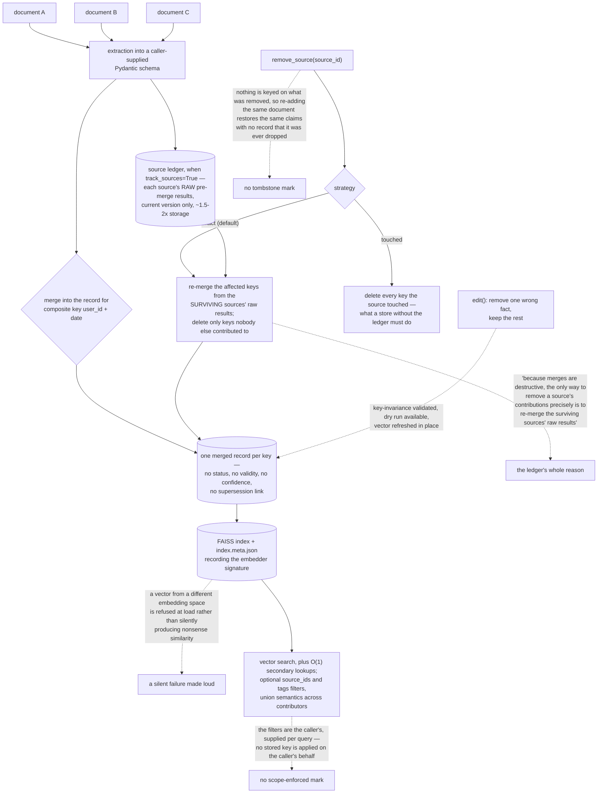

## 1. Executive Summary

OntoMem is "The Self-Consolidating Memory" — Apache-2.0, Python, version 0.6.0,
5,774 lines across 36 files, published to PyPI. Its pitch is a contrast: "[g]ive
your AI agent a 'coherent' memory, not just 'fragmented' retrieval." Rather than
appending extractions and ranking them later, it merges each new extraction into
the existing record for a composite key — `user_id + date`, say — so what the
store holds is one consolidated object per key rather than a pile of
observations about it.

**That design creates a problem, and the interesting part of this repository is
its answer.** A destructive merge cannot be undone from the merged result: once
three documents have been folded into one record, nothing in that record says
which of them contributed what, so removing one document means deleting
everything it touched. The source ledger exists for exactly that, and says so:

> "because merges are destructive, the only way to remove a source's
> contributions precisely is to re-merge the surviving sources' raw results for
> the affected keys."

With `track_sources=True`, each document's raw pre-merge extraction is kept, and
`remove_source(strategy="exact")` recomputes every affected key from the
survivors while deleting only the keys nothing else contributed to. The coarse
strategy is kept and named rather than quietly avoided —
`strategy="touched"` deletes every key the source touched, which is what a store
without a ledger has to do. The cost is stated as a number, "~1.5-2x storage
overhead", and bounded deliberately: only the current version per source is
retained.

**Two smaller mechanisms are worth lifting.** The FAISS index writes an
`index.meta.json` companion recording the embedder signature and refuses vectors
from a different embedding space, which converts a silent
similarity-is-nonsense failure into a refusal at load. And `edit()` — removing
one wrong fact from a record without rewriting the rest — validates
key-invariance and offers a dry run, so a semantic edit cannot quietly move the
record to a different key.

**What is absent is epistemic state.** A merged record carries no status, no
validity interval, no recorded-at, no confidence and no supersession link. The
store answers with the current merged value for a key and has no vocabulary for
a claim that has stopped being true, one nobody has checked, or one a person
corrected. That is a coherent choice for the consolidation problem it is solving
and it is the reason this report carries no capability marks.

## 2. Mental Model

A **key** is the unit, and the record under it is always current.

A **merge** is destructive, which is why the inputs are kept.

A **rollback** is a re-merge of whoever is left.

An **index** refuses vectors that came from a different embedder.

## 3. Architecture

| Area | Role |
| --- | --- |
| `ontomem/core/omem.py` | The store: add, merge, search, index maintenance, rollback |
| `ontomem/core/sources.py` | The ledger entry, and the argument for keeping it |
| `ontomem/merger/classic_merger` | Deterministic merging |
| `ontomem/merger/llm_merger` | Model-assisted merging and semantic editing |
| `tests/` | Unit, integration and fixture suites over the merge and rollback paths |

## 4. Essential Implementation Paths

`ontomem/core/sources.py:1-9` — why a consolidating store has to keep its
inputs.

`ontomem/core/omem.py:936-948` — the two rollback strategies, and what each
costs.

`ontomem/core/omem.py:1264`, `:1282-1299`, `:1354-1355` — the embedder signature
written and checked.

## 5. Memory Data Model

One merged record per composite key, shaped by a Pydantic model the caller
defines, with secondary lookups mapping custom keys to primary keys by
reference rather than by copying data. When the ledger is on, each contributing
document's raw extraction sits beside the merged result, one current version per
source.

## 6. Retrieval Mechanics

Vector search over the merged records with FAISS, O(1) secondary lookups for
queries by a non-primary attribute, and an optional restriction to named source
ids or tags — matching a key when any of its contributing sources fits the
filter, which is the right semantics for attribution and the wrong one for
isolation.

## 7. Write Mechanics

`add(items, source_id=...)` extracts and merges. `sync_index()` patches the
vector index in place rather than rebuilding it, `suspended_index()` batches
mutations without dropping it, and `upsert_source()` replaces a document in one
step. Merging is either deterministic or LLM-assisted, chosen by the caller.

## 8. Agent Integration

None beyond the library: no server, no MCP surface, no hooks. It is a component
for a pipeline that already knows when to write.

## 9. Reliability, Safety, and Trust

The strong parts are the ledger, the embedder signature check, and the
key-invariance validation on a semantic edit. The absent part is any notion of a
claim's standing — the store holds the current merged value and has no way to
say that a value is suspect, expired, or corrected rather than simply replaced.

## 10. Tests, Evals, and Benchmarks

Unit, integration and fixture suites run in CI, covering merging, index
maintenance and the rollback strategies. There are no committed cases asserting
that particular material must not be retrieved, which follows from there being
no read path that withholds.

## 11. For Your Own Build

If your write path merges, keep the inputs. The moment you consolidate, you have
given up the ability to remove one contributor unless you stored what each one
contributed — and the day you need that is the day somebody asks you to delete a
document.

Name the coarse fallback and ship it beside the precise one. `strategy="touched"`
is what everyone else does by necessity; having both makes the cost of the
precise path visible.

Write your embedder's signature next to your index. A vector store silently
mixing two embedding spaces returns plausible nonsense, and a signature turns
that into a refusal.

## 12. Open Questions

Whether a status field is wanted on a merged record. The consolidation model
assumes the newest extraction is the best one, which holds for daily snapshots
and does not hold for a fact somebody later disputes.

Whether the ledger should become append-only. Keeping one current version per
source bounds the overhead and is what makes rollback exact; it also means the
store cannot say what a key looked like before the last merge, which is a
question the same users will eventually ask.

## Appendix: File Index

| Path | What to read it for |
| --- | --- |
| `ontomem/core/sources.py:1-9` | The clearest statement of why a merging store needs a ledger |
| `ontomem/core/omem.py:936-948` | Exact rollback beside the coarse one it replaces |
| `ontomem/core/omem.py:1282-1299` | An embedder signature that makes a silent failure loud |

## History

**2026-09-16** — [`154bf488ebffc9d4e99df62f6b416195bbbb23f1`](https://github.com/yifanfeng97/ontomem/commit/154bf488ebffc9d4e99df62f6b416195bbbb23f1) — first reading, at a commit dated 4 September 2026. Screened before opening, from a shallow clone: four files scanned, no auto-run surfaces, one build-time execution point, no unpinned surfaces and nothing inside the seven-day cooldown, with `uv.lock` present. Nothing was installed, built or run, and no embedding model was loaded.
