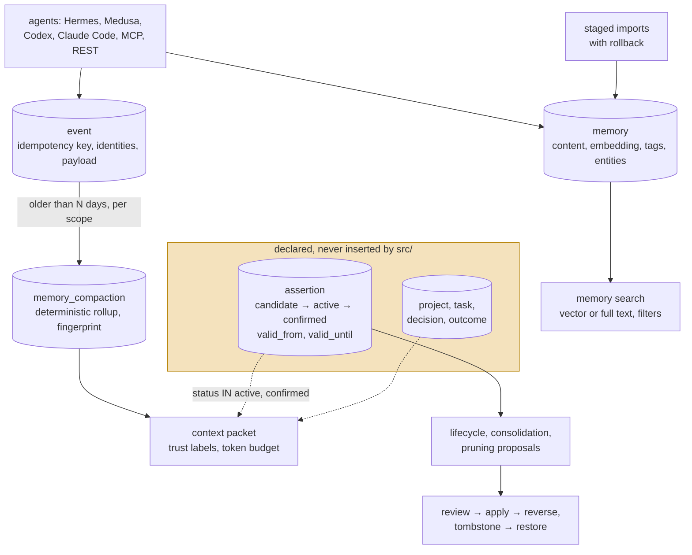

## 1. Executive Summary

Open Brain describes itself as "the user-owned memory and continuity layer for
coding agents". Version 1.0.2, 215 commits since 2 March 2026, almost all by one
author, about 12,500 lines of Python and 212 test functions in 45 files. The README
badge says MIT; the repository contains no licence file.

The design, set out in the README and in 15 SQL migrations, separates three
things: **canonical evidence** (append-only events, sessions, imports),
a **knowledge model** (assertions with statuses, projects, tasks, decisions,
outcomes), and **retrieval projections** (embeddings, caches, context packets).
The governance around the knowledge model is detailed and well considered:

- An `assertion` carries a status of `candidate`, `active`, `confirmed`,
  `superseded`, `contradicted`, `dormant`, `archived` or `deleted`, with authority,
  confidence, a temporal class, `valid_from` and `valid_until`, and evidence rows
  that support, contradict, qualify or supersede it.
- Lifecycle, consolidation and pruning changes arrive as **proposals** a reviewer
  accepts or rejects, are **applied** as execution records that can be
  **reversed**, and pruning writes a **tombstone** with the full snapshot that
  can be restored.
- Context packets read only `active` and `confirmed` assertions and label each
  item with a trust level.

None of it runs. Across `src/`, the `INSERT` statements target `memory`, `event`,
`session`, `identity`, `identity_link`, the import tables, the compaction tables,
the context caches, and the proposal, execution and tombstone tables. Nothing
inserts into `assertion`, `assertion_evidence`, `decision`, `outcome`, `project`
or `task`, and no REST, MCP or CLI surface creates them; the only inserts into
`assertion` are in `tests/test_context_revision_triggers.py:70` and
`tests/test_context_feedback_scoring.py:44`. So every proposal generator finds no
assertions to propose on, every review endpoint has nothing to review, and the
structured half of a context packet is empty.

What does run is simpler: a `memory` table searched by embedding or full text, an
idempotent event log with identities and sessions, deterministic rollups of old
events per scope, staged imports with rollback, and adapters for Hermes, Medusa,
Codex and Claude Code.

No capability mark. Each mark the design reaches for sits on the unwritten
tables.

## 2. Mental Model

Two layers exist in the schema; one exists in practice.



A live memory is present until the database is edited by hand: no code path
deletes or updates a `memory` row except the attribution backfill that stamps
`captured_by` (`src/db/attribution.py:192`). Events have `archived_at` and
`deleted_at` columns and no writer of either. Event rollups are the only live
supersession: a new rollup for the same scope and event type marks the previous
one `superseded`.

The marks the design would earn are all on the unwritten side. `trust_state`,
`bitemporal`, `tombstone` and `human_review` have schema, readers, reviewed
executions and tests, and no producer of the rows they act on.

## 3. Architecture

| Area | Where | Role |
| --- | --- | --- |
| Memory | `src/db/queries.py`, `src/extractors/`, `src/embedder/` | Store with tagging and entity extraction, search, stats |
| Continuity | `src/db/continuity_queries.py`, `src/db/scope_queries.py` | Events, identities, sessions |
| Compaction | `src/compaction/engine.py`, `src/db/compaction_queries.py` | `event-rollup-v1` summaries of old events |
| Context | `src/context/builder.py`, `cache.py` | Trust-labelled packets, revision-keyed cache, feedback |
| Governance | `src/lifecycle/`, `src/pruning/`, `src/db/{lifecycle,consolidation,pruning}_queries.py` | Proposals, review, apply, reverse, tombstones |
| Imports | `src/importers/`, `src/ingestion/`, `src/connectors/` | Hermes, Mem0, Honcho, Hindsight, Gmail Takeout, Telegram, WhatsApp, Claude Code logs, file watcher |
| Interfaces | `src/main.py` (MCP), `src/api/` (FastAPI), `src/cli/`, `ui/dashboard.py` | |
| Adapters | `src/openbrain_hermes_plugin/`, `openbrain_medusa_adapter/`, `openbrain_codex_adapter/` | Lifecycle bridges with local spools |

### Deployment and ergonomics

- **What has to run:** PostgreSQL with pgvector and the FastAPI service, via
  Docker Compose or `install.sh`; an embedding provider for semantic search.
- **Authentication:** API keys, request size and rate limits, explicit CORS.
- **Hand-repairable:** yes, as ordinary SQL tables.
- A Docker-based command sandbox (`src/sandbox/`) is included beside the memory
  service.

The screen of this checkout found no auto-running configuration, one build-time
execution point, two unpinned surfaces, no manifests inside the seven-day
cooldown, and `AGENTS.md` read as data. Nothing was installed or run.

## 4. Essential Implementation Paths

- **Store memory** — the `INSERT INTO memory` in `src/db/queries.py:57`, reached
  from MCP `memory_store`, `POST /memories` (`src/api/main.py:159`) and the CLI.
- **Search** — `search_memories` (`src/db/queries.py:83`): embedding similarity
  or full text, with `source`, `tags` and date filters and no identity filter.
- **Events** — `ingest_event` (`src/db/continuity_queries.py:53`), idempotent on
  `idempotency_key`.
- **Sessions and identities** — `resolve_identity`, `open_session`,
  `close_session` in `src/db/scope_queries.py`.
- **Compaction** — `compact_events` (`src/db/compaction_queries.py:36`): events
  older than a threshold for a user, workspace, session, project or task scope,
  summarised deterministically, inserted with `ON CONFLICT DO NOTHING` on the
  source fingerprint, superseding the previous active rollup.
- **Context packets** — `build` in `src/context/builder.py`:
  `fetch_structured_context` (projects, tasks, decisions, outcomes, and
  assertions with `status IN ('active','confirmed')`, `src/db/context_queries.py:130-150`)
  plus `fetch_active_compactions`, each item labelled by `_trust` (`:27`).
- **Proposals** — `POST /proposals/generate`, `/review`, `/apply`, and reverse or
  restore routes in `src/api/lifecycle.py`, `consolidation.py` and `pruning.py`,
  with tombstones inserted at `src/db/pruning_queries.py:123`.

The searches behind the central finding:

```sh
grep -rhoE "INSERT INTO [a-z_]+" src | sort | uniq -c
grep -rn "INSERT INTO assertion" src tests
```

## 5. Memory Data Model

`memory` (`001_base_schema.sql:9-25`): `id`, `source`, `source_id`,
`captured_by`, `content`, `raw_content`, `embedding vector(768)`, `entities`,
`tags`, `tag_sources`, `importance`, `created_at`, `original_date`, `language`,
`metadata`, with HNSW, GIN and full-text indexes.

`event` (`002_continuity_foundation.sql:81-103`): type, unique idempotency key,
source system and record, user, agent and workspace identities, session, project
and task references, causation and correlation ids, authority, sensitivity,
retention policy, payload, occurred and ingested times, and unwritten
`archived_at` and `deleted_at`.

`assertion` (`:105-131`) and `assertion_evidence` (`:133-146`) are described in
section 1. `assertion_tombstone` (`010_assertion_pruning_tombstones.sql:24-38`)
holds the pruned assertion's snapshot, previous status and a retention deadline,
keyed by assertion and proposal — a restorable archive, not a record of a
rejected value.

**Scope.** Events carry identities and sessions, and rollups are per scope, but
the memory table has no user, project or workspace column and search applies
none. `scope_enforced` is withheld.

## 6. Retrieval Mechanics

Memory search runs either a pgvector cosine query or a PostgreSQL full-text
query, filtered by source, tags and dates, ordered by score and limited. Related
memories, entity lookups, today's memories and trend reports are further reads
over the same table.

Context packets are the continuity surface: diversity-ordered warnings, next
actions, decisions, tasks, assertions, projects and outcomes, labelled
`user_confirmed`, `tool_observed`, `curated_memory`, `inferred`, `stale` or
`contradicted`, packed under a token estimate and cached by a revision number that
database triggers bump when the underlying rows change. Feedback on a packet is recorded per item in `context_feedback_application`,
linked to the cited assertion; nothing in `src/` increments the `useful_count` and
`harmful_count` the lifecycle policy reads. With no
assertions, projects or tasks in the database, a packet for a project or task
carries only event rollups for that scope — and events can reference a project or
task only by a foreign key to rows nothing creates.

## 7. Write Mechanics

`memory_store` extracts tags and entities and embeds synchronously; the memory is
searchable when the call returns. Events are written idempotently, so adapter
replays from a local spool after an outage do not duplicate. The Hermes provider
covers recall, remember, prefetch, turn sync, session switch, compression,
delegation and session end; the Medusa and Codex adapters bridge their hosts'
lifecycles.

Imports are staged, resumable and reversible per run (`003_import_rollback.sql`),
and the README states the policy that imported records "retain authority and
provenance until reconciliation classifies them". The classification into
assertions is the step that is not implemented.

The maintenance orchestrator runs compaction and the three proposal generators
under bounds; only compaction has input.

## 8. Agent Integration

MCP tools for search, store, related memories, entities, today's memories and
stats; a REST API with OpenAPI docs for memories, continuity, context, imports,
compaction, maintenance and proposals; a CLI; a Streamlit dashboard with a
settings page; and a provider SDK with a conformance suite (`test_provider_conformance.py`)
for additional hosts.

## 9. Reliability, Safety, and Trust

**The ingestion discipline is real.** Idempotency keys, spools with retry,
quarantine and dead-letter files, staged imports with rollback, retry-aware
database access and checksum-protected migrations.

**The trust model is not.** The trust labels that do appear in a packet come
from event rollups and constant labels in the builder; the status-based
distinctions — candidate versus confirmed, contradicted, superseded — cannot
apply to anything.

**Every automated change is designed to be reviewed and reversed**, and that
design is the part to study: a proposal carries a snapshot and a fingerprint so a
stale proposal cannot apply, an execution records the previous status so it can
be reversed, and a tombstone keeps enough to restore. It has been built ahead of
the data it governs.

**Injection.** Imported chat exports and logs are stored as memories and returned
by search; nothing marks them as lower-authority text in the live path.

## 10. Tests, Evals, and Benchmarks

212 test functions in 45 files, covering adapters and the provider contract,
importers, compaction, context packet models, caching, diversity and revision
triggers, and the assertion lifecycle, consolidation and pruning machinery — the
last group seeding `assertion` rows directly in SQL, which is how those tests can
pass while production never creates one. None was run for this report.

No test asserts that particular material is excluded from a memory search or a
context packet with a positive control beside it; the `not in` assertions in the
suite check configuration secrets, SQL text and payload keys. `negative_eval` is
withheld. No benchmark is committed and no paper is cited.

## 11. For Your Own Build

### Steal

- **Idempotency keys on every event** and a local spool with quarantine and
  dead-letter handling for adapters.
- **Deterministic rollups with a source fingerprint** that supersede rather than
  delete.
- **The review, apply and reverse shape for automated changes** — snapshot,
  fingerprint to detect staleness, previous state kept for reversal, a
  restorable tombstone.
- **Staged, reversible imports** that keep provenance.

### Avoid

- **Governance before the data it governs.** A status machine, review queues and
  receipts over a table with no writer pass their tests and do nothing. Write the
  producer first, or test from the entry point a user reaches.
- **Tests that seed the table production never fills.**
- **A licence badge without a licence file.**

### Fit

As it stands, Open Brain is a pgvector memory store with good event ingestion and
host adapters, suitable for a single user who wants coding-agent memories and
session continuity in their own Postgres. The assertion model is a design worth
reading and a roadmap, not a capability; anyone adopting it for its governance
should expect to write the reconciliation step that turns events and imports into
assertions.

## 12. Open Questions

- **Where will assertions come from?** The README's reconciliation step names the
  classification; no code performs it.
- **Are projects and tasks meant to be created by adapters** through an endpoint
  not yet written?
- **What licence governs the code** in the absence of a licence file?

## Appendix: File Index

- `src/db/migrations/001_base_schema.sql` through `015_embedding_dim_change.sql`
- `src/db/queries.py`, `continuity_queries.py`, `scope_queries.py`, `compaction_queries.py`, `context_queries.py`
- `src/db/lifecycle_queries.py`, `consolidation_queries.py`, `pruning_queries.py`
- `src/context/builder.py`, `src/compaction/engine.py`
- `src/api/main.py`, `lifecycle.py`, `consolidation.py`, `pruning.py`, `context.py`, `continuity.py`
- `src/main.py` — MCP server
- `src/openbrain_hermes_plugin/`, `src/openbrain_medusa_adapter/`, `src/openbrain_codex_adapter/`
- `tests/test_context_revision_triggers.py`, `test_context_feedback_scoring.py`, `test_assertion_lifecycle.py`, `test_assertion_pruning_execution.py`

## History

**2026-09-15** — [`02a7e65a8064a04ad91d77ddbe9dc048d6746153`](https://github.com/benclawbot/open-brain/commit/02a7e65a8064a04ad91d77ddbe9dc048d6746153) — first reading, at a commit dated 7 September 2026. Screened before opening: no auto-running configuration, one build-time execution point, two unpinned surfaces, no manifests inside the seven-day cooldown, and `AGENTS.md` read as data. Nothing was installed or run.
