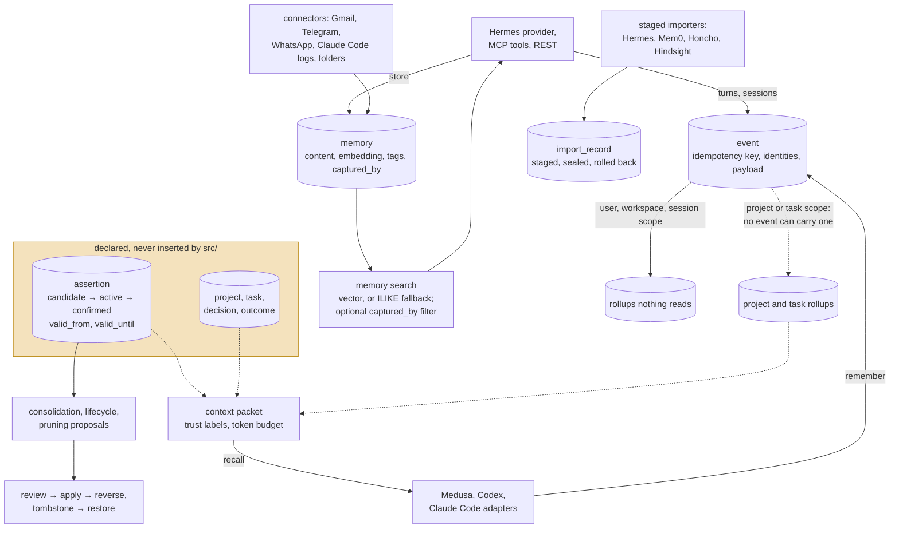

## 1. Executive Summary

Open Brain is a PostgreSQL and pgvector memory service for coding agents, which
it describes as "the user-owned memory and continuity layer for coding agents".
Its notable part is a governance design: assertions with candidate-to-confirmed
statuses, reviewed and reversible changes, restorable tombstones. Its weakness is
that no code in the service writes the tables that design governs, so what runs
is a flat memory table and a write-only event log.

The design, set out in the README and the migrations, separates three
things: **canonical evidence** (append-only events, sessions, imports),
a **knowledge model** (assertions with statuses, projects, tasks, decisions,
outcomes), and **retrieval projections** (embeddings, caches, context packets).
The governance around the knowledge model is detailed and well considered:

- An `assertion` carries a status of `candidate`, `active`, `confirmed`,
  `superseded`, `contradicted`, `dormant`, `archived` or `deleted`, with authority,
  confidence, a temporal class, `valid_from` and `valid_until`, and evidence rows
  that support, contradict, qualify or supersede it.
- Lifecycle, consolidation and pruning changes arrive as **proposals** a reviewer
  accepts or rejects, are **applied** as execution records that can be
  **reversed**, and pruning writes a **tombstone** with the full snapshot that
  can be restored.
- Context packets read `active` and `confirmed` assertions unless the caller asks
  for history, and label each item with a trust level.

None of it runs. Across the tree, `INSERT` statements in `src/` target `memory`,
`event`, `session`, `identity`, `identity_link`, the import tables, the
compaction tables, the context caches, the feedback table, and the proposal,
execution and tombstone tables. Nothing in `src/` inserts into `assertion`,
`assertion_evidence`, `decision`, `outcome`, `project` or `task`. The only
inserts into those tables are two database tests
(`tests/test_context_revision_triggers.py:32-70`,
`tests/test_context_feedback_scoring.py:44`).

The consequence reaches past the governance layer. Events reference a project or
task by a foreign key to rows nothing creates
(`002_continuity_foundation.sql:91-92`), so no event carries one, no project or
task rollup can be built, and every context packet is empty unless rows
are inserted by hand. The Medusa, Codex and
Claude Code adapters remember into the event log and recall context packets, so
what they store never comes back. The Hermes provider and the MCP tools are the
one closed loop: they write and search the `memory` table.

No capability mark. Each mark the design reaches for sits on the unwritten
tables; the memory table's one scope-shaped filter is optional.

## 2. Mental Model

Two layers exist in the schema; one exists in practice.


```mermaid
%% caption: which writes reach a read, and which stop at a table nothing reads or a table nothing fills
flowchart TB
    HM["Hermes provider,<br/>MCP tools, REST"] -->|store| MEM[("memory<br/>content, embedding, tags, captured_by")]
    CONN["connectors: Gmail, Telegram,<br/>WhatsApp, Claude Code logs, folders"] --> MEM
    MEM --> SEARCH["memory search<br/>vector, or ILIKE fallback;<br/>optional captured_by filter"]
    SEARCH --> HM
    AD["Medusa, Codex,<br/>Claude Code adapters"] -->|remember| EV[("event<br/>idempotency key, identities, payload")]
    HM -->|"turns, sessions"| EV
    EV -->|"user, workspace, session scope"| RU[("rollups nothing reads")]
    EV -.->|"project or task scope:<br/>no event can carry one"| RP[("project and task rollups")]
    STG["staged importers:<br/>Hermes, Mem0, Honcho, Hindsight"] --> IR[("import_record<br/>staged, sealed, rolled back")]
    subgraph UNWRITTEN["declared, never inserted by src/"]
      AS[("assertion<br/>candidate → active → confirmed<br/>valid_from, valid_until")]
      PROJ[("project, task,<br/>decision, outcome")]
    end
    AS --> PROP["consolidation, lifecycle,<br/>pruning proposals"]
    PROP --> REV["review → apply → reverse,<br/>tombstone → restore"]
    AS -.-> PKT["context packet<br/>trust labels, token budget"]
    PROJ -.-> PKT
    RP -.-> PKT
    PKT -->|recall| AD

    style UNWRITTEN fill:#f4e2bd,stroke:#b8860b
```

A live memory is present until the database is edited by hand. No code path
deletes a `memory` row, and the one `UPDATE memory` rewrites the embedding: MCP
`memory_regenerate_embedding` and `POST /memories/{id}/regenerate-embedding` fill
a missing vector, or replace one when forced (`src/db/attribution.py:182-200`).
Events have `archived_at` and `deleted_at` columns and no writer of either.
Event rollups are the only live supersession: a new rollup for the same scope and
event type marks the previous one `superseded`
(`src/db/compaction_queries.py:88-93`).

Imports take two paths. The connectors
insert straight into `memory` with no staging. The staged importers write
`import_record` rows that can be sealed or rolled back, and nothing promotes a
staged record into memory or assertions: no call to `record_import_candidate`
passes an `object_id` (`src/importers/runner.py:86-91`).

The marks the design would earn are all on the unwritten side. `trust_state`,
`bitemporal`, `tombstone` and `human_review` have schema, readers, reviewed
executions and tests, and no producer of the rows they act on.

## 3. Architecture

| Area | Where | Role |
| --- | --- | --- |
| Memory | `src/db/attribution.py`, `src/db/queries.py`, `src/extractors/`, `src/embedder/` | Store with tagging and entity extraction, search, stats; MCP and REST use `attribution.py`, the CLI and connectors `queries.py` |
| Continuity | `src/db/continuity_queries.py`, `src/db/scope_queries.py` | Events, identities, sessions |
| Compaction | `src/compaction/engine.py`, `src/db/compaction_queries.py` | `event-rollup-v1` summaries of old events |
| Context | `src/context/builder.py`, `cache.py` | Trust-labelled packets, revision-keyed cache, feedback |
| Governance | `src/lifecycle/`, `src/consolidation/`, `src/pruning/`, `src/db/{lifecycle,consolidation,pruning}_queries.py` | Proposals, review, apply, reverse, tombstones |
| Maintenance | `src/maintenance/orchestrator.py` | Bounded, failure-isolated maintenance steps |
| Imports | `src/importers/` (staged), `src/connectors/`, `src/ingestion/` (direct) | Hermes, Mem0, Honcho, Hindsight; Gmail Takeout, Telegram, WhatsApp, Claude Code logs, file watcher |
| Interfaces | `src/main.py` (MCP), `src/api/` (FastAPI), `src/cli/`, `ui/dashboard.py` | |
| Adapters | `src/openbrain_hermes_plugin/`, `openbrain_medusa_adapter/`, `openbrain_codex_adapter/`, `openbrain_claude_adapter/` | Lifecycle bridges with local spools |

### Deployment and ergonomics

- **What has to run:** PostgreSQL with pgvector and the FastAPI service, via
  Docker Compose or `install.sh`; an embedding provider for semantic search.
- **Authentication:** one shared API key, required by default only when
  `OPENBRAIN_ENV` is production (`src/api/operations.py:41-53`); request size and
  rate limits and explicit CORS apply regardless.
- **Hand-repairable:** yes, as ordinary SQL tables.
- A Docker-based command sandbox (`src/sandbox/`) is included beside the memory
  service.

The screen of this checkout found no auto-running configuration, one build-time
execution point (`tests/e2e/conftest.py`), two unpinned surfaces, no manifests
inside the seven-day cooldown, and `AGENTS.md` read as data. Nothing was
installed or run.

## 4. Essential Implementation Paths

- **Store memory** — `insert_memory` in `src/db/attribution.py:33`, reached from
  MCP `memory_store` and `POST /memories` (`src/api/main.py:159`), records an
  optional `captured_by`. The CLI and the connectors use the older
  `insert_memory` in `src/db/queries.py:13`, which has no `captured_by`.
- **Search** — `search_memories` (`src/db/attribution.py:81`): embedding
  similarity, or `content ILIKE` when the query has no embedding, with `source`,
  `tags`, `captured_by` and date filters, each applied only when passed. The CLI
  uses the older copy in `src/db/queries.py:83`, without `captured_by`.
- **Events** — `ingest_event` (`src/db/continuity_queries.py:53`), idempotent on
  `idempotency_key`.
- **Sessions and identities** — `resolve_identity`, `open_session`,
  `close_session` in `src/db/scope_queries.py`.
- **Compaction** — `compact_events` (`src/db/compaction_queries.py:36`): events
  older than a threshold for a user, workspace, session, project or task scope,
  summarised deterministically, inserted with `ON CONFLICT DO NOTHING` on the
  source fingerprint, superseding the previous active rollup.
- **Context packets** — `build_context_packet` in `src/context/builder.py:82`:
  `fetch_structured_context` (projects, tasks, decisions, outcomes, and
  assertions, `src/db/context_queries.py:131-153`) plus
  `fetch_active_compactions` for project and task scopes only
  (`src/db/compaction_queries.py:98-116`), each item labelled by `_trust` (`:27`).
- **Proposals** — `/v1/lifecycle`, `/v1/consolidation` and `/v1/pruning` routes
  for generate, review, apply, and reverse or restore (`src/api/lifecycle.py`,
  `consolidation.py`, `pruning.py`), with tombstones inserted at
  `src/db/pruning_queries.py:123`.

## 5. Memory Data Model

`memory` (`001_base_schema.sql:9-25`): `id`, `source`, `source_id`,
`captured_by`, `content`, `raw_content`, `embedding vector(768)`, `entities`,
`tags`, `tag_sources`, `importance`, `created_at`, `original_date`, `language`,
`metadata`, with HNSW, GIN and full-text indexes. No query uses the full-text
index. Only the sample-data script `scripts/import_sample.py` supplies
`original_date`, and no read filters on it.

`event` (`002_continuity_foundation.sql:81-103`): type, unique idempotency key,
source system and record, user, agent and workspace identities, session, project
and task references, causation and correlation ids, authority, sensitivity,
retention policy, payload, occurred and ingested times, and unwritten
`archived_at` and `deleted_at`.

`assertion` (`:105-131`) and `assertion_evidence` (`:133-146`) are described in
section 1. `assertion_tombstone` (`010_assertion_pruning_tombstones.sql:24-38`)
holds the pruned assertion's snapshot, previous status and a retention deadline,
keyed by assertion and proposal — a restorable archive, not a record of a
rejected value. The import rollback's `tombstone` column on `import_record`
(`003_import_rollback.sql:12`) is keyed on the record in the same way.

**Scope.** The memory table carries `captured_by` and no user, project or
workspace column. Search filters on it only when the caller passes it, and the
Hermes provider's recall does not (`src/openbrain_hermes_plugin/__init__.py:173-177`).
Rollups carry a scope and the context builder filters on it, for project and task
scopes that no event can reach. `scope_enforced` is withheld.

## 6. Retrieval Mechanics

Memory search embeds the query and runs a pgvector cosine query over rows with a
non-null embedding. When the query cannot be embedded it falls back to a
substring `ILIKE`, ordered by importance and recency. A memory stored while the
embedding provider was down has a null vector and is invisible to vector search
until its embedding is regenerated. Related memories, entity lookups, today's
memories and trend reports are further reads over the same table.

Context packets are the continuity surface: diversity-ordered warnings, next
actions, decisions, tasks, assertions, projects and outcomes, labelled
`user_confirmed`, `tool_observed`, `curated_memory`, `inferred`, `stale` or
`contradicted`, packed under a token estimate and cached by a revision number.
Triggers bump the revision on changes to `project`, `task`, `decision`, `outcome`
and `assertion` (`004_context_revision_triggers.sql:153-176`). With
`include_history` set, the assertion read drops its status predicate
(`src/db/context_queries.py:132-141`).

Feedback on a packet is recorded per item in `context_feedback_application`, and
for an item naming an existing assertion it increments `access_count`,
`useful_count` or `harmful_count` (`src/db/context_queries.py:245-257`), which the
lifecycle and pruning policies read. The feedback event itself is upserted, so a
second submission for the same packet replaces the first payload (`:196-205`).

## 7. Write Mechanics

`memory_store` extracts tags and entities and embeds synchronously; the memory is
searchable when the call returns, by vector if the embedding succeeded and by
substring otherwise. Events are written idempotently, so adapter replays from a
local spool after an outage do not duplicate. The Hermes provider covers recall,
remember, prefetch, turn sync, session switch, compression, delegation and
session end; the Medusa, Codex and Claude Code adapters bridge their hosts'
lifecycles through `remember` into `POST /v1/events` and `recall` from
`POST /v1/context` (`src/providers/client.py:61-93`).

Staged imports are resumable, sealable and reversible per run
(`003_import_rollback.sql`, `src/importers/staging.py`), and the README states the
policy that imported records "retain authority and provenance until
reconciliation classifies them". The classification into assertions, and any
promotion out of `import_record`, is the step that is not implemented. The
connectors bypass staging and write memories directly.

The maintenance orchestrator runs consolidation and pruning proposal generation,
cache cleanup, a tombstone retention report, and compaction when given a project
or task id (`src/maintenance/orchestrator.py:97-156`). Lifecycle proposals are
generated only through their REST route. The retention report queries
`assertion_tombstones` (`:49`) where the table is `assertion_tombstone`, so the
step fails and is recorded as failed. The orchestrator test patches that function
out (`tests/test_maintenance_orchestration.py:12`).

## 8. Agent Integration

MCP tools for search, store, embedding regeneration, related memories, entities,
today's memories, stats and a weekly report; a REST API with OpenAPI docs for
memories, continuity, context, imports, compaction, maintenance and proposals; a
CLI; a Streamlit dashboard with a settings page; and a provider SDK with a
conformance suite (`test_provider_conformance.py`) for additional hosts.

## 9. Reliability, Safety, and Trust

**The ingestion discipline is real.** Idempotency keys, spools with retry,
quarantine and dead-letter files (`src/providers/reconciliation.py`), staged
imports with rollback, retry-aware database access and checksum-protected
migrations (`src/db/migrate.py:72-80`).

**The trust model is not.** The trust labels that do appear in a packet come
from constant labels in the builder; the status-based distinctions — candidate
versus confirmed, contradicted, superseded — cannot apply to anything.

**Every automated change is designed to be reviewed and reversed**, and that
design is the part to study: a proposal carries a snapshot and a fingerprint so a
stale proposal cannot apply, apply refuses anything not `accepted`
(`src/lifecycle/execution.py:40`), an execution records the previous status so it
can be reversed, and a tombstone keeps enough to restore. It has been built ahead
of the data it governs. The reviewer is a `reviewed_by` string in the request
body (`src/api/proposals.py:13-20`), accepted under the same single API key the
adapters hold, so the review is attributed rather than verified.

**Injection.** Imported chat exports and logs are stored as memories and returned
by search beside the agent's own. The MCP formatter prints each result's `source`
(`src/main.py:322`); the Hermes provider's prompt block prints content alone
(`src/openbrain_hermes_plugin/__init__.py:178`), so imported text reaches that
model with no marker of where it came from.

## 10. Tests, Evals, and Benchmarks

212 test functions in 45 files, covering adapters and the provider contract,
importers, compaction, context packet models, caching, diversity and revision
triggers, and the assertion lifecycle, consolidation and pruning machinery. The
governance tests build assertions as in-memory inputs to pure policy and
validation functions; two database tests seed `project`, `task`, `decision` and
`assertion` rows directly in SQL. Neither kind reaches a path production uses to
create those rows. None was run for this report.

Several tests assert SQL text rather than behaviour: that the compaction read
contains `WHERE status='active'` and that search contains
`captured_by = ANY(%s)` (`tests/test_compaction_retrieval_contract.py:8-10`,
`tests/test_agent_attribution.py:45-59`). No test asserts that particular
material is excluded from a memory search or a context packet over a populated
result with a positive control beside it; the `not in` assertions in the suite
check configuration secrets, SQL text and payload keys. `negative_eval` is
withheld. No benchmark is committed and no paper is cited.

## 11. For Your Own Build

### Steal

- **Idempotency keys on every event** and a local spool with quarantine and
  dead-letter handling for adapters.
- **Deterministic rollups with a source fingerprint** that supersede rather than
  delete.
- **The review, apply and reverse shape for automated changes** — snapshot,
  fingerprint to detect staleness, previous state kept for reversal, a
  restorable tombstone.
- **Staged, sealable imports** that keep provenance.

### Avoid

- **Governance before the data it governs.** A status machine, review queues and
  receipts over a table with no writer pass their tests and do nothing. Write the
  producer first, or test from the entry point a user reaches.
- **A foreign key to a table nothing fills.** It turns every scope that names it
  into one no row can carry, and the read path that filters on it returns
  nothing.
- **Tests that assert the SQL string, or patch out the function under test.**
  The misnamed tombstone table passes because the test replaces the query.
- **A licence declaration without a licence file.**

### Fit

As it stands, Open Brain is a pgvector memory store with good event ingestion and
host adapters, suitable for a single user who wants coding-agent memories in
their own Postgres through Hermes or MCP. The Medusa, Codex and Claude Code
adapters do not recall what they remember. The assertion model is a design worth
reading and a roadmap, not a capability; anyone adopting it for its governance
should expect to write the reconciliation step that turns events and imports into
assertions, and a producer for projects and tasks.

## 12. Open Questions

- **Where will assertions come from?** The README's reconciliation step names the
  classification; no code performs it.
- **Are projects and tasks meant to be created by adapters** through an endpoint
  not yet written?
- **What licence governs the code** in the absence of a licence file?

## Appendix: File Index

- `src/db/migrations/001_base_schema.sql` through `015_embedding_dim_change.sql`
- `src/db/attribution.py`, `queries.py`, `continuity_queries.py`, `scope_queries.py`, `compaction_queries.py`, `context_queries.py`
- `src/db/lifecycle_queries.py`, `consolidation_queries.py`, `pruning_queries.py`, `import_queries.py`
- `src/context/builder.py`, `src/compaction/engine.py`, `src/maintenance/orchestrator.py`, `src/importers/runner.py`, `src/importers/staging.py`
- `src/api/main.py`, `lifecycle.py`, `consolidation.py`, `pruning.py`, `proposals.py`, `context.py`, `continuity.py`, `operations.py`
- `src/main.py` — MCP server
- `src/providers/client.py`, `src/openbrain_hermes_plugin/`, `src/openbrain_medusa_adapter/`, `src/openbrain_codex_adapter/`, `src/openbrain_claude_adapter/`
- `tests/test_context_revision_triggers.py`, `test_context_feedback_scoring.py`, `test_assertion_lifecycle.py`, `test_assertion_pruning_execution.py`, `test_agent_attribution.py`, `test_compaction_retrieval_contract.py`, `test_maintenance_orchestration.py`

### Recorded searches

Run at the tree root of the pinned checkout.

```sh
# INSERT targets across the whole tree, and where the knowledge tables are written
grep -rhoiE "INSERT INTO [a-z_.\"]+" --exclude-dir=.git . | tr 'A-Z' 'a-z' | sort | uniq -c
grep -rniE "insert into (assertion|assertion_evidence|project|task|decision|outcome)\b" --exclude-dir=.git .
# every UPDATE or DELETE of a memory or event row
grep -rniE "update +memory\b|delete from (memory|event)\b|archived_at|deleted_at" src ui scripts
# no full-text query, and no reader of original_date
grep -rniE "tsquery|ts_rank|websearch_to" src ui scripts
grep -rn "original_date" src scripts ui | grep -v "^src/db/"
# no promotion of staged import records
grep -rn "object_id" src/importers
# readers of rollups, and the scopes they pass
grep -rn "fetch_active_compactions" src
# negative assertions in the suite
grep -rnE "not in |assert not |== \[\]|assertNotIn" tests
# the tombstone table name the orchestrator queries
grep -rn "assertion_tombstones" --exclude-dir=.git .
# no licence file, and no paper
git ls-files | grep -iE "licen|copying"
grep -rniE "arxiv|bibtex|@article|@misc|citation|doi" README.md SPEC.md docs
```

## History

**2026-09-30** — [`02a7e65a8064a04ad91d77ddbe9dc048d6746153`](https://github.com/benclawbot/open-brain/commit/02a7e65a8064a04ad91d77ddbe9dc048d6746153) — audit at the unchanged pin, which is upstream HEAD. No mark moved. Eight published claims were wrong. MCP and REST store and search through `attribution.py`, whose search takes an optional `captured_by` filter; the text fallback is `ILIKE`, not full text. The one memory update regenerates embeddings, not attribution. Context feedback does increment `useful_count` and `harmful_count`. Staged imports never reach `memory`. The orchestrator generates no lifecycle proposals. Governance tests use in-memory inputs, not SQL seeding. Packets drop the status filter under `include_history`. Added: the Medusa, Codex and Claude Code adapters recall packets that are empty ([section 1](#1-executive-summary)), and the orchestrator queries a misnamed tombstone table ([section 7](#7-write-mechanics)). Screen unchanged; nothing installed, built or run.

**2026-09-15** — [`02a7e65a8064a04ad91d77ddbe9dc048d6746153`](https://github.com/benclawbot/open-brain/commit/02a7e65a8064a04ad91d77ddbe9dc048d6746153) — first reading, at a commit dated 7 September 2026. Screened before opening: no auto-running configuration, one build-time execution point, two unpinned surfaces, no manifests inside the seven-day cooldown, and `AGENTS.md` read as data. Nothing was installed or run.
