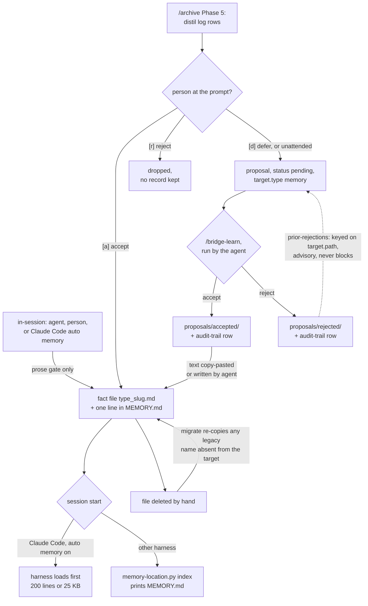

## 1. Executive Summary

open-bridge is a git repository of Markdown and YAML that a coding agent reads
at the start of every session: a registry of repos and clients, a task board, an
append-only work log, a shared `skills/` tree for Claude Code, Codex and Copilot
CLI, and a memory base of one Markdown file per fact behind a `MEMORY.md` index.
What is notable is how much of the harness's own behaviour it measures instead
of assuming: where Claude Code's auto memory actually writes, when its index is
truncated, and when a fact's link to its session transcript stops resolving.
What is weak is that every rule about who may write a memory is prose the agent
itself executes, and the documents disagree about who that writer is.

Memory here is a convention with tooling around it, not a store with an API.
`scripts/memory-location.py` resolves, reads, lints and migrates the directory
but never creates a fact. The agent, Claude Code's auto memory, or a person
writes the file. `/archive` Phase 5 proposes facts distilled from the work log,
and `scripts/learning-ledger.py` keeps the folder, frontmatter status and audit
trail of improvement proposals consistent.

The `agents/` directory is a separate product, an A2A endpoint that fronts a
persona, and its per-conversation memory is an LRU of turns
(`agents/_runtime/executor.py:12`). That is conversation-window management and
is not covered here; the
[scope note](../../families/#not-in-scope-conversation-window-management) says
why.

No capability mark. Section 9 names the seven withheld and the near miss for
each; `human_review`, `tombstone` and `trust_state` are the close ones.

## 2. Mental Model

A memory is a fact file. It becomes a belief when a file lands in the memory
directory with a line in `MEMORY.md`, because that index is what reaches the
next session. There is no candidate state on a fact and no model call in the
tree that writes one. It stops being a belief when someone deletes the file or
moves its index line to `MEMORY-ARCHIVE.md`, which the session read does not
load (`docs/memory.md:218-225`).

**Two routes are documented, and both are described as human-gated.** A fact
is saved in-session when *"you or the agent notice a durable fact"*, or
distilled from the work log by `/archive` Phase 5 (`docs/memory.md:19-35`). The
gate is `rules/learning-autonomy.md`: *"No automated process writes directly to
MEMORY.md"* (`:30-35`), and Layer C says `MEMORY.md` takes *"Manual writes
only"* (`:100-104`). Nothing in code enforces either sentence. The `enable`
subcommand points Claude Code's own auto memory, which writes on the model's
initiative, at `work/memory/` (`scripts/memory-location.py:383-435`).

**The only candidate state lives on a different object.** An archive
candidate the person defers becomes a proposal in
`work/_learning/proposals/` with `status: pending` and `target.type: memory`
(`skills/archive/references/workflow.md:192-218`). It is not in the memory
directory, so the index never carries it. Acceptance moves the proposal file to
`accepted/`; the fact itself is written separately, and at that point it has no
status at all.

**Who writes the accepted memory is stated three ways.** Archive Phase 5's
`[a]` writes *"the memory file and its one-line `MEMORY.md` index entry now"*
(`skills/archive/references/workflow.md:184`). `/bridge-learn` says memory
proposals *"produce a suggested entry text + path, user copy-pastes"*
(`skills/bridge-learn/SKILL.md:331-333`). Layer C says manual writes only.

## 3. Architecture

Nothing runs. The memory base is a directory of Markdown files, and every tool
around it is a Python 3 script invoked by the agent because a rule or skill
tells it to. There is no daemon, database, index, embedding or hook that
touches memory; `.claude/settings.json` registers one Stop hook, a work-log
drift check, and `bin/` does not mention memory.

**Two locations, one resolver.** The default is `work/memory/` in the repo.
The alternative is Claude Code's legacy path,
`~/.claude/projects/<encoded-root>/memory/`, where each `/` of the absolute
project path becomes `-`. `resolve_memory_dir` answers *where the harness
writes* from the first settings file holding `autoMemoryDirectory`, local then
project then user (`scripts/memory-location.py:129-170`). `resolve_read_dir`
answers *where a reader looks*, and prefers `work/memory/` when no setting
names a directory and that directory exists (`:628-644`). The split is
deliberate and tested (`scripts/tests/test_memory_location.py:1052`).

**Privacy is enforced by git plumbing.** The shipped `.gitignore` ignores
`/work/memory/` (`.gitignore:46`). `scripts/user-data.py` writes a
`work/.gitignore` negation only on a private origin (`:70`), and
`scripts/hooks/pre-push` refuses a push of any `work/memory/` path to a public
or unknown remote (`:74`). On a non-private clone, `git clean -x` deletes the
memory base with no warning, which the docs state (`docs/memory.md:179`).

### Deployment and ergonomics

Clone the template, make a private `origin`, run `bin/setup`. Memory needs
nothing further: a fresh clone has no memory base, and the first saved fact
creates it. No API key is involved. The store is plain Markdown, repairable in
any editor, and under git on a private instance, so `git log` and `git revert`
are the history and the rollback. `memory-location.py` imports only the
standard library; `learning-ledger.py` needs PyYAML.

## 4. Essential Implementation Paths

**Session read.** `rules/operations.md:39-44` tells every harness to run
`python3 scripts/memory-location.py index` in Phase 1. `cmd_index` prints the
resolved `MEMORY.md` (`scripts/memory-location.py:671-682`), unless
`_harness_already_loaded` decides Claude Code has already injected the same
file in full (`:647-668`). That test reads `CLAUDECODE`,
`CLAUDE_CODE_DISABLE_AUTO_MEMORY`, `autoMemoryEnabled`, whether the harness
directory equals the read directory, and whether the index exceeds the load
limit, in which case it prints anyway because the harness saw only the head.

**Fact read.** `cmd_get` refuses a key containing `/`, `\` or `..`, tries the
key and `key.md` as file names, then scans `*.md` for a frontmatter `name:`
match, and refuses a hit that resolves outside the directory, which catches a
symlink (`:703-724`).

**Lint.** `lint_memory_index` flags an index over 200 lines or 25 KB, a hook
over 120 characters, and a relative link to a missing file (`:253-297`).
`bridge-audit` check 11 runs it with `links` and flags memory files written in
gate language that have no rule (`skills/bridge-audit/SKILL.md:51`).

**Retention.** `build_links` counts facts carrying an `originSessionId` or a
`*.jsonl` path and checks each id against transcripts under the harness config
directory, warning when `bridge-config.yaml` declares a retention the harness
does not keep (`scripts/memory-location.py:753-799`).

**Migration.** `enable` writes an absolute `autoMemoryDirectory` into the
gitignored `.claude/settings.local.json` and refuses if that file is not
ignored (`:383-435`). `_migrate_plan` copies every legacy file absent from the
target, skips identical ones and reports differing ones as conflicts
(`:209-244`). `stub-legacy` replaces the legacy `MEMORY.md` with a pointer and
refuses while a migrate would still copy (`:518-575`).

**Distillation.** `/archive` Phase 5 is a procedure the agent follows over the
period's log rows before the reset, with accept, edit, reject and defer per
candidate (`skills/archive/references/workflow.md:112-243`).

**Proposal ledger.** `cmd_record` appends one audit-trail row after the file
has been moved and its status set, refusing a mismatched folder, a repeated
state and an `implemented` whose HEAD touches neither the proposal nor its
target (`scripts/learning-ledger.py:465-520`). `build_prior_rejections` lists
rejected proposals on exactly the same normalised `target.path` (`:329-345`).
`build_check` reports disagreement between folder, frontmatter and last trail
row (`:523-565`).

**Export.** `okf-export.py` adds memory facts as `memory` concepts only under
`--scope user` (`scripts/okf-export.py:1493-1494`), from `default_memory_dir`,
which calls `resolve_memory_dir` (`:892-931`).

## 5. Memory Data Model

| Field | Where | Notes |
| --- | --- | --- |
| file name | `<type>_<slug>.md` | the `links` counter recognises only `user`, `feedback`, `project` and `reference` prefixes (`scripts/memory-location.py:734`) |
| `name` | frontmatter | kebab slug; `get` and `[[wikilink]]` resolve by it |
| `description` | frontmatter | one line, described as the recall hook |
| `metadata.type` | frontmatter | one of the four types |
| `originSessionId` | frontmatter, optional | written by Claude Code; resolves only inside transcript retention |
| index line | `MEMORY.md` | `- [Title](file.md) — hook`, hook at most 120 characters |

There is no author, timestamp, status, confidence, scope or supersession field
on a fact. Time and authorship come from git on a private instance, and not at
all from the legacy directory, which is outside the repository.

**Scope is the instance.** The README's answer to separating clients is one
repository per client or company, and memory follows the repository. No key on
a fact names a client, workspace or persona. The exporter's `core`, `org` and
`user` scopes are a property of the export run, not of a fact.

The proposal is a second, richer record: `id`, `created`, `source.type` with
`archive-distill` among seven values, `evidence`, `severity`, `status`,
`scope`, `target`, optional `prior_rejections`, and lifecycle dates, validated
by a JSON Schema with `additionalProperties: false`
(`work/_learning/_schema.proposal.yaml`).

## 6. Retrieval Mechanics

Retrieval is loading the whole index and opening a file by name. Nothing ranks,
searches, embeds or filters. The index is the recall mechanism, and the
hook-line discipline in `docs/memory.md` exists because the model decides which
file to open from one line of text.

The load limit is the retrieval failure the tooling is built around. Claude
Code loads the first 200 lines or 25 KB of `MEMORY.md` (`docs/memory.md:162`),
so a fact whose line falls past the cut-off is on disk and never seen. `check`
reports the overflow, and `index` prints the full file under Claude Code when it
has overflowed. The first is a lint someone must run; the second only helps if
the agent runs Phase 1.

Sub-agents do not load auto memory, and the docs tell a sub-agent to say it
lacks access rather than guess (`docs/memory.md:107-116`). Injection sits at
session start, before the conversation, so it does not disturb a prompt-prefix
cache within a session.

## 7. Write Mechanics

No function in the tree creates a memory fact. The Python writers in
`scripts/memory-location.py` are `enable` (a settings file), `migrate` (copies
from legacy) and `stub-legacy` (a pointer). A fact is written by the agent's
file tools, by Claude Code's auto memory, or by a person.

**Deduplication is an instruction.** *"Before saving, check whether an existing
file already covers the fact — update it instead of duplicating"*
(`docs/memory.md:219-221`), and Phase 5 repeats it for distilled candidates
(`skills/archive/references/workflow.md:152-153`).

**Delete is by hand, and migration can undo it.** `_migrate_plan` copies every
legacy file whose name is absent from the target and never deletes from legacy
(`scripts/memory-location.py:231-242`; pinned by
`scripts/tests/test_memory_location.py:431-452`). The documented sequence runs
`migrate` twice across a restart (`docs/memory.md:131-148`). A wrong fact
deleted from `work/memory/` between the two runs, or before any later run, is
copied back. `stub-legacy` replaces only the legacy `MEMORY.md`, so the fact
files stay available to that copy.

**A reject at archive time leaves nothing.** Inline `[r]` is *"Dropped. Not
proposed again for this period"* (`skills/archive/references/workflow.md:186`),
and the period's log is reset in Phase 6 immediately after, which is what makes
that sentence true. The Phase 5 procedure names no `prior-rejections` lookup,
unlike the five other skills that run one.

### Operational cost

- Write: synchronous and manual; no model call in code, and none on the
  critical path unless the agent chooses to write.
- Background: none. Phase 5 runs inside `/archive`, which a person or a
  schedule starts; an unattended run defers every candidate
  (`skills/archive/references/workflow.md:192-199`).
- Read: the whole index once per session, bounded by the harness at 200 lines
  or 25 KB, and one file per `get`.

## 8. Agent Integration

The integration is instruction text. `AGENTS.md`, `CLAUDE.md` and `GEMINI.md`
route each harness to `rules/operations.md`, whose Phase 1 names the memory
read. Claude Code gets the index from its own auto memory when it is on and
pointed at the same directory; Codex, Gemini CLI, Cursor and Copilot depend on
the agent running step 4. No hook in `.claude/` runs the read, and the
SessionStart script shipped under `.claude/hooks/` is not registered in
`.claude/settings.json`.

The agent holds every verb: it writes and deletes fact files, runs `/archive`,
and runs `/bridge-learn`, whose accept and reject steps are `git mv`, a
frontmatter edit and `learning-ledger.py record`
(`skills/bridge-learn/SKILL.md:142-188`). Nothing distinguishes a person's
decision from the agent's. Porting to another agent means copying the rules and
the two scripts; they have no dependency on the rest of the template.

## 9. Reliability, Safety, and Trust

**The gate design is argued well and enforced nowhere.**
`rules/learning-autonomy.md` names memory poisoning as the failure it prevents
and accepts review latency as the price (`:37-59`). Every enforcement point it
lists is a skill the agent runs. The exception it grants, the skill journal, is
stated as a decision with a date, which is what a rule should look like. The
rule itself is a request to the model.

**Provenance is time-limited, and the tooling says so.** A fact's session link
resolves only while the harness keeps the transcript, 30 days by default.
`links` counts dead links and warns on a declared-versus-actual retention
mismatch, rather than pretending the link is permanent
(`scripts/memory-location.py:753-799`).

**The exporter reads a different directory from every other reader.**
`default_memory_dir` calls `resolve_memory_dir`, not `resolve_read_dir`
(`scripts/okf-export.py:930`). On an instance that keeps facts in
`work/memory/` without the `autoMemoryDirectory` setting, which
`docs/memory.md:127` calls the no-setup default, a user-scope export reads the
legacy harness path. It exports that set or none, with a stderr notice. The
exporter's docstring describes this resolution (`:48-54`), so the behaviour is
documented and the inconsistency with `index`, `get` and `links` is not.

**Uncertainty is not representable on a fact.**
`work/_learning/user-patterns.md` holds model-synthesised observations with a
`weak`, `medium` or `strong` label and is never injected
(`skills/bridge-curator/references/user-pattern-pass.md:186-193`); that is a
separate file, not a state.

Capability marks:

- `human_review` — withheld. The review surface is `/bridge-learn`, a skill the
  agent executes, whose accept is `git mv` plus `learning-ledger.py record`, a
  CLI with no actor check. The agent that wrote a proposal can clear it. The
  in-session route and Claude Code's auto memory write facts with no queue.
- `tombstone` — withheld. `prior-rejections` is keyed on `target.path`, not on
  a rejected value, and its docstring says *"It never blocks a write"*
  (`scripts/learning-ledger.py:44-46`). Phase 5 does not consult it, an inline
  reject records nothing, and `migrate` re-copies deleted facts.
- `trust_state` — withheld. `pending` and `rejected` exist on proposals, and a
  pending candidate stays out of the index because it sits in another
  directory. That is placement, not a filter on a field, and an accepted fact
  carries no status.
- `audit_log` — withheld. `work/_learning/audit-trail.md` is append-only by
  its only writer (`scripts/learning-ledger.py:514-519`), but it records
  proposal transitions. A fact written in-session, accepted inline at archive
  time, edited or deleted leaves no row. Git history on a private instance is
  the real record.
- `scope_enforced` — withheld. The partition is the repository; no key on a
  fact and no predicate on `index` or `get`.
- `bitemporal` — withheld. No time field on a fact.
- `negative_eval` — withheld; section 10 names the near misses.

## 10. Tests, Evals, and Benchmarks

Nothing was installed, built or run for this report; everything below is from
reading the tests at the pin. CI runs both memory-relevant suites:
`test-memory-location.sh` wraps `pytest scripts/tests/test_memory_location.py`,
and `test-learning-ledger.sh` runs the ledger suite
(`.github/workflows/validate.yml:135-136,147-148`).

**The resolver is tested thoroughly.** Settings precedence, invalid and
relative values, tilde expansion, a linked worktree resolving to the main
checkout, the gitignore refusal in `enable`, every migrate outcome, and the
stub never overwriting the real index
(`scripts/tests/test_memory_location.py:129-677`). The lint is tested at the
exact line limit with a trailing newline (`:714`).

**Three negative assertions, none about memory content.**
`test_get_refuses_a_symlink_that_leaves_the_memory_directory` asserts a
symlinked fact pointing outside the base is refused and its text absent
(`:1086-1094`), and `test_get_refuses_a_path_outside_the_memory_directory` does
the same for `../../secret.md` (`:901-907`). The excluded material is a file
outside the memory base, so this is a path-escape guard; the positive control
sits in a separate test (`:884-890`).
`test_index_skips_with_a_note_when_claude_code_already_loads_it` asserts a
fact's index line is absent from the output (`:843-854`), because the harness
already injected it. That is duplicate suppression, not exclusion.

**The ledger is tested for its own invariants**: measured timestamps, real
HEAD hashes, refusal of repeated states, drift detection and prior-rejection
path matching with a different-target control
(`scripts/tests/test_learning_ledger.py:317-365,387-500`).

**Not covered.** No test writes a fact through any documented route, since none
is code. No test covers the exporter reading a different directory from
`index`. No test asserts a deleted fact stays deleted across `migrate`. No
evaluation measures recall, and the README states that no benefit numbers are
published. No paper describes open-bridge; `rules/file-creation.md:161` cites
[arXiv:2608.27454](https://arxiv.org/abs/2608.27454) (WikiSkill, 27 August
2026) for a skill-writing rule and labels it a hypothesis not measured here.

## 11. For Your Own Build

### Steal

- **Resolve the memory location in one function, and give readers and the
  harness separate answers on purpose.** Where the harness writes and where a
  reader should look are different questions during a migration; one resolver
  with two entry points keeps both honest.
- **Lint the index against the loader's real cut-off.** A fact past line 200 of
  an auto-loaded index exists and is never seen; a check that knows the number
  turns silent truncation into a finding.
- **Count provenance links that no longer resolve.** A session link is only as
  durable as the transcript store's retention, and saying how many are dead is
  better than implying they all work.
- **Make the ledger measure what it records.** Timestamps from the clock,
  commit hashes from `git`, and a refusal when HEAD does not touch the target
  keep an agent from typing a plausible row.

### Avoid

- **A gate that is a paragraph the gated agent reads.** If the producer runs
  the approve step, the queue records a decision without guaranteeing one.
- **A copy step that treats absence as newness.** Any sync that copies what the
  destination lacks will undo deletions; carry a deletion record or delete from
  the source.
- **Two readers of one store computing its path differently.** The exporter
  and the readers share a module and still diverge, because each picked a
  different function from it.
- **Stating who performs a write in three places.** When the archive procedure,
  the review skill and the autonomy rule each name a different writer, the one
  that runs is whichever the agent read last.

### Fit

This suits a solo operator or a small consultancy already running several
clients through Claude Code or Codex, who wants a few dozen durable facts in
plain files under their own git and is willing to be the review step. The
engineering around the memory base is careful and small. The memory itself is
exactly as reliable as the agent's adherence to written rules, and the design
says so. Anyone who needs a gate the agent cannot pass, scoped recall inside
one instance, or more facts than a 200-line index holds should take the
resolver and lint ideas and put them in front of a store that enforces its gates.

## 12. Open Questions

- Does Claude Code's auto memory, pointed at `work/memory/`, respect the
  one-fact-per-file and index-line conventions in practice, or does the audit
  pass carry that?
- How often do instances run `migrate` after `stub-legacy`, and has a deleted
  fact been observed returning?
- Is the exporter's use of `resolve_memory_dir` intended, given the docstring
  describes it, or does it predate `resolve_read_dir`?
- How many memory-targeted proposals reach `implemented`, given the review
  skill says to skip the commit that `record --to implemented` requires?

## Appendix: File Index

- **Memory model and rules:** `docs/memory.md`, `rules/knowledge-growth.md`,
  `rules/learning-autonomy.md`, `rules/operations.md:39-44`.
- **Resolver, reader, lint, migration:** `scripts/memory-location.py`.
- **Distillation:** `skills/archive/SKILL.md`,
  `skills/archive/references/workflow.md:112-243`.
- **Proposals and ledger:** `work/_learning/README.md`,
  `work/_learning/_schema.proposal.yaml`, `work/_learning/audit-trail.md`,
  `scripts/learning-ledger.py`, `skills/bridge-learn/SKILL.md`,
  `skills/bridge-learn/references/review-workflow.md`.
- **Observation store:** `skills/bridge-curator/references/user-pattern-pass.md`.
- **Export:** `scripts/okf-export.py`.
- **Privacy:** `.gitignore:46`, `scripts/user-data.py`, `scripts/hooks/pre-push:74`.
- **Tests:** `scripts/tests/test_memory_location.py`,
  `scripts/tests/test_learning_ledger.py`, `scripts/tests/test_okf_export.py`,
  `.github/workflows/validate.yml`.

### Recorded searches

Checked against the checkout at the pinned revision, from the tree root.

- `git grep -n -iE 'memory' -- '*.py' '*.sh' '*.ps1' '*.js' ':!scripts/memory-location.py' ':!scripts/tests/test_memory_location.py'` — outside tests, `scripts/okf-export.py` reads facts, `scripts/user-data.py` writes the `work/.gitignore` negation, and `agents/_runtime/executor.py` names a conversation LRU; the remaining hits are the word in comments or in-memory fakes. No script creates a fact file.
- `git grep -n -iE 'memory' -- .claude/ bin/` — no match; no hook or setup step reads or writes memory.
- `git grep -n -E 'resolve_read_dir|resolve_memory_dir|default_memory_dir' -- scripts/okf-export.py` — the exporter calls `resolve_memory_dir` only.
- `git grep -n -E 'prior-rejections' -- skills/` — bridge-audit, bridge-curator, bridge-learn, capability-broker and task-close-postmortem; nothing under `skills/archive/`.
- `git grep -n -E 'learning-ledger.py record' -- skills/` — every call is in `skills/bridge-learn/`, run by the agent.
- `git grep -n -E 'user-patterns' -- rules/operations.md .claude/ scripts/memory-location.py` — no match; the observation file is not read at session start.
- `git grep -liE 'arxiv|bibtex|@article|@misc|doi\.org'` — `rules/file-creation.md` and `skills/spec-kickoff/references/method.md`, both citing outside work; no `CITATION.cff`.

## History

**2026-09-28** — [`5f1fe8789a5d1798a1e6f8aeb916125052cb6c24`](https://github.com/bks-lab/open-bridge/commit/5f1fe8789a5d1798a1e6f8aeb916125052cb6c24) — first reading, at the head of `main`, a merge commit dated 27 September 2026. No mark. Screened before reading: 3 auto-run surfaces (`.claude/hooks/`, `.claude/settings.json` with one Stop hook, `.github/copilot-instructions.md`), 4 build-time execution points (`conftest.py` files), 2 dependency files inside the cooldown, which a depth-1 clone inflates by dating every file to the tip, and 2 unpinned `pyproject.toml` surfaces; `AGENTS.md`, `CLAUDE.md` and `GEMINI.md` were treated as data. Read with `grep` and `sed`; nothing installed, built or run. The A2A agent runtime is out of scope.
