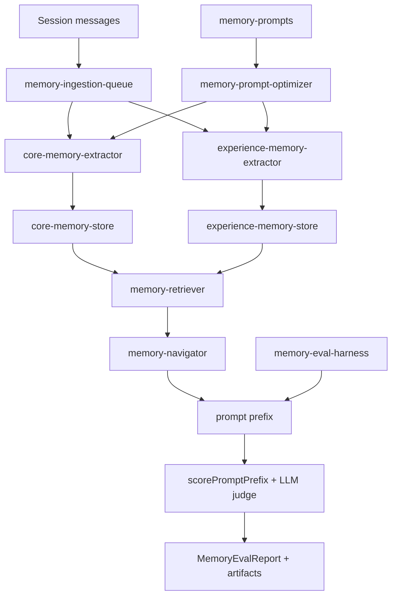

## 1. Executive Summary

open-cowork is an MIT-licensed agent application with a ~4,100-line memory subsystem under `src/main/memory/`. It earns a report for something the atlas has complained about in almost every review: **it ships a committed memory-quality benchmark.**

`memory-eval-harness.ts` (297 lines) defines eval cases as a session plus a set of queries, and each query declares two things:

```typescript
interface MemoryEvalQuery {
  id: string;
  prompt: string;
  workspace?: string;
  expectedHits: string[];
  forbiddenHits?: string[];
}
```

`expectedHits` is ordinary recall testing. **`forbiddenHits` is not, and it is the most valuable idea here** — an assertion that a query must *not* surface particular material. Nothing else in the atlas tests retrieval negatively. It is the executable form of the scope-leak test, the tombstone test, and the sensitivity test that this atlas keeps asking for in the abstract.

Two more details make the harness credible. It scores the **prompt prefix** — what actually reached the model — rather than raw retrieval output, so it measures the thing that matters. And it combines a deterministic score with an LLM judge:

```typescript
deterministicScore = max(0, matchedExpected/expected − matchedForbidden/forbidden)
finalScore         = deterministic + judge (judge clamped to [0,1])
```

The deterministic half is string containment — crude, but reproducible and free, and it cannot drift the way a judge can. Reports carry a `runId`, timestamps, per-case results, and an `artifactDir`.

The memory model behind it is also well shaped: **core memory and experience memory are separate kinds**, each with its own extractor and store (`core-memory-extractor.ts`/`core-memory-store.ts`, `experience-memory-extractor.ts`/`experience-memory-store.ts`) rather than one pipeline with a type column.

Reservations: the deterministic scorer is substring matching, which rewards verbatim overlap; and no committed eval *results* were found, only the harness — the same "reproducible harness, unreproduced result" gap the atlas flagged for [OpenViking](../openviking/).

## 2. Mental Model

Two memory kinds with parallel machinery:

```text
core memory        stable facts about the user and their work
  core-memory-extractor.ts  →  core-memory-store.ts

experience memory  what happened, and what was learned from it
  experience-memory-extractor.ts  →  experience-memory-store.ts
```

Separating them at the *extractor* level, not just by a type field, means the prompts, thresholds, and storage semantics can differ per kind — a stable preference and a recorded episode genuinely need different extraction rules. [MetaClaw](../metaclaw/) and [Redis Agent Memory Server](../redis-agent-memory-server/) express similar distinctions as enum values on one pipeline; open-cowork forks the pipeline.

Supporting modules: `memory-ingestion-queue.ts` (durable capture ahead of extraction), `memory-navigator.ts`, `memory-retriever.ts`, `memory-service.ts`, `memory-state-store.ts`, `memory-tools.ts`, `memory-llm-client.ts`, `memory-prompts.ts`, `memory-prompt-optimizer.ts`, `memory-manager.ts`, `memory-types.ts`, `memory-utils.ts`.

Eval lifecycle:

```text
MemoryEvalCase { sessionTitle, messages[{role, text, timestamp}], queries[] }
  -> replay the session into memory
  -> for each query: build the prompt prefix as the agent would
  -> scorePromptPrefix(prefix, expectedHits, forbiddenHits)
       deterministic = expectedCoverage − forbiddenPenalty, floored at 0
  -> optional LLM judge: {"score": number, "reason": string}, clamped [0,1]
  -> MemoryEvalCaseResult.averageScore
  -> MemoryEvalReport { runId, startedAt, completedAt, averageScore, artifactDir }
```

## 3. Architecture

`src/main/memory/` — about 4,100 lines across eighteen modules, plus tests under `src/tests/memory` and `docs/memory-live-smoke-checklist.md`.



## 4. Essential Implementation Paths

### Forbidden hits

```typescript
const matchedForbiddenHits = forbiddenHits.filter((item) =>
  normalized.includes(item.toLowerCase())
);
const forbiddenPenalty = forbiddenHits.length
  ? matchedForbiddenHits.length / forbiddenHits.length : 0;
deterministicScore = Math.max(0, expectedScore - forbiddenPenalty);
```

A query that surfaces forbidden material loses score proportionally, and enough forbidden hits floor the case at zero regardless of how much expected material it also found. That asymmetry is right: a recall that leaks the wrong thing is not partially correct.

This is the mechanism the atlas has repeatedly asked for and never found. Its "tests to require" lists ask for scope-leakage cases, prompt-injection recall cases, and proof that a rejected value stays inactive — all of which are `forbiddenHits` assertions. Here they are executable.

### Scoring the prompt prefix

The harness scores `promptPrefix`, not the retriever's return value. That distinction matters because between retrieval and the model sit budget truncation, deduplication, formatting, and ordering — any of which can drop the memory that retrieval correctly found. Measuring the prefix measures what the model actually saw.

### Dual scoring

The deterministic scorer is case-insensitive substring containment: cheap, deterministic, and reproducible across runs and machines. The LLM judge returns `{"score": number, "reason": string}`, is validated for finiteness, and is clamped to `[0,1]`.

Keeping both is the right call. The deterministic half gives a floor that cannot silently drift when a judge model changes; the judge half catches correct recall phrased differently from the fixture. The weakness is that the deterministic component rewards verbatim overlap, so it under-credits a system that surfaces the right fact in different words — which biases toward extractive rather than abstractive memory.

### Split extraction

Running separate extractors for core and experience memory means each can have its own prompt in `memory-prompts.ts`, tuned independently by `memory-prompt-optimizer.ts`. It also means the two stores can differ in retention: stable facts and episodic experience have genuinely different lifetimes.

### Ingestion queue and FTS fallback

`memory-ingestion-queue.ts` decouples capture from extraction — the [zero-LLM capture](../../patterns/zero-llm-capture/) ordering. `memory-manager-no-fts.test.ts` exercises the path where SQLite FTS is unavailable, which is the same defensive instinct as [CowAgent](../cowagent/)'s FTS5 probe and [OpenClaw](../openclaw/)'s doctor contracts.

`docs/memory-live-smoke-checklist.md` is a manual checklist for verifying memory against a live system — an acknowledgement that the automated harness does not cover everything.

## 5. Memory Data Model

Types live in `memory-types.ts` with separate stores per kind and a `memory-state-store.ts` for subsystem state. Detailed schema was not traced exhaustively for this review.

What the module list does and does not imply:

- **Two first-class memory kinds** with independent pipelines.
- **A queue before extraction**, so capture is not blocked on a model call.
- **No module suggesting trust state** — nothing named for verification, rejection, or conflict, so a wrong extracted memory appears to have no lifecycle beyond existing.
- **No tombstone module**, meaning a removed memory can presumably be re-extracted from retained sessions.

## 6. Retrieval Mechanics

`memory-retriever.ts` and `memory-navigator.ts` split finding from assembling — navigation being the step that turns retrieved memories into the prefix the eval harness scores. FTS is used where available with a tested fallback path.

Because the eval harness exists, retrieval quality here is at least *measurable*, which is more than can be said for most systems in the atlas. Whether it has been measured is a separate question — see below.

## 7. Write Mechanics

Sessions enter the ingestion queue; extractors run per kind; stores persist. `memory-prompt-optimizer.ts` implies extraction prompts are themselves tuned, which pairs with [MetaClaw](../metaclaw/)'s policy tuning — MetaClaw optimizes what gets *retrieved*, open-cowork optimizes what gets *extracted*. Both are learning loops over memory machinery rather than over memory content.

No write gate, actor model, or corroboration path was found; extraction output appears to become memory directly.

## 8. Agent Integration

`memory-tools.ts` exposes memory to the agent, `memory-service.ts` and `memory-manager.ts` provide the internal surface, and `memory-extension.ts` (45 lines) is the wiring point.

## 9. Reliability, Safety, and Trust

Strengths:

- **A committed memory benchmark with negative assertions** — the strongest evaluation posture in the atlas.
- **Scoring the prompt prefix**, not an intermediate.
- **A deterministic score alongside the LLM judge**, so results do not drift with the judge.
- **Run artifacts** with ids and timestamps.
- **Separate pipelines per memory kind.**
- **An ingestion queue** decoupling capture from model calls.
- **A tested FTS-unavailable path** and a live smoke checklist.

Gaps:

- **No visible trust state** — no verification, rejection, or conflict handling.
- **No tombstones**, so deletion is likely undone by re-extraction.
- **Substring-based deterministic scoring** biases toward extractive memory.
- **No committed eval results** were found, only the harness.
- **Prompt optimization without a promotion gate** — unlike MetaClaw, nothing visible requires an optimized prompt to beat the incumbent on held-out cases before it ships.

## 10. Tests, Evals, and Benchmarks

Tests live under `src/tests/memory` and alongside the modules, including `memory-manager-no-fts.test.ts`. Nothing was run for this review.

The headline is the harness itself. Its shape — cases with expected and forbidden hits, prefix scoring, dual deterministic/judge scoring, artifact-producing reports — is close to what the atlas's own "tests to require" sections have been describing across fifteen pattern pages. The gap between shipping a harness and publishing results is the same one [OpenViking](../openviking/) has: no scored artifacts were found at this commit, so the system's measured memory quality is unknown even though the means to measure it is present.

## 11. For Your Own Build

### Steal

- **Forbidden hits.** Every memory eval should assert what recall must *not* surface, not only what it must. This single field turns scope leakage, rejected values, and sensitivity filtering into testable properties.
- **Score the prompt prefix.** Measure what reached the model, not what the retriever returned.
- **Pair a deterministic score with a judge.** The deterministic half is your regression floor; the judge is your recall of paraphrase.
- **Floor the score at zero on leakage.** Retrieval that surfaces the wrong thing is not partially right.
- **Fork the pipeline per memory kind** when extraction rules genuinely differ, instead of branching on a type column.
- **Queue capture ahead of extraction.**
- **Keep a manual smoke checklist** for what the harness cannot cover.

### Avoid

- **Extraction into memory with no trust state.**
- **Substring scoring** rewarding verbatim overlap.
- **Prompt optimization without a held-out gate.**
- **A harness with no committed results**, which reads as measured but is not.

### Fit

Borrow:

- The eval-case shape — `expectedHits` plus `forbiddenHits`, prefix scoring, dual scoring, artifact reports. This is the most directly reusable artifact in the repository and is largely independent of the rest of the design.
- The split core/experience extractors.
- The FTS-unavailable test path.

Do not copy:

- Extraction without a verification tier, if wrong memory is costly.
- Deterministic scoring alone as your quality signal.

## 12. Open Questions

- Have the evals been run, and what did they score? The harness exists; results do not appear to be committed.
- Should the deterministic scorer use normalized semantic matching rather than substring containment?
- Does an optimized extraction prompt have to beat the incumbent on held-out cases before shipping?
- What prevents a deleted memory from being re-extracted from retained sessions?
- How do core and experience memory interact at retrieval time — separate budgets, or one ranked pool?

## Appendix: File Index

- Evaluation: `src/main/memory/memory-eval-harness.ts` (`MemoryEvalCase`, `MemoryEvalQuery`, `scorePromptPrefix`, `MemoryEvalReport`).
- Core memory: `core-memory-extractor.ts`, `core-memory-store.ts`.
- Experience memory: `experience-memory-extractor.ts`, `experience-memory-store.ts`.
- Capture and orchestration: `memory-ingestion-queue.ts`, `memory-manager.ts`, `memory-service.ts`, `memory-state-store.ts`.
- Retrieval and assembly: `memory-retriever.ts`, `memory-navigator.ts`.
- Prompts: `memory-prompts.ts`, `memory-prompt-optimizer.ts`, `memory-llm-client.ts`.
- Agent surface: `memory-tools.ts`, `memory-extension.ts`.
- Types and utilities: `memory-types.ts`, `memory-utils.ts`.
- Tests and checks: `src/tests/memory`, `tests/memory-manager-no-fts.test.ts`, `docs/memory-live-smoke-checklist.md`.

## History

**2026-07-27** — [`6f0c04741386b8600aa977f14ac0679d2203bd1b`](https://github.com/OpenCoworkAI/open-cowork/commit/6f0c04741386b8600aa977f14ac0679d2203bd1b) — first reading.
