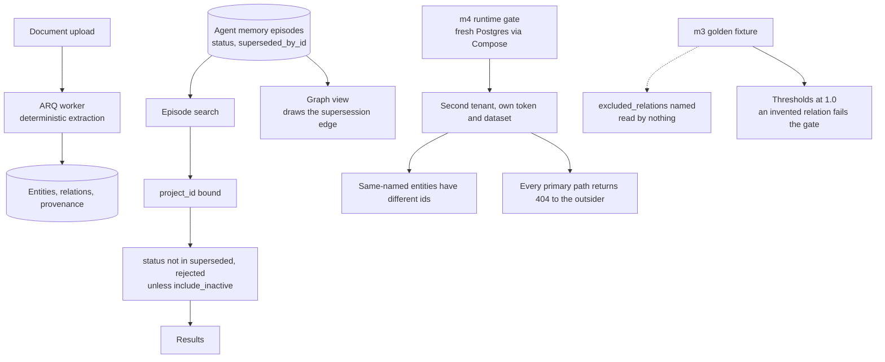

## 1. Executive Summary

Open Graph Memory is an MIT-licensed graph memory over one Postgres — 24,508
lines of Python, 260 test functions, 203 commits since July 2026 — with a
FastAPI service, an ARQ worker, a web app and a Python SDK.

Three marks, and the reason to read it is the evaluation directory.

Most projects that publish a benchmark number keep it long after the thing it
measured has changed. This one did the opposite, twice, and wrote down why:

> Its evaluator and executable gate were removed when `/v1/query` was removed;
> structured graph endpoints cannot honestly reproduce answer, citation,
> retrieval-mode, or fallback metrics.

And for the milestone before it:

> The evaluator never calls a model or store. It scores retained JSONL artifacts
> from the retired retrieval API, keeping published baselines reproducible
> without presenting those metrics as a current runtime check.

A baseline kept reproducible and explicitly denied the status of a current
measurement is a rarer thing than a good number.

What replaced those gates is executable. `m4_runtime_gate.py` brings up a fresh
Postgres through Compose, creates a second tenant with its own dataset and token,
uploads a document to each, waits for both to be indexed and graph-complete, and
then drives the public graph routes as the outsider. Two assertions carry the
boundary: the same-named `Acme` entity in each tenant must have different ids, and
every one of the primary tenant's paths must return 404 to the outsider's token.

The extraction side has its own negative: the M3 golden labels *"deliberately
exclude the ambiguous and unsupported relations: a deterministic extractor must
not invent either"*, with frozen thresholds demanding relation precision and
recall of 1.0.

## 2. Mental Model

Two memories share a database. Documents are chunked, extracted into entities and
relations with provenance, and served through structured graph routes — entity
search, bounded subgraph expansion, two-hop paths, relation evidence. Beside them
sits an agent memory of episodes, attempts, outcomes and promoted patterns.

The episode is where the trust axis lives. A status of `open`, `active`,
`degraded`, `superseded` or `rejected` decides whether an episode answers a
search, and supersession is a pointer between episodes rather than a deletion.

Scope is a project, with a dataset beneath it for documents. Both reads bind the
project; the gate proves the binding holds through the API rather than in the
query builder.

## 3. Architecture



## 4. Essential Implementation Paths

- **Search.** The episode search opens with
  `AgentMemoryEpisode.project_id == project.project_id` and a full-text match,
  then applies `status.not_in(["superseded", "rejected"])` unless the caller sets
  `include_inactive`, then the optional problem-signature, repository and domain
  filters (`apps/api/app/memory/service.py:170-190`).
- **Supersede.** The API refuses when either end is already superseded, then sets
  `item.status, item.superseded_by_id = "superseded", body.superseding_episode_id`
  in one statement (`apps/api/app/memory/api.py:319-330`).
- **View.** The graph view binds the project, applies an optional status filter,
  and adds a supersession edge when both ends are within the returned set
  (`service.py:290-355`).
- **Gate.** `scripts/m3-runtime-gate.sh` tears the stack down with `-v`, rebuilds
  it, runs the runtime gate and the evaluator, then reads the thresholds out of
  the golden file and raises on any metric below its limit.

## 5. Memory Data Model

An episode carries a status, a problem signature, a JSONB scope whose
`repository` key is queried with `->>`, a search vector, and the supersession
pointer. Attempts and outcomes hang off it, and an outcome's score is derived —
`1.0` for success, `0.5` for partial, `0.0` otherwise — feeding the confidence
thresholds that gate pattern promotion.

`tombstone` is withheld: supersession points at a successor and nothing is keyed
on the retired content, so the same problem written again is a new episode.
`bitemporal` is absent — the timestamps are record-axis — and `audit_log` has no
table of mutations, though the supersession pointer means the chain is walkable.

## 6. Retrieval Mechanics

Full-text search over episodes, and structured graph routes over the document
side. The status exclusion is the part that matters for this corpus, and its
shape is right: a default that withholds, an explicit `include_inactive` for a
caller who wants the history, and the same exclusion repeated on the pattern join
so a superseded episode cannot re-enter through its patterns.

The graph view is the complement. It does not hide a superseded episode; it draws
the supersession as an edge, but only when both ends are in the returned set — so
a view never shows an edge to something the caller cannot see.

## 7. Write Mechanics

Extraction is deterministic, which is what makes the M3 fixture meaningful: a
golden set with thresholds of 1.0 is only reasonable if the extractor is not a
model. The fixture covers entities, an explicit alias, supported relations,
ambiguous same-name entities, unsupported relation grammar, shared multi-document
provenance and a separate tenant — a spread chosen to exercise the failure modes
rather than the happy path.

The gate is honest about its own cost, tearing the stack down with `-v` before
rebuilding, so a passing run means the fixture produced those numbers from an
empty database rather than from accumulated state.

## 8. Agent Integration

A FastAPI service with an agent-memory API — episodes, attempts, outcomes,
patterns, supersession — plus structured graph routes, a Python SDK and a
contracts package. The status vocabulary is enforced at the API boundary too: an
attempt may only be recorded against an episode whose status is in
`{open, active, degraded}`, and an outcome is refused for an episode that is
superseded or rejected.

## 9. Reliability, Safety, and Trust

The evaluation discipline is the subject here, and it has three parts worth
separating.

**What was removed.** Two milestones' gates were deleted when the endpoint they
exercised was retired, with the reason recorded in the README rather than in a
commit message nobody reads. The temptation in that situation is to keep the gate
pointed at whatever endpoint is nearest and let the numbers drift into meaning
something else; the note says plainly that the structured endpoints cannot
reproduce those metrics.

**What was kept, and how.** The M2 baseline survives as retained JSONL artifacts
with an evaluator that never calls a model or a store. That makes the published
numbers reproducible forever and useless as a current check — which is exactly
what a historical baseline should be, and the README says so in the same
sentence.

**What is live.** The M3 and M4 gates run against a fresh stack. The M4 isolation
assertions are the ones this atlas cares about most, because a tenant boundary
tested through the public routes with a second token is a different claim from a
predicate visible in a query builder.

One finding, small and precise. The M3 golden file carries an
`excluded_relations` list naming the two relations a correct extractor must not
produce — and no code loads it. The rule is still enforced, because the frozen
relation-precision threshold is 1.0 and any extra relation drops precision below
it. What is lost is the diagnosis: a failing gate reports
`relation_precision=0.900 < 1.000` rather than naming the ambiguous `ADVISES`
relation the extractor invented. The list is documentation that reads like a
fixture, and the next person to edit it will reasonably assume it is scored.

## 10. Tests, Evals, and Benchmarks

260 test functions plus the gates; nothing was run here — the gates require
Docker, a Postgres and a live stack, and this reading opened no container.

The structure is the notable part: a versioned golden set per milestone, an
evaluator that scores predictions against it, a runtime gate that produces those
predictions from a freshly built stack, and a shell wrapper that reads the
thresholds out of the fixture rather than hardcoding them. Changing a threshold
means editing the fixture that also defines the labels, which keeps the two from
drifting apart.

## 11. For Your Own Build

- **Delete the gate when its endpoint goes.** A benchmark pointed at a surface
  that no longer exists will be repointed at the nearest one, and the number will
  quietly start meaning something else. Removing it and saying why costs nothing
  and prevents a false claim.
- **A historical baseline should be reproducible and inert.** Scoring retained
  artifacts with an evaluator that calls nothing keeps the published numbers
  checkable while making it impossible to mistake them for a current measurement.
- **Put the must-not cases in the golden set.** Ambiguous entities and
  unsupported grammar belong in the fixture with labels that exclude them, so
  precision measures invention rather than only coverage.
- **Read the list you wrote down.** An `excluded_relations` array that nothing
  loads turns a diagnostic into decoration; scoring it explicitly costs a few
  lines and turns a threshold failure into a named one.
- **Prove isolation through the front door.** A second tenant, its own token, and
  a 404 on every one of the other tenant's paths is a claim about the system; a
  `WHERE project_id = ?` in a query builder is a claim about one function.

## 12. Open Questions

- Will `excluded_relations` be scored, or is the precision threshold considered
  sufficient? Either is defensible; only one matches what the file looks like.
- The retired milestones' artifacts remain in the tree. Is there a plan for when
  a reader finds those numbers without the README paragraph that frames them?
- The episode status has five values and the search excludes two. Is `degraded`
  intended to rank differently, or only to be readable?

## Appendix: File Index

- Memory service: `apps/api/app/memory/service.py:170-190` (project and status on
  the search), `:228-238` (the pattern join), `:290-355` (the graph view and the
  supersession edge).
- Memory API: `apps/api/app/memory/api.py:159` (attempt status gate), `:195`
  (outcome refusal), `:319-330` (supersession), `confidence.py:136`, `:169`.
- Models and indexes: `apps/api/app/models.py:130`,
  `apps/api/migrations/versions/0011_agent_memory_preview.py:93`, `:181`.
- Evaluation: `evaluation/README.md` (the removals and the inert baseline),
  `evaluation/m3_golden/v1.0.json` (labels, `excluded_relations`, thresholds),
  `evaluation/m3_evaluator.py:21-60`, `evaluation/m4_runtime_gate.py:85-201`,
  `scripts/m3-runtime-gate.sh:28-50`.

**Searches recorded for the negative claims**

```sh
grep -rn "excluded_relations" --include='*.py' .    # 0 — present in the fixture, loaded by nothing
grep -rn "status.not_in\|status ==" apps/api/app/memory --include='*.py'   # the default exclusion and its explicit filters
grep -rn "project_id ==" apps/api/app/memory --include='*.py'              # bound on both the search and the graph view
grep -rn "valid_from\|as_of" apps/api/app --include='*.py'                 # 0 — timestamps are record-axis
```

## History

**2026-09-17** — [`cf7b0d23480e0dc1bf1c0cbbdfa90418e9d84d70`](https://github.com/ardiannurcahya/open-graph-memory/commit/cf7b0d23480e0dc1bf1c0cbbdfa90418e9d84d70)
— first reading, at the head of `main`, 203 commits in. Screened with
`scripts/screen_repo.py` first: every dependency manifest in the tree changed on
the day of this reading, so the whole surface is inside the seven-day cooldown.
Nothing was installed, built or run — no uv, no npm, no Docker, and the runtime
gates were read rather than executed. Three marks. `tombstone` is withheld because
supersession points at a successor with nothing keyed on the retired content.
`bitemporal` and `audit_log` are absent. The `excluded_relations` list in the M3
golden fixture is recorded as a finding rather than as a mark against the
evaluation: the rule it states is enforced by a relation-precision threshold of
1.0, and the list itself is loaded by no code.
