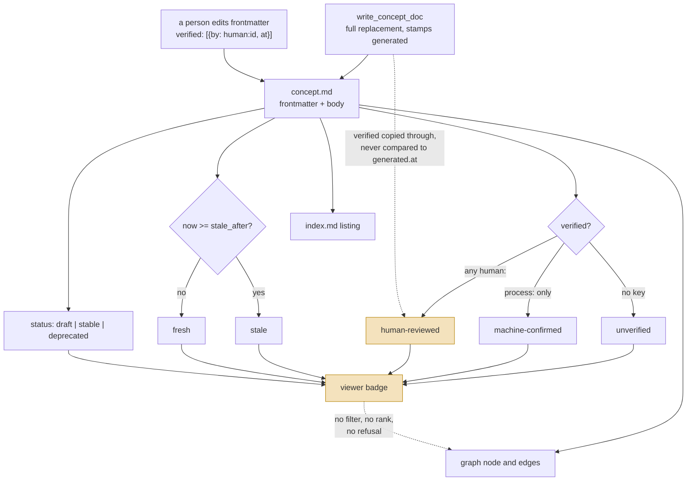

## 1. Executive Summary

Open Knowledge Format (OKF) is a **specification for knowledge that agents
write and people sign off on**, Apache-2.0, from Google Cloud Platform: 1,006
lines of spec (`SPEC.md`, version 0.2), a reference agent of 2,181 lines of
Python under 1,037 lines of tests, a self-contained HTML viewer, four committed
bundles and a connector note for Dataplex Knowledge Catalog. Six commits by one
author between 14 and 21 August 2026. The README is unambiguous about what the
contribution is: *"The format itself is the contribution; this agent and the
visualizer exist to make the format tangible at both ends."*

The format is a directory of markdown files with YAML frontmatter, `type` the
only required key, and its reason to exist is four questions the spec says a
plain markdown convention cannot answer once *"most concepts are
machine-generated"*: what was this created from, how much should I trust it,
is it still true, is it the current version. The answers are five frontmatter
families. `sources` records provenance with per-source credibility signals
(`author`, `usage_count`, `last_modified`) and refuses to store a score —
*"a score is subjective, unportable across consumers, and goes stale."*
`generated` records who wrote the content and when; `verified` is a list of
`{by, at}` events recording who confirmed it, kept separate *"because who
wrote a concept need not be who confirmed it."* `status` is `draft`, `stable`
or `deprecated`. `stale_after` is an absolute instant, deliberately not a TTL,
so staleness is *"a plain comparison with no reference to when the concept was
read."* And an `Attested Computation` is a concept whose body carries the
sanctioned SQL, whose frontmatter names an executor and a deterministic
attester, and whose consumer *"can confirm the agent ran the blessed
computation instead of improvising its own."*

**Every one of those families is advisory, and the code confirms it.** The
spec says so of the trust tier in as many words — *"Trust tiers are advisory
signals, not access control"* — and the tree has exactly one consumer of the
fields: the viewer. `trust_tier()` and `is_stale()` in
`src/reference_agent/bundle/document.py` derive a tier and a boolean, the
viewer puts them on a badge (`viewer/static/viz.js:211-223`), and nothing in
the package filters, ranks, withholds or warns on any of them. A `deprecated`
concept, an `unverified` one and one past its `stale_after` are listed in the
index, drawn in the graph and served to a reader exactly like the rest. That
is why this report carries no capability mark: the states the atlas asks for
are all defined here, and none of them is used for what the mark is for.

**The gap that matters most is the one between `generated` and `verified`.**
The write tool refreshes `generated` on every write
(`tools/bundle_tools.py:131-136`) and copies whatever `verified` the agent
passed back in. The spec states the independence as a feature — *"content can
change without re-confirmation"* — and the consumer derives the tier from
`verified` alone, never comparing its `at` to `generated.at`. So an agent that
regenerates a human-reviewed document keeps the human-reviewed badge on text
the human never saw. The hand-authored sample shows what disciplined use
looks like — eight of ten `acme_retail` documents carry a `human:` verifier
dated after the generation — and the three agent-produced bundles show the
default: 44 documents, zero `verified`, one `status`, zero `stale_after`.

**Attestation is the most original idea here, and the shipped attester does
not do what the spec's consumer walkthrough says it does.** §10.5 describes
fidelity as the displayed value matching *"the receipt's authoritative source,
re-read by job id rather than taken from the agent's text."*
`bundles/acme_retail/attesters/sql_equality.py` — the only attester in the
tree, 129 lines, no test, no caller — canonicalises the executed SQL against
the sanctioned SQL and compares the claimed value to `receipt["result"][0]`,
passing the `job_id` through into the verdict's details untouched
(`:108-128`). Its header says why: *"Never uses an LLM. Never makes network
calls."* The receipt it checks is assembled by the executor, and the executor
named in the sample is `skills/run-on-bq.md`, a markdown instruction sheet an
agent follows. The deterministic half of the loop therefore verifies that the
agent's own account of what it ran matches the canon; whether the account is
true is not checked anywhere in this repository.

**And the spec and its own tooling disagree three times.** §3.1 reserves
`index.md` and `log.md`; the index generator and the viewer reserve only
`index.md` (`bundle/index.py:24`, `viewer/generator.py:31`), and the sample
bundle's `log.md` carries `type: Log` frontmatter, so the shipped
`acme_retail/viz.html` renders a `log` node with an *unverified* badge. §6.1
recommends the absolute `/`-prefixed link form as *"stable when documents are
moved"*; the viewer's edge extractor skips exactly that form
(`generator.py:88`), and the reference prompt forbids it — *"Never start a
link with `/` (that breaks GitHub rendering)"*. The sample policies use eight
absolute links in their *Cited by* sections and the committed visualization
has no edge from either policy. The spec is minimal on purpose; its minimalism
is what leaves those three readings open.

## 2. Mental Model

A concept becomes knowledge by being written, and becomes *trusted* knowledge
by a separate act. `generated` names the writer — `reference_agent/<model>`,
`human:<id>` or `process:<id>` — and `verified` accumulates confirmations.
The tier is a pure function of the verifiers' prefixes: no `verified` key is
*unverified*; verifiers without a `human:` prefix are *machine-confirmed*; any
`human:` verifier is *human-reviewed*. Freshness is a second, independent
function: `now >= stale_after` is *stale*. Lifecycle is a third: `status`.
The three never combine, and nothing consumes them together.

Provenance is a list of sources with signals rather than a verdict, and
attribution is a footnote whose label is a `sources[].id` — keyed, the spec
says, because *"agents constantly rewrite these documents: a positional index
misattributes silently the moment the list is reordered."* That sentence is
the design's clearest statement of its threat model: the writer is a model,
the document will be rewritten, and every field has to survive that.

A concept stops being current by `status: deprecated` on its own file, kept
*"for links and history"*, with a successor linked from the body. The sample
shows the pattern: `metrics/gross-margin-legacy.md` is retired, names its
replacement, keeps the old formula *"for reproducibility only"*, and records
that its sanctioned SQL was deleted so *"anyone re-running historical reports
must reconstruct the SQL from this narrative and clearly label the result as
legacy."* The successor carries a `not:` block — the rejected definition, why
it was wrong, what to use instead — which is the shape of a rejected-value
record and appears nowhere in the spec or the code.

The dotted edges are the finding. Every derivation terminates at a display,
and the one path that could move a document *down* a tier — regeneration —
does not.

## 3. Architecture

**The format.** A bundle is a directory tree; every non-reserved `.md` file is
a concept whose id is its path without the suffix. Conformance (§11) is three
rules: parseable frontmatter, a non-empty `type`, reserved files shaped as
specified. Everything else is soft, and the spec lists what a consumer may not
reject for — unknown types, unknown keys, broken links, missing indexes —
which is a real design choice about agent-written corpora: a link to a concept
that does not exist yet *"may simply represent not-yet-written knowledge."*
Versioning is `<major>.<minor>` with an optional `okf_version` in the root
index; §13 lists the v0.1 to v0.2 changes, two of them breaking (`timestamp`
became `generated.at`; the body `# Citations` list became `sources`).

**The producer.** `reference_agent` is two Google ADK agents behind one CLI.
The BQ pass (`agent.py:41-53`) runs once per concept the source advertises —
a `BigQuery Dataset` and one `BigQuery Table` per table, with date-sharded
families collapsed to one concept (`sources/bigquery.py:89-115`) — with five
tools: list concepts, read raw metadata, sample rows, read the existing doc,
write the doc. The web pass (`agent.py:56-68`) is *"the LLM as its own
crawler"*: seed URLs, a `fetch_url` tool that enforces host, path-prefix,
denied-substring, hop-depth and page-budget limits inside the tool
(`tools/web_tools.py:24-115`), and the same write tool. Sessions are
`InMemorySessionService` (`runner.py:208`) and are created fresh per concept
(`:225-234`), so nothing the agent learns enriching one table reaches
the next except through the bundle on disk. After both passes,
`regenerate_indexes` rewrites every `index.md` bottom-up and asks Gemini for a
one-sentence description of each directory, falling back to a titles list
(`bundle/index.py:63-117`, `bundle/synthesizer.py`).

**The consumer.** `visualize` walks the bundle, parses every concept, derives
the v0.2 signals, extracts relative links as directed edges and writes one
HTML file embedding the graph as JSON with Cytoscape and marked loaded from a
CDN. The README calls it *"a proof-of-concept consumer"*, and it is the only
one in the tree. The catalog connector (`connectors/gcp-knowledge-catalog.md`)
documents a round trip through Dataplex with a CLI from a sibling repository;
it carries seven frontmatter keys, drops everything but `.md`, stores
cross-links verbatim so they *"resolve to nothing"*, and states that renames
orphan catalog state and *"there is no merge story."*

### Deployment and ergonomics

A Python 3.11+ package with five dependencies, no lockfile, and two external
services — BigQuery for metadata and row samples, Gemini through AI Studio or
Vertex AI for the agents and the index synthesizer. The README notes the
caller's project is billed for query bytes. Nothing runs as a service: enrich
is a batch command, visualize is a batch command, and the bundle is the only
state. That is the cheapest possible operational footprint for a memory layer,
and the cost is on the other side: nothing watches the bundle, so a
`stale_after` that passes is noticed by whoever next opens the viewer.

## 4. Essential Implementation Paths

- **Document model:** `src/reference_agent/bundle/document.py` — `OKFDocument`
  parse and serialize with a loader that keeps timestamps as text (`:29-43`),
  `normalize_verified` (`:97`), `trust_tier` (`:113`), `is_stale` (`:130`).
- **Write path:** `src/reference_agent/tools/bundle_tools.py` —
  `write_concept_doc` (`:104-201`): `generated` stamped (`:131-136`),
  validation, the web-pass augmentation guard (`:157-198`), full-file
  replacement (`:200-201`).
- **Crawl guard:** `src/reference_agent/tools/web_tools.py` — `fetch_url`
  (`:24-115`), every rejection a returned `error` rather than an exception;
  `tools/context.py` — `WebState` with visited set, depth map and budget.
- **Fetching:** `src/reference_agent/web/fetcher.py` — HTML to markdown via
  `markdownify`, truncated at 40 KB (`:25`); the user agent names a personal
  repository rather than this one (`:24`).
- **Source:** `src/reference_agent/sources/bigquery.py` — shard-family
  detection, schema with nested records, partitioning, clustering, row samples.
- **Index and description synthesis:** `src/reference_agent/bundle/index.py`,
  `synthesizer.py`.
- **Viewer:** `src/reference_agent/viewer/generator.py` — `_walk_concepts`
  (`:103-142`), `_extract_links` (`:82-99`), the graph payload; `static/viz.js`
  — badges (`:211-223`).
- **Attestation contract:** `SPEC.md` §10; the only attester,
  `bundles/acme_retail/attesters/sql_equality.py` (`attest` at `:68`); the only
  executor, `bundles/acme_retail/skills/run-on-bq.md`, a markdown skill.
- **Specification:** `SPEC.md` — §3.1 reserved filenames, §5 the five families,
  §5.3 tiers, §5.5 `stale_after`, §6.1 link forms, §9 log files, §10 attested
  computations, §12 *Considered and deferred*.

## 5. Memory Data Model

A concept's frontmatter is a YAML mapping with one required key, `type`, four
recommended keys (`title`, `description`, `resource`, `tags`), and the families:

- `sources`: entries of `resource` (required — a URL, a bundle path, or a
  *scope descriptor* such as *"all queries in BigQuery project X"*), `id`,
  `title`, `author`, `usage_count`, `last_modified`; a sibling `usage_window`
  frames the counts. Lineage is *"expressed through links, not a dedicated
  field"*: a source that is another concept is an edge, and a consumer *may*
  recurse into that concept's own sources.
- `generated: {by, at}` — who produced the current content and when.
- `verified: [{by, at}, …]` — who confirmed it; a bare mapping is a one-element
  list.
- `status`: `draft | stable | deprecated`, absent meaning `stable`.
- `stale_after`: an ISO 8601 instant with an explicit offset; `is_stale`
  returns false for a date-only value on purpose, because *"a date-only
  `2026-12-31` names a different instant in every timezone, so it is ignored
  rather than guessed at."*
- For `type: Attested Computation`: `runtime`, `parameters` of
  `{name, type, required}`, an optional `computation` file path, `executor`
  with a `resource` and a `receipt` field list, `attester` with a `resource`.

**Two clocks, one axis.** `generated.at` is record time. `stale_after` is the
instant after which the content should no longer be served, and
`sources[].last_modified` is when a source changed. There is no `valid_from`,
no interval, and no as-of read: a consumer can ask *is this stale now* and
cannot ask *what did this bundle say in June*. The spec's `stale_after` is a
freshness deadline, chosen absolute so the test is a comparison, and that is
what it is.

**The body is where the knowledge is, and the spec keeps it free.** Three
headings have conventional meaning — `# Schema`, `# Examples`,
`# Computation` — and the reference prompt adds `# Common query patterns`,
`# Metrics`, `# Joins` and `# Dimensions` for the bundles it writes. The
sample's metric documents show the spec's intent for correction: the retired
definition stays as its own file with `status: deprecated`, the current one
links back to it, and the policy that authorised the change links forward to
both. The `not:` block on `metrics/gross-margin.md:11-14` —
`term`, `why`, `instead` — is a producer extension the spec permits (§4.1
*"Producers MAY include any additional keys"*) and no consumer reads.

## 6. Retrieval Mechanics

The format prescribes no retrieval. Its answer to *how does an agent find
things* is `index.md`: every directory may carry a listing of its children with
descriptions, so *"a human or agent see what is available before opening
individual documents"* — progressive disclosure, one level at a time, instead
of loading the bundle. The reference agent regenerates those listings from
frontmatter after every run and groups entries by `type`. Links are the graph:
*"a link from concept A to concept B asserts a relationship"* of a kind
conveyed by the surrounding prose, and a consumer that wants a graph *"treats
all links as directed edges of an untyped relationship."*

The viewer is that consumer. Its search box matches title, concept id and
tags; its edges come from `_extract_links`, which resolves relative targets
against the document's directory and skips any target containing `://` or
beginning with `/` (`generator.py:88`). The spec's recommended link form is
the one skipped. In the committed `acme_retail/viz.html` the two policy
documents, whose *Cited by* sections carry eight absolute links, have no
outgoing edge, while the metrics, which link relatively, do.

Nothing on any read path consults `status`, the tier or the staleness flag.
The index lists a deprecated concept beside the current one — the sample's
hand-written `metrics/index.md` does so deliberately, labelling it *legacy* —
and the graph draws it with a badge. A consumer that wants to exclude stale or
deprecated material writes that itself, which the spec's informative §10.5
step 6 asks of it: *"warn or refuse when `now >= stale_after`."*

## 7. Write Mechanics

**A write is a whole file.** `write_concept_doc` takes a concept id, a
frontmatter mapping and a body, fills `generated.by` with
`reference_agent/<model>` and `generated.at` with now unless the caller
supplied them, reorders keys into a preferred order, validates that `type` is
present, and overwrites the file (`bundle_tools.py:104-201`). It is
synchronous; the document is on disk and readable by the next `read_existing_doc`
before the tool returns. There is no patch, no merge and no lock: the prompt
tells the agent that *"`write_concept_doc` does a full replacement, not a
patch — the `frontmatter` argument must include every key the existing doc
had"*, and that dropping a key drops it.

**One guard, on one pass, for one type.** During the web pass, and only then,
a write to an existing `BigQuery Table` document is refused if its `# Schema`
section names fewer fields than the file on disk or its `sources` list is
shorter (`:157-198`). The error is a teaching error — it names the missing
fields and tells the agent to re-read and retry — and the prompt makes retry
mandatory: *"A rejected write did not happen — fix it and retry, do not give
up."* Both directions are tested, and so is the deliberate hole: the BQ pass
may shrink a schema, because the table may have lost a column
(`test_bq_pass_can_shrink_schema_when_no_web_state`). Outside that guard, an
agent may replace a human-verified body wholesale, and the only thing that
records the replacement is `generated.at`.

**Provenance is prompt-enforced.** The instruction is *"Record in `sources`
only URLs you actually fetched … Do not invent URLs"*; the guard checks the
list's length, not its contents, and the crawl tool's visited set is not
consulted at write time. A fabricated source survives the write.

**The crawl is tool-enforced, and that part holds.** `fetch_url` rejects a
scheme other than http or https, a host outside the allowed set, a path
outside the prefixes or matching a denied substring, a URL already fetched, a
spent budget, a depth past the cap, and — the interesting one — any URL that
no fetched page returned as a link, so an agent cannot type an address into
the crawl (`web_tools.py:80-86`, *"the agent invented a URL not surfaced via a
parent page"*). Five tests cover it. A page is truncated to 40 KB of markdown
before the model sees it.

**Deletion is not a verb.** The spec has `deprecated`; the tools have no
delete; the sample retires by editing and records the retirement in `log.md`.
The log is prose a person writes — the spec's format is date headings over
bullets whose leading bold word is *"a convention, not a requirement"* — and
nothing in the code appends to it.

## 8. Agent Integration

The producer side is two ADK agents with function tools and markdown
instructions of 107 and 270 lines. The prompts carry the design's real rules:
one write per invocation; refine an existing document rather than rewrite it;
relative links only; four gates before minting a `references/` concept from a
web page (referenceable by name, not bundle-level meta, passes a citation
test, passes a reuse test) and a rule that metrics and joins bypass the gates
because they *"are inherently concept-shaped"*; and a closing check that no
minted reference is orphaned. That last rule is the format's linking
convention turned into an agent obligation, and it is the reason the
generated bundles have `# Metrics` and `# Joins` sections pointing at
`references/`.

The consumer side is whatever reads markdown. The README's list is honest
about that — Obsidian, MkDocs, an LLM loading files into context, a search
index — and the repository ships one, the viewer. There is no MCP server, no
retrieval tool and no agent that *reads* a bundle to answer a question; the
agent that exists writes them. What an assistant may do with a bundle is
therefore unconstrained by this repository, and the trust and staleness
signals reach it only if it parses frontmatter itself.

The attestation loop is specified as an agent contract — *"The agent MAY only
supply values for the declared `parameters`; it MUST NOT author or edit the
computation"* — and the sample's executor is a skill document telling an agent
to bind parameters as named query parameters, never string-interpolate, label
the job with the concept path, and return a receipt with `job_id`,
`executed_sql` and `result`. Whether the agent did those things is what the
attester checks from the receipt the same agent returns.

## 9. Reliability, Safety, and Trust

**`trust_state` — withheld, on the clause that matters.** The format has the
states the mark asks for: `status` is `draft | stable | deprecated`, and the
tier derived from `verified` is `unverified | machine-confirmed |
human-reviewed`, computed by `trust_tier()` and asserted by `test_trust_tier`.
What it lacks is any read that acts on them. The spec calls the tiers
*"advisory signals, not access control"*; the one consumer in the tree renders
a badge; the index generator and the graph walker list every concept
regardless. A state that answers *may this be acted on* and is never used to
withhold anything is the shape of the mark without its function. The nearest
thing to a gate is a sentence in the informative §10.5.

**`bitemporal` — withheld.** `generated.at` is record time and `stale_after`
is a validity end; there is no start, no interval and no as-of read, and
`is_stale` is the only computation over the pair. A freshness deadline is not
a second axis.

**`audit_log` — withheld.** `log.md` is a hand-written prose history with no
producer in the code; git is the recommended distribution and carries the
diffs, which the README counts as the point — *"knowledge curation becomes a
normal software-engineering activity"* — and which is a different mechanism.

**`human_review` — withheld, and the near-miss is the spec's own model.** A
`human:` verifier is a recorded act of review and it moves the tier; the
surface for performing it is a text editor and a pull request, neither of
which is in this repository. The viewer displays and does not approve.

**`tombstone` — withheld.** The `not:` block on the sample's gross-margin
metric holds a rejected definition, why it was wrong and the replacement —
the record the mark asks for — as an undocumented extension key that no code
reads and no spec section names. `status: deprecated` is supersession.

**`scope_enforced`, `negative_eval` — not found.** No scope key exists, and
the tests assert write refusals, not retrieval exclusions.

Other observations:

- **The tier cannot go down.** Nothing in the tree removes or invalidates a
  `verified` entry: the agent copies frontmatter through, the tool refreshes
  only `generated`, and the consumer never compares the two timestamps. The
  spec's §5.2 states the independence; the consequence is that a regenerated
  document keeps a human's signature on content the human did not read.
- **The attester verifies the agent's account, not the run.** `attest()`
  compares canonicalised SQL and the first result cell against a receipt
  dictionary and returns the `job_id` it was handed. §10.5's *"re-read by job
  id"* is not implemented, and the header rules out the network call that
  would implement it. The check is real and useful — a rewritten query, a
  swapped table or a dropped join fails it — against an honest executor.
- **Reserved filenames are reserved in the spec and not in the code.** Both
  walkers skip only `index.md`; a `log.md` with frontmatter is a concept to
  them, and the shipped sample visualization proves it with a `log` node.
- **The recommended link form is the one the tools drop.** §6.1 recommends
  `/`-prefixed paths; `_extract_links` skips them; the reference prompt forbids
  them for GitHub rendering. A bundle written to the spec loses its edges in
  the spec's own viewer.
- **Credibility signals are stored and not computed on.** `usage_count`,
  `author` and `last_modified` are read into the viewer's source list and
  displayed. The spec's position that a score is unportable is a good one; it
  also means the format ships the inputs to a trust judgement and no worked
  example of making one.
- **The crawl cannot be steered off its seeds by the model**, which is the
  right place for that limit — in the tool, with the model told it is there.

## 10. Tests, Evals, and Benchmarks

Seven test files, 39 test functions, 1,037 lines, run with pytest and no
network: BigQuery is a fake client, fetching is monkeypatched. What they cover
is the mechanism this report credits: frontmatter round-trip with timestamps
kept as text, `type` required, the bare-mapping `verified` form, the tier
derivation for all three tiers, `is_stale` including the date-only and
offset-less refusals, both augmentation refusals and the deliberate BQ-pass
exemption, every crawl rejection, the index grouping and description reuse,
and the viewer payload carrying status, tier, staleness, verified events and
sources (`test_v02_signals_appear_in_graph_payload`).

What is not tested: `sql_equality.py` has no test and no caller in the
package; `log.md` handling has no test in either walker; and there is no test
that a deprecated, stale or unverified concept is treated differently by any
reader, because no reader treats it differently.

No benchmark, no evaluation and no paper. The four bundles are the evidence
of what the producer does: three generated from public BigQuery datasets with
recipes (`samples/<name>/README.md` with the seed URLs and the exact command),
and one hand-authored to exercise every v0.2 family. The recipes make the
generated bundles reproducible in kind, not in content — the model is
`gemini-flash-latest`, unpinned.

## 11. For Your Own Build

### Steal

- **Separate `generated` from `verified`.** Who wrote a memory and who
  confirmed it are different facts with different timestamps, and one field
  cannot hold both. Most systems in this atlas that record trust record it as
  one number on the row.
- **Store credibility signals, not a credibility score.** `author`,
  `usage_count` over a stated window, `last_modified` — objective, portable
  and comparable over time. The score is the consumer's to compute.
- **Key attributions to a stable id, not a position.** Footnotes joined to
  `sources[].id` survive the reordering that model rewrites cause.
- **Make staleness an absolute instant.** `now >= stale_after` needs nothing
  about when the row was read, and a date without an offset is refused
  rather than guessed.
- **Put a computation in the memory and check the run against it.** The
  attested-computation contract — parameters the agent may fill, a body it
  may not edit, a canonicalised-SQL equality — turns *did it run the sanctioned
  thing* into a comparison. Then close the loop the sample leaves open: re-read
  the result by job id.
- **Refuse a rewrite that loses information, with a teaching error.** The
  schema and sources guard names what went missing and tells the agent how to
  retry.
- **Put crawl limits in the tool.** Host, path, depth, budget and *only URLs a
  fetched page returned* are enforced where the model cannot argue.

### Avoid

- **Trust states that nothing reads.** Three derivations that all end at a
  badge are a display, not a trust model. Decide what a consumer refuses,
  warns on or ranks down, and ship one that does it.
- **A verification that survives regeneration.** If a write can replace the
  body, it has to clear or date-check `verified`, or the human-reviewed tier
  means *once*.
- **A deterministic attester over an agent-assembled receipt.** The comparison
  is only as honest as the executor; without re-reading the run from the
  system that executed it, the check certifies the agent's story.
- **A spec whose reference tools implement a different spec.** Reserved
  filenames and link forms are both places where the code and the sample
  contradict the document they exist to demonstrate.

### Fit

This suits a team that wants **catalog knowledge in git** — table
descriptions, metric definitions, policies — written by an agent from
metadata and reviewed by people in pull requests, and consumed by any tool
that reads markdown. The format is genuinely small: a producer needs YAML
frontmatter and a directory, and a consumer needs a markdown parser. The
Dataplex connector shows the intended enterprise path and is honest that it
carries seven keys and no merge.

It is not a memory system for an agent to write into at runtime. There is no
retrieval, no scope, no runtime, and every trust signal is a suggestion to a
consumer this repository does not ship. A team adopting it inherits the job
the spec declines — deciding what a stale, deprecated or unverified concept
is not allowed to do — and the design's value depends entirely on doing it.

## 12. Open Questions

- **What does a consumer do with the tier?** §10.5 is informative and the only
  consumer renders it. Whether Google's own consumers — the Knowledge Catalog
  side of the connector, or an agent reading bundles — filter or rank on it is
  not observable from this tree.
- **Will `verified` be invalidated by regeneration?** The spec states the
  independence; nothing states the policy for a human-reviewed document an
  agent rewrites.
- **Where does the receipt come from?** §12 defers *"the full runtime protocol:
  receipt and verdict wire formats, and the attestation lifecycle around a
  run"*, and the sample executor is a skill an agent follows.
- **Which link form is canonical?** The spec recommends absolute; the prompt
  and the viewer assume relative; the sample uses both.
- **Is `log.md` a concept?** The spec says no; the sample and both walkers say
  yes.
- **Does the `not:` block become a spec family?** It is the one place the
  sample records a rejected value, and it is invisible to everything else.

## Appendix: File Index

**Specification**
- `SPEC.md` — v0.2, 1,006 lines; §1 motivation, §3 bundle structure and
  reserved filenames, §5 provenance/trust/lifecycle families, §6 links, §7
  actor convention, §8 index files, §9 log files, §10 attested computations,
  §11 conformance, §12 versioning and deferrals, §13 changes from v0.1,
  Appendix A worked example
- `README.md`, `connectors/gcp-knowledge-catalog.md`

**Reference agent**
- `src/reference_agent/agent.py`, `runner.py`, `cli.py` — the two ADK agents,
  the per-concept sessions, the CLI
- `src/reference_agent/bundle/document.py`, `index.py`, `paths.py`,
  `synthesizer.py`
- `src/reference_agent/tools/bundle_tools.py`, `context.py`,
  `source_tools.py`, `web_tools.py`; `web/fetcher.py`
- `src/reference_agent/sources/base.py`, `bigquery.py`
- `src/reference_agent/prompts/reference_instruction.md`,
  `web_ingestion_instruction.md`

**Viewer**
- `src/reference_agent/viewer/generator.py`, `static/viz.js`, `static/viz.css`,
  `templates/viz.html`

**Bundles**
- `bundles/acme_retail/` — hand-authored, every v0.2 family: `metrics/`,
  `computations/`, `policies/`, `attesters/sql_equality.py`,
  `skills/run-on-bq.md`, `tables/orders.md`, `log.md`
- `bundles/ga4/`, `bundles/stackoverflow/`, `bundles/crypto_bitcoin/` —
  agent-generated, with recipes under `samples/`

**Tests**
- `tests/test_document.py`, `test_bundle_tools.py`, `test_web_tools.py`,
  `test_web_fetcher.py`, `test_index.py`, `test_viewer.py`,
  `test_bigquery_source.py`

**Searches that ground the absence claims above** (run at the pinned commit):
- `rg -n 'trust_tier|is_stale|normalize_verified' src/ tests/` — definitions in
  `bundle/document.py`, reads in `viewer/generator.py:134-138` and the tests;
  no read in `index.py`, `bundle_tools.py` or the prompts.
- `rg -n 'status|deprecated' src/reference_agent/bundle/index.py
  src/reference_agent/tools/` — no filter on lifecycle anywhere on a read path.
- `rg -n 'log\.md|"Log"|reserved' src/` — empty; only `index.md` is reserved in
  code.
- `rg -n '^\s*not:' SPEC.md src/` — empty; the key exists only in
  `bundles/acme_retail/metrics/gross-margin.md`.
- `rg -n 'attest\(|sql_equality' src/ tests/` — empty; the attester has no
  caller and no test.
- `grep -l '^verified:' bundles/{ga4,stackoverflow,crypto_bitcoin} -r` — zero
  of 44 generated documents.
- `rg -n -i 'arxiv|bibtex|doi\.org' README.md SPEC.md` — no paper.

## History

**2026-09-05** — [`ad30107c31c06aec8a7d5636e0d1058118604e6f`](https://github.com/GoogleCloudPlatform/open-knowledge-format/commit/ad30107c31c06aec8a7d5636e0d1058118604e6f) — first reading, six commits in, at the merge of the ISO-datetime pull request. Screened first: no auto-run surface, no build-time execution, one unpinned dependency surface (`pyproject.toml` with no lockfile), nothing inside the seven-day cooldown. Nothing was installed or run; the tests were read, not executed, and the committed `viz.html` payloads were parsed from the checked-in files. No capability mark: every trust, lifecycle and freshness state the spec defines is derived and displayed by the one consumer in the tree and enforced by nothing. The recorded findings are the regeneration path that keeps a human-reviewed tier, the attester that checks an agent-assembled receipt, and three places the sample and the tools contradict the spec they demonstrate.
