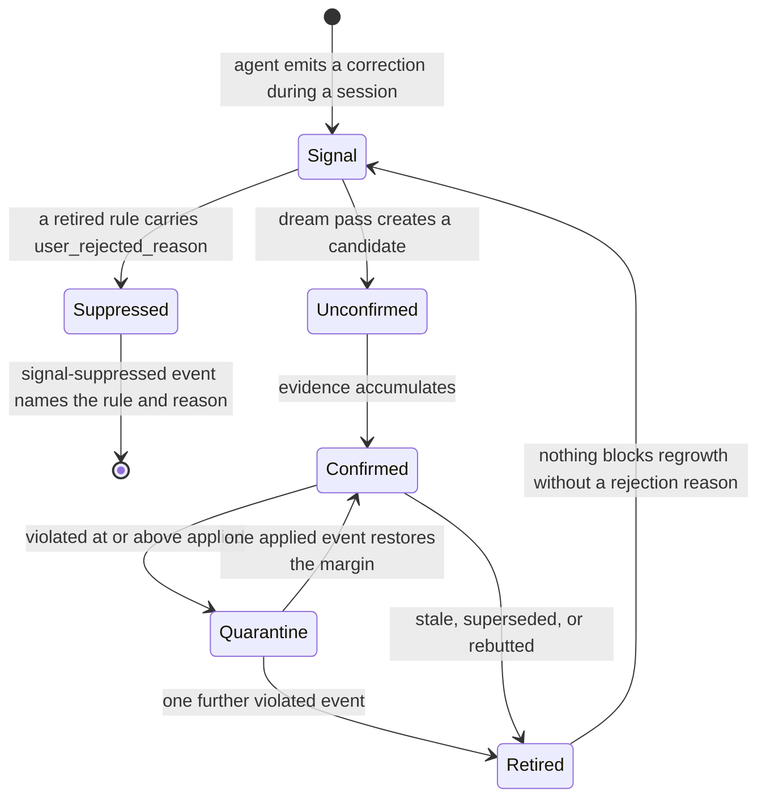

## 1. Executive Summary

Open Second Brain (`o2b`) is a local-first memory that lives inside the user's
Obsidian vault — MIT, 190,847 lines of TypeScript across `src/`, 175 commits
since 6 May 2026, ten contributors, at v1.45.0. It ships an MCP server plus
adapters for Claude Code, Codex and OpenClaw, and its subject is narrow and well
chosen: **what the user keeps having to correct.**

The mechanism is a nightly **dream pass**. During sessions the agent emits
*signals*; overnight a pure planner reads the vault and decides, per topic,
exactly one transition — suppress, quarantine, create an unconfirmed preference,
mark redundant, accumulate a rebuttal, or record an unresolved contradiction —
and a separate applier writes the result. Preferences carry evidence counters,
and confidence is not a number someone picked:

```
value = wilson_low(applied, applied + violated) × freshness
```

a textbook Wilson score interval lower bound at *z* = 1.96, multiplied by a
freshness term that decays linearly from 1.0 to 0.0 across
`retire.stale_evidence_days`. Zero evidence yields zero. That is the most
defensible confidence computation in this atlas: conservative by construction, so
three-for-three scores below ninety-for-a-hundred, and it decays when the
evidence stops arriving rather than when someone remembers to prune.

**Three findings make it worth reading past the confidence.**

**The trust state is a real state machine and its demotion is asymmetric.**
`unconfirmed` → `confirmed` is promotion; a confirmed preference whose recent
evidence turns *"dominantly negative"* — `violated_count ≥ applied_count` and
`applied_count > low_max_applied` — enters a `quarantine` probation where it stays
active and listed in `Brain/active.md` but is surfaced separately in the digest.
From there **one further `violated` event retires it** with `retired_reason:
quarantine-violated`, while an `applied` event that restores
`applied_count > violated_count` returns it to `confirmed`. Getting out is one
event; falling further is also one event. Most systems here make promotion and
demotion symmetric and then wonder why rules oscillate.

**A user's rejection is a rejected-value tombstone, and the reasoning is written
down.** `o2b brain reject --reason <text>` persists `user_rejected_reason` into
the retired file's frontmatter — set *only* for user-rejected retirements and left
undefined for automatic ones. The dream pass then treats that retired rule as a
**suppressor**: signals on its topic are swallowed before candidate planning,
because *"the user explicitly rejected the rule — re-growing it from fresh
signals is exactly what they were asking us not to do."* Suppression is
scope-aware — an unscoped suppressor swallows every signal on the topic, a scoped
one only signals sharing its scope, and a signal without scope never matches a
scoped suppressor — and each swallowed signal emits a `signal-suppressed` event
naming the retired rule and the reason. That is the mechanism thirteen systems in
this atlas have, arrived at here independently, with a scope dimension none of
the others carry.

**Every preference mutation is audited at the chokepoint.** `pref-audit.ts`
appends one JSONL line per mutation to `Brain/log/pref-audit/<pref-id>.jsonl`,
written where the content hash is computed so the before/after is authoritative
and manual edits routed through the same primitives are caught too — with a no-op
contract that skips the line when `hash_before === hash_after`, so counter
refreshes do not bury real changes.

The weakness is the one this design cannot fix from inside. **The counters are
self-reported.** `applied` and `violated` are emitted by the agent about its own
behaviour, so the Wilson bound is a rigorous statistic over a possibly
unrigorous input, and nothing in the tree independently verifies that a rule the
agent claims it applied was applied.

## 2. Mental Model

A memory here is a **markdown file in the user's own vault**, and there are three
kinds in one lifecycle.

A **signal** is raw: a correction observed during a session, unpromoted, holding
no authority. A **preference** (`pref-*.md`) is a rule the system believes,
carrying evidence counters, a status, a computed confidence value and band, and a
topic. A **retired rule** (`ret-*.md`) is one that left the loop, in a different
folder with a different id prefix.

The transitions are the design. Nothing becomes a preference during a session —
promotion happens only in the nightly pass, which is a **pure function of a scan
plus config plus `now`**, with I/O and clock handled elsewhere. Given a topic
with active signals it chooses exactly one of six outcomes, and the enumeration is
the vocabulary: suppress, quarantine, create unconfirmed, note redundant,
accumulate a rebuttal (retiring the active preference, or logging a retain-pinned
when it is pinned), or record an unresolved contradiction.

Status is `unconfirmed`, `confirmed` or `quarantine`, and it is not trusted on its
own: a **status-vs-folder invariant** holds that a file in `preferences/` claiming
`retired`, or a file in `retired/` claiming otherwise, raises
`BrainStatusFolderMismatchError` on read so the doctor reports it like any other
parse failure. The state has two representations and they must agree.

Confidence is orthogonal to status. It is recomputed from counters and age, so a
`confirmed` preference whose evidence has gone stale loses confidence without
changing status, and the digest tracks the numeric value across runs to surface
drops. Bands (`low`/`medium`/`high`) are thresholds over that value, not a
separate judgement.

Death has two doors and they are not equivalent. **Automatic retirement** —
staleness, quarantine-violated, superseded — moves the file and leaves
`user_rejected_reason` undefined. **User rejection** sets it, and that single
field is what converts a retired rule from a historical record into a standing
refusal. The atlas's usual complaint about supersession is that the extractor
re-derives the claim next week; here the extractor is the dream pass, and the
dream pass checks.



## 3. Architecture

No server, no database, no daemon beyond a scheduled pass. The store is the
user's Obsidian vault — `Brain/preferences/`, `Brain/retired/`, `Brain/active.md`
as the injected rule list, and `Brain/log/pref-audit/` for the mutation trail.
Everything is markdown with YAML frontmatter, so the memory is readable, diffable
and editable in the tool the user already has open, and the invariants exist
because hand-editing is expected rather than tolerated.

`src/core` is organised by concern in a way that maps unusually well onto this
atlas's questions: `brain/` (253 modules — the store, the dream phases,
confidence, preferences), `search/`, `graph/`, `trust/` under brain, plus
`integrity/`, `hygiene/`, `maintenance/`, `reliability/`, `discipline/`, and
standalone `redactor.ts`, `secret-ref.ts`, `path-safety.ts`, `scope-key.ts`.

Retrieval is hybrid: a semantic phase and a lexical phase fused by **reciprocal
rank fusion**, MMR diversification, then result filters for visibility scope and
agent ownership, with a query cache keyed by a canonical composite scope. A
source-identity key exists so federated results from different origins never
collide, and the module owning it says why one implementation is deliberate —
*"a key mismatch silently collapses distinct results or fails to collapse
duplicates."*

Integration is an MCP server declared in two scopes — a default reader and a
writer marked `alwaysLoad: true` — plus shipped adapters for Claude Code, Codex
and OpenClaw.

### Deployment and ergonomics

An install into an existing vault; the dependency surface is small (eight npm
ranges, a Python side, no lockfile beside `package.json` at this commit). It runs
fully local and offline apart from whatever the embedding phase needs, and the
store degrades to plain notes if the tooling is removed — the strongest form of
the local-first claim, because the artifact outlives the program.

Two costs. The nightly pass is a real scheduled job with a token bill against
whatever model the phases use, and the vault is the blast radius: a bug in the
applier edits the user's notes. The project's answer is the shape of the code —
the planner is pure and the applier is separate, so the decision can be tested
without touching disk — which is the right structural answer to that risk.

## 4. Essential Implementation Paths

**Confidence** — `src/core/brain/confidence.ts` (91 lines), extracted from
`dream.ts` precisely because *"the Wilson-bound derivation and band mapping are
pure functions of the evidence counters and config."* The interval is computed
inline at `z = 1.96` with the continuity terms written out, `wilsonLow` floored at
0, freshness clamped to `[0, 1]`, and the product rounded to four decimals.
`rebandConfidence` re-derives the band for an externally adjusted value, which is
how a manual edit stays consistent.

**Transition decision** — `src/core/brain/dream-plan-topics.ts`. Pure, no I/O, no
clock beyond the `now` it is handed. Its header enumerates the six outcomes and
states the single reason it would change: *"what a cluster of active signals on a
topic means."*

**Suppression** — `applySignalSuppression` in the same module. Filters the
retired records for the topic down to those with a `user_rejected_reason`,
returns early when there are none, then per signal finds the first matching
suppressor by scope, pushes a `signal-suppressed` entry naming both, and moves the
signal to processed. Non-matching signals *"fall through and remain eligible for
candidate-pref planning"* — the tombstone is precise rather than a blanket topic
ban.

**Status and folder** — `src/core/brain/preference.ts` parses both `pref-*.md`
and `ret-*.md`, owns the `preferences/ → retired/` mover, and raises
`BrainStatusFolderMismatchError` when frontmatter and folder disagree.

**Audit** — `src/core/brain/pref-audit.ts`, appended at the three mutation
chokepoints `writePreferenceTxn`, `moveToRetired` and `mergePreferences`.

**Rejection** — the CLI path behind `o2b brain reject --reason <text>`, the only
writer of `user_rejected_reason`.

**Retrieval** — `src/core/search/` (`semantic-phase.ts`, `query-cache.ts`,
`result-filters.ts`, `cards.ts`), with scope normalisation from
`src/core/scope-key.ts`.

**Dream orchestration** — fifteen `dream-*.ts` modules split by phase: `scan`,
`plan` (with `-topics` and `-retires`), `stage`, `apply`, `refresh`, `report`,
`summary`, `gates`, `workrun`, `step`, `phases`, `types`.

## 5. Memory Data Model

Frontmatter on a markdown file, and the fields are the model: an `id` prefixed
`pref-` or `ret-`, a `topic`, an optional `scope`, a `status`, `applied_count`
and `violated_count`, `last_evidence_at`, a computed confidence `value` and
`band`, a `memory_layer` from an `L0`-style ladder, a `memory_branch`, and — on
retired files only — `retired_reason` and optionally `user_rejected_reason`.

Two properties are worth separating. **Identity is the file**, so a preference has
a stable name a human can link to with Obsidian's `[[wikilinks]]`, and the report
events render exactly that. And **the topic is the value key**: suppression,
redundancy and contradiction are all decided per topic, which is what lets a
rejection outlive the specific file that carried it.

Temporal fields are single-axis — `last_evidence_at` is when evidence last
arrived, not a validity interval — so there is no bitemporal claim here and the
mark is withheld. Freshness decay does the work a validity window would do, less
precisely and much more cheaply.

Scoping is a composite owner/session/project key. It partitions dedup
unconditionally and filters search results when supplied; `cards.ts` notes that
*"an omitted or blank scope filters nothing, so an unscoped call is"* unfiltered
— honest, and the caveat a reader should carry.

## 6. Retrieval Mechanics

Two arms fused. The semantic phase produces candidates for downstream filtering;
a lexical phase runs beside it; reciprocal rank fusion merges them, MMR
diversifies, and `result-filters.ts` applies visibility scope, agent ownership and
terminal-status filtering afterwards. A query cache is keyed on the canonical
composite scope so a cache hit cannot cross a scope boundary.

The design decision worth naming is that **the scope key and the source-identity
key are one module on purpose**, with the failure mode stated: a mismatch either
collapses distinct results or fails to collapse duplicates. Systems that grow a
second key for federation usually discover this the other way around.

Separately from search, `Brain/active.md` is the always-injected rule list — the
confirmed and quarantined preferences the agent is meant to follow. So there are
two read paths with different jobs: search answers questions, and the active list
is standing instruction. Quarantined rules stay in the injected list while being
flagged separately in the digest, which is a deliberate choice — a rule under
suspicion still applies until it is retired.

## 7. Write Mechanics

**Nothing is promoted on the hot path.** A session emits signals; the agent is
not blocked on any memory computation; and the decision about what those signals
mean is deferred to the nightly pass. That is the cleanest separation of capture
from consolidation in this corpus, and it is why the planner can afford to be
pure.

The pass is scan → plan → stage → apply → refresh → report. Refresh recomputes
confidence for touched preferences, which means the numeric value moves without
any new decision, and the digest's drop tracker compares values across runs to
surface a preference that is quietly losing support.

Update is a transaction (`writePreferenceTxn`) with a content hash, and the audit
line is written where that hash is computed. Deletion is a move rather than an
unlink: `moveToRetired` relocates the file and flips the id prefix, so the
history stays in the vault and stays greppable.

Conflict has somewhere to go and it is not always resolution: a topic can be
recorded as an **unresolved contradiction** rather than forced into a winner,
which is the honest outcome most conflict detectors lack. Rebuttals accumulate
against an active preference and can retire it, unless it is pinned — in which
case a `retain-pinned` is logged rather than the pin being silently overridden.

The exposure is the input. Counters arrive from the agent's own reports, and
`self-approval-guardrail.ts` exists to keep a cluster from confirming itself —
the quarantine outcome fires when that guardrail is not satisfied — but a
guardrail against self-approval is not the same as independent verification that
a rule was applied.

## 8. Agent Integration

An MCP server in two scopes: a reader, and a writer marked `alwaysLoad: true` so
the capture path is present without the agent choosing it. Adapters ship for
Claude Code, Codex and OpenClaw, and the vault format means anything that can
read markdown can read the memory whether or not it speaks MCP.

The division of labour is unusually clear. The **agent** emits signals and
evidence and reads the digest and active list. The **nightly pass** decides what
those signals mean. The **user** confirms, pins, and rejects — and rejection is
the only input that creates a standing refusal. No single actor can both propose
a rule and make it authoritative, which is the property `self-approval-guardrail.ts`
is named for.

## 9. Reliability, Safety, and Trust

The trust model is the product, and section 2 covers its states. Three further
things are built rather than described.

**Provenance is typed.** `untrusted-source.ts` and `trust/untrusted-provenance.ts`
exist, and `trust/retrieval-gate.ts` and `retrieval-receipts.ts` sit on the read
path, so where a claim came from is a first-class input rather than a comment.

**Secrets have a representation.** `redactor.ts` and `secret-ref.ts` mean a value
that should not land in a vault file has somewhere to go other than the file — the
opposite of the pattern this atlas usually finds, where content is written first
and scanned never.

**The vault is treated as hostile input to itself.** `path-safety.ts`,
`integrity/`, `hygiene/`, the doctor and its readiness checks, and the
status-vs-folder invariant all exist because the user edits these files by hand
and a malformed one must fail loudly rather than silently degrade a rule.

The gaps. **Self-reported counters**, as above, are the structural one.
**Confidence has no floor on `n`** in the mark's sense — the Wilson bound handles
small samples correctly by being conservative, which is right, but a preference
can sit at `low` indefinitely while remaining active. And an **unscoped search
filters nothing**, so scope enforcement is a property of the call site as much as
of the store.

## 10. Tests, Evals, and Benchmarks

1,031 test files and 172,320 lines of tests against 190,847 lines of source — a
ratio at the top of anything in this atlas, and the tests are organised to mirror
`src/core` rather than piled in one directory.

The memory-specific coverage lands where the risk is:
`tests/core/brain/preference-semantics.test.ts` pins that `moveToRetired`
preserves memory-semantics metadata and that invalid `memory_layer` values and
`memory_branch` slugs are rejected; `tests/core/brain.body-hygiene.test.ts`
asserts the suppression log both ways — `expect(log).toContain("signal-suppressed")`
and, in the complementary case, `expect(log).not.toContain("signal-suppressed")`;
`tests/core/brain/temporal/weekly-brief.test.ts` checks that the contradictions
list combines suppression with violated evidence.

The `negative_eval` mark is **withheld and it is close.** Those suppression
assertions are the right shape — committed cases pinning that particular material
does not appear — but what they assert is that a signal is not *promoted*, which
is the write path. The mark as this atlas defines it wants a case asserting that
particular material is not *retrieved*, and the retrieval suite's filters are not
pinned that way. The mechanism is there; the assertion is one layer upstream of
where the mark looks.

What is absent is any retrieval-quality measurement — no fixture corpus with
expected hits, no precision or recall figure, no benchmark committed. For a
system whose confidence math is this careful, the missing number is how often the
promoted preferences were the right ones.

**No paper, arXiv reference or citation file exists in this repository.**

## 11. For Your Own Build

### Steal

**Compute confidence as a lower bound, not an average.** `wilson_low(applied, n)`
means three-for-three does not outrank ninety-for-a-hundred, which is exactly the
failure a naive ratio has and exactly what makes early preferences dangerous.
Ninety lines, no dependencies, and it makes "measurable confidence" a checkable
claim.

**Multiply by freshness rather than running an expiry job.** Confidence decaying
linearly to zero across a staleness window means an unused rule fades without a
sweep, and the number that decays is the same one the digest compares across runs.

**Make demotion asymmetric and give it a probation state.** A confirmed rule whose
evidence turns negative should not be deleted and should not stay trusted;
`quarantine` keeps it active, flags it in the digest, and lets one more violation
end it. Symmetric thresholds produce oscillation.

**Let a user's rejection be a different kind of death from an automatic one.** One
optional field — `user_rejected_reason`, written only by an explicit reject
command — is the whole difference between a retirement the extractor may undo and
one it may not.

**Scope the suppression.** An unscoped rejection covers the topic everywhere; a
scoped one covers only its scope; a signal with no scope never matches a scoped
suppressor. That is the answer to this pattern's standard objection, which is
that value-keyed blocking is too blunt.

**Emit an event for every suppression.** A tombstone that silently swallows input
is indistinguishable from a bug. One `signal-suppressed` line naming the retired
rule and the reason makes the refusal auditable and lets the user see the cost of
their own rejection.

**Audit at the mutation chokepoint, where the hash is computed.** Writing the
trail beside the content hash makes the before/after authoritative and catches
edits that arrive through other doors — and a no-op contract on unchanged content
keeps counter churn from burying real changes.

**Give the state two representations and check them against each other.** Status
in frontmatter, lifecycle in the folder, and an error on read when they disagree.
Hand-editable stores need an invariant that fails loudly.

### Avoid

**Do not let the subject of a claim be its only witness.** `applied` and
`violated` are self-reported by the agent whose behaviour they describe, so a
compliant reporter can manufacture confidence that the Wilson bound will then
present as rigour. If the counters cannot be independently sampled, say so where
the confidence is displayed.

**Do not promote on the hot path.** Deferring every promotion to a scheduled pass
is what lets the decision logic be pure, testable and reversible — and it removes
the class of bug where a mid-session correction immediately becomes a rule that
shapes the rest of the session.

**Do not let an unscoped call silently mean unfiltered.** It is a defensible
default and it means scope enforcement lives at the call site; a store that
cannot tell the difference between "all scopes" and "no scope specified" will
eventually leak across one.

### Fit

This suits one person with an Obsidian vault and a coding agent they keep
correcting, who wants those corrections to stop being repeated and is willing to
run a nightly job. It is the best-argued instance in this atlas of the narrow
idea that *the thing worth remembering is the correction*, and the vault format
means the memory survives the tool.

It does not suit a team or a service: scope is owner/session/project inside one
person's vault, there is no tenancy, and the trust model assumes the evidence
reporter and the beneficiary are the same well-meaning agent. It also does not
suit anyone who needs the memory to hold facts about the world — the unit is a
behavioural rule with an application rate, and a claim that is simply true has no
`applied_count`.

The maintenance budget is real — 253 modules under `brain/` alone — but the
seams are drawn where a reader would want them, and the three mechanisms above
are each a file or two and separable from the rest.

## 12. Open Questions

- Is anything planned to verify `applied` independently of the agent's own
  report? `self-approval-guardrail.ts` bounds who may confirm, not whether the
  evidence is real.
- Can a user lift a rejection? `user_rejected_reason` arms a permanent
  suppressor; nothing found removes it short of editing or deleting the retired
  file by hand, which the pattern page argues every tombstone eventually needs.
- What happens to a suppressor when the topic taxonomy shifts — a rejection keyed
  on a topic that later splits, or a rule rephrased under a new topic?
- How often does the dream pass reach `unresolved contradiction` in practice, and
  what drains that queue?
- The `memory_layer` ladder (`L0`, …) is validated but its semantics were not
  traced here; how a layer interacts with confidence and with the active-list
  budget is unexamined in this report.

## Appendix: File Index

**Confidence and status** — `src/core/brain/confidence.ts`,
`src/core/brain/types.ts` (`BRAIN_PREFERENCE_STATUS`, `BRAIN_CONFIDENCE`,
`BRAIN_MEMORY_LAYER`).

**Dream pass** — `src/core/brain/dream-plan-topics.ts` (transitions and
`applySignalSuppression`), `dream-scan.ts`, `dream-plan.ts`, `dream-apply.ts`,
`dream-refresh.ts`, `dream-gates.ts`, `dream-report.ts`.

**Preference lifecycle** — `src/core/brain/preference.ts`, `preference-txn.ts`,
`preferences-collect.ts`, `pref-audit.ts`, `active.ts`, `active-budget.ts`.

**Trust** — `src/core/brain/trust/` (`self-approval-guardrail.ts`,
`compute-trust-verdict.ts`, `retrieval-gate.ts`, `retrieval-receipts.ts`,
`untrusted-provenance.ts`, `role.ts`).

**Retrieval** — `src/core/search/` (`semantic-phase.ts`, `result-filters.ts`,
`query-cache.ts`, `cards.ts`), `src/core/scope-key.ts`.

**Safety** — `src/core/redactor.ts`, `src/core/secret-ref.ts`,
`src/core/path-safety.ts`, `src/core/integrity/`, `src/core/hygiene/`.

**Integration** — `.mcp.json`, `src/mcp/`, `src/openclaw/`, `plugins/`.

**Tests** — `tests/core/brain/preference-semantics.test.ts`,
`tests/core/brain.body-hygiene.test.ts`,
`tests/core/brain/temporal/weekly-brief.test.ts`, `tests/core/brain.types.test.ts`.

## History

**2026-08-13** — [`8d05a62a329dc650113f6c45ca2108727a3b07a9`](https://github.com/itechmeat/open-second-brain/commit/8d05a62a329dc650113f6c45ca2108727a3b07a9)
— first reading, at v1.45.0. Screened before reading: 2 auto-run surfaces
(`.githooks/` with a `pre-commit` and `pre-push`, activated by the package
`prepare` script setting `core.hooksPath`; and `.mcp.json` declaring two server
scopes), 1 build-time exec, 2 dependency surfaces inside the seven-day cooldown,
2 unpinned manifests. Both hooks run only `bun run fmt:check`, `lint` and
`typecheck`, reach no network, and exit 0 when bun is absent. Nothing was
installed and nothing was executed; the Wilson derivation was read rather than
run.
