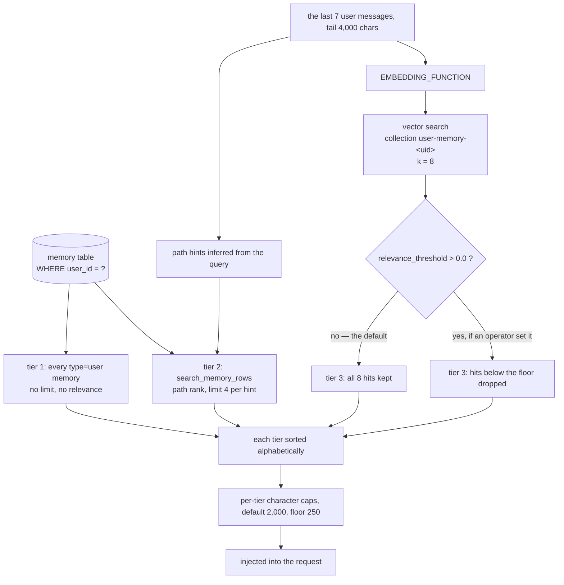

## 1. Executive Summary

Open WebUI is a self-hosted front-end for chat models — a FastAPI backend of
about 114,000 lines of Python behind a Svelte application, 18,391 commits from
roughly 900 contributor addresses since October 2023.

Its licence is a BSD-3 variant with a fourth clause making removal of the "Open WebUI" branding "a
material breach" in any deployment reaching fifty end users in a rolling thirty
days, absent written permission or an enterprise licence. That is a restriction
on modification, so the licence is source-available rather than open source, and
it constrains deployment rather than reading; `LICENSE_HISTORY` preserves the
terms that applied to earlier material.

The part this atlas is about is 1,500 lines across three files —
`models/memories.py`, `routers/memories.py` and `utils/memory.py` — and it
qualifies plainly: a memory survives the session as a row with a UUID, and both
a person and the model can correct it by that id.

**The scope key is real, which is worth saying first because the file layout
suggests otherwise.** The table carries `user_id`, every user-facing read is
`select(Memory).filter_by(user_id=user_id)` (`models/memories.py:117`), and each
mutation re-checks `memory.user_id != user_id` and raises instead of trusting the
id it was handed. Two unscoped helpers sit beside the scoped ones —
`get_memory_by_id` and `delete_memory_by_id` — and neither has a caller anywhere
in the tree. The one unscoped read that *is* called, `get_memories()`, is the
admin `/reindex` endpoint, and it groups by `user_id` before it does anything.

**The finding is a guard that argues for itself and then ships off.**
`query_memory` applies a relevance threshold, and the comment above it states the
reason better than a summary can:

> "Vector similarity search always returns the top-K nearest neighbours even when
> they are completely irrelevant; applying the same RELEVANCE\_THRESHOLD used by
> RAG ensures only genuinely matching memories are surfaced"

The code is `relevance_threshold = await Config.get('rag.relevance_threshold', 0.0)`
followed by `if results and relevance_threshold > 0.0` (`routers/memories.py:361-362`),
and the setting's default is `float(os.getenv('RAG_RELEVANCE_THRESHOLD', '0.0'))`.
The gate is strictly greater than zero and the default *is* zero, so on a default
install the filter never executes. The reasoning was done, written down, and
left inert.

**And the ranking is discarded even where the filter is on.** `add_memory_context`
builds three tiers and then sorts each one alphabetically —
`sorted(sections[key], key=lambda memory: (memory.casefold(), memory))`
(`utils/memory.py:369`) — so the order the model reads carries no relevance
information at all. The vector search ranks eight candidates; the assembly
alphabetises them.

One capability mark, `scope_enforced`.

## 2. Mental Model

A memory is a line of text with a filesystem-shaped address. The row is `id`,
`user_id`, `type`, `path`, `content`, `meta`, and two epoch timestamps
(`models/memories.py:15-28`), and `path` is what makes it more than a list: it is
a free-form string like a directory, and retrieval ranks by how close a memory's
path sits to a path inferred from the query.

**`type` has two values and decides a tier, not a standing.** `user` or
`context`, and `normalize_memory_type` is the whole vocabulary:

```python
return 'user' if memory_type == 'user' else 'context'
```

Anything else — a typo, a new value from a future client, a model inventing a
third category — becomes `context` silently. A `user` memory is injected on every
turn unconditionally; a `context` memory has to be retrieved. That is a genre
assigned at write time, which is why it earns no trust mark: nothing about the
value records whether the memory is still true.

**A memory has one state: present.** There is no candidate, verified, superseded
or archived. `valid_from`, `valid_to`, `as_of`, `expires_at` and `invalid_at`
return nothing from the model file, and neither do `confidence` or a status
column. Correction is destructive, which section 7 covers.



## 3. Architecture

Three files hold the subsystem, and the split is clean:

- **`models/memories.py`** (268 lines) — the table, the Pydantic mirror, and
  `MemoriesTable` with the reads, the deletes and `apply_memory_operations`.
- **`routers/memories.py`** (630 lines) — the HTTP surface, the embedding calls,
  the per-user vector collection, and the admin reindex.
- **`utils/memory.py`** (602 lines) — the in-process filter
  (`search_memory_rows`), the three-tier assembly (`add_memory_context`), and the
  background review.

Four migrations record how the model grew: `add_memory_type`,
`add_memory_path_and_meta`, `add_memory_user_id_index` and a covering index on
`(id, user_id)` — the last two being the shape you add once the scope predicate
is on the hot path.

The vector side is a partition rather than a predicate. `f'user-memory-{user.id}'`
appears at every upsert, delete, delete-collection and search
(`routers/memories.py:173`, `:289`, `:350`), so one user's embeddings are a
different collection rather than a filtered row set. That is a stronger boundary
than a `WHERE` in one sense — there is no query to forget the key in — and a
weaker one in another, since it rests on the collection name being derived
correctly at every call site rather than on a constraint the store enforces.

### Deployment and ergonomics

- **What has to be running:** the backend, a database, and a vector store the
  `ASYNC_VECTOR_DB_CLIENT` abstraction supports.
- **Embedding:** `EMBEDDING_FUNCTION` may be an external API. The code routes
  around the cost explicitly: the add, query and update endpoints each carry a
  note saying they deliberately do *not* take `Depends(get_async_session)`, so a
  database connection is not held for the "1-5+ seconds" an embedding call can
  take.
- **Feature gates:** memory is off unless `memories.enable` is set, and a
  non-admin additionally needs the `features.memories` permission
  (`routers/memories.py:35-47`). A model can be excluded by `model_allows_memory`.

## 4. Essential Implementation Paths

**Read, scoped.** `get_memories_by_user_id` —
`select(Memory).filter_by(user_id=user_id)` (`:117`). Every user-facing endpoint
calls this one.

**Filter, in process.** `search_memory_rows` (`utils/memory.py:91`) takes a list
already scoped by user and narrows it by id, by `type`, by path proximity and by
query tokens, sorting on path rank then `updated_at` descending, with the limit
clamped to at most 100. It is a pure function over rows the caller fetched.

**Assemble.** `add_memory_context` (`utils/memory.py:289`) joins the last seven
user messages, keeps the trailing 4,000 characters as the query, and fills three
sections — `user`, `neighborhood`, `context` — deduplicating by id with the
`user` tier winning. Then the alphabetical sort, then per-tier character caps
read from config with a floor of 250 and a default of 2,000.

**Write, three ways.** A person posts to `/add`, which stamps
`meta={'created_by': 'manual'}`. The model calls a built-in tool
(`tools/builtin.py` exposes `add_memory`, `list_memory_paths`, `read_memory_path`
and a scoped delete). And the background review posts operations with
`source='background_review'`. Both agent paths go through the same
`/operations` endpoint, which stamps provenance the manual path does not get:
`created_by`, `chat_id`, `message_id` and `model`.

**Correct.** `apply_memory_operations` (`models/memories.py:168`) takes
`add`, `replace`, `move` and `remove`, each re-checking ownership.

## 5. Memory Data Model

The table is small enough to quote in full in its own terms: `id` a UUID string
and primary key, `user_id` indexed, `type` defaulting to `context` at both the
Python and server level and indexed, `path` nullable text, `content` text,
`meta` JSON nullable, `updated_at` and `created_at` big integers holding epoch
seconds. A covering index on `(id, user_id)` exists because the ownership check
reads both.

**What the schema does not carry is the interesting half.** No status, no
confidence, no validity interval, no supersession pointer, no soft-delete flag.
The two timestamps are record time: when the row appeared and when it last
changed. There is no axis for when the remembered fact was true, and no read
takes an as-of parameter, so the store cannot answer *what did I believe then*.

`meta` is the escape hatch and it is untyped JSON. The agent paths put
`created_by`, `chat_id`, `message_id` and `model` in it, which is real provenance
— a memory can be traced back to the turn that produced it — but nothing reads
those keys on any path, and a `replace` merges the new meta over the old
(`models/memories.py:229`), so the `created_by` of a corrected memory becomes the
corrector rather than the author.

## 6. Retrieval Mechanics

Three tiers, and they are not equally guarded.

**Tier one is unconditional.** Every memory with `type == 'user'` is injected,
sorted by `(path, updated_at, id)`, with no limit and no relevance test. The only
bound is the tier's character cap. A user-tier memory is therefore a standing
instruction, and the store has no opinion about how many of them there should be.

**Tier two is lexical and path-shaped.** For each hint `memory_path_hints`
derives from the query, `search_memory_rows` returns at most four `context`
memories whose path is related to the hint — by path rank, or by the hint
appearing in the memory's path or content.

**Tier three is the vector search, and it is the one with the floor that is not
set.** `query_memory` embeds the query, searches the user's own collection with
`limit=k` (8 from `add_memory_context`), and then:

```python
relevance_threshold = await Config.get('rag.relevance_threshold', 0.0)
if results and relevance_threshold > 0.0 and results.distances and results.distances[0]:
```

`RAG_RELEVANCE_THRESHOLD` defaults to `0.0`, and the branch requires strictly
more than `0.0`, so the filtering block is dead on a default install and all
eight nearest neighbours are kept however far away they are. The comment
directly above it is an argument for exactly the filter the default disables.

**Then the ranking is thrown away.** Each section is alphabetised before it is
rendered (`utils/memory.py:369`). Whatever order the vector store returned — and
whatever order `search_memory_rows` computed from path rank and recency — does
not reach the model. For the `user` tier that costs nothing, since it is
unranked by design. For the other two it discards the only signal that decided
which memories were chosen.

## 7. Write Mechanics

`add` deduplicates on the exact tuple `(user_id, content, type, path)` and reports
`status: skipped, reason: duplicate` on a hit. The key is the value rather than
the row, which is the right instinct, and it is exact-string: a re-assertion
differing by a space, a capital letter or a trailing full stop inserts a second
row. Nothing normalises before comparing.

**`replace` overwrites and keeps nothing.** `memory.content = content` with a new
`updated_at` (`models/memories.py:216-232`). The text that was there is gone —
there is no prior-value column, no supersession row, no event carrying the old
content. A memory the model corrects has no history, and the correction is
indistinguishable afterwards from a memory that was always right.

**`remove` hard-deletes.** `await db.delete(memory)`. No tombstone, so the same
content can be re-added the next turn and the store has no way to know it was
rejected — which is exactly what an automatic reviewer running every tenth turn
might do.

**`move` changes only `path`,** which makes the address mutable while the id
stays put. That is the correct split, and it means a path is a label rather than
an identity.

Every one of the four re-checks `memory.user_id != user_id` and raises
`ValueError` rather than silently doing nothing, and the whole batch commits once
at the end.

## 8. Agent Integration

Memory reaches the model two ways. As **tools**, through
`backend/open_webui/tools/builtin.py`: `list_memory_paths`, `read_memory_path`,
`add_memory`, and a delete that calls the ownership-checked
`delete_memory_by_id_and_user_id`. And as **injected context**, through the
single seam at `utils/middleware.py:2667`, which is the only caller of
`add_memory_context` in the tree.

The **background review** is the part that decides what to remember without being
asked. It is opt-in (`memories.background_review.enable`), fires when the user
turn count is divisible by `memories.review_interval_turns` — default 10, floored
at 1 — and then:

```python
task = asyncio.create_task(_review_memory(...))
```

fire and forget, with a done-callback whose entire body on failure is
`log.debug('Memory review failed: %s', e)`.

`_review_memory` shows the model the last sixteen messages, each truncated to
1,600 characters as a head-and-tail split, and a listing of existing memories —
**capped at eighty**:

```python
for memory in (existing_memories or [])[:80]
```

`get_memories_by_user_id` has no `ORDER BY`, so which eighty depends on what the
database returns. Past that many memories, the model being asked to propose a
`replace` is choosing an id out of a truncated, unordered view of the store,
while the only automatic protection against re-adding something — the `add`
dedup — is exact-content. The two limits interact in the direction that produces
duplicates and mis-targeted corrections.

## 9. Reliability, Safety, and Trust

**What holds.** The scope key is applied on every live read and re-checked on
every mutation, and the unscoped helpers are unreachable. The vector collection
is per user at every call site. Memory is gated twice, by a global setting and a
per-user permission. Provenance is recorded on agent writes. And the embedding
cost is kept off the database connection deliberately, with the reason in a
comment.

**`scope_enforced` is earned** on `user_id` as a read filter plus the per-user
collection.

**Everything else is withheld, and three of them for reasons worth stating.**

`audit_log`: the mutations do emit events — `publish_event(request,
EVENTS.MEMORY_CREATED, actor=user, subject_id=memory.id, ...)` carries an actor
and a subject. But every sink is a broadcast: `SocketSessionEventSink`,
`EventFunctionSink`, `WebhookEventSink`, `NotificationEventSink`. None writes a
row, and `events.py` contains no insert or commit. The record exists as a
message, not as state, so nothing in the system's own store says a memory was
created, replaced or deleted.

`tombstone`: the `add` dedup is keyed on the value, which is the shape, but it
consults *live* rows. A removed memory leaves nothing behind for it to consult.

`trust_state`: `type` is a write-time genre, and `normalize_memory_type` collapses
every unrecognised value into `context`.

`bitemporal`, `human_review`, `negative_eval`: no validity axis and no as-of read;
no surface where a memory waits for a person — an agent write is live the moment
it commits; and no test names the memory subsystem at all.

**Three silent degradations, and they compound.** Seven bare `except Exception`
blocks in the model return `None` or `False`, so a database failure and an empty
store are the same answer — and `search_memory_rows` opens with
`list(memories or [])`, which turns the failure into "nothing matched". The
vector query inside `add_memory_context` is wrapped in `except Exception:
log.debug(e)`, so a vector-store outage drops the semantic tier while the other
two still fire and the prompt looks normal. And the background review is a
detached task logging its own failure at debug. A deployment can lose the
semantic half of its memory, or the writer that fills it, and see nothing at a
default log level.

## 10. Tests, Evals, and Benchmarks

**No test names the memory subsystem.** `find . -iname "*test*" | grep -i memor`
returns nothing, and the repository's `test/` directory holds no memory case.
That is the ground for withholding `negative_eval`, and it also means the
scope-key boundary in section 9 is read from the code rather than pinned by a
committed assertion — the strongest property here is the one nothing would catch
regressing.

**No paper and no benchmark.** `arxiv`, `bibtex`, `@article`, `@misc` and
`citation` return nothing from the README, and there is no `CITATION.cff`. The
project makes no accuracy or recall claim about its memory, which is the honest
posture for a chat front-end, and the atlas records it rather than treating the
absence as a gap.

**Nothing was executed from this checkout.**

## 11. For Your Own Build

### Steal

- **Scope the vector store by collection, not by predicate.** One collection per
  user means there is no query in which the key can be forgotten. It costs a
  correct derivation at each call site, which here is five of them and all five
  agree.
- **Record which turn produced a memory.** `created_by`, `chat_id`, `message_id`
  and `model` on every agent write is provenance most stores in this corpus do
  not keep — and it costs one dict.
- **Keep the embedding call off the database connection, and say why.** Three
  endpoints carry a note explaining that they skip the shared session dependency
  because an external embedding call can take seconds. The next person to "tidy
  up" the dependency injection will read it.

### Avoid

- **A threshold whose default disables it.** If a comment has to argue for a
  filter, the default should be the value the argument supports. `> 0.0` against a
  default of `0.0` means the code and the comment disagree and the code wins
  silently.
- **Ranking and then alphabetising.** Whatever order retrieval computes should be
  the order assembly preserves, or the ranking is work done for nothing.
- **A correction that destroys its predecessor.** `replace` on the content column
  leaves no way to ask what the memory used to say, which is the question a
  reader debugging a wrong memory asks first.
- **Two limits that interact.** An eighty-row unordered view of the store, plus
  exact-content dedup, plus an automatic reviewer proposing replaces by id.
  Each is defensible alone.

### Fit

Worth adopting if you want per-user memory inside a chat product and a
path-shaped namespace is a good fit for how your users think. Set
`RAG_RELEVANCE_THRESHOLD` before you rely on the semantic tier, and decide what
your `user`-type budget is, because the code will not decide it for you.

## 12. Open Questions

- Will the relevance threshold ever default above zero? The comment argues for
  it, the config plumbing exists, and the only thing between them is the default
  in `config.py`.
- Does the alphabetical sort predate the vector tier? It costs nothing on the
  unranked `user` tier and discards the ranking on the other two, which reads
  like a rule written for the first case and applied to all three.
- What happens past eighty memories? The reviewer's view truncates with no
  ordering while dedup stays exact-content, and nothing in the repository
  measures the outcome.
- Would a soft delete be cheaper than it looks? A `deleted_at` column would give
  the `add` dedup something to consult and make a re-added memory detectable,
  which is the one thing the automatic writer can do wrong repeatedly.

## Appendix: File Index

| Path | What it holds |
| --- | --- |
| `backend/open_webui/models/memories.py` | The table (`:15-28`), `normalize_memory_type` (`:47`), the scoped read (`:117`), `apply_memory_operations` with `replace` (`:216`) and `remove` (`:251`) |
| `backend/open_webui/routers/memories.py` | The permission gate (`:35`), the per-user collection (`:173`, `:289`, `:350`), `query_memory` (`:332`) and its unset threshold (`:361-362`), the admin reindex (`:449`) |
| `backend/open_webui/utils/memory.py` | `search_memory_rows` (`:91`), `add_memory_context` (`:289`), the alphabetical sort (`:369`), the review interval (`:438`), the detached task (`:446`), the eighty-row cap (`:480`) |
| `backend/open_webui/events.py` | `publish_event` (`:1174`) and the four sinks it fans out to (`:1171`) — none durable |
| `backend/open_webui/config.py` | `RAG_RELEVANCE_THRESHOLD` default `0.0` (`:964`) |
| `backend/open_webui/tools/builtin.py` | Memory as model-callable tools (`:798`, `:829`, `:921`, `:1068`) |
| `backend/open_webui/utils/middleware.py` | The single injection seam (`:2667`) |

**Searches recorded for the negative claims**

- `find . -iname '*test*' | grep -i memor` — nothing; no test names the memory
  subsystem.
- `grep -rniE 'arxiv|bibtex|@article|@misc|citation' README.md` and `ls CITATION*`
  — nothing; no paper.
- `grep -rniE 'valid_from|valid_to|as_of|expires_at|invalid_at' models/memories.py`
  — nothing; no validity axis.
- `grep -rniE 'confidence|status|score' models/memories.py` — only the `status`
  strings in `apply_memory_operations`'s return values; no column.
- `grep -rniE 'insert|db.add|commit' backend/open_webui/events.py` — nothing;
  the event sinks are broadcasts, which is why `audit_log` is withheld. Note that
  a first pass searched `models/memories.py` for `audit` and found nothing, and
  concluded too early: the events are published from the *router*, under a name
  the search did not cover.
- `grep -rn 'get_memory_by_id(\|delete_memory_by_id(' backend/open_webui` — no
  caller outside the model file, which is what makes the unscoped helpers dead
  rather than dangerous.

## History

**2026-09-17** — [`0a7c15832fb30b1903753e83f81dc7d27e5b0944`](https://github.com/open-webui/open-webui/commit/0a7c15832fb30b1903753e83f81dc7d27e5b0944) — first reading, at the request of this atlas's author. About 114,000 lines of backend Python, 18,391 commits since 6 October 2023 from roughly 900 contributor addresses; the memory subsystem is 1,500 lines of it. Licence read first because the file is titled "Open WebUI License" rather than a standard name: it is BSD-3 with a branding condition governing deployments above fifty users, which constrains redistribution and not analysis. One mark, `scope_enforced`, on `user_id` as a read filter and a per-user vector collection, with the unscoped helpers confirmed callerless. Screened before reading: no auto-run surface, two build-time execution surfaces, two unpinned surfaces, nothing inside the seven-day cooldown. Nothing was installed and nothing was run. Two absence claims were nearly published wrong and are recorded in the appendix for that reason: an `audit` search scoped to the model file missed the `publish_event` calls in the router, and the events turned out to matter — they exist, carry an actor, and persist nowhere.
