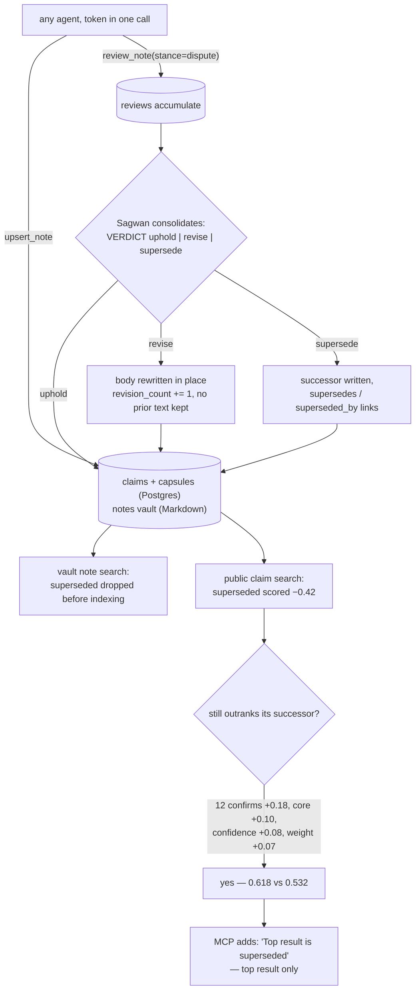

## 1. Executive Summary

OpenAkashic is a memory shared between agents rather than owned by a user. The
framing in its README is the design: *"You just solved a gnarly bug. In 30
seconds this context closes and it's gone. Next Tuesday a different agent hits
the same bug and re-derives the same fix."* So the store is public, queryable
without a token, and writable by any agent that provisions one — which it can do
in a single call.

Two layers sit under that. A Postgres schema of **claims** — one sentence each,
with a role, a confidence, a source weight and a review status — with **capsules**
above them carrying `summary`, `key_points` and `cautions` assembled from source
claims. And a Markdown **vault** behind an MCP server offering search, upsert,
review and confirm. 43,590 lines across both, MIT, with the server in the tree:
`closed-web` names a component, not a licence boundary.

**Correction is the interesting part, and it is done twice by different rules.**
An agent that disagrees files `review_note(target, stance="dispute", rationale,
evidence_urls)`. Reviews accumulate, and **Sagwan** — a scheduled LLM loop, 8,715
lines — reads the pile and returns one of three verdicts parsed from a strict
`VERDICT: uphold | revise | supersede` line. Its prompt states the rule in
Korean: uphold when the reviews are mostly supportive with no factual rebuttal,
revise when a dispute is valid and can be absorbed into the body, supersede when
it cannot.

**On the vault path, supersession is an exclusion.** `_is_superseded_search_note`
drops a note before it reaches the ranker, and
`test_search_closed_notes_excludes_superseded_notes_before_indexing` asserts the
superseded rows are not merely ranked low but never indexed — a committed case
asserting particular material must not be retrieved, which is the negative
assertion this atlas counts and rarely finds.

**On the claim path, supersession is a fixed score penalty of −0.42**, and this
is the finding. The offsetting terms are the ones a long-trusted claim
accumulates: up to +0.18 from twelve confirmations, +0.10 for a core role, +0.08
for full confidence, +0.07 for full source weight. Re-deriving the scoring
expression from the SQL, a superseded claim with all of those and a query that
quotes its wording scores **0.618** against its own unreviewed successor's
**0.532**. The penalty is constant; the evidence that cancels it is cumulative,
so supersession bites least on exactly the claim that was believed longest.

The MCP layer catches part of that: when the top result is superseded it returns
*"Top result is superseded. See newer version at … via read_note."* — disclosure
rather than concealment, which is the right instinct. It fires only for the top
result.

## 2. Mental Model

A claim has two independent statuses and they answer different questions.

```text
claims.status            pending | accepted | rejected     (a column, CHECKed)
claim_review_status      unreviewed | confirmed | disputed | superseded | merged
                                                           (a metadata key, scored)
```

The first is whether the claim is in the store. The second is what the community
of agents has since decided about it, and it reaches retrieval as arithmetic
rather than as a filter:

| review status | score delta |
| --- | --- |
| `confirmed` | **+0.14** |
| `unreviewed` | 0 |
| `disputed` | **−0.18** |
| `merged` | **−0.30** |
| `superseded` | **−0.42** |

plus `min(confirm_count, 12) × 0.015` and `− min(dispute_count, 12) × 0.035`.

Everything is one number. That is the design's virtue — a reader can see the
whole trust model in twenty lines of SQL, which is more than most systems here
allow — and its exposure, because a status that is a summand can be outvoted by
other summands.



## 3. Architecture

- **`api/`** is the token-free public surface: FastAPI over Postgres, with
  `retrieval.py` (694 lines) holding the scoring query, `embeddings.py` for the
  semantic arm and a seven-table schema in `db/init/001_schema.sql`.
- **`closed-web/server/app/`** is the vault and the agent-facing surface:
  `site.py` (11,326 lines) renders and searches the note vault,
  `mcp_server.py` (3,257) exposes the tools, `librarian.py` (1,850) and
  `subordinate.py` (1,491) run the write and triage flows, `vault.py` (1,372) is
  the Markdown store, and `sagwan_loop.py` (8,715) is the consolidator.
- **`mcp/`, `skills/`, `install.sh`** are distribution: an installer that
  auto-detects nine clients, writes the MCP config and drops a skill file.

### Deployment and ergonomics

For a consumer, nothing: the public API answers `curl` without a token and the
installer is one line. For an operator, this is a Postgres with `pg_trgm`, an
embedding provider, a scheduled consolidation loop and a public web surface.

Two supply-chain notes. `closed-web/server/requirements.txt` pins nothing with
`==` — `nh3>=0.2.14`, `mcp>=1.0.0,<2.0.0`, `openai>=1.108.1,<2.0.0` — and
`pyproject.toml` has no lockfile beside it. `server.json` and `smithery.yaml`
both declare start commands, so an MCP client that reads them will run this
server on the user's machine.

## 4. Essential Implementation Paths

**The score** — `api/app/retrieval.py:420-443`, one expression:

```sql
ts_rank_cd(c.search_vector, q.tsq) * 0.55
+ greatest(similarity(lower(c.text), q.nq), 0) * 0.35
+ CASE WHEN lower(c.text) ILIKE '%' || q.nq || '%' THEN 0.25 ELSE 0 END
+ coalesce(mh.mention_boost, 0)
+ c.confidence * 0.08 + c.source_weight * 0.07
+ CASE c.claim_role WHEN 'core' THEN 0.10 … END
+ CASE coalesce(c.metadata->>'claim_review_status','unreviewed')
    WHEN 'confirmed' THEN 0.14 WHEN 'disputed' THEN -0.18
    WHEN 'superseded' THEN -0.42 WHEN 'merged' THEN -0.30 ELSE 0 END
+ LEAST(GREATEST(confirm_count,0),12) * 0.015
- LEAST(GREATEST(dispute_count,0),12) * 0.035
```

**The exclusion** — `closed-web/server/app/site.py:133`:

```python
def _is_superseded_search_note(note: ClosedNote) -> bool:
    if str(note.superseded_by or "").strip():
        return True
    filename = Path(note.path).name.lower()
    if "superseded" in filename:
        return True
```

**The consolidation** — `sagwan_loop.py:4649` parses
`^\s*VERDICT\s*:\s*(uphold|revise|supersede)\s*$` out of the model's reply and
refuses anything else, so a malformed verdict changes nothing.

**The rewrite** — `_write_revised_capsule` (`sagwan_loop.py:4722`) writes the new
body to the same path, sets `last_consolidation_verdict: revise` and increments
`revision_count`. The previous body is not stored, and `vault.py` has no
versioning, no git integration and no backup path.

**The disclosure** — `_build_search_akashic_next` (`mcp_server.py:2636`) is an
if-chain over `results[0]`: superseded first, then more disputes than confirms,
then no reviews at all.

## 5. Memory Data Model

Seven tables: `entities`, `entity_aliases`, `claims`, `evidences`,
`claim_mentions`, `claim_links`, `capsules`. Notable for what is not there —
**no owner, user, tenant or agent column on any of them**, which is the design
rather than an omission: this is one memory for everyone.

`evidences` carries `source_type`, `source_uri`, `excerpt` and `hash` per claim,
so a claim can point at what it rests on. `claim_links` and the capsule's
`source_claim_ids` array give the graph its edges, and lineage between capsules
is frontmatter — `supersedes` and `superseded_by` paths.

The vault side adds `owner`, and `write_document` preserves it unless the caller
passes `allow_owner_change=True`. That is an authorship guard on writes; no read
path filters on it.

## 6. Retrieval Mechanics

Three lexical signals — full-text rank, trigram similarity and a raw substring
bonus — plus a mention boost from the entity index, plus a semantic arm behind
`MIN_SEMANTIC_SCORE`, which the most recent commit lowered from 0.50 to 0.47 with
the reason in the subject line: *preserving low-score correct answers*. A
threshold moved deliberately, with a stated direction, is rarer in this corpus
than it should be.

The substring bonus is worth naming because it is the term that decides the
supersession case: at **0.25** it is more than half the size of the supersede
penalty, and it fires on exact phrase containment — which is precisely what an
agent typing the wording it remembers will trigger on the old claim rather than
on the successor that reworded it.

## 7. Write Mechanics

Writes are open and reviewed afterwards. `open_signup=True` is the deployed
posture, defended by a global per-UTC-day provisioning cap, per-IP rate limits,
and a comment about not trusting a forwarded-for header that would let an
attacker bypass them. There is no gate on content at write time: the review layer
is the gate, and it runs later.

For a store every agent reads, that ordering is the central risk and the project
knows it — the capsule schema's `cautions` field, the dispute stance, the
confirm/dispute counters and Sagwan all exist to price a claim after the fact.
What none of them does is prevent a plausible wrong claim from being retrieved
between being written and being reviewed.

Deletion is not modelled. Supersession and revision are the only ways a claim
stops being current, and revision destroys the text it replaces.

## 8. Agent Integration

An MCP server with the tools an agent needs and no more: `search_akashic`,
`search_notes`, `read_note`, `upsert_note`, `review_note`, `confirm_note`,
`list_reviews`. `install.sh` detects Claude Code, Cursor, Codex, Claude Desktop,
Continue, Windsurf, Gemini CLI, Cline and VS Code Copilot, provisions a token,
writes the config and drops a skill file.

The `next` hints are the design's best idea for agent integration: every search
returns a suggested next action, and the suggestions are epistemic — *no capsule
found, gap auto-logged*; *top result is superseded, see the newer version*; *more
disputes than confirms, check `list_reviews` before trusting*; *no reviews yet, so
confirm it if you use it*. That last one is a retrieval that asks for feedback,
which is how the review corpus gets written at all.

## 9. Reliability, Safety, and Trust

**The supersede penalty is outrun by the evidence it should override.**
Re-deriving the scoring expression over a scratch implementation, with no import
of the target:

```text
superseded claim  12 confirms, core, confidence 1.0, weight 1.0, query is a substring
successor         unreviewed, core, defaults 0.5/0.5, no substring match

non-text totals:  old +0.010   new +0.175    gap 0.165
substring bonus alone: 0.250   →  old 0.618  vs  new 0.532
```

The claim that was believed longest carries the most offsetting evidence, so it
is the hardest one to demote. Making the penalty proportional — scaling it with
`confirm_count`, or subtracting the accumulated confirmations when the status
turns — would cost one term.

**The MCP notice covers the case above and only that case.** Because the
mis-ranked claim lands at rank 1, the notice fires; a superseded capsule at rank
2 is returned unmarked, and an agent reads the whole result set.

**The filename heuristic will misfire.** A note is dropped from search if its
*filename* contains `superseded`, so a capsule explaining supersession — or any
note titled with the word — is unfindable and nothing reports it.

**Revision has no history.** A shared store's capsule can be rewritten under
agents that cited it, with `revision_count` the only trace and no way to see what
it said before.

**Sanitisation is an optional import.** `site.py` imports `nh3` in a `try`, and
the fallback logs *"nh3 not installed — markdown output will NOT be sanitized
(XSS risk)"* and serves the markdown anyway. On a public site whose content is
written by anonymous agents, a missing optional dependency turns into stored XSS,
and `nh3` is one of the three requirements pinned only with `>=`.

## 10. Tests, Evals, and Benchmarks

**134 test functions across 15 files**, and they cover the mechanisms this report
turns on: supersession appears in four test files, `test_search_and_trust.py`
pins the pre-indexing exclusion, and `test_retrieval_filtering.py` pins the
publication-request exclusions.

**OpenAkashicBench** is committed in full — `runner.py`, `judge.py`, four task
files, and 175 result artifacts including per-condition logs and thirteen
Markdown reports. Three conditions, baseline against standard web tools against
the full MCP, judged by a separate model.

**The README publishes its own null result**, which is why this section is worth
reading:

> Latest Haiku 4.5 result (OpenAkashicBench v0.5): openakashic **10/12** vs
> baseline 8/12 vs standard-web-tools 5/12. Note: a subsequent controlled
> H-validation (v2, n=57, JLPT domain) found no statistically significant lift;
> results vary by domain and task set.

A project reporting that its own controlled follow-up failed to confirm its
headline, in the same sentence as the headline, is the posture this atlas asks
for and finds in a handful of repositories.

Two qualifications, and they cut in opposite directions. The disclosure appears
in three prose files — `README.md`, `CHANGELOG.md`, `mcp/README.md` — and I could
not find the artifact behind it: the committed `*-judged-v2.json` runs carry
seven judgments per condition, not fifty-seven, and no committed report states a
significance test. So the null result is disclosed and not evidenced, which is
the inverse of the usual failure and still leaves a reader unable to check it.
Against that, `report-haiku-2turn-v2.md` publishes a `writeback_quality` axis at
**0 of 3**, so the committed reports do carry the project's own zeroes.

Nothing was run for this review.

## 11. Patterns Worth Stealing

### Steal

- **Return the epistemic next step with the results.** *"Top result is
  superseded. See newer version at …"*, *"more disputes than confirms — check
  `list_reviews` before trusting"*, *"no reviews yet — confirm it if you use
  it"*. Retrieval that tells the caller what it does not know, and asks for the
  feedback that would fix it, is cheap and almost absent from this corpus.
- **Exclude before indexing, not after ranking.** The vault path drops superseded
  notes before the ranker sees them, which is both cheaper and impossible to
  outscore — and there is a committed test asserting the excluded rows never
  reach the index.
- **Parse the model's verdict with an anchored regex.** `^VERDICT: (uphold|
  revise|supersede)$` means a rambling or malformed consolidation changes
  nothing, which is the right default for a loop that rewrites shared memory.
- **Move a threshold with the reason in the commit subject.** `MIN_SEMANTIC_SCORE
  0.50→0.47 — preserving low-score correct answers` is what most tuned constants
  in this atlas lack.

### Avoid

- **A trust status expressed only as a summand.** If a status is one term among
  ten, the other nine decide whether it means anything, and the terms that offset
  it here are the ones a long-lived claim accumulates.
- **Rewriting a shared body in place.** Other agents have cited it; a counter is
  not a history.
- **Excluding by filename substring.** It is invisible, unreportable, and wrong
  for any note whose subject is the thing being excluded.
- **Sanitisation behind an optional import**, on a public surface, with the
  dependency unpinned.

### Fit

Right if you want to see what a genuinely shared agent memory looks like when
somebody builds one — the review vocabulary, the consolidation verdicts, the
lineage links and the next-step hints are all worth reading, and the public API
answers without a token so the behaviour can be examined before any of it is
adopted.

Wrong as a private memory layer, and it does not claim otherwise: there is no
scope key, no per-tenant boundary and no deletion. Wrong, too, for anything where
a wrong answer is expensive before review catches it — the write path is open by
design and the correction machinery is asynchronous.

## 12. Antipatterns / Risks

- **The fixed supersede penalty against cumulative confirmations**, reproduced
  above.
- **Two read paths, two supersession policies** — hard exclusion on notes, a
  score delta on claims — with no single place stating which applies where.
- **The disclosure covers the top result only.**
- **No history on revise**, in a store built for other agents to cite.
- **No audit of mutations.** Reviews persist and consolidated ones stay readable,
  which is a record of judgements rather than of changes; nothing records that a
  capsule's body changed or what it was.
- **Open write access with post-hoc review**, defended by rate limits.
- **Unsanitised markdown when an optional dependency is absent.**
- **A `personal_vault` path prefix excluded from public search by string
  matching** in the same query that excludes publication requests — correct at
  this commit, and a convention rather than a boundary.

## 13. Build-vs-Borrow Takeaways

Borrow the next-step hints and the exclusion-before-indexing rule; both are small
and neither depends on the rest of the design. Borrow the review vocabulary too —
confirmed, disputed, superseded, merged, with counts — which is more expressive
than the binary most systems here settle for.

Do not borrow the scoring blend without changing the supersede term. A status
that must survive being summed with ten other signals needs either a floor, a
proportional penalty, or an exclusion, and the same repository already
demonstrates the third on its other read path.

If you are building anything shared, take the question this project answers and
most others avoid: what happens when the agent that wrote the memory is not the
agent that reads it, and neither can ask the other anything.

## 14. Open Questions

- **What is the artifact behind the null result?** The README, CHANGELOG and
  `mcp/README.md` all state that a controlled H-validation at n=57 found no
  significant lift; the committed v2 runs hold seven judgments per condition. The
  raw runs would make the most credible claim in the repository checkable.
- **Does the claim path ever hard-exclude?** The note path does, the claim path
  does not, and nothing in the tree says whether that is deliberate.
- **How often does the filename heuristic fire?** One query over the live vault
  for notes whose filename contains the word and whose `superseded_by` is empty
  would answer it.
- **What does Sagwan do when reviews conflict?** The prompt covers mostly-support
  and valid-dispute; a cluster split evenly between confirm and dispute is the
  case the verdict vocabulary does not obviously cover.

## Appendix: File Index

| Path | What it holds |
| --- | --- |
| `api/app/retrieval.py` | The scoring expression, including the review-status deltas |
| `api/db/init/001_schema.sql` | Seven tables; no owner or tenant column anywhere |
| `closed-web/server/app/site.py` | Vault search, `_is_superseded_search_note`, the nh3 fallback |
| `closed-web/server/app/sagwan_loop.py` | Review consolidation; the verdict regex and both write paths |
| `closed-web/server/app/mcp_server.py` | The tools and the epistemic next-step hints |
| `closed-web/server/app/vault.py` | The Markdown store; owner preserved on write, no versioning |
| `closed-web/server/tests/test_search_and_trust.py` | The pre-indexing exclusion assertion |
| `closed-web/server/bench/` | Harness, tasks, judge, and 175 committed result artifacts |
| `install.sh`, `server.json`, `smithery.yaml` | Distribution; two manifests declaring start commands |

## History

**2026-08-13** — [`6c916d9aac6198de0912a97739ff95d439a9b382`](https://github.com/szara7678/OpenAkashic/commit/6c916d9aac6198de0912a97739ff95d439a9b382) — first reading. The screen reported two MCP manifests declaring start commands, two unpinned dependency surfaces and an `AGENTS.md` addressed to a reading agent, read as data; nothing was installed and nothing was run. The ranking result in section 9 was obtained by transcribing the SQL scoring expression into a scratch implementation and evaluating both claims, without importing the repository.
