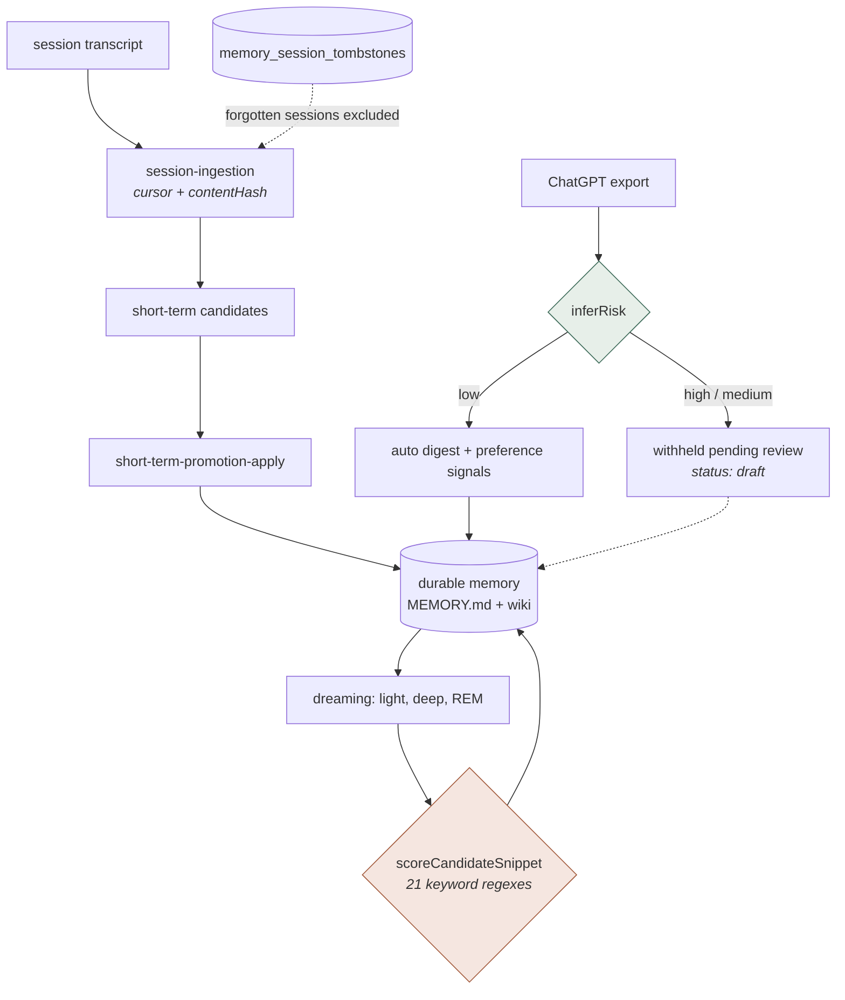
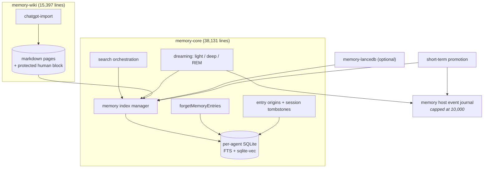

## 1. Executive Summary

OpenClaw is an MIT-licensed agent runtime that uses messaging platforms as its
primary interface. Its memory is not a table of facts. It is **markdown files
indexed into a per-agent SQLite database**, searched over a hybrid of vector and
full-text arms, and rewritten in the background by a three-phase consolidation
pass the project calls *dreaming*.

The project's own [2.0 announcement](https://openclaw.ai/blog/openclaw-2-accidentally)
(30 August 2026) credits 933 contributors and more than 16,000 pull requests, and
describes installation, a browser client and shared cloud sessions. It does not
describe the memory subsystem, so nothing below rests on it.

The bulk of that subsystem is one extension. `extensions/memory-core` is 38,131 source lines
across 257 TypeScript files, beside roughly 49,000 lines of tests;
`memory-wiki` adds 15,397, `active-memory` 5,545, and the LanceDB backend —
which is an *optional* store, not the system — 3,507.

The single most consequential thing in that code is 1,097 lines long and decides
what you are allowed to remember.

**The durability policy is a keyword scorecard.** `rem-evidence.ts` holds
twenty-one English word-alternation regexes and an additive scorer with
hand-tuned weights. A snippet gains 3.2 for matching `REM_PERSISTENCE_SIGNAL_RE`
(`always|preference|prefers?|standing rule|…|partner|wife|husband|boyfriend|girlfriend`),
2.3 for a person-pattern match, 1.6 for `learned:|rule:|always [a-z]`; it loses
4.2 for a monitoring signal, 2.8 for a situational one, 2.6 for reading like a
travel decision. No model judges what is worth keeping. A regex scorecard does.

And the vocabulary is not general. Among the terms that push a snippet toward or
away from durable memory are `butler`, `obsidian`, `codex`, `razor`, `bird`,
`xurl`, `tmux`, `north star`, `email triage cron`, `priority contacts`,
`family quick reference` and `top priority candidates`. This is one person's
working life compiled into a classifier — and it is English-only, so a Spanish
or Japanese deployment scores every snippet at zero against the signals that
matter and keeps whatever survives the penalties.

Two capability marks. **Scope** is composed into the predicate rather than
applied beside it — `scopedPredicate` returns `(scope) AND (filter)` as a single
string under the comment *"Scope and operator filter stay one predicate so scope
cannot be lost"* — and in the core it is stronger still, because each agent gets
its own SQLite file rather than a shared table with a column.

**Human review** is earned in the wiki importer, and it is the best-shaped
version of that mark in this corpus for a reason worth copying: it protects the
human's writing, not just the human's approval. `inferRisk` routes any imported
conversation touching relationships, health, legal or tax matters, finance or
drugs away from durable-candidate generation — *"Auto digest withheld from
durable-candidate generation until reviewed"* — and `preserveHumanNotesBlock`
carries the region between `<!-- openclaw:human:start -->` and its closing
marker across every machine regeneration. If those markers are damaged, the code
**throws rather than regenerate over them**: *"restore the missing marker before
updating or removing this page"*. A memory system that would rather fail than
overwrite a person's notes is rare here.

What it does not have is a way to reject a claim. `memory_session_tombstones`
is a real durable table with a `reason` column, consulted by the dreaming sweep
so a forgotten session is never re-ingested — but it is keyed on `session_id`.
Forget the conversation and the same sentence arriving in a different session is
learned again, because nothing keys on the value.

## 2. Mental Model

Memory here is a **file of record with an index over it**, not a store of rows:

```typescript
// the record: markdown, on disk, human-editable
MEMORY.md
memory-wiki/pages/*.md        // frontmatter + body + a protected human block

// the index: one SQLite database per agent
openOpenClawAgentDatabase({ agentId })
  memory_index_chunks     { text, source }        // FTS arm
  MEMORY_INDEX_VECTOR_TABLE                        // sqlite-vec arm
  memory_entry_origins    { entry_key, agent_id, session_id,
                            origin_class, observed_at }
  memory_session_tombstones { session_id, agent_id, reason, created_at }
```

Material moves up a ladder rather than being written once:



The two shaded nodes are the system's two judgements. One is a person. The other
is a scorecard.

## 3. Architecture

The memory surface is four extensions, and the reference backend is the smallest
of them:

- `extensions/memory-core/` — **38,131 source lines**, the system proper.
  Consolidation: `dreaming-phases.ts` (1,599), `dreaming.ts` (1,186),
  `dreaming-narrative.ts` (1,117), `rem-evidence.ts` (1,097),
  `dreaming-consolidation.ts` (645). Retrieval: `memory/manager-embedding-ops.ts`
  (1,403), `manager-search.ts` (1,028), `manager-search-orchestration.ts` (576),
  `manager-keyword-retrieval.ts` (451), `manager.ts` (718). Promotion:
  `short-term-promotion-apply.ts` (703), `-utils.ts` (584), `-record.ts` (458),
  `-stats.ts` (347), `-rehydrate.ts` (340). Deletion: `memory-forget.ts` (707),
  `memory-entry-origins.ts` (376). Ingestion: `session-backfill.ts` (584),
  `session-ingestion.ts` (521), `session-search-visibility.ts` (413). Plus
  `standing-intents.ts` (602) and `concept-vocabulary.ts` (481).
- `extensions/memory-wiki/` — 15,397 lines. Markdown pages with frontmatter,
  the ChatGPT importer and its risk gate, and the human-block machinery.
- `extensions/active-memory/` — 5,545 lines.
- `extensions/memory-lancedb/` — 3,507 lines. An **optional** vector backend,
  with the envelope sanitiser described in section 4.



## 4. Essential Implementation Paths

### The durability scorecard (`rem-evidence.ts`)

`scoreCandidateSnippet(text, title)` is an additive scorer. The positive terms:

```typescript
if (REM_PERSISTENCE_SIGNAL_RE.test(text))          score += 3.2;
if (REM_MEMORY_SIGNAL_RE.test(text))               score += 2.4;
if (REM_PERSON_PATTERN_SIGNAL_RE.test(text))       score += 2.3;
if (REM_EXPLICIT_PREFERENCE_SIGNAL_RE.test(text))  score += 1.8;
if (REM_OPERATOR_RULE_SIGNAL_RE.test(text))        score += 1.6;
if (REM_STABLE_PERSON_SIGNAL_RE.test(text))        score += 1.5;
```

and the penalties, which are larger:

```typescript
if (REM_MONITORING_SIGNAL_RE.test(...))            score -= 4.2;
if (REM_SITUATIONAL_SIGNAL_RE.test(text))          score -= 2.8;
if (REM_TRAVEL_DECISION_SIGNAL_RE.test(text))      score -= 2.6;
if (REM_METADATA_HEAVY_SIGNAL_RE.test(text))       score -= 2.4;
if (REM_PROCESS_FRAME_SIGNAL_RE.test(text))        score -= 2.4;
```

`isDurableSignalSnippet` is the cheaper gate, an OR across five of the same
patterns. Every weight is a bare literal; none is configurable, and no committed
artifact records how any of them were chosen.

The patterns themselves are the finding. `REM_PERSISTENCE_SIGNAL_RE` matches
`partner|wife|husband|boyfriend|girlfriend`, so a sentence naming a relationship
is scored durable by keyword. `REM_TOOLING_META_SIGNAL_RE` matches
`cli|tool|tools\.md|agents\.md|sessionssend|subagents?|spawn|tmux|xurl|bird|codex exec`.
`REM_EXTERNALIZATION_SIGNAL_RE` matches `obsidian`. `REM_BLOCKED_SECTION_RE`
matches `email triage cron`, `priority contacts` and `top priority candidates`.

These are not categories of human memory. They are the proper nouns of one
operator's setup, and they are load-bearing: the difference between a fact
persisting and evaporating is whether it happens to contain one of them.

### Hybrid retrieval with two-way degradation (`manager-search-orchestration.ts`)

The search path runs vector and FTS arms together and survives losing either:

```typescript
// FTS-only mode: no embedding provider available
if (embeddingBootstrapKeywordOnly || !this.provider) {
  this.assertRequiredProviderAvailable("search");
  if (!this.fts.enabled || !this.fts.available) {
    log.warn("memory search: no provider and FTS unavailable");
    return [];
  }
  const keywordResults = await this.searchKeywordWithFallback(/* … */);
  return await this.finalizeKeywordOnlyResults({ /* … */ });
}

// If FTS isn't available, hybrid mode cannot use keyword search; degrade to vector-only.
const loadKeywordResults = async () =>
  hybrid.enabled && this.fts.enabled && this.fts.available
    ? await this.searchKeywordWithFallback(/* … */)
    : [];
```

`manager-search.ts` supplies three arms — `searchVector`, `searchKeyword` and
`searchPathKeyword` — with a candidate multiplier capped at 200 and a temporal
decay applied at merge. Both degradation branches log rather than fail silently.

### Scope that cannot be dropped (`lancedb-store.ts`, `memory-entry-origins.ts`)

```typescript
function scopedPredicate(agentId: string, filter?: MemoryQueryFilter): string {
  const scope = memoryAgentPredicate(agentId);
  return filter ? `(${scope}) AND (${formatQueryFilter(filter)})` : scope;
}
```

Every read and delete builds its WHERE clause through this helper, so an
unscoped query is not expressible. In `memory-core` the boundary is physical
rather than syntactic: `openOpenClawAgentDatabase({ agentId })` opens a distinct
SQLite file per agent, so cross-agent leakage would require opening the wrong
database rather than forgetting a predicate.

### The session tombstone (`memory-entry-origins.ts`, `dreaming-phases.ts:633`)

```typescript
type MemorySessionTombstone = {
  sessionId: string; agentId: string; reason: string; createdAt: number;
};
```

It is durable — `CREATE TABLE IF NOT EXISTS memory_session_tombstones` — it
carries a written `reason`, and the consolidation sweep consults it before
ingesting anything:

```typescript
const forgottenSessionIds = new Set(
  listMemorySessionTombstones({ agentId }).map((tombstone) => tombstone.sessionId),
);
```

This closes the loop in which deletion and automatic re-ingestion undo each
other. It closes it **by source**. The row records that a conversation was forgotten, not that a claim was
rejected, so the same assertion reaching the agent through a different session is
new information again. The `contentHash` fields elsewhere in the tree are
change-detection for incremental indexing, not suppression keys; no value-keyed
denylist exists anywhere in `memory-core` or `memory-wiki`.

### Deletion with a preview and a refusal (`memory-forget.ts`)

`forgetMemoryEntries` takes a `dryRun` flag and returns the same report shape in
both modes, so the preview is the plan. It holds a workspace lock, and it
distinguishes what it can delete from what it will not touch:
`mixedLineageEntryKeys` and `untargetableEntryKeys` come back with a
`refusals: string[]` rather than a partial delete.

### Envelope sanitization (`memory-lancedb/memory-capture-sanitization.ts`)

567 lines devoted to stopping the runtime's own message envelope from becoming
memory. Because OpenClaw is messaging-first, every inbound message arrives
wrapped in scaffolding: media-attachment notes, `⟦openclaw:ctx⟧` markers,
`[Chat messages since your last reply - for context]` headers, `[Replying to: …]`
lines, `#123 sender:` prefixes and bracketed timestamps.
`sanitizeForMemoryCapture` strips all of it and `looksLikeEnvelopeSludge`
rejects what is still mostly wrapper. The bounded quantifiers throughout
(`{1,500}`, `{0,1000}`, `{1,120}`) matter on their own: these run on
adversary-influenced input.

This is the same failure class the [Holographic](../holographic/) plugin hit from
the other direction, where the compactor's own handoff summaries matched its
extraction patterns and were stored as facts on every rollover. Two systems in
this ecosystem shipped guards against **the harness's own scaffolding laundering
itself into memory**.

## 5. Memory Data Model

The record is markdown; the index is derived and disposable. That is the right
shape for a memory a person is expected to edit, and it is why the wiki's
human-block protection is load-bearing rather than cosmetic.

What the model does not carry:

- **No verification state.** A durable entry has no candidate/verified/rejected
  field. The imported-conversation `riskLevel` is the closest thing, and it
  applies to a wiki page at import, not to a claim over its life.
- **No validity time.** `createdAt`, `observed_at` and `updatedAt` are record
  time. There is nowhere to say a fact was true until March.
- **No value-keyed rejection.** Covered above.
- **`agentId` is the only scope.** For a messaging-first runtime where one agent
  serves a group chat, there is no per-room or per-participant boundary —
  every participant's disclosures land in the same agent's memory.

## 6. Retrieval Mechanics

Genuine hybrid: a vector arm over `sqlite-vec` and an FTS keyword arm, merged
with a candidate multiplier (`min(200, maxResults × hybrid.candidateMultiplier)`)
and temporal decay, with `searchPathKeyword` as a third arm for path-specific
queries and `scoreFallbackKeywordResult` behind them. `searchSources` lets
trusted recall reach transcripts that ordinary searches do not see — a
deliberate two-corpus split documented in the code as *"The manager may index
recall-only transcripts without making them part of ordinary searches."*

The atlas's standing objection to vector-only retrieval does not apply here.

## 7. Write Mechanics

Three writers reach durable memory, and they are not equally governed.

**Session ingestion → promotion** is the main path: a cursor with a
`contentHash` walks new transcript material, `short-term-promotion-apply`
promotes candidates, and `recordMemoryEntryOrigins` stamps where each entry came
from. Governed by the scorecard.

**Dreaming** rewrites what is already there, in three phases (`light`, `deep`,
`rem`) on a cron. Governed by the scorecard.

**Wiki import** is the governed one: risk-classified, withheld pending review,
and written `status: "draft"` with a protected human region.

The asymmetry is the story. The path a person deliberately imports is gated by a
person. The path that runs every night while nobody is watching is gated by
twenty-one regexes.

## 8. Agent Integration

Memory reaches the agent as plugin tools (`memory-core/src/tools.ts`, 605
lines), a CLI (`cli.ts`, `cli-rem.runtime.ts`, `cli-index-search.runtime.ts`,
`cli-status.runtime.ts`), doctor health contracts, and the auto-recall hooks.
`standing-intents.ts` (602 lines) carries persistent operator intent separately
from recalled facts.

### What a downstream integrator has to do

NetEase Youdao's [LobsterAI](https://github.com/netease-youdao/LobsterAI) — an
MIT-licensed desktop app wrapping OpenClaw, reviewed at
[`2921c1e5bddbd96a503da4acd7538cac45bcd0f2`](https://github.com/netease-youdao/LobsterAI/commit/2921c1e5bddbd96a503da4acd7538cac45bcd0f2)
— has no memory system of its own; it operates OpenClaw's. To do that it ships
`src/main/libs/openclawMemoryFile.ts` (689 lines), which **reimplements the
memory file format** — `parseMemoryMd`, `serializeMemoryMd`, `addMemoryEntry`,
`updateMemoryEntry`, `deleteMemoryEntry` — because building a GUI over the host's
memory required a parser the host does not expose; plus 409 lines of index
migration and a patch against `manager-atomic-reindex.ts` adding a Windows
`EBUSY` retry around `fs.rename()`, noting that "SQLite WAL-mode holds file
locks that cause `fs.rename()` to fail with EBUSY on Windows".

Without a memory API, an integrator must reverse the file format to read it and
patch the host's source to fix it — the practical cost of a contract that covers
capture and injection but not inspection or repair.

## 9. Reliability, Safety, and Trust

Strengths:

- Scope composed into the predicate, and a separate database file per agent.
- A review gate that withholds risky imports from durable candidacy.
- A regeneration path that throws rather than overwrite human notes.
- A deletion path with a dry-run preview, a workspace lock and explicit refusals.
- A durable session tombstone that stops the forget/re-ingest loop by source.
- Hybrid retrieval that degrades in both directions and logs when it does.
- Envelope sanitization with an explicit rejection gate and bounded quantifiers.
- Roughly 49,000 lines of tests against `memory-core` alone. MIT licence.

Gaps:

- **The durability policy is twenty-one English regexes and sixteen magic
  weights**, visibly fitted to one operator's vocabulary, with no committed
  evaluation of what it keeps or drops.
- **English-only consolidation.** A non-English deployment matches almost no
  positive signal.
- **No verification state and no validity time** on a durable entry.
- **The tombstone is source-keyed**, so a rejected claim returns through a new
  session.
- **`agentId` is the only boundary**, in a runtime built for group chats.
- **No test exercises the scope predicate with a second agent** — see below.

### 9a. Two mechanisms that do not earn their marks

**The host event journal is not an audit log.** `appendMemoryHostEvent` writes
four event types — `memory.recall.recorded`, a recall-skipped variant,
`promotion.applied` and a dream-completed event — through a sequenced journal
with a monotonic `sequence`. Only `promotion.applied` is a memory *mutation*;
the recall pair is read-path telemetry and the dream event is a run record. And
the journal is bounded: `journalOptions: { maxEntries: MAX_MEMORY_HOST_EVENTS }`
where `MAX_MEMORY_HOST_EVENTS = 10_000`. A capped ring that evicts its oldest
entries is not a durable record of what changed, so the mark is withheld.

**The forget suite is close to a negative eval and not quite one.** It pairs its
directions over a single fixture — `toEqual(["MEMORY.md", "sessions/main/survivor…"])`
for what must survive, `toEqual([])` for what must go, `toEqual(["clean-entry"])`
for an unrelated entry — and one case is named *"re-keys superseded session
lineage while preserving unrelated live memory"*, which is exactly the right
shape. But the assertions read store selectors, not a recall query, and nothing
asserts that a forgotten claim fails to come back through a different session —
which is the case the source-keyed tombstone actually needs.

## 10. Tests, Evals, and Benchmarks

Roughly 49,000 lines of tests sit against `memory-core`'s 38,131 source lines,
with `memory-lancedb/index.test.ts` at 4,497 lines and the memory-core doctor
contract at 2,530. The suites were not run for this review.

Against that, one absence is worth naming precisely: **`scopedPredicate` has no
test that names it.** Searching every `*.test.ts` in `extensions/` for the
identifier returns nothing, and `memory-lancedb/index.test.ts` contains no case
that stores under one agent and asserts a second agent cannot read it. The
mechanism carrying the system's only structural safety guarantee is verified by
inspection alone. The mark stands because the guarantee is structural — an
unscoped predicate is not expressible, and the core goes further with a database
per agent — but a system this well tested leaving that particular case uncovered
is the gap a reader should close first.

No committed retrieval-quality benchmark exists, and none evaluates the
durability scorer. Third-party comparative results exist — [OpenViking](../openviking/)'s
LoCoMo harness reports OpenClaw's native memory at 24.20% against 82.08% with
OpenViking mounted — but those are vendor-run, their raw artifacts are not
committed, and the native-memory baseline configuration is not independently
verifiable. They are not a measured property of this code.

## 11. For Your Own Build

### Steal

- **Protect the human's half of the page.** The marker pair plus
  `preserveHumanNotesBlock`, and especially the decision to throw rather than
  regenerate over damaged markers, is the strongest small idea here.
- **Gate imports by risk and say so on the page.** Withholding a digest
  *"until reviewed"* while still storing the source beats silently ingesting it.
- **Compose scope into the predicate**, and give each scope its own database
  file where you can.
- **Tombstone the source so consolidation cannot re-ingest it** — necessary, and
  cheap. Then key on the value too.
- **Preview deletion with the same report shape as the real thing**, and return
  refusals rather than partial deletes.
- **Degrade hybrid retrieval in both directions, and log it.**
- **Sanitize your harness envelope before capture**, with an acceptance gate for
  text that is still mostly wrapper.

### Avoid

- **A keyword scorecard as the durability policy.** If you must ship heuristics,
  make the vocabulary configuration rather than source, and commit an evaluation
  of what they keep and drop.
- **Proper nouns from your own setup in a shared classifier.**
- **English-only signals** in a runtime that speaks to the world over chat apps.
- **A capped journal presented as history.**
- **Source-keyed forgetting alone**, when the thing the user wants forgotten is a
  claim.
- **Single-axis scope** in a multi-participant messaging context.

### Fit

Borrow the wiki's human-block machinery and its import gate; borrow
`scopedPredicate` and the per-agent database; borrow the dry-run-plus-refusals
deletion report. Do not borrow `rem-evidence.ts` — read it as a worked example of
what happens when consolidation policy accretes as regexes instead of being
designed, and write the evaluation it never got.

## 12. Open Questions

- How were the sixteen weights in `scoreCandidateSnippet` chosen, and what does
  changing one do to what survives a night of dreaming?
- What is the intended behaviour of the durability scorer outside English?
- Should the session tombstone be joined by a value-keyed one, so a rejected
  claim cannot return through a new conversation?
- Should `agentId` be joined by room and participant scope?
- What keeps the sanitization patterns synchronized with the envelope formats
  they mirror?
- Is recalled memory fenced anywhere before it enters the prompt?

## Appendix: File Index

- Consolidation: `extensions/memory-core/src/dreaming.ts`, `dreaming-phases.ts`, `dreaming-narrative.ts`, `dreaming-consolidation.ts`.
- Durability policy: `extensions/memory-core/src/rem-evidence.ts`.
- Retrieval: `extensions/memory-core/src/memory/manager-search.ts`, `manager-search-orchestration.ts`, `manager-keyword-retrieval.ts`, `manager-embedding-ops.ts`.
- Promotion: `extensions/memory-core/src/short-term-promotion-apply.ts`, `-record.ts`, `-utils.ts`.
- Deletion and provenance: `extensions/memory-core/src/memory-forget.ts`, `memory-entry-origins.ts`.
- Ingestion: `extensions/memory-core/src/session-ingestion.ts`, `session-backfill.ts`.
- Review gate and human blocks: `extensions/memory-wiki/src/chatgpt-import.ts`, `markdown.ts`.
- Host event journal: `src/memory-host-sdk/event-store.ts`, `event-types.ts`.
- Optional vector backend and envelope sanitization: `extensions/memory-lancedb/lancedb-store.ts`, `memory-capture-sanitization.ts`.

## History

**2026-08-31** — [`6e79f2e47eb0dec1b3bade1c1376643bd2ca69d8`](https://github.com/openclaw/openclaw/commit/6e79f2e47eb0dec1b3bade1c1376643bd2ca69d8) — second reading, and a substantial correction. Three published claims were wrong at the commit they described rather than overtaken by it. The report treated `memory-core` as a plugin contract of a few hundred lines and `memory-lancedb` as the memory system; at the previous pin `memory-core` was already 35,318 source lines holding the dreaming consolidation pass, the hybrid search manager, short-term promotion and session ingestion. It recorded `stack_retrieval: "vector"` and stated there was "no lexical arm"; `searchKeyword` and `searchPathKeyword` were present and wired through `manager-search-orchestration.ts` at that pin. And it withheld `human_review`; the `risk.level === "low"` gate, the withheld-digest text and the `status: "draft"` page were all present at that pin too. Storage is restated as markdown files indexed into per-agent SQLite, with LanceDB as one optional backend. Genuinely new upstream since `570eab59e7c7ce052f4550af7507e7dd77c73e11`: `memory_session_tombstones` and `memory-entry-origins.ts`, `forgetMemoryEntries` in `memory-forget.ts`, and the withheld-digest UI strings. `scope_enforced` holds. `tombstone` remains withheld — the new table is keyed on `session_id`, not on the value. `audit_log` and `negative_eval` were examined and withheld for the reasons in section 9a. Marks move from one to two.

**2026-07-27** — [`570eab59e7c7ce052f4550af7507e7dd77c73e11`](https://github.com/openclaw/openclaw/commit/570eab59e7c7ce052f4550af7507e7dd77c73e11) — first reading.
