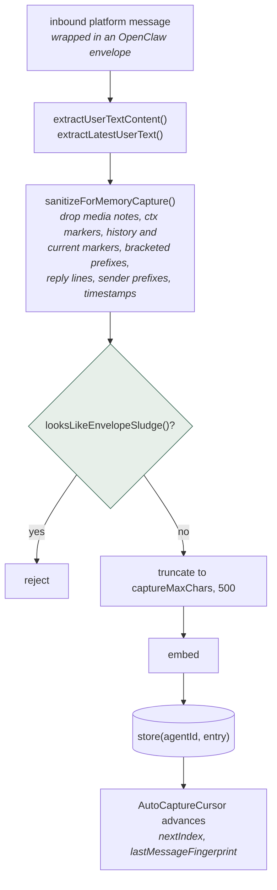
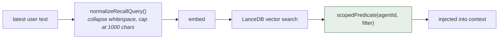
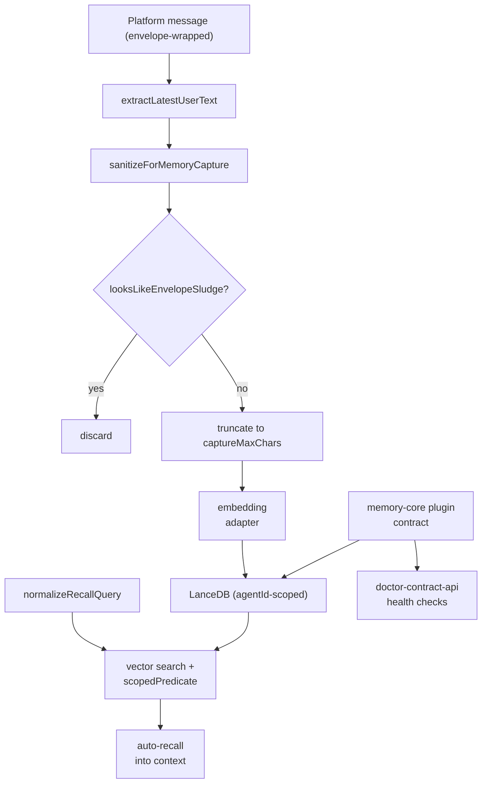

## 1. Executive Summary

OpenClaw is an MIT-licensed autonomous agent runtime that uses messaging platforms as its primary interface. Memory is not built into the core: it ships as **extensions** — `memory-core` provides the plugin contract, tools, and CLI, and `memory-lancedb` provides the reference implementation over LanceDB, with pluggable embedding adapters for OpenAI, Voyage, Mistral, and LM Studio.

Together with [Hermes Agent](../hermes-agent/), this makes OpenClaw the second host runtime in the atlas whose memory story is "pick a provider" rather than "here is the memory model" — the subject of the [pluggable memory provider](../../patterns/pluggable-memory-provider/) pattern.

The memory model itself is modest and honest: a flat entry with a five-value category (`preference`, `fact`, `decision`, `entity`, `other`), vector search over LanceDB, optional auto-capture and auto-recall, and character caps of 500 on capture and 1,000 on recall.

What makes it worth reading is not the retrieval — it is **567 lines devoted to stopping the runtime's own message envelope from becoming memory.**

Because OpenClaw is messaging-first, every inbound message arrives wrapped in scaffolding: media-attachment notes, `⟦openclaw:ctx⟧` context markers, `[Chat messages since your last reply - for context]` headers, `[Replying to: …]` lines, `#123 sender:` prefixes, and bracketed timestamp prefixes. Captured naively, that wrapper text becomes durable "memory" that is mostly punctuation and protocol. `memory-capture-sanitization.ts` strips all of it, and `looksLikeEnvelopeSludge()` rejects text that is mostly envelope after stripping.

This is the same failure class the [Holographic](../holographic/) plugin hit from a different direction, where the context compactor's own handoff summaries matched its extraction patterns and were stored as facts on every rollover. Two independent systems in this ecosystem shipped guards against **the harness's own scaffolding laundering itself into memory** — a failure mode general enough that any system with automatic capture should test for it explicitly.

The second thing worth copying is small and easy to miss: the LanceDB store composes agent scope and user filters into a single predicate, with the comment "Scope and operator filter stay one predicate so scope cannot be lost." That is [scope as a first-class key](../../patterns/scope-as-a-first-class-key/) defended at the query-construction layer, not merely documented.

Test coverage is the strongest signal of maturity here: `extensions/memory-lancedb/index.test.ts` alone is 4,497 lines against a 669-line implementation.

## 2. Mental Model

```typescript
MemoryEntry = {
  id: string
  agentId: string          // scope, enforced in every predicate
  content: string
  category: 'preference' | 'fact' | 'decision' | 'entity' | 'other'
  createdAt: ...
  // + embedding vector, stored in LanceDB
}

MemoryConfig = {
  dbPath?: string          // default ~/.openclaw/memory/lancedb
  autoCapture?: boolean
  autoRecall?: boolean
  captureMaxChars?: number // default 500
  recallMaxChars?: number  // default 1000
  customTriggers?: string[]
  storageOptions?: Record<string, string>
}
```

Capture lifecycle:



Most of this path is subtraction. The envelope wraps real user text in platform
scaffolding, and the sanitizer strips seven kinds of it before a sludge check
rejects whatever is still mostly wrapper — capture quality here is a filtering
problem, not an extraction one.

Recall lifecycle:



`scopedPredicate` builds scope and caller filter as a **single** predicate, so
there is no code path that applies one without the other — the scope cannot be
dropped by a caller who forgets it.

## 3. Architecture

Memory-relevant code lives entirely in extensions:

- `extensions/memory-core/` — the plugin contract and host wiring: `index.ts` (248 lines), `api.ts`, `runtime-api.ts`, `manager-runtime.ts`, `cli.ts`, `doctor-contract-api.ts` (288), plus `src/memory/embedding-local-service.ts` and `src/memory/runtime-host.ts`.
- `extensions/memory-lancedb/` — the reference store: `index.ts` (669), `memory-capture-sanitization.ts` (567), `embeddings.ts` (455), `config.ts` (296), `memory-policy.ts` (268), `lancedb-store.ts` (252), `lancedb-schema.ts`, `memory-cli.ts` (228).
- `extensions/{openai,voyage,mistral,lmstudio}/memory-embedding-adapter.ts` — embedding providers.



## 4. Essential Implementation Paths

### Envelope sanitization (`memory-capture-sanitization.ts`)

The module is a catalogue of everything OpenClaw itself adds to a message before the model sees it:

- `MEDIA_NOTE_HEADER` — `[media attached 1/3: …]` lines, removed by `dropMediaNoteLines`.
- `MARKER_HEADER_LINE_RE` and `CONTEXT_HEADER_RE` — the `⟦openclaw:ctx⟧` sentinel.
- `HISTORY_CONTEXT_MARKERS` / `CURRENT_MESSAGE_MARKERS` — `[Chat messages since your last reply - for context]` and `[Current message - respond to this]`.
- `LEADING_CURRENT_MESSAGE_REPLY_LINE_RE` — `[Replying to: …]`.
- `LEADING_CURRENT_MESSAGE_ID_SENDER_RE` — `#42 alice:` style prefixes.
- `LEADING_TIMESTAMP_PREFIX_RE` — `[Mon 2026-07-27 09:15 …]`.
- `BRACKETED_PREFIX_RE` — a general bracketed-prefix sweep.

`sanitizeForMemoryCapture(text)` applies the pipeline; `looksLikeEnvelopeSludge(text)` is the acceptance gate that rejects what is left when it is still mostly wrapper.

The bounded quantifiers throughout (`{1,500}`, `{0,1000}`, `{1,120}`) are worth noting on their own: these regexes run on adversary-influenced input, and unbounded alternatives would be a ReDoS surface.

### Scope that cannot be dropped (`lancedb-store.ts`)

```typescript
function scopedPredicate(agentId: string, filter?: MemoryQueryFilter): string {
  const scope = memoryAgentPredicate(agentId);
  return filter ? `(${scope}) AND (${formatQueryFilter(filter)})` : scope;
}
```

Every `query`, `list`, and `delete` path builds its WHERE clause through this helper, and the inline comment states the intent: scope and user filter are composed into one predicate so a caller cannot accidentally issue an unscoped query. `store` writes `agentId` onto the row. `delete(agentId, id)` scopes the deletion predicate too, so one agent cannot delete another's memory by ID.

Most systems in the atlas treat scope as a filter applied somewhere in the read path. Making it structurally inseparable from the predicate is a stronger guarantee, and it is the sort of thing that only gets built after someone ships a scope-leak bug.

### Auto-capture cursor (`memory-policy.ts`)

```typescript
type AutoCaptureCursor = {
  nextIndex: number;
  lastMessageFingerprint?: string;
};
```

Position plus fingerprint means capture can resume where it left off and detect that the history it is resuming into has changed underneath it — a small but real defence against double-capturing or skipping messages when a conversation is edited or replayed.

### Health contracts (`doctor-contract-api.ts`)

Both extensions expose a "doctor" contract, with 2,530 lines of tests in `memory-core` alone. This is operational tooling for diagnosing a misconfigured memory backend — embedding model mismatches, unreachable stores, schema drift — surfaced through the CLI. The atlas notes elsewhere that a vector index searched with the wrong embedding model degrades silently; a doctor contract is the right shape of answer.

## 5. Memory Data Model

LanceDB provides vector storage with a declared schema (`lancedb-schema.ts`), initialized using a sentinel row (`SCHEMA_SENTINEL_ID`) so the table's shape exists before real data arrives.

The model is deliberately minimal, and the gaps are the familiar ones:

- **Category, not trust.** `preference | fact | decision | entity | other` describes kind, not confidence. There is no candidate/verified/rejected state.
- **No provenance.** An entry does not record the source message, platform, or timestamp of origin beyond `createdAt`.
- **No supersession or tombstones.** `delete` is exact removal; nothing prevents the same content being re-captured on the next matching message.
- **`agentId` is the only scope.** There is no per-user, per-room, or per-project boundary within an agent — significant for a messaging-first runtime where one agent may serve a group chat.
- **500-character capture cap** truncates rather than summarizing, so a long user statement is stored as its first 500 characters.

## 6. Retrieval Mechanics

Vector search over LanceDB with metadata filtering through `MemoryQueryFilter` (column, operator, value) and mandatory agent scoping. `normalizeRecallQuery` collapses whitespace and caps the query at 1,000 characters.

There is no lexical or hybrid arm in the reference backend. For a memory holding preferences, entities, and decisions — content full of names, identifiers, and exact strings — the atlas's standing objection to vector-only retrieval applies directly: exact-match lookups are the case pure embeddings handle worst. The extension architecture means an alternative backend could supply hybrid retrieval, but the shipped one does not.

## 7. Write Mechanics

Auto-capture and auto-recall are independently configurable and both optional, so an operator can run recall-only against a manually curated store. `customTriggers` allows configured phrases to force capture.

The write path's investment is concentrated entirely in *what not to store* — sanitization, sludge rejection, and truncation — rather than in extraction quality. There is no LLM extraction step in the reference backend: captured text is the user's sanitized words, not a derived claim. That makes this a [zero-LLM capture](../../patterns/zero-llm-capture/) design, with the usual trade: cheap, fast, and robust to provider outages, but the store fills with conversational prose rather than normalized facts.

## 8. Agent Integration

Memory reaches the agent as plugin-provided tools (`memory-core/src/tools.ts`), a CLI (`memory-cli.ts`), and the auto-capture/auto-recall hooks. `memory-core` defines the contract via `definePluginEntry`, `MemoryPluginRuntime`, and `MemoryCoreRuntimeHost`, so third-party memory backends — the Redis, Mem0, and Supermemory plugins that exist in the wider ecosystem — implement the same surface as `memory-lancedb`.

As with Hermes, the host contract is where the interesting governance question lives: a plugin owns its own storage, and the host has no general mechanism to propagate a user's deletion request into whatever backend is mounted.

### What a downstream integrator has to do

NetEase Youdao's [LobsterAI](https://github.com/netease-youdao/LobsterAI) — an MIT-licensed desktop app wrapping OpenClaw, reviewed at [`2921c1e5bddbd96a503da4acd7538cac45bcd0f2`](https://github.com/netease-youdao/LobsterAI/commit/2921c1e5bddbd96a503da4acd7538cac45bcd0f2) — is a useful natural experiment in what this contract does not provide. It has no memory system of its own; it operates OpenClaw's. To do that it ships:

- `src/main/libs/openclawMemoryFile.ts` (689 lines), which **reimplements OpenClaw's memory file format** — `parseMemoryMd`, `serializeMemoryMd`, `readMemoryEntries`, `addMemoryEntry`, `updateMemoryEntry`, `deleteMemoryEntry` — because building a GUI over the host's memory required a parser the host does not expose.
- `src/main/libs/openclawMemoryIndexMigration.ts` (409 lines) for index migration.
- `scripts/patches/v2026.4.14/openclaw-memory-atomic-reindex-ebusy-retry.patch`, a patch against `extensions/memory-core/src/memory/manager-atomic-reindex.ts` adding a Windows `EBUSY` retry around `fs.rename()`, with the comment that "SQLite WAL-mode holds file locks that cause `fs.rename()` to fail with EBUSY on Windows" (referencing openclaw#64187).

Both consequences follow from the same gap. Without a memory API, an integrator must reverse the file format to read it and patch the host's source to fix it. That is the practical cost of a plugin contract that covers capture and injection but not inspection or repair — and it is why the [pluggable memory provider](../../patterns/pluggable-memory-provider/) pattern argues for making these seams explicit before third parties arrive.

## 9. Reliability, Safety, and Trust

Strengths:

- Exceptional test coverage — 4,497 lines for the LanceDB extension, 2,530 for the memory-core doctor contract, plus config, embedding-lifecycle, and sanitization suites.
- Envelope sanitization with an explicit rejection gate.
- Bounded regex quantifiers on adversary-influenced input.
- Structurally inseparable scope predicates, including on delete.
- Resumable capture with fingerprint drift detection.
- Doctor contracts for diagnosing backend and embedding misconfiguration.
- Swappable embedding providers, including a fully local option via LM Studio.
- MIT licence.

Gaps:

- **No trust model or verification tier.**
- **No tombstones**, so deleted memories can be re-captured verbatim.
- **`agentId` is the only boundary**, which is coarse for group-chat deployments.
- **Vector-only retrieval** in the reference backend.
- **Truncation at 500 characters** rather than summarization or splitting.
- **Sanitization is a denylist** tied to current envelope formats; a change to the message wrapper elsewhere in the codebase can silently reintroduce sludge unless the patterns are updated in lockstep.
- **No fencing of recalled content** was found in the inspected extension paths; recalled memories are user-authored text injected back into context.

## 10. Tests, Evals, and Benchmarks

Test lines substantially exceed implementation lines in the memory extensions:

- `extensions/memory-lancedb/index.test.ts` — 4,497 lines.
- `extensions/memory-core/doctor-contract-api.test.ts` — 2,530 lines.
- `extensions/memory-core/index.test.ts` — 278; `extensions/memory-lancedb/doctor-contract-api.test.ts` — 252; `config.test.ts` — 216; `embeddings.lifecycle.test.ts` — 179.

The suites were not run for this review. The distribution is telling: the heaviest coverage sits on the store surface and the health contracts, which is where a pluggable-backend system accumulates silent misconfiguration failures.

No committed retrieval-quality benchmark was found in the repository. Third-party comparative results exist — notably [OpenViking](../openviking/)'s LoCoMo harness, which reports OpenClaw's native memory at 24.20% versus 82.08% with OpenViking mounted — but those are vendor-run comparisons whose raw artifacts are not committed, and the native-memory baseline configuration is not independently verifiable. They should not be read as a measured property of this code.

## 11. For Your Own Build

### Steal

- **Sanitize the harness envelope before capture.** If your runtime wraps messages in markers, timestamps, reply headers, or attachment notes, that scaffolding will become memory unless something removes it. Pair the stripping pipeline with an acceptance gate that rejects text which is still mostly wrapper.
- **Compose scope into the predicate**, so an unscoped query is not expressible, and scope deletes as well as reads.
- **Capture cursor with a content fingerprint**, making auto-capture resumable and drift-aware.
- **A doctor contract** for memory backends, diagnosing embedding and schema mismatches before they degrade recall silently.
- **Bounded regex quantifiers** on any pattern that touches untrusted text.
- **Independent auto-capture and auto-recall switches.**

### Avoid

- **Vector-only retrieval** for content dominated by names and identifiers.
- **Category standing in for trust state.**
- **Deletion without tombstones**, with automatic re-capture actively working against it.
- **Denylist sanitization coupled to envelope formats** defined elsewhere in the codebase.
- **Hard truncation** of captured content at 500 characters.
- **Single-axis scope** in a multi-participant messaging context.

### Fit

Borrow:

- `memory-capture-sanitization.ts` as a template, adapted to your own envelope.
- `scopedPredicate` and the discipline it encodes.
- The `AutoCaptureCursor` shape.
- The doctor-contract idea for any pluggable storage backend.

Do not copy:

- The reference retrieval path if exact-match recall matters; add a lexical arm.
- `agentId`-only scoping for group deployments.
- Auto-capture without a durable correction story, since re-capture will undo deletions.

## 12. Open Questions

- What keeps the sanitization patterns synchronized with the envelope formats they mirror? A test asserting round-trip removal against the actual renderer would close the gap.
- Should `agentId` be joined by room and participant scope, given the messaging-first design?
- Is recalled memory fenced anywhere before it enters the prompt?
- Should capture summarize rather than truncate at 500 characters?
- What is the intended deletion contract between the host and a mounted memory plugin?

## Appendix: File Index

- Plugin contract and host wiring: `extensions/memory-core/index.ts`, `api.ts`, `runtime-api.ts`, `manager-runtime.ts`.
- Health contracts: `extensions/memory-core/doctor-contract-api.ts`, `extensions/memory-lancedb/doctor-contract-api.ts`.
- Reference backend: `extensions/memory-lancedb/index.ts`, `lancedb-store.ts`, `lancedb-schema.ts`.
- Envelope sanitization: `extensions/memory-lancedb/memory-capture-sanitization.ts`.
- Capture/recall policy: `extensions/memory-lancedb/memory-policy.ts`.
- Configuration and categories: `extensions/memory-lancedb/config.ts`.
- Embedding adapters: `extensions/{openai,voyage,mistral,lmstudio}/memory-embedding-adapter.ts`.
- Tests: `extensions/memory-lancedb/index.test.ts`, `extensions/memory-core/doctor-contract-api.test.ts`, `config.test.ts`, `embeddings.lifecycle.test.ts`.

## History

**2026-07-27** — [`570eab59e7c7ce052f4550af7507e7dd77c73e11`](https://github.com/openclaw/openclaw/commit/570eab59e7c7ce052f4550af7507e7dd77c73e11) — first reading.
