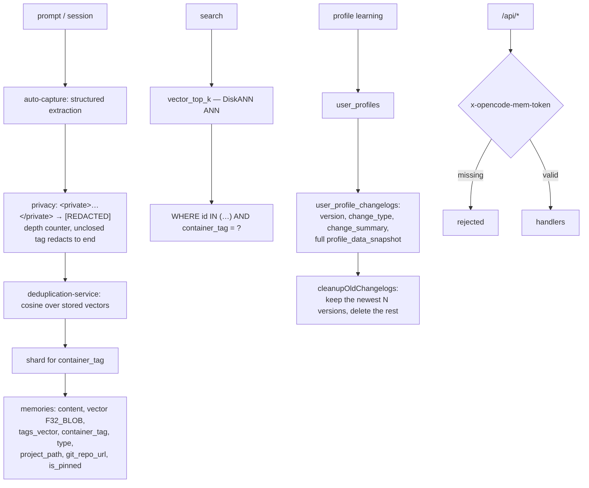

## 1. Executive Summary

OpenCode Memory is a memory plugin for the OpenCode agent — embedded Turso/libSQL
with native vector indexes, project memories, an automatically learned user
profile, a bundled React web UI, and a CI matrix across Linux, Windows and four
macOS/architecture combinations.

**The artifact worth the report is `SECURITY_AUDIT.md`**, a committed read-only
audit of the project's own code with five graded findings, each carrying the
exploit path, the fix, and the regression test that pins it.

**Finding 1, CRITICAL — path traversal**, is written out with a working payload:

> "`extractScopeFromTag()`… split the client-supplied `containerTag` on `_` and
> used everything after the second `_` as a `hash`, with no character
> validation… A request such as
> `POST /api/memories {"content":"x","containerTag":"project_x_../../../../../../Temp/pwn"}`
> creates directories and a SQLite file outside `~/.opencode-mem/data`. The same
> unsanitized parsing was duplicated in `migration-service.ts`'s re-embed path."

The fix validates the hash against `^[a-zA-Z0-9]+$`, applies the same guard to
the duplicate site, and cites
`tests/api-handlers-container-tag-traversal.test.ts`.

**Finding 2, HIGH — CORS used as authentication**, is the more instructive one:

> "`isAllowedBrowserOrigin()` returned `true` whenever no `Origin` header was
> present — which is the case for `curl`, other local processes, and any
> non-browser client. Every `/api/*` handler (read/write/delete memories, full
> user-profile CRUD, migrations) had no session/token check at all. If
> `webServerHost` is set to `0.0.0.0` (a documented config option), this is
> reachable from the whole LAN with no auth."

The fix is a 256-bit token generated on first run, persisted at mode `0600`,
required on every `/api/*` request, and injected into the server-rendered HTML so
the bundled UI keeps working "while a malicious cross-origin web page cannot read
it (opaque/no-cors responses)". And the audit states the limit of its own fix:
"This does not fully replace a 'don't expose to `0.0.0.0` without more'
warning."

**Finding 5 is marked not fixed** — a Gemini API key in a URL query string, "per
Google's own Gemini REST API design (not a defect introduced by this plugin)."
Publishing the one you decided to live with, with the reason, is what makes the
other four credible.

**The second thing worth taking is redaction that fails closed** — section 7.

## 2. Mental Model

Memories are sharded by `container_tag` — a scope derived from the project — and
each shard is a Turso database with vectors stored inline. Retrieval is an
approximate nearest-neighbour scan followed by a scope filter. A user profile is
learned separately and versioned.



## 3. Architecture

`src/services/` is where everything lives: `turso/` (shard manager, connection
manager, vector search, vector utils), `ai/` with per-provider adapters,
`user-profile/`, `user-prompt/`, plus `auto-capture`, `deduplication-service`,
`privacy`, `secret-resolver`, `auth-token`, `cors`, `api-handlers`,
`web-server`, `memory-scope`, `tags`, `language-detector`, and four
migration/cleanup services.

The UI history is documented rather than quietly rewritten: a CDN-loaded vanilla
UI, then an interim Svelte UI, now "a Vite-bundled React 19 app under `web/`",
with the audit noting which findings describe the pre-rewrite UI and what the
current mitigation is.

66 test files, ~29,000 lines of TypeScript, and a `.legacy.bak` written per shard
before the migration from legacy SQLite shards rewrites it.

## 4. Essential Implementation Paths

**Audit** — `SECURITY_AUDIT.md` (five findings), with
`tests/api-handlers-container-tag-traversal.test.ts`,
`tests/web-userprofile-xss.test.ts`, `tests/web-memorytype-xss.test.ts`.

**Authenticate** — `src/services/auth-token.ts`, `src/services/web-server.ts`,
`src/services/cors.ts`, `web/src/lib/api.ts`.

**Redact** — `src/services/privacy.ts` (the depth counter and the fail-closed
rationale `:7-20`).

**Store and scope** — `src/services/turso/shard-manager.ts` (`memories`
`:291-309` and its four indexes), `src/services/turso/vector-search.ts`
(`container_tag = ?` `:169`, `:246`, `:283`), `src/services/memory-scope.ts`.

**Version the profile** — `src/services/user-profile/user-profile-manager.ts`
(`user_profile_changelogs` `:185-195`, the insert `:330`,
`cleanupOldChangelogs` `:340-357`).

## 5. Memory Data Model

`memories(id, content, vector F32_BLOB(dims), tags_vector F32_BLOB(dims),
container_tag, tags, type, created_at, updated_at, metadata, display_name,
user_name, user_email, project_path, project_name, git_repo_url, is_pinned)`
with indexes on `container_tag`, `type`, `created_at DESC` and `is_pinned`.

**Two vectors per memory** — one for content and one for tags — is an unusual
choice and a cheap one: it lets a tag-similarity arm exist without a second
table.

`is_pinned` is the only field that changes a memory's standing, and it changes
retention rather than truth. There is no confidence, no status, no supersession
pointer and no tombstone: correction is deduplication plus a cleanup service.

**`user_profile_changelogs` is the closest thing to an audit trail** — `version`,
`change_type`, `change_summary` and a full `profile_data_snapshot` per change,
which makes any past profile state recoverable. It is not an audit log by this
atlas's definition because `cleanupOldChangelogs()` deletes everything outside
the newest `userProfileChangelogRetentionCount` versions. That is a reasonable
retention policy and it means the record is a bounded undo history rather than a
durable account of what changed.

## 6. Retrieval Mechanics

`vector_top_k` over libSQL's DiskANN index — approximate nearest neighbours,
stated as approximate in the README rather than implied to be exact — then the
candidate ids are filtered by `container_tag = ?` on the rows.

That ordering is worth noticing. The scope filter is applied **after** the ANN
scan, so the effective result count for a scope is whatever survives the filter,
and a shard holding several scopes could return fewer than `k`. In practice
`container_tag` is also the shard key, so the scan is already largely
scope-local; the belt-and-braces filter on the row is what earns
`scope_enforced` — a stored key reaching the query — and it is what makes the
path-traversal fix in finding 1 load-bearing, since `container_tag` is both the
security boundary and the retrieval boundary.

## 7. Write Mechanics

Auto-capture extracts memories from prompts via a provider that can return
structured output, deduplication compares against stored vectors by cosine, and
`privacy.ts` redacts before storage.

**The redaction fails closed, deliberately:**

> "Scans tags with a depth counter rather than matching pairs with a single
> regex, so that the two malformed shapes fail *closed*: An **unclosed**
> `<private>` redacts to the end of the input. A non-greedy pair match found no
> closing tag and left the region untouched, so a typo…"

A user typing `<private>` and forgetting the closing tag gets everything after it
redacted. The alternative — a regex pair match — silently stores the secret. The
tag regex also tolerates internal whitespace (`<private >`) "the way an XML
parser would", which is the other half: a redaction filter must accept every
shape the user might plausibly write, because the shapes it rejects are the ones
that leak.

The legacy-shard migration backs up each shard as `<shard>.db.legacy.bak` before
rewriting it.

## 8. Agent Integration

An OpenCode plugin, published to npm, with a local web UI (memory timeline, user
profile viewer), 12+ local embedding models via `@huggingface/transformers`,
OpenAI and Anthropic providers, and a documented `webServerHost` option that the
audit specifically flags as the thing that turns a local API into a LAN one.

The README is precise about degradation: "Auto-capture and user profile learning
require an AI provider that can return structured/tool-call output. Memory
search/add/list still work without auto-capture provider configuration." Saying
which features fail without which dependency, rather than listing requirements as
a block, is a small kindness.

## 9. Reliability, Safety, and Trust

**One mark: scope enforced**, per section 6.

**Trust state, tombstone, bitemporal, audit log, human review, negative eval —
no**, with `user_profile_changelogs` the near miss explained in section 5.

**The security posture is the strength and the report should be specific about
what it is.** `SECURITY_AUDIT.md` is scoped to commit `0998c69`; the commit read
here is `8cba720`. So the audit is a point-in-time artifact and the code has
moved since — which is the normal condition of any audit, and worth stating
because a reader might take a committed `SECURITY_AUDIT.md` as a standing
guarantee. The three regression tests it names are the durable part: they still
run.

**Two of the five findings were introduced by a pattern rather than a bug**, and
both are worth carrying away. CORS is not authentication, and it fails in exactly
the direction that is invisible in a browser — `curl` sends no `Origin`, so the
check that "works" when you test it in a browser passes everything else. And an
unvalidated client-supplied string that reaches `path.join()` is a filesystem
write primitive; here the same unvalidated parse existed at two call sites, which
is the usual reason a fix is incomplete.

## 10. Tests, Evals, and Benchmarks

**No paper, no retrieval benchmark, no committed results.** 72 test files
against 75 source files, and a CI matrix spanning Linux, Windows, macOS 15 and
macOS 26 on both `darwin/x64` and `darwin/arm64` — and the README is careful
about what that matrix does and does not say: "Older macOS releases are not
excluded by that matrix; they are simply outside the current GitHub-hosted
runner set."

Three tests pin a specific exploit each, named after the vulnerability the audit
found: `api-handlers-container-tag-traversal`, `web-userprofile-xss`,
`web-memorytype-xss`. The traversal one is the model of its kind because it has
a positive: it rejects a hash segment carrying `../`, rejects one carrying a path
separator, **and accepts a legitimate sha256-style tag** — so a validator that
had regressed into rejecting everything would fail it.

**Two suites test the mechanism rather than the output, which is rarer.**
`turso-vector-search.test.ts` asserts on the shape of the emitted SQL: that
`FROM vector_top_k` is present, that the join is
`CROSS JOIN memories m ON m.rowid = v.id`, that `indexOf("vector_top_k") <
indexOf("memories m")` so the ANN index drives the query rather than being
post-filtered — and that the filtered variant carries `m.container_tag = ?`. A
scope predicate silently dropped from the generated SQL fails that assertion,
which is a different guarantee from a search that happens to return the right
rows. `turso-exact-fallback.test.ts` covers the other side: with the vector
index missing, the exact scan still returns the right row.

`user-profile-cold-buffer-isolation.test.ts` is what earns `negative_eval` and is
the one to copy. Before the embedding model warms up, observations are buffered
rather than merged, and the buffer was global. The test seeds a preference for
`profile_A` and one for `profile_B` while cold, then warms and merges each in
turn:

```ts
expect(descsB).toContain("B prefers spaces over tabs");
expect(descsB).not.toContain("A prefers tabs over spaces");
// ...then the same assertion pair with A and B exchanged
```

Both directions, each negative paired with a positive over the same manager, so
an empty merge fails rather than passes. It is also the right *level*: the shard
layer keeps users apart in storage, and this pins the layer above it, where an
in-memory buffer had been holding everyone's observations in one bucket.

Nothing measures retrieval quality, deduplication precision, or extraction
accuracy.

**I ran nothing.**

## 11. For Your Own Build

### Steal

- **Publish a security audit of your own code, graded, with the exploit path.**
  Five findings with severities, the payload that demonstrates the critical one,
  the fix, and the test that pins it. It costs a document and it is the strongest
  trust signal a small project can send.
- **Include the finding you did not fix, with the reason.** The Gemini key in a
  query string is upstream's design; saying so is what makes "fixed" mean
  something on the other four.
- **State the limit of your own fix.** "This does not fully replace a 'don't
  expose to `0.0.0.0` without more' warning."
- **Name a regression test after the vulnerability.**
  `api-handlers-container-tag-traversal.test.ts` tells the next contributor what
  they are about to break.
- **Do not use CORS as authentication.** `isAllowedBrowserOrigin()` returning
  `true` when no `Origin` header is present is the whole bug: every non-browser
  client passes, and you cannot see it from a browser.
- **Generate a token on first run, `0600`, and inject it server-side.** The
  bundled UI keeps working, and a cross-origin page cannot read it because the
  response is opaque.
- **Validate anything client-supplied that reaches `path.join()`** — and grep for
  the second call site, because there usually is one.
- **Make redaction fail closed.** A depth counter rather than a pair-matching
  regex means an unclosed `<private>` redacts to the end of the input instead of
  storing the secret, and tolerating `<private >` accepts what a user will
  actually type.
- **Back up before you rewrite.** `<shard>.db.legacy.bak` per shard before the
  migration touches it.
- **Say which features degrade without which dependency**, rather than listing
  prerequisites as a wall.
- **Say what your CI matrix does not cover.**

### Avoid

- **Do not let a committed audit read as a standing guarantee.** It is pinned to
  a commit; the code moves. A date and a scope line at the top — which this one
  has — is the minimum, and re-running it is the rest.
- **Do not trim a changelog and call it an audit trail.** Keeping the newest N
  versions gives you undo, not accountability.
- **Do not leave correction to deduplication.** Nothing here can mark a memory
  wrong, superseded or stale; a duplicate is merged and a mistake persists.

### Fit

The right choice if you use OpenCode and want project memory with a local vector
store, no external database, and a UI to inspect what was captured. The security
work is well above the median for a plugin of this size.

Not a memory design to learn correction from — there is nothing to correct with.

## 12. Open Questions

- **Has the audit been re-run since `0998c69`?** The document is scoped to that
  commit.
- **What is `userProfileChangelogRetentionCount` by default?** It sets how much
  profile history survives.
- **Does the container-tag filter after ANN ever under-return?**
  `vector_top_k` selects before the scope filter is applied to the rows.
- **Is the auth token rotated?** It is generated on first run and persisted.

## Appendix: File Index

**The audit** — `SECURITY_AUDIT.md` (scope and the GUI-rewrite note `:1-7`,
finding 1 CRITICAL path traversal with its payload `:9-15`, finding 2 HIGH
CORS-as-auth and the token fix `:17-23`, finding 3 stored XSS `:25-29`, finding 4
unpinned CDN scripts `:31-35`, finding 5 not fixed `:37-39`)

**Security fixes** — `src/services/auth-token.ts`, `src/services/cors.ts`,
`src/services/api-handlers.ts` (`extractScopeFromTag`),
`src/services/migration-service.ts`, `web/src/lib/api.ts`,
`web/src/lib/html.ts`

**Redaction** — `src/services/privacy.ts` (`PRIVATE_TAG` `:5`, the fail-closed
rationale `:7-20`)

**Storage** — `src/services/turso/shard-manager.ts` (`shards` `:96`,
`shard_metadata` `:269`, `memories` `:291-309`, the four indexes `:312-324`),
`src/services/turso/vector-search.ts` (`container_tag = ?` `:169`, `:246`,
`:283`), `src/services/turso/connection-manager.ts`

**Profile** — `src/services/user-profile/user-profile-manager.ts`
(`user_profiles` `:168`, `user_profile_changelogs` `:185-195`, the changelog
insert `:330`, `cleanupOldChangelogs` `:340-357`)

**Write path** — `src/services/auto-capture.ts`,
`src/services/deduplication-service.ts`, `src/services/secret-resolver.ts`,
`src/services/shard-path-migration-service.ts`

**Tests** — `tests/api-handlers-container-tag-traversal.test.ts`,
`tests/web-userprofile-xss.test.ts`, `tests/web-memorytype-xss.test.ts`

## History

**2026-08-26** — [`d1d0eb01b5efed517da4ae31baa7666768e86cfe`](https://github.com/tickernelz/opencode-mem/commit/d1d0eb01b5efed517da4ae31baa7666768e86cfe) — re-pinned 37 commits on, at 533 commits since 23 December 2025 and roughly 29,500 lines of TypeScript. Screened again before reading: no auto-run surface, one build-time execution surface, two unpinned surfaces, two files inside the seven-day cooldown, and a `.husky/pre-commit` payload inert until something points `core.hooksPath` at it; `AGENTS.md` is addressed to a reading agent and was treated as data. Nothing was installed and no test was run.

`negative_eval` is added on `user-profile-cold-buffer-isolation.test.ts`, and the bug it covers is the reason it matters: the shard layer separates users by putting their memories in different database files, and the cold-start buffer that holds observations before the embedding model warms up was a single global bucket. Storage was scoped and the layer above it was not. The committed case asserts in both directions, each negative paired with a positive over the same manager.

Two other fixes in range are the same shape. `all-projects` tool queries were walking only project shards, so user-scope memories were silently missing from a search that claimed to span everything — the fix carries the reason in `resolveMemoryScope`. And compacted memory injected into a session is marked synthetic rather than passing as ordinary context.

`scope_enforced` is unchanged and better evidenced: `turso-vector-search.test.ts` asserts the emitted SQL keeps `vector_top_k` ahead of `memories` and that the filtered variant carries `m.container_tag = ?`, so a dropped scope predicate fails a test rather than only changing results. No other mark moved. `tombstone` remains absent — `DELETE FROM memories WHERE id = ?` with nothing keyed on the removed value. `trust_state` is absent: `MemoryType` is `string`, and the closed vocabulary in the schema is `MemoryMetadata.source` over `manual`, `auto-capture`, `import` and `api`, which records where a memory came from rather than whether it is believed. `audit_log` is absent for a reason worth the distinction: `user_profile_changelogs` stores a full `profile_data_snapshot` per version and looks like an audit trail, but `cleanupOldChangelogs` runs on every update and deletes all but the newest N rows, and the table cascades away with its profile. A version history with retention is not an append-only record of mutations, and the memories table has no mutation record at all.

`SECURITY_AUDIT.md` is still pinned to commit `0998c69`, which is older than both this pin and the previous one.

**2026-08-09** — [`8cba720736ff8d3f6315ced14362259efc301899`](https://github.com/tickernelz/opencode-mem/commit/8cba720736ff8d3f6315ced14362259efc301899) — first reading. Screened before reading; the tree was read, never installed, and no test was run. `SECURITY_AUDIT.md` is scoped to an earlier commit than the one pinned here.
