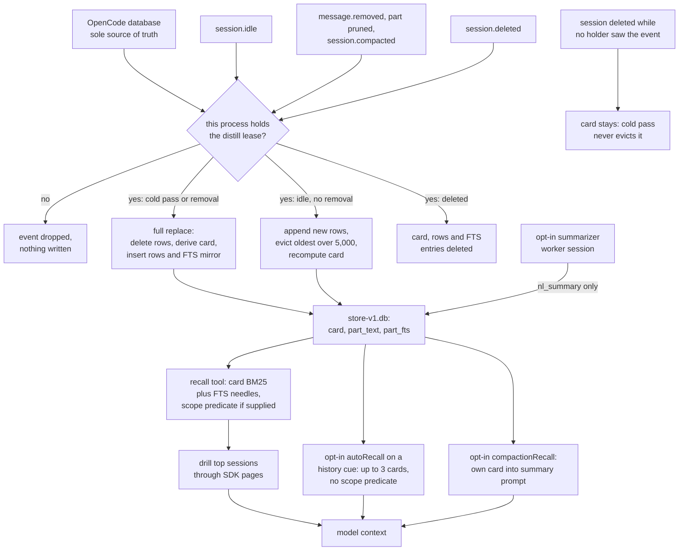

## 1. Executive Summary

OpenCode Session Recall is a plugin for the OpenCode coding agent that lets the
model search every session OpenCode has stored, across projects, after
compaction has hidden it. It does not store anything new. A background distiller
reads each session once through the OpenCode SDK and derives a card and a set of
slim full-text rows into a local SQLite file; queries rank the cards, check the
FTS5 index for a rare identifier, and only then fetch the top dozen sessions in
bounded pages.

What is notable is the discipline of the read path. The expensive tier is gated
at every level: a card lookup before any fetch, a per-query character budget, and
a tool-output sweep that is refused outright without a scope. What is weak is
forgetting. A deletion reaches the store only if the process holding the distill
lease sees the event, and nothing sweeps a card whose session has gone.

**The README says it is not a memory system; its derived store is one
anyway.** *"A memory system is selective and curated; recall just returns raw
history verbatim."* The derived store persists across sessions and processes, is
retrieved later by the agent, and is scoped by project. That is the shape of
[continuity v2](../continuity-v2/), [Deja Vu](../deja-vu/) and [pond](../pond/),
which index the transcripts other coding agents already write. The
[Aider](../../appendix/#known-limitations) exclusion is the contrast: a transcript summarised back
into the next session, with no index over it and no scope.

**Its distinctive idea is honest coverage over exhaustive search.** Version 2.0
replaced a fetch-everything scan, which the README says climbed into gigabytes of
memory on a store of about 4,700 sessions, with a bounded read that reports what
it drilled and what it skipped. `coverage` carries `sessionsSearched`,
`limitedBy` and `skippedByReason`, so a miss says which constraint caused it.

One mark, `negative_eval`: committed cases assert that removed text and a deleted
session drop out of a populated index, and that a project-scoped search leaves
out another project's session, each after a positive control. Section 9 names the
six withheld, including `scope_enforced`, which the `recall` tool earns and the
opt-in auto-recall hook forfeits.

## 2. Mental Model

A memory here is a **card**: one row per OpenCode session, derived entirely from
that session's messages. It holds identity and parentage, the directory and
project id, the first line a user typed (`summary_head`), the last text line
(`outcome_head`), an inventory of up to 200 distinctive identifiers, and capped
lists of files, tools and error signatures (`src/distill.ts:502-545`). Beside it
sit up to 5,000 **slim-index rows** per session: human text, reasoning and tool
inputs, never tool outputs (`src/distill.ts:264-300`).

**Nothing becomes a belief.** The card is an index entry pointing at evidence,
and the evidence is the transcript. The one place card text reaches the model
unasked, the auto-recall block, opens with *"Possibly relevant prior sessions
(auto-recall; verify before relying on it)"* (`src/hooks/auto-recall.ts:124-150`).
There is no candidate state, no status, no confidence and no operation that says
a session was wrong.

**A card changes only when its session changes.** An idle event appends new rows
and recomputes the card; a removal, prune or compaction forces a full replace so
removed text leaves the index (`src/distill.ts:1428-1452`). Two fields survive a
re-distill: the LLM summary and its hash, which only the summarizer writes
(`src/store.ts:694-700`).

**Cards and rows leave in three ways.** `session.deleted` deletes a card and its
rows, if this process holds the lease (`src/distill.ts:1290-1305`). The per-session cap evicts
the oldest rows (`src/store.ts:718-759`). Deleting the file rebuilds everything.
A session that disappears unobserved leaves its card behind.

## 3. Architecture

The plugin runs inside each OpenCode process as a server plugin
(`src/opencode-session-recall.ts:115-548`). It holds two SDK clients, one scoped
to the caller's directory and one unscoped for cross-project listing
(`:210-214`), and opens the store at `~/.cache/opencode-session-recall/store-v1.db`
(`src/store.ts:924-942`).

**Storage is one SQLite file with three tables and a meta row set.** `card` is
keyed on `session_id` with indexes on `time_updated`, `root_id` and
`project_id`; `part_text` holds the slim rows; `part_fts` is an external-content
FTS5 table maintained by hand, tokenising `_-./` as word characters so paths and
identifiers stay whole (`src/store.ts:57-95`). The schema is stamped at version
3; a newer stamp makes `openStore` return `null` and the plugin degrades to
metadata-only cards rather than misread the file (`:570-597`).

**One process writes.** A lease row in `meta` is taken by a single conditional
`UPDATE` whose `WHERE` admits the current holder or an expired heartbeat
(`src/store.ts:863-881`), with a 30-second TTL and a 10-second heartbeat
(`src/distill.ts:45-46`). Every write re-checks ownership against the live row
before touching the store (`:942-961`). Readers in every process read the same
file in WAL mode.

**Retrieval is three tiers.** Cards are ranked in memory with MiniSearch; the
FTS5 table answers needle lookups in SQLite; the drill fetches bounded pages
through the SDK under per-session and per-query character budgets, shared with
the distiller through one fetch gate (`src/fetch-gate.ts`, `src/drill.ts`).

Two layers are opt-in. `semantic: true` downloads a static embedding model
(`minishlab/potion-base-8M` by default) from Hugging Face and blends cosine into
the card score (`src/semantic/embedder.ts:21`, `:398`). `summaries` drives a
throwaway OpenCode session per batch to write two or three sentences per card
(`src/summarize.ts:71-77`).

### Deployment and ergonomics

Nothing has to run beyond OpenCode itself: the store uses the runtime's built-in
SQLite driver and adds no npm dependency for it. Install is one line in
`opencode.json`. It runs fully offline unless `semantic` is on, which fetches
model files once, or `summaries` is on, which spends the operator's model
tokens. No API key is needed to store anything. The store is disposable by
design and rebuilds on deletion; it is readable with any SQLite client but not
meant to be edited, since the next re-distill replaces a session's rows
wholesale. `mode: "ephemeral"` opens no file and searches live.

## 4. Essential Implementation Paths

- **Capture.** `createDistiller` (`src/distill.ts:633`) acquires the lease and
  starts `runColdPass` (`:1056-1170`), which lists sessions — unscoped when
  `global` is true, directory-scoped otherwise
  (`src/opencode-session-recall.ts:245-253`) — and skips any card already `full`
  at the session's `time_updated`. `onEvent` (`src/distill.ts:1428-1452`) maps
  `session.idle` to a debounced re-distill, removal-shaped events to a forced
  full re-distill, and `session.deleted` to `handleDeleted`.
- **Extraction.** `distillFields` (`src/distill.ts:264-300`) turns text and
  subtask parts into `human-text`, reasoning into `reasoning`, and tool parts
  into their `command`, `cwd` and capped JSON input. It skips the plugin's own
  tools and the synthetic `<recall-auto>` part (`:198-205`). `deriveCard`
  (`:502-545`) builds the card from the walked rows.
- **Write.** `replaceSessionParts` deletes and reinserts in one transaction;
  `appendSessionParts` evicts the oldest rows over the cap, repoints the
  checkpoint's `next_message_id` and recomputes the card
  (`src/store.ts:710-759`).
- **Retrieval.** The `recall` tool (`src/search.ts:1765`) parses the query,
  resolves scope (`:2019-2025`), ranks cards (`:2772-2776`), buckets them by
  directory relevance (`:2790-2838`), injects FTS-only sessions (`:2904-2960`),
  merges the shortlist and drills it.
- **Injection.** `autoRecall` (`src/hooks/auto-recall.ts:160-191`) and
  `compactionRecall` (`src/hooks/compaction-recall.ts:58-72`) are card-tier
  reads with no message fetch; `systemNudge` pushes one line into the system
  prompt (`src/hooks/system-nudge.ts:18-38`).
- **Forget.** `handleDeleted` (`src/distill.ts:1290-1305`) is the only caller of
  `Store.deleteSession` (`src/store.ts:702-708`).
- **Tests.** `test/distill.test.ts`, `test/recall.test.ts`, `test/hooks.test.ts`,
  `test/store.test.ts`, `test/authorship-recall.test.ts` and the relevance eval
  under `test/eval/`.

## 5. Memory Data Model

The `card` row (`src/store.ts:60-77`) carries `session_id`, `parent_id`,
`root_id`, `title`, `directory`, `project_id`, `agent`, `model`,
`time_created`, `time_updated`, the derived heads and lists, `distill_state`
(`metadata` or `full`), `distilled_through` (the newest message id covered), an
`embedding` BLOB with its `embedding_gen`, and `nl_summary` with `summary_hash`.
`distill_state` records how much of the session was read, not whether anything
in it is true.

`part_text` (`:82-89`) keys each row on the OpenCode `part_id` and keeps
`message_id`, `prev_message_id` and `next_message_id` so the drill can open the
neighbourhood of a hit without a whole-session load. `class` is one of
`human-text`, `reasoning` or `tool-input`.

**Time is record time only.** `time_created` and `time_updated` are copied from
the OpenCode session; there is no validity interval and nothing about when a
decision stopped holding.

**Scope is a directory and a project id on the card.**
`classifyDirectoryRelevance` labels a card `exact` when its directory matches the
caller's, `project` when it shares the worktree or project, and `global`
otherwise (`src/search.ts:536-545`). `CardFilters` also accepts `scope`,
`projectId` and `directoryFilter` for the card runtime
(`src/cards.ts:85-106`, `:560-580`).

**Authorship is computed, not stored.** Each hit is classified `human`,
`delegated`, `injected`, `model`, `title` or `unknown` from structural signals
at query time (`src/authorship.ts`); unresolvable parentage is `unknown` and is
withheld from an `authorship: "human"` filter.

## 6. Retrieval Mechanics

**Cards first, fetches last.** `cards.rank` scores each card with MiniSearch BM25
over seven card fields, boosting the identifier inventory at 2.0 and the LLM
summary at 1.8 above the title at 1.0, applies a code-token multiplier when an inventory contains
an identifier from the query, and multiplies by a recency prior of at most 1.05
over seven days (`src/cards.ts:39-60`, `:640-660`; `src/bm25.ts:47`, `:73`,
`:119-123`). With `semantic` on, cosine similarity is blended at weight 0.35 by
default (`src/opencode-session-recall.ts:61`) and two drill slots are reserved for the top pure-semantic cards.

**The FTS5 tier catches what a card dropped.** `ftsSearch` builds a `MATCH` from
quoted code tokens and phrases plus weak terms and returns up to 200 rows with
their message neighbours (`src/store.ts:819-845`). The query takes no scope; the
caller filters the returned sessions afterwards (`src/search.ts:2904-2960`), so
a project-scoped query can lose needles to the global `LIMIT` but cannot gain
foreign ones.

**The drill re-ranks within the shortlist.** Twelve sessions by default are
fetched newest-first, 25 messages per page, under retained-character budgets:
1,500,000 characters per session and 20,000,000 per query (`src/types.ts:65-69`). BM25 plus structural boosts and
penalties order the hits, with a relative score floor. A ranked search that
finds nothing retries as a literal scan of the same drilled pool, not a wider
one (`src/search.ts:3648`).

**Deep is gated by construction.** The only path that sweeps tool outputs
across sessions refuses to run without a `sessions` list, a single target, a
cursor, or a lower time bound together with a project or directory constraint
(`src/search.ts:2276-2316`). *"A global unscoped deep sweep is not allowed."*

**Failure modes are reported, not hidden.** A response carries `coverage` with
the drilled count, the constraints that limited it and a per-reason skip count;
near-misses fall back to recency when nothing scores (`src/cards.ts:694-700`).

## 7. Write Mechanics

The agent writes nothing. Every write is the distiller's, and every distiller
write is gated on the lease. The cold pass visits discovered sessions
newest-first with a concurrency of two and skips any card already `full` at the
session's current `time_updated` (`src/distill.ts:1056-1100`). A session whose
data fails to parse is quarantined, up to 1,000 (`src/distill.ts:48`), and retried when its
`time_updated` moves (`:1172-1185`).

**Removal forces a replace.** `message.removed`, `message.part.removed`,
`session.compacted` and a part update that is a compaction or a prune add the
session to `removalSince`, and `runReDistill` then refuses the append path
(`src/distill.ts:1250-1289`, `:617-624`). The flag is snapshotted before any
await, so a removal that lands mid-distill forces the coalesced rerun to replace
too.

**Self-ingestion is closed at three points.** The plugin's own tool parts are
excluded from indexing by a suffix match that survives host namespacing
(`src/extract.ts:27-41`); the `<recall-auto>` block it injects is skipped by
`isRecallAutoText` (`src/distill.ts:198-205`); and the summarizer's worker
sessions, whose prompts embed card digests, carry a `[recall-summarizer]` title
that every read path rejects (`src/extract.ts:43-56`).

**The summarizer is bounded.** It prompts with card fields only, never message
bodies, asks for JSON, disables tools by map and by a deny-all permission
ruleset, batches fifteen cards per prompt and stops after 200 prompts per pass
(`src/summarize.ts:35-36`, `:60-77`). It
writes through `writeSummary`, which also nulls the vector so the next load
re-embeds (`src/store.ts:694-700`).

### Operational cost

Nothing blocks a turn on a model call. The cold pass runs once per lease
acquisition; the README reports about eight minutes and a 526 MB file on a store
of about 4,700 sessions, which this reading did not reproduce. After that,
re-distills are debounced by two seconds after `session.idle`. The README puts the
nudge at about 130 tokens per request. Auto-recall appends at most 900 characters to the
new user message it fires on (`src/hooks/auto-recall.ts:22-23`), so it lands
after any cached prefix; the nudge is a constant string guarded against double
injection. Summaries cost one prompt per batch of about fifteen
cards.

## 8. Agent Integration

Five tools are registered and, by default, added to `primary_tools` so every
agent sees them (`src/opencode-session-recall.ts:448-482`). `recall` searches;
`recall_get` returns one message whole, including pruned tool output;
`recall_context` returns a window around a message; `recall_messages` pages a
session newest-first; `recall_sessions` lists sessions and, with `parentID`,
lists a parent's live children to recover a cancelled subagent.

The model's agency is read-only. It can search, filter by scope, time,
directory, role, part type, tool name and authorship, and expand hits, but no
tool writes, corrects or deletes. The nudge tells it to call `recall` when a user
refers to earlier work. Auto-recall does it for the model on a narrow set of cue
phrases — *"last time"*, *"what did we decide"*, *"same as before"* — deriving a
query from the rest of the message and staying silent when no card scores
(`src/hooks/auto-recall.ts:36-50`, `:88-101`).

**Compaction is the one write into OpenCode's own memory.** With
`compactionRecall` on, the session's card is pushed onto the compaction prompt's
`context` under *"preserve in the summary if still true"*
(`src/hooks/compaction-recall.ts:48-51`), so the model writing the summary
decides what survives.

Adapting it to another agent means replacing the SDK: every read and fetch goes
through OpenCode's client types, and the event names are OpenCode's.

## 9. Reliability, Safety, and Trust

**Provenance is exact and structural.** Every hit names its session, message and
part, an evidence class — human text, tool input, tool output, reasoning, title,
file read, web fetch or skill definition — and, on request, an authorship
bucket. The README reports that about 51% of user-role text on the author's
store was typed by a person, and commits the query behind that figure
(`docs/surveys/user-role-authorship.sql`), which is why `role: "user"` is not
used as a proxy.

**Forgetting depends on which process sees the event.** `handleDeleted` returns
at once unless this process owns the lease (`src/distill.ts:1291`);
`startReDistill` does the same for removal events (`:1237-1238`). The cold pass
only replaces cards for sessions it discovers and has no branch that removes a
card whose session is absent (`:1056-1170`). And `runReDistill` does nothing when
the session lookup returns not-found (`:1257-1266`, `:764-782`). So a session
deleted while no lease holder observed the event keeps its card, its first user
line and its FTS rows of human text, reasoning and commands. Whether a holder
receives events for sessions run in another OpenCode process is a property of
OpenCode that this reading did not check.

**`global: false` is a default, not a boundary.** It is checked by `recall` and
`recall_sessions` (`src/search.ts:2249-2255`; `src/sessions.ts:118-126`), and
`recall` skips the check when a `sessionID` is named. It is not passed to
`recall_get`, `recall_context` or `recall_messages`
(`src/opencode-session-recall.ts:450-454`), and auto-recall never consults it.

**Withheld marks.** `scope_enforced`: the key is on the card, and the `recall`
tool applies it to the card arm, the FTS arm and the deep sweep whenever a scope
or directory is supplied, as `test/recall.test.ts:84-107` shows. But auto-recall
reads the same card store and FTS index with only a family exclusion
(`src/hooks/auto-recall.ts:168-171`; `src/hooks/card-recall.ts:64-89`) — a
prompt-bounded retriever over the whole store with no way to carry the
predicate. With `autoRecall` off, the default, every search path the agent can
call carries it. `trust_state`: no status field; `distill_state` records coverage and
authorship is computed per query. `tombstone` and `audit_log`: none; the lease and
vector-generation rows are coordination, not a mutation record. `bitemporal`:
only the session's own created and updated times.
`human_review`: no surface for a person to approve or reject a card.

**Nothing is redacted.** Tool-input commands are copied verbatim into a second
file under the user's home with default permissions (`src/store.ts:933-942`).
The only redaction in the tree hides recall's own prior output during inline
expansion (`src/search.ts:626-640`).

**The embedding model is unpinned.** Files are fetched from
`huggingface.co/<model>/resolve/main/` with no revision or hash check
(`src/semantic/embedder.ts:398`), and the feature is off by default.

## 10. Tests, Evals, and Benchmarks

The suite is 574 Vitest cases in 27 files and runs in CI through `npm run ci`,
which also typechecks, lints and compiles (`.github/workflows/ci.yml:25`;
`package.json:28-34`). I read it; I did not run it.

**The negative cases that earn the mark.** *"forces a full re-distill on a
removal event, dropping stale FTS text"* asserts `stalemarker` is found, then
absent after a removal while `freshmarker` is present
(`test/distill.test.ts:1547-1586`). *"deletes the card and its rows and
refreshes the root rollup"* asserts the child's card and its unique token are
gone after `session.deleted` (`:1587-1620`). A project-scoped search returns
nothing for a term a global search finds in another directory's session
(`test/recall.test.ts:61-107`). Two more exclusions follow the same shape:
recall's own output is never returned while an unrelated tool output is
(`:1042-1061`), and auto-recall never cites the session it fires in
(`test/hooks.test.ts:242-261`).

**Retrieval quality has a small labelled eval.** `test/eval/cases.ts` holds
relevance cases over a synthetic corpus — rare terms, typos, phrase preference,
old-strong against recent-weak — scored by `test/eval/harness.ts` against
`test/eval/baseline.json`. The semantic suite and the performance gates skip
unless `RECALL_EVAL_SEMANTIC` or `RECALL_PERF=1` is set
(`test/eval/semantic.test.ts:57`, `:259`; `test/perf.test.ts:53`, `:321`).

**Missing.** A deletion or removal delivered to a process without the lease; a
cold pass after a session vanished; auto-recall with `global: false` and a
foreign card in the store; and any test of the performance numbers the README
states from the author's store.

## 11. For Your Own Build

### Steal

- **Answer from a derived index before touching the source.** A card per
  session plus a slim FTS index over the human layer lets a query decide where
  to look in milliseconds, then fetch only the handful of sessions that matter.
- **Refuse the unbounded sweep in the schema, not in the prompt.** The
  output-inclusive sweep takes a scope or it returns an error naming the missing
  argument.
- **Make a removal force a replace.** An append path that cannot see deletions
  will keep removed text forever; a flag set by the removal event and read
  before any await closes that.
- **Close every self-ingestion loop you create.** Each thing the plugin injects
  or spawns carries a sentinel the indexer skips.
- **Report coverage in the response.** `limitedBy` and `skippedByReason` turn a
  miss from a mystery into a constraint the caller can relax.

### Avoid

- **Deriving deletion from events alone.** An index rebuilt from a source must
  also reconcile against the source's current membership, or anything deleted
  while the indexer was not listening survives in the copy.
- **A scope option honoured by some read paths.** An operator switch that the
  search tool respects and an injection hook ignores is a boundary that holds
  until someone enables the hook.

### Fit

For a single developer on OpenCode who wants the model to stop re-deriving
an earlier session's fix, this is a low-cost install with no service and no model spend
by default. It is not a place to keep conclusions: nothing in it can be marked
wrong, and the only ways to remove something are to delete it in OpenCode while
the right process is listening, or to delete the whole store. Someone who needs curated, correctable memory
should run a memory system beside it, which is what the README recommends.

## 12. Open Questions

- Does an OpenCode process receive `session.deleted` and `message.removed`
  events for sessions run in a different OpenCode process sharing the same
  database? If not, deletions made outside the lease holder never reach the
  store.
- Does OpenCode's server answer `session.message` for a session in another
  project through the directory-scoped client, which is what `recall_get` uses?
- Does the compaction summary written after `compactionRecall` re-enter the
  index as model-authored text on the next re-distill, and does that matter for
  ranking?
- How long do non-holder processes wait for their new sessions to be carded
  when another process holds the lease for days?

## Appendix: File Index

- **Storage and schema:** `src/store.ts`, `src/sqlite.ts`.
- **Write path:** `src/distill.ts`, `src/digest.ts`, `src/summarize.ts`,
  `src/embedding-text.ts`.
- **Retrieval:** `src/search.ts`, `src/cards.ts`, `src/bm25.ts`, `src/drill.ts`,
  `src/candidates.ts`, `src/rerank.ts`, `src/route.ts`, `src/query.ts`,
  `src/authorship.ts`, `src/semantic/embedder.ts`,
  `src/semantic/similarity.ts`.
- **Browse tools:** `src/get.ts`, `src/context.ts`, `src/messages.ts`,
  `src/sessions.ts`.
- **Context injection:** `src/hooks/auto-recall.ts`,
  `src/hooks/card-recall.ts`, `src/hooks/compaction-recall.ts`,
  `src/hooks/system-nudge.ts`.
- **Plugin entry:** `src/opencode-session-recall.ts`, `src/extract.ts`,
  `src/fetch-gate.ts`, `src/lite-refresh.ts`.
- **Tests and evals:** `test/distill.test.ts`, `test/recall.test.ts`,
  `test/hooks.test.ts`, `test/store.test.ts`, `test/authorship-recall.test.ts`,
  `test/helpers.ts`, `test/eval/`.

### Recorded searches

Checked against the checkout at the pinned revision.

- `grep -rn 'deleteSession(' src` — the interface, the implementation and one caller, `handleDeleted` at `src/distill.ts:1293`; `runColdPass` has none.
- `grep -rn 'ftsSearch' src` — `src/search.ts:2908` and `src/hooks/card-recall.ts:75`; the store method's signature takes no scope argument.
- `grep -n 'cardRecall\|filters' src/hooks/auto-recall.ts` — one call, with `filters: { excludeFamilyOf: input.sessionID }` at line 170.
- `grep -n 'global' src/opencode-session-recall.ts` — passed to `sessions` and `search` at lines 450-451 and to discovery at 249; not to `get`, `context`, `messages` or the hooks.
- `grep -rnE 'tombstone|supersed|verified|rejected|audit' src` — lease ownership, vector-generation rejection and uncarded-probe verification only; no status column.
- `grep -rniE 'redact|secret|api[_-]?key|password' src` — only `SELF_TOOL_REDACTED` in `src/search.ts`.
- `grep -n 'huggingface\|resolve/\|revision\|sha256\|integrity' src/semantic/embedder.ts` — `resolve/main` at line 398; no hash or revision pin.
- `grep -rliE 'arxiv|bibtex|@article|@misc|doi\.org|CITATION' . --exclude-dir=.git --exclude=package-lock.json --exclude=bun.lock` — four files, each the word "citation" in prose; no paper and no `CITATION.cff`.
- `grep -rniE 'renamed|formerly' README.md CHANGELOG.md CONTRIBUTING.md docs` — argument and enum renames only; no project rename.
- `grep -rn 'describe.skip\|it.skip\|test.skip' test` and `grep -n skip` in the eval files — `skipIf` gates in `test/eval/semantic.test.ts` and `test/perf.test.ts` only.

## History

**2026-09-30** — [`8a5ccd63a62e7af1de65fb70f43b6a66b2d485d2`](https://github.com/rmk40/opencode-session-recall/commit/8a5ccd63a62e7af1de65fb70f43b6a66b2d485d2) — first reading, at the head of `main`, a commit dated 31 August 2026. One mark, `negative_eval`. Screened before reading: no auto-run surface, two build-time execution points in `package.json` (`prepare: husky`, `prepublishOnly`), no file inside the cooldown, one unpinned surface of fourteen floating ranges under a lockfile, two inert `.husky/` hook payloads, and `AGENTS.md` recorded as data. Read with `grep` and `sed`; nothing installed, built or run.
