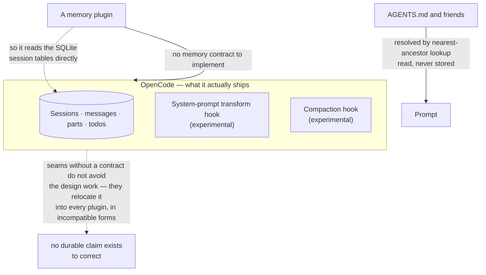

## 1. Executive Summary

OpenCode is an MIT-licensed coding agent of substantial size — thirty-odd
packages covering a CLI, TUI, desktop app, server, SDK, LSP integration, skills
and an enterprise tier. It has **no memory subsystem**, and that is why it is
here.

The atlas already reviews [Magic Context](../magic-context/) from the plugin
side, including the detail that it "reads OpenCode's native session database
read-only for its retrospective scanner". This report is the host side of that
relationship, and the finding is a general one about hosts:

**OpenCode ships the two hooks a memory plugin actually needs, and marks both
experimental.**

```ts
"experimental.chat.system.transform"?: (
  input: { sessionID?: string; model: Model },
  output: { system: string[] },
) => Promise<void>

"experimental.session.compacting"?: (
  input: { sessionID: string },
  output: { context: string[]; prompt?: string },
) => Promise<void>
```

The first is how memory gets into the prompt. The second is the compaction
boundary — the moment material is about to be discarded and therefore the moment
a memory system most wants to act. There is also
`experimental.compaction.autocontinue`, which lets a plugin suppress the
synthetic "continue" turn after compaction.

Those are the right seams. What is absent is a *contract*: nothing in the plugin
API describes a memory, a scope, a write, or a deletion. A plugin author gets
"here is the system prompt, mutate it" and builds everything else from nothing —
and when the hooks do not expose what they need, they open the host's SQLite file
instead.

That is the pattern worth recording. [Pi](../pi/) is the atlas's limit case, with
twenty-plus lifecycle events and no memory concept. OpenCode is the more common
case: a host with enough surface that plugins *nearly* work through it, which
produces integrations coupled to the database schema rather than to the API.

## 2. Mental Model

There is no memory state machine, because nothing becomes a belief. What exists:

```text
instruction files   AGENTS.md / CLAUDE.md, resolved by nearest ancestor —
                    "The first project-level match wins so we don't stack
                     AGENTS.md/CLAUDE.md from every ancestor."
                    read every session, never written

session state       SessionTable · MessageTable · PartTable · TodoTable
                    durable, but a transcript, not a claim

plugin seams        chat.message · chat.params · tool.execute.before/after
                    experimental.chat.messages.transform
                    experimental.chat.system.transform     ← memory injection
                    experimental.session.compacting        ← the salvage moment
                    experimental.compaction.autocontinue
```

Nothing here has an identity a correction could name. A memory plugin supplies
that, entirely.



## 3. Architecture

Packages include `core`, `opencode`, `cli`, `tui`, `desktop`, `server`, `sdk`,
`plugin`, `protocol`, `schema`, `session-ui`, `enterprise`, `llm`, `identity`,
`slack`, `web`. Inside `packages/opencode/src/`: `session/`, `plugin/`, `skill/`,
`storage/`, `mcp/`, `lsp/`, `tool/`, `permission/`, `snapshot/`, `worktree/`,
`sync/`, `share/`.

Storage is SQLite through Drizzle, re-exported from one schema module:
`SessionTable`, `MessageTable`, `PartTable`, `TodoTable`, `ProjectTable`,
`WorkspaceTable`, `AccountTable`, `SessionShareTable`. Sessions carry
`project_id`, `workspace_id`, `parent_id`, `title`, token counters, and a JSON
`metadata` column.

### Deployment and ergonomics

A coding agent you install; nothing to stand up for memory because there is none.
For a plugin author the relevant facts are that the store is local SQLite with a
typed schema, and that `metadata` on the session is a free JSON column — the
nearest thing to an official place to put something durable, with no contract
about who owns it.

## 4. Essential Implementation Paths

### Two hooks, both experimental

`experimental.chat.system.transform` receives the assembled system prompt as
`string[]` and lets a plugin mutate it. That is the injection point, and handing
over an array rather than a concatenated string is the better choice — a plugin
can append its own block without parsing anyone else's.

`experimental.session.compacting` is the more interesting one. Its documentation
is precise about what it offers: `context` strings appended to the default
compaction prompt, or `prompt` to replace it entirely. A memory system's best
opportunity is exactly here — the host is about to summarize and discard, and a
plugin can steer what survives.

Marking both `experimental` is honest and consequential. Every memory plugin
built on this host depends on an interface the host reserves the right to change,
which is a reasonable position for the host and a difficult one for the ecosystem
the atlas keeps finding downstream.

### No memory contract, so plugins go around

The [pluggable memory provider](../../patterns/pluggable-memory-provider/)
pattern was written from three host runtimes whose contracts carry no scope
parameter. OpenCode is a fourth data point and a slightly different one: it has
no memory contract *at all*, so there is nothing to critique for missing scope
or deletion — and the observable consequence is that Magic Context reads the
session database directly.

The general shape: **a host that offers transformation hooks but no domain
contract gets integrations coupled to its schema.** The hooks are stable-ish
API; the SQLite tables are not API at all, and a plugin depending on them breaks
on a migration the host is entitled to make silently.

### Instruction files are read, never written

`session/instruction.ts` resolves `AGENTS.md` and `CLAUDE.md` from the global
config directory and the project, with a stated rule:

> "The first project-level match wins so we don't stack AGENTS.md/CLAUDE.md from
> every ancestor."

That is context loading, not memory: the file is authored by a human, read every
session, and never written by the agent. It is worth naming because these files
are frequently described as agent memory, and the distinction is exactly the
atlas's scope boundary — nothing the agent learns is recorded here.

## 5. Memory Data Model

None. Sessions, messages, parts and todos are durable, and a transcript is not a
claim: there is no subject, no predicate, no status, and nothing a correction
could address. `metadata` on the session is an untyped JSON column with no
ownership convention.

## 6. Retrieval Mechanics

None for memory. Instruction-file resolution is a filesystem walk with a
first-match rule.

## 7. Write Mechanics

None for memory. A plugin may transform messages and the system prompt, and may
influence compaction, but the host stores nothing on its behalf.

### Operational cost

No memory means no extraction cost, no consolidation, no lag — and no memory. The
cost a plugin inherits is that everything it injects goes through
`experimental.chat.system.transform` into the system prompt, which is the
cache-sensitive position: a plugin that varies its block per turn invalidates the
provider's prefix cache on every request, the trade
[Hermes Agent](../hermes-agent/) resolves by freezing memory at session start.

## 8. Agent Integration

The plugin surface is the product here: `chat.message`, `chat.params`,
`chat.headers`, `permission.ask`, `command.execute.before`,
`tool.execute.before` / `after`, `shell.env`, `tool.definition`, plus the
experimental transforms above. MCP, skills discovery, and LSP round it out.

## 9. Reliability, Safety, and Trust

Strengths:

- **A compaction hook**, which is the moment a memory system most needs and few
  hosts expose.
- **A system-prompt transform taking `string[]`**, so plugins compose rather than
  collide.
- **A typed, local SQLite schema**, inspectable by whatever needs it.
- **An explicit first-match rule** for instruction files, so ancestor stacking is
  a decision rather than an accident.

Gaps:

- **No memory contract**, so scope, deletion and trust are each plugin's problem
  and none of them can be enforced by the host.
- **Both memory-relevant hooks are experimental.**
- **Plugins couple to the database.** A schema migration breaks integrations that
  the API never sanctioned but the API also never served.
- **`metadata` is an unowned JSON column**, which is where two plugins will
  eventually collide.

## 10. Tests, Evals, and Benchmarks

The repository is extensively tested as an agent. Nothing memory-specific exists
to test, and nothing was run for this review.

## 11. For Your Own Build

### Steal

- **Expose the compaction boundary.** If your host summarizes and discards, a
  hook there is the single most valuable seam you can give a memory plugin, and
  letting it *append context* as well as replace the prompt is the right shape.
- **Hand plugins an array, not a string**, when they mutate assembled prompt
  content, so two plugins can coexist without parsing each other's output.
- **Make instruction-file resolution first-match and say so**, rather than
  concatenating every ancestor.

### Avoid

- **Transformation hooks without a domain contract.** They are enough for plugins
  to nearly work, which produces integrations coupled to your database instead of
  your API — and the coupling is invisible until a migration breaks it.
- **An unowned JSON metadata column** as the de-facto extension point.

### Fit

Read this as the host side of a problem the atlas documents from the plugin side.
If you are building a memory plugin for OpenCode, the hooks above are what you
have, both are experimental, and the session tables are what everyone reaches for
next. If you are building a host, the lesson is that offering seams without a
contract does not avoid the design work — it relocates it into every plugin, in
incompatible forms.

## 12. Open Questions

- Do the experimental hooks have a stability commitment anywhere?
- Is there a sanctioned place for plugin-owned durable state, or is session
  `metadata` it?
- Does anything detect or prevent two plugins writing the same `metadata` keys?
- How many plugins currently read the session tables directly, and does the
  project consider that supported?

## Appendix: File Index

- Plugin surface: `packages/plugin/src/index.ts` (`Hooks`,
  `experimental.chat.system.transform`, `experimental.session.compacting`,
  `experimental.compaction.autocontinue`).
- Instruction resolution: `packages/opencode/src/session/instruction.ts`.
- Storage schema: `packages/opencode/src/storage/schema.ts`, re-exporting
  `packages/core/src/session/sql.ts` (`SessionTable`, `MessageTable`,
  `PartTable`, `TodoTable`).
- Skills: `packages/opencode/src/skill/discovery.ts`.
