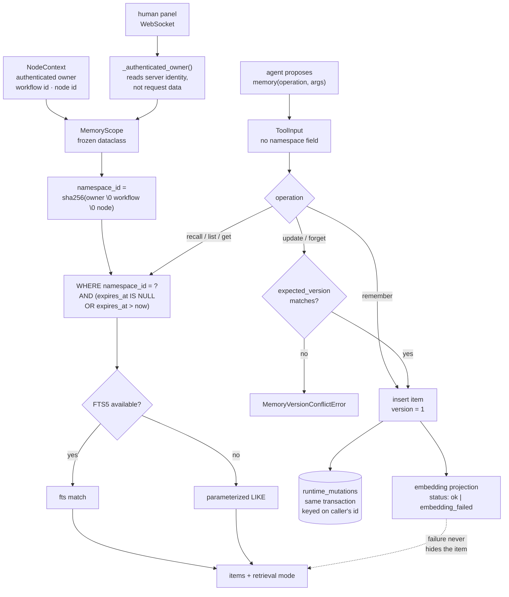

## 1. Executive Summary

OpenCompany is a self-hosted canvas for agent workflows — the README's framing
is *"n8n, built agent-first"* — with 146 nodes across 31 categories, MIT
licensed, 1,202 commits since 31 December 2025. It is large: roughly 197,000
lines of Python on the server and 49,000 lines of TypeScript across the client
and CLI.

The memory story is three stores under one word, and the report separates them
because the project does:

- **The durable tool store.** `simpleMemory` exposed to the model as a tool
  named `memory`, with `remember`, `recall`, `list`, `get`, `update` and
  `forget` over rows in `agent_memory_items`. This is what the marks rest on.
- **Conversation memory.** A per-agent transcript in markdown or JSONL, written
  back per turn, persisted so an agent continues one conversation across
  firings.
- **A long-term vector store.** An in-process cosine index over optional local
  embedders, described in its own module as an accelerator.

Two marks, and the first is the reason to read this. **The namespace a memory
belongs to is derived, not supplied.** `MemoryScope` is a frozen dataclass of
authenticated owner, workflow and memory-node id; its `namespace_id` is a
SHA-256 over those three fields; and every query in the store carries
`namespace_id == scope.namespace_id`. The tool schema the model sees has no
namespace field at all. Where most systems in this corpus make scope a
predicate someone has to remember, this one makes it a value nobody can name.

The gap is correction. A `forget` deletes the row and leaves nothing keyed on
what it removed, so the fact that was wrong enough to delete is admitted again
the moment an agent decides to remember it.

## 2. Mental Model

`RFC-0002-AGENT-CONTEXT-AND-MEMORY.md` draws the distinction the code follows:

> *"**Context** is the exact, backend-owned execution journal used to
> reconstruct the next provider request. **Memory** is an explicitly invoked
> tool used to store and retrieve durable facts, decisions, and user
> preferences."*

The RFC is worth reading as an artifact in its own right, because it carries a
banner marking half of itself obsolete. The Context design it specifies — an
append-only journal with threads, epochs, hash-chained events, checkpoints and
blobs — was replaced by *"the plain conversation store: one
`agent_conversations` row per `(workflow_id, generation, agent_node_id)` →
messages JSON."* The document says so at the top, names the file that
superseded it, and marks the surviving sections: *"the Memory sections remain
accurate."* A design document that dates its own obsolescence in place is rarer
than the design it describes.

The memory half sets three constraints that the implementation keeps. Namespace
fields are absent from the tool input. Items use optimistic versions. And
*"SQL/FTS is authoritative and remains usable when embedding generation fails;
embedding projections are rebuildable accelerators."*

## 3. Architecture



The two entry points — the model's tool call and the human panel — converge on
the same `MemoryScope`, and neither can supply it.

## 4. Essential Implementation Paths

**The namespace.** Eleven lines carry the design:

```python
@dataclass(frozen=True)
class MemoryScope:
    """Trusted scope derived from NodeContext, never from LLM arguments."""
    owner_id: str
    workflow_id: str
    memory_node_id: str

    @property
    def namespace_id(self) -> str:
        material = "\0".join(
            (self.owner_id, self.workflow_id, self.memory_node_id)
        ).encode("utf-8")
        return "mem_" + hashlib.sha256(material).hexdigest()[:48]
```

The NUL separator is the detail worth copying. Joining three attacker-adjacent
strings with any printable delimiter lets one field impersonate a boundary; a
NUL cannot appear in the fields being joined, so the digest is injective over
the triple.

**The read path.** Every query is filtered twice, by namespace and by expiry:

```python
@staticmethod
def _active_clause() -> Any:
    now = _utcnow()
    return or_(
        MemoryToolItem.expires_at.is_(None),
        MemoryToolItem.expires_at > now,
    )
```

`_active_clause()` appears at four read sites and `namespace_id ==
scope.namespace_id` at nine, covering `get`, `list`, `recall`, the update
read-back and the FTS projection maintenance.

**The human panel.** `_handlers.py` opens by stating its own rule — *"Every
request resolves its namespace from the persisted workflow graph and the
authenticated WebSocket. Neither the client nor the model can provide a
namespace identifier"* — and `_authenticated_owner` walks the WebSocket's state
and scope for a `user_id`, `principal_id` or `subject`, described as reading
identity *"without consulting request data."*

## 5. Memory Data Model

Three tables, and the split between them is the design.

`agent_memory_items` holds `id`, `namespace_id`, `content`, optional `title`,
`category` and `tags`, an integer `version` floored at 1, an optional
`expires_at`, and created/updated timestamps. `agent_memory_namespaces` records
the isolation boundary itself. `agent_memory_embedding_projections` carries
`item_id`, `namespace_id`, a `status`, a nullable `vector` and a nullable
`error`, under a docstring that fixes its rank: *"Rebuildable semantic
projection; never the source of truth."*

What the item does not carry is any epistemic field. There is no status, no
confidence, no provenance, no supersession pointer. A memory is content plus
labels plus a version, and the version is concurrency control rather than
belief. The only `status` in the schema belongs to the projection and describes
whether an embedding was computed. Both timestamps are record-time; `expires_at`
is a TTL the writer chooses, not an event-time axis, so nothing here answers
*what did this store believe last Tuesday*.

## 6. Retrieval Mechanics

Retrieval is lexical and authoritative. On SQLite the store maintains an FTS5
projection and queries it; where FTS5 is unavailable it falls back to
parameterized SQL `LIKE`, and the response names which ran. Filters compose
namespace, category, tags and expiry, with cursor pagination.

The vector index is beside this rather than under it. `vector_store.py` builds
an in-process cosine index over optional embedders and takes care that
*"merely enabling long-term memory never imports PyTorch or downloads a model
on the event-loop thread"* — construction and encoding run through
`asyncio.to_thread`.

The consequence is the property most hybrid stores in this corpus lack: an
embedding outage is a labelled degradation, not an empty result. A failed
embedding writes `embedding_failed` into the projection's status and leaves the
item fully retrievable by text.

## 7. Write Mechanics

Writes are explicit. Nothing extracts memories from a transcript; the RFC lists
the non-goals plainly — memory *"does not automatically inject prompts, recall
vectors, persist transcripts, own provider identity, or compact Context."*

`update` and `forget` take an `expected_version` and run under
`select(...).with_for_update()`, raising `MemoryVersionConflictError` on a
mismatch, so two agents editing one item cannot silently overwrite each other.

Retries are handled by a durable idempotency ledger rather than by hoping.
`run_runtime_mutation` opens `BEGIN IMMEDIATE` on SQLite — taking the write
reservation *before* the read, so the whole read-modify-write is serialized —
and commits a `runtime_mutations` row in the same transaction. A replay of the
same `mutation_id` returns the original result with `applied: False`.

That ledger is the near-miss of this report and worth being precise about.
A `forget` stores `{"operation": "forget", "memory": <the serialized item>}` in
its `result` column, so the durable record of a deletion contains the deleted
content. It is not awarded `audit_log`, for two reasons. Its purpose is
idempotency: the row exists to suppress a duplicate write, it is keyed on
`(mutation_id, resource_type, resource_id)` rather than on time or subject, and
nothing declares or enforces append-only semantics. And its coverage is
conditional — `_operation_id` returns `Optional[str]`, resolving a
caller-supplied `tool_call_id`, `request_id` or `operation_id`, and returning
`None` when none is present. A mutation without one is applied and unrecorded.
An audit log whose completeness depends on the caller having sent an id is a
different guarantee from one that records every write.

Nothing is keyed on the *value* of a forgotten memory, and nothing consults the
ledger before a `remember`. So a fact deleted as wrong is admitted again
unremarked the next time an agent proposes it, which is why `tombstone` is
absent.

## 8. Agent Integration

Memory is a node on a canvas. `simpleMemory.output-tool` wires to
`agent.input-tools`, the model sees a tool called `memory` with one
multi-operation schema, and operator policy — notably `reset_policy` — lives in
persisted node configuration the model cannot reach. The RFC states the
separation: *"Model arguments use a separate, plugin-locked `ToolInput`; model
arguments cannot override backend scope or configuration."*

`reset_policy` decides what a Workflow Reset does: memory survives by default,
and a node may opt into `clear`.

## 9. Reliability, Safety, and Trust

The clearing story is the most instructive thing in the tree after the
namespace, because it starts from an observation about users rather than about
schemas:

> *"'Memory' from the user's perspective is not just the markdown transcript —
> it's every piece of state an agent reuses across iterations of a
> conversation. `simpleMemory.memory_content` is the visible part; the
> long-term vector store and `TodoService` plan-work-update lists are the
> invisible parts that quietly bloat subsequent runs."*

`clear_agent_session_state` acts on that: it clears TodoService entries under
the node-scoped keys *and* the historical workflow, session and default
fallbacks that legacy callers wrote, optionally drops the per-session vector
store, and resets the node's `memory_content`, `memory_jsonl` and
`last_session_id`. It returns `cleared_vector_store`, `cleared_todo_keys` and
`cleared_memory_node` so the caller can see what actually happened rather than
receiving a bare success.

Two edges of it are worth stating. `clear_long_term` defaults to `False`, so
the ordinary clear leaves the vector store populated. And the docstring records
that *"frontend-driven legacy clears omit this and handle markdown reset
client-side"*, so two callers of the same operation cover different sets of
state. Neither path touches `agent_memory_items` — the durable tool store is
cleared by `clear_namespace` under `reset_policy`, which is a third meaning of
the word *clear* in one subsystem.

Against that, the isolation guarantees are strong. The namespace derivation
cannot be influenced by the model, the panel derives owner identity from the
authenticated socket, and the handler docstring notes that broadcasts about
memory changes *"remain metadata-only"* — a change notification does not carry
content to a client that has not authorized a read.

## 10. Tests, Evals, and Benchmarks

Six files under `server/tests/services/memory/`, 949 lines. The suites were not
run for this review.

`test_namespace_isolation_and_durable_idempotency` is the one that earns
`negative_eval`, and it is built so that it cannot pass on an empty store:

```python
assert (await store.list(scope_a))["count"] == 1
assert (await store.list(scope_b))["count"] == 0
```

The positive and the negative are asserted over the same database in the same
test, and the same test pins the idempotency contract in both directions — a
replayed `operation_id` comes back with `applied: False` and the *original*
item's id, so a retry provably inserted nothing.

`test_lexical_recall_survives_embedding_failure` is the second one worth
copying. It installs an embedder that raises, then asserts three things: the
item's `indexing_state` is `embedding_failed`, recall still returns it, and
`retrieval` is `fts` or `sql`. Most degradation tests in this corpus assert
that nothing crashed; this one asserts the degradation was *labelled* and that
the authoritative path still answered.

What is not covered: no test asserts the expiry clause withholds an expired
item, nothing exercises `clear_agent_session_state` across all three stores at
once, and there is no memory-quality benchmark — no measurement of whether
lexical recall retrieves the right item at any corpus size, which is the open
empirical question for a store that has deliberately made lexical search
authoritative.

## 11. For Your Own Build

**Derive the scope key; do not accept it.** A frozen dataclass built from
authenticated context, hashed into an opaque id, with no corresponding field in
the tool schema, removes an entire class of bug that this atlas otherwise finds
by the dozen: the optional scope argument, the predicate on two of three read
paths, the `include_all` escape. The model cannot pass what the schema does not
have.

**Join scope fields with a NUL before you hash them.** Any printable separator
lets one field's value impersonate a boundary between two others.

**Make the durable path the authoritative one and label the accelerator's
failures.** Lexical search that always works, plus an embedding projection that
records `embedding_failed` and never hides the row, is strictly better than a
vector store whose outage looks like an empty memory.

**Decide what the word *clear* means before you ship two of them.** Three
stores here answer to "memory" and three different operations empty them, with
different defaults and different callers. The mitigation that makes it
survivable is the returned diagnostic naming exactly what was cleared — copy
that even if you cannot unify the stores.

## 12. Open Questions

**Does anything reconcile the three memories?** A fact can exist as a durable
item, as a sentence in a markdown transcript, and as a vector in the long-term
index. Nothing found deduplicates across them or gives one precedence when they
disagree, and a `forget` on the tool store does not reach the other two.

**What happens to the ledger over time?** `runtime_mutations` is written on
every identified mutation and nothing in the tree deletes from it. Whether it
is pruned, and whether the forgotten-item payloads it retains are in scope for
a deletion request, was not traced.

**Is the FTS projection kept consistent under failure?** The store maintains an
FTS5 table alongside the authoritative rows and deletes from it on `forget`.
What happens when the projection write fails while the item write succeeds — and
whether a rebuild path exists — was not established at this pin.

## Appendix: File Index

| Path | What it holds |
| --- | --- |
| `server/services/memory/tool_store.py` | `MemoryScope`, the three tables, and every namespace-filtered query |
| `server/services/memory/vector_store.py` | The optional embedders and the in-process cosine index |
| `server/services/memory/state.py` | Cross-store session clearing and its diagnostics |
| `server/services/memory/runtime.py` | Atomic per-turn transcript persistence |
| `server/services/memory/markdown.py`, `jsonl.py` | The two conversation-transcript formats |
| `server/nodes/tool/simple_memory/__init__.py` | The tool node, its locked `ToolInput`, and `reset_policy` |
| `server/nodes/tool/simple_memory/_handlers.py` | The human panel and `_authenticated_owner` |
| `server/core/database.py` | `run_runtime_mutation` and the `BEGIN IMMEDIATE` reservation |
| `server/models/database.py` | The `runtime_mutations` idempotency ledger |
| `RFC-0002-AGENT-CONTEXT-AND-MEMORY.md` | The Context/Memory separation, and the banner marking half of itself superseded |
| `server/tests/services/memory/test_tool_store.py` | The isolation and embedding-failure cases |

## History

**2026-08-25** — [`49d667e2ea705d34cd4676e2f812acad7007e663`](https://github.com/zeenie-ai/OpenCompany/commit/49d667e2ea705d34cd4676e2f812acad7007e663) — first reading, roughly 197,000 lines of Python and 49,000 of TypeScript, 1,202 commits since 31 December 2025, MIT. Screened before anything was read: no auto-run surface, eight build-time execution surfaces, four unpinned surfaces and two files inside the seven-day cooldown; nothing was installed and no suite was run. `CLAUDE.md` at the root is addressed to a reading agent and was treated as data. Two marks. `scope_enforced` rests on `MemoryScope`, a frozen dataclass hashed into a namespace id that appears as a predicate on all nine read and mutation sites, with no corresponding field in the model-visible tool schema. `negative_eval` rests on the isolation test asserting a sibling scope returns zero while the writing scope returns one, over the same store. `tombstone` is withheld: `forget` deletes the row, and although the `runtime_mutations` ledger retains the forgotten item in its `result` column, that row is keyed on the caller's mutation id rather than on the value and no write path consults it. `audit_log` is withheld on coverage and intent — the ledger exists to suppress duplicate writes, nothing declares it append-only, and `_operation_id` returns `None` when the caller supplies no id, so an unidentified mutation is applied and unrecorded. `trust_state` is absent: the item carries no status, confidence or provenance, and the only `status` in the schema belongs to the embedding projection. `bitemporal` is absent — both timestamps are record-time and `expires_at` is a writer-chosen TTL. `human_review` is absent: the WebSocket panel is authenticated CRUD over the same store, not a gate on what an agent writes.
