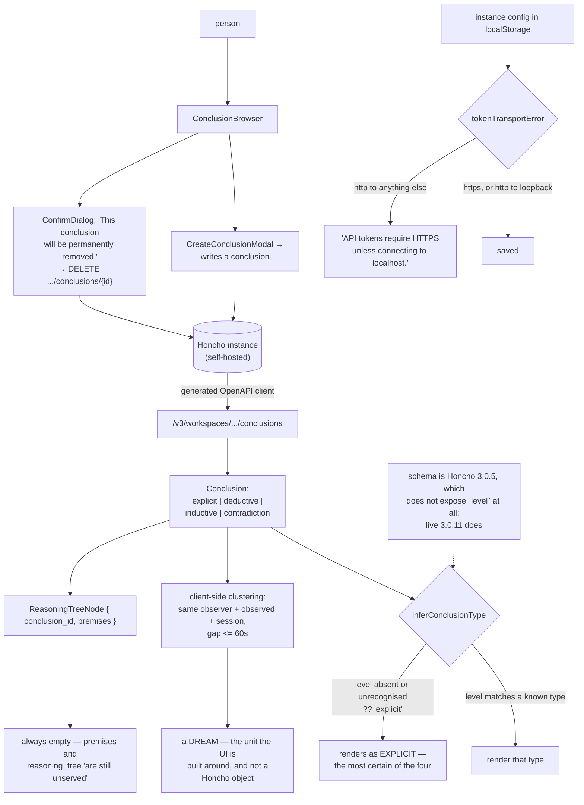

## 1. Executive Summary

OpenConcho is "[a] fast, privacy-first desktop & web UI for self-hosted
[Honcho](../honcho/) instances" — MIT, version 0.16.2, 18,136 lines of
TypeScript across a web and a desktop package. It stores no memory. It is a
window onto someone else's.

That makes it unusual here and worth a report rather than a bullet, because the
thing it is a window onto is the part of a memory system users almost never get
to see: the conclusions a server has drawn about them. Honcho's conclusions are
typed — `explicit`, `deductive`, `inductive`, `contradiction` — and OpenConcho
browses them, creates them, and deletes them permanently, with a confirmation
dialog that says so.

Two things about how it renders them are worth knowing before trusting the view.

The first is a fallback. `inferConclusionType` is one line:

```
return CONCLUSION_TYPES.find((t) => t === c.level) ?? "explicit";
```

A conclusion whose `level` is missing, or carries a value this client does not
recognise, is displayed as `explicit` — a thing the user said outright. The
other three types are all inferences the server made, with progressively less
warrant. So the failure direction is the wrong one: absence of information about
how certain a belief is renders as maximum certainty.

Whether that fires depends on the server, and the file says so itself in a
comment that is more honest than most release notes: "The generated OpenAPI
schema (Honcho 3.0.5) does not expose `level`, `premises`, or `reasoning_tree`,
but live Honcho 3.0.11 returns `level` on every conclusion." Against a 3.0.5-era
instance, every conclusion in the browser reads as explicit.

The second is that a **dream** — the unit the whole interface is organised
around, with its own route, panel and progress display — is not a Honcho object.
The client builds it by grouping conclusions that share an observer, an observed
peer and a session, and that fall within a configurable gap defaulting to sixty
seconds. That is a reasonable visualisation and it is entirely the viewer's
invention; nothing on the server agrees that these conclusions belong together.

And the premise tree the interface exists to display cannot be filled in.
`ReasoningTreeNode` is defined, the type is declared optional, and the comment
states the position plainly: `premises` and `reasoning_tree` "are still unserved
— the premise tree stays empty until Honcho ships them."

## 2. Mental Model

A **conclusion** is Honcho's, with a type and an optional level.

A **dream** is OpenConcho's: a time-clustered run of conclusions sharing an
observer, an observed peer and a session.

An **instance** is a base URL and a token in `localStorage`, saved only if the
transport rule allows it.



## 3. Architecture

| Area | Role |
| --- | --- |
| `packages/web/src/api/queries.ts` | Every server call, including the five deletes |
| `packages/web/src/api/schema.d.ts` | The generated OpenAPI types, pinned at Honcho 3.0.5 |
| `packages/web/src/lib/dreams.ts` | The conclusion type vocabulary, the clustering, and the schema-skew note |
| `packages/web/src/components/conclusions/ConclusionBrowser.tsx` | Browse, create, delete |
| `packages/web/src/lib/security.ts` | The token-transport rule |
| `packages/web/src/lib/config.ts` | Instance storage in `localStorage` |
| `packages/desktop` | The desktop shell over the same web UI |

## 4. Essential Implementation Paths

`lib/dreams.ts:14-60`. The whole report is in that file: the type vocabulary,
the comment about which fields the server actually serves, the always-empty
reasoning tree, the clustering that invents dreams, and the one-line fallback.

Then `ConclusionBrowser.tsx:284-306` for the create and delete surfaces.

## 5. Memory Data Model

None of its own, which is the correct design for a viewer. What it models
locally is an instance: id, name, base URL, token — kept in `localStorage`
under a current key, with a migration from a legacy key that removes the old
entry after copying.

`localStorage` for a bearer token to someone's personal memory server is worth
naming plainly. In the desktop build it is the embedded webview's store rather
than an OS keychain, so any code running in that origin can read it. For a
self-hosted, single-user tool this is a defensible trade; it is not the same
guarantee as "privacy-first" suggests on first reading.

## 6. Retrieval Mechanics

Honcho's API does the retrieval. OpenConcho filters and groups what comes back,
and the grouping is the substantive part: `clusterDreams` with a `gapMs`
defaulting to 60,000, keyed on observer, observed and session.

The consequence worth stating is that two conclusions drawn sixty-one seconds
apart appear as separate dreams, and the same reasoning episode can split or
merge as the gap constant changes. Nothing is lost — the conclusions are
unchanged — but any count or narrative the interface presents at the dream level
is an artifact of that constant.

## 7. Write Mechanics

Five deletes reach the server: workspace, session, session peers, conclusion and
webhook endpoint. One create reaches it that matters for memory: a conclusion,
written into the workspace from a modal.

A person writing a conclusion by hand into a store whose other conclusions were
inferred is an interesting capability and an unlabelled one. Honcho's `level`
distinguishes how a conclusion was arrived at; nothing in this flow marks a
hand-written conclusion as human-authored rather than machine-inferred, so it
joins the same list under whatever level the API assigns it.

## 8. Agent Integration

None directly — no agent talks to OpenConcho. It is the human end of a Honcho
deployment, which is precisely its value in this corpus: it is what a review
surface for an inference-based memory system looks like when someone builds one.

## 9. Reliability, Safety, and Trust

The token-transport rule is the one enforcement the client owns.
`isSecureTokenTransport` returns true for `https:`, and for `http:` only when
the host is loopback — `localhost`, `127.0.0.1`, `::1`, `[::1]`, `0.0.0.0` —
and `tokenTransportError` turns that into "API tokens require HTTPS unless
connecting to localhost." Both save paths in `SettingsForm` consult it when a
token is present, so an instance carrying a token over plaintext HTTP to a
LAN address cannot be saved. The loopback exemption is deliberate and correct
for the self-hosting case.

The fallback in `inferConclusionType` is the trust problem, and it is small
enough to fix in a character: the failure case should be its own type —
`unknown` — rendered as such, rather than collapsing into `explicit`. The
distinction matters most precisely when it is missing, because a user reviewing
what a system believes about them needs to know which beliefs it was *told* and
which it *worked out*.

## 10. Tests, Evals, and Benchmarks

Eighteen test files covering the dream clustering, dream progress, security
rules, instance storage, discovery, dispatch, the dashboard and the playground.
`security.test.ts` pins the transport rule in both directions, including
`http://192.168.1.50:8000` as false — asserting that a LAN address is not
treated as local, which is the case that would otherwise slip.

There is no test asserting what `inferConclusionType` does with a missing level.

## 11. For Your Own Build

If you build a review surface over an inference-based memory, make the
derivation type impossible to lose. A reader deciding whether to delete a belief
needs to know whether the system was told it or deduced it, and a `??` default
to the most-certain label is the one direction that must never be the fallback.

Name a client-side grouping as such in the interface. Dreams are a good
visualisation; a user who deletes "a dream" should understand they are deleting
n conclusions that a sixty-second heuristic put in one box.

Copy the schema-skew comment habit. Recording "the generated schema is from
3.0.5, the live server is 3.0.11, these two fields are still unserved" in the
type file is worth more than a changelog entry, because it is where the next
person will be confused.

And do build the surface. Very few systems in this corpus give a person any way
to see what was concluded about them; fewer give them a delete button.

## 12. Open Questions

Whether a hand-created conclusion is distinguishable from an inferred one on the
server. Nothing in the create flow sets a level, and the atlas's
[Honcho report](../honcho/) was not re-read at this pin to check what the API
assigns.

Whether `premises` and `reasoning_tree` have since shipped. The comment records
them as unserved as of the Honcho versions named; the reasoning-tree view is
built and waiting.

Whether the desktop build keeps tokens anywhere other than the webview's
`localStorage`. The desktop package was not read in depth.

## Appendix: File Index

| Path | What to read it for |
| --- | --- |
| `packages/web/src/lib/dreams.ts` | The type vocabulary, the schema-skew note, the clustering, and the fallback |
| `packages/web/src/components/conclusions/ConclusionBrowser.tsx` | Create, inspect, permanently delete |
| `packages/web/src/lib/security.ts` | The transport rule, and the loopback exemption |
| `packages/web/src/test/security.test.ts` | A LAN address asserted not to count as local |
| `packages/web/src/lib/config.ts` | Instance and token storage |

## History

**2026-09-16** — [`b5e25646d3f91e54c4aacf111c0f8ff734cead87`](https://github.com/offendingcommit/openconcho/commit/b5e25646d3f91e54c4aacf111c0f8ff734cead87) — first reading, at a commit dated 13 August 2026. Screened before opening, from a shallow clone: seventeen files scanned, one auto-run surface, three build-time execution points, three unpinned surfaces, nothing inside the dependency cooldown, and the `CLAUDE.md` and `AGENTS.md` read as data. Nothing was installed, built or run.
