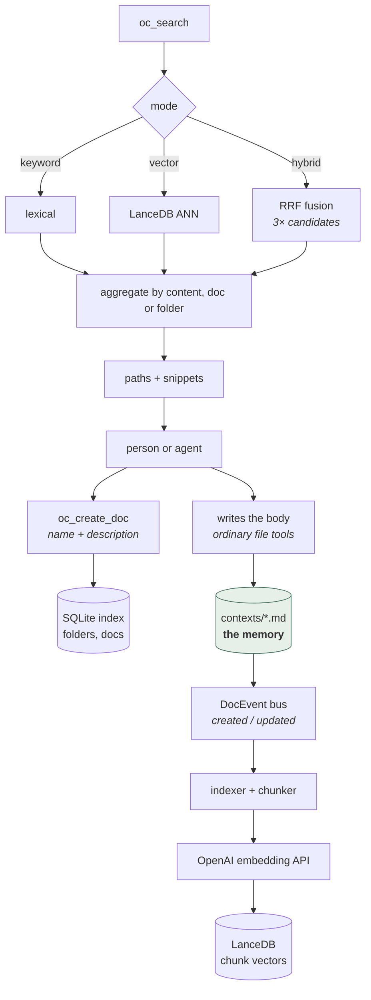

## 1. Executive Summary

OpenContext is a personal context store — MIT, 93 commits, roughly 23,400 lines of JavaScript under `src/`, 7,000 lines of Rust across two crates, 3,800 more in a Tauri shell, and an Expo iOS client beside them. The pitch is *"Bring your own coding agent"*: it does not ship an agent, it makes the context an agent already has somewhere reusable across agents and repositories.

**The design decision worth reading is what it declines to store.** A memory here is a file. SQLite holds an index — an id, a parent, a unique relative path, an absolute path, a human description, a `stable_id` and two timestamps — and LanceDB holds chunk vectors. The text itself stays on disk as Markdown. What the MCP surface hands an agent is consequently a *path*: `oc_manifest` returns a JSON list of a folder's documents "for the agent to read context by path", and `oc_resolve` and `oc_get_link` turn a name into an address.

That is why the tool list is shorter than it first appears. There are ten tools, and none of them writes a document body or deletes anything:

```
oc_list_folders   oc_list_docs     oc_create_doc    oc_set_doc_desc   oc_manifest
oc_search         oc_resolve       oc_get_link      oc_folder_create  oc_index_status
```

An agent creates a doc, names it, describes it, and then writes the body with the file tools it already had. The store never becomes a second copy of the text, and the failure mode where a memory system's index and the user's actual files drift apart cannot arise, because there is only one artefact.

Two things sit against it, and both are narrow rather than structural.

**The type filter runs after the candidate set is cut.** `search` retrieves, then applies `hits.retain(...)` for `doc_type`. When results are aggregated by content the candidate limit *is* the requested limit, so a filtered search silently returns fewer rows than asked for rather than fetching deeper. The other two aggregation modes take `limit * 5` candidates first and are not exposed to this.

**`npm test` does not run most of the tests.** It chains `test:core`, `test:search` and `test:native`; the Rust suite — where 130 of the assertions live — is `test:rust`, reachable only through `test:all`, along with the CLI integration suite.

## 2. Mental Model

Three layers, and only the first is durable.

```text
contexts/<folder>/<doc>.md        the memory. plain files.
SQLite: folders, docs             the index. paths, descriptions, ids, timestamps.
LanceDB: chunk vectors            the search projection. rebuildable from the files.
```

A folder is a tree node with a `rel_path` that is `UNIQUE`, and `ON DELETE CASCADE` down to its docs. A doc is a row pointing at a file. The `description` column is the one editorial field in the schema: a short human statement of what the file is for, which is what `oc_manifest` gives an agent so it can decide which paths are worth opening without reading them all.



The highlighted node is the point. Everything else in the diagram can be deleted
and rebuilt from it.

## 3. Architecture

- `crates/opencontext-core/src/lib.rs` (1,254 lines): the store — schema, folder and doc CRUD, path resolution, migrations, and the optional `search` feature gate.
- `crates/opencontext-core/src/search/` (~2,700 lines): `searcher.rs` for the three modes and RRF, `vector_store.rs` for LanceDB, `indexer.rs`, `chunker.rs`, `embedding.rs` for the OpenAI client, `index_sync.rs` for the event-driven reindex.
- `crates/opencontext-core/src/events.rs`: a tokio broadcast bus carrying `DocEvent` and `FolderEvent`, which is how a file change reaches the indexer without the store depending on it.
- `src/` (84 files, ~23,400 lines of JavaScript): the CLI internals, the MCP server, and the web UI.
- `src/mcp/server.js` (269 lines): the ten tools.
- `bin/oc.js` (827 lines): the `oc` command — `mcp`, `ui`, search and store subcommands.
- `src-tauri/` (3,804 lines of Rust) and `src-ios/` (26 files): the desktop and mobile shells.

The Rust core is exposed to the JavaScript through `crates/opencontext-node`, a napi binding, so the CLI and the MCP server call the same store the desktop app does.

## 4. Essential Implementation Paths

### The index, and what it does not hold

```sql
CREATE TABLE IF NOT EXISTS docs (
    id INTEGER PRIMARY KEY AUTOINCREMENT,
    folder_id INTEGER NOT NULL REFERENCES folders(id) ON DELETE CASCADE,
    name TEXT NOT NULL,
    rel_path TEXT NOT NULL UNIQUE,
    abs_path TEXT NOT NULL,
    description TEXT DEFAULT '',
    stable_id TEXT,
    created_at TEXT NOT NULL,
    updated_at TEXT NOT NULL
);
```

No content column. `stable_id` is the interesting one: `get_doc_by_stable_id` resolves a doc by an identity that is not its path, which is what lets a rename or a move keep an existing reference working — the failure that breaks a memory system addressed by path alone.

### Search

Three modes. `keyword_search` is lexical; `vector_search` queries LanceDB; `hybrid_search` takes `limit * 3` candidates from each and fuses them with reciprocal rank fusion keyed on `file_path:line_start`. Results are then aggregated at one of three levels — the raw chunk, the document, or the folder — which is a genuinely useful control for a store whose unit is a file: "which folder should I look in" and "which chunk answers this" are different questions.

Two behaviours a reader should know before relying on it.

**There is no scope filter.** `SearchOptions` carries exactly five fields: `query`, `limit`, `mode`, `aggregate_by`, `doc_type`. There is no folder parameter, no project key, no way to bound a search to a subtree. Folders are an organising and aggregating device, not a boundary — which is a reasonable choice for a single-user store and is the reason this report carries no scope mark.

**`doc_type` is a post-filter.** It is applied with `hits.retain(...)` after the candidate set has been retrieved, and the candidate count depends on the aggregation mode:

```rust
let search_limit = if aggregate_by == AggregateBy::Content {
    limit                 // no headroom — the filter can only remove
} else {
    limit * 5
};
```

So `doc_type: "idea"` with content aggregation returns however many of the top `limit` chunks happen to be ideas, not the top `limit` ideas.

### Index synchronisation

`index_sync.rs` subscribes to the event bus and reindexes on document lifecycle events, so the vector layer follows the files without the store having to call the indexer. Embeddings come from the OpenAI embedding API, with the actual dimension detected from the first response rather than assumed — a small correctness detail that saves a class of configuration error.

## 5. Memory Data Model

A doc is a path with a description. That is the whole model, and the absences follow from it rather than being oversights in it:

- **No status.** Nothing distinguishes a draft from a settled note, or a candidate from a confirmed one.
- **No provenance.** A doc does not record which agent or session created it, or from what.
- **No confidence.**
- **No validity time.** `created_at` and `updated_at` are record time. There is no axis for when the thing described was true.
- **No supersession.** A correction is an edit to a file; the previous text is whatever the user's own version control kept.

The last one is the honest summary of the design: OpenContext delegates history to git, because the memory is files and files are already versioned by the tool the audience uses. That is a defensible answer, and it is an answer this report cannot verify, because nothing in the tree requires the contexts directory to be a repository.

## 6. Retrieval Mechanics

Covered in section 4. The point worth repeating here is what a search returns: paths and snippets, not assembled context. There is no prompt block, no token budget, no injection step. What the agent does with the addresses is the agent's business, which is the consistent consequence of the "bring your own agent" premise.

## 7. Write Mechanics

There is no automatic capture. Nothing watches a conversation, extracts facts, or writes on the agent's behalf. A doc exists because a person or an agent called `oc_create_doc`, and it has content because something wrote the file.

For a memory system this is unusual and worth stating plainly rather than treating as a gap: the write path is entirely explicit, so the failure modes that dominate this corpus — a model deciding what is worth remembering, an extractor laundering its own output back into the store — cannot occur here. The cost is that nothing accumulates unless someone does the work.

## 8. Agent Integration

Ten MCP tools, listed in section 1. The set is deliberately read-and-address heavy: four list or resolve, one searches, one reports index status, and three mutate the *index* — create a folder, create a doc, set a description. Nothing writes a body and nothing deletes.

The tool descriptions in `src/mcp/server.js` are written in Chinese while the README ships in English and Chinese, so an English-only agent reads the schema and the parameter names but not the prose intent. That is a fact about the surface rather than a defect.

Deletion exists in the core crate and the CLI — `DELETE FROM docs`, cascading folder removal, a force flag for non-empty folders — so the capability is present and simply not exposed to the agent. Given that a delete here removes a row and, on the folder path, cascades, keeping it out of the model's reach is a defensible boundary.

## 9. Reliability, Safety, and Trust

Strengths:

- **The memory is the file.** No second copy, no reconciliation problem, no drift between what the user edits and what the store believes.
- **The vector layer is a rebuildable projection** driven by an event bus rather than by callers remembering to reindex.
- **`stable_id` survives a rename**, which is the failure a path-addressed store otherwise walks into.
- **Embedding dimensions are detected, not assumed.**
- **The agent-facing surface cannot delete**, and cannot silently rewrite a body.
- **`rel_path` is `UNIQUE` and foreign keys are on**, with `ON DELETE CASCADE` making folder removal a single decision rather than a sweep.

Gaps:

- **No scope of any kind on the read path.** Correct for one user and one machine; the thing to fix first if this ever serves two.
- **The `doc_type` post-filter can under-return** in content aggregation.
- **No epistemic state at all**, so a stale note and a current one are indistinguishable to a search that ranks on similarity.
- **Embeddings go to a third-party API** — the store is local, the index is not, and a reader evaluating this as a private context store should know where the text goes.
- **The default `npm test` is not the test suite.** Most assertions live behind `test:rust` and `test:integration`, which `npm test` does not call.

## 10. Tests, Evals, and Benchmarks

Two suites, and the split matters.

**JavaScript**: 1,024 lines across five files — `tests/core/config.test.js`, `tests/search/formatter.test.js`, `tests/native/native-adapter.test.js`, `tests/native/store-native.test.js`, and `tests/integration/cli.test.js` — run with `node --test`.

**Rust**: 130 test attributes across `crates/opencontext-core/src/tests.rs` (98) and `src/search/tests.rs` (32), covering folder and doc CRUD, renames, moves, the force flag on non-empty folder removal, and the error paths for every not-found case.

```json
"test":  "npm run test:core && npm run test:search && npm run test:native",
"test:all": "npm run test && npm run test:integration && npm run test:rust"
```

The plain `test` script skips both the CLI integration suite and the entire Rust suite. A contributor running `npm test`, or a CI job configured with it, exercises neither the store nor the searcher.

**No benchmark, and none claimed.** There is no accuracy number, no comparison and no leaderboard anywhere in the tree or the README — which for a personal context store is the honest posture, and the atlas records it as that rather than as an absence.

**No negative retrieval evidence.** The `*_not_found` cases are error paths — a rename against a missing folder returns an error — not assertions that a populated search omits something it should. Nothing here earns `negative_eval`.

## 11. For Your Own Build

### Steal

- **Index files, do not copy them.** If your users already keep their knowledge in files, a store that owns the index and hands back paths avoids the entire drift problem and inherits their version control for free.
- **Give every document a `stable_id` alongside its path.** A path is an address that changes; an identity is not.
- **Return an address, not assembled context**, when the consumer is an agent that already has file tools.
- **Put a one-line human `description` in the index**, so a manifest is a triage surface rather than a directory listing.
- **Drive reindexing from a lifecycle event bus** rather than from callers.
- **Detect the embedding dimension from the first API response.**
- **Aggregate results at three levels** — chunk, document, folder — because "where should I look" and "what is the answer" are different questions.

### Avoid

- **Filtering after the candidate cut** without giving the filter headroom; the content-aggregation path here can return fewer results than requested.
- **A default test script that runs the minority of your tests.**
- **Documenting an agent-facing tool surface in one language while shipping a bilingual README.**

### Fit

Borrow the file-as-memory shape if your users write things down anyway and you want to be the index rather than the owner. Read section 5 first if you need status, provenance or supersession — none of them exist here, and the design's answer is that they belong to git, which the tree does not require.

Do not borrow this as a multi-user store. There is no scope key on the read path and no place to put one without changing `SearchOptions`.

## 12. Open Questions

- Should `doc_type` be pushed into the vector query rather than applied after it, so a filtered search returns `limit` results?
- Should the contexts root be required to be a git repository, given that the design delegates history to it?
- What happens to `stable_id` when a file is moved by the user outside the app — is the identity recovered, or is a new row created beside the old one?
- Is there a reason the MCP surface omits deletion permanently, or is it pending a confirmation flow?
- Would a folder parameter on `SearchOptions` be enough to make this usable for two people, or does the single-user assumption reach further than the search path?

## Appendix: File Index

- The store and schema: `crates/opencontext-core/src/lib.rs` — the `docs` and `folders` DDL `:117-139`, `get_doc_by_stable_id` `:182`, the cascading folder delete `:592-600`, the doc delete `:838`.
- Search: `crates/opencontext-core/src/search/searcher.rs` — `search` `:54`, the `doc_type` retain `:85-91`, the candidate-limit branch `:70-74`, `hybrid_search` `:335`, `rrf_fusion` `:350`.
- Options: `crates/opencontext-core/src/search/types.rs` — `SearchOptions` `:93-104` (five fields, none of them a scope).
- Vector store and embeddings: `search/vector_store.rs` (LanceDB), `search/embedding.rs` (the OpenAI client and its dimension detection), `search/chunker.rs`, `search/indexer.rs`, `search/index_sync.rs`.
- Events: `crates/opencontext-core/src/events.rs` — `DocEvent`, `FolderEvent`, a tokio broadcast bus.
- Agent surface: `src/mcp/server.js` — ten `registerTool` calls at `:29,43,58,74,89,110,149,170,197,217`.
- CLI: `bin/oc.js` — the `mcp` command `:780`, the `ui` command `:790`.
- Native binding: `crates/opencontext-node/src/lib.rs`.
- Tests: `tests/{core,search,native,integration}/`, `crates/opencontext-core/src/tests.rs`, `crates/opencontext-core/src/search/tests.rs`; the script wiring is `package.json:12-19`.

**Searches recorded for the negative claims**

```sh
grep -n "delete\|remove\|write_doc\|set_content\|update_doc" src/mcp/server.js
#   0 — the agent surface exposes no deletion and no content write

grep -n -A 20 "pub struct SearchOptions" crates/opencontext-core/src/search/types.rs
#   five fields: query, limit, mode, aggregate_by, doc_type — no folder, project or tenant key

grep -rn "audit\|history\|journal\|event_log" crates/opencontext-core/src/lib.rs
#   0 — events.rs is an in-process tokio broadcast bus for index sync, not a durable record

grep -n "fn .*not_\|fn .*exclud\|fn .*filter" crates/opencontext-core/src/*/tests.rs crates/opencontext-core/src/tests.rs
#   only *_not_found error paths; no case asserts a populated search omits a record
```

## History

**2026-09-09** — [`0649e7134346f6f5038a9b29cc5c824ae6a54f3f`](https://github.com/0xranx/OpenContext/commit/0649e7134346f6f5038a9b29cc5c824ae6a54f3f) — first reading, at the head of `main`, MIT, 93 commits, last pushed 16 June 2026. Screened before anything was read: no auto-run surface, four build-time execution points, three unpinned manifests all with lockfiles beside them, three lockfiles between 222 and 253 days old so the tree sits well outside the seven-day cooldown, and an `AGENTS.md` addressed to a reading agent, read as data. A `scripts/pre-commit` hook payload is present and inert — not installed into `.git/hooks` — and was read rather than run. Nothing was installed and no suite was run.

No capability marks, and the reasons are structural rather than incidental. `scope_enforced` is withheld because `SearchOptions` carries no scope of any kind — folders aggregate results and do not bound them. `audit_log` is withheld because the only event machinery is a tokio broadcast bus for index synchronisation, with nothing durable behind it. `trust_state`, `bitemporal` and `tombstone` are withheld because a doc row carries a description, a `stable_id` and two record timestamps and nothing else: no status, no validity axis, no record of a value refused. `human_review` is withheld because the GUI displays and edits rather than adjudicating, and `negative_eval` because the committed `*_not_found` cases are error paths rather than assertions that a populated result omits something.

The reading's finding is what the design declines to own. A memory here is a file; SQLite indexes it and LanceDB projects it, and the MCP surface hands an agent a path rather than content — `oc_manifest` returns a folder's documents for the agent to read by path. None of the ten tools writes a body or deletes anything, so the store never becomes a second copy of the text and the drift between an index and a user's real files cannot arise. `stable_id` is the detail that makes it hold: a doc is resolvable by an identity that survives a rename, which is the failure a path-addressed store otherwise walks into.

Two narrow defects are recorded against it. The `doc_type` filter is applied with `hits.retain` after the candidate set is taken, and in content-aggregation mode the candidate limit equals the requested limit, so a filtered search returns fewer rows rather than searching deeper. And `npm test` chains only the core, search and native suites — the CLI integration tests and the entire Rust suite, which holds 130 of the assertions, run only under `test:all`.
