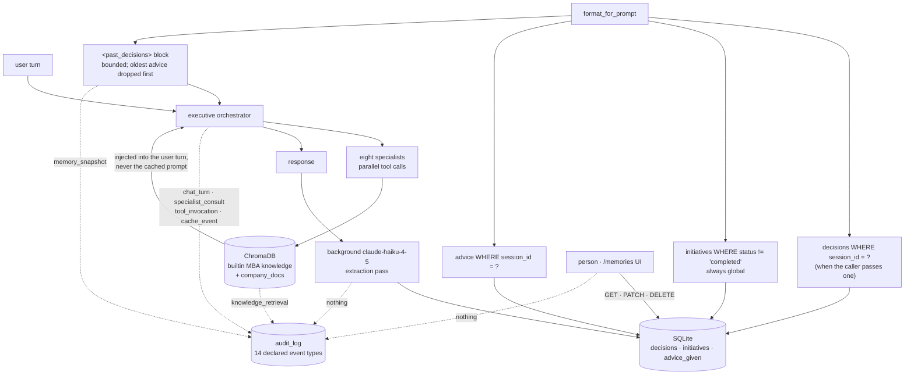

## 1. Executive Summary

OpenExecutive is a virtual executive team: one orchestrator speaking in a single
voice over eight specialists — strategy, finance, people, counsel, operations,
marketing, product, board — from Sente Labs. Apache-2.0, roughly 129,000 lines
of Python and 27,000 of TypeScript, and **12 commits between 11 June and 3 July
2026**, with nothing since. It is a large, coherent system that stopped moving
seven weeks before this reading.

The memory design has three layers and the middle one is what this report is
about. ChromaDB holds built-in MBA knowledge and uploaded company documents in
separate collections, injected into the *user turn* rather than the cached
system prompt. SQLite holds **episodic memory**: after every response a
background `claude-haiku-4-5` pass extracts decisions, initiatives and advice,
and the next session opens with a `<past_decisions>` block. An optional Honcho
deployment adds per-person memory.

Three marks. `session_id` reaches the query that builds the injected block, so
one conversation thread's extracted decisions do not appear in another's. A
person can read back, rewrite and delete anything the extractor wrote, through
an API and a UI built for it. And the tests assert the exclusion on the rendered
prompt rather than on the store beneath it.

The finding worth carrying away is about the audit log, and it is not that one
is missing. There is a good one — a closed fourteen-value event vocabulary, a
redaction layer, a session timeline, and a derived causality graph so the UI can
draw the flow of a turn. Every one of those fourteen events describes something
the system **read**. A memory written by the extractor, edited by a person, or
deleted outright passes through none of them.

## 2. Mental Model

The system separates *what the executive knows* from *what the executive
decided*, and stores them differently.

Knowledge is RAG — two Chroma collections, retrieved per specialist call, never
mutated by the agent. Memory is extraction — a summarizer reads the turn that
just finished and writes rows the next turn will see. The README states the
division plainly: *"After every response, a background `claude-haiku-4-5` pass
extracts key decisions, initiatives, and advice into SQLite. The next session
opens with a `<past_decisions>` block so the Executive remembers what it
recommended last month."*

Nothing writes memory on the critical path. That is a real design choice with a
cost the report returns to in section 7: the write is asynchronous, best-effort,
and unlogged, so a failure to extract is indistinguishable from a turn that
contained nothing worth extracting.

## 3. Architecture



## 4. Essential Implementation Paths

**Building the block.** `format_for_prompt` pulls the newest five decisions,
the active initiatives and two advice rows, renders them as dated lines, and
enforces a character budget by dropping oldest advice first, then oldest
decisions, *"Initiatives are always kept."* The scoping rule is in the same
docstring:

> *"When `session_id` is non-empty, decisions and advice are scoped to that
> session only — used by Discord/Telegram/Slack/email thread handlers so each
> conversation sees its own extracted context rather than a global mix from
> unrelated conversations. Initiatives are always global (company-wide)."*

That is the mark, and it is worth noting what makes it credible: the rationale
names the deployment shape that produces the failure — several chat channels
feeding one executive — rather than asserting isolation in the abstract.

**The query under it** branches rather than composes:

```python
if session_id:
    rows = conn.execute(
        "SELECT * FROM decisions WHERE session_id = ?"
        " ORDER BY timestamp DESC LIMIT ?", (session_id, limit)).fetchall()
else:
    rows = conn.execute(
        "SELECT * FROM decisions ORDER BY timestamp DESC LIMIT ?", (limit,)).fetchall()
```

`session_id` defaults to `""`, so the else-branch is the default and two callers
outside the injection path — a department check-in workflow and the today route
— take it.

**The scheduler** claims due actions with `UPDATE … RETURNING` to prevent
double-firing, and the README states the constraint that follows: *"The API
must run as a single instance; do not horizontally scale it without gating the
scheduler first."* Naming the operational limit of your own concurrency control
is rarer than implementing it.

## 5. Memory Data Model

Three tables carry memory:

- `decisions` — `timestamp`, `domain`, `summary`, `rationale`, `outcome`,
  `tags`, plus `session_id` and `department`.
- `initiatives` — `title`, `status`, `created_at`, `updated_at`, `summary`.
- `advice_given` — `timestamp`, `domain`, `query_summary`, `advice_summary`.

A decision has **no status field**, no confidence, no provenance beyond the
domain that produced it, and one timestamp. There is no way to mark one decision
as superseding another, and no way to record that one turned out wrong — the
`outcome` column is free text written by the same extractor that wrote the
summary.

`initiatives.status` is the only status in the memory tables, and
`get_active_initiatives` reads `WHERE status != 'completed'`. That excludes a
row from the active list, which looks like the withholding the `trust_state`
mark asks for, and is not: *completed* is a task lifecycle state. A completed
initiative is not a claim the system has stopped believing; it is work that
finished. Nothing here can express *this memory may be wrong*.

The richest schema in the tree belongs to `decision_instances`, and it is about
actions rather than memories — section 9 covers it.

## 6. Retrieval Mechanics

Knowledge retrieval is two Chroma collections per specialist call, with the
result injected into the user turn. The README explains the placement as a
caching decision — the persona, company profile and knowledge index are cached
separately, *"No dynamic content ever goes in a cached block"* — which is the
same discipline [Hermes Agent](../hermes-agent/) applies to its frozen memory
block, reached from the opposite direction.

Episodic retrieval is not search. It is a fixed-shape assembly: five decisions,
the active initiatives, two advice rows, newest first, trimmed to a character
budget. There is no ranking, no relevance scoring against the current question,
and no way for the model to ask for more — the block is what it is.

For a system whose pitch is remembering *"what it recommended last month,"* the
absence of relevance is a real bound: a decision from a domain unrelated to the
current question occupies one of five slots on recency alone.

## 7. Write Mechanics

Every memory write is asynchronous. The extraction pass runs after the response
is sent, with `_background_tasks` holding strong references *"so GC cannot
cancel them mid-flight"* — a detail that shows someone hit the failure mode
where a fire-and-forget task vanishes under load.

There is an initiatives consolidation pass that merges duplicates, and an
episodic mirror that best-effort copies a row into a department peer's Honcho
timeline, skipped when the department is empty or `"general"`, with SQL declared
*"the system of record"* and a Honcho failure explicitly unable to affect *"the
episodic INSERT that just committed."* That ordering is correct and stated.

What no write path does is leave a record that it happened. Section 9 is where
that matters.

## 8. Agent Integration

One orchestrator on `claude-sonnet-4-6`, eight specialists with four on
`claude-opus-4-7` with extended thinking, fanned out as parallel tool calls, and
a synthesized single voice — *"The internal agent architecture is never exposed
to the user."* Channel handlers for Discord, Telegram, Slack and email feed the
same core, which is what makes the session scoping load-bearing rather than
decorative.

The memories UI is a first-class surface — `packages/ui/src/app/memories/` with
a `MemorySection`, a `PulseHeader` and a `CadenceSection` — not a debug view.

## 9. Reliability, Safety, and Trust

**The action ledger is the best-built thing here.** `decision_instances`
records every gated action with `proposed_payload_json` beside
`final_payload_json`, so an approval-with-edit is legible as a diff rather than
as a flag; `approver_person_id` and `resolver_person_id` as identities; a
`confidence` float held apart from `status`; and `reversal_reason` and
`severity` for the circuit breaker. The module states the state machine and how
it is held:

> *"Status state-machine (valid transitions only; enforced by compare-and-set):
> proposed → approved_unchanged | approved_with_edit | rejected |
> auto_no_response | failed; executed → reversed | failed; approved_* →
> reversed"*

`auto_no_response` deserves its own note: a proposal that nobody answered is a
distinct outcome from one that was rejected, and most approval systems in this
corpus collapse the two into a timeout.

**The audit log is well-built and points the wrong way.** `openexecutive/audit/`
has a logger, a redaction module, a context module, an `AuditEvent` row with
session and turn ids and an actor, a filterable read API, and a
session-scoped endpoint returning *"the full ordered timeline for one inbound
request plus a derived graph (nodes + edges) so the UI can render a flow-chart
view."* The event vocabulary is closed and declared:

```python
EVENT_TYPES = ("chat_turn", "specialist_consult", "tool_invocation",
               "scheduled_action", "alert", "integration_inbound",
               "auth_login", "auth_logout", "knowledge_retrieval",
               "cache_event", "memory_snapshot", "committee_review", "peer_memory")
```

Two of those name memory, and both are reads. `memory_snapshot` is *"episodic
context + company profile at turn entry"* — what the model was shown.
`peer_memory` is *"Honcho per-person memory — prefetch + sync_turn outcomes"*.
There is no `memory_write`, no `decision_extracted`, no `memory_edited` and no
`memory_deleted`, the episodic module emits no audit event, and the
`/memories/*` PATCH and DELETE routes emit nothing.

So the log can answer *what did the executive know when it said that* and cannot
answer *where did this memory come from, who changed it, or who deleted it*.
This atlas's `audit_log` definition excludes exactly this case — *"Logs of
retrieval or feedback are the other half of the pattern and do not count here"*
— and OpenExecutive is the cleanest illustration of why the exclusion exists,
because everything else about the implementation is right. The vocabulary is
closed, so adding the write side is a declared-constant change plus emit calls
in four places.

**A gap on the same axis.** `department` is stored on every decision row, is
documented as *"Department slug owning this decision,"* is written through the
mirror path, and is used as a filter by nothing in retrieval. A second scope key
that never reaches a query.

## 10. Tests, Evals, and Benchmarks

222 test files, 51,923 lines, against a 129,000-line Python tree. Nothing was
run for this review — the screen found three auto-run surfaces, including a VS
Code tasks file worth checking for `runOptions.runOn: folderOpen`, and a
`conftest.py` that executes on collection.

The memory tests are the reason for the `negative_eval` mark, and the best of
them asserts on the artifact that reaches the model rather than on the query:

```python
prompt = format_for_prompt(db_path=db, session_id="discord:thread:A")
assert "Thread A decision" in prompt
assert "Thread A advice body" in prompt
assert "Thread B decision" not in prompt          # excluded
assert "Company-wide initiative" in prompt        # always included
```

Three positives and a negative over one store. Below it,
`test_get_recent_decisions_scoped_excludes_other_sessions` asserts a scoped read
returns one of three rows, and `test_get_recent_decisions_global_returns_all`
asserts the unscoped read returns everything — the pair pins the filter *and*
its default absence, which a single test would not.

`test_sessions_list_unknown_email_returns_empty_not_principal` is the same
discipline on the session list, and names the failure it guards: an unrostered
email gets `[]`, *"not the principal's chats."*

`evals/` holds a `run_evals.py` and a `judges/` directory — an LLM-judge harness
over the executive's answers. It measures advice quality, not memory: no case
asserts that a decision was recalled, that a stale one was not, or that the
extraction pass produced the right row. The empirical question this design most
needs answered — whether five recency-ranked decisions are the right five — has
no committed measurement.

## 11. For Your Own Build

**Assert your scoping on the rendered prompt, not on the query.** The test
above would still pass if the query were right and the renderer dropped the
filter; a test one layer down would not catch that. The artifact the model
receives is the thing whose contents you actually care about.

**Give your audit log a write side, and check that before you build the
causality graph.** A read-side audit answers what the model saw, which is the
question you have while debugging, and never answers where a memory came from,
which is the question you have after it turns out to be wrong. The second is
the one a user will ask.

**Distinguish "nobody answered" from "rejected."** `auto_no_response` as its
own terminal status costs one enum value and separates a reviewer who declined
from a reviewer who was on holiday — a distinction any reliability aggregate
computed over the ledger needs.

**Do not let a stored key stay unread.** `department` and, in most of the
callers, `session_id` are both written and both ignorable. A scope column that
no query uses reads as isolation to everyone who greps the schema.

## 12. Open Questions

**Is the project still moving?** Twelve commits, the last on 3 July 2026, seven
weeks before this reading, on a system this size. The pin is what it is; whether
the design continues is not something the tree answers.

**What does the Honcho deployment change?** `honcho_client.py` is 1,438 lines,
there is a `fly.honcho.toml` and a `docker/honcho/` with its own embedding
server, and per-person memory sits outside the SQLite tables this report traced.
Whether it carries state, scope or audit the local store does not was not
established.

**Does the promotion evaluator ship?** `decision_class_state` holds a `mode`, a
`last_eval_json` and a `breaker_tripped_at`, and `decision_ledger` refers to a
promotion evaluator as *"(Build 3)"*. Whether the automatic promotion from
propose-mode to auto-execute is wired at this pin, and what it reads, was not
traced.

## Appendix: File Index

| Path | What it holds |
| --- | --- |
| `packages/core/openexecutive/memory/episodic.py` | The three memory tables, the scoped queries and `format_for_prompt` |
| `packages/core/openexecutive/memory/decision_ledger.py` | The eight-state action ledger and its compare-and-set transitions |
| `packages/core/openexecutive/memory/initiatives_consolidation.py` | Duplicate-initiative merging |
| `packages/core/openexecutive/memory/honcho_client.py` | The optional per-person memory client, not traced here |
| `packages/core/openexecutive/audit/logger.py` | `EVENT_TYPES`, and the absence of a write-side event |
| `packages/core/openexecutive/api/routes/episodic.py` | GET, PATCH and DELETE over every memory type |
| `packages/core/openexecutive/api/routes/audit.py` | The filterable read API and the session causality graph |
| `packages/ui/src/app/memories/page.tsx` | The human surface over extracted memory |
| `packages/core/tests/unit/test_episodic.py` | The scoping tests, including the one on the rendered prompt |

## History

**2026-08-26** — [`4e95559464331fc4a82ef7a0945d59e35af66120`](https://github.com/SenteLabsAI/OpenExecutive/commit/4e95559464331fc4a82ef7a0945d59e35af66120) — first reading, roughly 129,000 lines of Python and 27,000 of TypeScript, 12 commits between 11 June and 3 July 2026, Apache-2.0. Screened before anything was read: three auto-run surfaces, two build-time execution surfaces, one unpinned surface, and lockfiles unchanged for 56 and 75 days; `CLAUDE.md` at the root is addressed to a reading agent and was treated as data. Nothing was installed and nothing was run. Three marks. `scope_enforced` rests on `session_id` reaching the decision and advice queries from `format_for_prompt`, with the channel-handler rationale stated in the docstring; the report records that the default is unscoped, that two other callers read without it, and that the stored `department` column filters nothing. `human_review` rests on GET, PATCH and DELETE over decisions, initiatives and advice with a UI built for them, alongside the `decision_instances` approval record carrying proposed and final payloads and both approver and resolver identities. `negative_eval` rests on `test_format_for_prompt_scopes_decisions_and_advice_keeps_initiatives`, which asserts the exclusion on the rendered injection block. `audit_log` is withheld although a full audit subsystem exists: all fourteen declared event types describe reads, `memory_snapshot` and `peer_memory` included, the episodic module emits nothing, and the memory PATCH and DELETE routes emit nothing — the retrieval-only case the mark's definition excludes by name. `trust_state` is absent because a decision row carries no status and `initiatives.status != 'completed'` is task lifecycle rather than epistemic. `bitemporal` and `tombstone` are absent. The reading covers the SQLite episodic layer, the audit subsystem, the API routes and the tests; the Honcho client, the Chroma retrieval layer and the promotion evaluator were not traced.
