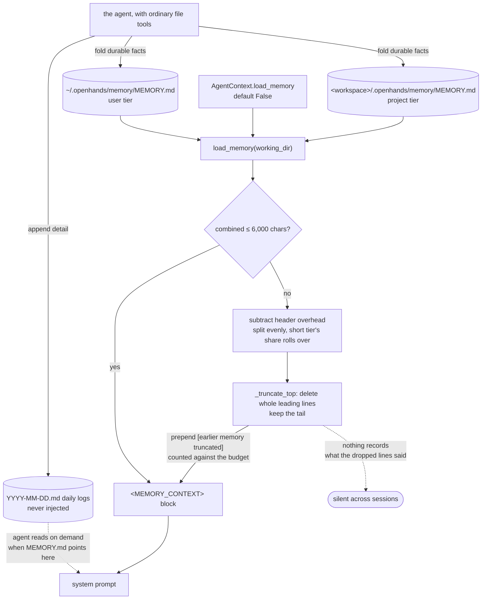

## 1. Executive Summary

This is the package OpenHands V1 actually runs on, and the organisation's layout
is the shortest proof: `OpenHands/OpenHands` is Agent Canvas, a control centre
that renders somebody else's condenser settings; `OpenHands/legacy`, archived
27 July 2026, holds what used to be there and has no memory package left in it;
`OpenHands/enterprise` carries the server layer and declares
`openhands-sdk==1.43.1`, `openhands-agent-server==1.43.1` and
`openhands-tools==1.43.1` as dependencies. 140,853 lines of Python outside
`tests/`, MIT, 2,244 commits since 23 August 2025.

**The durable memory is 97 lines.** `context/memory.py` reads two markdown
indexes — `~/.openhands/memory/MEMORY.md` for the user and
`<workspace>/.openhands/memory/MEMORY.md` for the project — concatenates them
under a 6,000-character budget, and hands the result to the system prompt. The
agent maintains both files with ordinary file tools; no code in this repository
creates, parses or validates one. It arrived on 22 July 2026 under *"feat: add
opt-in persistent memory across sessions"*, and `AgentContext.load_memory`
defaults to `False`.

One mark, and it is the weak form of `scope_enforced`.

**Most of what looks like memory here is not.** The `View`, the four view
properties and the condenser pipeline are several thousand lines of careful
work deciding which events reach the model *within a run*. By this atlas's
[scope test](../../compare/#not-in-scope-conversation-window-management) —
whether the store holds anything that could turn out to be false — that is
context engineering, not memory: an event cannot be wrong, it happened.
Section 9a describes it because it is the best-engineered thing in the tree and
because a reader comparing frameworks will be shown it as a memory feature.

## 2. Mental Model

The memory is an index with pointers, and the interesting decision is what
happens when the index outgrows its budget.

Each tier holds a `MEMORY.md` the agent curates and dated `YYYY-MM-DD.md` daily
logs it does not. Only the indexes are injected. The daily logs are *"never
injected automatically; read them on demand when `MEMORY.md` points to them"* —
so the index is a routing table over detail the agent can fetch, and the budget
applies only to the routing table.

When the two indexes together exceed 6,000 characters, `load_memory` does not
drop a tier and does not cut mid-line. It subtracts the header overhead, splits
the remainder evenly between the tiers with *"a short tier's unused share
rolling over to the other"*, and then deletes whole leading lines from each body
until it fits — keeping the tail, because the maintenance instructions tell the
agent to append.



## 3. Architecture

Nothing to stand up. Two directories of markdown, read at the start of a
session. `LocalConversation` resolves the path lazily on the first
`send_message()` / `run()` because the workspace is not known when
`AgentContext` validates, and stores the text in `memory_context`, which is
`exclude=True` on serialization — *"re-resolved from disk each session and must
not bloat persisted conversation state."* That is the right call: a saved
conversation cannot restore a stale copy of the index.

## 4. Essential Implementation Paths

The whole in-scope path is `load_memory` and the two functions under it.

`_read_index` returns `None` for a missing file, logs and returns `None` for an
unreadable one, and returns `None` for an empty one — so an unreadable index and
an absent index are indistinguishable downstream, which is the one place this
function is quieter than it should be.

`_truncate_top` deletes whole leading lines until the body plus an
`[earlier memory truncated]` notice fits the budget. Three decisions in it are
better than the average of this corpus. Truncation is **from the top**, keeping
the tail, matching an append-oriented maintenance instruction. **Partial lines
never survive**, so the model never reads half a fact. And the notice is
**charged to the budget** rather than being free, which is a one-line decision
that keeps the prompt honest: a silently shortened index reads to the model as
a complete one.

The budget arithmetic is fair-share with rollover, and the docstring states the
floor rather than leaving it to be discovered: *"`char_budget` is honored
whenever it covers the headers plus one notice per tier (~150 chars for both
tiers)."*

## 5. Memory Data Model

There is none. `MEMORY.md` is markdown. No status, no confidence, no timestamp,
no provenance, no id, no scope key inside a file — the tier *is* the scope, and
it is a directory.

That is the report's main criticism and it should be read against what sits
beside it. The same repository defends its context window with four formal
properties, an intersection lattice, a repair path per property and 2,960 lines
of tests. The part that actually outlives a session is a text file with a
character cap and no writer in code.

## 6. Retrieval Mechanics

No index, no query, no ranking. Both indexes are injected whole; the agent does
the second hop to a daily log with a file read. For one agent in one workspace
that is coherent, and it does not generalise past it.

## 7. Write Mechanics

No write path in code. The agent appends to today's daily log and folds durable
facts into `MEMORY.md`, under prompt guidance that is unusually specific about
the distinction worth drawing:

> Record what was expensive to learn: root causes, environment quirks, user
> preferences, decisions and their reasons.

with a matching negative — do not record secrets, and do not record *"facts that
are trivially re-discoverable (directory listings, obvious commands)"* — and a
separation most projects conflate: *"`AGENTS.md` remains the place for
instructions addressed to any agent working in this repository; memory is for
what you learned yourself."*

Nothing enforces any of it. The guidance is good and it is advice to a model.

## 8. Agent Integration

`AgentContext.load_memory` is the switch and it **defaults to `False`**. It is
marked `SettingProminence.MAJOR` with the label "Persistent memory", so it
surfaces in a client's settings UI — Agent Canvas has a page for it — and it
was exposed in the agent-settings schema three weeks after the loader landed.
With the flag off, the memory guidance in the system prompt is an older variant
pointing at `AGENTS.md` instead.

## 9. Reliability, Safety, and Trust

The scope boundary is honest but thin. `load_memory(working_dir)` reads the
project tier from the path the conversation supplies, so one workspace's project
memory does not reach another. There is no canonicalization and no containment
check, so this is the mark's weaker form: the key reaches the read, and a caller
passing a different `working_dir` reads that workspace's memory.

Three absences matter more. **No code writes or validates a memory file**, so
the guidance about secrets is advice to a model, and a credential written into
`MEMORY.md` is injected into every subsequent session's prompt. **Nothing
records what truncation dropped** — the notice says that something was cut and
nothing says what, so an index that loses its oldest lines each session degrades
silently, and the daily logs it points at are not consulted to recover it.
**Nothing can be marked wrong**: there is no status, no supersession and no
tombstone, so a fact the agent later disproves competes with its correction on
nothing but position in a file.

## 9a. The context machinery, which is not the memory

Most of the engineering effort in this tree goes into deciding which events
reach the model within a run, and it is genuinely good work. It earns no
capability mark here, because an event is a record of something that happened
and cannot turn out to be false — the test this atlas uses to separate memory
from [context engineering](../../compare/#not-in-scope-conversation-window-management).
It is described because a reader comparing frameworks will be shown it as a
memory feature, and because the central idea transfers.

**A condenser does not choose where to cut.** `View.manipulation_indices` starts
from `ManipulationIndices.complete(self.events)` and intersects it with the
index set each of four properties admits — `ObservationUniquenessProperty`,
`BatchAtomicityProperty`, `ToolCallMatchingProperty`, `ToolLoopAtomicityProperty`,
all four listed in `ALL_PROPERTIES`. An index survives only if every property
admits it, so adding a fifth property can only tighten the set, which is the
correct direction for a safety rule. The summarizing condenser then computes the
window it wants from the token budget and snaps both ends to legal positions:

```python
forgetting_start = view.manipulation_indices.find_next(self.keep_first)
forgetting_end = view.manipulation_indices.find_next(naive_end)
forgotten_events = view[forgetting_start:forgetting_end]
```

**Each property carries a repair as well as a rule.** `ViewPropertyBase`
requires both `manipulation_indices` and an `enforce` returning the ids to
remove from a view that has already broken the property, and the base class says
which of the two is load-bearing — indices are the mechanism and *"properties
should hold inductively"*, while enforcement *"is intended as a fallback
mechanism to handle edge cases, bad data, or unforeseen situations"* and
therefore needs every event in the conversation rather than the current view.

**Tool-call matching states its reason.** It requires exactly one observation per
action `tool_call_id`, because *"some providers (for example Anthropic tool use)
require every `tool_use` to have one corresponding `tool_result` in the
immediately following user message"*, and its `enforce` removes whichever side
is unpaired, in both directions.

**A drop is an appended event, not a deletion.** `Condensation` carries
`forgotten_event_ids`, an optional summary and offset, and the `llm_response_id`
of the completion that decided the drop; `EventLog`'s only mutator is `append`,
which rejects a duplicate id and an event whose declared parent is missing, and
the class has no delete, truncate or `__setitem__`. The forgotten events leave
the view and stay on disk. That makes *what did the agent stop being able to see,
and when* answerable — a good property, and a property of a transcript rather
than of a memory store, which is why it is here and not in the frontmatter.

## 10. Tests, Evals, and Benchmarks

687 test files and 220,761 lines against 140,853 lines of implementation, which
is more test than product and rare at this size. Nothing was run for this review.

The distribution is the finding. The view machinery has 2,960 lines across ten
files, one per property plus the manipulation-index lattice, including a case
that forgets one event at a time and asserts both that the length dropped by
exactly one and that the forgotten id is absent — a non-vacuous negative
assertion, over a context window rather than over a recall.

`tests/sdk/context/test_memory.py` is what covers the durable half. No committed
case asserts that particular material must not be retrieved from memory, so
`negative_eval` is withheld; nothing records mutations of a memory file, so
`audit_log` is withheld. `tests/integration/tests/` runs five condenser cases —
`c01_thinking_block_condenser` through `c05_size_condenser` — against real
behaviour.

No paper is cited in the repository, and no benchmark result is committed for
either half.

## 11. For Your Own Build

**Charge the truncation notice to the budget.** A silently shortened memory index
reads to the model as a complete one. `[earlier memory truncated]` costing
characters is the cheapest honesty in this corpus.

**Truncate in the direction your instructions imply.** Telling the agent to
append and then trimming the tail would delete exactly what it just learned.
Keeping the tail costs one function and makes the guidance coherent.

**Split an index from its detail, and inject only the index.** A routing table
under a budget with dated logs behind it is a working answer to "the memory does
not fit" that does not require a retriever.

**Then go further than this does.** Record what truncation dropped, give a
memory line an id so it can be corrected, and put *something* in code between
the model and the file it is trusted to maintain.

**Separate "where may I cut" from "how much must I cut."** From section 9a, and
the one idea here worth stealing for a context window: compute the legal
positions first, snap the budget's window to them, and intersect the constraints
so a new rule can only tighten.

## 12. Open Questions

**What did truncation drop?** The notice says that something was cut and nothing
says what. This is the durable half of the system quietly degrading.

**Is `load_memory` on anywhere by default?** It is `False` in the SDK. Whether
the agent platform or Agent Canvas turns it on for real users decides whether
this is a shipped memory system or an available one, and neither was established
here.

**Does anything ever read a daily log?** The prompt tells the agent to write them
and to read them when the index points there. No code touches them, and nothing
committed measures whether the pointer is followed.

## Appendix: File Index

| Path | What it holds |
| --- | --- |
| `openhands-sdk/openhands/sdk/context/memory.py` | The whole durable memory: two tiers, the budget, the truncation |
| `openhands-sdk/openhands/sdk/context/agent_context.py` | `load_memory`, `memory_context` |
| `openhands-sdk/openhands/sdk/conversation/impl/local_conversation.py` | The lazy resolution against the workspace path |
| `openhands-sdk/openhands/sdk/context/prompts/sections/static.py` | The maintenance guidance the agent is given |
| `tests/sdk/context/test_memory.py` | The durable half's tests |
| `openhands-sdk/openhands/sdk/context/view/` | Section 9a: `View`, the four properties, the index lattice |
| `openhands-sdk/openhands/sdk/context/condenser/` | Section 9a: the budget and the snap to legal indices |
| `openhands-sdk/openhands/sdk/event/condenser.py`, `conversation/event_store.py` | Section 9a: `Condensation`, and `append` as the only mutator |

## History

**2026-08-29** — [`9a24f6c8866f353042a57df0514ccc900e3a0691`](https://github.com/OpenHands/software-agent-sdk/commit/9a24f6c8866f353042a57df0514ccc900e3a0691) — same commit, correcting the first reading, which got the scope boundary wrong in the direction that flatters a system. It led on the `View` and condenser machinery and awarded two marks to it: `audit_log` for the `Condensation` event appended to `EventLog`, and `negative_eval` for a test asserting a forgotten id is absent from the view. Both describe the set of events reaching the model within a run. An event cannot turn out to be false, so by the test this atlas uses — whether the store holds anything that could be wrong — that machinery is context engineering and not memory, and neither mark should have been awarded for it. Both are withdrawn; the marks go from three to one. `scope_enforced` stands, because it rests on `load_memory(working_dir)` and the persistent tier.

The report is rebuilt around what does survive a session: the two-tier `MEMORY.md`, its 6,000-character budget, the fair-share split, top-first truncation and the notice charged against the budget. The context machinery is kept in section 9a, labelled, because it is the best-engineered thing in the tree and a reader comparing frameworks will be offered it as a memory feature.

**2026-08-28** — [`9a24f6c8866f353042a57df0514ccc900e3a0691`](https://github.com/OpenHands/software-agent-sdk/commit/9a24f6c8866f353042a57df0514ccc900e3a0691) — first reading, MIT, 2,244 commits since 23 August 2025, 140,853 lines of Python outside `tests/` and 220,761 inside. Reached from `OpenHands/OpenHands`, which is Agent Canvas and holds a settings page, a mutation hook and a typed `CondensationEvent` describing this SDK's condenser rather than implementing one. Repository provenance was checked against the organisation rather than inferred from the one clone: `agent-canvas` and `legacy` are both archived as of 27 July 2026, neither `legacy/openhands` nor `enterprise/openhands` contains a memory package, `OpenHands-Cloud` is deployment manifests, and `enterprise` pins the three `openhands-*` distributions published from this tree. `context/memory.py` and the view properties were confirmed present in `git ls-tree` at the pinned sha, not only in the working tree. Screened before reading: no auto-run surface, fourteen build-time execution surfaces, four unpinned surfaces and six files inside the seven-day cooldown; `AGENTS.md` is addressed to a reading agent and was treated as data. Nothing was installed and nothing was run.
