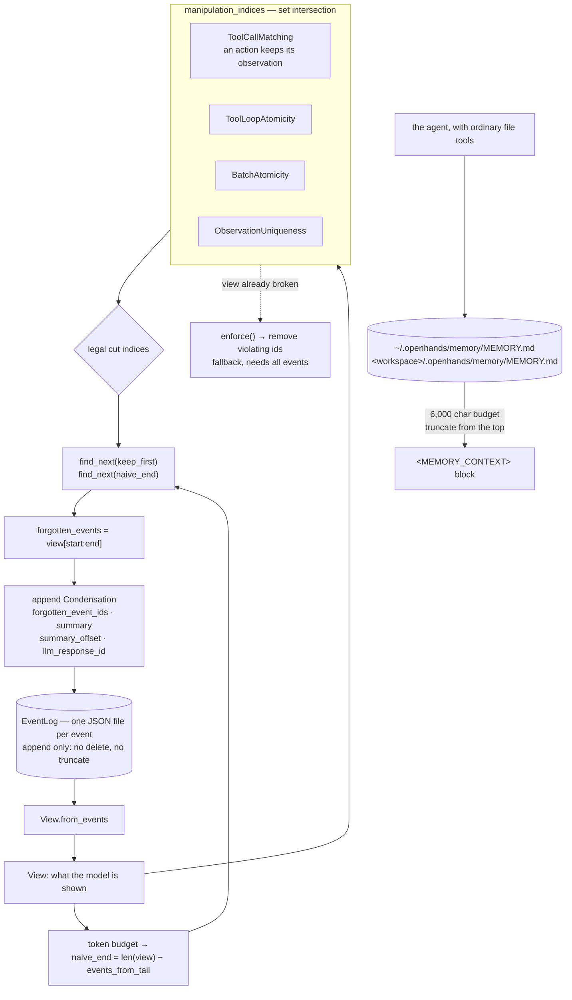

## 1. Executive Summary

This is where the OpenHands agent's memory lives, and the organisation's own
layout is the shortest proof. `OpenHands/OpenHands` is Agent Canvas, a control
centre that renders somebody else's condenser settings; `OpenHands/legacy`,
archived 27 July 2026, holds what used to be there and has no memory package
left in it; `OpenHands/enterprise` carries the server layer and declares
`openhands-sdk==1.43.1`, `openhands-agent-server==1.43.1` and
`openhands-tools==1.43.1` as dependencies. This is the package they all depend
on — 140,853 lines of Python outside `tests/`, MIT, 2,244 commits since
23 August 2025, across four packages (`openhands-sdk`, `openhands-tools`,
`openhands-agent-server`, `openhands-workspace`).

The persistent tier is recent and is being worked on: `context/memory.py`
arrived on 22 July 2026 under *"feat: add opt-in persistent memory across
sessions"*, and `load_memory` was exposed in the agent-settings schema three
weeks after that.

Two mechanisms, and they answer different questions.

**Within a session, the problem is that compaction damages structure.** A
tool call separated from its result is not a shorter history, it is a broken
one, and some providers reject it outright. The SDK's answer is that a
condenser does not choose where to cut. It computes the window it *wants* from
the token budget, and then snaps both ends to the nearest index that four
independent structural properties agree is legal.

**Across sessions, the problem is the ordinary one**, and the answer is the
ordinary one: two tiers of agent-maintained markdown, user and project, loaded
into the prompt under a character budget. It is off by default.

Three marks. The interesting one is `audit_log`, and it is interesting because
the log and the store are the same object.

## 2. Mental Model

Nothing is ever deleted. That is the whole design, and everything else follows.

The conversation is an append-only log of events. What the model sees is not
the log but a **`View`** — a projection of it. When context runs short, a
condenser does not remove events; it appends a `Condensation` event carrying
the set of ids to be forgotten, and the next `View.from_events` builds a
projection with those events absent. The events are still on disk. What
changed is what the model is shown.

So "forgetting" here is a fact recorded in the same store as the thing
forgotten, and it names its own cause: `Condensation` carries the
`llm_response_id` of the completion that decided the drop.

The second half is the constraint on where a drop may begin and end.



## 3. Architecture

One process, no services, no database. The event log is a directory of JSON
files with a `.eventlog.lock` beside it, and the class documents the limit of
that choice rather than leaving it to be discovered: *"For LocalFileStore, file
locking via flock() does NOT work reliably on NFS mounts or network
filesystems."*

The persistent memory is two directories of markdown. There is nothing to stand
up, and nothing to migrate.

## 4. Essential Implementation Paths

**A property is two things, and the split is the good idea.**
`ViewPropertyBase` requires both `manipulation_indices` — where the view may be
modified while keeping the property — and `enforce`, which returns the ids to
remove from a view that has already broken it. The docstring is explicit about
which is load-bearing: manipulation indices are the mechanism, *"properties
should hold inductively"*, and *"enforcement is intended as a fallback
mechanism to handle edge cases, bad data, or unforeseen situations."* The two
have different information needs, and the class says why — enforcement
*"assumes the view is in a bad state"* and therefore takes all events in the
conversation, while manipulation indices are computable from the current view
alone.

**The legal set is an intersection.** `View.manipulation_indices` starts from
`ManipulationIndices.complete(self.events)` and does `results &= property.
manipulation_indices(self.events)` over `ALL_PROPERTIES`. An index survives
only if every property admits it. Adding a fifth property therefore cannot
loosen the constraint, which is the correct direction for a safety rule.

**The budget never gets the last word.** In
`llm_summarizing_condenser.py`, the token math produces `naive_end`, and then:

```python
forgetting_start = view.manipulation_indices.find_next(self.keep_first)
forgetting_end = view.manipulation_indices.find_next(naive_end)
forgotten_events = view[forgetting_start:forgetting_end]
```

`find_next` snaps to the smallest legal index at or after the requested one, so
a window the budget wanted is widened to the next safe boundary rather than cut
where it fell. The comments name the two lines *"boundary-aware indices"*.

**Tool-call matching is the property with a stated provider reason.**
`ToolCallMatchingProperty` requires exactly one observation per action
`tool_call_id`, because *"some providers (for example Anthropic tool use)
require every `tool_use` to have one corresponding `tool_result` in the
immediately following user message, so duplicate observation-like events are
not safe to silently tolerate."* Its `enforce` collects the action and
observation id sets and removes whichever side is unpaired — in both
directions.

**The persistent tier is a loader, not a store.** `load_memory` reads at most
two files, labels each with a tier header, and returns one string. When the
combined text exceeds `MEMORY_CHAR_BUDGET` (6,000), the header overhead is
subtracted, the remainder is split evenly between tiers, and *"a short tier's
unused share rolling over to the other"*. Each tier is then truncated
line-wise from the top by `_truncate_top`, which keeps deleting whole leading
lines until the body plus an `[earlier memory truncated]` notice fits.

Three decisions in that function are better than the average of this corpus.
Truncation is **from the top**, keeping the tail, because the maintenance
instructions tell the agent to append. Partial lines never survive. And the
truncation is **visible to the model** — the notice counts against the budget
rather than being free, so the agent can see that it is reading a
prefix-deleted index rather than a complete one.

## 5. Memory Data Model

There are two units and they share nothing.

An `Event` is a pydantic model with an id, a parent id, a source, and a kind;
`Condensation` adds `forgotten_event_ids`, `summary`, `summary_offset` and
`llm_response_id`. That is a record type with a real schema, and the one field
that matters most for this atlas — what was dropped — is a set of ids rather
than a count.

The persistent tier has no schema at all. `MEMORY.md` is markdown the agent
writes; nothing parses it, nothing validates it, and the only code that touches
it reads it and truncates it. There is no status, no confidence, no timestamp,
no provenance and no scope key inside a file — the tier *is* the scope, and it
is a directory.

That asymmetry is the report's main criticism and it is worth stating plainly:
the within-session structure is defended by four properties and a test suite,
and the across-session memory — the part that actually outlives anything — is a
text file with a character cap.

## 6. Retrieval Mechanics

None, in the search sense. `MEMORY.md` is injected whole into a
`<MEMORY_CONTEXT>` block, and daily logs are *"never injected automatically;
read them on demand when `MEMORY.md` points to them"* — an index-and-pointer
arrangement where the agent does the second hop with a file read. For a
single-agent workspace that is a defensible answer and it does not scale past
one.

The event log has `__getitem__` by index and by id, and no query.

## 7. Write Mechanics

`EventLog.append` is the only mutator on the store. It takes a lock, re-syncs
from disk in case another process wrote while it waited, rejects an event whose
id already exists, rejects an event whose declared parent does not, writes one
JSON file, and updates three in-memory indices. There is no `delete`, no
`truncate` and no `__setitem__` on the class.

Persistent memory has no write path in code. The agent appends to today's daily
log and folds durable facts into `MEMORY.md` with ordinary file tools, under
prompt guidance that is unusually specific about the distinction worth drawing:

> Record what was expensive to learn: root causes, environment quirks, user
> preferences, decisions and their reasons.

with a matching negative — do not record secrets, and do not record *"facts
that are trivially re-discoverable (directory listings, obvious commands)"* —
and a separation of concerns most projects conflate: *"`AGENTS.md` remains the
place for instructions addressed to any agent working in this repository;
memory is for what you learned yourself."*

Nothing enforces any of it.

## 8. Agent Integration

`AgentContext.load_memory` is the switch and it **defaults to `False`**. It is
marked `SettingProminence.MAJOR` with the label "Persistent memory", so it
surfaces in a client's settings UI, and `LocalConversation` resolves it lazily
on the first `send_message()` / `run()` because the workspace path is not known
when `AgentContext` validates. The resolved text lands in `memory_context`,
which is `exclude=True` on serialization — *"re-resolved from disk each session
and must not bloat persisted conversation state"*, which is the right call and
means a stale copy cannot be restored from a saved conversation.

With the flag off, the memory guidance in the system prompt is the older
variant pointing at `AGENTS.md` instead.

## 9. Reliability, Safety, and Trust

The append-only log is the strongest property here. A condensation cannot lose
data, only hide it; a bug in a condenser costs context, not history; and the
`Condensation` event lets an operator reconstruct exactly what the model stopped
seeing and which completion decided it. Very few systems in this corpus can
answer *what did the agent stop being able to see, and when* — this one answers
it from its primary store without a separate audit table.

Against that, three things are missing and one is a hazard.

`load_memory` defaults off, so the durable memory is a feature an integrator
opts into rather than the system's behaviour. No code writes or validates a
memory file, so the guidance about secrets is advice to a model, and a
credential written into `MEMORY.md` is injected into every subsequent session's
prompt. And the character budget silently loses the *oldest* lines of an index
across sessions — the notice tells the model that truncation happened, and
nothing anywhere records what was in the lines that went.

The scope boundary is honest but thin. `load_memory(working_dir)` reads the
project tier from the path the conversation supplies, so one workspace's
project memory does not reach another. There is no canonicalization and no
containment check, so this is the mark's weaker form: the key reaches the read,
and a caller passing a different `working_dir` reads that workspace's memory.

## 10. Tests, Evals, and Benchmarks

687 test files and 220,761 lines against 140,853 lines of implementation, which
is more test than product and rare at this size. Nothing was run for this
review.

The view suite is 2,960 lines across ten files, one per property plus the
manipulation-index machinery, and `test_view.py` holds the case that earns
`negative_eval`:

```python
for forgotten_event_id in message_event_ids:
    events = [*message_events, Condensation(
        forgotten_event_ids={forgotten_event_id},
        llm_response_id="condensation_response_1")]
    view = View.from_events(events)
    assert len(view.events) == len(message_events) - 1
    assert forgotten_event_id not in [event.id for event in view.events]
```

Two properties make it non-vacuous. It forgets **one** event and asserts the
length dropped by exactly one, so the negative assertion cannot pass against a
view that returned nothing — and the fixture comment says that is the reason
for the design: *"in this test we only want to forget one of the events. That
way we can check that the rest of the events are preserved."* And it runs the
whole thing once per event id, so a condensation that only worked at the ends
would fail in the middle.

Beside it, `tests/integration/tests/` runs `c01_thinking_block_condenser`,
`c02_hard_context_reset`, `c03_delayed_condensation`, `c04_token_condenser` and
`c05_size_condenser` as integration cases against real behaviour.

No paper is cited in the repository, and no benchmark result is committed for
the memory subsystem.

## 11. For Your Own Build

**Separate "where may I cut" from "how much must I cut."** The budget is a
number and the boundary is a structural fact, and letting the first choose the
second is where compaction damage comes from. Computing legal indices first and
snapping the budget's window to them costs almost nothing and makes a whole
class of bug unrepresentable.

**Intersect the constraints, so a new rule can only tighten.**
`results &= property.manipulation_indices(events)` means adding a property
cannot accidentally permit a cut that was previously forbidden.

**Give every property a repair as well as a rule.** The prevent/repair split —
manipulation indices for the normal path, `enforce` for a view that is already
broken — is what lets the rules hold inductively while still surviving bad
data, and the base class is worth reading for the way it states which of the two
is the real mechanism.

**Make a forgetting an event, not a deletion.** Recording the dropped ids and
the completion that chose them, in the same append-only store as the events
themselves, gives you the audit for free and makes every compaction reversible
in principle.

**Charge the truncation notice to the budget.** A silently shortened memory
index reads to the model as a complete one. `[earlier memory truncated]`
costing characters is a one-line decision that keeps the prompt honest.

## 12. Open Questions

**What did truncation drop?** The notice says that something was cut and
nothing says what. An index that loses its oldest lines every session, with no
record, is the durable half of this system quietly degrading — and the daily
logs it points at are not consulted to recover it.

**Is `load_memory` on anywhere by default?** It is `False` in the SDK. Whether
the agent platform or Agent Canvas turns it on for real users was not
established here, and it decides whether this is a shipped memory system or an
available one.

**Are the four properties sufficient?** They are necessary — each names a
concrete way a view breaks — and nothing in the tree argues that a view
satisfying all four is safe to serialize for every provider.

## Appendix: File Index

| Path | What it holds |
| --- | --- |
| `openhands-sdk/openhands/sdk/context/view/view.py` | `View`, and the intersection in `manipulation_indices` |
| `openhands-sdk/openhands/sdk/context/view/properties/base.py` | The prevent/repair contract |
| `.../properties/tool_call_matching.py`, `tool_loop_atomicity.py`, `batch_atomicity.py`, `observation_uniqueness.py` | The four properties |
| `openhands-sdk/openhands/sdk/context/condenser/llm_summarizing_condenser.py` | The budget, and the snap to legal indices |
| `openhands-sdk/openhands/sdk/event/condenser.py` | `Condensation`, `forgotten_event_ids`, `llm_response_id` |
| `openhands-sdk/openhands/sdk/conversation/event_store.py` | `EventLog.append`, the only mutator |
| `openhands-sdk/openhands/sdk/context/memory.py` | The two-tier loader, the budget and the truncation |
| `openhands-sdk/openhands/sdk/context/prompts/sections/static.py` | The maintenance guidance the agent is given |
| `tests/sdk/context/view/` | 2,960 lines, one file per property |

## History

**2026-08-28** — [`9a24f6c8866f353042a57df0514ccc900e3a0691`](https://github.com/OpenHands/software-agent-sdk/commit/9a24f6c8866f353042a57df0514ccc900e3a0691) — first reading, MIT, 2,244 commits since 23 August 2025, 140,853 lines of Python outside `tests/` and 220,761 inside. Reached from `OpenHands/OpenHands`, which is Agent Canvas and holds a settings page, a mutation hook and a typed `CondensationEvent` describing this SDK's condenser rather than implementing one. Screened before reading: no auto-run surface, fourteen build-time execution surfaces, four unpinned surfaces and six files inside the seven-day cooldown; `AGENTS.md` is addressed to a reading agent and was treated as data. Nothing was installed and nothing was run. Three marks. `audit_log` rests on `Condensation` being appended to an `EventLog` whose only mutator is `append` — the forgotten events stay on disk and leave the view. `negative_eval` rests on a per-event loop asserting the forgotten id is absent while the length drops by exactly one. `scope_enforced` is the weak form: `working_dir` reaches the project-tier read with no canonicalization or containment check. `tombstone`, `trust_state`, `bitemporal` and `human_review` are absent — a memory file has no fields at all, and nothing reviews one. The reading covers the context package, the event store, the condenser and their tests; `openhands-agent-server`, `openhands-tools` and the workspace package were not traced. Repository provenance was checked against the organisation rather than inferred from the one clone: `agent-canvas` and `legacy` are both archived as of 27 July 2026, neither `legacy/openhands` nor `enterprise/openhands` contains a memory package, `OpenHands-Cloud` is deployment manifests, and `enterprise` pins the three `openhands-*` distributions published from this tree. `context/memory.py` and the view properties were confirmed present in `git ls-tree` at the pinned sha, not only in the working tree.
