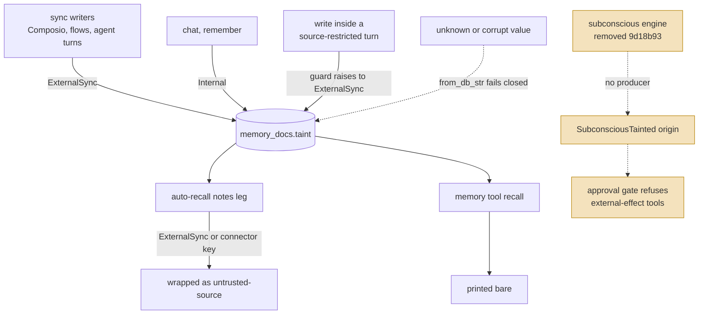
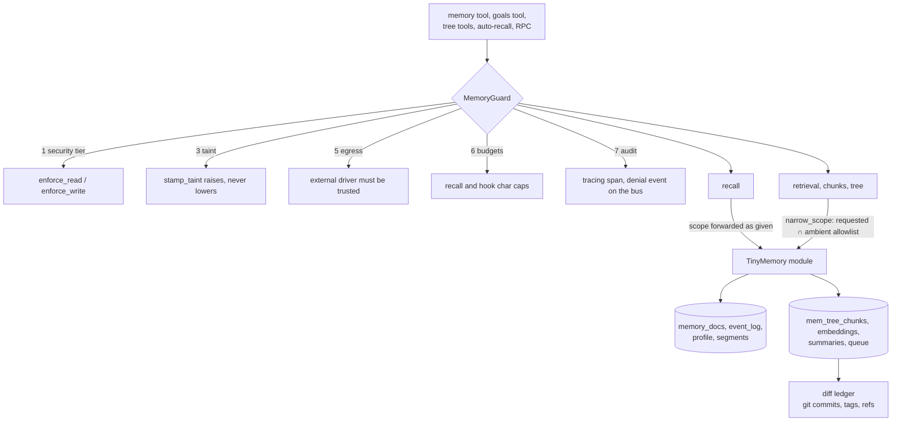

## 1. Executive Summary

OpenHuman is a desktop agent runtime in Rust with a Tauri shell. Its memory is
no longer a set of modules inside this repository. The engine was extracted
into [`tinymemory`](https://github.com/tinyhumansai/tinymemory), pinned here as
the `vendor/tinymemory` submodule at `74f2a52`, which in turn pins the
[`tinycortex`](https://github.com/tinyhumansai/tinycortex) engine at `79131f2`.
The host keeps about 43,000 non-test lines under
`crates/openhuman-core/src/memory/`: the RPC surface, the agent tools, a
policy guard, and a few host-only policies. The engine side is about 80,000
lines in tinymemory and 55,000 in tinycortex. All three were read for this
report, at those pins.

The field that defined the first reading is still here and still carefully
built. **`MemoryTaint` labels a memory `Internal` or `ExternalSync`, parses any
unknown database value to `ExternalSync`, and survives secret and PII
redaction.** Sync paths stamp it at write time, and the guard raises it to
`ExternalSync` for any write made inside a source-restricted turn.

What changed is what reads it. The consumer was the subconscious engine: a turn
whose memory context held external content ran as
`TrustedAutomationSource::SubconsciousTainted`, and the approval gate refused
every external-effect tool for that origin. Commit
[`9d18b93aeffa5f00a289aa5aa68e905e26c1e5d9`](https://github.com/tinyhumansai/openhuman/commit/9d18b93aeffa5f00a289aa5aa68e905e26c1e5d9)
removed the whole subconscious module on 22 August 2026 — 60 files, 11,571
lines. The approval gate still carries the deny arm
(`security/approval/gate_intercept.rs:272-285`), but nothing in the crate
constructs that origin any more. At this commit taint has one live reader:
auto-recall wraps an `ExternalSync` note in an `<untrusted-source>` marker
before it reaches the prompt. The `memory` tool's own recall prints entries
bare.

The more consequential new mechanism is the **guard**. `MemoryGuard` decorates
the bound driver and is the only memory handle product code may hold; a ratchet
test fails if a new bypass appears. It enforces the security tier, stamps taint,
applies char budgets, refuses untrusted external drivers, and applies an agent
profile's source allowlist as an upper bound that an explicit argument can
narrow but never widen. That allowlist reaches the chunk and tree reads. It does
not reach namespace recall, which is the first action the `memory` tool lists:
the guard forwards recall's scope untouched, because the driver refuses a scoped
recall it cannot apply as a predicate. The recall tool's comment says the
opposite.

Nothing records a rejected value. Deleting a source's chunks clears its ingest
gate, so the next sync of a still-connected source writes them back.

## 2. Mental Model

Four kinds of thing are remembered.

A **note** is a `memory_docs` row: a namespace, a key, content, a category, an
optional session and a taint. It is what the `memory` tool's `store` and
`recall` actions address, and what `forget` deletes.

A **chunk** is a piece of canonicalised source — a conversation segment, a
synced email or document, a file — in TinyCortex's `mem_tree_chunks`, keyed by
`source_kind`, `source_id` and `owner` with a time range.

A **tree node** is a summary over chunks, produced as buckets seal.

An **event** is an extracted claim in `event_log`, typed and carrying a
`confidence` and the turn ids it came from.

Cutting across the notes is the taint, and the path from label to consequence
now has a gap in it:

The taint is still not a belief state. It has no candidate, verified or rejected
value; a user's mistaken belief is `Internal`, and a correct fact from a synced
document is `ExternalSync` for good. It models blast radius, and at this commit
the blast-radius control it was built for is not wired.

How a memory dies: `forget` removes a note; `clear_namespace` removes a
namespace; `delete_chunks_by_source` removes a source's chunks with their scores,
entity index rows and embeddings, and clears the source's ingest gate
(`tinycortex/src/memory/chunks/store_delete.rs`). A chunk that can never be
embedded is tombstoned so the re-embed worker stops retrying. Nothing is marked
wrong, and nothing stops a still-connected source from re-ingesting what was
deleted.

## 3. Architecture

Three repositories, each pinned by the one above it.

| Layer | Where | Non-test lines | Role |
| --- | --- | --- | --- |
| Host | `crates/openhuman-core/src/memory/` | ~43,000 | RPC schemas and ops, agent tools, the guard, auto-recall, source scope, conversations store |
| Contract and module | `vendor/tinymemory` at `74f2a52` | ~80,000 | `tinymemory-bus` wire types, `tinymemory-api` driver contract, `tinymemory-core` namespace store and sync, `tinymemory-module` TinyBus driver, `tinymemory-conformance`, HTTP adapters for Supermemory, Mem0, Cognee and others |
| Engine | `vendor/tinycortex` inside tinymemory, at `79131f2` | ~55,000 | chunks, vectors, summary tree, score, queue, retrieval, entities, people, persona, diff ledger |

The host binds one driver per workspace (`memory/binding.rs`). `admit` accepts
the null driver and the compiled TinyMemory module, refuses the `embedded` class
outright, and refuses any `external` class unless its `trust_state` is
`"trusted"` — and then refuses it anyway, because the transport is not
implemented (`binding.rs:275-290`). So the HTTP adapters in tinymemory are not
reachable from this build.

The guard sits between every caller and the bound driver.

The guard's seven steps are listed in `memory/guard/README.md`. Step 2, the
source scope, is applied "in `GuardedTree::query_source` (not recall — the bound
driver refuses a scoped recall)". Step 7 is a tracing span and a
`MemoryGuardDenied` bus event carrying shapes only — driver, method, namespace,
char counts, never a memory body or a key. Successful calls are logged at debug
to the file log and not published.

`bypass_allowlist_tests.rs` scans production files for the calls that would
reach a driver around the guard — `binding::for_workspace(`,
`.memory_binding(`, `.unguarded_provider(`, `.profile_store(` — against an
allowlist that carries a reason per entry, and fails if the set grows or an
entry goes stale.

### Deployment and ergonomics

- **What has to run:** the desktop app. Memory is SQLite and markdown under the
  workspace directory, served in-process by the compiled TinyMemory module over
  TinyBus; there is no database server.
- **Local and offline:** yes for storage and recall. Embeddings and Tier B
  extraction have local paths; the sync connectors are what degrade offline.
- **An API key is not required to store.**
- **Hand-repairable:** partly. The markdown and SQLite are inspectable, but three
  repositories, queues, re-embed backfills and a git ledger are not a store a
  person repairs casually.
- **Reading it** means checking out two submodules at the commits the host pins;
  the host README links to the engine on GitHub because CI does not fetch them.
- Every repository in the stack is GPL-3.0.

The screen of this checkout found three auto-run surfaces (agent harness hooks),
14 dependency surfaces inside the seven-day cooldown, 7 build-time execution
points and 3 unpinned surfaces across 37 scanned files, plus two agent-directed
instruction files read as data. The submodule directories are empty in a plain
checkout; tinymemory and tinycortex were cloned separately at the pinned commits
and read as source. Nothing was installed or run.

## 4. Essential Implementation Paths

**Write gate.** `tinymemory-core/src/store/write_gate.rs` wraps every document
upsert: reject a secret-shaped namespace or key, canonicalize a PII-bearing key
rather than reject it, then redact every field through
`safety::sanitize_document_input`, whose doc comment says provenance taint
"survives untouched" (`store/safety/mod.rs:108`), pinned by
`sanitize_document_input_preserves_taint`. The raw `_presanitized` driver
methods are `pub(crate)` and called only from the gate.

**Taint stamping.** The type is `tinymemory-bus/src/types.rs:49`;
`from_db_str` maps anything but `"internal"` and `"external_sync"` to
`ExternalSync`. The `memory_docs.taint` column defaults to `'internal'`
(`namespace_store/init.rs:173`), while TinyCortex's record adapter reads a
missing taint field as `"external_sync"` (`tinycortex/src/memory/store/memory_trait.rs:41`).
Writers set `ExternalSync` explicitly: Composio provider ingest
(`integrations/composio/ops/providers_ops.rs:615`), flow memory tools
(`flows/memory_tools.rs:531`), flow run digests (`flows/bus/run_digest.rs:141`),
and agent-turn summaries (`agent/tinyagents/host/agent_memory.rs:174`), since
that adapter cannot tell whether the turn was summarising an email. The guard's
`stamp_taint` returns `ExternalSync` if the caller asked for it or a source
scope is active (`guard/policy.rs:312-318`).

**Taint reading.** `auto_recall/mod.rs:534-536`: a note is wrapped when it
carries `ExternalSync` or when `is_potentially_untrusted` flags its namespace or
a connector key prefix (`gmail:`, `slack:`, `notion:` and ten more). The approval
gate's `SubconsciousTainted` arm (`security/approval/gate_intercept.rs:272`) has
no producer: the only `TrustedAutomationSource::Subconscious*` constructed
in the crate is the untainted one in `memory/goals/enrich.rs:133`. The write
gate's comment still names "the signal the subconscious gate reads"
(`write_gate.rs:45`).

**Recall.** The collapsed `memory` tool (`memory/tools/collapsed.rs`)
dispatches `recall`, `store`, `forget`, `hybrid_search`, `vector_search`,
`chunk_context`, `raw_search`, `raw_chunks`, `kinds`, `flavour` and `doctor`.
`recall` resolves a namespace from the model's arguments, defaulting to
`global` (`tools/recall.rs:125-142`), and calls `guard.recall(…, None)`
(`:99`). The guard forwards that scope unchanged (`guard/mandatory.rs:94-128`),
and the contract's mandatory recall refuses a `Some(scope)` with
`SCOPE_UNAPPLIED` (`tinymemory-api/src/mandatory/mod.rs:139-148`).

**Scoped retrieval.** `GuardPolicy::narrow_scope` (`guard/policy.rs:273`)
intersects a requested scope with the ambient allowlist, returns the ambient
one when the caller asks for none, and returns an empty scope rather than
`None` when the intersection is empty. It is applied on `fast_retrieve`,
`cover_window` and the other retrieval and chunk families
(`guard/families/retrieval_and_profile.rs:54`, `:71`, `:88`, `:110`;
`typed_ingest_and_answer.rs:160-218`). The allowlist comes from
`AgentProfile::memory_sources`, set around a turn by `with_source_scope`
(`memory/source_scope.rs:75`); `None` means unrestricted.

**Auto-recall.** `memory/auto_recall/`: a lexical gate (`gate.rs`) opens only
for a message of at most 600 characters that owns something and asks something;
then a `fast_retrieve` over the tree through the guard and one scored recall
over the `global` notes namespace, each floored, capped at a per-hit char limit,
and abandoned after its own time budget. Kill-switch:
`[subsystems.memory.hooks] auto_recall`.

**Deletion.** `forget` and `clear_namespace` in the namespace store;
`delete_chunks_by_source` and siblings in `tinycortex/src/memory/chunks/store_delete.rs`,
which clear the `mem_tree_ingested_sources` gate for the source.

**Change ledger.** `tinycortex/src/memory/diff/ledger.rs` — a libgit2 repository
at `<workspace>/memory_diff/repo`, a derived view of the chunk store where
snapshots are commits, checkpoints are annotated tags and read markers are refs.

**Goals.** `memory/goals/` for the RPC, `tools/goals.rs` for the agent tool,
`goals/enrich.rs` for the reflection agent, spawned from the archivist
(`agent/harness/archivist/lifecycle.rs:561`).

## 5. Memory Data Model

`memory_docs` (`tinymemory-core/src/store/namespace_store/init.rs:158-176`):
`document_id` primary key, `namespace`, `key`, `title`, `content`,
`source_type`, `priority`, `tags_json`, `metadata_json`, `category`,
`session_id`, `created_at`, `updated_at`, `markdown_rel_path`, `taint`,
`logical_namespace`, and `UNIQUE(namespace, key)`. The same database holds
`kv_global`, `kv_namespace`, `graph_global`, `graph_namespace`, `vector_chunks`,
an FTS5 episodic log, `conversation_segments` with an `open → closed →
summarised` status, `event_log` and `user_profile`.

`event_log` (`namespace_store/events.rs:16-29`): `event_id`, `segment_id`,
`session_id`, `namespace`, `event_type`, `content`, `subject`, `timestamp_ref`,
`confidence REAL NOT NULL`, `embedding`, `source_turn_ids`, `created_at`.
Profile facets accumulate evidence across sessions and overwrite a value only
when confidence improves.

`mem_tree_chunks` (`tinycortex/src/memory/chunks/schema.rs:40-55`): `id`,
`source_kind`, `source_id`, `path_scope`, `source_ref`, `owner`,
`timestamp_ms`, `time_range_start_ms`, `time_range_end_ms`, `tags_json`,
`content`, `token_count`, `seq_in_source`, `created_at_ms`, with per-model
embeddings and a `reembed_skipped` table recording why a chunk was given up on.

**Provenance** is structured. Events point at their source turns, chunks at
their source and owner, notes carry taint, and a document revision that a newer
one supersedes has its whole subtree evicted from tree retrieval
(`tinycortex/src/memory/retrieval/cover.rs:289`). That revision filter is
derived from document versions rather than a stored status, so it is not a
`trust_state`.

**Temporal:** `created_at` and `updated_at` are record time; a chunk's time
range is the span of its source content; `timestamp_ref` is free text. Nothing
pairs a validity start with an end, so `bitemporal` is withheld.

**Scoping.** Namespaces are addresses, canonicalized identically on every read
and write path so a rewritten key stays addressable. They are not a boundary:
the recall tool's schema invites the model to name `background`,
`autocomplete`, `skill-{id}` "or a connector source namespace"
(`tools/recall.rs:56-59`). The boundary the host does draw is the source
allowlist, and it is drawn well where it applies — as an upper bound, an empty
intersection denying rather than unrestricting, pinned by
`narrow_scope_drops_explicit_sources_outside_the_ambient_allowlist` and
`an_entirely_out_of_scope_request_denies_rather_than_unrestricts` in
`guard/policy_tests.rs`. But a profile restricted to `slack:#eng` can still
recall a connector namespace by name, because recall carries no source
predicate. With the one path that ignores the allowlist being the tool's first
action, `scope_enforced` is not carried.

## 6. Retrieval Mechanics

Four surfaces.

**Namespace recall** over notes: the `memory` tool's `recall` action, five
results by default, rendered as `- [category] key: content [score%]`. No
untrusted marker is applied on this path.

**Chunk search**: `hybrid_search`, `vector_search`, `raw_search` and
`raw_chunks` reach the retrieval and chunk families through the guard, so the
ambient source allowlist narrows them.

**Tree walk**: `fast_retrieve`, `cover_window` and drill-down over the summary
tree, summary-first, also narrowed. Superseded document revisions are dropped
before ranking.

**Auto-recall**, Lane C (#6040): on a message that passes the lexical gate, a
bounded pre-turn block of tree hits and notes rides on the user message rather
than the cached system prefix. Tree hits below a floor relative to the best
score are dropped, because scores are declared non-comparable across drivers;
notes are dropped below an absolute cosine floor. Lines that would exceed the
guard's recall char budget are left out whole. Source-tree hits and tainted
notes are wrapped as untrusted. The block opens with a hint that it is a
pre-fetch, after the model read an earlier version as the search itself and
declared a stored fact absent (#6063). The gate's word lists are English, so a
message in another language rarely opens it.

Failure modes worth naming: the source allowlist gap on recall; recall output
reaching the model without the untrusted wrapper auto-recall applies to the
same rows; and a tree walk whose token cost is bounded only by the model's
traversal.

## 7. Write Mechanics

**The write gate is ordered and deliberate.** Rejecting a PII-bearing key
produced an unthrottled retry loop — 3,055 Sentry events from one user in a day
(#5164) — so keys are canonicalized instead, strictly enough that WhatsApp JIDs,
`+1…` chat ids and timestamps keep their identity. Content is redacted by a
lenient scrubber; identifiers by a strict one. Secret-shaped identifiers are
still refused, and their errors are demoted out of the error stream.

**Taint survives the gate**, and the document intake in `tinymemory-documents`
passes it through untouched on the same argument: "Intake that defaulted an
upload to `Internal` would launder whatever a user handed it"
(`tinymemory-documents/src/ingest/mod.rs:24`).

**Extraction is two-tier.** Tier A is regex for decisions, commitments,
preferences and facts, and always runs; Tier B is a local LLM on segment close
if local AI is enabled (`namespace_store/events.rs:5-7`). A user with no model
configured still accumulates typed events.

**Document identity is resolved twice.** A writer supplying its own
`document_id` can address a row by id or by `(namespace, key)`; the store
resolves both before writing, re-keys a same-namespace row that moved key, and
derives a fresh id when the requested one belongs to another namespace
(`namespace_store/README.md`, openhuman#6147).

Conflict handling is by summarisation and upsert. Nothing detects that two
events contradict each other, and `confidence` is not revised after extraction.

### Operational cost

- **Writes are queued.** Ingestion and extraction jobs go through TinyCortex's
  queue with dedupe keys; a failed row superseded by a newer job with the same
  key is settled as cancelled.
- **Lag before retrievable** is one queue drain for chunks, and segment close
  for Tier B events.
- **Background passes are targeted.** The re-embed backfill walks rows whose
  model signature changed and tombstones unrecoverable ones; tree summarisation
  is per sealed bucket.
- **Read-path cost** is bounded by the guard's char budgets on recall and
  hooks, and auto-recall runs only on gated turns — replacing an older per-turn
  loader that scanned the `global` namespace twice on every message.

## 8. Agent Integration

The agent sees one `memory` tool with an `action` field instead of eleven
schemas; the older `memory_*` tools stay registered and hidden so a replayed
transcript still dispatches. Goals, people, sources, sync status and the tree
have their own RPC families and tools.

Agency is high. The agent recalls by any namespace, stores, forgets, searches
chunks, walks the tree, and edits its goals. The archivist clips conversations
into the tree and spawns goals reflection when a conversation is summarised.
Auto-recall adds a pre-turn block without the model asking.

A person's surfaces are in the Intelligence tab: a memory graph, heatmap,
navigator and chunk detail that display; source registration and sync
settings, with a sync audit panel of when syncs ran and what they cost; a
whole-tree wipe and a tree reset behind a confirm dialog; and a goals panel that
edits what the agent wrote.

The diff ledger remains an integration idea worth noting: an agent can diff a
source against a checkpoint and acknowledge what it has seen, and read markers
as git refs give each consumer its own position in the change stream.

## 9. Reliability, Safety, and Trust

**The taint type is still a good design, and it is now mostly a label.** Two
values, a restrictive parse, survival through redaction, explicit
`ExternalSync` at each sync writer, and a guard that can only raise it. Its
purpose, stated in its own doc comment, is to let "callers … refuse
external-effect tools on tainted context" (`tinymemory-bus/src/types.rs:45-47`).
The caller that did so was the subconscious engine, which put a turn with
external memory in context under the `SubconsciousTainted` origin; the approval
gate denied external-effect tools for that origin and excluded it even from the
blanket `auto_approve_all` switch. Since `9d18b93` there is no subconscious tick
and no constructor of that origin, so the deny arm and the exclusion are
unreachable. Taint now changes one thing: whether auto-recall fences a note.

`trust_state` stays withheld for the reason the first reading gave. The taint is
provenance, fixed at ingest, and never a judgement of whether a memory is true.

**The guard is the stronger safety mechanism at this commit.** It is the only
handle, it re-reads the security policy on every call so an autonomy change
takes effect immediately, it refuses untrusted external drivers before any
content crosses the process boundary, and its scope rule was fixed in the right
direction: an earlier `requested.or(ambient)` let a restricted turn widen itself
by naming an explicit scope, and the intersection closed it
(`guard/policy.rs:256-272`).

**Its honesty stops one call short.** The recall path does not carry the
allowlist, and the guard's own module docs say so. The tool that calls it says
"the guard intersects it with the ambient per-turn allowlist, so this can only
ever be narrowed, never widened" (`tools/recall.rs:97-98`). A reader trusting
the call site would conclude a source-restricted profile cannot reach a
connector namespace, and it can.

**Nothing records a rejected value.** Delete a source's chunks and its ingest
gate goes with them; the next sync of a connected source writes them back.

**The git ledger is change tracking, not audit.** It is derived from the chunk
store and snapshot-based, and the guard's audit step is a tracing span plus a
bus event on denials, not a stored mutation record. The sync audit log records
sync runs and their cost. `audit_log` is withheld.

**Human review covers goals only.** A person can add, edit and delete goals the
reflection agent wrote. There is no per-item review or delete for notes, chunks
or events; the tab's destructive controls act on the whole tree.

## 10. Tests, Evals, and Benchmarks

**990 test functions under the host memory module and its two memory
end-to-end files, 12,406 across `crates/openhuman-core/src`, 2,013 in tinymemory
and 1,606 in tinycortex.** The host tests pin the guard's scope intersection,
taint stamping inside and outside a source scope, budgets, the bypass ratchet,
and auto-recall's gate and wrapping.

The negative assertions exist at both levels. `clear_namespace_removes_canary_from_recall`
(`tests/memory_roundtrip_e2e.rs:264`) seeds a canary, asserts recall returns it,
clears the namespace, and asserts neither the content nor the key comes back.
The tinymemory conformance suite, which every driver must pass, requires
`recall` to return two in-namespace hits and no hit from a sibling namespace
holding the same needle, and requires a forgotten key to read back as absent.
That earns `negative_eval`.

What is not asserted: that a source-restricted turn cannot recall a connector
namespace; that `ExternalSync` content cannot reach an external-effect tool end
to end; and that a deleted source stays deleted across a sync.

**Benchmarks** live in tinycortex. `benchmarks/effectiveness` is a reproducible
retrieval-metrics harness over a lexical in-memory baseline and a ten-document,
twelve-query seed corpus; the README reports RAGAS, TemporalBench, BABILong and
Vending-Bench results for a hosted system and says the harness that produced
them is not in the repository. Neither measures the OpenHuman memory path.

## 11. For Your Own Build

### Steal

- **Make the policy layer the only handle, and ratchet it.** A decorator over
  the driver plus a test that fails when a new bypass call appears turns "every
  call is checked" from a convention into a build failure.
- **Intersect scopes; never let an argument replace one.** An ambient allowlist
  is an upper bound, and an empty intersection must deny rather than read as
  "no restriction".
- **Never let redaction launder provenance.** Carry the source label through
  every scrubber and through document intake, and pin it with a test.
- **Fail closed on unknown enum values from storage.** Empty, wrong-case and
  future values should land on the restrictive side.
- **Canonicalize identifiers instead of rejecting them** when callers retry:
  a rejected write becomes a loop.
- **Gate pre-turn recall on the message, cheaply.** A lexical "owns something
  and asks something" rule keeps retrieval off most turns at zero cost.

### Avoid

- **Removing a consumer without removing the claim.** When the subconscious
  engine went, the approval gate's deny arm, the type's doc comment and the
  write gate's comment all kept describing a control that no longer ran. Delete
  the producer and grep for the variant.
- **A call-site comment that contradicts the layer below.** The recall tool
  asserts a narrowing the guard documents it does not perform.
- **Applying untrusted framing on one read path only.** The same row is wrapped
  in auto-recall and bare in the tool's recall.
- **Deleting a source's ingest gate with its content** when the source stays
  connected; the delete looks like it failed.

### Fit

This suits a team building a desktop agent over a user's real email, documents
and chat, who want the write gate, the guard and the source allowlist done
carefully and tested. The contract is designed to swap engines, and the
conformance suite is what a second engine would have to pass.

The cost is three GPL-3.0 repositories pinned inside each other, a TinyBus
module boundary, and a Tauri shell. It is a stack you join.

Walk away if you need corrective memory, or if you were relying on taint to stop
external content from driving actions: at this commit nothing turns it into a
refusal.

## 12. Open Questions

- **Will the subconscious engine return, and with it the tainted origin?** The
  config schema keeps `subconscious.engine` for back-compat and says the
  `medulla` variant "is to be re-ported"; the local engine it names is not in
  this tree.
- **When does recall grow a source predicate?** The guard's docs say recall
  "joins that list when the embedded recall path grows the predicate".
- **Should the recall tool wrap tainted notes** the way auto-recall does?
- **Does a delete survive the next sync?** No path was found that suppresses
  re-ingest of removed content.
- **Which taint default wins for a legacy row?** The namespace column defaults
  to `internal` and the TinyCortex record adapter to `external_sync`.

## Appendix: File Index

**Host — `crates/openhuman-core/src/`**

- `memory/README.md` — the host/engine split and what stayed here
- `memory/guard/` — `README.md`, `provider.rs`, `policy.rs` (`narrow_scope`, `stamp_taint`, `check_egress`), `mandatory.rs` (recall forwarding), `audit.rs`, `budget.rs`
- `memory/bypass_allowlist_tests.rs` — the guard ratchet
- `memory/binding.rs` — driver admission
- `memory/source_scope.rs` — the per-turn source allowlist
- `memory/auto_recall/` — `mod.rs`, `gate.rs`, `source.rs`
- `memory/tools/` — `collapsed.rs`, `recall.rs`, `store.rs`, `forget.rs`, `goals.rs`, `search/`, `raw_store/`
- `memory/goals/` — `ops.rs`, `enrich.rs`
- `security/approval/gate_intercept.rs` — the `SubconsciousTainted` arm
- `agent/turn_origin.rs` — `TrustedAutomationSource`
- `agent/harness/memory_context_safety.rs` — `is_potentially_untrusted`, `wrap_untrusted_for_agent`
- `agent/harness/archivist/lifecycle.rs` — goals reflection spawn

**Host — elsewhere**

- `tests/memory_roundtrip_e2e.rs` — clear-then-recall
- `app/src/components/intelligence/GoalsPanel.tsx`, `MemoryControls.tsx`, `SyncAuditPanel.tsx`

**tinymemory at `74f2a52`**

- `crates/tinymemory-bus/src/types.rs` — `MemoryTaint`; `recall.rs` — `RecallOpts`
- `crates/tinymemory-api/src/mandatory/mod.rs` — `SCOPE_UNAPPLIED`
- `crates/tinymemory-core/src/store/write_gate.rs`, `store/safety/mod.rs`
- `crates/tinymemory-core/src/store/namespace_store/` — `init.rs`, `documents.rs`, `events.rs`, `query.rs`, `README.md`
- `crates/tinymemory-documents/src/ingest/mod.rs`
- `crates/tinymemory-conformance/src/suite/mod.rs`

**tinycortex at `79131f2`**

- `src/memory/chunks/schema.rs`, `store_delete.rs`
- `src/memory/retrieval/cover.rs` — superseded revision filter
- `src/memory/diff/ledger.rs`
- `src/memory/store/memory_trait.rs` — record taint default
- `benchmarks/README.md`

## History

**2026-09-15** — [`c833323a5b4c1e40dd4e1e958c71018244186c95`](https://github.com/tinyhumansai/openhuman/commit/c833323a5b4c1e40dd4e1e958c71018244186c95) — second reading, 16,387 commits on, with the two engine submodules checked out at the commits the host pins: tinymemory [`74f2a529cef2f168ed53fde8a4ab7ca06b67dc4e`](https://github.com/tinyhumansai/tinymemory/commit/74f2a529cef2f168ed53fde8a4ab7ca06b67dc4e) and tinycortex [`79131f275cf98f06421fefd9dc812c5a63a5a182`](https://github.com/tinyhumansai/tinycortex/commit/79131f275cf98f06421fefd9dc812c5a63a5a182). Screened at the new pin before reading: three auto-run surfaces, 14 dependency surfaces inside the cooldown, 7 build-time execution points, 3 unpinned surfaces, and two agent-instruction files read as data; nothing was installed or run. The body is rewritten. The twelve `src/openhuman/memory_*` modules became a host layer in `crates/openhuman-core/src/memory/` over an engine extracted into tinymemory and tinycortex, both now read rather than taken on seam tests. The subconscious module that consumed `MemoryTaint` — putting a turn with external memory in context under `SubconsciousTainted`, which the approval gate refused external-effect tools for — was removed in `9d18b93` on 2026-08-22, and nothing constructs that origin at this commit; the headline changes accordingly. New since the first pin: the `MemoryGuard` policy decorator with its bypass ratchet, source allowlists intersected rather than replaced, the ordered write gate, a collapsed `memory` tool, and auto-recall.

`scope_enforced` is withdrawn. Namespaces are model-chosen on recall, and the profile source allowlist the guard applies to chunk and tree reads does not reach namespace recall, whose tool comment claims it does. `negative_eval` is carried on the clear-then-recall end-to-end test and the pinned conformance suite's namespace recall assertion. The first reading judged the cross-session flag test not to be one, which stands. `human_review` is carried on the goals panel, where a person edits and deletes goals the reflection agent wrote. Two marks.

The first reading's counts — about 76,000 memory lines and 1,278 memory tests — described the pre-extraction layout and are replaced. The phrase "the only system in the atlas with a capability-gating provenance label" is dropped.

**2026-07-29** — [`e213bc5fc4000e9ad599c977a560113cc018c554`](https://github.com/tinyhumansai/openhuman/commit/e213bc5fc4000e9ad599c977a560113cc018c554) — first reading.
