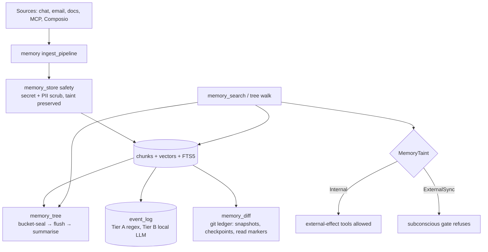

## 1. Executive Summary

OpenHuman is an AI harness — a desktop agent runtime in Rust — carrying the
largest memory subsystem in this atlas by volume: twelve top-level `memory_*`
modules, roughly 76,000 lines, and about 1,278 memory-specific test functions
inside a repository with some 12,548 in total.

Most of that volume is competent and familiar: SQLite plus markdown, chunking,
embeddings, FTS5, a summarisation tree with bucket-seal and flush, sync
connectors, an agentic tree walk. What makes it worth reading is a single field
that no other system here has.

**`MemoryTaint` labels every memory with where it came from, and that label
gates what the memory is allowed to cause.** Its two values are `Internal` and
`ExternalSync`; unknown or corrupt column values **fail closed** to
`ExternalSync`; and the downstream "subconscious gate" refuses external-effect
tools when acting on chunks of external origin. Every other trust mechanism in
this atlas answers *is this memory true?* — with confidence scores, verification
passes, candidate states. This one answers *what may this memory be allowed to
do?*, which is the question that actually matters when the memory store is an
injection surface, and it is the only implementation of it here.

Two further pieces of care stand out. Sanitization scrubs secrets and
multilingual PII from content on the write path and **deliberately leaves the
taint untouched** — a comment states the reason: redaction must not launder
provenance. And `memory_diff` maintains a git repository as a derived ledger of
how the agent's world view changed, where snapshots are commits, checkpoints are
tags and read markers are refs, so an agent can ask what is new since it last
looked and acknowledge it.

The weaknesses are real. Nothing records a rejected value — the twelve files
using the word *tombstone* all mean an unembeddable chunk or a delete-sync
marker. The taint is binary and assigned once, never re-evaluated and never
narrowed by corroboration. And a substantial share of the primitives —
`MemoryEntry`, `MemoryTaint`, the `Memory` trait, the safety scrubbers, the diff
engine — are **re-exported from `tinycortex`, a separate repository that this
review did not read**, so parts of the mechanism described here are pinned by
this repository's tests rather than inspected at their source.

## 2. Mental Model

Three kinds of thing are remembered, and they have different standing.

A **chunk** is a piece of canonicalised source: a conversation segment, a synced
document, an uploaded file, rendered to markdown and split. It is evidence, and
it is retained.

A **tree node** is a summary over chunks, produced by bucket-seal and flush in
`memory_tree`. Evidence is promoted into summary as buckets fill.

An **event** is an atomic extracted claim in `event_log` — typed
`Decision`, `Commitment`, `Preference` or fact — carrying a `confidence REAL NOT
NULL`, a nullable `timestamp_ref`, and `source_turn_ids` pointing back at the
turns it came from.

Cutting across all three is the label that matters:

```text
                    ┌──────────────────────────────────┐
   user typed it ──►│  MemoryTaint::Internal           │──► may drive
                    │                                  │    external-effect tools
                    └──────────────────────────────────┘
                    ┌──────────────────────────────────┐
   synced from  ───►│  MemoryTaint::ExternalSync       │──► subconscious gate
   email/docs/MCP   │  (also: unknown, corrupt, legacy │    refuses external effects
                    │   → fails closed to here)        │
                    └──────────────────────────────────┘
```

Note what this state machine is *not*. It has no `Candidate`, no `Verified`, no
`Rejected`. A user's mistaken belief and a user's correct one are both
`Internal`. A memory never moves between taints as evidence accumulates —
provenance is assigned at ingest and is permanent. So OpenHuman does not model
belief at all; it models **blast radius**, and it does so more carefully than
anything else here models belief.

How a memory dies: a source is removed and the watcher tombstones its entries; a
chunk proves unembeddable and the backfill tombstones the row so the worker
stops retrying; a bucket seals and its contents are summarised. Nothing is ever
marked wrong, and nothing prevents a deleted thing being re-ingested from the
same still-connected source on the next sync.

## 3. Architecture

Rust, GPL-3.0, ~2,077 source files, a Tauri desktop app with a TypeScript
frontend. The memory stack is deliberately split so each module has one job,
documented in `src/openhuman/memory/README.md` with a stated layer rule: *"No
storage in this module… If you're tempted to open a SQLite connection here, the
connection helper belongs one layer down."*

| Module | Lines | Role |
| --- | --- | --- |
| `memory` | 18,374 | Orchestration: sync, query, remember, ingest pipeline, RPC |
| `memory_store` | 17,433 | Storage primitives: raw, chunks, entities, trees, vectors, kv, contacts |
| `memory_sync` | 17,125 | Composio, workspace and MCP sync pipelines |
| `memory_tree` | 9,898 | Bucket-seal, flush, summarise, retrieval and traversal |
| `memory_sources` | 4,964 | Source adapters |
| `memory_diff` | 1,956 | Git-backed snapshot and change ledger |
| `agent_memory` | 1,545 | Agent-facing memory surface |
| `memory_queue` | 1,411 | Job queue |
| `memory_tools` | 1,338 | Tool-scoped rules, agent read/write tools |
| `memory_goals` | 869 | A durable goals list in markdown |
| `memory_conversations` | 858 | Conversation memory |
| `memory_search` | 718 | Hybrid and vector search tools |



**A large share of the primitives live elsewhere.** `memory/traits.rs` is 169
lines of which 28 are the module and the rest are tests, because `Memory`,
`MemoryEntry`, `MemoryCategory`, `MemoryTaint`, `NamespaceSummary` and
`RecallOpts` are `pub use tinycortex::memory::{…}`. The same is true of the
safety scrubbers and of `memory_diff`'s `DiffEngine`. The comments describe a
migration ("W2 type-unification", "W3", "W7") that moved these into the crate
"byte-identical". This report is therefore bounded: the *contracts* are pinned
here by host-side seam tests, and the implementations were not read.

### Deployment and ergonomics

- **What has to run:** the desktop app, plus optional sidecars. SQLite and
  on-disk markdown are the store; there is no server or external database.
- **Local and offline:** substantially yes. Embedding and extraction have local
  paths (`tinycortex` embedding sidecars; "Tier B (local LLM): runs on segment
  close if local AI is enabled"), and Tier A extraction is pure regex and always
  runs. What degrades offline is the sync connectors, which are the point of
  several modules.
- **An API key is not required to store**, and with local AI enabled not
  required to extract either.
- **Hand-repairable:** partly. Markdown and SQLite are inspectable, but twelve
  interacting modules with queues, backfills and a git ledger are not a store a
  person repairs casually.
- The GPL-3.0 licence is a genuine constraint for anyone considering reuse.

## 4. Essential Implementation Paths

**Write and sanitize.** `memory_store::safety::sanitize_document_input` scrubs
title, content, tags and metadata field by field through the crate scrubbers,
merging a `SanitizationReport` — and reconstructs `NamespaceDocumentInput` with
`taint: input.taint` carried through unchanged.

**Ingest.** `memory/ingest_pipeline.rs` orchestrates source → canonicalise →
chunk → score → persist → enqueue extract jobs. Canonicalisation is
`tinycortex::memory::ingest::canonicalize`.

**Extraction.** `memory_store/namespace_store/events.rs` — `EVENTS_INIT_SQL`
creates `event_log` and an `event_fts` FTS5 virtual table with insert/delete
triggers. Tier A is heuristic regex and "always runs, free"; Tier B is a local
LLM on segment close.

**Trust gate.** `memory/traits.rs` re-exports `MemoryTaint`;
`MemoryTaint::from_db_str` fails closed to `ExternalSync` for `""`,
`"EXTERNAL_SYNC"` and `"future"`, pinned by
`memory_taint_from_db_str_known_values_roundtrip_unknown_fails_closed`.

**Retrieval.** `memory_search/tools/hybrid_search.rs` and `vector_search.rs`;
the agentic tree walk in `memory/query/`; cross-session episodic recall in
`memory_store/memory_trait.rs` behind `RecallOpts::cross_session`.

**Change ledger.** `memory_diff/mod.rs` — a git repository at
`<workspace>/memory_diff/repo` where "snapshots are commits, checkpoints are
tags, read markers are refs, and diffs are git tree diffs", built from
`mem_tree_chunks` without re-calling source readers.

**Health and tombstoning.** `memory_tree/health/mod.rs` classifies unrecoverable
per-row failures so `reembed_backfill` tombstones the offending chunk or summary
rather than retrying forever; `tinycortex/queue_driver.rs` persists those
tombstones, and distinguishes them from a cloud `AuthMissing` which "fail[s]
without tombstone".

**Goals.** `memory_goals/mod.rs` maintains `MEMORY_GOALS.md` (~200–500 tokens),
mutable explicitly by RPC or tool, by a reflection agent over several turns, or
automatically when the conversation is summarised.

## 5. Memory Data Model

`MemoryEntry`: `id`, `key`, `content`, `namespace`, `category`, `timestamp`,
`session_id`, `score`, `taint`. `MemoryCategory` is `Core | Daily | Conversation
| Custom(String)`, the custom variant rendered as `custom:<name>` with a
round-trip test and a legacy bare-value fallback.

`event_log`: `event_id`, `segment_id`, `session_id`, `namespace`, `event_type`,
`content`, `subject`, `timestamp_ref`, `confidence`, `embedding`,
`source_turn_ids`, `created_at`, indexed by segment, by `(namespace, created_at
DESC)` and by `(event_type, namespace)`.

**Provenance** is the strong part of the schema. `source_turn_ids` links an
extracted event to the turns that produced it, and a test —
`recall_cross_session_preserves_provenance_via_session_id` — asserts *every*
cross-session hit carries a non-empty `session_id` "so downstream layers
(memory_loader, UI) can render provenance". Provenance is not just stored, it is
required to survive retrieval.

**Temporal:** `created_at` is record time and `timestamp_ref` is a nullable
free-text reference to a time the content mentions. That is adjacent to validity
time but is not a validity interval, and nothing pairs it with an end — so this
is **not bi-temporal**.

**Scoping** is real and applied. Namespace appears in SQL predicates on the read
path (`WHERE event_fts MATCH ?1 AND el.namespace = ?2`, `WHERE namespace = ?1
AND event_type = ?2`), namespaces are sanitized before use, and there are tests
that a "secret-like namespace should be rejected". Session scoping layers on top,
with cross-session recall **off by default**. That earns `scope_enforced`.

**Prospective memory, weakly.** `EventType::Commitment` records that a
commitment was made, and `timestamp_ref` can hold the time it refers to. There is
no status column, no due date as a typed field, and no sweep that surfaces a
commitment when it comes due — so unlike NOOA's declared commitments or
MineContext's `todo` table, this captures commitments without tracking them.

## 6. Retrieval Mechanics

Three surfaces. **Hybrid search** fuses vector and FTS5 hits and returns
previews capped at 200–300 characters. **Vector search** is a separate tool.
And an **agentic tree walk** lets the model traverse the summary tree rather
than receive a ranked list — retrieval as navigation, which suits a tree whose
internal nodes are summaries of their children.

The interesting behaviour is **cross-session recall**. `RecallOpts` carries a
`cross_session` flag that defaults to **false**; with it on, episodic content
from other chats surfaces with ids prefixed `episodic-cross:` and each hit
carries its source `session_id`. Three tests pin the behaviour: that it surfaces
the other chat's fact, that the current session is not swept into its own
cross-session results, and that with the flag off no `episodic-cross:` hit
appears at all.

That last one is the closest thing here to a negative retrieval assertion, and
it is **not one** by this atlas's definition: it asserts a feature is off by
default, not that particular material must stay unreachable. The same query with
`cross_session: true` returns the same content to the same caller. `negative_eval`
is withheld on that reading.

Failure modes: taint gates *tools*, not retrieval, so an `ExternalSync` chunk
still enters the model's context and can still say whatever it says — the
protection is against the memory *causing* an external effect, not against it
influencing the answer. And the tree walk's cost depends on the model's
traversal discipline, which nothing bounds.

## 7. Write Mechanics

The write path is the most defended in this atlas, and it is defended against
the right things.

**Secrets and PII are scrubbed before storage.** `has_likely_secret`,
`has_likely_pii`, `sanitize_text` and `sanitize_json` run over every field of a
document input, producing a merged `SanitizationReport`. The scrubbers include
"the full multilingual national-ID PII module", and the retained host test suite
"doubles as a byte-parity guard" that the crate scrubber still redacts every
pattern the host relied on.

**And sanitization cannot launder provenance.** The comment is worth quoting
because the mistake it prevents is easy to make: *"Sanitization is
content-cleaning only; provenance `taint` survives untouched so the write gate's
taint check still sees the real source signal."* Redact the content of an
externally-synced document and it is still externally synced.

**Extraction is two-tier and the cheap tier is unconditional.** Tier A is regex
pattern matching for decisions, commitments, preferences and facts — "always
runs, free". Tier B is a local LLM that runs only on segment close and only if
local AI is enabled. So a user with no model configured still accumulates
structured events, at zero cost, which is the
[zero-LLM capture](../../patterns/zero-llm-capture/) pattern with an LLM tier
layered above rather than instead.

Conflict handling is by summarisation rather than resolution: buckets seal,
contents are summarised, and the summary is what survives. Nothing detects that
two events contradict each other, and `confidence` is a number attached at
extraction that nothing subsequently revises.

### Operational cost

- **Writes are queued, not blocking.** `memory_queue` and the ingestion queue
  sit between capture and extraction; Tier A regex is cheap enough to run inline.
- **Lag before a memory is retrievable** is one queue drain for chunks, and for
  extracted events it is bounded by **segment close** — Tier B does not run
  mid-conversation. So an event extracted by the LLM is available after the
  conversation segment ends, not during it. The exact interval is
  workload-dependent and not stated in configuration.
- **Background passes are targeted, not global.** The re-embed backfill walks
  rows whose signature changed rather than the whole store, and tombstones
  unrecoverable rows so they are not revisited. Tree summarisation is per sealed
  bucket. There is no nightly rewrite of everything.
- **On the read path** previews are capped at 200–300 characters per hit, which
  bounds a search result but not the tree walk, whose token cost is the model's
  to control.

## 8. Agent Integration

Every memory module ships its own agent tools and RPC operations —
`memory_tools` for scoped read/write, `memory_search` for hybrid and vector
search, `memory_diff` for snapshots and change acknowledgement, `memory_goals`
for `goals_list`/`goals_add`/`goals_edit`/`goals_delete`. The RPC namespace is
`openhuman.memory_*`.

Agency is high and layered. The agent reads, searches, walks the tree, writes
memories, and edits its own goals list. Above it sit two automatic paths: the
archivist, which clips tool calls out of conversations and pushes them to the
tree, and the goals reflection agent, fired best-effort when the conversation is
summarised.

The `memory_diff` surface deserves a note as an integration idea: an agent can
diff the world against a checkpoint and then *acknowledge* what it has seen
(`commit=false` previews "without acknowledging"). Read markers as git refs give
each agent its own position in the change stream — a mechanism nothing else here
has, and an obvious fit for multi-agent setups where each needs to know what it
has already processed.

## 9. Reliability, Safety, and Trust

**The taint lattice is the contribution, and it should be read as a security
mechanism rather than an epistemic one.** Its design is textbook: two values, a
restrictive default, a fail-closed parser, and a test asserting that empty
strings, wrong-case values and unknown future values all land on the restrictive
side. Legacy rows written before the column existed deserialize to `Internal`,
and a test pins that too — with a comment explaining the deliberate asymmetry:
old rows predate external sync, so treating them as internal is safe, while
unknown *values* are not.

`trust_state` is nonetheless **withheld**, and the reason is the interesting
part. The atlas's definition asks for discrete epistemic status — candidate,
verified, rejected. `MemoryTaint` is a provenance class, not a belief state: it
distinguishes where a memory came from, never whether it is true, and never
changes. A hallucination the user repeated back is `Internal` and may drive
external effects; a correct fact from a synced document is `ExternalSync` and may
not. That is the right trade for injection risk and it is not a trust state.

Recording the near-miss properly: **this is the only system in the atlas with a
capability-gating provenance label**, and it suggests a column this atlas does
not currently have. "What may this memory cause?" is orthogonal to "is this
memory true?", and the security survey's
[Verifiable Memory Governance](../../compare/) primitives ask for the first
without naming it either.

**Nothing records a rejected value.** The word *tombstone* appears in twelve
files and always means something operational — a chunk that can never be
embedded, a summary whose row must stop being retried, a removed vault file, a
capped in-memory set of cancelled thread ids. Delete a memory and re-sync the
source and it returns.

**The git ledger is change tracking, not audit.** `memory_diff` is a *derived*
view rebuilt from `mem_tree_chunks`, snapshot-based rather than per-mutation, so
it can say "these chunks appeared between checkpoints" and cannot say "this row
was changed, by whom, when". Combined with the atlas's rule that git history
alone is a different mechanism, `audit_log` is withheld — though this is a more
deliberate construction than the incidental git histories elsewhere here.

**`confidence` on an event is a score assigned once by the extractor.** Nothing
revises it, nothing thresholds retrieval on it in the paths read, and two events
that contradict each other both keep their numbers.

**No human review surface for memory exists.** The repository is full of
approval machinery — `ApprovalGate`, `external_effect` declarations on tools,
tests asserting that `skill_registry_install` and `shell` route through the gate
— but it governs *tool calls*, not memory content. Nobody is asked to confirm a
memory.

## 10. Tests, Evals, and Benchmarks

**About 12,548 test functions repository-wide and 1,278 inside the `memory_*`
modules**, which makes this the most heavily tested system in this atlas by
count. The memory tests are not padding: they pin the fail-closed taint parser,
the legacy-row default, category wire-format round-trips including the legacy
bare form, namespace sanitization rejecting secret-like keys, cross-session
recall behaviour in three directions, and provenance survival on every
cross-session hit.

The seam tests are a pattern worth naming. Because the value types moved into
`tinycortex`, the host retains tests whose stated job is to pin the contract on
the crate type — "the tests below are the host-side seam that pins that contract
on the crate type", and the sanitizer suite "doubles as a byte-parity guard".
That is how you depend on an extracted library without losing the guarantees you
had before extracting it.

**There are no memory benchmarks** — no LoCoMo, no LongMemEval, no committed
scores. For a harness whose memory is an internal subsystem rather than a product
surface, that is defensible, and it means no published number here needs
qualifying.

**What I would want before trusting it:** a test that a deleted memory does not
return on the next sync of the same source; a test that an `ExternalSync` chunk
cannot reach an external-effect tool end to end, rather than only that the parser
fails closed; and any assertion that a tombstoned chunk stays out of retrieval
results rather than merely out of the re-embed queue.

## 11. For Your Own Build

### Steal

- **Label memories by what they may cause, not only by how sure you are.** A
  two-value provenance taint with a fail-closed parser is perhaps forty lines and
  it closes the memory-as-injection-surface hole that confidence scores do
  nothing about. This is the single most transferable idea in the system.
- **Never let redaction launder provenance.** If you scrub content on the way in,
  carry the source label through untouched and say so in a comment, because the
  next person to touch that function will not see why it matters.
- **Fail closed on unknown enum values from the database.** `""`, wrong case and
  future variants should all land on the restrictive side, and it should be a
  test, not a convention.
- **Two-tier extraction with a free first tier.** Regex that always runs plus an
  LLM that runs at segment close means a user with no model still accumulates
  structured memory, and your token bill tracks conversation boundaries rather
  than turns.
- **Read markers as refs in a change ledger.** Letting each agent hold its own
  position in the stream of what changed, and acknowledge explicitly, is a clean
  answer to "what have I already processed?" in multi-agent setups.
- **Keep seam tests when you extract a library.** The host-side byte-parity guard
  is what makes an extraction safe.

### Avoid

- **Assigning provenance once and never revisiting it.** A taint that cannot be
  narrowed means externally-sourced material stays permanently second-class even
  after a user confirms it, which will eventually push someone to disable the
  gate rather than promote the memory.
- **Confusing a change ledger with an audit log.** Snapshot diffs answer "what is
  different" and not "who changed this, when" — if you need the second, record
  mutations, not states.
- **Letting a source stay connected after deleting what it produced.** With no
  record that a value was rejected, the next sync re-ingests it, and the delete
  looks like it silently failed.
- **A confidence float that nothing consumes.** If no read path thresholds on it
  and no pass revises it, it is documentation with a type.

### Fit

This suits a team building a desktop agent that ingests a user's real data —
email, documents, workspace files, MCP sources — and that therefore has a genuine
injection problem rather than a theoretical one. The taint gate, the PII
scrubbers and the namespace sanitization are the work you would otherwise do
yourself, done carefully and with tests, and the module boundaries are strict
enough that you could adopt `memory_store` and `memory_tree` without the
connectors.

The cost is scale of a different kind: twelve modules, a companion crate you must
also adopt and cannot read here, a Tauri desktop shell, and GPL-3.0. This is not
a library you add to a service; it is a codebase you join.

Walk away if your requirement is corrective memory. Nothing here records that a
value was wrong, and the architecture actively works against it: sources stay
connected, sync re-ingests, and summarisation folds evidence into prose. If your
users will say "no, I moved house" and expect the old address to stay gone, this
system will not help you, and the parts that would have to change are the ingest
pipeline and the tree — not a column.

## 12. Open Questions

- **What is in `tinycortex`?** `MemoryEntry`, `MemoryTaint`, the `Memory` trait,
  the safety scrubbers, the canonicalizer and `DiffEngine` are all re-exported
  from it. The contracts are pinned by seam tests here; the implementations,
  including how taint is actually assigned at ingest, were not read.
- **Where is taint set?** The gate and the fail-closed parse were traced; the
  assignment site — what decides a chunk is `Internal` rather than
  `ExternalSync` — was not, and it is the whole security property.
- **Does the subconscious gate consult taint at retrieval or at tool-call time?**
  The comments say it refuses external-effect tools "on chunks of unknown
  origin"; whether that is evaluated per retrieved chunk or per accumulated
  context was not determined.
- **Does a delete survive the next sync?** No path was found that disconnects a
  source or suppresses re-ingest of removed content.
- **What does the goals reflection agent do on disagreement?** It applies
  add/edit/delete over several turns against a capped file; what happens when it
  and the user disagree about a goal was not traced.

## Appendix: File Index

**Contracts and trust**

- `src/openhuman/memory/traits.rs` — re-exports plus the taint seam tests
- `src/openhuman/memory_store/safety/mod.rs` — `sanitize_document_input`, taint
  preservation comment
- `src/openhuman/memory_store/safety/pii.rs`

**Storage and schema**

- `src/openhuman/memory_store/namespace_store/events.rs` — `EVENTS_INIT_SQL`,
  `EventType`, FTS5 triggers
- `src/openhuman/memory_store/namespace_store/documents_tests.rs` — secret-like
  key and namespace rejection
- `src/openhuman/memory_store/memory_trait.rs` — cross-session recall tests

**Ingest and extraction**

- `src/openhuman/memory/ingest_pipeline.rs`
- `src/openhuman/memory/remember.rs` — `chat_history`, `uploaded_data`,
  `llm_thought`
- `src/openhuman/memory/README.md` — the module map and layer rules

**Tree**

- `src/openhuman/memory_tree/` — `ingest.rs`, `summarise.rs`, `score/`,
  `retrieval/`, `health/mod.rs`

**Change ledger**

- `src/openhuman/memory_diff/mod.rs`, `ops.rs`, `source.rs`, `tools.rs`

**Retrieval**

- `src/openhuman/memory_search/tools/hybrid_search.rs`, `vector_search.rs`
- `src/openhuman/memory/query/`

**Goals**

- `src/openhuman/memory_goals/mod.rs`, `store.rs`, `enrich.rs`

**Health and queues**

- `src/openhuman/memory_tree/health/mod.rs`
- `src/openhuman/tinycortex/queue_driver.rs`
- `src/openhuman/memory_queue/`
