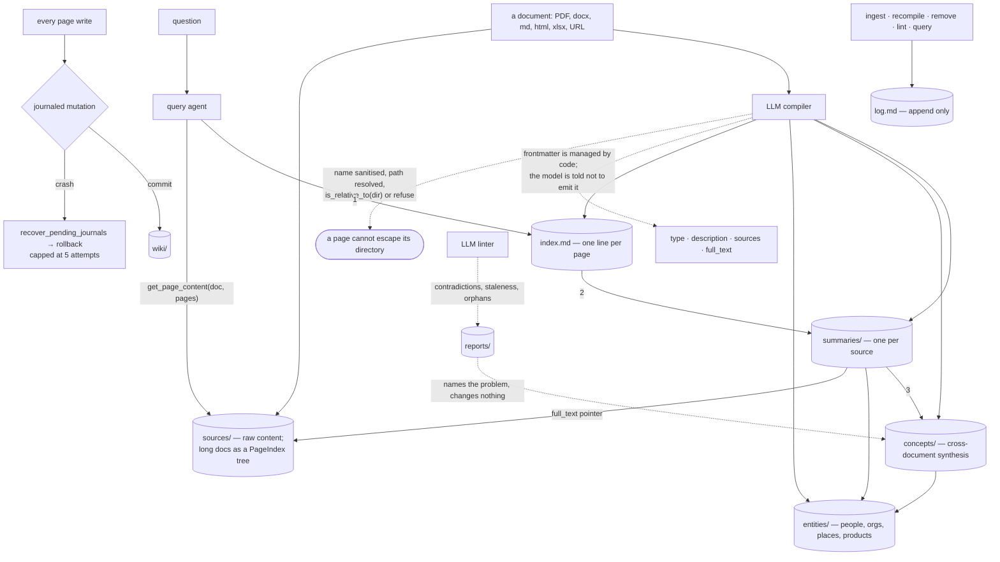

## 1. Executive Summary

OpenKB compiles documents into a wiki and then answers from the wiki. Apache-2.0,
18,989 lines under `openkb/` against **22,036 lines of tests across 63 files**,
175 commits since 4 April 2026.

The premise is stated against RAG directly: *"Traditional RAG rediscovers
knowledge from scratch on every query. Nothing accumulates. OpenKB compiles
knowledge once into a persistent wiki, then keeps it current."* The pages are
per-document summaries, cross-document concepts, named entities and saved
explorations, linked with `[[wikilinks]]` and catalogued in an `index.md`.

**There are no embeddings in the repository.** Not a vector store behind an
adapter — no embedding call, no cosine, no BM25, nothing. Retrieval is a query
agent that reads `index.md`, follows it into the page trees, and drops into a
source document by page range when it needs the detail. The index is not a thing
the retriever consults; the index *is* the retriever's map, and the model is the
retriever.

Two marks. The report's other finding is unrelated to any of that: a markdown
knowledge base with **journaled, fsync'd, rollback-capable writes**, which is
database machinery under a directory of `.md` files and is not something this
corpus usually finds.

## 2. Mental Model

A document arrives and is compiled once. What accumulates is a set of derived
pages that are claims about the corpus — *this document says X*, *these three
documents share concept Y*, *this organisation is Z* — and those claims can be
wrong, can go stale when a source changes, and are rewritten rather than
appended to.

Reading is navigation rather than search. The compiler's job is to leave behind
a structure a model can walk: an index with one line per page, summaries that
carry a `full_text` pointer back to the source, concepts that link the documents
they span, entities kept in sync across everything that mentions them.



## 3. Architecture

One directory per knowledge base — `wiki/`, `sources/`, `.openkb/` — with no
database and no vector service. Long documents are handled by
[PageIndex](https://github.com/VectifyAI/PageIndex), the same author's tree
indexer, which is what makes page-range access into a large PDF possible without
chunk embeddings.

The wiki's own schema is documented to the model in an `AGENTS.md` the code
generates, which is a neat inversion: the memory's structure is defined once and
handed to the agent that writes it and the agent that reads it.

## 4. Essential Implementation Paths

**Writes are transactional, which markdown stores almost never are.**
`mutation.py` stages files, hardlinks or copies for a snapshot, fsyncs both file
and directory, publishes atomically, and leaves a journal so an interrupted
mutation can be rolled back on the next lock acquisition. The retry cap has its
reasoning written down:

> Without a cap, a deterministically-failing rollback (e.g. persistent ENOSPC)
> is retried on every lock acquisition forever, re-doing the failed work and
> never releasing the backup dir + journal.

`recover_pending_journals` runs the recovery. Three tests assert that no journal
files remain after a successful mutation — the state that means the transaction
finished and cleaned up after itself.

**A model-chosen filename is contained after resolution, not before.** Concept
and entity pages are named by the compiling model. The write path sanitises the
name, resolves the path, and then checks it:

```python
path = (concepts_dir / f"{safe_name}.md").resolve()
if not path.is_relative_to(concepts_dir.resolve()):
    logger.warning("Concept name escapes concepts dir: %s", name)
    return
```

Sanitise-then-verify is the correct order, and the verification is the half most
implementations omit.

**Code owns the frontmatter and the model owns the prose.** The schema handed to
the compiler says so in as many words: *"Do not include YAML frontmatter (---) in
generated content; it is managed by code."* Every summary, concept and entity
page carries a non-empty `type:` because the Google
[Open Knowledge Format](https://cloud.google.com/blog/products/data-analytics/how-the-open-knowledge-format-can-improve-data-sharing)
requires it, plus a one-line `description:` and the `sources:` the page was built
from. A model that cannot write the metadata cannot forge the provenance.

## 5. Memory Data Model

A page is a markdown file with code-managed frontmatter. The fields are `type`,
`description`, `sources`, and on a summary a `full_text` pointer to the raw
document; the body is prose with wikilinks.

**Nothing on a page says how much to believe it.** There is no status, no
confidence, no verification flag, no validity date and no supersession pointer.
That matters more here than in most systems in this corpus, because the pages are
*synthesis* — a concept page is a claim assembled from several documents, and the
one thing the design cannot express is that the claim is disputed.

The linter knows this. `agent/linter.py` asks the model *"Do any pages make
conflicting claims about the same fact?"* and looks for contradictions,
redundancy, staleness and orphans. What it produces is a report under `reports/`.
The contradiction is found, written down where a person may read it, and the page
it concerns is served to the next query exactly as before. The README's
*"contradictions are flagged"* is true and the flag is not on the page.

## 6. Retrieval Mechanics

There is no retrieval system. Grepping `openkb/` for embeddings, vectors, cosine
or BM25 returns nothing but a comment about vector-rendered figures and one about
a language vector.

The query agent is given the wiki schema and a search strategy: read `index.md`
first, then summaries, then concepts, then entities for a named thing, and follow
a summary's `full_text` frontmatter into the source — `read_file` for a short
document, `get_page_content(doc_name, pages)` with tight page ranges for a
PageIndex tree. Up to 50 turns.

This is the index-and-pointer arrangement taken to its limit. It buys exact
provenance — every answer is reached by a path a person can retrace — and pays
for it in tokens and turns, with no ranking to fall back on when the index line
does not describe the page well enough for the model to know it should open it.
Nothing committed measures that failure mode.

## 7. Write Mechanics

Compilation is an LLM pass per document producing a summary, then concept and
entity updates across the corpus, published through the journaled mutation. A
`HashRegistry` over document content hashes decides what needs recompiling; a
watcher recompiles changed sources.

Recompilation **rewrites a page body in place** — the prompt asks for a full
rewrite rather than a delta, and the code replaces the body while preserving the
frontmatter and prepending any new source. So an entity page's history is not
kept, and what a page said before the last recompile is recoverable only from
version control the user happens to be running.

## 8. Agent Integration

A CLI, an HTTP API, a React frontend, and three generators over the wiki
foundation: query, chat, and a Skill Factory that turns compiled knowledge into
agent skills. The project cites Karpathy's description of the idea and adopts
Google's Open Knowledge Format for the page metadata.

Worth recording as a coincidence rather than a connection: *WikiSkill*
([arXiv:2608.27454](https://arxiv.org/abs/2608.27454), 27 August 2026) proposes
co-evolving agent skills with a persistent wiki, and reports an ablation finding
that the accumulated wiki is what makes the skills work. Two independent projects
arrived at compile-experience-into-a-wiki within the same month, one as a shipped
CLI and one as a paper with no code.

## 9. Reliability, Safety, and Trust

The write mechanics are the strongest part and are strong in an unfashionable
way: crash safety, atomic publish, rollback, a containment check on a
model-supplied path. A markdown knowledge base that survives being killed
mid-recompile is rarer in this corpus than any retrieval trick.

The epistemic side is where it is thin, and the two gaps compound. A page has no
status, so a contradiction cannot be recorded on it; and a recompile rewrites the
body, so the previous claim is gone. Between them, a wrong synthesis is corrected
silently or not at all, and the only durable trace is `log.md` saying that a
recompilation happened.

`log.md` is the one mark on this axis and its limits should be read with it: it
is append-only and it does record mutations, and an entry is a timestamp, an
operation word and a free-text description. `recompile` logs how many pages were
recompiled and skipped, not which. Queries share the file.

## 10. Tests, Evals, and Benchmarks

63 test files and 22,036 lines against 18,989 of implementation — more test than
product, which at this size is unusual and worth saying. Nothing was run for this
review.

The suite is aimed at the machinery: `test_mutation.py` asserts no journal
survives a completed mutation, `test_recompile.py` asserts no `.bak` file is left
behind, `test_list_status.py` pins what the CLI does and does not print. Those
are real negative assertions about *state*, and none of them is about retrieval.

**`negative_eval` is withheld.** No committed case establishes that particular
material stays out of an answer — which is a harder gap here than usual, because
the retriever is a model walking an index, so the natural failure is that it
opens the wrong page or stops early, and nothing measures either.

No benchmark result is committed and none is claimed. Given that the system's
central bet is that a compiled wiki beats vector RAG on the same corpus, the
absence of a head-to-head against a vector baseline is the measurement this
project most obviously needs — and by [the rule this atlas has been
sharpening](../../benchmarks/#a-memory-the-system-can-route-around-is-one-nobody-ever-exercises),
the questions it would have to use are the ones a single-document lookup cannot
answer.

## 11. For Your Own Build

**Journal your markdown.** A knowledge base of files is still a database, and
`mutation.py` is the smallest complete example this corpus has of staging,
fsync, atomic publish, journal and capped rollback over a directory tree.

**Verify a model-chosen path after resolving it.** `is_relative_to` on the
resolved path, after sanitising the name, is two lines and closes the whole
class.

**Let code own the frontmatter.** Telling the compiler *"do not include YAML
frontmatter; it is managed by code"* means a model cannot invent its own
provenance, which is the field you least want it writing.

**If you can find a contradiction, put it on the page.** A linter that writes
`reports/` has done the hard part — the detection — and stopped one field short
of the read path noticing.

## 12. Open Questions

**What happens to a page's previous claim?** Recompilation is a full body
rewrite with no version kept. Whether a user is expected to run the whole KB
under git is not stated anywhere read here.

**Does the index line carry enough for the agent to know it should open a page?**
The entire retrieval strategy rests on a one-line description per page. Nothing
committed measures how often the walk misses.

**How does it compare to a vector baseline on the same corpus?** The premise is a
comparison and no artifact makes it.

## Appendix: File Index

| Path | What it holds |
| --- | --- |
| `openkb/schema.py` | The wiki layout and the `AGENTS.md` schema handed to the compiling and querying agents |
| `openkb/mutation.py` | Snapshots, journals, atomic publish, `recover_pending_journals`, the retry cap |
| `openkb/agent/compiler.py` | Page writing, the name sanitiser and the containment check |
| `openkb/agent/query.py` | The search strategy — index, summaries, concepts, entities, page ranges |
| `openkb/agent/linter.py` | The contradiction, staleness and orphan prompts |
| `openkb/log.py` | `append_log` and `wiki/log.md` |
| `openkb/api_pages_router.py` | Read, edit, delete and backlinks for a page |
| `openkb/frontmatter.py`, `openkb/documents.py` | Code-owned metadata and the content-hash registry |
| `tests/test_mutation.py`, `tests/test_recompile.py` | The journal and leftover-file assertions |

## History

**2026-08-29** — [`ff54396e575ee6feb0113b631a34caa082b441cc`](https://github.com/VectifyAI/OpenKB/commit/ff54396e575ee6feb0113b631a34caa082b441cc) — first reading, Apache-2.0, 18,989 lines under `openkb/` and 22,036 across 63 test files, 175 commits since 4 April 2026. Screened before reading: one auto-run surface, one build-time execution surface, one unpinned surface, and both lockfiles unchanged for more than a month; `AGENTS.md` and `CLAUDE.md` are addressed to a reading agent and were treated as data. Nothing was installed and nothing was run. Two marks. `audit_log` rests on `wiki/log.md`, opened in append mode with no rewrite path, carrying `ingest`, `recompile` and `remove` beside `query` and `lint`. `human_review` rests on the page API and frontend — read, edit, delete and backlinks over a compiled page. `trust_state` is withheld and it is the report's sharpest absence: an LLM linter looks for pages that *"make conflicting claims about the same fact"* and writes what it finds into `reports/`, and no field on the page it concerns changes. `scope_enforced` is withheld on the same basis as [MemBukkit](../membukkit/) — the boundary is the knowledge-base directory rather than a key on a record, and no query filters on one. `tombstone` and `bitemporal` are absent: `hashes.json` is a content registry for change detection, not a record of a rejected value, and a page carries no time. `negative_eval` is withheld — the suite's negatives are about journals, leftover files and CLI output, not about material staying out of an answer. `stack_retrieval` is empty because there is none of the three arms in the tree: no embeddings, no vectors, no BM25, and retrieval is a query agent walking `index.md`. The reading covers the schema, the compiler, the query and lint agents, the mutation layer, the log and the page API; the frontend, the Skill Factory, the deck generator and the PageIndex dependency were not traced.
