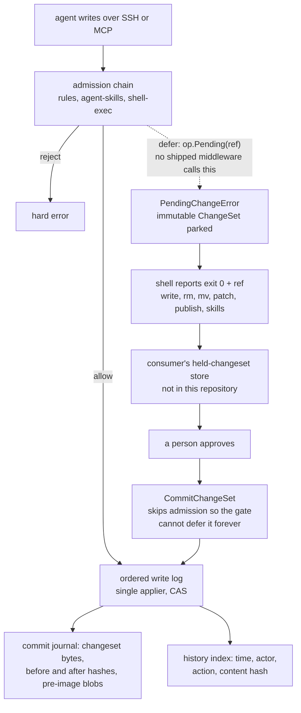

## 1. Executive Summary

OpenLore is an agent-native knowledge base that serves shared Markdown to agents
over SSH and MCP as a virtual filesystem scoped to each identity. What is
notable is the read boundary: a nested docset overrides a grant on its ancestor,
and every command that reads files inherits that without knowing docsets exist.
What is weak is everything that would make the Markdown a memory rather than a
folder — a human-approval seam with no producer outside tests, and a lifecycle
vocabulary no read path filters on.

There is no ingestion pipeline, no vector database and no model in the path. The
README says so as a design position rather than a limitation, and the code
agrees. An agent reads with `ls`, `cat`, `grep` and `find`, or through MCP; a
person reads through a read-only web dashboard over the same scoped filesystem.

The scoping is the most carefully built part of this system. Each identity holds
grants on named docsets, and a session's filesystem is wrapped so reads are
confined to the display roots it may read. Every docset root is also a
carve-out: a path is readable only when the *most specific* docset covering it
is granted, so a grant on the root docset does not reach into a nested one.
Startup refuses three shapes outright — a grant no plugin provides, a writable
`guest` grant, and two docsets sharing a display root. The last is refused
because "read scoping resolves the governing docset by root length while write
authorization (`mostSpecificDocset`) breaks ties by name, so the two could
disagree on who governs the shared subtree."

The carve-out has one reader that skips it. The shell `history` command filters
the global journal by plain prefix over the granted roots, so an identity
granted the root docset lists the paths, principals, actions and content hashes
of every committed change inside nested docsets it cannot read
(`history.go:404-411`, `:437`).

The approval machinery is complete everywhere except at the point of asking a
person. `PendingChangeError` is defined and documented as "NOT a failure". Six
shell commands — `write`, `rm`, `mv`, `patch`, `publish`, `skills` — catch it
and report exit 0 with a reference. The inbox handles it, and
`WriteOp.Pending(ref)` is the helper a middleware calls to park a change.
`CommitChangeSet` is the resume path, guarded so "the approval middleware
[cannot] defer it again in an infinite loop." Nothing in the tree calls
`Pending`; outside tests, `&PendingChangeError{` appears once, inside that
helper. The three write middlewares that ship validate or reject.

Until 24 September 2026 the README's tagline offered "human approval when you
need them". It reads "identity-scoped access, controlled writes and validation
when you need them", and `docs/write-system.md` states that "OpenLore core does
not store or replay pending changes. This is the seam a review or approval
plugin builds on." The code comment names the absent consumer: "the
knowledge-backend approvals plugin."

Three marks. `scope_enforced` and `negative_eval` rest on the same access model
and its tests, with the history query as the stated exception. `audit_log` is
earned on an append-only mutation journal with attribution, before and after
hashes and pre-image blobs. `human_review` is withheld, and `trust_state` is
withheld because OKF defines `draft` / `stable` / `deprecated` and a `verified`
event list, validates both on write, and no read path filters on either.

## 2. Mental Model

A memory here is a file, and the design's whole argument is that this is enough
if the boundary around the file is real. Nothing is extracted, embedded,
summarised or scored. What makes the knowledge base more than a shared folder is
three things layered on the filesystem: who may see which subtree, what a write
must satisfy before it lands, and what is recorded once it does.

Reads go through a per-session filesystem that only exposes granted docsets.
Writes go through an admission chain of middleware, then into a single ordered
log with one applier, so a compare-and-swap runs against current state with no
concurrent writers — and because mkdir, remove and write all flow through the
same log, "a write can never race ahead of (or land on) a removed path."

The admission chain is where judgement was meant to live. A middleware may allow
the write, reject it, or *defer* it — returning a `PendingChangeError` that
parks an immutable, content-addressed `ChangeSet` for someone to approve later.
The `ChangeSet` "deliberately carries no approver / status / capability /
proposer fields: those are the consumer's policy concern, not part of the
content-addressed change." That is a clean separation, and it is also the reason
the approval story can be entirely absent while every part that surrounds it
looks finished.

A file stops being a belief in one way: someone overwrites or removes it. The
removal is recorded with its actor and its pre-image, and nothing records that
the content was wrong, so the same text can be written back.



## 3. Architecture

One Go binary serving SSH, HTTP and MCP, and the knowledge is ordinary Markdown
on disk. The virtual filesystem in `pkg/vfs` and `pkg/openlore/vfs.go` maps
configured paths onto display roots, so the tree an agent walks is a projection
rather than the layout on disk. Aliases expose the same content at a second
display root while the first stays canonical for "home, inbox, policy, hooks,
and changesets."

The shell is not a wrapper around a system shell. `pkg/shell` implements its own
lexer, parser and command set against the virtual filesystem: `awk` at 1,326
lines and `jq` at 2,195 are real reimplementations, beside `cut`, `comm`,
`diff`, `du`, `expr`, `find`, `grep` and the rest. That is the retrieval layer.
There is no index and no ranking, and the one mention of vectors in the tree is
a comment marking where a plugin could add "hybrid/vector retrieval behind this
interface."

Identity is configured rather than discovered. An identity holds roles, a `home`
docset whose display path becomes `$HOME` and the session's working directory,
and a list of `match` predicates resolving token claims to it — including
workload-identity-federation exchanges matching on `sub`, `sub_prefix`, `aud` or
`claims` with narrowing scope and TTL. Grants are named and registered by
plugins, which is why an unregistered grant is a startup failure rather than a
silent denial. Docsets and grants live in the auth file; a server started
without one enforces nothing, every session sees the whole merged tree, and the
dashboard refuses to serve (`server.go:217-225`, `:1044`, `dashboard.go:75`).

What an operator runs is the binary plus a config; there is no database. A
writable server keeps three history stores under `<data_dir>/history/`
(`server.go:353-387`):

- `events.jsonl` and per-file shards in a directory whose path segments are
  SHA-256 hashes, so "file history queries never scan unrelated history".
- `commits.jsonl`, one `CommitRecord` per commit, sealed daily into zstd
  segments and pruned only when `analytics.history.retention` is set.
- `objects/`, content-addressed pre-images of every overwritten or removed
  file, on by default through `analytics.history.blobs`.

A separate `audit/events.jsonl` records logins, token exchanges and config
changes, not content (`audit.go:28`, `server.go:204`).

An analytics service, on by default, records sessions and commands, keeps
per-file byte, line and token facts, and materialises its aggregations in
SQLite for the dashboard.

## 4. Essential Implementation Paths

- **Session construction** — `server.go:1045` wraps the canonical session
  filesystem: `newScopedReadFS(sessionFS, s.readableRoots(id), s.allDocsetRoots())`.
  The dashboard reads through the same view (`dashboard.go:184`), and so does
  the `/lore` browser (`server.go:1857`).
- **Read scope** — `authz.go:491` `readableRoots` collects granted display roots
  plus system mounts; `authz.go:526` `scopedReadFS` applies the most-specific
  docset rule on Stat, ReadDir and ReadFile.
- **History scope** — `server.go:1290` hands the shell
  `historyRoots(s.sessionDocsets(id))`; `history.go:404` `historyReadable` is a
  prefix test over those roots.
- **Startup validation** — `authz.go:22` `validateGrants` fails closed on an
  unregistered grant, a writable guest grant, and a shared display root.
- **Admission** — `middleware.go:38` documents the three outcomes; `:95`
  `WriteOp.Pending` builds the deferral; `server.go:977` restates the contract.
- **Ordered apply** — `writelog.go:101` `run` is the single serialized applier
  and the sole writer to the substrate; `Submit` blocks until applied, which is
  why the log is "in-memory and non-durable by design".
- **Commit journal** — `writelog.go:127` captures pre-images before the commit,
  `:148` appends the `CommitRecord`, `:156` records the index entries.
- **History index** — `history.go:205` `Record` appends to `events.jsonl` and
  the per-file shards; `:291` `Query` reads the global journal or one shard.
- **Format validation** — `okf_plugin.go:85` calls `okf.Validate` on write;
  `pkg/okf/families.go` holds the shape checks.

## 5. Memory Data Model

The unit is a Markdown file. Optional frontmatter follows OKF — the Google Open
Knowledge Format, an external spec this project validates against rather than
one of its own, read from the `okf_version` declaration in the root `index.md`.
Its v0.2 families cover provenance (`generated` with an ISO 8601 `at`), trust
(`verified` as a list of `{by, at}` events), lifecycle (`status`,
`stale_after`) and attested computation.

That vocabulary is the most interesting thing in the data model and the least
load-bearing. `CheckStatus` accepts exactly `draft`, `stable` and `deprecated`
and warns on anything else; absent means stable and "is never a finding".
`CheckVerified` requires each event to carry a non-empty `by` and a valid
timestamp, normalising a bare mapping to a one-element list. `CheckStaleAfter`
insists on an absolute `YYYY-MM-DD` rather than a relative TTL, which is a good
call — a relative TTL in a file that outlives its author means nothing.

All three are shape checks that emit warning diagnostics at write time. `lore
meta` passes every frontmatter field through to its output, `status` included,
and the one plugin-supplied metadata filter selects agent skills
(`agent_skills_plugin.go:636`). No read in the server, the shell or the virtual
filesystem selects on `status`, `verified` or `stale_after`. A document marked
`deprecated` is listed, catted and grepped exactly like a stable one, and a
`stale_after` date that has passed changes nothing.

The history index record is thin: commit id, time, attribution, file key,
action, content hash. It "deliberately excludes mutation payloads". The
`CommitRecord` beside it does not: it serialises the committed changeset, write
bytes included, and a `LeafRecord` per path with `before_hash`, `before_size`,
`after_hash` and `after_size` (`history_blobs.go:25-42`).

## 6. Retrieval Mechanics

There is no ranking, because there is no retrieval engine. An agent runs `grep`
or `find` over the scoped tree and reads what comes back, which means recall is
exactly as good as the agent's query and the corpus's organisation — and,
unusually for this atlas, entirely inspectable. A human can run the same command
and get the same bytes.

The scoping is what makes this defensible at more than one identity. Because the
filter is on the filesystem rather than on a query layer, every command that
reads files inherits it: `grep -r /` from a guest session cannot match inside a
docset the guest was not granted, without `grep` needing to know that docsets
exist. Retrofitting a scope predicate onto forty command implementations would
have been the obvious way to get this wrong.

Reads are also where the docset carve-out rule earns its complexity. Granting an
identity the root docset is the natural way to say "can see the general
knowledge base". Without the carve-out that grant would silently include every
nested docset — the per-agent and per-user namespaces — because they live
underneath it on the same backing filesystem. The rule inverts that default: a
nested docset overrides its ancestor, so nesting is a boundary rather than
inheritance.

`history` is the one read command that does not read files, and it does not get
the rule. It reads `events.jsonl` through `historyReadable`, which accepts any
record under a granted root and treats `/` as covering everything
(`server.go:705-710`). The dashboard's and the browser's per-file history call
`Stat` through the scoped filesystem first and return nothing for a nested file.

## 7. Write Mechanics

Every mutation is a `ChangeSet` — immutable, serialisable, content-addressed,
with the action discriminating the payload. Directories are first-class entries
so mkdir and remove are logged operations too, which is what lets the single
applier order a write against a remove rather than racing it.

Writes are compare-and-swap. A `ReadTracker` on the session filesystem remembers
the content hash of everything read during the session, so a whole-file
overwrite is checked "against the version the caller last saw — without the
caller naming a hash", and fails if the file changed since. That is the right
default for an agent that read a file, thought about it, and is writing it back
several turns later.

The write log is in-memory and non-durable, and the reasoning is sound rather
than a shortcut: `Submit` blocks until the applier replies, so "nothing is ever
'accepted' until it is applied and durable in the substrate". A write is
readable as soon as `Submit` returns, and no background pass rewrites content.

Inside the applier, before the substrate commit, `capturePreImages` stats and
reads each target and stores its bytes as a blob. After the commit the applier
appends the `CommitRecord` with `fsync` and then the index records
(`writelog.go:109-160`). A journal or index failure is logged and does not undo
the durable write. Attribution — principal, optional delegate, actor kind — is
recorded with each commit, which is what makes the history answer "who".

## 8. Agent Integration

SSH is the headline and MCP is the one that will matter more. The same scoped
filesystem backs both, which is the point: there is one access model rather than
one per protocol. `ssh openlore.sh agents >> AGENTS.md` generates the block that
tells an agent how to reach the knowledge base, and `ssh openlore.sh teach`
pipes setup instructions into an agent CLI.

The skills surface is the most agent-specific part — `pkg/agentskills` and
`pkg/shell/cmds/skills.go` import, enable, disable and validate skill bundles,
and `skills.go` is one of the six commands that handles a parked change,
setting `r.Status = "pending"` and reporting rather than failing.

The dashboard is for people. It serves session, tree, context, file, raw,
history, access and usage endpoints on GET only, answers any other method under
`/dashboard/api/` with 405, and sets `Cache-Control: private, no-store`
(`dashboard.go:70-124`). Its usage view counts reads, hits, and human versus
agent writes per day for a path. The `analytics` command, gated on
`lore:analytics:admin`, lists least-read files, folders and lines and the search
patterns that returned nothing — a read-frequency signal, not a correctness one.

## 9. Reliability, Safety, and Trust

**Scope — earned, and the nesting rule is the reason.** Covered in section 6.
The startup check that refuses two docsets sharing a display root is the other
half: two subsystems that would resolve the same tie differently are refused at
config load instead of producing an inconsistent authorization model at
runtime. The mark carries two limits. The wrap exists only when an auth file is
configured. And `history`, a read-class command every session holds, filters by
prefix and not by the carve-out, so the boundary protects file content and not
the record of who changed it (`actions.go:30-47`, `history.go:404-411`).

**Audit — earned.** Every committed mutation is appended to `events.jsonl` and
its per-file shard, removes included, and to `commits.jsonl` with the changeset
and before and after hashes. A remove carrying a commit id — every remove the
applier records — joins its shard rather than purging it, so a file-scoped query
after a delete answers "deleted at T by X". The purge survives only for legacy
records without a commit id (`history.go:231-248`).

**What the audit keeps is the other side of it.** A removed file's content
stays in `objects/` and in the journal's write bytes. `history gc` deletes only
blobs no retained record references, and with no retention every record is
retained. `docs/openlore-yml.md` says the blobs exist "so `history` can show
diffs"; the readers of `objects/` in the tree are the analytics scalar
processor and `history gc`.

**Human review — withheld.** The mark asks for a surface where a person
inspects, approves or adjudicates. Everything around that surface exists: the
deferral error, its documentation as an informational outcome, six commands
that handle it, the inbox path, the resume entry point, the guard against
deferring a resumed change forever, and an exported `RegisterPlugin` seam naming
the plugin that would supply it. The producer does not. `op.Pending(...)` is
called in `middleware_test.go`, `server_seams_test.go` and `inbox_http_test.go`
and nowhere else. It is unwired *by design* — the project's own docs call it a
seam — and a reader choosing a system for its approval workflow would be
adopting an interface, not a workflow.

**Trust state — withheld, and this is the clean version of a common trap.** OKF
has everything the mark's shape asks for: a discrete vocabulary
(`draft`/`stable`/`deprecated`), a separate trust family recording who verified
a document and when, a written spec with section numbers, and validation that
runs on every write. What it does not have is a read that excludes anything.
The state answers "what is this document's standing" and nothing ever asks.

**Tombstone — withheld.** A search for `tombstone`, `rejected_`, `blocklist` and
`denylist` across the Go sources returns nothing. A remove deletes the file and
records the deletion; nothing records that its content was wrong, so nothing
prevents the same text being written back.

**Bitemporal — withheld.** No `valid_from`, `valid_at`, `as_of` or
`effective_date` anywhere. History records carry one `Time`, the commit instant.

## 10. Tests, Evals, and Benchmarks

The suite is broad and mostly paired with the file it tests — the command set
alone has a `_test.go` beside nearly every implementation, which is what a
reimplementation of `awk` and `jq` requires to be trustworthy.

The access-control tests are built the right way round.
`TestScopedReadFS_HidesUngrantDocsetAncestorsFromRootGrant` seeds four
namespaces with distinct content, then asserts that a root-granted guest's
listing contains none of `agent`, `user` or `channel` and that `Stat` and
`ReadDir` on each fail. In the same function a second identity granted the
nested `/agent/jared` docset must navigate `/agent` and read
`/agent/jared/secret.md`, so the fixture cannot pass by being empty.
`TestScopedReadFS_HidesSiblingDocsets` repeats the pattern for siblings.

`TestDashboardScopesFilesFactsAndHistory` carries the same shape to HTTP. A
nested `private-child` docset holds `SENSITIVE_NESTED_CONTENT`, and seven
endpoints must answer 404 without that string for the nested file, its alias
spelling and a file in an ungranted docset. The same function requires
`/public/other.md` in the root context with exact byte, character and line
facts, then revokes the grant and asserts the next request is refused
(`dashboard_test.go:281-324`). The shell `history` tests use a single `/docs`
root and no nested docset (`history_test.go:62`, `:271`).

`TestWriteLog_CommittedDeleteAdvancesHistoryHead` writes and removes a file
through the log and asserts the file-scoped query returns both records with the
remove first and a commit id set (`writelog_test.go:483-505`).

`okf_plugin_test.go` asserts that an OKF rejection is "a hard error, not a
`PendingChangeError` which would be mis-read as 'pending'". The two outcomes are
adjacent in the middleware contract, and confusing them would turn a refusal
into a silent parking. The deferral tests are thorough about the protocol and,
read against the producer search, they are the whole population of it.

No paper. A search of the README and `docs/` for `arxiv`, `bibtex`, `@article`,
`citation` and `doi` finds nothing, and there is no `CITATION.cff`. There is no
benchmark and no retrieval evaluation committed; the analytics tables measure
production reads, not a labelled set.

I ran no suite: nothing was installed, built or run for this reading.
`dashboard/package.json` and its lockfile changed inside the seven-day cooldown,
and the `Makefile` is an execution surface.

## 11. For Your Own Build

### Steal

- **Make nesting a boundary, not inheritance.** A grant on `/` that silently
  includes every per-user docset underneath it is the default most systems ship.
  Resolving the *most specific* docset and letting it override the ancestor
  inverts it, and it is a few lines.
- **Fail closed at startup on an authorization config that two subsystems would
  read differently.** Two docsets sharing a display root is refused because read
  scoping resolves by root length and write authorization by name. That class of
  bug is invisible until someone reads the wrong file.
- **Put the scope on the filesystem, not on the query.** Forty commands inherit
  the boundary without knowing it exists.
- **Compare-and-swap against what the caller last read**, tracked by the session
  rather than named by the caller. An agent writing back a file it read six
  turns ago gets a conflict instead of clobbering.
- **Keep the approver out of the change.** A content-addressed `ChangeSet` that
  carries no status or approver field can be parked, replayed and verified
  independently of whatever policy decided to hold it.
- **Guard the resume path against the gate that parked it.** `CommitChangeSet`
  skips admission precisely so an approved change cannot be deferred again.
- **Record the pre-image hash beside the post-image hash.** A `LeafRecord` with
  both says what a commit replaced, not only what it wrote.

### Avoid

- **A second read path with its own predicate.** `history` re-implements scope
  as a prefix test and loses the carve-out the filesystem wrap enforces. Derive
  every scoped read from one function, or test each against the nested case.
- **Shipping a vocabulary no read consults.** `draft`/`stable`/`deprecated` is
  validated on write and ignored on read, so a deprecated document is served
  like any other. Either filter on it or do not define it.
- **A validated `stale_after` that expires nothing.** The insistence on an
  absolute date is right and nothing acts on the date.
- **An audit store that keeps deleted content with no retention by default.**
  Removing a file does not remove its bytes from the journal or the blob store;
  forgetting requires an operator to set retention.
- **Naming the absent component in a comment and nowhere else.** "The
  knowledge-backend approvals plugin" is the only description of the thing the
  approval seam depends on.
- **A large parser surface on the read path.** `awk` and `jq` at 1,326 and 2,195
  lines are well tested here, and they are two parsers an operator depends on
  for correct reads.

### Fit

Take OpenLore if several agents, repositories or people must read the same
Markdown and the important requirement is *who may see which file*. That part
is built, tested and thought through, and it is hard to retrofit. The absence of
an index is a feature at this scale: a human can reproduce any agent's read with
the same command, which is worth more than ranking for a corpus of runbooks and
skills. The carve-out rule, the startup consistency check and the filesystem
wrap depend on nothing else in OpenLore and can be borrowed whole. If the paths
and authors inside a nested docset are themselves sensitive, patch
`historyReadable` first.

It fits badly as the memory an agent writes to from its own experience. Nothing
extracts, nothing consolidates, nothing decays, and nothing records that a
document became wrong — the lifecycle vocabulary exists and is inert. Recall
degrades the way a shared drive degrades, by growing, and the analytics show
which parts nobody reads without saying which parts are false.

If the deciding factor is human approval of agent writes, you are adopting a
protocol and implementing the middleware and the held-changeset store yourself,
against an interface with no non-test implementation in this repository. The
parts that are here are the parts that are easy to get subtly wrong. Do not
adopt this for retrieval quality; it does not compete on that axis and does not
claim to.

## 12. Open Questions

- Is the approvals plugin public, and is the held-changeset store it needs
  specified anywhere beyond the `ChangeSet` contract?
- Will anything ever read OKF `status` and `verified`, or are they intended
  purely as metadata for the reading agent to interpret?
- Is the prefix-only history filter intended — history as operator metadata —
  or should it take the boundaries `newScopedReadFS` applies?
- What happens to a parked `ChangeSet` whose target has since been removed by an
  earlier-approved change — the applier orders writes against removes, but the
  parked change was admitted against a tree that no longer exists.

## 13. Appendix: File Index

**Access control**

- `pkg/openlore/authz.go` (`:22` `validateGrants`, `:491` `readableRoots`,
  `:526` `scopedReadFS`, `:539` its constructor, `:633` `within`)
- `pkg/openlore/authorize.go`, `identity.go:19`
- `pkg/openlore/server.go` (`:217-225` auth enforced only with an auth file,
  `:705` `pathWithinRoot`, `:1034` `buildCanonicalSessionFS`, `:1045` the
  per-session wrap, `:1290` the history roots)
- `pkg/openlore/dashboard.go` (`:70` `dashboardAuth`, `:100` routes, `:184`
  `dashboardPath`, `:556` history)
- `internal/config/config.go` (`:369` `DocsetAccess`, `:405` `DocsetSpec`,
  `:490` identity roles)

**Writes and the approval seam**

- `pkg/vfs/changeset.go` (`:14` actions, `:42` the `ChangeSet` contract,
  `:652` `PendingChangeError`)
- `pkg/openlore/middleware.go` (`:38` the three outcomes, `:95` `Pending`)
- `pkg/openlore/writelog.go:101`, `server.go` (`:825` `RegisterPlugin`,
  `:856` `CommitChangeSet`, `:977` the middleware contract)
- `pkg/openlore/rules_plugin.go:259`, `agent_skills_plugin.go:570`,
  `shellexec.go:143` — the three shipped write middlewares

**History**

- `pkg/openlore/history.go` (`:25` the record, `:55` the recorder contract,
  `:70` the JSONL store, `:205` `Record`, `:291` `Query`, `:404`
  `historyReadable`, `:437` the shell query)
- `pkg/openlore/history_blobs.go` (`:25` `CommitRecord`, `:33` `LeafRecord`,
  `:143` `capturePreImages`, `:203` `appendCommitRecord`, `:705`
  `RotateCommitJournal`, `:942` `GarbageCollectHistoryBlobs`)
- `pkg/shell/cmds/history.go`, `registry.go:72`, `actions.go:30`

**Format**

- `pkg/okf/families.go` (`:127` `CheckVerified`, `:159` `CheckStatus`,
  `:175` `CheckStaleAfter`), `version.go:17`, `okf.go`
- `pkg/openlore/okf_plugin.go:85`, `pkg/openlore/meta/meta.go`

**Retrieval surface**

- `pkg/shell/shell.go`, `parser/`, `cmds/` (`grep.go`, `find.go`, `cat.go`,
  `awk.go`, `jq.go`, `skills.go`, `write.go`, `rm.go`, `mv.go`, `patch.go`,
  `publish.go`, `lore_meta.go`)
- `pkg/vfs/vfs.go` (`:255` `WriteScopeFS`, `:271` `ReadTracker`)
- `internal/analytics/aggregations.go:61-65` — the usage tables

**Tests**

- `pkg/openlore/authz_test.go:310-365`, `dashboard_test.go:281-324`,
  `writelog_test.go:483-505`, `history_test.go:216-233`, `middleware_test.go`,
  `server_seams_test.go`, `middleware_fs_test.go`, `okf_plugin_test.go:230`,
  `pkg/shell/cmds/pending_change_test.go`

### Commands behind the absence claims

```sh
grep -rn '&PendingChangeError{' --include='*.go' . | grep -v '_test'
grep -rn '\.Pending(' --include='*.go' .
grep -rni 'approvals plugin\|ApprovalMiddleware\|approvalPlugin' --include='*.go' .
grep -rn 'WriteMiddleware() \[\]WriteMiddleware' --include='*.go' . | grep -v '_test'
grep -rn '"status"\|"verified"\|"deprecated"\|stale_after' --include='*.go' \
  pkg/openlore/ pkg/vfs/ pkg/shell/ internal/ | grep -v '_test'
grep -rn 'okf\.' --include='*.go' pkg/openlore/ | grep -v '_test'
grep -rn 'Selector' --include='*.go' pkg/ | grep -v '_test'
grep -rni 'tombstone\|rejected_\|blocklist\|denylist' --include='*.go' pkg/ internal/ | grep -v '_test'
grep -rni 'valid_from\|valid_at\|as_of\|asOf\|effective_date' --include='*.go' pkg/ internal/ | grep -v '_test'
grep -rni 'embedding\|vector\|cosine\|bm25' --include='*.go' pkg/ internal/ | grep -v '_test'
grep -rn -i 'arxiv\|bibtex\|@article\|citation\|doi' README.md docs/
grep -rn 'newScopedReadFS(' --include='*.go' .
grep -n 'func historyReadable' -A7 pkg/openlore/history.go
grep -n 'func pathWithinRoot' -A5 pkg/openlore/server.go
grep -rn 'blobs\.Get(' --include='*.go' pkg/ internal/ | grep -v '_test'
grep -rn 'historyRoots\|scopedHistory{' --include='*_test.go' pkg/
grep -n 'human approval' README.md
```

## History

**2026-09-26** — [`d1038017ecf78655ab8080ce78e7c9ec7372e4ea`](https://github.com/aakarim/OpenLore/commit/d1038017ecf78655ab8080ce78e7c9ec7372e4ea) — 37 commits on, the v0.7.2 release. Screened again: `dashboard/package.json` and its lockfile inside the 7-day cooldown, the `Makefile` an execution surface; nothing installed, built or run. No mark moved. The applier gained a commit journal with before and after hashes and pre-image blobs, and a remove keeps its per-file history, which closes the audit caveat ([section 9](#9-reliability-safety-and-trust)). A read-only dashboard reads through the same scoped filesystem, with a committed negative case. The README dropped human approval from its tagline on 24 September 2026. One published claim was wrong at both pins: the `history` command filters by plain prefix, so an ancestor grant lists records inside nested docsets it cannot read, where the report called every session read confined.

**2026-09-13** — [`dbd44007d63159f26002ac07986b8e96bf82eb68`](https://github.com/aakarim/OpenLore/commit/dbd44007d63159f26002ac07986b8e96bf82eb68) — first reading. Screened first: `go.mod` and `go.sum` changed the day of the pin and sit inside the 7-day cooldown, and the `Makefile` is a build-time execution surface. Nothing was installed and no suite was run. Three marks. `scope_enforced` is earned on a per-session filesystem wrap confining reads to granted docset roots, where every docset root is also a carve-out so a nested docset overrides an ancestor grant, with startup failing closed on an unregistered grant, a writable guest grant, and two docsets sharing a display root. `audit_log` is earned on an append-only `events.jsonl` carrying time, attribution, action and content hash for every committed mutation, with the stated limit that a remove purges that file's per-file query shard. `negative_eval` is earned on access tests naming files a given identity must not see, over a populated fixture, with the positive control in the same function. `human_review` is withheld: the deferral protocol is complete — the error type, six commands handling it, the inbox, the resume path and its re-admission guard — and the only callers of `WriteOp.Pending` are three test files, with the approvals plugin named in a comment and absent from the repository. `trust_state` is withheld because OKF validates `draft`/`stable`/`deprecated` and a `verified` event list on write and no read path filters on either. `tombstone` and `bitemporal` are withheld on searches recorded in the appendix.
