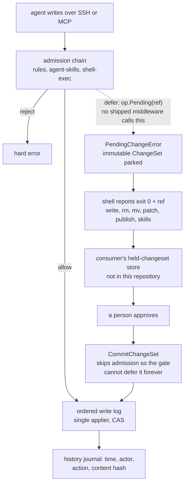

## 1. Executive Summary

OpenLore is an agent-native knowledge base — Apache-2.0, about 38,600 lines of
Go excluding tests — that serves shared Markdown to agents over SSH as a virtual
filesystem. There is no ingestion pipeline, no vector database and no model in
the path; the README says so as a design position rather than a limitation, and
the code agrees. An agent reads with `ls`, `cat`, `grep` and `find`, or through
MCP, and what it sees is scoped to its identity.

The scoping is the most carefully built part of this system, and it goes
further than the design needed.
Each identity holds grants on named docsets; a session's filesystem is wrapped
so reads are confined to the display roots it may read. The detail that makes it
a boundary rather than a prefix match is that every docset root is also a
carve-out: a path is readable only when the *most specific* docset covering it
is granted, so a grant on the root docset does not reach into a nested one.
Startup then refuses three shapes outright — a grant no plugin provides, a
writable `guest` grant, and two docsets sharing a display root, that last one
because "read scoping resolves the governing docset by root length while write
authorization (`mostSpecificDocset`) breaks ties by name, so the two could
disagree on who governs the shared subtree."

The finding is the other half of the product promise. The README offers
"identity-scoped access, controlled writes, validation and human approval when
you need them", and three of those four are in this repository. The approval
machinery is remarkable for how complete it is everywhere except at the point of
asking a person: `PendingChangeError` is defined and documented as "NOT a
failure"; six shell commands — `write`, `rm`, `mv`, `patch`, `publish`,
`skills` — catch it and report exit 0 with a reference; the inbox handles it;
`WriteOp.Pending(ref)` exists as the helper a middleware calls to park a change;
`CommitChangeSet` is the resume path, and carries a guard against re-running
admission so "the approval middleware [cannot] defer it again in an infinite
loop." Nothing in the tree calls `Pending`. Outside tests, the string
`&PendingChangeError{` appears once, inside that helper. The three write
middlewares that ship — rules, agent-skills, shell-exec — validate or reject;
none defers. The seam names its absent consumer in a comment: "the
knowledge-backend approvals plugin."

Three marks. `scope_enforced` and `negative_eval` rest on the same access model
and its tests. `audit_log` is earned on a genuine append-only mutation journal
with attribution. `human_review` is withheld, and `trust_state` is withheld for
a reason worth reading in section 9: OKF defines `draft` / `stable` /
`deprecated` and a `verified` event list, validates both on write, and no read
path filters on either.

## 2. Mental Model

A memory here is a file, and the design's whole argument is that this is enough
if the boundary around the file is real. Nothing is extracted, embedded,
summarised or scored. What makes the knowledge base more than a shared folder is
three things layered on the filesystem: who may see which subtree, what a write
must satisfy before it lands, and what is recorded once it does.

Reads go through a per-session filesystem that only exposes granted docsets.
Writes go through an admission chain of middleware, then into a single ordered
log with one applier, so a compare-and-swap runs against current state with no
concurrent writers — and because mkdir, remove and write all flow through the
same log, "a write can never race ahead of (or land on) a removed path."

The admission chain is where judgement was meant to live. A middleware may allow
the write, reject it, or *defer* it — returning a `PendingChangeError` that
parks an immutable, content-addressed `ChangeSet` for someone to approve later.
The `ChangeSet` "deliberately carries no approver / status / capability /
proposer fields: those are the consumer's policy concern, not part of the
content-addressed change." That is a clean separation, and it is also the reason
the approval story can be entirely absent while every part that surrounds it
looks finished.



## 3. Architecture

One Go binary serving SSH, and the knowledge is ordinary Markdown on disk. The
virtual filesystem in `pkg/vfs` and `pkg/openlore/vfs.go` maps configured paths
onto display roots, so the tree an agent walks is a projection rather than the
layout on disk — aliases expose the same content at a second display root while
the first stays canonical "for home, inbox, policy, hooks, and changesets."

The shell is not a wrapper around a system shell. `pkg/shell` implements its own
lexer, parser and command set against the virtual filesystem: `awk` at 1,326
lines and `jq` at 2,195 are real reimplementations, beside `cut`, `comm`,
`diff`, `du`, `expr`, `find`, `grep` and the rest. That is the retrieval layer —
there is no index and no ranking, and the one mention of vectors in the tree is
a comment marking where a plugin could add "hybrid/vector retrieval behind this
interface."

Identity is configured rather than discovered. An identity holds roles, a `home`
docset whose display path becomes `$HOME` and the session's working directory,
and a list of `match` predicates resolving token claims to it — including
workload-identity-federation exchanges matching on `sub`, `sub_prefix`, `aud` or
`claims` with narrowing scope and TTL. Grants are named and registered by
plugins, which is why an unregistered grant is a startup failure rather than a
silent denial.

What an operator runs is the binary plus a config; there is no database. The
history journal is sharded JSONL in a directory whose path segments are SHA-256
hashes, so "file history queries never scan unrelated history, and recursive
deletes remove only the affected index subtree."

## 4. Essential Implementation Paths

- **Session construction** — `server.go:959` wraps the session filesystem:
  `newScopedReadFS(sessionFS, s.readableRoots(id), s.allDocsetRoots())`.
- **Read scope** — `authz.go:491` `readableRoots` collects granted display roots
  plus system mounts; `authz.go:526` `scopedReadFS` applies the most-specific
  docset rule on Stat, ReadDir and ReadFile.
- **Startup validation** — `authz.go:22` `validateGrants` fails closed on an
  unregistered grant, a writable guest grant, and a shared display root.
- **Admission** — `middleware.go:37` documents the three outcomes; `:67`
  `WriteOp.Pending` builds the deferral; `server.go:891` restates the contract.
- **Ordered apply** — `writelog.go` is the single serialized applier and the
  sole writer to the substrate; `Submit` blocks until applied, which is why the
  log is "in-memory and non-durable by design".
- **History** — `history.go:204` `Record` appends to `events.jsonl`, then
  purges per-file shards for `remove` and `remove_all`; `:282` `Query` reads the
  global journal or one shard depending on whether a file key was given.
- **Format validation** — `okf_plugin.go:85` calls `okf.Validate` on write;
  `pkg/okf/families.go` holds the shape checks.

## 5. Memory Data Model

The unit is a Markdown file. Optional frontmatter follows OKF, the OpenLore
Knowledge Format, whose v0.2 families cover provenance (`generated` with an
ISO 8601 `at`), trust (`verified` as a list of `{by, at}` events), lifecycle
(`status`, `stale_after`) and attested computation.

That vocabulary is the most interesting thing in the data model and the least
load-bearing. `CheckStatus` accepts exactly `draft`, `stable` and `deprecated`
and warns on anything else; absent means stable and "is never a finding".
`CheckVerified` requires each event to carry a non-empty `by` and a valid
timestamp, normalising a bare mapping to a one-element list. `CheckStaleAfter`
insists on an absolute `YYYY-MM-DD` rather than a relative TTL, which is a good
call — a relative TTL in a file that outlives its author means nothing.

All three are shape checks that emit warning diagnostics at write time. Outside
`pkg/okf`, nothing in the server, the shell or the virtual filesystem reads
`status`, `verified` or `stale_after`. A document marked `deprecated` is listed,
catted and grepped exactly like a stable one, and a `stale_after` date that has
passed changes nothing.

The history record is separate and deliberately thin: time, attribution, file
key, action, content hash. It "deliberately excludes mutation payloads: current
and historical file contents belong in the filesystem or a separate
content-addressed store, not in the query index."

## 6. Retrieval Mechanics

There is no ranking, because there is no retrieval engine. An agent runs `grep`
or `find` over the scoped tree and reads what comes back, which means recall is
exactly as good as the agent's query and the corpus's organisation — and,
unusually for this atlas, entirely inspectable. A human can run the same command
and get the same bytes.

The scoping is what makes this defensible at more than one identity. Because the
filter is on the filesystem rather than on a query layer, every command inherits
it: `grep -r /` from a guest session cannot match inside a docset the guest was
not granted, without `grep` needing to know that docsets exist. Retrofitting a
scope predicate onto forty command implementations would have been the obvious
way to get this wrong.

Reads are also where the docset carve-out rule earns its complexity. Granting an
identity the root docset is the natural way to say "can see the general
knowledge base", and without the carve-out that grant would silently include
every nested docset — the per-agent and per-user namespaces — because they live
underneath it on the same backing filesystem. The rule inverts that default: a
nested docset overrides its ancestor, so nesting is a boundary rather than
inheritance.

## 7. Write Mechanics

Every mutation is a `ChangeSet` — immutable, serialisable, content-addressed,
with the action discriminating the payload. Directories are first-class entries
so mkdir and remove are logged operations too, which is what lets the single
applier order a write against a remove rather than racing it.

Writes are compare-and-swap. A `ReadTracker` on the session filesystem remembers
the content hash of everything read during the session, so a whole-file
overwrite is checked "against the version the caller last saw — without the
caller naming a hash", and fails if the file changed since. That is the right
default for an agent that read a file, thought about it, and is writing it back
several turns later.

The write log is in-memory and non-durable, and the reasoning is sound rather
than a shortcut: `Submit` blocks until the applier replies, so "nothing is ever
'accepted' until it is applied and durable in the substrate, so a crash loses
only in-flight, un-acknowledged writes." Durability lives in the filesystem and,
for parked changes, in a consumer store this repository does not implement.

Attribution is carried beside the change rather than inside it — principal plus
an optional delegate — and is recorded with each commit, which is what makes the
history journal answer "who", including for a write made on someone's behalf.

## 8. Agent Integration

SSH is the headline and MCP is the one that will matter more. The same scoped
filesystem backs both, which is the point: there is one access model rather than
one per protocol. `ssh openlore.sh agents >> AGENTS.md` generates the block that
tells an agent how to reach the knowledge base, and `ssh openlore.sh teach`
pipes setup instructions into an agent CLI.

The skills surface is the most agent-specific part — `pkg/agentskills` and
`pkg/shell/cmds/skills.go` import, enable, disable and validate skill bundles,
and `skills.go` is one of the six commands that already handles a parked change
correctly, setting `r.Status = "pending"` and reporting rather than failing.

## 9. Reliability, Safety, and Trust

**Scope — earned, and the nesting rule is the reason.** Covered in section 6.
The startup check that refuses two docsets sharing a display root deserves
separate credit: it is a consistency failure between two subsystems that would
have produced an inconsistent authorization model at runtime rather than an
error, and the config is rejected instead.

**Audit — earned, with one boundary worth stating.** `events.jsonl` gets every
committed mutation, removes included, before anything else happens, and carries
the actor. What a remove additionally does is purge that file's per-file shard,
so a history query *scoped to a deleted file* returns an empty page while the
global journal still holds the write and the delete. It is an index decision
with an auditing consequence, and the module states it plainly rather than
leaving it to be discovered.

**Human review — withheld, and it is the report's finding.** The mark asks for a
surface where a person inspects, approves or adjudicates. Everything around that
surface exists: the deferral error, its documentation as an informational
outcome, six commands that handle it, the inbox path, the resume entry point,
the guard against deferring a resumed change forever, and an exported
`RegisterPlugin` seam naming the plugin that would supply it. The producer does
not. `op.Pending(...)` is called in `middleware_test.go`,
`server_seams_test.go` and `inbox_http_test.go` — three test files — and nowhere
else; the shipped write middlewares validate or reject. This is the corpus's
usual declared-and-unwired shape with one difference worth respecting: it is
unwired *by design*, an extension point rather than an unfinished feature. The
mark is still withheld, because a reader choosing a system for its approval
workflow would be adopting an interface, not a workflow.

**Trust state — withheld, and this is the clean version of a common trap.** OKF
has everything the mark's shape asks for: a discrete vocabulary
(`draft`/`stable`/`deprecated`), a separate trust family recording who verified
a document and when, a written spec with section numbers, and validation that
runs on every write. What it does not have is a read that excludes anything. A
search for `status`, `verified` and `stale_after` outside `pkg/okf` finds the
fields nowhere in the server, the shell or the filesystem layer. The state
answers "what is this document's standing" and nothing ever asks.

**Tombstone — withheld.** A search for `tombstone`, `rejected_`, `blocklist` and
`denylist` across the Go sources returns nothing. A remove deletes the file and
purges its history shard; nothing records that its content was wrong, so nothing
prevents the same text being written back.

**Bitemporal — withheld.** No `valid_from`, `valid_at`, `as_of` or
`effective_date` anywhere. History records carry one `Time`, the commit instant.

## 10. Tests, Evals, and Benchmarks

The suite is broad and mostly paired with the file it tests — the command set
alone has a `_test.go` beside nearly every implementation, which is what a
reimplementation of `awk` and `jq` requires to be trustworthy.

The access-control tests are the ones that matter for this report, and they are
built the right way round. `TestScopedReadFS_HidesUngrantDocsetAncestorsFromRootGrant`
seeds four namespaces with distinct content, then asserts that a root-granted
guest's listing contains none of `agent`, `user` or `channel` and that `Stat`
and `ReadDir` on each fail. In the same function it grants a second identity the
nested `/agent/jared` docset and requires that `/agent` becomes navigable and
`/agent/jared/secret.md` readable — so the negative assertions run against a
filesystem proven to hold the hidden material, and the fixture cannot pass by
being empty. `TestScopedReadFS_HidesSiblingDocsets` repeats the pattern for
siblings.

`okf_plugin_test.go` carries a small piece of discipline worth copying: it
asserts that an OKF rejection is "a hard error, not a `PendingChangeError` which
would be mis-read as 'pending'". The two outcomes are adjacent in the middleware
contract and confusing them would turn a refusal into a silent parking.

The deferral tests are thorough about the protocol and, read against the
producer search, they are also the whole population of it: three files construct
a pending change to verify the machinery around it behaves.

No paper. A search of the README and `docs/` for `arxiv`, `bibtex`, `@article`,
`citation` and `doi` finds nothing, and there is no `CITATION.cff`. There is no
benchmark and no retrieval evaluation, which is consistent — there is no ranking
to evaluate.

The suite was not run here: `go.mod` and `go.sum` changed the day of the pin and
sit inside the seven-day cooldown, and the `Makefile` is an execution surface
the screen flagged.

## 11. Patterns Worth Stealing

### Steal

- **Make nesting a boundary, not inheritance.** A grant on `/` that silently
  includes every per-user docset underneath it is the default most systems ship.
  Resolving the *most specific* docset and letting it override the ancestor
  inverts it, and it is a few lines.
- **Fail closed at startup on an authorization config that two subsystems would
  read differently.** Two docsets sharing a display root is refused because read
  scoping resolves by root length and write authorization by name. That class of
  bug is invisible until someone reads the wrong file.
- **Put the scope on the filesystem, not on the query.** Forty commands inherit
  the boundary without knowing it exists.
- **Compare-and-swap against what the caller last read**, tracked by the session
  rather than named by the caller. An agent writing back a file it read six
  turns ago gets a conflict instead of clobbering.
- **Keep the approver out of the change.** A content-addressed `ChangeSet` that
  carries no status or approver field can be parked, replayed and verified
  independently of whatever policy decided to hold it.
- **Guard the resume path against the gate that parked it.** `CommitChangeSet`
  skips admission precisely so an approved change cannot be deferred again.

### Avoid

- **Shipping a vocabulary no read consults.** `draft`/`stable`/`deprecated` is
  validated on write and ignored on read, so a deprecated document is served
  like any other. Either filter on it or do not define it.
- **A validated `stale_after` that expires nothing.** The insistence on an
  absolute date is right and nothing acts on the date.
- **Purging the index that answers the question a delete raises.** "Who last
  edited this before it was removed" is exactly the file-scoped query that comes
  back empty.
- **Naming the absent component in a comment and nowhere else.** "The
  knowledge-backend approvals plugin" is the only description of the thing the
  README's fourth promise depends on.

### Fit

Take OpenLore if several agents, repositories or people must read the same
Markdown and the important requirement is *who may see what*. That is the part
that is built, tested and thought through, and it is genuinely hard to retrofit.
The absence of an index is a feature at this scale: a human can reproduce any
agent's read with the same command, which is worth more than ranking for a
corpus of runbooks and skills.

It fits badly as the memory an agent writes to from its own experience. Nothing
extracts, nothing consolidates, nothing decays, and nothing records that a
document became wrong — the lifecycle vocabulary exists and is inert. Recall
degrades the way a shared drive degrades, by growing.

If the deciding factor is human approval of agent writes, understand what you
are adopting. The protocol is well designed and you would be implementing the
middleware and the held-changeset store yourself, against an interface that has
never had a non-test implementation in this repository.

## 12. Antipatterns / Risks

- **The approval promise has no implementation here.** Section 9. A deployment
  that needs review must supply the plugin.
- **Lifecycle and trust metadata are decorative at this commit.** An agent that
  respects `status: deprecated` does so because it read the frontmatter itself,
  not because the system withheld anything.
- **File-scoped history does not survive the file.** The global journal does.
- **No index means no staleness signal.** A knowledge base whose freshness
  mechanism is a validated date nothing enforces relies entirely on people
  noticing.
- **The write log is non-durable by design**, which is correct given await
  semantics, but it means a parked change's durability is the consumer's
  problem — and the consumer is absent.
- **Reimplemented Unix tools are a large surface.** `awk` and `jq` at 1,326 and
  2,195 lines are well tested here, and they are still two parsers an operator
  now depends on for correct reads.

## 13. Build-vs-Borrow Takeaways

Borrow the access model whole. The docset carve-out rule, the startup
consistency check, and wrapping the filesystem rather than the query are three
independently useful ideas, and none of them depends on the rest of OpenLore.

Borrow the change/approval protocol as a design, knowing you supply the ends.
The separation — an immutable content-addressed change, an admission chain with
three outcomes, a resume entry point that skips admission — is the right shape
for any system where an agent proposes and a person disposes, and the parts that
are here are the parts that are easy to get subtly wrong.

Build your own if the knowledge must have a lifecycle. OKF describes one
precisely enough to implement; implementing it means adding a read-path filter
this system does not have, at which point you are changing how every command
behaves.

Do not adopt this for retrieval quality. It does not compete on that axis and
does not claim to.

## 14. Open Questions

- Is the approvals plugin public, and is the held-changeset store it needs
  specified anywhere beyond the `ChangeSet` contract?
- Will anything ever read OKF `status` and `verified`, or are they intended
  purely as metadata for the reading agent to interpret?
- Should a remove leave a marker in the per-file shard rather than purging it,
  so the file-scoped query answers "deleted at T by X" instead of nothing?
- What happens to a parked `ChangeSet` whose target has since been removed by an
  earlier-approved change — the applier orders writes against removes, but the
  parked change was admitted against a tree that no longer exists.

## 15. Appendix: File Index

**Access control**

- `pkg/openlore/authz.go` (`:22` `validateGrants`, `:491` `readableRoots`,
  `:526` `scopedReadFS`, `:539` its constructor)
- `pkg/openlore/authorize.go`, `identity.go:19`
- `pkg/openlore/server.go:959` — the per-session wrap
- `internal/config/config.go` (`:313` `DocsetAccess`, `:348` `DocsetSpec`,
  `:434` identity fields)

**Writes and the approval seam**

- `pkg/vfs/changeset.go` (`:14` actions, `:41` the `ChangeSet` contract,
  `:652` `PendingChangeError`)
- `pkg/openlore/middleware.go` (`:37` the three outcomes, `:67` `Pending`)
- `pkg/openlore/writelog.go`, `server.go` (`:742` `RegisterPlugin`,
  `:764` `CommitChangeSet`, `:891` the middleware contract)
- `pkg/openlore/rules_plugin.go:259`, `agent_skills_plugin.go:570`,
  `shellexec.go:143` — the three shipped write middlewares

**History**

- `pkg/openlore/history.go` (`:24` the record, `:53` the recorder contract,
  `:69` the JSONL store, `:204` `Record`, `:282` `Query`)

**Format**

- `pkg/okf/families.go` (`:127` `CheckVerified`, `:159` `CheckStatus`,
  `:175` `CheckStaleAfter`), `version.go:17`, `okf.go`
- `pkg/openlore/okf_plugin.go:85`

**Retrieval surface**

- `pkg/shell/shell.go`, `parser/`, `cmds/` (`grep.go`, `find.go`, `cat.go`,
  `awk.go`, `jq.go`, `skills.go`, `write.go`, `rm.go`, `mv.go`, `patch.go`,
  `publish.go`)
- `pkg/vfs/vfs.go` (`:255` `WriteScopeFS`, `:271` `ReadTracker`)

**Tests**

- `pkg/openlore/authz_test.go:310-365`, `middleware_test.go`,
  `server_seams_test.go`, `middleware_fs_test.go`, `okf_plugin_test.go:230`,
  `pkg/shell/cmds/pending_change_test.go`

### Commands behind the absence claims

```sh
grep -rn '&PendingChangeError{' --include='*.go' . | grep -v '_test'
grep -rn '\.Pending(' --include='*.go' .
grep -rni 'approvals plugin\|ApprovalMiddleware\|approvalPlugin' --include='*.go' .
grep -rn '"status"\|"verified"\|"deprecated"\|stale_after' --include='*.go' \
  pkg/openlore/ pkg/vfs/ pkg/shell/ internal/ | grep -v '_test'
grep -rn 'okf\.' --include='*.go' pkg/openlore/ | grep -v '_test'
grep -rni 'tombstone\|rejected_\|blocklist\|denylist' --include='*.go' pkg/ internal/ | grep -v '_test'
grep -rni 'valid_from\|valid_at\|as_of\|asOf\|effective_date' --include='*.go' pkg/ internal/ | grep -v '_test'
grep -rni 'embedding\|vector\|cosine\|bm25' --include='*.go' pkg/ internal/ | grep -v '_test'
grep -rn -i 'arxiv\|bibtex\|@article\|citation\|doi' README.md docs/
grep -rn 'newScopedReadFS(' --include='*.go' .
```

## History

**2026-09-13** — [`dbd44007d63159f26002ac07986b8e96bf82eb68`](https://github.com/aakarim/OpenLore/commit/dbd44007d63159f26002ac07986b8e96bf82eb68) — first reading. Screened first: `go.mod` and `go.sum` changed the day of the pin and sit inside the 7-day cooldown, and the `Makefile` is a build-time execution surface. Nothing was installed and no suite was run. Three marks. `scope_enforced` is earned on a per-session filesystem wrap confining reads to granted docset roots, where every docset root is also a carve-out so a nested docset overrides an ancestor grant, with startup failing closed on an unregistered grant, a writable guest grant, and two docsets sharing a display root. `audit_log` is earned on an append-only `events.jsonl` carrying time, attribution, action and content hash for every committed mutation, with the stated limit that a remove purges that file's per-file query shard. `negative_eval` is earned on access tests naming files a given identity must not see, over a populated fixture, with the positive control in the same function. `human_review` is withheld: the deferral protocol is complete — the error type, six commands handling it, the inbox, the resume path and its re-admission guard — and the only callers of `WriteOp.Pending` are three test files, with the approvals plugin named in a comment and absent from the repository. `trust_state` is withheld because OKF validates `draft`/`stable`/`deprecated` and a `verified` event list on write and no read path filters on either. `tombstone` and `bitemporal` are withheld on searches recorded in the appendix.
