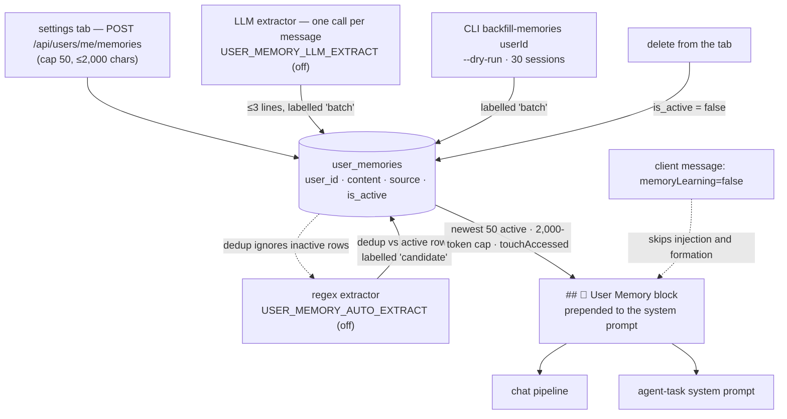

## 1. Executive Summary

OpenMake LLM is a **self-hosted AI workspace** — a Next.js front end over an
Express API serving a local model through vLLM and LiteLLM, with autonomous
agents in Docker sandboxes, deep research, an artifact pipeline, twenty-two
built-in MCP tools, custom agents, a skill library, native macOS and CLI
clients and a Discord gateway. MIT, 2,110 commits by nine authors since
12 February 2026, `1.44.0` at this commit, 112,443 lines of TypeScript in the
API alone beside 340 test files. The README is in four languages and the
code comments are in Korean.

Its memory is 531 lines of that. `user_memories` is one table — a sentence
per row, a `user_id`, a `source`, an `is_active` flag — and every chat turn
prepends the user's newest fifty active rows to the system prompt as a
numbered list under a 2,000-token cap (`user-context-blocks.ts:19-46`). The
rows arrive three ways: a person types one into the settings tab (`POST
/api/users/me/memories`, capped at fifty per user); a regex extractor
matches Korean sentences of the form *remember this* or *my name is*; or an
LLM extractor spends one model call per user message asking for durable
facts and accepting at most three lines. The two extractors are separate
environment switches, `USER_MEMORY_AUTO_EXTRACT` and
`USER_MEMORY_LLM_EXTRACT`, and both default to off (`config/memory-extraction.ts:9-12`),
so an installation that never sets them has a memory that costs the local
model nothing and holds exactly what the person wrote.

The table's own history is the most informative thing in the migrations. A
`MemoryService` with `category`, `key`, `value` and `importance` columns was
deleted from the code on 19 May 2026, and migration 020 dropped its table
with six rows in it under a comment that the operator chose *"remove all (6
rows permanently lost)"*; a week later migration 034 reintroduced the table
as *"a lightweight re-introduction of the MemoryService abandoned on
2026-05-19 — explicit only, no auto-extraction, zero vLLM load"*; migration
011, which built trigram indexes on the old `key` and `value` columns, then
broke bootstrap on fresh databases until a 31 July note taught it to skip
itself when `key` is absent; and migration 046 swept the orphaned
`memory_tags`. Auto-formation and the backfill arrived on 22 July 2026 in
one pull request. Three comments in the tree say the chat-side `/remember`
slash command the schema was designed around is not implemented.

**What is wrong with it is small and specific.** The extractor writes
`source` backwards: the schema defines `candidate` as a model-emitted
`<memory-candidate>` tag and `batch` as bulk extraction, and
`autoFormMemories` stores a regex hit as `candidate` and an LLM hit as
`batch` (`memory-extraction.ts:90`), so the one provenance field the row
carries misreports how it was made. The memory-learning toggle that gates
both injection and formation is read from the request the client sent —
`msg.memoryLearning !== false` in the WebSocket handler — while the same
preference is also stored server-side and read by nothing on the chat path.
No test touches the repository, the controller, the prompt block or the
scope predicate; the thirteen committed cases cover two pure functions. And
the platform's `AuditService`, which the README advertises beside its
alerts, records nothing about a memory being created or deleted.

One mark, `scope_enforced`, on a `user_id` predicate that every query
carries. No paper.

## 2. Mental Model

A memory is a sentence a person wants every future conversation to start
with. It becomes one by being typed into the settings tab, by matching one of
four regular expressions, by being one of at most three lines a model returns
when asked for durable facts, or by being extracted from up to thirty past
sessions when an operator runs the backfill. Once a row exists and is
active it is a belief with no gradation: the newest fifty are prepended, in
full, to every prompt, whatever the question, and the block is the same for
the chat and for an agent task.

It stops being one in exactly one way — the person deletes it, singly or all
at once, which flips `is_active`. Nothing supersedes a memory, nothing
expires or decays one, nothing consults `accessed_at` after `touchAccessed`
writes it, and a memory that was deleted is not remembered as deleted: the
duplicate check compares a candidate against the *active* rows, so the same
sentence can be re-extracted from the next message that states it, or
re-added from the tab. The cap is fifty per user and first-come — the
fifty-first candidate is skipped, whatever it says.



## 3. Architecture

A monorepo: `apps/api` (Express, 112,443 lines), `apps/web` (Next.js 16),
Swift clients, shared packages, `db/` with 128 SQL migrations and an init
schema, `infra/` with the MCP runtime and vendored servers. The application
runs under PM2; PostgreSQL, Redis, and the agent, MCP and artifact sandboxes
run in Docker; a local model runs under vLLM behind LiteLLM, with external
providers routed per functional role.

The memory is seven files in the API and one component in the web app:

- `db/migrations/034_user_memories.sql` — the table and its partial index.
- `apps/api/src/data/repositories/user-memory-repository.ts` (82 lines) —
  create, list active, count active, soft delete, delete all, touch.
- `apps/api/src/controllers/user-memories.controller.ts` (112) — the four
  routes under `/api/users/me/memories`.
- `apps/api/src/services/chat-service/user-context-blocks.ts` (80) — the
  prompt block, beside the custom-instructions block.
- `apps/api/src/config/memory-extraction.ts` (44) — the switches, the cap,
  the four regexes and the extraction prompt.
- `apps/api/src/services/chat-service/memory-extraction.ts` (100) — the
  extractors, the dedup and the orchestrator.
- `apps/api/src/services/chat-service/memory-backfill.ts` (82) — the CLI
  backfill.
- `apps/web/components/settings/memory-section.tsx` (154) — the tab; the
  old `/memory` page is a six-line redirect to it since 11 July 2026.

`apps/api/src/storage/memory-store.ts` is a different thing under a similar
name: an in-process key-value store with TTL timers, the single-instance
backend for rate limits and caches, unrelated to `user_memories`.

### Deployment and ergonomics

Nothing beyond what the workspace already runs: Postgres holds the table,
the REST routes need the workspace's JWT session, and the block costs one
indexed query per turn. Turning the LLM extractor on adds one model call per
user message on the same inference path the chat uses; the regex extractor
adds none. The store is one table readable with any SQL client, and the
rows are the sentences themselves.

## 4. Essential Implementation Paths

- **Explicit write.** `router.post('/')` in the controller: `requireAuth`, a
  zod schema of `content` from 1 to `USER_MEMORY_MAX_CONTENT_CHARS` (2,000),
  `countActiveByUser` against `USER_MEMORY_MAX_COUNT` (50) with a 400 above
  it, then `repo.create(uuid, userId, content.trim())` with the default
  source `explicit`.
- **Automatic write.** `message-pipeline.ts:352-359`: after the agent
  selection and skill bindings, `buildUserContextBlocks(userId,
  req.memoryLearning !== false)` and then, under the same flag,
  `void autoFormMemories({ userId, message: req.message, client })`.
  `autoFormMemories` (`memory-extraction.ts:70-100`) returns at once for a
  guest or when both switches are off; otherwise `extractHeuristicMemories`
  (`:15-27`) and `extractLLMMemories` (`:30-50`), a union, the active rows
  loaded once, `isDuplicateMemory` per candidate (`:56-62`), the cap, and
  `repo.create` with `source = heur.includes(c) ? 'candidate' : 'batch'`.
- **Backfill.** `cli.ts:147-168` `backfill-memories <userId>` →
  `backfillUserMemories` (`memory-backfill.ts:29-81`): user messages
  aggregated per session for the newest thirty sessions with at least forty
  characters, `extractLLMMemories` per session at concurrency three, dedup
  against active rows and the batch, `--dry-run` returning the fresh list
  without writing.
- **Read.** `buildUserMemoryBlock` (`user-context-blocks.ts:19-46`):
  `listActiveByUser(userId, 50)`, a loop adding `estimateTokens(content) + 4`
  until `USER_CTX_MAX_MEMORY_TOKENS` (2,000) would be exceeded, a numbered
  list under `## 🧠 User Memory (cross-conversation)`, and a fire-and-forget
  `touchAccessed`. Called from the chat pipeline and from
  `agent-task/skill-block.ts:47`.
- **Delete.** `router.delete('/:id')` → `softDeleteForUser`;
  `router.delete('/')` → `deleteAllForUser`; both `UPDATE … SET is_active =
  FALSE` under `user_id`.
- **Schema.** `034_user_memories.sql`; `020_drop_memory_documents.sql` and
  `046_drop_dead_tables.sql` for what came before.
- **Tests.** `memory-extraction.test.ts` — thirteen cases over
  `extractHeuristicMemories` and `isDuplicateMemory`.

## 5. Memory Data Model

```sql
id TEXT PRIMARY KEY, user_id TEXT NOT NULL REFERENCES users(id) ON DELETE CASCADE,
content TEXT NOT NULL,
source TEXT NOT NULL DEFAULT 'explicit' CHECK (source IN ('explicit','candidate','batch')),
is_active BOOLEAN NOT NULL DEFAULT TRUE, accessed_at TIMESTAMPTZ,
created_at TIMESTAMPTZ NOT NULL DEFAULT NOW(), updated_at TIMESTAMPTZ NOT NULL DEFAULT NOW()
```

with `idx_user_memories_user_active ON (user_id, is_active, created_at DESC)
WHERE is_active = TRUE`. Scope is the user and only the user; there is no
project, agent or workspace key, and a custom agent shares the same block as
every other conversation. `source` is the whole provenance model, and its
three values are defined in the table comment as *user-entered*,
*model-detected tag (future)* and *bulk extraction (future)*; the code that
arrived later populates the second with regex hits and the third with
per-message LLM hits, and the backfill populates the third correctly.
`accessed_at` is documented as *"for a future LRU policy"* and is written by
`touchAccessed` and read by nothing. There is no version, no supersession,
no validity window, no confidence and no status beyond `is_active`.

The user-preferences table (`060_user_preferences.sql`) stores a
`memoryLearning` boolean beside `saveHistory`; the web settings page reads
and writes it and sends the value on each chat message, and the API reads it
from the message.

## 6. Retrieval Mechanics

There is no retrieval. The block is the newest fifty active rows, whatever
the query, truncated to 2,000 tokens by dropping the oldest of the fifty
when the budget runs out — the loop stops at the first row that would
exceed it, so the cut is by recency, not by relevance. The same list is
injected into every turn as a prefix of the system prompt, which places it
where a provider's prompt-prefix cache would be invalidated by any change to
it. Retrieval is automatic; the model has no tool to fetch or search a
memory, and no way to ask for one that fell outside the fifty.

## 7. Write Mechanics

The explicit path blocks on one insert. The automatic path is
`void`-called from the pipeline before dispatch and never throws — a
failure is logged at debug level and the response is unaffected — so a
memory formed from turn *n* is in the table before turn *n + 1* is
assembled, and the lag is the extractor's own model call when that switch is
on. The LLM prompt asks for *"user-specific facts that stay useful in the
next conversation"* — names, preferences, occupation, language, projects,
repeated requests — excludes one-off questions and time-dependent
information, and demands exactly `NONE` when there is nothing; the response
is split on lines, stripped of bullets and quotes, bounded to three and to
300 characters each. Temperature is fixed at 0.

Dedup is `norm(a) == norm(b)` or either containing the other after
lower-casing and stripping punctuation, against the active rows and the
batch so far. That catches a restatement and misses a paraphrase, and
because it consults active rows only, a sentence the person deleted is
eligible again from the next message that states it. Conflict is not
represented: *I prefer Python* and *I prefer Java* are two rows, both
injected. Malicious input is not filtered on this path — the extractors
read the user's own message, so the injection risk is the prompt's, not a
third party's — and the LLM extractor's output is stored without a check
beyond length.

### Operational cost

The explicit path is one insert. With `USER_MEMORY_LLM_EXTRACT=true` every
user message costs one additional model call before the reply is
dispatched, on the same local model. No background pass exists. The read
path injects up to 2,000 tokens per turn, unbounded by relevance and placed
at the front of the system prompt.

## 8. Agent Integration

The person's surface is the settings tab: a textarea with a character and
count indicator, an add button, a list with a delete button per row, a
delete-all, and a limit message at fifty. The model's surface is the block
alone; no tool, command or hook lets it write or read a memory, and the
`/remember` command the schema comment describes does not exist — the
slash-command module matches skills only, as the repository comment,
the route comment and the block's own header each state. The memory-learning
toggle in the privacy settings is honoured per message from the payload the
client sends, and turning it off stops both the injection and the
formation, which the pipeline comment justifies as a privacy requirement:
*"if saving continued while the user had it off, it would act opposite to
what they chose."*

Adapting the mechanism to another host is trivial, because there is almost
nothing to adapt: a table, a numbered list and a cap.

## 9. Reliability, Safety, and Trust

**Scope — awarded.** `user_id` on every query, from the session, with
guests excluded before the query is built.

**No tombstone.** Soft delete is keyed on the row and the duplicate check
reads active rows only, so a deleted value returns through any writer.

**No trust state.** `source` is provenance, and inverted.

**No audit.** `AuditService.ts` mentions no memory event; a create or delete
leaves an application log line and nothing in the store.

**No human review.** The tab is where a person writes and deletes their own
sentences; when an extractor is on, its rows land active and the same delete
button is the only way to disagree with one. Nothing marks a row reviewed,
pending or rejected.

**No bitemporal axis, no negative evaluation.** The one exclusion the tests
assert is that a weather question yields no regex match — a property of the
extractor, not of retrieval.

**The toggle trusts the client.** A preference exists in the database and
the chat path reads the flag from the message, so a client that omits or
forges it decides whether memories are injected and formed for that turn.
Within the workspace's own web client the two agree; a second client is
free to differ.

**Data loss is in the history, not the code.** Migration 020 records the
drop of six users' rows as a deliberate choice; the current table has no
export and no backup path of its own beyond the database's.

## 10. Tests, Evals, and Benchmarks

340 test files run under `npm test` in CI beside build, lint, and two
evaluation scripts, `eval:routing` and `eval:response`, neither of which
concerns memory. One file concerns it:
`memory-extraction.test.ts`, thirteen cases — four positive regex
extractions, two negatives (*"what's the weather today?"* and *"review this
code"* yield nothing), an empty input, and three dedup cases including a
partial-containment positive and an unrelated-pair negative. Each can fail;
the negatives have positive controls in the same file.

Nothing tests the repository's queries, the controller's cap and
authorisation, the prompt block's token loop, the `touchAccessed` write, the
backfill, or that one user's rows never reach another's prompt. The
`isDuplicateMemory` cases prove the normalisation; no case proves that a
deleted sentence stays out, because it does not.

No benchmark and no claim. The README's numbers are about model routing and
hardware fit, measured on a separate bench site, and say nothing about
memory.

## 11. For Your Own Build

### Steal

- **Default the expensive extractor to off and say what it costs.** Two
  switches, each named with its load on the local model, and a memory that
  works with both off.
- **Gate formation with the same toggle that gates injection.** The
  pipeline comment says why: a memory that keeps forming after the person
  turned memory off is the opposite of what they chose.
- **Ship the backfill with a dry run.** Thirty sessions of a user's history
  through an extractor is exactly the write a person should preview.
- **Cap by count and by tokens, and log the cut.** Fifty rows and 2,000
  tokens, with the truncation reported, is a bound most prompt-prefix
  memories in this atlas do not state.

### Avoid

- **A provenance vocabulary the writer misreads.** Three `source` values
  with definitions in the schema and a mapping in the code that puts the
  regex under the model's label and the model under the batch's; whoever
  filters by `source` later gets the wrong answer.
- **Reading a privacy preference from the client's message.** Store it,
  and read the store.
- **A duplicate check that forgets what was deleted.** One `is_active`
  filter is the difference between *the person removed this* and *nobody
  has said this yet*.
- **Injecting the newest fifty whatever the question.** No search, no
  ranking and a recency cut means the memory grows less relevant the more
  it holds.

### Fit

For a team that runs this workspace anyway, the memory is a sane
minimum: explicit sentences a person controls, prepended in full, with
extraction available behind switches that an operator has to choose. It is
the shape claude.ai and ChatGPT memory take at the surface, which is what
the migration says it set out to be, and it costs nothing to run.

It is not a memory system to study for its own sake, and the platform's
scale should not be read as the memory's: 531 lines of a 112,000-line API,
untested on every path that matters, with one field of provenance and that
one inverted. A team wanting memory that ranks, expires, records its
deletions or survives a second client's disagreement about the toggle will
build all of it.

## 12. Open Questions

- **Will the `<memory-candidate>` tag arrive?** The schema reserved
  `candidate` for a model-emitted tag in a *"Phase K"*, and the extractor
  took the label for regex hits instead; whether the tag is still planned,
  the label will need reassigning first.
- **Does the stored `memoryLearning` preference reach any server path?** It
  is written by the preferences controller and, on the chat path, the
  request's copy wins; a WebSocket client that sends nothing gets the default
  of on.
- **What happens at the cap in an installation with extraction on?** The
  fifty-first durable fact is dropped silently and the oldest fifty stay;
  nothing in the tree evicts.

## Appendix: File Index

| Path | Lines | What it holds |
| --- | --- | --- |
| `apps/api/src/controllers/user-memories.controller.ts` | 112 | List, create with cap, soft delete, delete all |
| `apps/api/src/services/chat-service/memory-extraction.ts` | 100 | Regex and LLM extractors, dedup, orchestrator |
| `apps/api/src/services/chat-service/user-context-blocks.ts` | 80 | The prompt block and its token cap |
| `apps/api/src/data/repositories/user-memory-repository.ts` | 82 | The six queries |
| `apps/api/src/services/chat-service/memory-backfill.ts` | 82 | CLI backfill with dry run |
| `apps/api/src/config/memory-extraction.ts` | 44 | Switches, cap, regexes, extraction prompt |
| `apps/api/src/services/chat-service/memory-extraction.test.ts` | 41 | Thirteen cases over the pure functions |
| `db/migrations/034_user_memories.sql` | — | The table, its index and its history in comments |
| `db/migrations/020_drop_memory_documents.sql`, `011_memory_search_index.sql`, `046_drop_dead_tables.sql` | — | The predecessor's removal |
| `apps/web/components/settings/memory-section.tsx` | 154 | The settings tab |
| `apps/api/src/services/chat-service/message-pipeline.ts:350-359` | — | Where the block and the extractor are called |

Searches behind the absence claims above, run from the repository root:

```sh
rg -l 'user_memories|UserMemoryRepository|buildUserMemoryBlock' -g '*.test.ts'   # none
rg -n -i 'memor' apps/api/src/services/AuditService.ts                            # none
rg -n 'accessed_at' apps/api/src                                                  # written by touchAccessed, read by nothing
rg -n 'memory-candidate|/remember' apps/api/src apps/web                          # three comments saying it is unimplemented
rg -n 'memoryLearning' apps/api/src                                               # request flag on the chat path; preference stored, not read there
rg -n -i 'arxiv|bibtex|citation|doi' README.md docs                               # no paper
```

## History

**2026-09-06** — [`ed74251e8d463eaf9d461bbde8023585c7ad29b3`](https://github.com/openmake/openmake_llm/commit/ed74251e8d463eaf9d461bbde8023585c7ad29b3) — first reading, at the head of `main`. Screened first: no auto-run surface, one build-time execution path, eight unpinned surfaces (three package manifests without lockfiles and a vendored MCP server among them), and eight files inside the seven-day cooldown, so nothing was installed and no test was run. One mark, `scope_enforced`; `tombstone`, `trust_state`, `audit_log`, `human_review`, `negative_eval` and `bitemporal` each looked for and each absent, with the near-misses in section 9. The findings recorded are the inverted `source` labels, the client-read toggle, and an untested read path.
