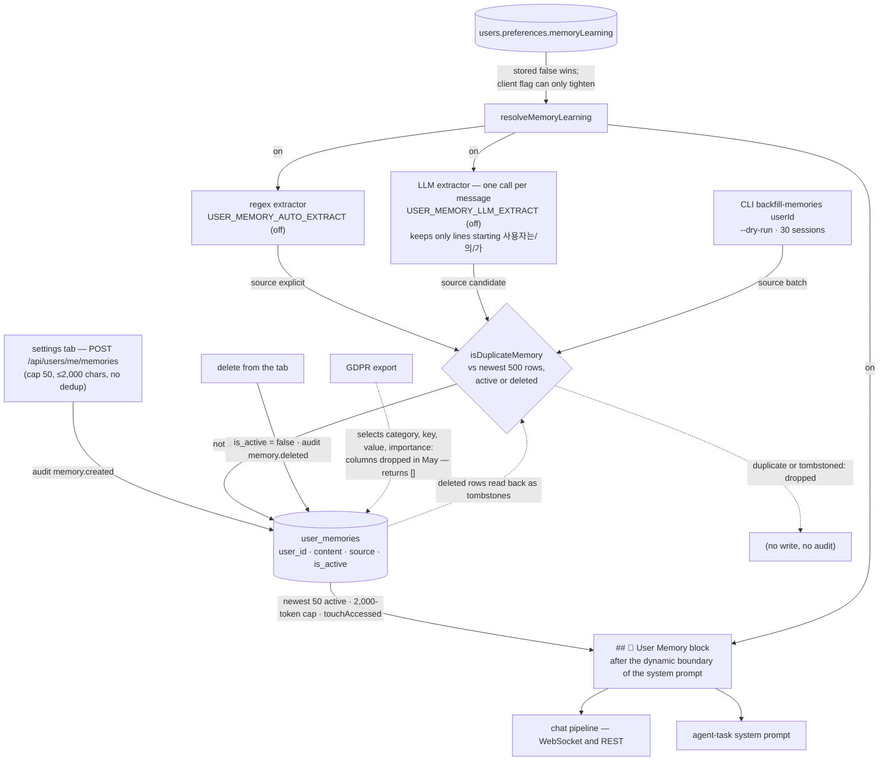

## 1. Executive Summary

OpenMake LLM is a **self-hosted AI workspace** — a Next.js front end over an
Express API serving a local model through vLLM and LiteLLM, with autonomous
agents in Docker sandboxes, deep research, an artifact pipeline, twenty-two
built-in MCP tools, custom agents, a skill library, native macOS and CLI
clients and a Discord gateway. MIT, 2,118 commits by nine authors since
12 February 2026, `1.49.0` at this commit, 112,605 lines of TypeScript in the
API beside 343 test files. The README is in four languages and the code
comments are in Korean.

Its memory is 657 lines of that. `user_memories` is one table — a sentence
per row, a `user_id`, a `source`, an `is_active` flag — and every chat turn
injects the user's newest fifty active rows into the system prompt as a
numbered list under a 2,000-token cap (`user-context-blocks.ts:19-46`),
after the static guard and artifact blocks and behind a line the prompt
assembler labels the dynamic boundary so that a provider's prefix cache
survives it (`external-system-prompt.ts:68-77`). The rows arrive three
ways: a person types one into the settings tab (`POST
/api/users/me/memories`, capped at fifty per user); a regex extractor
matches Korean sentences of the form *remember this* or *my name is*; or an
LLM extractor spends one model call per user message asking for durable
facts and accepting at most three lines that begin *the user…*. The two
extractors are separate environment switches, `USER_MEMORY_AUTO_EXTRACT`
and `USER_MEMORY_LLM_EXTRACT`, and both default to off
(`config/memory-extraction.ts:9-12`), so an installation that never sets
them has a memory that costs the local model nothing and holds exactly what
the person wrote.

Whether any of it reaches the prompt is decided by a stored preference.
`resolveMemoryLearning` (`memory-policy.ts:29-40`) reads
`users.preferences.memoryLearning`; a stored `false` switches injection and
formation off for the WebSocket chat, the REST chat and agent tasks alike,
and the flag a client sends with a message can only turn memory off for
that turn, never on. A delete flips `is_active` and leaves the row, and both
extractors and the backfill compare their candidates against every row the
user has had — the newest 500, deleted or not
(`user-memory-repository.ts:61-70`) — so a sentence the person removed is
not written back by the next message that states it. Creates and deletes
from the tab are recorded in the platform's `audit_logs` as
`memory.created`, `memory.deleted` and `memory.deleted_all`
(`user-memories.controller.ts:37-47`).

The table's own history is the most informative thing in the migrations. A
`MemoryService` with `category`, `key`, `value` and `importance` columns was
deleted from the code on 19 May 2026, and migration 020 dropped its table
with six rows in it under a comment that the operator chose *"remove all (6
rows permanently lost)"*; a week later migration 034 reintroduced the table
as *"a lightweight re-introduction of the MemoryService abandoned on
2026-05-19 — explicit only, no auto-extraction, zero vLLM load"*; migration
011, which built trigram indexes on the old `key` and `value` columns, then
broke bootstrap on fresh databases until a 31 July note taught it to skip
itself when `key` is absent; and migration 046 swept the orphaned
`memory_tags`. Auto-formation and the backfill arrived on 22 July 2026 in
one pull request. The toggle, the tombstone, the audit entries, the
corrected `source` labels, the answer-leak filter on the LLM extractor, the
token-overlap dedup and 36 test cases arrived in five commits on 6 September
2026 (`2536b077` through `f115cd78`, releases `1.45.0` to `1.45.2`); the
first of them names this atlas's reading of `ed74251e` as its source, and
each carries a Claude Code session trailer beside the maintainer's name.

**What is wrong with it is smaller again.** The GDPR data export reads the
live columns — `content, source, is_active, accessed_at` — tombstoned rows
included, and a category whose query fails is named in
`_meta.failedCategories` with `partial: true` rather than returned as an
empty list (`export.controller.ts`, three cases in
`__tests__/export.controller.test.ts`); the comment above the query records
that the old column list had failed on every export for four months.
`autoFormMemories` and the backfill write `memory.auto_created` and
`memory.backfilled` audit rows through `auditMemoryWrite`, fail-open, the
backfill awaiting the write because the CLI exits on return
(`memory-extraction.ts`, four cases in `memory-extraction.audit.test.ts`);
account deletion still hard-deletes with none (`user-manager.ts:469`). The
prompt block has nine cases against a mocked repository
(`user-context-blocks.test.ts`) — the user id passed through, only the
injected rows touched, the token cap, the toggle and the guest path. The
tombstone reaches the newest 500 rows of a user, and its match is
normalised text, containment, or token overlap at or above 0.75, so a
paraphrase can return. And the preference lookup is fail-open: if the
`users` read throws, the client's flag decides.

Three marks — `scope_enforced`, `tombstone`, `audit_log`. No paper.

## 2. Mental Model

A memory is a sentence a person wants every future conversation to start
with. It becomes one by being typed into the settings tab, by matching one of
four regular expressions, by being one of at most three *the user…* lines a
model returns when asked for durable facts, or by being extracted from up to
thirty past sessions when an operator runs the backfill. Once a row exists
and is active it is a belief with no gradation: the newest fifty are
injected, in full, into every prompt, whatever the question, and the block
is the same for the chat and for an agent task.

It stops being one in exactly one way — the person deletes it, singly or
all at once, which flips `is_active`. Nothing supersedes a memory, nothing
expires or decays one, nothing consults `accessed_at` after `touchAccessed`
writes it. What a delete does leave is a tombstone: the row stays, the
extractors and the backfill read deleted rows alongside active ones when
they check for duplicates, and the sentence the person removed is refused
if it comes back through any automatic writer — the person can type it
again by hand, because the tab does no dedup. The cap is fifty active rows
per user and first-come — the fifty-first candidate is dropped and a
warning names how many were, whatever they said.



## 3. Architecture

A monorepo: `apps/api` (Express, 112,605 lines), `apps/web` (Next.js 16),
Swift clients, shared packages, `db/` with 110 SQL migrations and an init
schema, `infra/` with the MCP runtime and vendored servers. The application
runs under PM2; PostgreSQL, Redis, and the agent, MCP and artifact sandboxes
run in Docker; a local model runs under vLLM behind LiteLLM, with external
providers routed per functional role. The local model and the external
providers share one dispatch path, `streamFromExternalProvider`, and one
system-prompt assembler (`message-pipeline.ts:94`,
`external-system-prompt.ts`), so the memory block reaches every provider
the same way.

The memory is eight files in the API, one component in the web app and one
shell script:

- `db/migrations/034_user_memories.sql` — the table and its partial index.
- `apps/api/src/data/repositories/user-memory-repository.ts` (107 lines) —
  create, list active, list known (active and deleted), count active, soft
  delete, delete all, touch.
- `apps/api/src/controllers/user-memories.controller.ts` (132) — the four
  routes under `/api/users/me/memories` and their audit calls.
- `apps/api/src/services/chat-service/user-context-blocks.ts` (80) — the
  prompt block, beside the custom-instructions block.
- `apps/api/src/services/chat-service/memory-policy.ts` (40) — the stored
  preference read and the rule that combines it with the client's flag.
- `apps/api/src/config/memory-extraction.ts` (74) — the switches, the cap,
  the four regexes, the line filter, the dedup thresholds and the
  extraction prompt.
- `apps/api/src/services/chat-service/memory-extraction.ts` (140) — the
  extractors, the two-stage dedup and the orchestrator.
- `apps/api/src/services/chat-service/memory-backfill.ts` (84) — the CLI
  backfill.
- `apps/web/components/settings/memory-section.tsx` (163) — the tab, with
  a badge on rows that were not typed; the old `/memory` page is a six-line
  redirect to it since 11 July 2026.
- `scripts/memory-report.sh` (61) — row, source and tombstone counts, users
  with the toggle off, `memory.*` audit rows and the cap logs, appended to
  the daily routing report.

`apps/api/src/storage/memory-store.ts` is a different thing under a similar
name: an in-process key-value store with TTL timers, the single-instance
backend for rate limits and caches, unrelated to `user_memories`. And
`apps/api/src/data/models/legacy-schema.ts:245` is the predecessor's
`user_memories` — `category`, `key`, `value`, `importance` — kept as an
inline fallback for installations without the schema file; the export
controller was written against that shape and moved to the live columns in
`0e62e475` on 7 September 2026.

### Deployment and ergonomics

Nothing beyond what the workspace already runs: Postgres holds the table,
the REST routes need the workspace's JWT session, and the block costs two
indexed queries per turn — the preference and the rows. Turning the LLM
extractor on adds one model call per user message on the same inference
path the chat uses; the regex extractor adds none. The store is one table
readable with any SQL client, and the rows are the sentences themselves.
The report script needs the Postgres container and the application log on
the same host.

## 4. Essential Implementation Paths

- **Policy.** `resolveMemoryLearning(userId, clientFlag)`
  (`memory-policy.ts:29-40`): guests are `false` without a query; otherwise
  `UserRepository.getPreferences` and `effectiveMemoryLearning` (`:20-23`)
  — a stored `false` is `false` whatever the client sent, and a stored
  `true` or absent value is `true` unless the client sent an explicit
  `false`. A thrown lookup logs a warning and falls back to the client's
  flag.
- **Explicit write.** `router.post('/')` in the controller: `requireAuth`, a
  zod schema of `content` from 1 to `USER_MEMORY_MAX_CONTENT_CHARS` (2,000),
  `countActiveByUser` against `USER_MEMORY_MAX_COUNT` (50) with a 400 above
  it, `repo.create(uuid, userId, content.trim())` with the default source
  `explicit`, then `auditMemory(req, 'memory.created', …)` (`:93`). No
  duplicate check on this path.
- **Automatic write.** `message-pipeline.ts:353-362`: after the agent
  selection and skill bindings, `resolveMemoryLearning(userId,
  req.memoryLearning)`, then `buildUserContextBlocks(userId,
  memoryLearning)` and, under the same result, `void autoFormMemories({
  userId, message: req.message, client })`. `autoFormMemories`
  (`memory-extraction.ts:103-140`) returns at once for a guest or when both
  switches are off; otherwise `extractHeuristicMemories` (`:15-27`) and
  `extractLLMMemories` (`:30-52`), a union, `countActiveByUser` and
  `listKnownContentsByUser` loaded together (`:117-120`), then per
  candidate: over the cap counts a drop (`:125`), `isDuplicateMemory`
  against the known list skips, and `repo.create` with `source =
  heur.includes(c) ? 'explicit' : 'candidate'` (`:128`). A drop count above
  zero is logged at warn level (`:136`).
- **LLM extraction.** `extractLLMMemories` wraps the message in
  `<extraction_target>` tags (`config/memory-extraction.ts:72`), asks for
  at most three durable facts each written as *the user…* and forbids
  answering the text, and keeps only response lines matching
  `llmLinePattern` — `/^사용자(는|의|가)\s/` (`:28`, `memory-extraction.ts:44`)
  — before the count and length bounds.
- **Dedup.** `isDuplicateMemory` (`memory-extraction.ts:88-97`): normalised
  equality or containment, else `tokenJaccard` (`:80-85`) of the two
  token sets from `dupTokens` (`:70-77`) — the subject prefix stripped, each
  word passed up to three times through a suffix regex of Korean particles
  and endings (`stemToken`, `:59-67`; `config:43-44`), tokens under one
  character and nineteen adverbs of degree and frequency removed (`:46-48`)
  — at or above `USER_MEMORY_DUP_TOKEN_SIMILARITY` (0.75, `:36`).
- **Backfill.** `cli.ts` `backfill-memories <userId>` →
  `backfillUserMemories` (`memory-backfill.ts`): user messages aggregated
  per session for the newest thirty sessions with at least forty
  characters, `extractLLMMemories` per session at concurrency three, dedup
  against the known list (`:61-64`) and the batch, `--dry-run` returning
  the fresh list without writing; on a real run the cap is read from
  `countActiveByUser` (`:72`) and an overflow is logged (`:80`).
- **Read.** `buildUserMemoryBlock` (`user-context-blocks.ts:19-46`):
  `listActiveByUser(userId, 50)`, a loop adding `estimateTokens(content) + 4`
  until `USER_CTX_MAX_MEMORY_TOKENS` (2,000) would be exceeded, a numbered
  list under `## 🧠 User Memory (cross-conversation)`, and a fire-and-forget
  `touchAccessed`. Pushed into the system prompt after the guard, artifact
  and report blocks and the agent message (`external-system-prompt.ts:75-77`)
  and, for agent tasks, from `agent-task/skill-block.ts:49` behind the same
  policy call.
- **Delete.** `router.delete('/:id')` → `softDeleteForUser`, 404 and no
  audit when the row is not the caller's (`:106-108`); `router.delete('/')`
  → `deleteAllForUser` and `memory.deleted_all` with the count (`:121-123`);
  both `UPDATE … SET is_active = FALSE` under `user_id`.
- **Audit.** `auditMemory` (`user-memories.controller.ts:37-47`): a
  fire-and-forget async block that imports `AuditService`, calls `logAudit`
  with the action, user, `resourceType: 'user_memory'`, the id, details, IP
  and user agent, and logs a warning on failure. `logAudit`
  (`AuditService.ts:123-150`) inserts into `audit_logs` and consults the
  alert whitelist, which contains no `memory.*` action.
- **Export and erasure.** `export.controller.ts` selects `id, user_id,
  content, source, is_active, accessed_at, created_at, updated_at` inside
  `safeQuery`, which on error substitutes `[]`, logs at error level and
  adds the category to `_meta.failedCategories`; `user-manager.ts:469` runs
  `DELETE FROM user_memories WHERE user_id = $1` on account deletion.
- **Schema.** `034_user_memories.sql`; `020_drop_memory_documents.sql` and
  `046_drop_dead_tables.sql` for what came before.
- **Tests.** Four files, 36 cases: `memory-extraction.test.ts` (19),
  `user-memories.controller.test.ts` (7), `memory-policy.test.ts` (6),
  `user-memory-repository.test.ts` (4).

## 5. Memory Data Model

```sql
id TEXT PRIMARY KEY, user_id TEXT NOT NULL REFERENCES users(id) ON DELETE CASCADE,
content TEXT NOT NULL,
source TEXT NOT NULL DEFAULT 'explicit' CHECK (source IN ('explicit','candidate','batch')),
is_active BOOLEAN NOT NULL DEFAULT TRUE, accessed_at TIMESTAMPTZ,
created_at TIMESTAMPTZ NOT NULL DEFAULT NOW(), updated_at TIMESTAMPTZ NOT NULL DEFAULT NOW()
```

with `idx_user_memories_user_active ON (user_id, is_active, created_at DESC)
WHERE is_active = TRUE`. Scope is the user and only the user; there is no
project, agent or workspace key, and a custom agent shares the same block as
every other conversation. `source` is the whole provenance model, and its
three values are defined in the table comment as *the user's explicit
intent — the tab, or a "remember this" pattern*, *model-detected — the
per-message LLM extraction* and *bulk — the CLI backfill*; the code writes
them that way (`memory-extraction.ts:128`, `memory-backfill.ts:75`), the
API returns them, and the tab shows *Auto-detected* or *Backfilled* beside
any row that is not `explicit` (`memory-section.tsx:148`). Nothing else
reads the field. The `<memory-candidate>` tag the column was designed for
is recorded in the same comment as never implemented. `accessed_at` is
documented as *"for a future LRU policy"* and is written by `touchAccessed`
and read by nothing. There is no version, no supersession, no validity
window, no confidence and no status beyond `is_active`.

The user-preferences table (`060_user_preferences.sql`) stores a
`memoryLearning` boolean beside `saveHistory`; the web settings page writes
it and sends the value on each chat message, and the API reads the stored
value first (`memory-policy.ts:34-35`).

## 6. Retrieval Mechanics

There is no retrieval. The block is the newest fifty active rows, whatever
the query, truncated to 2,000 tokens by dropping the oldest of the fifty
when the budget runs out — the loop stops at the first row that would
exceed it, so the cut is by recency, not by relevance, and the cut is
logged (`user-context-blocks.ts:36`). The same list is injected into every
turn after the static guard, artifact and answer-format blocks, at the
point the assembler marks as the dynamic boundary and reserves for
per-user content so that the static prefix stays cacheable
(`external-system-prompt.ts:68-77`). Retrieval is automatic; the model has
no tool to fetch or search a memory, and no way to ask for one that fell
outside the fifty. The report script names the two numbers that would
reopen the question — a token-cap log line, or a median of more than
twenty active rows per user (`memory-report.sh:7-10`) — and states that
the table it measures held no rows on 6 September 2026.

## 7. Write Mechanics

The explicit path blocks on one insert. The automatic path is
`void`-called from the pipeline before dispatch and never throws — a
failure is logged at debug level and the response is unaffected — so a
memory formed from turn *n* is in the table before turn *n + 1* is
assembled, and the lag is the extractor's own model call when that switch is
on. The LLM prompt asks for *"user-specific facts that stay useful in the
next conversation"* — names, preferences, occupation, language, projects,
repeated requests — excludes one-off questions, time-dependent information
and *answers to questions*, tells the model the tagged text is material to
analyse and not a question to it, requires each fact as a *the user…* line,
and demands exactly `NONE` when there is nothing; the response is split on
lines, stripped of bullets and quotes, filtered to lines that begin with
the Korean subject *사용자는/의/가*, bounded to three and to 300 characters
each. Temperature is fixed at 0. The filter is the load-bearing part: the
config comment records a backfill dry run over one user's history in which
eight of eleven candidates were the model's answers to a geometry question
(`config/memory-extraction.ts:22-27`), and the commit that added the tag
and the filter records the same sessions replayed leaking none. It also means the LLM
extractor stores nothing that is not phrased in Korean with that subject,
whatever language the person writes in.

Dedup is two-stage: `norm(a) == norm(b)` or either containing the other
after lower-casing and stripping punctuation, and failing that a Jaccard
overlap of crude-stemmed tokens at or above 0.75. The thresholds in the
config comments are measured pairs — restatements of one preference at
0.80 to 0.83, and the opposing pairs the rule must keep apart (*Python* vs
*Java*, two different names, *parallel* vs *serial*) at 0.33 to 0.67 — with
a note that character bigrams were tried and rejected because they scored
a one-syllable opposition at 0.87 (`config/memory-extraction.ts:31-35`).
Both stages run against the newest 500 rows the user has ever had, deleted
rows included, so a restatement of a removed sentence is refused; a
paraphrase below the threshold is not. Conflict is not represented: *I
prefer Python* and *I prefer Java* are two rows, both injected. Malicious
input is not filtered on this path — the extractors read the user's own
message, so the injection risk is the prompt's, not a third party's — and
the boundary tag is the only defence against the model treating the
message as addressed to it.

### Operational cost

The explicit path is one insert and one audit write. With
`USER_MEMORY_LLM_EXTRACT=true` every user message costs one additional
model call before the reply is dispatched, on the same local model, plus
one query for the known contents. No background pass exists. The read path
costs one preference query and one row query per turn and injects up to
2,000 tokens, unbounded by relevance, behind the static prefix.

## 8. Agent Integration

The person's surface is the settings tab: a textarea with a character and
count indicator, an add button, a list with a delete button per row and a
badge on rows the extractors or the backfill wrote, a delete-all, and a
limit message at fifty. The model's surface is the block alone; no tool,
command or hook lets it write or read a memory, and the `/remember` command
the schema comment once described does not exist — the slash-command module
matches skills only, as the repository header, the route comment and the
migration each state. The memory-learning toggle in the privacy settings is
honoured from the stored preference for the WebSocket chat, the REST chat
and agent tasks, and turning it off stops both the injection and the
formation, which the pipeline comment justifies as a privacy requirement:
*"if saving continued while the user had it off, it would act opposite to
what they chose."* Until `2536b077` on 6 September 2026 the WebSocket
handler's copy of the flag was the only reader, the REST chat never
consulted it, and agent tasks built the block for every non-guest.

Adapting the mechanism to another host is trivial, because there is almost
nothing to adapt: a table, a numbered list, a cap and a stored boolean.

## 9. Reliability, Safety, and Trust

**Scope — awarded.** `user_id` on every query, from the session, with
guests excluded before the query is built; five queries asserted against a
fake pool, two routes through supertest.

**Tombstone — awarded, with its reach stated.** A deleted row stays, keyed
on its content, and both automatic writers refuse a candidate that matches
it by normalised text, containment or token overlap. The reach is the
newest 500 rows of the user and the match is the dedup's — a paraphrase
below 0.75 is a new sentence — and the tab itself does no check, so the
person who deleted a sentence can type it again. The test that proves it
(`memory-extraction.test.ts:101-106`) mocks the repository, and its
companion asserts the SQL has no `is_active` clause; nothing runs it
against Postgres.

**Audit — awarded, with its gaps stated.** `memory.created`,
`memory.deleted` and `memory.deleted_all` land in `audit_logs` with the
actor, the row, the source and the request's IP and user agent. The
extractors and the backfill create rows without an entry; account deletion
removes them without one; the write is fire-and-forget and a failure is a
warning line; and none of the three actions is in the alert whitelist, so
an audit row is all they produce. Retention nulls the IP and user agent
from audit rows after ninety days and leaves the action and the row id
(`db-retention.ts:113-118`).

**No trust state.** `source` is provenance, written as the schema defines
it, and read by a badge.

**No human review.** The tab is where a person writes and deletes their own
sentences, and the badge tells them which rows they did not write; when an
extractor is on, its rows land active and are injected before anyone looks,
and the delete button is the only way to disagree with one — a disagreement
that the tombstone then remembers. Nothing marks a row reviewed, pending or
rejected, and nothing distinguishes a row a person has seen from one nobody
has. The commit that added the badge calls this the lightweight answer to a
missing review queue; it is a display with a durable delete.

**No bitemporal axis, no negative evaluation.** The negatives in the test
files are on the write side — a tombstoned sentence is not created, a guest
is not written for, a forged client `true` does not override a stored
`false`, another user's row answers 404, answer lines are dropped by the
extractor — and none asserts that a row is absent from the assembled block.

**The toggle trusts the store, and fails open.** A stored `false` wins over
anything a client sends; a stored `true` or absent value can be tightened
by a client `false` for that turn. If the preference query throws, the
client's flag decides, and a WebSocket client that sends nothing gets on.

**The export ships no memories.** `export.controller.ts:110-112` selects
`category, key, value, importance` from a table whose columns are `content`,
`source` and `is_active`; the query fails on every call, `safeQuery` logs
*"user_memories 조회 실패 (continue)"* and returns `[]`, and the person's
data export arrives without the sentences the prompt has been carrying.
Both shapes of the table exist in the tree — the live one in migration 034
and the predecessor's in `legacy-schema.ts:245` — and the export was written
against the second.

**Data loss is in the history and in the export.** Migration 020 records
the drop of six users' rows as a deliberate choice; the current table has
no backup path of its own beyond the database's, and the export path that
exists cannot read it.

## 10. Tests, Evals, and Benchmarks

343 test files run under `npm test` in CI beside build, lint, and two
evaluation scripts, `eval:routing` and `eval:response`, neither of which
concerns memory. Four files concern it, 36 cases, none against a database:

- `memory-extraction.test.ts` (19) — six regex cases: four extractions,
  one negative in which a weather question and a code-review request yield
  nothing, and an empty input; seven dedup cases — exact, containment, an
  unrelated pair, two ending-variant restatements that must match, an
  opposing pair that must not, and two facts sharing only the *the user…*
  prefix that must not; four orchestrator cases through a mocked
  repository — heuristic hits stored as `explicit`, a tombstoned sentence
  not re-created, tombstones not counted against the cap, guests not
  written for; two LLM-extraction cases through a mocked client — answer
  and calculation lines dropped and *the user…* lines kept, and the
  boundary tag around the message. The tombstone cases mock
  `listActiveByUser` to an empty list on purpose, with a comment that the
  old code path must be left runnable so the test cannot pass vacuously.
- `user-memories.controller.test.ts` (7) — supertest over the router with
  mocked auth, repository and audit: 401 without a session, list and
  delete keyed on the session id, 400 at the cap with no create, 400 on
  empty content, `memory.created` on create, 404 and no audit on another
  user's row, `memory.deleted` and `memory.deleted_all` in order.
- `memory-policy.test.ts` (6) — the pure rule and the resolver with a mocked
  preference read: stored `false` beats a client `true`, absent means on
  unless the client says off, guests skip the query, a thrown query falls
  back to the client's flag.
- `user-memory-repository.test.ts` (4) — the SQL text through a fake pool:
  five queries carry `user_id = $n` and the id, `create` passes the four
  columns, `listKnownContentsByUser` has no `is_active`, `listActiveByUser`
  has `is_active = TRUE`, soft delete is an `UPDATE` and not a `DELETE`.

Each can fail; the commit messages record which cases fail when the
service change is reverted. Nothing tests the prompt block's token loop,
the `touchAccessed` write, the backfill, the export, or that one user's
rows never reach another's prompt — the scope assertions are on the SQL
text and the route, not on a result.

No benchmark and no claim. The README's numbers are about model routing
and hardware fit, measured on a separate bench site, and say nothing about
memory. The measurements that exist are in comments and commit messages:
615 real user messages over ninety days with zero regex hits, one user's
backfill dry run with eight answer lines among eleven candidates before
the filter and none after, and a production table with zero rows on
6 September 2026.

## 11. For Your Own Build

### Steal

- **Default the expensive extractor to off and say what it costs.** Two
  switches, each named with its load on the local model, and a memory that
  works with both off.
- **Store the privacy toggle and let the client only tighten it.** A stored
  `false` that no message can override, a per-turn `false` that any client
  may send, and one resolver that every path calls.
- **Let the duplicate check see what was deleted.** One query without the
  `is_active` filter, and a removed sentence stays removed through every
  automatic writer, while the cap counts active rows only.
- **Fence the extractor's input and filter its output by shape.** A
  boundary tag that says *this is material, not a question*, and a
  deterministic line filter behind it; the dry run in the comments is the
  reason.
- **Ship the backfill with a dry run.** Thirty sessions of a user's history
  through an extractor is exactly the write a person should preview.
- **Write down the numbers that would justify search before building it.**
  A report script that prints the median active rows per user and the
  cap-log count, with the thresholds in its header.

### Avoid

- **An export written against a table that was dropped.** The export reads
  the predecessor's columns, the helper swallows the error, and the
  person gets a complete-looking archive without their memories. When a
  table is reintroduced, grep every consumer of its name.
- **Auditing one writer of three.** The tab's creates are in the audit
  table; the extractors' are not, and those are the rows a person did not
  choose.
- **A tombstone that only the machines respect.** The tab re-adds what the
  extractors refuse; if that is the intent, say so in the tab.
- **A fail-open preference read.** A store outage should not switch a
  privacy setting back on.
- **Injecting the newest fifty whatever the question.** No search, no
  ranking and a recency cut means the memory grows less relevant the more
  it holds.

### Fit

For a team that runs this workspace anyway, the memory is a sane
minimum: explicit sentences a person controls, injected in full behind a
cacheable prefix, extraction available behind switches that an operator
has to choose, a stored toggle, a remembered delete and an audit row per
tab action. It is the shape claude.ai and ChatGPT memory take at the
surface, which is what the migration says it set out to be, and it costs
nothing to run.

It is not a memory system to study for its own sake, and the platform's
scale should not be read as the memory's: 657 lines of a 112,000-line API,
tested through mocks on the write side and not at all on the read side,
with one field of provenance and an export that cannot see it. A team
wanting memory that ranks, expires, or audits what its extractors wrote
will build all of it.

## 12. Open Questions

- **Will the export be fixed before someone requests one?** The query
  names four columns the table lost in May 2026; the failure is a warning
  line and an empty array.
- **What happens at the cap in an installation with extraction on?** The
  fifty-first durable fact is dropped and counted; the oldest fifty stay,
  and the report script's header names eviction as the policy the count is
  meant to gate.
- **Does the Korean-only line filter cost anything for a non-Korean
  user?** The prompt asks for Korean output, so the filter matches what the
  prompt requests; a model that answers in the user's language returns
  lines the filter drops.
- **How far does 500 reach?** With a fifty-row active cap, a user would
  need 450 deletions before the oldest tombstone falls out of the window;
  the backfill over thirty sessions is the writer most likely to get there.

## Appendix: File Index

| Path | Lines | What it holds |
| --- | --- | --- |
| `apps/api/src/services/chat-service/memory-extraction.ts` | 140 | Regex and LLM extractors, line filter, two-stage dedup, orchestrator |
| `apps/api/src/controllers/user-memories.controller.ts` | 132 | List, create with cap, soft delete, delete all, audit calls |
| `apps/api/src/data/repositories/user-memory-repository.ts` | 107 | The seven queries, including the known-contents tombstone read |
| `apps/api/src/services/chat-service/memory-backfill.ts` | 84 | CLI backfill with dry run |
| `apps/api/src/services/chat-service/user-context-blocks.ts` | 80 | The prompt block and its token cap |
| `apps/api/src/config/memory-extraction.ts` | 74 | Switches, cap, regexes, line filter, dedup thresholds, extraction prompt |
| `apps/api/src/services/chat-service/memory-policy.ts` | 40 | The stored-preference rule and resolver |
| `apps/api/src/services/chat-service/memory-extraction.test.ts` | 145 | Nineteen cases |
| `apps/api/src/controllers/__tests__/user-memories.controller.test.ts` | 78 | Seven cases through supertest |
| `apps/api/src/data/repositories/user-memory-repository.test.ts` | 55 | Four cases on the SQL text |
| `apps/api/src/services/chat-service/memory-policy.test.ts` | 45 | Six cases |
| `db/migrations/034_user_memories.sql` | — | The table, its index and its history in comments |
| `db/migrations/020_drop_memory_documents.sql`, `011_memory_search_index.sql`, `046_drop_dead_tables.sql` | — | The predecessor's removal |
| `apps/api/src/data/models/legacy-schema.ts:245` | — | The predecessor's table shape, kept as an inline fallback |
| `apps/api/src/controllers/export.controller.ts:77-85,:110-112` | — | The data export, querying the predecessor's columns |
| `apps/api/src/data/user-manager.ts:469` | — | Hard delete on account erasure |
| `apps/api/src/services/chat-service/external-system-prompt.ts:68-77` | — | Where the block lands in the system prompt |
| `apps/api/src/services/chat-service/message-pipeline.ts:353-362` | — | Where the policy, the block and the extractor are called |
| `apps/api/src/services/agent-task/skill-block.ts:49` | — | The agent-task call behind the same policy |
| `apps/web/components/settings/memory-section.tsx` | 163 | The settings tab and the source badge |
| `scripts/memory-report.sh` | 61 | The observability aggregate and its thresholds |

Searches behind the absence claims above, run from the repository root:

```sh
rg -l 'buildUserMemoryBlock|backfillUserMemories|touchAccessed' -g '*.test.ts'  # user-context-blocks.test.ts and memory-backfill.test.ts, against a mocked repository
rg -n -i 'audit' apps/api/src/services/chat-service/memory-extraction.ts apps/api/src/services/chat-service/memory-backfill.ts  # auditMemoryWrite: memory.auto_created and memory.backfilled
rg -n "'memory\." apps/api/src/services/AuditService.ts                          # none: no memory action in the alert whitelist
rg -n 'accessed_at' apps/api/src                                                  # written by touchAccessed, read by nothing
rg -n 'memory-candidate|/remember' apps/api/src apps/web db/migrations/034_user_memories.sql  # comments saying it is unimplemented
rg -n 'memoryBlock' apps/api/src --glob '!*.test.ts'                              # one consumer: external-system-prompt.ts, after the dynamic boundary
rg -n 'content, source, is_active' apps/api/src/controllers/export.controller.ts  # the export's column list since 0e62e475
rg -n 'column|category|importance' db/migrations/034_user_memories.sql            # the live table has neither column
rg -n -i 'arxiv|bibtex|citation|doi' README.md docs                               # no paper
```

## History

**2026-09-07** — [`9ffeca8c4c2bbad08864257ebb40b9998270ec52`](https://github.com/openmake/openmake_llm/commit/9ffeca8c4c2bbad08864257ebb40b9998270ec52) — re-pinned sixteen commits on, releases 1.46.0 to 1.49.0. Commit `0e62e475` of 7 September 2026, whose message and code comments name this atlas's 6 September reading as the source, moves the GDPR export to the live `user_memories` columns with tombstoned rows included and a `_meta.failedCategories` list, audits automatic extraction and the backfill as `memory.auto_created` and `memory.backfilled`, and adds tests for the prompt block, the export and the audit; `9ffeca8c` fixes two more old column lists the same export had for skills and custom agents. The `audit_log` evidence widens to the extractors; `negative_eval` stays withheld because the prompt-block isolation case runs against a mocked repository, so the exclusion it asserts is the mock's. The tombstone, the scope predicate and the policy did not move; three marks stand. Screened before reading: nine manifests inside the seven-day cooldown, nothing installed or run.

**2026-09-06** — [`bca0967b948147464284b1bb7d857e25f731295a`](https://github.com/openmake/openmake_llm/commit/bca0967b948147464284b1bb7d857e25f731295a) — re-read at the head of `main`, eight commits past `ed74251e`, all dated 6 September 2026 in the maintainer's timezone: five substantive commits and three release commits, `1.45.0` to `1.45.2`. Screened first: the same shape as the previous reading — no auto-run surface, one build-time execution path, eight unpinned surfaces, eight files inside the seven-day cooldown — so nothing was installed and no test was run. The first commit, `2536b077`, names *"Agent Memory Atlas external review (2026-09-06, against ed74251e)"* as its source and addresses every finding the previous entry lists: the toggle is resolved from the stored preference by a new `memory-policy.ts`, deleted rows are read back as tombstones by the extractors and the backfill, `source` is written as the schema defines it, and the tab's creates and deletes are audited; the commits after it add a boundary tag and a line filter to the LLM extractor, token-overlap dedup with measured thresholds, a source badge in the tab, a cap-drop log, a report script and 36 tests. Two marks added, `tombstone` and `audit_log`, each with its reach stated in section 9. Three things the previous reading had wrong or missed, all present at the earlier pin: it said the block was *prepended* to the system prompt where a prefix cache would be invalidated, and the assembler had placed it after the static blocks at a boundary reserved for exactly that purpose — a claim about position was made from the block builder rather than from the file that assembles the prompt; it described the toggle defect as the WebSocket handler trusting the client, and the REST chat path never read the flag at all while agent tasks built the block for every non-guest — the upstream commit found both, and following `buildUserMemoryBlock` to each of its callers would have found them first; and it did not read the data export, whose query names the columns of the table dropped in May 2026 and returns nothing — following the table name past the memory's own files would have found it. The verdict is unchanged in kind and narrower in its risks.

**2026-09-06** — [`ed74251e8d463eaf9d461bbde8023585c7ad29b3`](https://github.com/openmake/openmake_llm/commit/ed74251e8d463eaf9d461bbde8023585c7ad29b3) — first reading, at the head of `main`. Screened first: no auto-run surface, one build-time execution path, eight unpinned surfaces (three package manifests without lockfiles and a vendored MCP server among them), and eight files inside the seven-day cooldown, so nothing was installed and no test was run. One mark, `scope_enforced`; `tombstone`, `trust_state`, `audit_log`, `human_review`, `negative_eval` and `bitemporal` each looked for and each absent. The findings recorded were the inverted `source` labels, the client-read toggle, and an untested read path.
