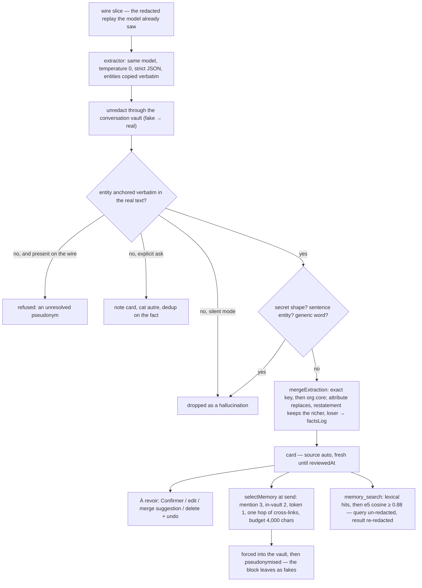

## 1. Executive Summary

OpenMasq is a multi-model desktop chat client whose whole premise is that the
model never sees real data: an on-device NER engine replaces names,
organisations and numbers with believable fakes before any network call and a
per-conversation vault restores them in the reply. Its memory — the
**Mémoire** — is the one feature that has to hold real values durably, and the
report is about how a redacting product does that without opening a second
channel out of the machine. Apache-2.0; 197 commits between 25 August and 4
September 2026, 175 by one author and the rest by dependabot, on a `dev`
default branch, in a pnpm monorepo with a desktop app at 0.9.0, a signed
macOS build and a `FEATURES.md` that lists every feature with the file that
implements it. The memory is 5,274 lines of TypeScript across
`packages/ui/src/memory/`, `state/memory/`, `pages/Memory/` and the desktop
main process's `embed/` and `memory_embeddings` modules, with 239 test cases
in 25 files and a scenario suite that drives the product's own pipeline over
a memory that grows between conversations. The screen found a `.githooks/`
directory and nineteen manifests inside the seven-day cooldown; nothing was
installed or run.

Three decisions define it, and each is stated in a comment with the
measurement that forced it. Extraction reads the **wire** — the redacted
replay the model has already received — and answers in fakes, which are
un-redacted locally through the conversation's vault; not one new byte of
real data leaves, and the vault doubles as the hallucination filter, because
an entity the model invented resolves to nothing in the real text and is
dropped (`memory/extract.ts:22-33`). Selection happens **client-side on real
values**, because the model only holds fakes that are not even stable across
conversations since a per-conversation salt was introduced, so it *cannot*
judge which card is relevant (`memory/select.ts:20-38`); the selected
entities are then forced into the vault before the user's message is
redacted, so the same name maps to the same fake in the block and in the
text even under the regex engine. And a card **updates rather than
stacks**: a fact carrying a deadline, a budget or a contact replaces the
sentence with the old one, a restatement keeps the richer wording, and what
was removed goes into a three-deep history a person can restore, because *"a
consolidation that overwrites its evidence in silence is the measured failure
mode of agent memories"* (`memory/memoryTypes.ts:21-30`).

It is strongest as a study in where the leaks are. The forced list is
filtered for words of the common lexicon after a note titled « dossiers »
redacted that word across a whole conversation, and for notorious brands
after a forced « google » alias turned *Google Drive* into *Ostrel Drive* in
the model's own tool errors; the pseudonym guard exists because a vault that
had not hydrated stored the model's fake for *gouvernement français* as a
card, with the real value as its alias. It is weakest as an epistemic
system: a card has one provenance flag and one timestamp, the review inbox
is advisory and nothing waits for it, and every card in scope reaches the
prompt whatever its state. The product knows this — *"the product's most
delicate feature where confidentiality is concerned"* — and the design
spends its care on egress rather than on belief.

## 2. Mental Model

A memory is a **card about one entity**, and the entity's real name is the
key. The extractor is told to copy names *exactly as written* so the anchor
check can find them; `normalizeMem` lowercases, strips accents and
separators, keeps dots only inside emails and preserves CJK scripts, so
casing and spacing variants of one name hit one card. A card is born one of
two ways: the user writes it — from the Mémoire page, a text selection's
« Retenir », or the slash command — and carries no `source`; or the
extraction writes it and stamps `source: "auto"`. The profile is a separate,
always-injected paragraph for what the user says about themselves; a
preference with no entity is routed there rather than to a card, and the
cleanup pass migrates the note cards an older extractor minted for such
preferences.

The state a card can hold is thin on purpose. It is **fresh** while a machine
write is newer than `reviewedAt` and within seven days — the inbox — and
**treated** once a person confirms or edits it from the panel; nothing reads
that distinction except the inbox and the graph's badge, so an unreviewed
card injects exactly like a reviewed one. It has a **history**: each merge
that replaces an attribute sentence or evicts one at saturation pushes the
loser onto `factsLog`, bounded at three, and `restoreFact` swaps an entry
back with the displaced sentence taking its place, so a restore is itself
restorable. It can be **merged**: two same-category cards sharing a key or a
token subset, or two whose e5 vectors sit above 0.95 and whose name tokens
are not disjoint, are proposed as a pair the person confirms, and the
surviving card keeps the other's surfaces as aliases so recall by the old
name still works. It **dies** only by deletion, with a six-second undo that
reinserts it verbatim; there is no archive, no expiry and no record that a
deleted fact was refused.

Memory is therefore user-controlled with a machine writer, treated as
**ground truth** once stored — the injected block is framed as *"contexte
durable, à utiliser sans le réciter tel quel"* — and dated: every injected
line carries the card's last update as `noté le DD/MM/YYYY`, because
*"temporal reasoning is models' measured weak point on long-term memory, and
a card with no date reads as eternally true"* (`memory/select.ts:147-151`).

## 3. Architecture

The renderer owns the memory. `packages/ui/src/memory/` is pure TypeScript
with no React: `memory.ts` (normalisation, keys, tokens, the homograph
deny-list, the inbox predicate), `compaction.ts` (restatement, attribute
replacement, saturation, `factsLog`, restore), `dedupe.ts` (suggestions and
the self-healing `autoCleanMemory`), `extract.ts`, `extractParse.ts`,
`extractExplicit.ts`, `extractSweep.ts` and `mergeExtraction.ts` (the
extraction contract end to end), `select.ts` (injection), `search.ts` (the
tool), `cluster.ts`, `graph.ts` and `force.ts` (the graph view), `profile.ts`
and `usage.ts`. `state/memory/` holds the hooks: `useMemory.ts` is the CRUD
over `settings.memoire`, `useMemoryExtraction.ts` the timers and
`memoryExtractionRun.ts` one extraction pass, `useMemoryIndex.ts` the bridge
to the desktop's embedder. `pages/Memory/` is the screen: a force-directed
graph first, a list second, a node panel with the history, and
`useMemoryReview.ts` for the inbox.

Persistence is the settings object. `storePersistence.ts:60-90` strips
`memoire`, the coffre and the prompt templates from the `localStorage` copy
whenever a host database exists, on the stated ground that the memory is
*"REAL cross-conversation PII … the coffre's at-rest regime"*; the desktop's
per-account libSQL database holds it, encrypted at rest only in a packaged
build where Electron `safeStorage` can protect the key
(`apps/desktop/src/main/store/dbCrypto.ts`), plaintext under `pnpm dev`. The
browser preview and mobile keep `localStorage` as their only store. The
desktop main process also runs `embed/` — a bundled, sha256-verified,
QUInt8-quantised export of `intfloat/multilingual-e5-small` on ONNX, loaded
offline with no download path — and a `memory_embeddings` table of card id,
model tag, text hash and vector, kept in step by diffing hashes and pruned
when a card is deleted so *"a deleted card must not leave a vector of its PII
behind."* The `@openmasq/sync` package carries `memoire` in its end-to-end
encrypted user-data record alongside the vault; merging the two devices'
card lists is left to `autoCleanMemory`'s certain cases.

`ci.yml` runs on pull requests and pushes through the shared `verify.yml`,
which runs the vitest suite and gates releases; `scan.yml` runs static
checks. The memory tests run in jsdom
against a mock model; the live variant, `memoryLife.eval.ts`, is skipped
without a key.

### Deployment and ergonomics

It is a desktop app, so the memory costs nothing to stand up beyond the app:
no service, no daemon, no separate store. A provider API key is needed to
extract — the extraction uses the conversation's own model, or the free
default under the Auto route — but not to store, inject or search; the
lexical tier and the whole selection cascade run without any model, and the
semantic tier degrades to nothing when the e5 bundle is absent. Fully local
and offline is the design for everything except the model call itself. The
store is human-readable in the sense that the page shows it and a plain-text
diagnostic export dumps every card with its links and the thresholds that
produced them; it is not repairable by hand outside the app, since it is a
JSON field inside an encrypted settings row on the desktop.

## 4. Essential Implementation Paths

**Capture.** `useMemoryExtraction.ts` arms a 120-second idle timer after a
completed turn on the active conversation, flushes on window blur or on
switching away, and sweeps up to three conversations updated within seven
days 45 seconds after startup; an explicit ask fires 800 ms after the turn
settles. `runMemoryExtraction` (`state/memory/memoryExtractionRun.ts:76-300`)
returns early unless `settings.memoryAuto` is on or the ask is explicit,
unless the conversation's `memoryOff` is clear, and unless the slice past the
`memoryWatermark` passes `worthExtracting` — at least 400 new characters of
user text with a NER-detected name or company, or an explicit phrasing in one
of twelve languages. It builds the wire with `wireSlice` (user turns only in
silent mode, because extracting from the assistant's replies, which embed the
injected memory, is *"the self-reinforcement loop"*) or `wireTurns`
(assistant included on an explicit ask), calls the model with
`extractionPrompt` at temperature 0 under a 60-second timeout, retries once on
an unreadable reply, and hands the pass to `sweepExtraction` — one call in
silent mode, up to four on an explicit ask with the already-captured
entities as an exclusion list (`memory/extractSweep.ts`). `resolveExtraction`
(`memory/extract.ts:86-180`) un-redacts every field, strips a leading article
or « chez » when the bare form also anchors (never for a person, whose
particle is part of the name), drops secret shapes, sentence-shaped entities
and generic words, refuses an alias that is generic, a single-word homograph
or present only on the wire, and keeps a fact only when its entity anchors in
the real text — or, on an explicit ask, turns it into a note. Self-preferences
go to the profile. `mergeExtraction` (`memory/mergeExtraction.ts`) finds the
card by exact key and then by organisation core with legal affixes stripped,
same category only; a known fact is a no-op, a new one goes through
`mergeFactsDetailed`, an unknown entity becomes a card with a pre-minted id so
the caption can deep-link and undo it. The watermark advances whether or not
anything was learned, except on an unreachable model.

**Compaction.** `mergeFactsDetailed` (`memory/compaction.ts:135-175`): if an
existing sentence `restates` the fact — content words after glue and framing
are removed differ by at most one mundane word each side over a shared core
of three, with inflections tolerated and any uncovered number or month
breaking the match — keep the richer one and log nothing; else if the fact
carries one of the attribute words (`deadline`, `budget`, `email`,
`travaille chez`, …) and a sentence already does, replace it and log the
old; else append; then `clampSentences` evicts whole sentences oldest first
above 600 characters, protecting the one just written.

**Injection.** `sendOrchestrator.ts:835-880` runs `selectMemory` before the
user-message pass: score 3 for a whole-key mention in the typed text, 2 for
a key present among the conversation's vault originals and NER kinds, 1 for
a distinctive token, then one hop along `crossLinks` from score-3 seeds only,
at most three neighbours, filled by score then `updatedAt` under 4,000
characters with an oversized card skipped rather than stopping the queue.
`formatMemoryBlock` writes the French block; `memoryForcedForBlock` lists the
selected entities and aliases, plus any card entity that appears in the
profile, as forced redactions, minus lexicon words, sentence fragments and
brands the level's notoriety policy spares; `pseudonymize` then runs over the
block with that list. Fail-closed means skip: a redaction error drops the
block rather than sending it. The message records `memoryUsed` ids and
`memorySkipped` diagnoses — budget, or a homograph typed alone — and
`MemoryCaption.tsx` renders one line from them.

**Tool.** `mcpAgent.ts:1628-1652` handles `memory_search`: the query arrives
in fakes and is un-redacted; `searchMemoryHybrid` (`memory/search.ts`) scores
each card by the number of query content words in its entity, aliases and
facts, sorts by score then recency, takes four, and tops up from
`host.memoryIndex.query` above cosine 0.88; the result is re-redacted through
the same vault before it reaches the model, and an empty store is answered
with a sentence rather than an error. The tool is offered only when the store
is non-empty and `memoryOff` is clear (`sendOrchestrator.ts:1598-1610`).

**Review.** `useMemoryReview.ts`: `freshCardIds` plus `duplicateSuggestions`
make the inbox count; Confirmer patches `reviewedAt` pinned to the same
instant as `updatedAt`; delete keeps the card aside for the toast's six
seconds. `MemoryNodePanel.tsx:155` calls `restoreFact`. `useMemory.ts:40-46`
runs `autoCleanMemory` on every change and applies the result if anything
moved.

**Index.** `useMemoryIndex.ts` debounces 800 ms, sends every card's
embeddable text to `memoryIndexSync`, which hashes, embeds the stale ones in
batches of sixteen with the `passage:` prefix, upserts and prunes, and returns
the three nearest neighbours per card as cosine edges; `cluster.ts` keeps
edges at or above 0.92, or 0.95 between two people, and unions them with
mention links into groups the graph draws.

**Tests.** `memory/*.test.ts`, `state/memory/*.test.ts`,
`pages/Memory/*.test.ts*`, `evals/memoryFlow.test.ts`,
`evals/memoryLife.test.ts` with `memoryScenarios.ts` and
`memoryScenarios2.ts`, `apps/desktop/src/main/embed/knn.test.ts` and
`db/memoryEmbeddings.test.ts`.

## 5. Memory Data Model

`MemoryCard` (`memory/memoryTypes.ts`): `id`, `entity`, `aliases?` (at most
six), `cat` in `personne | organisation | projet | autre`, `facts` (at most
600 characters), `factsLog?: { at, prev }[]` (at most three, most recent
first), `source?: "auto"`, `reviewedAt?`, `createdAt`, `updatedAt`.
`MemoryData` is `{ profile?: string; cards: MemoryCard[] }` with the profile
at most 1,200 characters. The whole thing is the `memoire` field of
`Settings` (`types.ts:262`), beside `memoryAuto` and `memoryProposalSeen`; a
conversation carries `memoryWatermark` and `memoryOff`; a message carries
`memoryUsed`, `memorySkipped`, `memoryNoted`, `memoryNotedIds`,
`memoryUpdatedIds`, `memoryNotedFailed` and `memoryNotedPending`
(`packages/schema/src/message.ts:200-215`), ids and codes only.

Scope is the install. Provenance is the `source` flag and, for an explicit
ask, the ids pinned on the reply. Time is `createdAt`, `updatedAt` and the
history entries' `at`; there is no validity field, no expiry and no version
number — the history is the version chain, bounded at three. Episodic
material has no home here: the conversation store keeps the transcript and a
separate, conversation-bound context-compaction summary
(`useContextCompaction.ts`) that is explicitly *not* memory, since its fakes
mean different people elsewhere. Multi-tenancy is per account on the desktop
and an organisation can close the feature for its members remotely
(`state/billing/featureAccess.ts`). The desktop's `memory_embeddings` row is
`card_id, model, text_hash, embedding, updated_at`.

## 6. Retrieval Mechanics

Two paths over one store, split on purpose because *"pulling on demand and
choosing what to inject are two different questions"* (`memory/search.ts:11-16`).

Injection is a cascade, not a search. Tier 3 is `mentions` — a normalised
key of at least three characters, or two CJK glyphs, present at word
boundaries in the typed text; tier 2 is the same test against the
conversation's known real values joined on a hard separator; tier 1 is
`mentionsToken` — a single distinctive token of the entity, excluding digits,
dotted fragments, stopwords, generic terms and a curated list of name-noun
homographs in French and English. Everything else is never injected and is
left to the tool. From certain mentions only, one hop follows `crossLinks`,
which pairs cards whose facts or aliases name another card's key, ranked by
recency and capped at three. The budget is character-based with a fixed
per-line overhead of 40 characters, direct hits before neighbours, and a skipped
direct hit is recorded as a diagnosis. The block is French regardless of the
interface language, because the model reads it and the system prompt is
French.

The tool is lexical first: `searchMemoryStore` counts query content words of
three or more characters that are not stopwords against each card's text and
returns the top four lines with a date; `searchMemoryHybrid` fills the
remaining slots from the e5 index above 0.88, a floor deliberately below the
0.92 clustering threshold because a query is shorter than a card and *"the
error leans toward recall"*. The comments record the e5 baseline (about 0.85
between unrelated texts) and the calibration corpus, and warn that the
clustering margin is about ±0.006 and export-specific.

Failure modes are the ones the code names and tests: a lone first name that
is also a noun does not recall — on purpose, and the caption says so; a
2-glyph CJK name matches across a word boundary in unsegmented text, pinned
as an accepted false positive; a note's generic title can be a card but never
a matchable surface; a cross-category homonym is two cards and a fact
addressed to one must not slide to the other. Over-recall is bounded by the
budget; under-recall of a description that names nothing is the semantic
tier's job and exists only on the desktop.

## 7. Write Mechanics

Writes are deferred and gated. Silent extraction is **off by default**
(`useMemoryExtraction.ts:12`), proposed once in the chat, and lives in
Settings → Confidentialité as « Extraction automatique de la mémoire » rather
than on the memory page; an explicit ask is its own consent and runs anyway.
The prompt (`memory/extractParse.ts:30-78`) asks for durable facts only —
never the topic of the day — with `entite` copied exactly, an `alias`, a
category and one short sentence, a `profil` only for an explicit
self-description whose named people and organisations must also appear as
facts, at most six facts in silent mode and 25 on an explicit ask, no
passwords, keys, IBANs or card numbers, and two homonyms kept as two facts;
an explicit ask adds the instruction to find *what* in the previous turns,
the assistant's included, and to invent a short title only when no proper
noun fits. The parser scans for every balanced top-level object, reads them
last first past `<think>` blocks, and distinguishes *unreadable* (retry
once, then advance the watermark) from *empty*.

Deduplication happens three times: on the fact (containment against the
card's normalised facts), on the entity (exact key, then organisation core,
same category), and for a note, on the fact against the profile and every
card. Updates are replacements with a history; there is no append-only
mode. Deletion is a filter on the array. Conflict is decided by the attribute
list: a new deadline wins over the old one, and a date that differs is never
folded as a restatement. Agent-generated facts do not exist as a class — the
extractor reads what the user typed, and only on an explicit ask what the
assistant said, and the anchor makes the model's own knowledge inadmissible.
Noise is filtered by the char floor and the NER signal before any call, by
the secret and sentence and generic-word checks after it, and by the
homograph rules on aliases.

### Operational cost

Nothing blocks the send. Extraction runs off the critical path on timers with
one model call per pass — the same model as the conversation, so its price is
the conversation's — bounded at 60 seconds, at most four calls on an explicit
sweep, and zero calls when the gate says the slice is not worth one. The lag
before a fact is usable is the idle timer plus the call: at least 120 seconds
in silent mode, under a second of scheduling plus the call on an explicit
ask, with the caption showing « Mise en mémoire… » meanwhile. No pass
re-reads the store; `autoCleanMemory` is a pure fixpoint over the card array
on every change, and the embedder touches only cards whose text hash moved.
On the read path the block is bounded at 4,000 characters, sits inside the
system content, and changes whenever the typed text mentions a different
entity, so a provider's prompt-prefix cache is invalidated by design on every
send that recalls something new.

## 8. Agent Integration

The model has one affordance, `memory_search`, and no write tool; nothing it
says becomes a memory unless the user asks for it to be remembered, and even
then the entity has to appear in the text. Injection is automatic and
invisible to the model except as a French paragraph it is told not to recite.
The user has more: the page, the selection gesture, the slash command, the
per-conversation switch in the redaction rules modal that cuts both
directions *"otherwise it lies: the model could retrieve via the tool what
the injection no longer gives"* (`sendOrchestrator.ts:1594-1597`), a dot on
the rail icon when something was noted elsewhere, and a caption under each
message that names what rode the send and explains a surprising non-recall.
There is no compaction-boundary handling because there is no session
boundary to handle: memory is cross-conversation by definition and the
conversation's own compaction is a separate mechanism that never writes here.
Adapting the memory to another client would mean adopting the redaction
engine with it; every interesting decision assumes a vault.

## 9. Reliability, Safety, and Trust

**Egress.** The extractor reads only bytes the model already received; the
un-redaction is local; the block and the tool result are pseudonymised
through the conversation's engine, with the remembered entities forced so
protection never depends on detection; and the forced list is filtered for
lexicon words, sentence fragments and spared brands because each of those
had caused a measured failure. `memoryFlow.test.ts` asserts a remembered
name never appears in the wire even under the pure regex engine.

**Hallucination.** The anchor is the mechanism: an entity must be in the
real text, an alias must anchor separately, and a value present on the wire
but absent from the real text is an unresolved pseudonym and is refused
(`memory/extract.ts:101-103`, `pseudonymGuard.test.ts`). The explicit path
loosens this to a titled note and says so.

**Provenance and uncertainty.** One flag, `source: "auto"`, and a date. There
is no confidence, no verification and no state that withholds a card; the
inbox is a to-do list, and a card that never gets confirmed is injected all
the same. The near-miss for a trust state is exactly this: `reviewedAt`
exists, the inbox reads it, and nothing on the read path does.

**At rest.** Stored in the clear locally by design, since a fake is no longer
stable across conversations; encrypted at rest through the desktop database
only in packaged builds with a keychain, and in plaintext `localStorage` on
the browser preview and mobile — a trade the persistence code accepts
explicitly. The e5 vectors carry the card's meaning and live in the same
database. The sync carries cards inside the encrypted user-data record.

**Loss and races.** Every store change is a settings patch through one
`setSettings`; the extraction merges twice, once for the caption against a
snapshot and once inside the updater, and relies on pre-minted ids and pure
functions to make the two agree. A hung `host.complete` used to lock a
conversation's extraction forever; the timeout is the fix and the comment
records the bug.

**Deletion.** Immediate, with a six-second undo. No tombstone: a deleted
fact can be re-extracted on the next pass if the conversation still says it,
and the explicit sweep's exclusion list covers only entities currently in
memory. Dismissing a merge suggestion is session-only.

## 10. Tests, Evals, and Benchmarks

239 cases in 25 files, run in CI. The pure modules are tested case by case
and most cases carry the bug that produced them in their name: the extractor
(55 cases — the gate, the parser under thinking-model prose, un-redaction,
the hallucination drop, the secret drop, alias rules, note routing, the
explicit ask in every supported language, the watermark under each failure
mode), selection (23 plus six for links — each tier, the short-key rule, the
generic token, the homograph, the CJK accepted false positive, the budget's
skip-not-stop, the forced list's lexicon and notoriety filters), dedupe (18 —
surface and semantic suggestions, the distinct-identity rule, the
data-preserving merge, the idempotent cleanup that never touches a
user-authored card), compaction (16 — restatement, attribute replacement, a
changed month never folded, whole-sentence eviction, symmetric restore),
the sweep, the profile, usage and the graph frame.

Two suites run the product's pipeline rather than a module.
`memoryFlow.test.ts` drives `runWorkflow` in jsdom with a mock model and
asserts the injected block is redacted under the regex engine, that a greeting
injects only the profile, that an empty store offers no tool, and that
`memory_search` matches real values against a fake query and returns
re-redacted. `memoryLife.test.ts` runs the scenarios in `memoryScenarios.ts`
and `memoryScenarios2.ts` — eight and ten phases — where each phase is a real
conversation whose extraction seeds the next: retention, dedup, an explicit
note, direct and token recall, silence, the tool, a memory grown by forty
unrelated cards whose noise must stay out and whose injected lines must fit
the budget, then homonyms precise and ambiguous, a homograph trap, an
attribute update that contradicts, a company affix, an ambiguous search and a
final coherence check. The same scenarios run against a live model in
`memoryLife.eval.ts` when a key is present and write a dated report;
`evals-reports/` in the tree holds only the README describing the two
benches, so no live result is committed.

The thresholds — 0.92, 0.95 and 0.88 — were calibrated on a scratchpad
corpus the comments describe and the tree does not contain. There is no
retrieval-quality benchmark beyond the scenarios, no measurement of
extraction precision on a real corpus, and no test that the sync's merge of
two devices' card lists converges beyond the cleanup's certain cases. The
tests one would want are a precision and recall figure for the anchor filter
on a multilingual transcript set, and a case for what happens to `factsLog`
when both devices replaced the same attribute.

## 11. For Your Own Build

### Steal

- **Extract from what the model already saw.** If your system redacts, run
  the memory extractor over the redacted replay and resolve its answer
  locally; the egress question disappears and the resolution step becomes a
  hallucination filter for free.
- **Anchor every extracted entity verbatim, and treat a value present only
  on the wire as a pseudonym to refuse,** not a note to keep.
- **Select on real values client-side and force the selected names into the
  redactor** rather than trusting detection to catch a free-form name.
- **Attribute replacement with a bounded, restorable history.** Decide which
  words make two sentences compete, replace rather than accumulate, and keep
  the loser where a person can put it back; log nothing for a pure
  restatement so real updates are not pushed out.
- **Explain the non-recall.** A budget skip or a deliberate homograph deny is
  worth one line under the message; ordinary silence is not.
- **Write the measurement next to the threshold** — the baseline, the corpus,
  the margin and the pair that set the bar.

### Avoid

- **An inbox that nothing waits for.** If review is the trust mechanism, at
  least one read path should treat an unreviewed card differently, or the
  inbox is a badge.
- **A card's timestamp as its only time.** Injecting `noté le` helps a model
  doubt a stale deadline; it does not say when the fact stopped being true.
- **Deletion without a refusal record** in a system that re-extracts from
  the same conversations on a timer.
- **Language-keyed attribute and glue lists** in a product that extracts in
  twelve languages; the compaction rules here read French.

### Fit

This is a memory for a single person using a redacting chat client, sized to
tens or hundreds of cards, running on their own machine, with a maintainer
who will keep the attribute lists, the homograph list and the thresholds
current by hand. It suits a builder who already has a vault and wants
cross-conversation memory that cannot add an egress path, and who accepts
that the epistemics are a review inbox and a date. It does not suit anything
multi-user, anything that needs a fact to expire or be superseded on the
record, anything where the model should write memory, or a corpus large
enough that an exact O(n²) kNN over every vector is a cost; the design says
so about the last of these itself. Walk away if you need scope, trust states
or an audit of what changed; take the extraction and the injection cascade
if you need a redacted product to remember.

## 12. Open Questions

- What the extractor's precision is on real transcripts across the twelve
  languages the explicit-ask detector covers; the anchor drops
  hallucinations but nothing in the tree measures what it keeps.
- How `autoCleanMemory` behaves on a sync merge where both devices rewrote
  one card — the code says duplicates from the sync heal the same way, and
  no test seeds two histories of the same card.
- Whether the semantic tier changes recall in practice; it exists only on
  the desktop with the bundle baked, and the scenarios run without it.
- What the org's remote closing of the feature does to a store already
  populated on a member's machine.
- Whether the history's depth of three is enough once attribute updates
  arrive from several conversations in a week.

## Appendix: File Index

- Data model and store: `packages/ui/src/memory/memoryTypes.ts`,
  `packages/ui/src/types.ts:262-270`, `packages/schema/src/message.ts:200-215`,
  `packages/ui/src/state/memory/useMemory.ts`,
  `packages/ui/src/state/storePersistence.ts:60-90`,
  `apps/desktop/src/main/store/dbCrypto.ts`,
  `apps/desktop/src/main/db/schema.ts:219-230`,
  `apps/desktop/src/main/db/memoryEmbeddings.ts`,
  `packages/sync/src/userdataTypes.ts:53-150`.
- Write path: `packages/ui/src/state/memory/useMemoryExtraction.ts`,
  `packages/ui/src/state/memory/memoryExtractionRun.ts`,
  `packages/ui/src/state/memory/memoryNote.ts`,
  `packages/ui/src/memory/extract.ts`, `extractParse.ts`, `extractExplicit.ts`,
  `extractSweep.ts`, `mergeExtraction.ts`, `compaction.ts`, `profile.ts`.
- Retrieval and injection: `packages/ui/src/memory/memory.ts`, `select.ts`,
  `search.ts`, `graph.ts:50-63`, `packages/ui/src/send/sendOrchestrator.ts:835-880,1138-1145,1594-1610`,
  `packages/ui/src/agent/mcpAgent.ts:1628-1652`,
  `packages/ui/src/components/message/MemoryCaption.tsx`.
- Review and cleanup: `packages/ui/src/pages/Memory/useMemoryReview.ts`,
  `MemoryNodePanel.tsx`, `MemoryView.tsx`, `packages/ui/src/memory/dedupe.ts`,
  `usage.ts`, `memoryExport.ts`,
  `packages/ui/src/containers/modals/redaction/RedactionRulesModal.tsx:37-100`,
  `packages/ui/src/pages/Settings/privacy/PrivacyTab.tsx`.
- Index and clustering: `packages/ui/src/state/memory/useMemoryIndex.ts`,
  `packages/ui/src/memory/cluster.ts`, `apps/desktop/src/main/embed/index.ts`,
  `model.ts`, `knn.ts`.
- Tests and evals: the 25 files named in section 4; `packages/ui/src/evals/memoryLife.ts`,
  `memoryLife.eval.ts`, `memoryScenarios.ts`, `memoryScenarios2.ts`.
- Documentation: `FEATURES.md` § 6, `RELEASE_NOTES.md`, `README.md`.
- Searches behind the absence claims: `rg -n 'reviewedAt' packages/ui/src --glob '!*.test.*'`
  (writers in `useMemory.ts` and `useMemoryReview.ts`, readers in
  `memory.ts:freshCardIds` and the page — none in `select.ts`, `search.ts`
  or `sendOrchestrator.ts`); `rg -n 'validFrom|valid_from|expires|ttl' packages/ui/src/memory`
  (none); `rg -n 'tombstone|rejected|dismissed' packages/ui/src/memory packages/ui/src/state/memory packages/ui/src/pages/Memory --glob '!*.test.*'`
  (only the session-scoped `dismissed` set in `useMemoryReview.ts`);
  `ls evals-reports` (README.md only); `rg -rn 'memoire' apps packages | rg -i sync`
  (the sync types and `useUserdataSync.ts` only).

## History

**2026-09-06** — [`874608ec6835787a73176723812b29eb41bc1088`](https://github.com/openmasq/openmasq/commit/874608ec6835787a73176723812b29eb41bc1088) — first reading, at the head of the `dev` default branch, 197 commits in. The screen found a `.githooks/` directory and nineteen manifests inside the seven-day cooldown; nothing was installed or run. Two marks: `human_review` for the inbox, the merge suggestions and the restorable history, `negative_eval` for the injection and recall cases whose positive control sits in the same case. `trust_state` withheld: `reviewedAt` and `source: "auto"` are read by the inbox and by nothing on a read path. `tombstone`, `bitemporal`, `scope_enforced` and `audit_log` withheld: deletion leaves no record, the only time is the last update, the store has no scope key, and `factsLog` is a three-deep history of replaced text rather than a mutation log.
