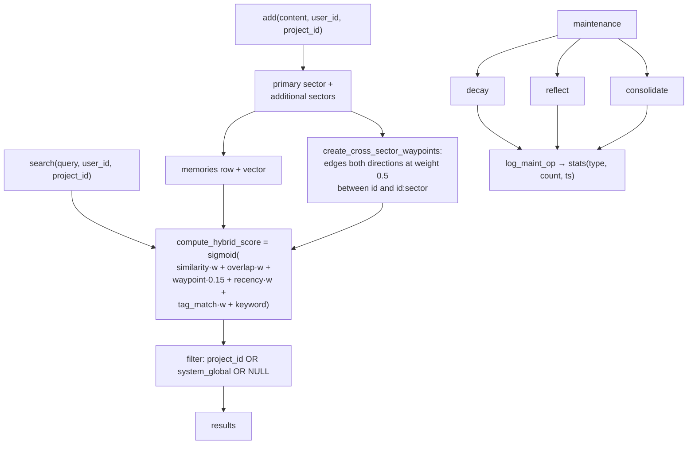

## 1. Executive Summary

OpenMemory is an Apache-2.0 "cognitive memory engine" — SQLite or Postgres,
Python and Node SDKs, MCP, a VS Code extension, integrations for LangChain,
CrewAI and AutoGen, and source connectors for GitHub, Notion, Google Drive,
OneDrive and a web crawler.

**The README opens with a banner: "🚧 This project is currently being rewritten.
Expect breaking changes and potential bugs."** with development moved to a
`rewrite` branch. This report reads `main` at the pinned commit and takes that
warning at face value: what follows describes a system in transition.

**The pitch is that it is not a vector database.** `Why.md` sets out a
comparison table whose distinguishing rows are "Multi-sector (episodic, semantic,
procedural, emotional, reflective)", "Biological alignment: Inspired by human
brain's sectorial memory formation", and "Explainable recall ✅ Full trace path
via waypoint graph", concluding: *"Vector DBs store 'what was said.' OpenMemory
remembers 'what it meant, when, how it felt, and why it matters.'"*

**The biological alignment is twenty-five numbers somebody typed.**
`packages/openmemory-js/src/ops/dynamics.ts` opens with twelve constants —

```
ALPHA_LEARNING_RATE_FOR_RECALL_REINFORCEMENT = 0.15
BETA_LEARNING_RATE_FOR_EMOTIONAL_FREQUENCY = 0.2
GAMMA_ATTENUATION_CONSTANT_FOR_GRAPH_DISTANCE = 0.35
THETA_CONSOLIDATION_COEFFICIENT_FOR_LONG_TERM = 0.4
ETA_REINFORCEMENT_FACTOR_FOR_TRACE_LEARNING = 0.18
LAMBDA_ONE_FAST_DECAY_RATE = 0.015
LAMBDA_TWO_SLOW_DECAY_RATE = 0.002
TAU_ENERGY_THRESHOLD_FOR_RETRIEVAL = 0.4
```

— and a `SECTORAL_INTERDEPENDENCE_MATRIX_FOR_COGNITIVE_RESONANCE`: a symmetric
5×5 grid of values from 0.2 to 0.8 relating the five sectors.

No citation, no derivation, no fitting procedure, no sensitivity analysis, and no
evaluation anywhere in the tree. Greek-letter names and a "cognitive resonance"
matrix are a *presentation* of arbitrary constants, not evidence of biological
alignment, and this atlas has learned to check the difference.

**And then the thing that is genuinely well done is a test** — section 10.

## 2. Mental Model

A memory is assigned a sector. Waypoint edges connect a memory to its
cross-sector projections, and those edges contribute to the retrieval score
alongside similarity, overlap and recency. Background passes decay, reflect and
consolidate.



## 3. Architecture

`packages/openmemory-js` and `packages/openmemory-py` are the two SDKs, with the
Node package carrying the engine: `memory/hsg.ts` (the hybrid scoring graph),
`ops/dynamics.ts`, `core/db.ts`, and server routes for memory, dynamics,
temporal, compression, sources, users, dashboard, IDE, LangGraph and Vercel.
Plus a `dashboard/`, a VS Code extension, Docker Compose, and deploy manifests
for Railway, Render and Vercel.

Governance is unusually complete for a project of this size: `GOVERNANCE.md`,
`CODE_OF_CONDUCT.md`, `CONTRIBUTING.md`, `SECURITY.md`, `MIGRATION.md`,
`ARCHITECTURE.md`, `CHANGELOG.md` and `Why.md`.

## 4. Essential Implementation Paths

**Score** — `packages/openmemory-js/src/memory/hsg.ts` (`scoring_weights`
`:140-165`, `compute_hybrid_score` `:471-488`).

**Link sectors** — `hsg.ts` `create_cross_sector_waypoints` `:498-525`.

**The constants** — `packages/openmemory-js/src/ops/dynamics.ts` `:5-28`
(the twelve constants, the matrix, the sector index mapping),
`AssociativeWaypointGraphNode` `:37-45`.

**Isolate** — `packages/openmemory-js/tests/test_project_isolation.ts`.

**Count maintenance** — `packages/openmemory-js/src/core/db.ts` `log_maint_op`
`:913-931`.

## 5. Memory Data Model

Memories carry a sector, an embedding, a salience, an activation energy and
`user_id` / `project_id`. Waypoints are their own edge rows —
`(from, to, user_id, project_id, weight, created, updated)` — written in both
directions so the graph is symmetric by construction.

`create_cross_sector_waypoints` is worth reading because it is simpler than the
vocabulary around it: for each additional sector it inserts two edges between the
memory id and a synthetic `${id}:${sector}` node at a fixed weight of `0.5`. So a
"cross-sector waypoint" is a projection of one memory into each sector it also
belongs to, at a constant weight — not an association learned between distinct
memories.

There is no confidence field, no status, no supersession pointer and no
tombstone. Salience and activation energy are floats.

## 6. Retrieval Mechanics

`compute_hybrid_score` is a weighted sum through a sigmoid:

```typescript
const raw =
    scoring_weights.similarity * s_p +
    scoring_weights.overlap * tok_ov +
    scoring_weights.waypoint * wp_wt +      // 0.15
    scoring_weights.recency * rec_sc +
    scoring_weights.tag_match * tag_match +
    keyword_score;
return sigmoid(raw);
```

So the waypoint graph is not decorative — it contributes 15% of the pre-sigmoid
score, and `waypoint_boost` and `max_waypoint_weight` bound its growth. The
mechanism the marketing rests on does exist and does affect ranking.

**The `system_global` scope is the modelling decision worth naming.** The query
filters `project_id OR system_global OR NULL`, so a project sees its own memories
plus a shared global tier — and the isolation test asserts both halves: project
Alpha finds its own, does *not* find Beta's, and *does* find the global one.
That is the right shape for "my coding standards apply everywhere, my Alpha
roadmap does not".

`user_id` and `project_id` reach the query, so `scope_enforced` is earned. The
test file itself flags the gap in a comment: "If `project_id` is NOT provided, it
doesn't apply the project filter" — an unscoped query sees everything for that
user, which is a documented and deliberate default rather than an oversight.

**The explainability claim is the one this report could not verify.** `Why.md`
promises "Full trace path via waypoint graph" and the README "Explainable traces
(see which nodes were recalled and why)". Waypoint weights feed the score, and no
trace structure was found in the memory route's query response — so the
*information* exists inside scoring and the returned explanation was not located
at this commit.

## 7. Write Mechanics

Add, assign sectors, write waypoints. Correction is decay, reflection and
consolidation running in the background; nothing marks a memory wrong, superseded
or withdrawn.

`log_maint_op(type, cnt)` writes `(type, count, ts)` into a `stats` table for
`decay`, `reflect` and `consolidate`. That is operational telemetry — how many
memories a pass touched — not a record of *what* changed, which is why the
`audit_log` mark is withheld.

## 8. Agent Integration

Two SDKs, MCP, a VS Code extension on the marketplace, framework adapters for
LangChain, CrewAI, AutoGen and Streamlit, source connectors for GitHub, Notion,
Google Drive, OneDrive and a crawler, a dashboard, and one-click deploys.

The integration surface is the widest thing about the project, and the rewrite
banner applies to all of it.

## 9. Reliability, Safety, and Trust

**Two marks: scope enforced and negative eval.**

**Trust state, tombstone, bitemporal, audit log, human review — no.**

**The framing is the risk.** A memory system that describes itself as
biologically aligned, multi-sector and explainable, and whose distinguishing
parameters are twenty-five hand-typed numbers with no derivation, invites a
reader to trust the model rather than the measurement. Nothing here is dishonest
— the constants are in a plainly named file, exported, and readable — and nothing
justifies the claim either.

The practical consequence is that the sector matrix is unfalsifiable as shipped.
There is no evaluation that would move a cell of it, so the difference between
0.7 and 0.4 for episodic↔semantic is a preference. A single fixture set scoring
retrieval with the matrix, with it flattened to all-ones, and with it randomised
would settle whether it earns its place, and would take an afternoon.

**The rewrite banner is doing real work** and a reader should let it: this is
`main` for a project whose author has moved to a branch and asked for help.

## 10. Tests, Evals, and Benchmarks

**No paper, no benchmark, no committed results.**

**`packages/openmemory-js/tests/test_project_isolation.ts` earns the
`negative_eval` mark, and it is the best thing in the repository.** It writes a
memory into project Alpha, one into project Beta, and one into the global scope,
then asserts in both directions:

```typescript
if (!hasAlpha)      throw new Error(`FAIL: ${projA} could not find its own memory.`);
if (hasBetaInA)     throw new Error(`FAIL: ${projA} found memory from ${projB}.`);
if (hasGlobalInA.length === 0)
                    throw new Error(`FAIL: ${projA} could not find global memory.`);
```

and then symmetrically from Beta. Three assertions per direction — **it finds its
own, it does not find the other project's, and it does find the global tier** —
is exactly the shape an isolation test needs, because each one alone can be
satisfied by a broken implementation: return everything, return nothing, or drop
the global scope.

`mcp_per_tenant.test.ts` and `omnibus.test.ts` sit beside it.

What is missing is any evaluation of retrieval quality, of the sector
assignment, or of the constants. The system's entire distinguishing claim is
unmeasured.

**I ran nothing.**

## 11. For Your Own Build

### Steal

- **Test isolation in three directions at once.** Own memories present,
  other-scope memories absent, shared-scope memories present. Any one assertion
  alone passes for a broken implementation; together they pin the behaviour.
- **Have a `system_global` tier and test that it crosses the boundary.** "My
  coding standards apply to every project, my roadmap does not" is a real
  distinction, and the global tier is the part people forget to test.
- **Note the unscoped default in the test file.** "If `project_id` is NOT
  provided, it doesn't apply the project filter" — written where the next reader
  will see it.
- **Bound a graph signal's contribution.** `waypoint` at 0.15 of the pre-sigmoid
  score, with a `waypoint_boost` and a `max_waypoint_weight`, keeps an
  association graph from swamping similarity as it densifies.
- **Say when your project is mid-rewrite.** The banner is the first thing in the
  README and it changes how everything below it should be read.
- **Ship the governance documents.** `GOVERNANCE.md`, `SECURITY.md`,
  `MIGRATION.md` and `CONTRIBUTING.md` at this size is more than most.

### Avoid

- **Do not let naming carry an argument.**
  `SECTORAL_INTERDEPENDENCE_MATRIX_FOR_COGNITIVE_RESONANCE` is a 5×5 array of
  numbers somebody chose. Greek letters and a cognitive vocabulary make constants
  look derived; a citation, a fitting procedure or an ablation makes them
  derived.
- **Do not claim biological alignment without a reference.** The comparison table
  scores the project ✅ against vector databases' ❌ on exactly the rows nothing
  measures.
- **Do not promise an explainable trace the response does not carry.** Waypoint
  weights feed the score; a query result that returns the path is the feature the
  README describes.
- **Do not confuse a maintenance counter with an audit trail.**
  `stats(type, count, ts)` tells you a decay pass touched *n* memories, not which
  ones or what changed.
- **Do not leave the parameters unfalsifiable.** Run retrieval with the matrix,
  flattened, and randomised. If flattened scores the same, delete the matrix.

### Fit

The integration surface — two SDKs, MCP, VS Code, four frameworks, five source
connectors — is the reason to look, and the rewrite banner is the reason to wait.
For a reader wanting sectored memory today, the parameters that make it sectored
are unvalidated.

The isolation test is worth copying into whatever you do build.

## 12. Open Questions

- **Where did the matrix come from?** No citation or derivation appears in the
  tree.
- **Does the query response carry a waypoint trace?** The claim is in `Why.md`
  and the README; no trace structure was found in the memory route.
- **What changes on the `rewrite` branch?** The README directs contributors
  there; only `main` was read.
- **Do the Python and Node SDKs share the constants?** Only the Node engine was
  traced.

## Appendix: File Index

**The constants** — `packages/openmemory-js/src/ops/dynamics.ts` (the twelve
named constants `:5-12`, `SECTORAL_INTERDEPENDENCE_MATRIX_FOR_COGNITIVE_RESONANCE`
`:14-20`, `SECTOR_INDEX_MAPPING_FOR_MATRIX_LOOKUP` `:22-28`,
`DynamicSalienceWeightingParameters` `:30-35`, `AssociativeWaypointGraphNode`
`:37-45`), `packages/openmemory-js/src/server/routes/dynamics.ts`

**Scoring and waypoints** — `packages/openmemory-js/src/memory/hsg.ts`
(`waypoint` interface `:31`, `scoring_weights` `:140-165`,
`compute_hybrid_score` `:471-488`, `create_cross_sector_waypoints` `:498-525`)

**Storage** — `packages/openmemory-js/src/core/db.ts` (`log_maint_op`
`:913-931`), `packages/openmemory-js/src/core/migrate.ts`

**Tests** — `packages/openmemory-js/tests/test_project_isolation.ts` (the setup
`:22-52`, the Alpha assertions `:57-79`, the Beta assertions `:81-96`, the
unscoped-default note `:98-101`), `mcp_per_tenant.test.ts`, `omnibus.test.ts`

**Claims** — `README.md` (the rewrite banner `:1-5`, the feature list `:20-30`,
the trace claims `:26`, `:242`, `:304`), `Why.md` (the vector-DB comparison
table `:11-24`, the SaaS comparison `:28-`)

## History

**2026-08-09** — [`9fdfc2ac09317881d0cdad6efd8b4859fc886323`](https://github.com/CaviraOSS/OpenMemory/commit/9fdfc2ac09317881d0cdad6efd8b4859fc886323) — first reading, on `main`. The README announces a rewrite in progress on a separate branch, which was not read. Screened before reading; the tree was read, never installed, and no test was run.
