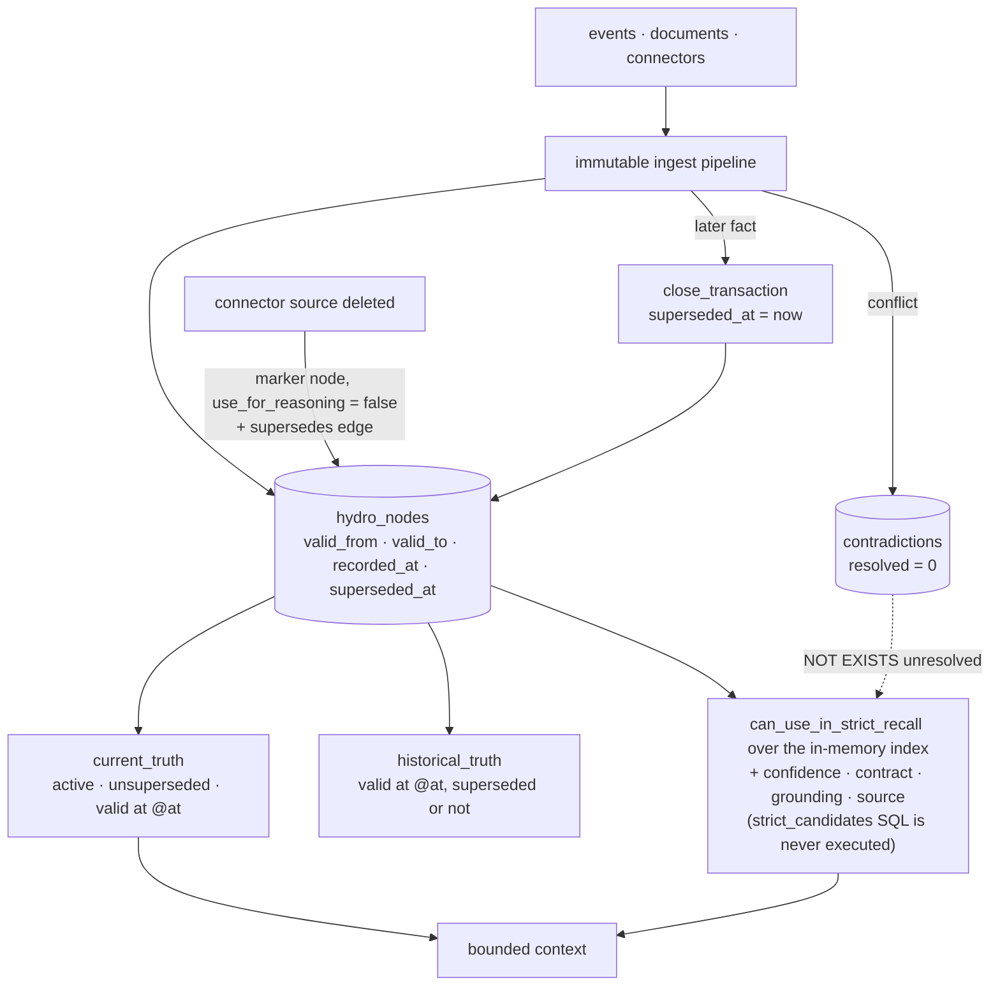

## 1. Executive Summary

LongMemory is the system this atlas reported on as **OpenMemory**. The repository was renamed from `CaviraOSS/OpenMemory` to `CaviraOSS/LongMemory` on 31 August 2026, with a `MIGRATION.md` moving the npm package, CLI, environment prefix and routes to the new name. It is Apache-2.0, version 1.0.0, about 28,400 lines of TypeScript under `src/`, plus a Next.js dashboard, a VS Code extension, host integrations, and a benchmark harness for LongMemEval, LoCoMo and BEAM.

**It is a rewrite, not a rename.** The report's previous pin read `packages/openmemory-js/`, whose README announced a rewrite in progress on another branch. That rewrite is on `main`: `packages/openmemory-js` is gone, every file the previous appendix cited is gone, and the hand-typed sectoral interdependence matrix at the centre of that reading survives only as a mapping inside `src/core/migration/legacy_cleaner.ts`. The new engine's own invariant list rejects the old shape in so many words — *"worlds are recursive containers, not flat sectors"*.

What replaced it is worth the report, and what decides its central claim is not
in the file the design points you at. The store publishes its recall contract
as named SQL strings, and `strict_candidates` reads like the whole answer — the
conditions it applies cover most of what this atlas asks a read path to refuse:

```sql
WHERE n.tenant_id = @tenant_id AND n.user_id = @user_id
  AND n.valid_from <= @at AND (n.valid_to IS NULL OR n.valid_to > @at)
  AND (n.superseded_at IS NULL OR n.superseded_at > @at)
  AND n.status = 'active' AND n.use_for_reasoning = 1
  AND n.confidence >= @min_confidence
  AND (n.requires_grounding = 0 OR n.grounding_score >= @grounding_threshold)
  AND NOT EXISTS (SELECT 1 FROM contradictions c
                  WHERE ... AND c.resolved = 0
                    AND (c.node_a = n.node_id OR c.node_b = n.node_id))
```

As-of valid time with recorded time kept apart; supersession evaluated as of the
same instant; a discrete status; a per-fact validity contract; grounding and
source requirements; and — the rare one — **a fact under an unresolved
contradiction is withheld from reasoning** rather than ranked beneath its rival.

**That query never runs.** `query_strict_candidates` is declared on the store
interface (`src/stores/index.ts:46`) and implemented over the string
(`src/stores/sqlite/sqlite_store.ts:324-325`), and nothing calls it — nor
`query_current_truth`, nor `query_historical_truth`. All four recall modes
retrieve from an in-memory index instead
(`src/core/recall/strict_recall.ts:52` and the same line in
`associative_recall.ts`, `historical_recall.ts` and `grounded_recall.ts`), whose
`active_nodes` filters by world and, despite the name, not by status
(`src/core/recall/candidate_selection.ts:43-48`). The index is hydrated once from
`store.load_nodes()` when the engine is constructed
(`src/core/create_memory.ts:261-277`), which is where the tenant and user
predicate is actually applied — so scoping holds, it just happens at startup
rather than per query.

The eligibility decision lives in TypeScript, one node at a time:
`can_use_in_strict_recall` (`src/core/recall/mode_gates.ts:86-113`). It is a good
gate. It refuses a superseded or contradicted node, an unresolved contradiction,
confidence under the threshold, a contract with `use_for_reasoning: false`, an
ungrounded node that required grounding, an expired one, a missing required
source and a denied source permission — and it returns the *reasons*, which
`strict_recall` records in an explain trace beside each rejected candidate
(`:69-80`) rather than dropping it silently. The mark rests on that.

**The two copies of the policy disagree.** The SQL requires `status = 'active'`.
The gate tests only two values: `is_superseded` and `is_contradicted`
(`mode_gates.ts:30-36`). `NodeStatus` declares five — `active`, `superseded`,
`contradicted`, `expired`, `draft` (`src/core/types/node_state.ts:16-21`). So a
node whose status is `draft` is not refused by status in the path that runs, and
one marked `expired` is refused only if its `valid_to` or `max_valid_duration`
independently says so. The consolidation pass reads `status === 'expired'` as a
live case (`src/core/memory/consolidation.ts:104-110`), so the value is not
vestigial. A predicate written twice is a predicate that will differ; here the
copy a reader is invited to check is the one that cannot be wrong, because it is
not executed.

**Nor is any of it tested.** There is no test file anywhere in the repository and no `test` script in `package.json`. The previous reading's `negative_eval` rested on `packages/openmemory-js/tests/test_project_isolation.ts`, which was deleted with the package it tested, and nothing replaced it. The engine's fourteen invariants — *"durable nodes are immutable"*, *"strict recall cannot use superseded facts"*, *"benchmarks define correctness"* — are exported as an array and handed back by `invariants: () => hydrograph_invariants`; the function named `assert_hydrograph_invariants` returns the list and asserts nothing. The last invariant is the stated substitute: the benchmark scorecard gates a `stale_leakage` rate, which measures a model's answers over external datasets rather than pinning the query's behaviour to a fixture.

## 2. Mental Model

A memory is a **node in a hydrograph**: immutable, content-addressed, and carrying the time it describes separately from the time it was learned.

| Field | Meaning |
| --- | --- |
| `valid_from`, `valid_to` | when the claim is true in the world |
| `observed_at` | when the source saw it |
| `recorded_at` | when the store learned it |
| `superseded_at` | when a later node closed this one's transaction |
| `status`, `use_for_reasoning`, `confidence` | whether the strict gate may use it |
| `world_id`, facet | which recursive context it belongs to, and which cognitive attribute it is |

Recall is a choice of question, not a choice of index:

- **current truth** — active, unsuperseded, valid now;
- **historical truth** — valid at `@at`, superseded or not, ordered by `valid_from` — the forensic read;
- **strict candidates** — current truth further filtered by every reasoning contract and by unresolved contradictions;
- **associative** recall is permitted to use superseded and emotional residue, and the invariant list says it *"must label it"*.



## 3. Architecture

One TypeScript package, `src/`, with a shared engine created by `createMemory`. `ARCHITECTURE.md` states the rule that makes the surfaces trustworthy relative to each other — *"api server and cli must use the same createMemory engine"* — and the tree keeps it: the CLI, the authenticated HTTP server, the MCP transports, the dashboard proxy and the integrations all construct the same engine.

- `src/core` — the hydrograph types, temporal logic (`temporal/bitemporal.ts`, `temporal/mvcc.ts`), reconsolidation, invariants, migration
- `src/stores` — the SQLite store and its query table, and an in-memory store
- `src/answering`, `src/connectors` — recall assembly and external source import
- `src/server` — HTTP routes (`ingest`, `recall`, `explain`, `timeline`, `worlds`, `entities`, `stats`) and middleware (auth, rate limit, CORS, concurrency, telemetry)
- `src/mcp` — thirteen governed tools, resources, prompts, transports, and `security/audit.ts`

### Deployment and ergonomics

`npm`, `longmemory` CLI, a SQLite file. `Dockerfile`, `docker-compose.yml`, and deploy descriptors for Heroku, Railway, Render and Vercel sit at the root, beside PowerShell start and stop scripts. `MIGRATION.md` bridges the old npm and registry names through temporary compatibility packages; application identifiers keep no runtime aliases.

## 4. Essential Implementation Paths

### The query table

`src/stores/sqlite/queries.ts` holds the recall SQL as named strings, which is a legible way to publish a retrieval contract: `load_node`, `load_edge`, `current_truth`, `historical_truth`, `strict_candidates`, `aliases_for_entity`, `canonical_alias`. Every one opens on `tenant_id` and `user_id`. `world_id` is the only optional key, written `(@world_id IS NULL OR world_id = @world_id)`. Three of the seven — the three recall queries — have store methods no caller invokes; the ones that run are the loaders and the alias lookups.

### Supersession without overwrite

`temporal/mvcc.ts` closes a node's transaction by stamping `superseded_at` and returning a new node rather than mutating the stored one, consistent with *"durable nodes are immutable"* and with the architecture document's *"mutable lifecycle state is stored separately"*. Because `superseded_at` is compared against `@at`, a superseded fact is still returned by a recall asking about a moment before it was superseded — the property that makes the historical query honest.

### Connector deletion, which is not a tombstone

When an imported source item is deleted upstream, `src/core/create_memory.ts:661-690` ingests a marker node — text *"Source item deleted: …"*, `use_for_reasoning: false`, `metadata.source_deleted: true` — and a `supersedes` edge from it to the node it replaces. That is delete-sync recorded as supersession, which is the correct and auditable behaviour for a connector and is not a rejected-value tombstone: nothing keys on the content to stop it being ingested again from another source.

### Contradictions as a gate

`contradictions` rows carry `node_a`, `node_b` and `resolved`. The strict gate refuses any node the caller reports as carrying an unresolved contradiction (`mode_gates.ts:92`, fed by `deps.unresolved_contradiction` at `strict_recall.ts:65`); the unused `strict_candidates` SQL expresses the same rule as a `NOT EXISTS`. The consequence is conservative in the right direction: two sources disagreeing about a deployment target produce an answer that uses neither, rather than one that silently picks the more confident.

## 5. Memory Data Model

`HydroNode` (`src/core/types/hydro_node.ts`) is content-addressed and immutable; `hydro_nodes` stores the serialised node in `node_json` with the filterable fields lifted into columns. A node's **contract** carries `use_for_reasoning`, `use_for_personalization`, `expires_if_unconfirmed` and an optional `max_valid_duration`, and the strict gate reads the duration off the node: a fact can declare that it is only good for a period, and `is_expired` enforces it (`mode_gates.ts:38-42`, applied at `:101-106`).

Provenance travels in `node_json` as `provenance.source_trace`, and `source_required` nodes are excluded from strict recall unless they carry a grounding reference or a non-empty trace.

## 6. Retrieval Mechanics

Lexical, vector and graph arms feed the recall modes, and results are returned within a token bound — *"Recall is read-only and token bounded"*. The distinguishing work is not in ranking but in eligibility: `can_use_in_strict_recall` decides what may be reasoned from before anything is scored, and the survivors are ordered afterwards. The SQL that expresses the same order — confidence, then grounding, then recency — is not what produces it.

`world_id` scopes recall inside a user to a recursive context; omitting it reads across the user's worlds, which is a design choice rather than a leak, since tenant and user still bound the query.

## 7. Write Mechanics

One immutable ingest pipeline for every surface. The HTTP ingest route requires `user_id` in the body; the MCP runtime and a library `createMemory` bind `tenant_id` and `user_id` at construction, defaulting both to `default`. Consolidation and reconsolidation passes run over the graph; supersession is written as a closed transaction plus an edge, never as an update in place.

## 8. Agent Integration

Thirteen MCP tools behind `src/mcp/security`, with an audit log of every call; an authenticated HTTP API; a CLI with a deterministic JSON mode that the VS Code extension consumes; host plugins and MCP configurations under `integrations/`. Because every surface shares one engine, a fact ingested through one is recalled identically through another.

## 9. Reliability, Safety, and Trust

Strengths:

- **Strict recall is an as-of question**, with valid time and recorded time kept apart and supersession evaluated at the same instant.
- **An unresolved contradiction withholds both sides from reasoning.**
- **Facts carry their own validity contract**, and the read-time gate enforces it.
- **Grounding and source requirements gate reasoning**, not only ranking.
- **Nodes are immutable and supersession closes rather than overwrites**, so the historical read is real.
- **Tenant and user are in every query without an escape.**
- **Every MCP tool call is audited**, including denials.

Gaps:

- **No committed test exists.** Not one file, and no test script. Every property above is established by reading the query text.
- **The invariants are not asserted.** `assert_hydrograph_invariants` returns the list; nothing checks any entry.
- **Identity is not derived from authentication.** It is fixed per engine instance from configuration, and asserted by the caller in the HTTP ingest body; a deployed server is effectively one identity for recall.
- **Only the MCP surface is audited.** Ingest over HTTP and the library API leave no audit row.
- **No rejected-value tombstone.** A fact a user wants gone can be superseded, but nothing keys on its content to stop it returning from another source.

## 10. Tests, Evals, and Benchmarks

**I ran nothing**, and there is nothing to run: no `*.test.*`, no `*.spec.*`, no `tests/` or `__tests__/` directory, and no `test` script. The previous pin's isolation test was deleted with `packages/openmemory-js`.

`benchmarks/` is a harness for LongMemEval, LoCoMo and BEAM with a scorecard and a `FAILURE_ANALYSIS.md`. Its gates include a `stale_leakage` rate — an answer scores only if it is correct **and** does not use stale material, and a provider passes only if the leakage rate is at or below `stale_leakage_max`. That is the right metric for a system whose central claim is not using superseded facts. It is also a measurement of a model's answers over external datasets, requiring a provider to run, rather than a committed case that fails when the strict gate loses its supersession test — so it does not carry `negative_eval`, and the invariant *"benchmarks define correctness"* is doing work a four-line fixture test would do more cheaply.

**No paper, arXiv reference or citation file exists in this repository.**

## 11. For Your Own Build

### Steal

- **Publish recall as a named query table** — and then make the engine read it. `current_truth`, `historical_truth` and `strict_candidates` side by side make the difference between modes reviewable in one file, which is the appeal; here the engine enforces a second copy in TypeScript and the published table drifted from it unnoticed. A contract worth publishing is worth being the only one.
- **Evaluate supersession as of the same instant as validity.** `superseded_at > @at` is what lets a historical read return what was believed then.
- **Withhold a contradicted fact from reasoning until resolved.** `NOT EXISTS` an unresolved contradiction is one clause and a large change in failure mode.
- **Let a fact carry its own expiry contract** and enforce it in the query rather than in a sweeper.
- **Record connector deletions as supersession with a non-reasoning marker**, so the removal is visible in history and invisible to reasoning.

### Avoid

- **Stating invariants you do not check.** A list named `assert_…` that returns strings reads as a control and is not one.
- **Replacing tests with benchmarks.** A benchmark gate over a model's answers cannot tell you which clause of your query regressed.
- **Deleting the test with the package.** The isolation property the previous version tested still holds by reading, and nothing now fails if it stops holding.
- **Auditing one surface of several.** If three surfaces share an engine, audit at the engine.

### Fit

Read this for the recall contract — it is one of the clearest statements in the corpus of what a memory should refuse to reason from. Adopt it with tests of your own, because the repository ships none, and with identity derived from your authentication rather than from configuration.

## 12. Open Questions

- Will the invariants become assertions, and will the strict gate get a fixture test per clause?
- Are the three unused recall queries intended to become the implementation, or documentation of it? They are the clearer statement of the policy, and they are stricter than the code that runs.
- How is a contradiction resolved, and by whom — and does resolution record which side won?
- Should identity for recall be derived from the authenticated request rather than bound per engine instance?
- Why is the audit log on the MCP surface only, when every surface shares the engine?
- What does the `stale_leakage` rate measure in practice — are benchmark results committed anywhere?

## Appendix: File Index

- **Recall contract:** `src/stores/sqlite/queries.ts`, `src/stores/sqlite/sqlite_store.ts`.
- **Temporal logic:** `src/core/temporal/bitemporal.ts`, `src/core/temporal/mvcc.ts`, `src/core/memory/reconsolidation.ts`.
- **Model:** `src/core/types/hydro_node.ts`, `src/core/invariants.ts`.
- **Engine and connectors:** `src/core/create_memory.ts` (identity defaults :195, connector deletion :661-690, invariants getter :815), `src/connectors/`.
- **Surfaces:** `src/server/app.ts`, `src/server/routes/`, `src/server/middleware/auth.ts`, `src/mcp/runtime.ts`, `src/mcp/security/audit.ts`.
- **Migration:** `MIGRATION.md`, `src/core/migration/legacy_cleaner.ts`.
- **Benchmarks:** `benchmarks/src/scorecard.ts`, `benchmarks/src/report.ts`, `benchmarks/FAILURE_ANALYSIS.md`.

### Searches behind the absence claims

```sh
# no test file and no test script anywhere
find . \( -name '*.test.*' -o -name '*.spec.*' -o -path '*/tests/*' -o -path '*/__tests__/*' \) -not -path '*/node_modules/*'
grep -n '"test' package.json

# the invariants are exported and returned, not asserted
grep -rn 'hydrograph_invariants' --include='*.ts' src/

# the audit log is written only from the MCP security module
grep -rn 'appendFileSync' --include='*.ts' src/

# the only sector code left is the legacy migration
grep -rniE 'sectoral|interdependence|SECTOR' --include='*.ts' src/
```

## History

**2026-09-19** — [`4da4986d0069dbaa59d9209a84e2267749a67b3f`](https://github.com/CaviraOSS/LongMemory/commit/4da4986d0069dbaa59d9209a84e2267749a67b3f) — `trust_state` re-tested at an unchanged pin, and the mark holds on a different mechanism than the one recorded. The previous reading rested it — and most of this report — on `strict_candidates`, the named SQL in `src/stores/sqlite/queries.ts`. That query is never executed. `query_strict_candidates` is declared on the store interface (`src/stores/index.ts:46`), implemented (`src/stores/sqlite/sqlite_store.ts:324-325`) and called from nowhere, and the same is true of `query_current_truth` and `query_historical_truth`. All four recall modes retrieve from an in-memory index (`src/core/recall/candidate_selection.ts:43-48`) whose `active_nodes` filters by world and, despite the name, not by status; the index is hydrated once from `store.load_nodes()` at engine construction (`src/core/create_memory.ts:261-277`), which is where the tenant and user predicate is applied — so `scope_enforced` is unaffected, it just binds at startup rather than per query. The gate that does run is `can_use_in_strict_recall` (`src/core/recall/mode_gates.ts:86-113`), and it is a good one: it refuses a superseded or contradicted node, an unresolved contradiction, low confidence, a contract forbidding reasoning, an ungrounded node that required grounding, an expired one, a missing required source and a denied source permission, and returns the reasons so `strict_recall` can record each rejection in an explain trace (`:69-80`) instead of dropping it silently. The two copies of the policy disagree, and the live one is the looser. The SQL requires `status = 'active'`; the gate tests only `is_superseded` and `is_contradicted` (`:30-36`) while `NodeStatus` declares five values — active, superseded, contradicted, expired, draft (`src/core/types/node_state.ts:16-21`). A node marked `draft` passes, and one marked `expired` passes unless its `valid_to` or `max_valid_duration` independently refuses it; the consolidation pass reads `status === 'expired'` as a live case (`src/core/memory/consolidation.ts:104-110`), so the value is not vestigial. `bitemporal` is re-anchored the same way: the as-of test that runs is `is_valid_at` / `is_recorded_at` (`src/core/temporal/bitemporal.ts:19-25`) applied in `can_use_in_historical_recall`, not the `historical_truth` SQL. Section 1, the diagram, sections 5 through 8, the reusable-ideas list and the open questions were rewritten. Two path anchors corrected: `create_memory.ts` is `src/core/create_memory.ts`, and the connector deletion marker is at `:682`. Re-read from a fresh clone; nothing was installed and no suite was run.

**2026-09-15** — [`4da4986d0069dbaa59d9209a84e2267749a67b3f`](https://github.com/CaviraOSS/LongMemory/commit/4da4986d0069dbaa59d9209a84e2267749a67b3f) — second reading, 31 commits on, and a different system at the same slug. Screened first; nothing was installed and nothing was run. The rewrite the previous reading noted on a separate branch landed on `main`: `packages/openmemory-js` and every file the previous appendix cited are gone, the repository carries the LongMemory name throughout with a `MIGRATION.md` dated to the 31 August rename, and the sectoral interdependence matrix that gave the report its title survives only in a legacy migration. The report is rewritten for the code at this pin rather than annotated, and the title follows the product. Marks were re-tested from scratch. `scope_enforced` holds on a different mechanism — `tenant_id` and `user_id` composed unconditionally into every query in the SQLite store. `negative_eval` is **withdrawn**: its evidence, `test_project_isolation.ts`, was deleted with the package, and no test file exists anywhere in the tree. `bitemporal`, `trust_state` and `audit_log` are added on the new engine — an as-of valid-time query with recorded time kept apart, a strict-recall gate on status, contract, grounding and unresolved contradictions, and an append-only MCP call log. `tombstone` is withheld after reading the one place the word appears: the connector deletion marker is delete-sync recorded as supersession. The slug is kept, as the rename entry below decided, so no published URL moves.

**2026-09-13** — the repository was renamed from `CaviraOSS/OpenMemory` to `CaviraOSS/LongMemory`, upstream of the pinned commit and after the reading below. No re-reading: the pin, `analyzed_at` and every finding are unchanged, and only `source_name`, `source_url`, `revision_url`, `archive_name` and the repositories-inspected entry moved. The slug is unchanged, so no published URL moved. The archive fork was renamed to `agent-memory-atlas-archive/CaviraOSS--LongMemory` to match.

**2026-08-09** — [`9fdfc2ac09317881d0cdad6efd8b4859fc886323`](https://github.com/CaviraOSS/LongMemory/commit/9fdfc2ac09317881d0cdad6efd8b4859fc886323) — first reading, on `main`. The README announces a rewrite in progress on a separate branch, which was not read. Screened before reading; the tree was read, never installed, and no test was run.
