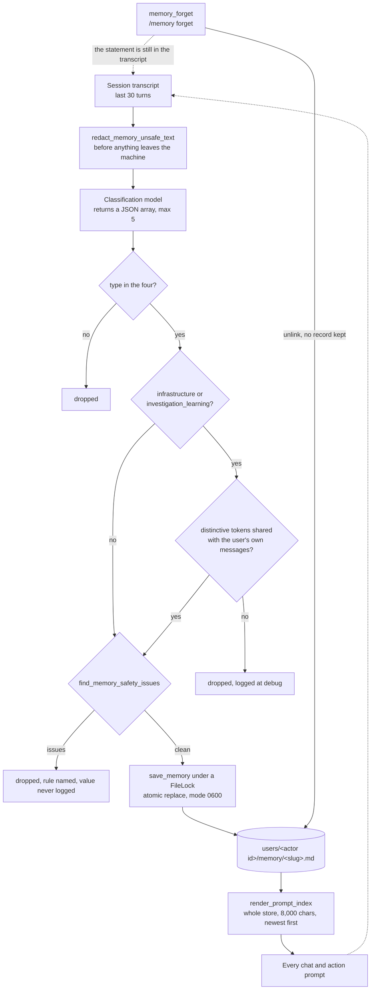

## 1. Executive Summary

OpenSRE is an Apache-2.0 framework for AI SRE agents — investigate an incident,
call the observability tools you already run, answer in Slack or a terminal. It
is a large repository in public alpha, and its long-term memory is a small,
carefully-bounded corner of it: about 870 lines under `core/domain/memory/` for
the store, 387 lines of session-end extraction, 183 lines of agent tools, and
147 lines of slash commands.

The memory is markdown files, which is not novel. What is worth the report is
**where this system decided to put its rigour**, because it is not where most
extraction pipelines put theirs. There is no embedding, no ranking, no trust
enum and no audit log. Instead almost all of the engineering is on the write
gate, and it is unusually specific about one failure: **the agent's own output
becoming the user's memory.**

`_extracted_item_is_user_grounded` refuses to save a memory typed
`infrastructure` or `investigation_learning` unless its distinctive tokens
overlap with text the *user* wrote in the transcript — a set intersection over
stop-listed words, with no model in the loop. A second regex refuses anything
extracted from a transcript containing built-in sample, demo, synthetic or
benchmark scenarios, unless the user explicitly asked for it to be remembered.
The atlas records three other systems that had to stop their own scaffolding
from becoming memory — [OpenClaw](../openclaw/) strips its message envelope,
[Holographic](../holographic/) excludes compaction summaries,
[Helm](../helm/) stop-lists its own supersession log — and all three solve it by
*subtraction*, naming the strings to remove. This one solves it by
**requiring positive evidence of user authorship**, which does not need updating
when the agent learns to phrase things differently.

The second mechanism worth taking is one regex module used twice.
`find_memory_safety_issues` blocks private key blocks, provider tokens, JWTs,
URL credentials and labelled secrets from being written at all, and
`redact_memory_unsafe_text` runs the same patterns over the transcript **before
it is sent to the classification provider**. Blocking a credential from your
store and blocking it from leaving the machine are different problems; this
solves both from one place, and asserts the second in a committed test.

What it does not have is a memory that can stay deleted. `/memory forget`
unlinks the file, nothing records that the value was rejected, and extraction
runs over the last thirty turns after *every* recorded turn — so the statement
that produced a memory is still in the window the next pass reads.

## 2. Mental Model

Think of it as **a notebook the agent writes in without asking, behind a
bouncer that has read the transcript.**

Every durable fact passes the same chain, and the interesting property is that
only one link in it is a language model:

1. The model proposes — either as a `memory_remember` tool call mid-turn, or as
   a JSON item from the post-turn extraction pass.
2. The type must be one of four (`user`, `infrastructure`, `preference`,
   `investigation_learning`); anything else is dropped without comment.
3. For the two high-impact types, the **grounding check** runs: no model, just a
   token-set intersection against what the user actually typed.
4. The **safety check** runs: five regex families, and a rejection names the
   rule rather than echoing the value.
5. The slug must normalise to a valid slug; the body is truncated at 10,000
   characters with a marker.
6. The write takes a directory lock, preserves `created_at` if the slug already
   exists, writes through a temp file and an atomic replace, and rebuilds the
   index best-effort.

Retrieval is the part that barely exists, and deliberately: the store is small
enough that the whole thing is rendered into the prompt, so the ordinary case
needs no recall call at all.



The dotted loop is the design's open edge. Nothing that leaves through
`memory_forget` leaves a mark, and the transcript that justified the memory is
still inside the window the next extraction pass will read.

## 3. Architecture

Four layers, and the dependency direction is enforced by hand rather than by a
tool — each module's docstring states what it is allowed to import.

`core/domain/memory/files.py` is the bottom: path resolution and
`write_text_atomically`, importing nothing else from the package. Its constants
carry the most patient comment in the tree, explaining `0o700` and `0o600` one
octal digit at a time and stating the reason: *"memory holds whatever the user
told the agent to remember, which can include names, hosts and incident detail.
On a shared machine the default would otherwise leave them world-readable."*

`frontmatter.py`, `slugs.py`, `models.py` and `safety.py` are pure functions over
text. `index.py` renders the two generated views. `store.py` sits on top with
the CRUD, the lock and the cache. `settings.py` holds the three environment
gates.

**Scope is a `ContextVar`, not a parameter.** `config/scope_context.py` binds a
`StorageScope` for the duration of a turn; `session_home()` reads it and returns
`<org root>/users/<actor id>` for an org principal, or the org root when nothing
is bound — so a laptop run stays flat and a Slack silo separates members without
either code path knowing about the other. `memory_dir()` is the single funnel,
so every read and every write inherits the boundary by construction.

That design has one classic hazard, and the repository knows it: a background
thread does not inherit a `ContextVar` unless the context is copied.
`_schedule_coalesced` calls `contextvars.copy_context()` and says why in a
comment — without it *"`save_memory()` would resolve to the org root instead of
`users/<actor_id>/memory/`, misfiling the user's extracted facts where their
in-scope turns never read them"* — and a test asserts the thread sees the same
scope object.

### Deployment and ergonomics

Memory is on by default in the terminal and in investigations, and **off by
default on Slack and Telegram**, requiring `OPENSRE_MEMORY_GATEWAY_ENABLED=1`.
The stated reason is that the scoping is not uniform: Slack memory is per-user,
*"but Telegram stays host-global, so the whole feature is off by default on
shared gateway hosts to avoid one user's facts crossing into another's prompts."*
A system that disables its own feature on the surface where its boundary is
weakest is rare enough to name.

Two more switches: `OPENSRE_MEMORY_DISABLED` kills the feature, and
`OPENSRE_MEMORY_AUTOEXTRACT_DISABLED` keeps the tools and the prompt index while
turning off the automatic pass — the right split, because it lets an operator
keep memory the user asked for and drop memory the model decided on.

`OPENSRE_MEMORY_DIR` overrides the location. Storage is local and unencrypted,
which the docs say in bold and the `/memory` output repeats.

## 4. Essential Implementation Paths

| Path | File | What it does |
| --- | --- | --- |
| Grounding gate | `core/agent_harness/session/memory_extraction.py:331-380` | Token-set intersection between the candidate memory and user-authored text, plus the sample/synthetic refusal |
| Safety gate | `core/domain/memory/safety.py:61-129` | Five regex families; rules are named, values never echoed |
| Redaction | `core/domain/memory/safety.py:85-109` | Same patterns, substitution instead of rejection, applied to the transcript before the provider call |
| Extraction | `core/agent_harness/session/memory_extraction.py:90-125, 234-255` | The prompt, the existing index passed back in, a cap of five items and thirty turns |
| Coalescing worker | `core/agent_harness/session/memory_extraction.py:167-205` | One daemon thread, latest snapshot wins, context copied |
| Write | `core/domain/memory/store.py:91-137` | Lock, read-modify-write preserving `created_at`, atomic replace, index rebuild |
| Scope resolution | `config/constants/paths.py:130-170` | `session_home()` and `get_memory_dir()` |
| Parse cache | `core/domain/memory/store.py:150-208` | `lru_cache` keyed on directory *and* a per-file size/mtime signature |
| Prompt index | `core/domain/memory/index.py:46-83` | Newest first, 50 entries, 600 chars of body each, 8,000 total, tail pointer to `memory_recall` |
| Agent tools | `tools/system/agent_memory/tool.py` | `memory_remember`, `memory_forget`, `memory_recall` |
| Review surface | `surfaces/interactive_shell/command_registry/memory_cmds.py` | `/memory`, `/memory show`, `/memory forget`, `/memory path` |

## 5. Memory Data Model

One record, one file:

```text
slug          kebab-case, validated, max 64 chars — also the filename
memory_type   user | infrastructure | preference | investigation_learning
description   single line, max 200 chars, shown in the index
created_at    ISO-8601 UTC, preserved across updates
updated_at    ISO-8601 UTC
body          markdown, max 10,000 chars then truncated with a marker
```

The type is a `StrEnum` coerced in `__post_init__`, so a plain string arriving
from disk or from a tool argument becomes a real enum member on whichever path
it enters by — a small thing that removes a class of "it worked from the tool
but not from the file" bug.

**What the record does not carry is the more interesting list.** There is no
provenance field, so a memory the user dictated, one a tool produced and one the
extraction pass inferred are indistinguishable once written — the grounding
check that separated them at the gate leaves no trace in the row. There is no
confidence and no status, so nothing can be held without being believed. And
there is no validity interval: `updated_at` is when the file was written, never
when the fact was true, so *"eks-prod-1 is the production cluster"* and
*"eks-prod-1 was the production cluster until the migration"* are the same
shape.

## 6. Retrieval Mechanics

**The normal path is not retrieval at all.** `render_prompt_index` sorts every
memory newest-updated first and renders each as an index line plus up to 600
characters of body, until it hits 50 entries or 8,000 characters, then appends
*"… and N more memories (use memory_recall)"*. The comment says the intent
plainly: the agent should be able to answer *"without a recall call"*.

That is the right call at this scale and it has a stated horizon. A user with
two hundred memories gets the fifty most recently touched, and recency of *edit*
is a poor proxy for relevance to the incident in front of them — a memory
written once and never updated sinks regardless of how central it is.

When recall does happen it is `search_memories`: `needle in slug or needle in
description.lower() or needle in body.lower()`, first `limit` matches in
recency order. No embeddings, no BM25, no scoring — so `eks-prod-1` will not
find *"production cluster"*, and the caller gets whichever matches were most
recently written rather than the best ones.

The cost of reading everything on every turn is paid once. `_parsed_memories` is
an `lru_cache` of 16 stores keyed on the directory **and** a tuple of every
file's name, mtime and size — the docstring explains why directory mtime alone
is insufficient (*"editing a memory in place leaves it unchanged, so the cache
would serve a stale body"*) and why the directory belongs in the key (*"one
Slack user must never be served another's memories, however alike the two stores
look"*). Sixteen entries bound it so a gateway serving many users cannot grow
the cache without limit.

## 7. Write Mechanics

Two writers reach the same `save_memory`.

**The tool.** `memory_remember` is described to the model with an instruction
most systems leave implicit: *"Do not wait for the user to say remember/save/note;
if the fact is useful and stable, call this in the same turn."* It also tells
the model to reuse an existing name rather than create a near-duplicate, which
is the whole of the deduplication strategy — there is no similarity check
anywhere, so dedup is entirely the model's discipline against an index it can
see.

**The extraction pass.** `schedule_memory_extraction` is called after every
recorded turn and again on close. Mid-session calls go to a single coalescing
daemon: the latest snapshot replaces any pending one and one worker drains it,
so a burst of turns costs one provider call rather than one per turn. The close
path passes `wait_for_completion=True` and runs inline, after resources are
released, so nothing is lost to process exit.

Then the gates, in order, and only the first is a model:

- **Type must be known.** A `type` outside the four is dropped silently.
- **Grounding.** For `infrastructure` and `investigation_learning`,
  `_distinctive_tokens` lowercases, splits on `[-_.]`, drops tokens under four
  characters and drops a 36-word stop list of SRE filler (`alert`, `incident`,
  `production`, `service`, `root`, `cluster`, …) — then requires a non-empty
  intersection with the same treatment of the user's messages. An explicit
  *"remember / save / store / keep / note / memorize"* in the user's text
  bypasses the token test, and a transcript containing a sample or benchmark
  scenario fails outright unless that explicit request is present.
- **Safety.** `find_memory_safety_issues` over description and body.
- **Slug validity**, then `save_memory`, capped at five per pass.

The whole thing is wrapped so it never raises: *"any failure (LLM unavailable,
malformed output, disk errors) is logged and ignored."* Parsing is correspondingly
forgiving — a fenced block, or the substring between the first `[` and the last
`]`, and anything unparseable yields `[]`.

### Operational cost

One classification-model call per coalesced burst of turns, over at most thirty
turns of transcript plus the whole prompt index. Every action-agent turn renders
the index, which is a directory scan reduced to a `stat` per file by the
signature cache. Writes are one file plus a full rewrite of `MEMORY.md`.

The index rebuild is best-effort by design, and the comment earns its place:
*"a stale index never affects recall or extraction"*, because every agent-facing
read scans the directory. `MEMORY.md` is for the human.

Writes are synchronous under a 10-second lock timeout and the agent blocks on
the tool call; the extraction pass never blocks the turn. Lag before a fact is
retrievable is therefore either zero (tool) or one coalesced worker cycle
(extraction).

## 8. Agent Integration

Three tools registered through the repository's own decorator, each carrying
`side_effect_level`, `surfaces`, `tags` and an `is_available` predicate wired to
`memory_available_here()` — so on a Slack host without the opt-in the tools do
not merely fail, they are absent from the schema the model sees.

`memory_recall` is overloaded three ways by argument shape: a `name` reads one
entry in full, a `query` searches, and no arguments returns the index. Each
result carries `total_stored`, so the model can tell "nothing matched" from
"nothing is stored".

The `/memory` slash commands cover list, show, forget and path. The list output
ends by telling the user where the files are and that they may *"edit or delete
the files directly"* — the store is the interface, in the sense the
[memory as an editing surface](../../patterns/memory-as-an-editing-surface/)
pattern describes, without the pinning and merging the mature instances of that
pattern carry.

A second durable record sits beside memory and is worth knowing about. After an
investigation the user grades the result, and a **miss** — rated partial or
inaccurate — is classified into a five-value taxonomy and appended to
`~/.opensre/misses.jsonl`, from where `opensre misses export` turns it into
benchmark scenarios the eval runner consumes. That is a human-adjudicated record
of failures feeding the test suite, which is the loop the atlas's
[benchmarks page](../../benchmarks/) argues most systems lack. It is **not**
per-principal: `misses_path()` resolves to the org root while memory resolves to
`users/<actor id>`, so on a shared silo one member's graded incident detail is
readable in another's export.

## 9. Reliability, Safety, and Trust

**The grounding gate is the strongest idea here and its limits are legible.** It
applies to two of four types by design — `user` and `preference` memories are
still *"mostly LLM-classified"*, which the docstring says outright. Token
overlap is a proxy for authorship, not a proof: an assistant that echoes the
user's cluster name back inside an invented claim carries the tokens the check
looks for. And an explicit *"remember"* anywhere in the user's messages disables
both the token test and the sample-scenario refusal for the whole pass, so one
"note this down" early in a session lowers the bar for every item extracted from
it.

**Secrets are handled twice and the second is the rarer one.** Rejection names
the rule (`provider_token`, `jwt_token`, `labeled_secret`) and never echoes the
matched text into a log — a discipline the dataclass comment states as intent.
Redaction runs before the provider call, and a committed test asserts a
`ghp_`-shaped token does not appear in the prompt. `_looks_like_secret_value`
carries a thirteen-word benign list (`configured`, `rotated`, `unset`, …) so
*"api_key is rotated"* is not treated as a leak, which is the kind of detail
that decides whether a filter survives contact with real transcripts.

**Deletion does not stay deleted.** `delete_memory` unlinks and rebuilds the
index. Nothing records that the value was rejected, and the extraction pass runs
after every recorded turn over the last thirty — so the user statement that
produced a memory is still in the window after they ask for it to be forgotten,
and it will pass the grounding check for exactly the reason it passed the first
time. The prompt's only defence is an instruction not to extract *"anything
already captured by an existing memory"*, which is precisely false for a memory
that was just removed. This is the
[rejected-value tombstone](../../patterns/rejected-value-tombstone/) gap in its
sharpest form: the re-extraction path is not hypothetical here, it is on a
per-turn timer.

**Concurrency is handled where it bites.** A directory `FileLock` with a
10-second timeout wraps read-modify-write and delete, the docstring naming what
it prevents (*"parallel writers to the same slug cannot both report
`created=True` or discard each other's content"*), and writes land through a
temp file and `Path.replace`. A lock timeout returns `None` rather than raising.

**No audit.** Nothing records that a memory was created, updated or deleted, by
whom, or from which turn. On a per-user laptop store that is a defensible
omission; on a Slack silo where extraction writes without asking, the question
*"why does it think that"* has no answer beyond the file's own body.

## 10. Tests, Evals, and Benchmarks

The memory paths are tested with a seriousness the size of the feature does not
require. `tests/core/agent_harness/session/test_memory_extraction.py` is 351
lines over twenty cases, and the useful ones are negative:

- a secret-like extracted item is skipped;
- infrastructure claims appearing only in assistant output are skipped;
- sample-alert infrastructure and lessons are skipped;
- a user-grounded infrastructure fact *is* saved, which pins the gate from the
  other side;
- garbage from the model saves nothing and does not raise;
- a `ghp_`-shaped token is asserted absent from the prompt sent to the provider,
  with `[REDACTED]` asserted present.

Beside them, `test_scheduled_extraction_thread_inherits_storage_scope` is
labelled a regression guard and states the bug it protects against in its
docstring. `test_list_memories_cache.py` covers the signature-keyed cache, and
`test_memory_store.py` covers CRUD, truncation and the safety rejection.

These are must-not-store and must-not-send assertions rather than must-not-*retrieve*
ones — the material is kept out of a write decision and out of a provider
prompt, not out of a search result — and the capability evidence records that
distinction rather than hiding it. What is not asserted anywhere: that a
forgotten memory stays forgotten across a subsequent extraction pass.

The repository also ships `cloudopsbench` and a synthetic scenario suite, and
the closed-loop miss export exists to grow it. Nothing there measures memory.

## 11. For Your Own Build

### Steal

- **The grounding check, and its shape.** Requiring that a durable claim's
  distinctive tokens appear in user-authored text is a deterministic, cheap,
  model-free test for the failure every extraction pipeline has: the agent's own
  output re-entering as evidence. It generalises where a stop list does not,
  because it does not need to know what the agent will say next.
- **Applying it selectively.** Only the two high-impact types pay the cost, and
  the code says why. A blanket version would reject legitimate profile facts the
  user never restated.
- **The sample-scenario refusal.** Any product shipping demo data needs this,
  and almost nothing has it: built-in example incidents must not become the
  user's incident history.
- **One secret module, two jobs.** Reject on the way into the store, redact on
  the way out to a provider — and assert the second in a test, because it is the
  one nobody notices is missing.
- **Turning the feature off where its own boundary is weak.** Memory is opt-in
  on shared gateway hosts because one surface is still host-global. Shipping a
  reduced feature beats shipping a leak.
- **The cache key.** Directory plus per-file size and mtime, with the reasoning
  for each half written down.

### Avoid

- **Deleting with no record, when your extractor re-reads the same transcript.**
  This is not a latent risk here; the pass runs after every turn over a
  thirty-turn window.
- **Recency-of-edit as the injection order.** Fifty slots filled by whatever was
  touched most recently is not the same as fifty relevant memories.
- **Substring search as the only recall.** It cannot match a synonym, and it
  returns the newest matches rather than the best.
- **An escape hatch that disables several gates at once.** One "remember this"
  from the user turns off both the token test and the sample refusal for every
  item in the pass.
- **A scoping boundary that stops at one store.** Memory is per-user;
  `misses.jsonl` — which carries incident detail and a human's notes — is not.

### Fit

This is the right shape for **a single-user or small-team agent whose memory
should be inspectable in an editor and small enough to inject whole.** Below a
few hundred memories the absence of ranking is a feature: the model sees
everything, so nothing is silently unretrieved, and the whole store is a
directory the user can read, diff and delete.

Walk away if memory has to be shared, audited, or argued with. There is no
provenance, no trust state, no mutation record, no conflict handling and no
approval step before an automatic write takes effect. For an SRE tool where a
wrong "known-flaky service" note shapes the next incident triage, the missing
piece is not retrieval quality — it is being able to ask why the agent believes
something, and to make a correction that holds.

## 12. Open Questions

- Does a forgotten memory come back? The mechanism permits it and no test
  covers it; a single case — save, forget, re-run extraction over the same
  transcript — would settle it either way.
- What does the token-overlap gate reject in practice? The skip is logged at
  debug with the memory's name, so the data exists in any real deployment and
  nothing collects it.
- Why is `misses.jsonl` org-scoped when memory is principal-scoped? Both hold
  user-supplied incident detail, and the storage-scope machinery is already
  there.
- The prompt index caps at 8,000 characters and 50 entries with a pointer to
  `memory_recall`. Does the model take the hint, or answer from a truncated
  view?

## Appendix: File Index

| File | Lines | Role |
| --- | --- | --- |
| `core/agent_harness/session/memory_extraction.py` | 387 | The extraction pass, the coalescing worker, and both halves of the grounding gate |
| `core/domain/memory/store.py` | 283 | CRUD, the directory lock, the signature-keyed parse cache |
| `tools/system/agent_memory/tool.py` | 183 | `memory_remember`, `memory_forget`, `memory_recall` |
| `surfaces/interactive_shell/command_registry/memory_cmds.py` | 147 | `/memory` list, show, forget, path |
| `core/domain/memory/safety.py` | 136 | Secret detection for rejection and for redaction |
| `core/domain/memory/index.py` | 86 | `MEMORY.md` and the prompt block |
| `core/domain/memory/files.py` | 84 | Paths, permissions, atomic write |
| `core/domain/memory/settings.py` | 59 | The three environment gates and the shared-surface rule |
| `core/domain/memory/models.py` | 52 | `MemoryRecord`, `MemoryType`, the size limits |
| `config/constants/paths.py` | — | `session_home()` and `get_memory_dir()`, lines 130-170 |
| `config/scope_context.py` | 42 | The storage-scope `ContextVar` |
| `core/domain/feedback/misses/store.py` | 161 | The org-scoped miss ledger behind closed-loop learning |

## History

**2026-08-09** — [`c81d6c36d69bd6b39c1e18b0205f28422c3d2544`](https://github.com/Tracer-Cloud/opensre/commit/c81d6c36d69bd6b39c1e18b0205f28422c3d2544) — first reading. The screen reported two auto-running surfaces and 64 build-time execution surfaces — all of them `conftest.py` files that execute on pytest collection — six unpinned dependency surfaces, a `uv.lock`, and **twelve files inside the seven-day cooldown**, so nothing was installed and no test was run; the analysis is static over the tree. The screen also flagged `AGENTS.md` and `CLAUDE.md` as instructions addressed to a reading agent; both were treated as data and neither was followed.
