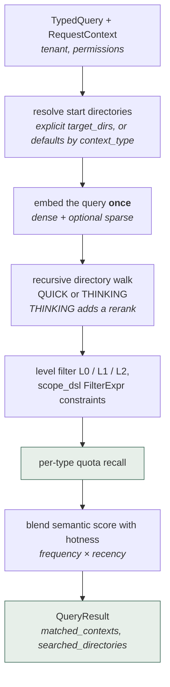
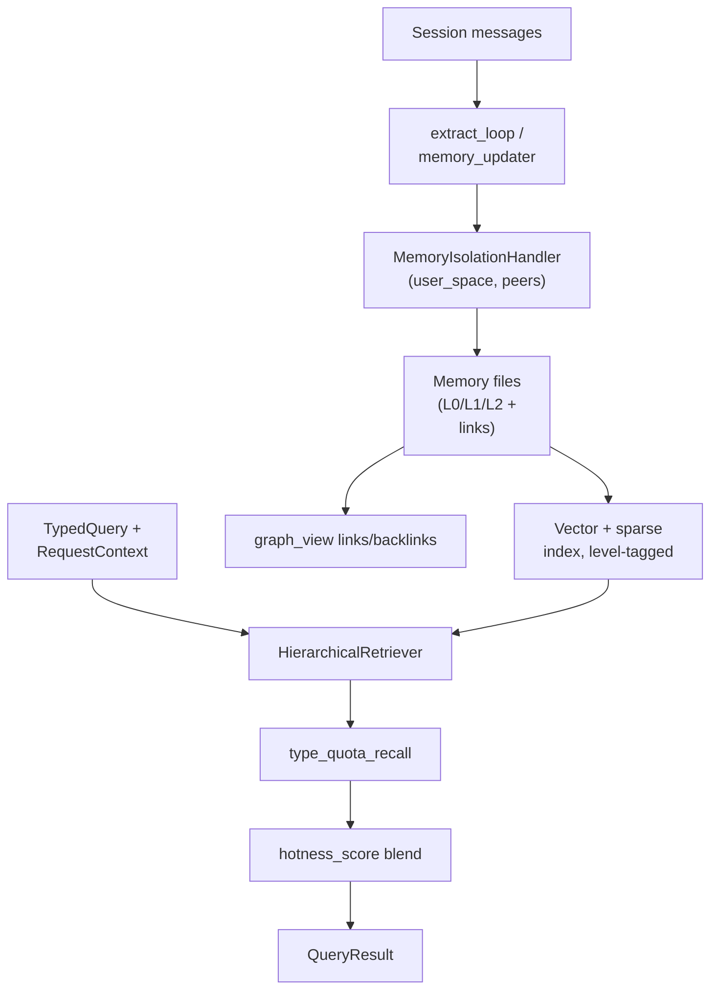

## 1. Executive Summary

OpenViking is Volcengine's (ByteDance's) open-source "context database for AI agents", licensed AGPL-3.0. It is one of the largest systems in this atlas — roughly 1,600 Python modules plus Rust crates and a C++ index backend — and it is a platform rather than a library: server, SDKs, CLI, web studio, connectors, and a Docker/Caddy deployment story.

Its organizing idea is that an agent's context is **a filesystem**. Memory, resources, and skills live in one URI-addressed hierarchy of Markdown-ish files with links and backlinks, and retrieval walks directories rather than querying a flat index.

Two design choices distinguish it from everything else here.

**Three-granularity progressive disclosure on a single item.** Every memory carries `abstract` (L0), `overview` (L1), and `content` (L2) fields. These are not separate entity layers — they are three resolutions of the *same* memory, and retrieval can request a specific level. This is a genuinely different use of L0/L1/L2 vocabulary than [TencentDB Agent Memory](../tencentdb-agent-memory/), where L0–L3 are distinct entity types (conversation → record → scene → persona). The vocabularies collide; the architectures do not.

**Hotness as a retrieval signal explicitly separate from truth.** `hotness_score` blends access frequency and exponential recency decay into a 0–1 score used to boost ranking. Crucially it is a reachability signal, not a confidence signal — the split [Verel](../verel/) argues for and [Holographic](../holographic/) collapses.

The system also has real multi-tenancy: a `RequestContext` carries tenant and permission filtering into every retrieval call, and memory is isolated per user space with a `peers/{peer_id}` sub-space for memory *about* other participants — closer to [Honcho](../honcho/)'s peer modelling than to a single-user note store.

The main reservations are scale-of-surface and evidence. The configuration and adapter surface is very large; extraction remains LLM-driven with no explicit verified/rejected state; and while the repository commits an unusually complete benchmark harness — including runners for competing systems — it does **not** commit the raw result artifacts behind its headline accuracy numbers, which live in an off-repo blog post.

## 2. Mental Model

The memory unit is a typed file in a URI-addressed tree:

```python
MemoryData(
    memory_type = ...,        # user-definable type from the registry
    uri         = ...,        # filesystem-style address
    fields      = {...},      # dynamic, schema-generated per type
    abstract    = "...",      # L0 — smallest
    overview    = "...",      # L1 — medium
    content     = "...",      # L2 — full
    name, tags, created_at, updated_at,
)

MemoryFile(uri, content, links[], backlinks[], memory_type, extra_fields)
```

Memory *types* are themselves data. `MemoryTypeSchema` carries a `filename_template` (with `{{variable}}` interpolation), an `overview_template` for auto-generating `.overview.md` files, an `operation_mode` of `upsert` / `add_only` / `update_only`, a `stage` of `user` (long-term user memory) or `agent` (execution-derived memory), and a `peer_enabled` flag controlling whether the type is stored separately under peer directories. `schema_model_generator.py` builds Pydantic models from these definitions at runtime.

Scoping is a path convention backed by request-level authorization:

| Path | Holds |
| --- | --- |
| `<user_space>/...` | memory about the user |
| `<user_space>/peers/<peer_id>/...` | memory about another participant |

The `peer_id` `__self` maps back to `user_space`, so "about me" and "about a peer"
are one addressing scheme rather than two code paths.

Retrieval lifecycle:



Two details worth taking. **Per-type quotas** stop one memory kind from filling the
budget, which is the same problem
[source-diverse context](../../patterns/source-diverse-context/) solves for
sources. And the result reports `searched_directories` alongside the matches, so a
caller can see where recall *looked* and not only what it found — an explainability
affordance almost nothing else here offers.

## 3. Architecture

Selected modules under `openviking/`:

- `session/memory/` (8,649 lines): the memory core — `core.py`, `extract_loop.py`, `memory_updater.py`, `streaming_memory_updater.py`, `memory_type_registry.py`, `memory_isolation_handler.py`, `graph_view.py`, `merge_op/`, `page_id_map.py`, and several context providers.
- `retrieve/` (1,607 lines): `hierarchical_retriever.py`, `type_quota_recall.py`, `intent_analyzer.py`, `memory_lifecycle.py`, `retrieval_stats.py`.
- `storage/`, `core/context.py`, `server/identity.py`: collection schemas with a `level` field, context levels, and the `RequestContext` used for tenant and permission filtering.
- `pyagfs/`, `src/` (C++), `crates/` (Rust): the agent-filesystem layer and native index/store backends.
- `resource/`, `ingest/`, `parse/`, `connector/`: multimodal ingestion and external sources.
- `privacy/`, `crypto/`, `observability/`, `telemetry/`, `metrics/`: operational subsystems, including per-level (L0/L1/L2) cache hit/miss collectors.
- `benchmark/`: LoCoMo, LongMemEval, tau2, SkillsBench, RAG, cuVS, and vector-DB performance harnesses.



## 4. Essential Implementation Paths

### Hierarchical retrieval (`retrieve/hierarchical_retriever.py`)

`retrieve()` takes a `TypedQuery` plus a `RequestContext` "used for tenant and permission filtering" — authorization is a parameter of retrieval, not a filter bolted on afterwards. It also accepts a `scope_dsl` (`FilterExpr`) for additional constraints and an explicit `level` filter.

The query is embedded **once** into dense and optional sparse vectors, avoiding duplicate embedding calls across the directory walk. Two modes exist: `QUICK` and `THINKING`, selected automatically by whether a rerank client is configured. Image queries force `QUICK` mode and default to `level=[2]`, since abstracts are not useful for visual matching.

Retrieval starts from explicit `target_directories` when given, otherwise from defaults derived from the context type. This directory-scoped recursion is what makes the filesystem paradigm more than cosmetic: the tree prunes the search space before ranking.

### Progressive disclosure

Because `abstract`, `overview`, and `content` are fields on one record and the storage schema carries a `level` discriminator, a caller can retrieve just enough of a memory to decide whether to fetch more. Cache metrics are collected per level (`metrics/collectors/cache.py` records hit/miss by `L0`/`L1`/`L2`), which suggests the tiering is a real hot path rather than a nominal one.

The atlas's usual concern with layered memory — that generated layers drift from their evidence — applies here in a milder form than in systems where each layer is a separate artifact: `overview_template` auto-generates `.overview.md` files from the underlying content, and re-generation is a rebuild rather than a merge.

### Lifecycle: hotness (`retrieve/memory_lifecycle.py`)

```python
score = sigmoid(log1p(active_count)) * exp(-ln(2) * age_days / half_life_days)
# DEFAULT_HALF_LIFE_DAYS = 7.0
```

The docstring is explicit that this is for "cold/hot memory lifecycle management" and is "blended with semantic similarity to boost frequently-accessed, recently-updated contexts in search results". Nothing here touches correctness — this is the atlas's [decay-and-reinforcement](../../patterns/decay-and-reinforcement/) pattern implemented on the right side of the truth/usefulness line.

The risk is the one that pattern names: `active_count` increments on retrieval, and higher hotness makes future retrieval more likely, so the frequency term is a self-reinforcing popularity loop. `log1p` plus a sigmoid compresses it heavily, which dampens but does not eliminate the effect, and a memory that stops being retrieved decays toward zero with a 7-day half-life regardless of whether it is still true.

### Isolation (`session/memory/memory_isolation_handler.py`)

`peer_user_space(user_space, peer_id)` returns `user_space` for the sentinel `__self` and `f"{user_space}/peers/{peer_id}"` otherwise, so memory *about* a third party is physically separated from memory about the user. `RoleScope` infers participant scope from session messages, and `safe_peer_id` normalizes identifiers before they become path fragments.

Combined with tenant-aware `RequestContext` filtering in the retriever, this is one of the stronger scope stories in the atlas — comparable to [Honcho](../honcho/)'s workspace/peer/session model, expressed as paths.

### Type-quota recall (`retrieve/type_quota_recall.py`)

519 lines enforcing per-memory-type quotas in the result set. This is a [source-diverse context](../../patterns/source-diverse-context/) variant keyed on type rather than source document: it prevents one prolific memory type from crowding out every other kind of context.

### Extraction and merging

`extract_loop.py` and `memory_updater.py` / `streaming_memory_updater.py` drive LLM extraction into typed memory files, with `merge_op/` handling merge semantics and `operation_mode` (`upsert` / `add_only` / `update_only`) constraining what an extraction pass may do to an existing record. `page_id_map.py` maintains stable identity across updates.

The `stage` field separating `user` (long-term user memory) from `agent` (execution-derived memory) is a useful distinction few systems make explicitly: it keeps observations about the world apart from observations about the agent's own runs.

## 5. Memory Data Model

Storage is pluggable, with a level-tagged collection schema (`storage/collection_schemas.py` comments the `level` field as distinguishing L0/L1/L2) plus native Rust/C++ index and store backends under `crates/` and `src/`.

Strengths of the model:

- **User-definable types.** New memory types are schema entries, not code changes; models and filenames are generated from them.
- **Links and backlinks** on every memory file, with a `graph_view` over them — a wiki-shaped graph rather than an extracted entity graph.
- **Stable identity** via URI plus `page_id_map`.
- **Explicit operation modes** limiting what extraction may overwrite.
- **Level-tagged indexing**, so granularity is a first-class query dimension.

What is absent:

- **No epistemic state.** There is no candidate/verified/rejected lifecycle and no rejected-value tombstone. Extracted memories become active context directly; `operation_mode` constrains *how* a record changes, not whether the claim was ever confirmed.
- **No conflict surface.** Merge operations resolve overlapping writes, but there is no operator-facing review queue for contradictions of the kind [RainBox](../rainbox/) or [engram](../engram/) expose.
- **Provenance is structural, not evidential.** URIs, types, and timestamps are recorded; a memory does not carry the source message spans that justify it in the way [MemPalace](../mempalace/) or [Graphiti](../graphiti/) episodes do.

## 6. Retrieval Mechanics

This is a mature hybrid stack: dense plus optional sparse vectors, directory-scoped recursion, an intent analyzer, per-type quotas, optional cross-encoder reranking in `THINKING` mode, level filtering, hotness blending, tenant/permission filtering, and multimodal (image) queries against a multimodal embedder.

Two things are worth calling out for anyone borrowing it:

- **Mode selection is implicit.** `QUICK` versus `THINKING` is chosen by whether a rerank client happens to be configured, so retrieval quality changes silently with deployment configuration rather than with an explicit request parameter.
- **Score composition is layered.** Semantic similarity, hotness, type quotas, level filters, and rerank interact; `retrieval_stats.py` exists to observe this, but the effective ranking is not readable from any single expression the way a small weighted sum is.

## 7. Write Mechanics

Writes arrive from session extraction (`extract_loop`), direct SDK/CLI/API calls, and ingestion of external resources through `connector/`, `ingest/`, and `parse/`. The isolation handler resolves the write target — user space or peer sub-space — before anything is persisted, so scope is decided at write time rather than inferred at read time. This is the atlas's [explicit write destination](../../patterns/explicit-write-destination/) discipline, enforced structurally.

`streaming_memory_updater.py` supports incremental update as content arrives rather than only at session end.

## 8. Agent Integration

OpenViking is a server-first system: a Python SDK, an async client, a CLI (`openviking_cli`), a web studio, an npm package, and a bot bridge. It is one of the official memory providers for [Hermes Agent](../hermes-agent/) (adapter at `plugins/memory/openviking/` in that repository) and is widely used as an OpenClaw memory backend.

The `benchmark/locomo/` tree contains runners for OpenClaw, Hermes, Claude Code, mem0, Supermemory, and VikingBot, which is the clearest signal of where the project expects to sit: underneath an existing agent harness, replacing its native memory.

## 9. Reliability, Safety, and Trust

Strengths:

- Tenant and permission filtering carried into retrieval rather than applied afterwards.
- Physical isolation of peer memory from user memory.
- Dedicated `privacy/` and `crypto/` modules.
- Observability that goes past logging: per-level cache hit/miss collectors, retrieval stats, telemetry spans around embedding.
- Write-target resolution before persistence.
- Native backends with a Python fallback path.

Gaps:

- **No verification tier**, so LLM-extracted memories become durable context without corroboration, and a corrected memory has nothing preventing re-extraction of the old value.
- **Hotness decay is uniform** at a 7-day half-life for every memory kind; a stable user preference and a transient project note age identically.
- **Popularity reinforcement** through `active_count`.
- **Very large configuration surface**, with quality that varies by embedder, rerank client, backend, and mode.
- **AGPL-3.0**, which is a material constraint for anyone embedding it in a closed product — worth stating plainly, since most of the atlas is MIT/Apache.

## 10. Tests, Evals, and Benchmarks

688 test files, including `tests/test_memory_lifecycle.py`, `tests/session/memory/`, `tests/integration/test_agent_memory_e2e.py`, `tests/storage/test_memory_semantic_stall.py`, and `tests/storage/test_semantic_queue_memory_dedupe.py`. The suites were not run for this review.

The benchmark story is the most interesting part, and it cuts both ways.

In its favour, `benchmark/` commits genuinely reproducible harnesses: LoCoMo with an ingest → QA → LLM-judge → statistics pipeline, LongMemEval, tau2-bench, SkillsBench, RAG, and vector-DB performance suites. `stat_judge_result.py` reports **token usage alongside accuracy**, which is exactly what this atlas asks benchmark harnesses to record and what [Swafra](../swafra/) failed to do. A `locomo_bad_case_questions.csv` file tracks known failure cases. Runners exist for six systems, so the comparison is at least mechanically reproducible by a third party.

Against it, the headline numbers in the README — LoCoMo accuracy of 82.08% for OpenClaw with OpenViking versus 24.20% native, 82.86% versus 33.38% for Hermes, 80.32% versus 57.21% for Claude Code, plus claimed 34.3–91.0% input-token reductions — are attributed to an **off-repo blog post**, and the `result/` directories described in the benchmark README contain no committed raw artifacts at this commit. The harness is present; the evidence for the specific published numbers is not.

These are also vendor-run comparisons of "competitor's native memory" against "competitor plus our product", evaluated with an LLM judge. That framing is not illegitimate, but it is not neutral, and the native-memory baselines deserve independent scrutiny before the deltas are taken at face value.

## 11. For Your Own Build

### Steal

- **Three-granularity records.** Storing abstract/overview/content on one item, indexing the level, and letting callers choose resolution is a cleaner progressive-disclosure mechanism than deriving separate summary entities.
- **Hotness separate from truth**, with frequency and recency combined into an explicitly reachability-only score.
- **Per-type recall quotas** to keep one memory type from dominating context.
- **Write-target resolution before persistence**, including a dedicated peer sub-space.
- **Authorization as a retrieval parameter** via `RequestContext`.
- **Memory types as data**, with generated schemas and filename templates.
- **Benchmark harnesses that record token volume**, not just accuracy.

### Avoid

- **Extraction without an epistemic gate** — no candidate/verified/rejected state, no tombstones.
- **Uniform decay half-life** across memory kinds.
- **Retrieval-driven popularity reinforcement.**
- **Implicit retrieval-mode switching** based on deployment configuration.
- **Headline benchmark numbers without committed raw results**, despite a committed harness.
- **Vendor-framed comparative benchmarks** using an LLM judge.
- **Large surface area**: consistency and quality depend on which of many backends and models are configured.

### Fit

Borrow:

- The abstract/overview/content triple with a level-tagged index.
- `hotness_score` essentially as written, keeping it out of any confidence field.
- Type-quota recall.
- The `user_space` / `peers/<peer_id>` isolation convention.
- The benchmark harness shape — reproducible pipeline plus token accounting plus a tracked bad-case file.

Do not copy:

- The full platform if you need a small embeddable memory layer; this is a server product.
- The extraction path as a truth model — add a verification tier before extracted memories become durable context.
- A single global decay half-life.
- Anything at all, without first checking whether AGPL-3.0 is compatible with your distribution plans.

## 12. Open Questions

- What prevents a corrected memory from being re-extracted? No tombstone mechanism was found.
- Should the decay half-life vary by memory type, given that types are already first-class?
- How much of the reported LoCoMo delta is the memory layer versus prompt-shape changes in each integration's adapter?
- Are the `result/` artifacts intended to be committed? Their absence is the gap between "reproducible harness" and "reproducible result".
- Does hotness reinforcement measurably distort recall over months, and is there a counterweight?
- How do `merge_op` semantics behave when two extraction passes disagree — last-writer-wins, or is a conflict surfaced anywhere?

## Appendix: File Index

- Memory core: `openviking/session/memory/` (`core.py`, `extract_loop.py`, `memory_updater.py`, `streaming_memory_updater.py`, `merge_op/`).
- Types and schema generation: `openviking/session/memory/memory_type_registry.py`, `schema_model_generator.py`, `dataclass.py`.
- Isolation and scoping: `openviking/session/memory/memory_isolation_handler.py`, `openviking/core/peer_id.py`, `openviking/server/identity.py`.
- Retrieval: `openviking/retrieve/hierarchical_retriever.py`, `type_quota_recall.py`, `intent_analyzer.py`, `retrieval_stats.py`.
- Lifecycle: `openviking/retrieve/memory_lifecycle.py`.
- Storage and levels: `openviking/storage/collection_schemas.py`, `openviking/core/context.py`.
- Links graph: `openviking/session/memory/graph_view.py`.
- Native backends: `src/` (C++), `crates/` (Rust), `openviking/pyagfs/`.
- Benchmarks: `benchmark/locomo/`, `benchmark/longmemeval/`, `benchmark/tau2/`, `benchmark/skillsbench/`.
- Tests: `tests/session/memory/`, `tests/test_memory_lifecycle.py`, `tests/integration/test_agent_memory_e2e.py`.
