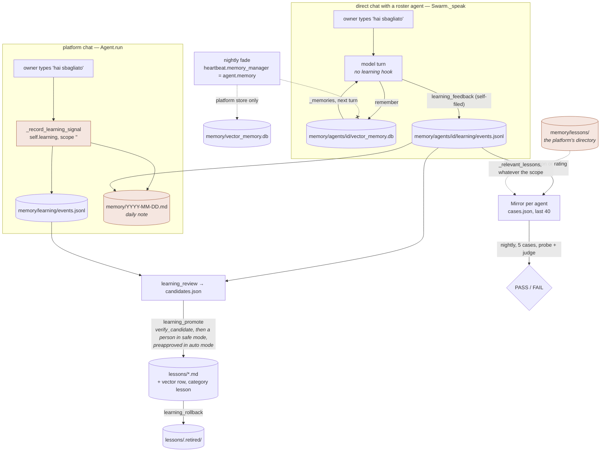

## 1. Executive Summary

openvurp is an MIT-licensed Python "wallet of agents": a local web page on
which a person creates named agents, each with a job sentence and an engine,
and talks to them one at a time or all together, from the browser or from
Telegram, Discord, Slack and WhatsApp through one conversation core. 34,897
lines of Python outside `tests/`, 11,087 lines of tests across 69 files, 32
commits from two authors since 30 June 2026, read at
[`e3fbf01d28b2e7a293a431c45cd96d45e609985c`](https://github.com/openvurp/openvurp/commit/e3fbf01d28b2e7a293a431c45cd96d45e609985c),
dated 3 September 2026. Fourteen of the 32 commits are from 2 and 3 September,
and the memory this report describes was reshaped in them: on 2 September 2026
the project removed the platform's own character — *"openvurp is the place, not a
character"* — and moved memory, lessons and the correction mirror from one
shared store into a directory per agent.

The memory has three parts, and the interesting question is whether they meet.
**Semantic memory** is a SQLite table per agent with an FTS5 index and
optional embeddings, written by a `remember` tool and read back into the agent's
prompt, with a nightly fade that archives rows nobody recalled. **Lessons** are
Markdown files promoted from a learning log through a verification gate and a
human approval, retired with a reason, and indexed into the same vector store.
**The Mirror** turns each owner correction into a test case: at night the agent
is put back in the same situation with its relevant lessons in the prompt, a
second model call judges PASS or FAIL, and the result is a per-correction pass
streak. That last mechanism is the project's best idea and its README's central
promise — *"A correction you give an agent becomes a test case, replayed later to
check it does not come back"*.

**The scoping is real for memory and absent for learning, and the seam runs
through the middle of the promise.** `remember` and recall are keyed on a
`contextvars` scope and a committed test proves one agent cannot read another's
store. But the hook that turns *"hai sbagliato"* into a learning event lives in
`Agent.run`, and a direct chat with a roster agent never calls `Agent.run` — it
goes `Swarm.ask` → `_speak` → the model. So the correction the README describes
is recorded only when it is typed to the platform's own chat, into the platform's
unscoped log; an agent's Mirror has cases only if the agent filed feedback about
itself with the `learning_feedback` tool; and when it does replay, the lessons it
is shown come from the platform's `memory/lessons/`, not its own. Two further
consequences of the same move: the nightly fade is wired to the platform's
`MemoryManager` alone, so a roster agent's memories never fade, and the daily
note that every scoped feedback appends lands in the platform's top-level memory
directory, where the platform's retrieval reads it.

Four marks. `scope_enforced` on the directory-as-key. `audit_log` on an
append-only, redacted `events.jsonl` per scope that records promotions and
rollbacks, plus a `faded.jsonl` for every row the fade removed. `human_review`
on a promotion gate the runtime asks a person to approve in the default mode,
with an *always* answer becoming an eight-hour lease. `negative_eval` on the
two-agent test, with two caveats named in section 10. Withheld: `tombstone` (a
retired lesson can be re-promoted under a new hash), `trust_state` (the lesson
states are directories, and the one status field written into a lesson is read
by nothing), `bitemporal` (record time only).

## 2. Mental Model

A memory here is one of four things, and they have different lives.

**A remembered sentence.** A row an agent chose to keep — *"Il Crucial P3 Plus
da 1TB costa 74 euro"* — with a category the model picked from a suggested list
(`user`, `project`, `lesson`, `decision`, `general`). It is treated as true from
the moment it is written. It has no state beyond its access statistics: every
retrieval that surfaces it bumps `access_count` and `accessed_at`, and the
nightly fade removes a row only if it is older than 45 days, has not been
recalled in 45 days, **and** has been recalled fewer than twice in its life
(`core/vector_memory.py:319-334`). Two recalls, ever, make a row permanent. Rows
in the categories `lesson`, `identity` and `pact` never fade. Faded rows go to
`.faded/faded.jsonl`, which nothing reads back. There is no correction path: no
tool updates or deletes a row, and the two `forget` methods that would
(`core/memory.py:210`, `core/vector_memory.py:371`) have no caller in the tree.

**A learning event.** An append-only line: an owner's *"ricorda"*,
*"hai sbagliato"* or *"la prossima volta"* detected by whole-word markers, a
feedback the agent filed with a rating, a tool failure, or a completed task with
its tool sequence (`core/learning.py:102-208`). Events are evidence, not
beliefs; nothing reads them into a prompt.

**A lesson.** The promoted form. `learning_review` groups events into
candidates with a confidence — a preference is `0.55 + 0.12 × occurrences`, a
recurring tool error `0.45 + 0.1 × n`, a recurring procedure `0.5 + 0.1 × n`
(`core/learning.py:398-480`) — and `learning_promote` writes a Markdown file if
the candidate clears `verify_candidate`: confidence ≥ 0.6, evidence ≥ 2, 20 to
4,000 characters, nothing the secret redactor would rewrite, no existing file
with the same slug (`core/learning.py:244-289`). `force=True` writes it anyway
and stamps `verificata=forzata`. The file is also inserted into the vector store
under category `lesson`, where it is exempt from fading. It dies by
`learning_rollback`, which moves it into `lessons/.retired/` with a dated reason,
or — for the platform's lessons only — by `MemoryManager.cleanup()` at start-up,
which `os.remove`s any lesson file older than 90 days by mtime with no archive
(`core/memory.py:485-501`, called at `core/agent.py:204`). The vector row for a
cleaned-up lesson survives it.

**A mirror case.** A correction, keyed on the SHA-1 of its lower-cased text,
kept to the last 40 (`core/mirror.py:22,:89-132`). It holds no truth of its own;
it holds a question — *would you make this mistake again?* — and a history of
up to ten answers. It never dies except by falling off the end of the list.

Who moves things: the model writes remembered sentences and files feedback; the
runtime records the owner's markers; the model reviews and proposes; a person
approves a promotion in `safe` mode and the runtime approves it in `auto`; the
model retires; the clock fades. Nothing ever marks a remembered sentence wrong.



## 3. Architecture

One Python process. `main.py` (1,154 lines) builds an `Agent`
(`core/agent.py`, 3,325 lines), starts the web dashboard on `127.0.0.1:8420`
(`dashboard.py`, 1,462 lines, HTML included), the inbound channels, an optional
HTTP gateway on 8421, the heartbeat thread, and a sentinel that probes internet
and Ollama. Every turn from every door holds one `threading.Lock`
(`main.py:51,:428`), so the wallet is single-threaded at the agent, with
the swarm's `broadcast` fanning agents out on a thread pool underneath it.

**Components that hold memory**, all under `memory/` beside the code:

- `core/memory.py` (547 lines) — `MemoryManager`, rooted at `memory/` for the
  platform or `memory/agents/<id>/` for a scope. Owns the JSON files
  (`profilo.json`, `environment.json`, `patterns.json`, `projects/*.json`), the
  `lessons/` and `sessions/` directories, and a `VectorMemory`.
- `core/vector_memory.py` (402 lines) — `VectorMemory`: one SQLite file,
  `memories` plus `memories_fts`, embeddings as float32 BLOBs, cosine in Python.
- `core/learning.py` (576 lines) — `LearningLoop`: `learning/events.jsonl`,
  `learning/candidates.json`, `lessons/`, the daily `YYYY-MM-DD.md` note.
- `core/mirror.py` (241 lines) — `Mirror`: `mirror/cases.json`, harvest, replay.
- `core/scope.py` (51 lines) — the `ContextVar` and the two path helpers.
- `core/chat_store.py` (602 lines) — `chats/chats.db`: chats, messages, agents,
  chat membership, runs. WAL, one connection per thread, `busy_timeout` 15 s.
- `core/session_store.py`, `core/task_journal.py`, `core/agent_state.py`,
  `core/continuity.py` — per-route conversation history (40 messages, 60,000
  characters), a journal of turns and reflections, open loops, and an autonomy
  state machine, all JSON or JSONL under `memory/`.
- `core/security/audit.py` (309 lines) — `AuditLog`, a hash-chained
  `audit/audit.jsonl` of tool calls, shell commands, permission decisions.
- `core/heartbeat.py` (655 lines) — the timer that runs the nightly cycle.

**Search stack.** SQLite FTS5 with an external-content table for the lexical
arm; for the vector arm, `SELECT id, embedding FROM memories WHERE embedding IS
NOT NULL` and a Python loop computing cosine similarity against every row
(`core/vector_memory.py:222-234`). Embeddings come from Ollama's `/api/embed`
(`nomic-embed-text` by default) or OpenAI's embeddings API, chosen by
`EMBEDDING_PROVIDER`; availability is probed once per process with a test
embedding, and if the probe fails the store is FTS-only for the rest of the run.

**Background.** `HeartbeatRunner` fires every 30 minutes between 08:00 and
23:00 by default. It is two-tier: mechanical checks run every tick at zero
tokens, and the model is called only when an event is queued, the workspace
state fingerprint changed, a manual trigger fired, or four hours passed
(`core/heartbeat.py:102-118,:275-299`). Once a day, before the beat, it fades
the platform's memory and runs every scope's Mirror (`:548-606`).

### Deployment and ergonomics

`pip install -e .` and `openvurp`; Node only for the WhatsApp bridge. Nothing
else has to run: SQLite is the only store, and the model is whatever the owner
points at — Ollama, any OpenAI-compatible local server, the Codex or Claude
subscription CLIs with `OPENAI_API_KEY` stripped from their environment, or a
hosted API. Fully offline is possible with a local model and Ollama embeddings;
without Ollama the semantic arm silently degrades to FTS5. No API key is needed
to store anything. `docker compose up -d` mounts `memory/` as a volume; a
systemd unit is provided. The store is human-readable and repairable: Markdown
lessons, JSON state, JSONL logs, and two SQLite files a person can open with
`sqlite3`. The one file a person should not lose is `memory/uploads`, which the
roadmap singles out as the only thing under `memory/` that cannot be rebuilt.

## 4. Essential Implementation Paths

### Write: `remember` (`core/agent.py:677-699,:1328-1340`)

The tool takes `content` and a `category`. `_remember_handler` reads
`current_scope()` and calls `memory_for(scope).remember(content, category)`;
`memory_for` caches one `MemoryManager` per scope (`:1309-1326`).
`MemoryManager.remember` (`core/memory.py:61-70`) is a thin call to
`VectorMemory.add` (`core/vector_memory.py:138-166`): if the embedding probe
succeeded, one embedding request on the hot path; then `INSERT INTO memories`,
then `INSERT INTO memories_fts`, then `commit`. Synchronous; retrievable on the
next turn. A failed embedding is swallowed and the row is stored without one.

### Scope: how a tool learns whose store it is in (`core/scope.py`, `core/swarm.py:557-567`)

`_SCOPE = contextvars.ContextVar("agent_scope", default="")`. The swarm's
`run_tool` wrapper does `token = set_scope(member.id)` around
`parent._execute_tool(...)` and `reset_scope(token)` in a `finally`. The module
docstring says why it is a context variable and not an attribute: agents run in
parallel on a thread pool, and *"a shared attribute would be overwritten by the
colleague who starts a moment later"*. `scoped_dir(memory_dir, name, scope)` and
`agent_home(memory_dir, scope)` turn the id into `memory/agents/<id>/…`; with an
empty scope both return the platform's paths, so nothing already on disk moved.

### Read: context assembly

Two readers, and they differ.

*The platform's own turn* (`core/agent.py:1613-1639`): `resolve_session_type`
decides `main`, `group`, `subagent`, `cron` or `heartbeat`; for `main` only,
`self.memory.get_relevant(user_input, budget_chars=MEMORY_RETRIEVAL_CHARS)`
(default 3,000) is placed into the system prompt under `## MEMORIA FILE`
together with the memory directory path (`core/context.py:271-275`).

*A roster agent's turn* (`core/swarm.py:691-706,:757-769`): `Swarm._memories`
calls `memory_for(member.id).get_relevant(prompt, budget_chars=…,
session_type="main")` and, if the text is not the *"(nessun ricordo ancora)"*
sentinel, appends a system message *"Quello che hai imparato finora:"* with it.
The commit that added this line says what came before: *"nobody read anything
back — `remember` wrote into a common archive that only the platform
consulted"*.

`get_relevant` itself (`core/memory.py:218-285`) scores every memory file by
keyword hits, takes files in score order under the budget with a 2,000-character
cap per file, and then appends a `### ricordi semantici` section of up to five
vector hits (`:287-312`).

### Learning: who records what (`core/agent.py:1969,:3265-3301`)

`Agent.run` calls `_record_learning_signal(user_input, source, actor_id)` on
every turn. It returns early for `source == "heartbeat"` — with the reason that
a heartbeat prompt once got classified as an explicit memory and *"consolidated
at night into MEMORY.md as a fact"* — and when `_learning_enabled` is false,
which is when the source is not `cli` **and** the actor is not `cli_owner`. The
page's own chat passes `source="dashboard", actor_id="cli_owner"`
(`dashboard.py:338-341`), so it qualifies. The call is
`self.learning.record_user_signal(...)`, and `self.learning` is
`LearningLoop(MEMORY_DIR)` with no scope (`:188`). Tool failures and completed
tasks go the same way (`:3259,:3293`).

A direct chat with a roster agent takes another road entirely
(`dashboard.py:212-241`): `swarm.ask(direct_id, message, ...)` →
`Swarm._speak` → `_run_with_tools` → `client.call`. `Agent.run` is not on it,
and `rg -n 'record_user_signal|learning' core/swarm.py core/multiplayer.py
core/conversation.py` returns nothing. The only writer into an agent's own
`learning/events.jsonl` is the `learning_feedback` tool, when the agent calls
it under its scope (`tools/learning.py:17-25`).

### Review, promote, retire (`core/learning.py:227-378`, `tools/learning.py`)

`learning_review` reads the last 200 events, groups feedback by a fingerprint of
kind, signal, topic and the first 220 characters, tool failures by tool and
error type, completed tasks by their first five tools, and writes
`candidates.json`. `learning_promote` loads a candidate by id or takes a manual
`topic` and `content`, runs `verify_candidate`, writes
`lessons/<date>_<slug>_<8-hex>.md` with a header of `data`, `versione: 1`,
`tags` and a `provenienza:` line, records a `promotion` event, and returns
*"[OK] Lezione verificata e promossa"* or *"promossa con force"*.
`learning_rollback` moves the file into `.retired/` with `ritirata:` and
`motivo:` appended and records a `rollback` event. The two mutating tools carry
`requires_approval=True`; the review tool does not.

### Mirror: harvest and replay (`core/mirror.py:89-211`)

`harvest` reads the scope's `events.jsonl`, keeps `user_feedback`/`feedback`
events whose `signal` is `correction` or whose rating is negative and whose
content is at least 15 characters, and adds a `MirrorCase` per new SHA-1. `run`
sorts cases never run first, then oldest, takes five, and for each makes two
calls: `PROBE_PROMPT` — *"In the past the owner corrected you like this … Now
you are in a situation of the same kind. Describe in 2-4 sentences what you
concretely do"* — with `_relevant_lessons(correction)` prepended, and
`JUDGE_PROMPT` — *"Answer with ONE word: PASS or FAIL"*. `ok` is `"PASS" in
verdict.upper()[:20]`; the case's `runs`, `last_pass`, `pass_streak` and a
ten-entry history are updated. `_relevant_lessons` opens
`os.path.join(self.memory_dir, "lessons")` (`:139`), and `self.memory_dir` is
the base directory passed in, not `self.dir`, so a scoped Mirror scores the
platform's lessons by word overlap with the correction and shows the top three.

### Fade (`core/vector_memory.py:319-369`, `core/heartbeat.py:562-571`, `main.py:354`)

`_maybe_consolidate_memory` runs once per calendar day and calls
`self.memory_manager.fade_memories()`. `main.py` sets
`heartbeat.memory_manager = agent.memory` — the platform's manager. The Mirror
block directly below it iterates `[("", "openvurp")] + [(a["id"], a["name"])
for a in store.list_agents()]`; the fade block does not. `fade` selects up to
30 rows per run by the three-part predicate above, appends each to
`faded.jsonl`, deletes it from both tables, commits.

### Approval (`core/security/policy.py:50-96`, `core/executor.py:84-174`, `core/agent.py:2779-2887`)

`_execute_tool` sets `preapproved = mode == "auto"`, checks pacts, egress and
RBAC, then hands to `Executor.execute`. The policy engine returns
`REQUIRE_APPROVAL` for any tool with `requires_approval`. If not preapproved and
no valid `CapabilityLease` matches actor, source, tool and risk, the executor
asks the UI; *always* grants a lease for the tool with `ttl_seconds=8*3600,
max_uses=50`. In the heartbeat the UI is a `ResponseCollector` whose `confirm`
returns `False` (`main.py:263-266`), so an autonomous promotion is refused in
`safe` mode — and pre-approved in `auto` mode, because `preapproved` is decided
before the source is looked at.

## 5. Memory Data Model

`memories` (`core/vector_memory.py:62-89`):

```sql
CREATE TABLE IF NOT EXISTS memories (
    id INTEGER PRIMARY KEY AUTOINCREMENT,
    content TEXT NOT NULL,
    category TEXT DEFAULT 'general',
    embedding BLOB,
    created_at TIMESTAMP DEFAULT CURRENT_TIMESTAMP,
    accessed_at TIMESTAMP,
    access_count INTEGER DEFAULT 0,
    metadata TEXT
);
CREATE VIRTUAL TABLE IF NOT EXISTS memories_fts
    USING fts5(content, category, content='memories', content_rowid='id')
```

No scope column: the scope is which file you opened. No `updated_at`,
`valid_from`, `superseded_by`, `status` or provenance beyond the optional
`metadata` JSON, which `store_lesson` fills with `tags` and `file` and
`remember` leaves null. Record time only.

`lessons/<date>_<slug>_<hash>.md` header, written at `core/learning.py:509-535`:

```text
# <topic>
data: 2026-09-03
versione: 1
tags: feedback, correction
provenienza: candidato=<id|manual>; evidenze=<n>; confidenza=<f>; verificata=sì|forzata|no
```

`versione` is always 1 — nothing increments it. `verificata` is set from the
gate's verdict; `rg -n 'verificata|forzata|provenienza' core tools dashboard.py`
finds only the writer, its return message, and the tool description. A manual
promotion (topic and content, no `candidate_id`) skips the confidence and
evidence checks because `candidate is None`, and is therefore stamped
`verificata=sì` — the verification mark is strongest on the path the machine
proposed and weakest on the path the model wrote by hand.

`learning/events.jsonl` — `timestamp, kind, topic, content, signal, actor,
source, metadata`, every string through `redact`, content capped at 1,000
characters. `learning/candidates.json` — rewritten on every review. The daily
`YYYY-MM-DD.md` — one line per user signal or feedback, appended to
`self.memory_dir` (`core/learning.py:536-551`), which for a scoped loop is still
the base `memory/`.

`mirror/cases.json` — `id, correction (400 chars), created, source_ts, runs,
last_run, last_pass, pass_streak, history[10]`.

`chats/chats.db` (`core/chat_store.py:56-115`) — `chats(id, title, mode
solo|team, backend, model, archived, direct_agent_id, last_read_at, …)`,
`messages(id, chat_id, role, content, author_type, author_id, author_name,
recipient_id, run_id, created_at, metadata_json)`, `agents(id, name, role,
instructions, backend, model, enabled)`, `chat_agents`, `runs`. Deleting an
agent archives its chat and deletes its `agents` row (`:409-424`); its
`memory/agents/<id>/` directory is not touched by that path.

**Scoping model.** One axis, the agent id, expressed as a path. The platform is
the empty scope. There is no user or tenant dimension: every allowed Telegram
user writing to the same agent shares its thread and its memory, and the roadmap
lists *"one conversation per agent and per person"* as not done. `session_type`
is a second gate on the read path — `main` gets memory, `group` does not — so a
group chat on any channel never sees the owner's profile or memories
(`core/bootstrap.py:19-47`).

**Separation of kinds.** Episodic: `sessions/*.json`, `task_journal/`,
`reflections/`, the chat store. Semantic: `memories`. Procedural: `lessons/`
and the Markdown `skills/`. Profile: `profilo.json`. Rules the runtime
enforces: `pacts.json` (`core/pacts.py`). All of them except the chat store and
the audit log are inside `_iter_searchable_memories` (`core/memory.py:359-410`)
and can be injected.

## 6. Retrieval Mechanics

Automatic, once per turn, only in `main` sessions, into the system prompt.

**Keyword arm** (`core/memory.py:218-285`): split the input into words of three
or more letters minus a stopword list, score each memory file by occurrence
count plus 5 for a filename hit, plus 10 for `profilo.json` and 2 for a session
file, sort, and take files under the budget; files scoring zero are skipped once
30% of the budget is used. Session files are the eight most recent, rendered as
`role: text` lines from the saved conversation.

**Semantic arm** (`core/vector_memory.py:190-287`): the query becomes an OR of
its words of three or more characters, each quoted, twelve at most
(`_fts_query`, `:168-188`) — the docstring records that the earlier AND form
*"demanded all three words … so the search came back empty almost always, and
`remember` kept answering 'saved' for something nobody then found"*, and that an
apostrophe used to raise and be swallowed to zero results. FTS5 bm25 is
normalised so the best hit is 1.0 and the top `2 × top_k` rows are taken. If
embeddings are on, the query is embedded and cosine similarity is computed
against every embedded row. Fusion is `0.7 × vector + 0.3 × fts` when a query
embedding exists, else fts alone; then `× (0.7 + 0.3 × 0.5^(age_days/30))`, so
a memory loses at most 30% of its score to age; then `min_score` 0.3; then MMR
with `diversity=0.3` where similarity is Jaccard over whitespace tokens; top 5.
Every returned row's `accessed_at` and `access_count` are updated in the same
call — retrieval is reinforcement, and there is no read that does not reinforce.

**Budget and formatting.** 3,000 characters by default, half-consumed by the
file arm before the semantic section is considered (`budget_chars - used_chars`,
minimum 200); each semantic hit is `- (category, score 0.xxxx) content[:500]`.
For a roster agent the same text goes into a second system message. Both
readers rebuild the system prompt after any tool that touches memory
(`core/agent.py:2388-2409`), which the comment says is done sparingly because a
rebuild *"invalidates the backend's prompt caching"*.

**Failure modes.** The vector arm is a full table scan in Python per query;
fine for one person's memories, quadratic in ambition. The file arm ranks
`profilo.json` above everything regardless of relevance. A memory recalled
twice is permanent, and the recall that makes it permanent may have been an
incidental top-5 appearance rather than a use. `session_type != "main"` returns
the *"(nessun ricordo ancora)"* sentinel, so a DM on Telegram is `main` and gets
the owner's private memory while a group does not — the right split, made by a
string compare on `chat_type`.

## 7. Write Mechanics

**Creation** is by the model — `remember`, `learning_feedback`, `task_journal`,
`reflection_note`, `open_loop`, `pact` — and by the runtime: user-signal
detection on every platform turn, tool-failure events, task-completion events,
turn-start and turn-finish journal events, autonomy-state transitions. There is
no LLM extraction pass over transcripts: what enters semantic memory is what the
model chose to `remember`, verbatim.

**Hot path or deferred.** `remember` is synchronous and, when embeddings are
available, makes one network call to the embedding provider per write with a
10-second timeout. Learning events are appended synchronously and cost nothing.
Lessons are written when a person approves. Nothing is deferred except fading
and the Mirror, which run once a day.

**Deduplication and consolidation.** None on `memories`: two identical
`remember` calls are two rows. Candidates dedupe by fingerprint; lessons dedupe
by slug substring against the live `lessons/` listing — not against
`.retired/`, so a retired lesson's topic can be promoted again under a fresh
hash. The consolidation pass that once rewrote `MEMORY.md` is gone: the name
`memory_consolidate` survives in seven lists — the refresh trigger, the memory
touch check, the tool router's `memory` pack, the RBAC table, the doctor, the
method prompt, the journal's `memory_touched` — and `rg -n
'name="memory_consolidate"'` finds no registration.

**Update, delete, TTL.** Covered in section 2: no update; `forget` unwired;
fade on the platform store with a 45-day idle rule and a two-recall immunity;
`cleanup()` on the platform's lessons at 90 days and sessions beyond 50, at
process start, by deletion.

**Conflict.** None. A remembered sentence and its contradiction are two rows
with two scores.

**Agent-generated facts** are the only kind. The one filter is `redact` on
learning events, journal lines, agent-state notes and audit records, which
rewrites API keys, tokens, JWTs, `password=` pairs and bearer headers. `remember`
does not redact: `rg -n 'redact' core/memory.py core/vector_memory.py` returns
nothing, so a secret the model chooses to remember is stored as typed and
recalled into every later prompt. Web and document content reaches the model
wrapped as untrusted data (`core/security/untrusted.py`), but nothing stops the
model from `remember`ing a sentence it read there.

### Operational cost

- **Write:** synchronous; one embedding call when available; retrievable on
  the next turn with no lag.
- **Read:** one FTS5 query, one embedding call, one full scan of embedded rows,
  five `SELECT * WHERE id=?`, and up to `top_k` `UPDATE`s, per turn, per reader;
  a roster agent consulting a colleague triggers the colleague's read too.
  Bounded at 3,000 characters by default, placed in the system prompt where it
  changes with the query and so defeats prefix caching on every turn.
- **Background:** the fade is `LIMIT 30` per day on one store. The Mirror is up
  to 10 model calls per agent per day, every day, forever — cases never expire,
  and a case that passes ten nights running is replayed on the eleventh. Nothing
  rewrites the whole store.

## 8. Agent Integration

One page and four messaging channels, all through `make_chat_fn`
(`dashboard.py:137-345`) under the same lock. The tool surface for memory:

| Tool | Approval | Scope-aware | Writes |
| --- | --- | --- | --- |
| `remember` | no | yes, via `memory_for(current_scope())` | `memories` |
| `learning_feedback` | no | yes, via `_learning()` | `events.jsonl`, daily note |
| `learning_review` | no (plan-safe) | yes | `candidates.json` |
| `learning_promote` | **yes** | yes | `lessons/*.md`, `memories`, `events.jsonl` |
| `learning_rollback` | **yes** | yes | `lessons/.retired/`, `events.jsonl` |
| `task_journal`, `reflection_note`, `open_loop` | no | **no** — `TaskJournal(MEMORY_DIR)` | platform journal |
| `pact` | no | no | `pacts.json` |

The agent is told about memory in prose: the system prompt names the memory
directory and says the agent may read and modify it, and the tool descriptions
tell it what `remember` is for. There is no prompt asking the model to review
or promote at a fixed point; the heartbeat prompt lists `learning_review` as one
of the things it may do in a cycle.

Session lifecycle: conversations persist in `chats.db`; the model's context is
rebuilt from the route's saved history (last 40 user/assistant messages) plus a
fresh system prompt; compaction is an LLM summary when the context manager says
so. Nothing at a compaction boundary writes memory.

Human surfaces: `/specchio` (`main.py:150-154`) harvests and renders the
platform Mirror's status; `/memory` lists files with sizes; `/api/memory`
(`dashboard.py:512`) returns `collect_memory_overview`; approvals appear inside
the conversation on the page with a 180-second timeout, unanswered meaning no.
The roadmap marks *"lessons visible in the page, per agent, with their
evidence"* as not done, and the tree agrees: `rg -n -i 'lesson|mirror'
dashboard.py` returns nothing.

Adapting this elsewhere means adopting the whole wallet; the memory classes
have no interface beyond their constructors and can be lifted as three Python
files.

## 9. Reliability, Safety, and Trust

**Provenance.** Learning events carry `actor` and `source`; a lesson carries
its candidate id, evidence count, confidence and verdict; a journal line carries
its turn. A remembered row carries nothing but a category the model chose.

**The scope leaks, in three places, all on the learning side.**

1. *Corrections do not reach the agent.* Established in section 4. The
   README's sentence *"What you teach the one who hunts deals does not end up
   with the one who writes code"* is true of `remember` and false of the
   correction it describes, which ends up with the platform.
2. *The daily note crosses the boundary.* `_append_daily_note` writes to
   `self.memory_dir`, the base path, for every scope (`core/learning.py:536`).
   The platform's `_iter_searchable_memories` reads every `YYYY-MM-DD.md` at the
   top level (`core/memory.py:363-372`), so feedback an agent files about itself
   appears in the platform's `## MEMORIA FILE` on the next `main` turn, and
   `test_a_lesson_of_one_is_not_read_by_the_other` cannot see it because it
   reads `events.jsonl`.
3. *The Mirror is shown the wrong lessons.* `_relevant_lessons` reads
   `memory/lessons/` for every scope (`core/mirror.py:139`), so the nightly
   probe of agent A is prefaced with the platform's lessons, and A's own are
   never in the prompt. The module docstring says the Mirror *"tests the system
   (lessons + model), not the bare model"*; for a roster agent it tests the
   platform's lessons with the agent's correction.

**Forgetting reaches one store.** `heartbeat.memory_manager = agent.memory`
(`main.py:354`). The scoped `MemoryManager`s built by `memory_for` are never
faded, and `cleanup()` is called once, on the platform's manager
(`core/agent.py:204`). An agent's memories accumulate without bound; the
platform's lessons are deleted at 90 days.

**Prompt-injected memories.** A web page can tell the model to `remember`
something and the runtime has no rule against it; the untrusted-content wrapper
labels the page, not the tool call that follows. Lessons are the harder target
— a promotion needs a candidate with two pieces of evidence or a manual
`topic`/`content`, and a person's approval in `safe` mode — but the approval
prompt shows `learning_promote({...})` truncated to 100 characters of JSON
(`core/executor.py:414`), which is the topic and the first few words of the
content. A person approving what they can see is approving a title.

**Auto mode.** `preapproved = mode == "auto"` is computed before the source is
examined (`core/agent.py:2781`), so in `auto` the heartbeat can promote a lesson
with no person present. Pacts are checked first and outrank the mode
(`:2746-2763`), but the two pact types are a protected path and an external
action; neither covers the memory directory unless the owner names it.

**Concurrency.** One lock per turn at the agent; SQLite with
`check_same_thread=False` and no lock in `VectorMemory`, opened once per
`MemoryManager` and shared by the swarm's thread pool during a broadcast — each
agent has its own file, so the sharing is per scope. `chats.db` is WAL with a
15-second busy timeout.

**Data loss.** JSON state files are written through a temp file and
`os.replace`; the lesson file is written directly; `events.jsonl` is appended.
`.faded/faded.jsonl` is the only archive of anything the system removes, and
`cleanup()` removes without one.

**Privacy.** `PRIVACY_MODE=strict` routes `main` turns to a local model when
the main backend is cloud, so *"the personal memory does not leave the machine"*
(`core/privacy.py:58-63`) — for the chat completion. The embedding provider is
chosen separately, and with `EMBEDDING_PROVIDER=openai` every `remember` and
every query embedding is sent to OpenAI regardless of the privacy mode; `rg -n
'PRIVACY' core/vector_memory.py core/memory.py` returns nothing.

**Uncertainty.** Not representable. There is no field for *not sure*, *rejected*
or *superseded* on a row; the closest thing is a lesson in `.retired/`, which
no read path consults and no promotion path checks.

## 10. Tests, Evals, and Benchmarks

594 `def test_` functions across 69 files under `tests/`, run by GitHub Actions
on push and pull request on Python 3.10 and 3.12 with `OPENVURP_OFFLINE_TESTS=1`
and the workflow comment *"no key in CI: tests must never call a real model"*.
The workflow's own header says 443 tests; the tree holds 594. Nothing was run
for this report.

**What is tested well.** `tests/test_memory_fade.py` (83 lines, five cases)
pins the fade predicate from both sides: an old unrecalled row fades and lands
in the archive with `faded_at`; a fresh row survives; a row backdated 90 days
with `access_count=5` and a recent `accessed_at` survives; three rows in the
protected categories backdated 400 days survive; a search bumps
`access_count`. `tests/test_memory_per_agent.py` and
`tests/test_learning_per_agent.py` (ten cases between them) are written as
regression tests for the 2 September change, and their docstrings are the
project's best documentation: *"FTS5 puts words in AND, and that made recall
fail almost always"*, *"the tool has no idea who is calling: the scope is how it
is told"*, *"a shared attribute would be overwritten by whoever starts a moment
later"* with a three-thread test. `tests/test_learning_loop.py` checks that a
Telegram token in a signal is redacted in both the event log and the daily note,
that two identical tool failures make a promotable candidate, and that
*"ricordando perché contava"* is not a *"ricorda"*.

**Two things to know before quoting those suites.**

*The scope test can skip itself.* `test_what_one_remembers_the_other_does_not_find`
opens with `if not amanda.remember(...): pytest.skip("memoria semantica non
disponibile")`. `remember` returns `False` only when `VectorMemory` failed to
construct, so on a Python with FTS5 the test runs — but on one without it, the
suite is green with the atlas's `negative_eval` case unexecuted.

*Three of the ten per-agent cases test the source, not the behaviour.*
`test_remember_writes_into_the_store_of_whoever_calls`,
`test_an_agent_gets_its_own_memories_back` and
`test_the_swarm_declares_who_is_learning` use `inspect.getsource` and assert
that `"current_scope()"`, `"_memories("`, `"recupera(member.id)"`,
`"set_scope(member.id)"` appear in the text. They pin that the wiring exists;
they cannot fail if the wiring is wrong. And
`test_the_mirror_replays_only_its_own_corrections` asserts
`altrui.harvest() == 0` beside `presi >= 0` — the positive control is vacuous,
so the case passes when neither Mirror harvests anything.

**What is not tested.** Nothing exercises `Mirror.run` (`rg -n '\.run\('
tests/test_learning_per_agent.py` returns nothing, and no other test imports
`Mirror`). Nothing asserts a faded memory is absent from a subsequent `search`.
Nothing tests `_relevant_lessons`, `cleanup()`, `learning_rollback`, the
`force=True` path, or that a promoted lesson reaches a prompt. No retrieval
quality test exists: `search` is asserted non-empty, never ranked. No eval
harness, no benchmark, no committed run, and no paper: `rg -n -i
'arxiv|bibtex|citation|doi\.org' README.md ROADMAP.md docs` returns nothing.

What a reader would want before trusting it: a test that types a correction
to a roster agent through `make_chat_fn` and asserts it appears in that agent's
`events.jsonl`; a test that fades a scoped store; a test that a Mirror probe for
agent A is shown A's lessons; and one that a retired lesson cannot be promoted
again.

## 11. For Your Own Build

### Steal

- **Turn each correction into a replayed test with a streak.** Key the case on
  the correction's text, put the lessons that should have absorbed it into the
  probe, judge with a second call, and report *"N of M no longer repeated"*.
  It is cheap — ten calls a night — and it converts *"the agent learned"* from
  a claim into a number that can go down.
- **Gate promotion on evidence you can count, and write the verdict into the
  artifact.** Two occurrences, a confidence floor, a length band, a secret
  scan, a duplicate check, and a `provenienza:` line in the file's header.
  Then read the line back somewhere — this project does not, and section 5
  shows what that costs.
- **Carry the scope in a context variable, not on the object.** Parallel agents
  in one process will otherwise overwrite each other's identity. Set it around
  the tool call, reset it in a `finally`, and make the store's root a function
  of it.
- **Make the scope a path.** A query cannot forget a `WHERE` clause that is not
  there; opening the wrong file is a harder mistake to make than omitting a
  predicate.
- **Redact on every append.** One `redact` over tokens, keys, JWTs and
  `password=` pairs, applied by the event writer rather than by each caller.
- **Let a pact outrank the mode.** A rule the owner set in conversation,
  checked by the runtime before the approval mode is consulted, is the only
  thing here that `auto` cannot switch off.
- **Fade on recall, archive on fade.** Idle-time plus recall-count is a better
  forgetting rule than age alone, and an append-only archive of what was
  removed costs one line per row.

### Avoid

- **Scoping the store and not the hooks.** If the identity of the writer is
  established by a context variable around tool execution, every writer that
  runs outside a tool — a turn hook, a daily note, a nightly job — needs the
  same treatment, and a test that reads the store cannot see the ones that
  missed it. Enumerate the writers before declaring the boundary done.
- **A verification stamp with no reader.** `verificata=sì` that nothing
  consults is a comment. Worse, it is *sì* on the path with the least
  verification.
- **Reinforcement on every read.** If retrieval bumps `access_count`, then
  appearing in a top-5 twice is immortality, and a memory that was wrong twice
  can never fade.
- **An approval prompt that truncates the thing being approved.** A hundred
  characters of JSON is a title. Show the content, or do not call it review.
- **A mode flag decided before the caller is known.** `preapproved = mode ==
  "auto"` at the top of the function means an autonomous cycle inherits the
  owner's convenience setting.
- **Two lifetimes for one lesson.** A file deleted at 90 days and a vector row
  that never fades is a lesson that is gone from the place people look and
  present in the place the model looks.

### Fit

This is a one-person system, and it says so: a wallet on your own machine,
your agents, your files, no tenant, no team. Its maintenance budget is a single
Python process and a `memory/` directory a person can read; the model is
whatever you already pay for. The memory design is small enough to understand
in an afternoon and the correction mirror is worth that afternoon. Adopt it as
a personal operator whose agents you will correct through the platform chat and
whose lessons you will approve by hand in `safe` mode; that is the path the
code actually completes. Walk away if you need more than one person, if you
need an agent's memory to forget anything, if you will run `auto` mode with the
heartbeat on, or if you need a correction given to an agent to be a correction
that agent learns from — as of the pinned commit it is not, and the tests that
would tell the author are the ones that read source text instead of behaviour.

## 12. Open Questions

- Is a direct chat with a roster agent meant to record the owner's
  corrections? The README says a correction becomes a test case; the route the
  page takes has no hook. If it is meant to, the fix is one call in
  `Swarm._speak` under the scope.
- Should `_relevant_lessons` read `self.dir`'s sibling `lessons/` rather than
  `self.memory_dir`? The Mirror docstring's promise depends on it.
- Is the daily note meant to be per scope? It is the one learning artifact the
  platform's retrieval reads, and it mixes every agent's feedback.
- Is the fade meant to run on agent stores? `_maybe_consolidate_memory` already
  enumerates scopes for the Mirror and not for the fade.
- Is `cleanup()`'s 90-day deletion of lesson files intended to coexist with
  the vector store's permanent `lesson` category?
- Were `VectorMemory.forget` and `MemoryManager.forget` ever reachable, and is
  a forget tool planned? The roadmap's memory section does not mention one.
- Does the `auto` mode intend to pre-approve `learning_promote` for the
  heartbeat, or should `requires_approval` tools be excluded from
  pre-approval when `source` is autonomous?
- Why does `pyproject.toml` still describe *"a personal AI agent that is born,
  grows with you, and can prove it"* at version 5.0.0 after the 2 September
  commit *"openvurp è il posto, non qualcuno"*?

## Appendix: File Index

**Storage / schema** — `core/vector_memory.py` (schema `:62-89`, `add`
`:138-166`, `search` `:190-287`, `fade` `:319-369`, `forget` `:371-379`),
`core/memory.py` (`MemoryManager`, `get_relevant` `:218-285`,
`_iter_searchable_memories` `:359-410`, `cleanup` `:485-524`),
`core/chat_store.py` (`_init_db` `:56-159`, `delete_agent` `:409-424`),
`core/session_store.py`, `core/task_journal.py`, `core/agent_state.py`,
`core/pacts.py`, `core/security/capability_lease.py`.

**Scope** — `core/scope.py` (`set_scope` `:24`, `scoped_dir` `:37`,
`agent_home` `:49`), `core/swarm.py` (`run_tool` scope `:557-567`,
`_memories` `:691-706`, `_speak` `:757-828`), `core/agent.py` (`memory_for`
`:1309-1326`, `_remember_handler` `:1328-1340`).

**Write path** — `core/agent.py` (`remember` tool `:677-699`,
`_record_learning_signal` `:3268-3284`, `_record_tool_learning` `:3286-3301`,
`_finish_journal_turn` `:3232-3263`), `core/learning.py` (`detect_user_signal`
`:102-126`, `record_event` `:193-208`, `verify_candidate` `:247-289`,
`promote_candidate` `:291-343`, `rollback_lesson` `:345-378`, `_write_lesson`
`:509-534`, `_append_daily_note` `:536-551`), `tools/learning.py`,
`tools/journal.py`.

**Retrieval / context assembly** — `core/agent.py` (`_build_system_prompt`
memory block `:1613-1639`, refresh triggers `:2388-2409`), `core/context.py`
(`build_system_prompt` `:232-294`), `core/bootstrap.py` (`resolve_session_type`
`:19-47`), `core/continuity.py`.

**Background** — `core/heartbeat.py` (`HeartbeatConfig` `:102-143`,
`_run_heartbeat` `:249-338`, `_maybe_consolidate_memory` `:548-606`),
`core/mirror.py` (`harvest` `:89-132`, `_relevant_lessons` `:136-161`, `run`
`:163-211`), `main.py` (`start_heartbeat_background` `:272-364`).

**Approval / audit** — `core/security/policy.py` (`evaluate` `:50-96`),
`core/executor.py` (`execute` `:28-184`, `_describe_action` `:402-414`),
`core/agent.py` (`_execute_tool` `:2723-2901`), `core/security/audit.py`
(`AuditLog`), `core/approvals.py`.

**Integration** — `dashboard.py` (`make_chat_fn` `:137-345`), `main.py`
(`render_command` `:132-180`), `core/conversation.py`, `channels/`.

**Tests** — `tests/test_memory_fade.py`, `tests/test_memory_per_agent.py`,
`tests/test_learning_per_agent.py`, `tests/test_learning_loop.py`,
`tests/test_chat_store.py`, `tests/test_heartbeat.py`,
`tests/test_policy_engine.py`, `tests/test_capability_leases.py`,
`.github/workflows/tests.yml`.

**Searches behind the absence claims in this report**, run at the tree root:

```sh
rg -n '\.forget\(' --type py . | grep -v '^./tests'
rg -n 'name="memory_consolidate"' core tools main.py dashboard.py
rg -n 'memory_consolidate' core tools main.py dashboard.py
rg -n 'verificata|forzata|provenienza' core tools dashboard.py
rg -n 'record_user_signal|learning' core/swarm.py core/multiplayer.py core/conversation.py
rg -n 'memory_manager =|agent_ref =' main.py core dashboard.py
rg -n 'redact' core/memory.py core/vector_memory.py
rg -n 'PRIVACY' core/vector_memory.py core/memory.py
rg -n -i 'lesson|mirror' dashboard.py
rg -n 'Mirror|\.run\(' tests/test_learning_per_agent.py
rg -n -i 'arxiv|bibtex|citation|doi\.org' README.md ROADMAP.md docs
grep -c 'def test_' tests/*.py | awk -F: '{s+=$2} END {print s}'
```

## History

**2026-09-03** — [`e3fbf01d28b2e7a293a431c45cd96d45e609985c`](https://github.com/openvurp/openvurp/commit/e3fbf01d28b2e7a293a431c45cd96d45e609985c) — first reading, at 32 commits, on a commit dated 3 September 2026. Screened before anything was read: **0 auto-run surfaces, 0 build-time execution paths, 2 unpinned manifests** (`pyproject.toml` and `channels/wa-bridge/package.json`, neither with a lockfile), both changed inside the seven-day cooldown, `pyproject.toml` on the day of the pinned commit. Nothing was installed and no `pip`, `npm`, `pytest` or `openvurp` command was run; the shell was blocked for part of the reading and the source was read file by file. Four marks: `scope_enforced` on the agent id as a directory resolved from a context variable on both arms; `audit_log` on the per-scope `events.jsonl` with `promotion` and `rollback` kinds and the `faded.jsonl` archive; `human_review` on the approval-gated `learning_promote` and `learning_rollback` in the default mode; `negative_eval` on the two-agent recall test with its positive control in the same case. `tombstone`, `trust_state` and `bitemporal` examined and withheld — the near-misses are named in sections 2 and 5. Three scope leaks on the learning side were established by reading the call graph from the page's direct-chat route, the daily-note writer and the Mirror's lesson reader; none is covered by a test.
