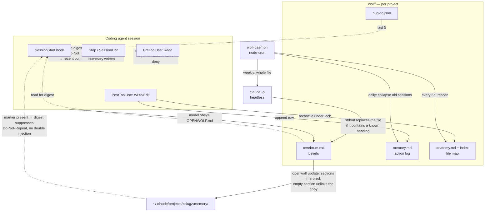

## 1. Executive Summary

OpenWolf is middleware for coding agents — Claude Code, Codex, OpenCode, Cursor,
Antigravity — that keeps a per-project brain in a `.wolf/` directory and injects
a budgeted digest of it at session start. Its pitch is token economy rather than
epistemics: an anatomy index so the agent reads a description instead of a file,
a duplicate-read hook that can refuse a second full read, a token ledger, a
waste detector.

The memory that matters here is `.wolf/cerebrum.md`, whose sections are User
Preferences, Key Learnings, Do-Not-Repeat and a Decision Log. Those are claims
about the user and the project that can be wrong, and the Do-Not-Repeat list is
a record of corrections the user has already made.

**The interesting thing technically is the split.** Everything mechanical —
which files exist, what was read, what was written, which bugs were fixed — is
maintained by lifecycle hooks that fire on every turn, with atomic writes, a
lock around the anatomy store, and a secrets denylist that keeps `.env` and key
material out of the generated files. The one store holding beliefs has no hook
at all. It is written by the model when it obeys an instruction in a generated
Markdown file, and rewritten in full by a weekly cron that pipes the file
through `claude -p` and accepts whatever comes back if it contains one of three
heading strings.

**Strongest:** the read path. `src/hooks/pre-read.ts` returns
`permissionDecision: "deny"` for a file already read this session and unchanged
on disk, with the denial disarmed after a compaction because the eviction makes
a re-read legitimate. That is enforcement where the constrained party cannot
reach, not advice in a prompt. `src/cli/memory-migrate.ts` is the second: it
mirrors cerebrum sections into Claude Code's own auto-memory directory and
unlinks a mirrored file when its source section empties, so a derived copy
cannot outlive what it was derived from.

**Weakest:** correction. `src/daemon/cron-engine.ts:403-413` is the whole of it —
a whole-file overwrite with a model's stdout, no merge, no backup, no record of
what was dropped, and the sink chosen by `String.prototype.includes`. A
Do-Not-Repeat entry the user asked for is deletable by a model's judgement of
relevance, and nothing anywhere records that it happened.

## 2. Mental Model

A memory is a line in a Markdown section. There are four kinds and only one of
them is a belief.

```text
BELIEF (cerebrum.md)
   written by:   the model, obeying OPENWOLF.md   ─┐
                 the weekly reflection cron        ─┴─► no state, no provenance
   corrected by: a human editing the file
   destroyed by: the weekly cron's whole-file replace

RECORD (memory.md, anatomy.md, buglog.json, token-ledger.json)
   written by:   hooks, on every turn
   corrected by: nothing — an action log cannot be wrong
   destroyed by: daily consolidation (memory.md), rescan (anatomy.md)
```

There is no state machine, because there are no states. A cerebrum entry is a
bullet under a heading; it has no status field, no confidence, no timestamp
beyond the `[YYYY-MM-DD]` prefix the template asks for in prose, no source, and
no id. Nothing can mark it doubtful, nothing can mark it rejected, and there is
no way to express *this was true and no longer is* other than deleting the line.

Control is split the same way as authorship. The record half is
**background-managed** and the agent has no say in it. The belief half is
**agent-controlled** in the loosest sense — the generated `OPENWOLF.md` says
*"Read `.wolf/cerebrum.md` and respect every entry"* and the Cursor rules file
says *"after a user correction, update cerebrum.md immediately"* — and
**user-controlled** in that a person is expected to edit the file directly; the
template's own header says *"Do not edit manually unless correcting an error."*

The system treats every memory as ground truth. There is no candidate state, no
verification, and no way for the store to represent uncertainty about anything
it holds.

## 3. Architecture



**Runtime shape.** A TypeScript CLI (`bin/openwolf.ts`) plus standalone hook
scripts compiled separately (`tsconfig.hooks.json`), a long-running daemon
(`src/daemon/wolf-daemon.ts`, port 18790) driving `node-cron`, and a React
dashboard served on 18791. Hooks are installed into the host agent's config by
`openwolf init`, which also generates `OPENWOLF.md`, a Cursor rules file and the
agent-specific snippets in `src/agents/`.

**Persistence.** Files only. Markdown for `cerebrum.md`, `memory.md`,
`anatomy.md`, `identity.md`, `STATUS.md`; JSON for `buglog.json`,
`anatomy-index.json`, `token-ledger.json`, `cron-state.json`, `suggestions.json`.
Writes go through `src/utils/fs-safe.ts`; the anatomy store is guarded by
`src/hooks/anatomy-lock.ts` with a bounded budget (`HOOK_LOCK_BUDGET_MS`) so a
hook degrades rather than hangs.

**Search.** There is no index and no embedding anywhere in the tree. Retrieval
is section extraction for the digest, plus the instruction to the model to grep
`anatomy.md` and `buglog.json` itself.

### Deployment and ergonomics

Node, one `npm install`, no database and no service beyond the optional daemon.
Fully local: nothing leaves the machine except the weekly `claude -p` call, and
that path strips `ANTHROPIC_API_KEY` from the environment so the CLI uses OAuth
subscription credentials rather than a metered key. The store is plain Markdown
and JSON in the repository's own directory, readable and repairable by hand,
which is the honest counterweight to everything section 7 says about
correction — a person can open `cerebrum.md` and fix it.

## 4. Essential Implementation Paths

**Capture (mechanical).** `src/hooks/post-write.ts` — normalizes the path,
exits immediately when `isSensitiveFile(baseName)` (`src/hooks/shared.ts:87`),
takes the anatomy lock, reconciles the store and re-renders `anatomy.md`, then
appends one row to `memory.md`:
`| HH:MM | action file | outcome | ~tokens |`.

**Capture (belief).** No hook. `src/cli/init.ts:407` generates `OPENWOLF.md`
containing *"Read `.wolf/cerebrum.md` and respect every entry"*, and
`init.ts:400` generates the Cursor rule *"after a user correction, update
cerebrum.md immediately"*. The write itself is the agent's ordinary file tool.
`src/hooks/stop.ts:143` is the only enforcement and it is a nudge: when files
were modified and no semantic summary reached `memory.md` it emits
`ACTION REQUIRED: … Append a one-line summary`.

**Consolidation.** `src/daemon/cron-engine.ts:254` `consolidateMemory` rewrites
`memory.md`, replacing the table rows of any session older than
`older_than_days` (default 7) with `> Consolidated session (N actions)`. The
rows are gone. An idempotency guard reuses an existing marker so a re-run does
not recount zero rows and destroy the original count.

**The belief rewrite.** `src/daemon/cron-engine.ts:347` `runAiTask` builds a
prompt from `params.prompt` plus the contents of `params.context_files`, runs
`claude -p --output-format text` with a 120 s timeout, strips a Markdown fence,
then routes the result: JSON parses to `suggestions.json`; otherwise, if the
text contains `## User Preferences`, `## Key Learnings` or `# Cerebrum`, it
becomes the new `cerebrum.md` (`:412-413`). The scheduled job that reaches this
is `cerebrum-reflection` in `src/templates/cron-manifest.json`, weekly at 03:00,
whose prompt asks the model to *"Remove Do-Not-Repeat entries older than 90 days
if no longer relevant"* and *"Return the cleaned file content only."*

**Retrieval / injection.** `src/hooks/session-start.ts` `buildSessionDigest`
composes, in order and under a per-agent token budget: the `## 🚀` section of
`STATUS.md`; the last ten Do-Not-Repeat entries from `cerebrum.md`; the last
five entries of `buglog.json` rendered as `error → fix` and truncated at 140
characters. `tryAdd` refuses any part that would exceed the budget, so the
injection cost is fixed rather than proportional to the store.

**Read-path enforcement.** `src/hooks/pre-read.ts:124` — with
`reads.duplicate_mode: "deny"`, a file already read this session, unchanged on
disk, not requested by a subagent, returns
`permissionDecision: "deny"` with a reason that tells the model to reuse its
earlier read or pass `offset`/`limit`, and states that a second attempt passes
through. `session-start.ts` clears deny-eligibility on every recorded read when
`source === "compact"`, because compaction evicted the file contents and the
re-read is legitimate.

**The derived copy.** `src/cli/memory-migrate.ts:82` `syncCerebrumToClaudeMemory`
writes one file per cerebrum section into `~/.claude/projects/<slug>/memory/`
with `openwolf_sync: <contentHash>` in the frontmatter, capped at `MAX_ENTRIES`
and `MAX_FILE_BYTES` by dropping oldest-first, skipping the write when the
content is byte-identical. An empty section `unlink`s the previously synced file
so *"stale advice does not outlive its cerebrum source."*

**Bugs.** `src/buglog/bug-tracker.ts` — `logBug`, `findSimilarBugs`,
`searchBugs`, `readBugLog`. No delete, no supersede, no status.

**Tests.** `tests/` — anatomy store and lock, symbol extractor, bug index,
config merge, hooks regression, pre-bash filter, security, token measurement,
transcript usage, ledger migration.

## 5. Memory Data Model

Four stores, one directory, no schema migration except the ledger.

| Store | Unit | Fields |
| --- | --- | --- |
| `cerebrum.md` | a bullet under one of four headings | none — free text, with a `[YYYY-MM-DD]` prefix asked for in a template comment |
| `memory.md` | a table row under a `## Session:` header | time, action, file(s), outcome, ~tokens |
| `anatomy.md` + `anatomy-index.json` | a file record | path, description (≤100 chars), token estimate; symbols and a signature outline live in the JSON only |
| `buglog.json` | `BugEntry` | `id`, `timestamp`, `error_message`, `file`/`files`, `line`, `root_cause`, `fix`, `tags`, `related_bugs`, `occurrences`, `last_seen` |

**Scoping is the filesystem.** `getWolfDir()` resolves `.wolf/` under the
project directory; there is no scope key on any record and no read filter,
because there is nothing to filter — one project, one store. The Claude
auto-memory mirror inherits the same model, writing under a slug derived from
the project path. For a single-user local tool this is a reasonable answer, and
it is not a tenant boundary in any sense.

**Provenance and time.** `memory.md` rows and `BugEntry` carry timestamps.
Cerebrum entries carry no machine-readable time, no source, no author, and no
way to distinguish a line the user dictated from a line the model inferred —
which is the field that would matter most given who writes them.

**Correction.** There is no per-memory delete, supersede or reject anywhere.
The correction surface is a text editor.

## 6. Retrieval Mechanics

Two channels, both lexical.

**Injected.** The session digest above: three sections, in priority order,
capped by `context.session_digest_budget_tokens` — 1500 for Claude, 1200 for
Codex, Gemini and OpenCode, 800 for Cursor. Cost is bounded and does not grow
with the store, which is the right shape; the corresponding failure is that a
store larger than the budget silently loses its tail, and the only ranking is
recency (`slice(-10)`, `slice(-5)`).

**Grepped.** Everything else. The generated rules tell the agent to grep
`anatomy.md` before reading an unfamiliar file and to grep `buglog.json` for an
error message before debugging. `bug-matcher.ts` / `findSimilarBugs` exist for
the CLI, but on the agent path the retrieval engine is the model's own search
tool over a JSON file.

**Cache behaviour.** Injection happens once at SessionStart through the
`additionalContext` channel rather than per turn, so it does not re-invalidate a
prompt prefix on every request — the failure
[cache-preserving injection](../../patterns/cache-preserving-injection/)
describes. `claudeMemoryHasSync()` then suppresses the Do-Not-Repeat block when
the mirror is present, so the same list is not paid for twice across two memory
systems. Both are deliberate and both are unusual.

**Failure modes.** No relevance filtering of any kind: the last ten
Do-Not-Repeat entries are injected whether or not they relate to the session.
`extractSection` is a line scan for `^## ` — a heading typo silently yields an
empty section and the digest simply omits it.

## 7. Write Mechanics

**Mechanical writes are synchronous and cheap.** Hooks run in-process on the
tool call, do no model work, and write files. There is no extraction step, no
embedding, and no queue on this path. This is
[zero-LLM capture](../../patterns/zero-llm-capture/) by construction.

**Belief writes are the model's own file edits**, so they are as synchronous as
whatever the agent does, and their reliability is the reliability of an
instruction in a Markdown file. `waste-detector.ts:74` measures the consequence
and names it: `cerebrum_stale` fires when the file has not changed in fourteen
days, with the suggestion *"Learning may not be active. Check if cerebrum is
being updated by hooks."* No hook updates cerebrum.

**Deduplication.** `logBug` merges by similarity and bumps `occurrences` and
`last_seen` on the existing record. Nothing deduplicates cerebrum; the weekly
reflection prompt asks the model to *"Remove duplicate preferences (keep
newer)"*, which is deduplication delegated to a model with no record of what it
merged.

**Conflict handling.** None. Two contradictory Key Learnings sit next to each
other until a model rewrite removes one.

### Operational cost

The write path never blocks on a model. The read path injects at most 1500
tokens once per session. The background bill is where the cost sits: an anatomy
rescan every six hours over up to `anatomy.max_files` (500) files, a daily
consolidation pass over the whole of `memory.md`, and two weekly `claude -p`
calls whose input is a whole file — so the reflection cost scales with the
corpus, bounded only by `cerebrum.max_tokens: 2000` being a target stated in the
prompt rather than a limit enforced in code. Write-to-readable lag is zero for
the mechanical stores and unbounded for beliefs: a Key Learning written now is
injected at the *next* session start, and only if it lands in the last ten
Do-Not-Repeat entries or the STATUS section.

## 8. Agent Integration

Seven lifecycle hooks — SessionStart, PreToolUse (Read, Write, Bash),
PostToolUse (Read, Write), Stop, SessionEnd, PreCompact — installed into the
host agent's settings by `openwolf init`, with per-agent adaptation in
`src/agents/` (Claude, Codex, Gemini, Cursor, OpenCode, Antigravity) and a
first-class OpenCode plugin in `src/templates/opencode-plugin/`. There is no MCP
server and no tool the model can call; the model's entire interface to memory is
(a) the injected digest, (b) its own file tools, (c) grep. The bundled skills in
`src/templates/skills/` — `handoff`, `reframe`, `designqc`, `security-audit`,
`openwolf-protocol` — are prompts, not memory operations.

The agent has essentially unlimited agency over the belief store and none over
the record stores, which is the inverse of the arrangement most systems here
choose, and the reason section 9 has so little to assess.

Compaction is handled deliberately: `PreCompact` records state, SessionStart
distinguishes `startup`/`clear` from `resume`/`compact` so `_session.json` is
not reset mid-flight, and a post-compaction digest prepends *"Session in
progress (context was just compacted)"* with the files already modified.

## 9. Reliability, Safety, and Trust

**Provenance:** none for beliefs. **Trust states:** none. **Confidence:** none.
The store cannot represent uncertainty about anything it holds, so the
epistemics section of this report is short because the system has none.

**Secrets.** `isSensitiveFile` (`src/hooks/shared.ts:87`) covers `.env*`, key
and keystore extensions, `id_rsa`-family names, `credential` substrings and
`secrets.{json,yaml,toml}`; matching files are excluded from anatomy and memory
entirely. The list is deliberately duplicated in
`src/scanner/anatomy-scanner.ts` with a comment saying why — the hooks are
standalone scripts and cannot import the scanner — which is the right call
stated out loud rather than a silent copy.

**Concurrency.** The anatomy store is written under a lock with a bounded wait
and a documented degrade path; `tests/anatomy-lock.test.ts` asserts *"must
degrade, never run"*. Atomic writes leave `.tmp` files, and SessionStart sweeps
them.

**Data loss.** Two scheduled paths destroy data by design: memory consolidation
drops action rows, and the reflection cron replaces the belief file. The second
has no backup, no diff and no floor on how much may disappear. A model that
returns a two-line file containing `# Cerebrum` replaces months of accumulated
preferences, and the only trace is the file's mtime.

**Prompt injection.** Recalled memory is injected as plain Markdown in the
digest with no fence and no data envelope. Since the cerebrum is written by the
model from user conversation, a hostile string in a user message can reach the
next session's system context by being written down as a Key Learning.

**Privacy deletion.** Deleting a memory means editing a file the project's git
history may already contain; `.wolf/` is not gitignored by the generated
`.gitignore` in the tree.

## 10. Tests, Evals, and Benchmarks

Twelve test files, and they are aimed at the mechanical half — anatomy store
reconciliation, the lock's degrade path, the symbol extractor, the bug index,
config merge, hook regressions, the bash filter, security, token measurement,
transcript usage, ledger migration.

The committed negative cases are what earn the one capability mark:
`tests/anatomy-store.test.ts` asserts *"symbols never render into anatomy.md
(they stay in the index)"* with `assert.ok(!rendered.includes("`main`"))`, and
`tests/security.test.ts` asserts `isSensitiveFile` classifies keys, stores and
credentials but not ordinary files. Both keep material out of a generated
artifact, which is the weaker of the two strengths the atlas's rubric
distinguishes; neither asserts anything about what a read returns.

`tests/anatomy-store.test.ts:267` — *"empty/corrupt anatomy.md never wipes
preserved content"* — is worth singling out, because it is a committed guard
against the defect class where a read failure and an empty store are the same
value.

**What is not tested at all:** the reflection cron. `runAiTask` has no test, so
the branch that decides whether a model's stdout becomes the belief store is
covered by nothing. `scripts/benchmark/run-ab.mjs` exists and drives headless
`claude -p` over six tasks reporting measured token usage; no result artifact is
committed with it, so the README's token-saving claims are a harness without a
result.

## 11. For Your Own Build

### Steal

- **Deny a duplicate read at the hook, and disarm the denial after
  compaction.** The refusal is enforced where the model cannot route around it,
  the reason string tells the model what to do instead, and a second attempt
  passes through so the mechanism cannot deadlock a legitimate need. The
  compaction carve-out is the part most implementations would miss.
- **Unlink a derived copy when its source empties.** One `unlink` in the sync
  loop is the difference between a mirror and an independent store that outlives
  what it mirrored.
- **Suppress your own injection when the host already carries the same
  material.** Detect the marker, skip the block, and say in a comment that the
  reason is not paying for the list twice.
- **Duplicate a security denylist across process boundaries on purpose, with the
  reason in a comment.** A silent copy rots; a copy that says why it exists gets
  updated.

### Avoid

- **Do not let a model's raw stdout replace a store.** If a model must edit
  memory, diff its output against the current file, refuse a shrink past a
  floor, and record what was removed. A substring check on the output is not a
  schema.
- **Do not route two different jobs to two different sinks by sniffing their
  output.** Have the job declare its sink.
- **Do not ship a staleness detector for a mechanism you did not wire.** The
  detector reads as evidence that the mechanism exists.
- **Do not consolidate an evidence log by deleting its rows.** Summarise beside
  the evidence, not over it.

### Fit

This suits a solo developer who wants a coding agent to stop re-reading files
and to carry a short list of standing instructions between sessions, and who is
comfortable opening `cerebrum.md` in an editor when it drifts. It assumes a
maintenance budget of exactly one person paying attention to one project. Walk
away if anything downstream of this memory must be defensible — there is no
provenance, no trust state, no correction record and a scheduled job that can
delete a user's stated preference with no trace. Also walk away if you need the
model to *query* memory: there is no tool surface, and everything not in the
1500-token digest is reachable only if the model chooses to grep for it.

## 12. Open Questions

- How often does the reflection cron actually fire and what does it return? The
  branch is untested and the failure mode is silent; only a running install with
  a populated cerebrum would show it.
- Does `project-suggestions` ever land in the cerebrum branch in practice? It
  depends on the model's output shape, which cannot be determined statically.
- What do the benchmark tasks in `scripts/benchmark/` actually measure on a real
  project? No result artifact is committed.
- Is `.wolf/` intended to be committed to the repository? The generated
  `.gitignore` does not exclude it and the docs do not say, which decides
  whether deletion is possible at all.

## Appendix: File Index

- **Storage / schema:** `src/hooks/anatomy-store.ts`, `src/buglog/bug-tracker.ts`, `src/templates/config.json`, `src/templates/cerebrum.md`, `src/templates/buglog.json`
- **Write path:** `src/hooks/post-write.ts`, `src/hooks/session-end.ts`, `src/hooks/stop.ts`, `src/hooks/shared.ts`
- **Read path / enforcement:** `src/hooks/pre-read.ts`, `src/hooks/post-read.ts`, `src/hooks/pre-bash.ts`
- **Context assembly:** `src/hooks/session-start.ts`, `src/hooks/precompact.ts`
- **Background workers:** `src/daemon/cron-engine.ts`, `src/daemon/wolf-daemon.ts`, `src/tracker/waste-detector.ts`, `src/templates/cron-manifest.json`
- **Integration:** `src/cli/init.ts`, `src/cli/update.ts`, `src/cli/memory-migrate.ts`, `src/agents/`, `src/templates/opencode-plugin/`
- **Tests:** `tests/anatomy-store.test.ts`, `tests/anatomy-lock.test.ts`, `tests/security.test.ts`, `tests/symbol-extractor.test.ts`, `tests/hooks-regression.test.ts`

## History

**2026-08-20** — [`7defd81b9faacea0134965e539118efb2a890cba`](https://github.com/cytostack/openwolf/commit/7defd81b9faacea0134965e539118efb2a890cba) — first reading, at release 2.1.0. Screened before anything was read: 0 auto-executing hooks, one build-time `prepublishOnly`, and both `package.json` and `pnpm-lock.yaml` changed the same day — inside the seven-day cooldown — so nothing was installed and nothing was run. Every claim here is from the source and its committed tests.
