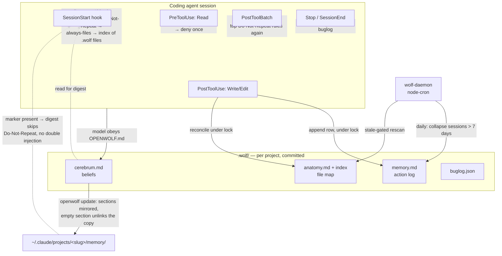

## 1. Executive Summary

OpenWolf is middleware for coding agents — Claude Code, Codex, OpenCode, Cursor,
Gemini, Antigravity — that keeps a per-project store in a `.wolf/` directory and
injects a small digest of it at session start. Its pitch is token economy rather
than epistemics: an anatomy index so the agent reads a description instead of a
file, a duplicate-read hook that can refuse a second full read, a Bash output
governor, a token ledger priced per model, a waste detector.

The memory that matters here is `.wolf/cerebrum.md`, whose sections are User
Preferences, Key Learnings, Do-Not-Repeat and a Decision Log. Those are claims
about the user and the project that can be wrong, and the Do-Not-Repeat list is a
record of corrections the user has already made.

**The interesting thing technically is the split.** Everything mechanical —
which files exist, what was read, what was written, which bugs were fixed — is
maintained by lifecycle hooks that fire on every turn, with atomic writes, a
read-modify-write lock around every JSON store, and a secrets denylist that keeps
`.env` and key material out of the generated files. The one store holding beliefs
has no hook that writes it. It is written by the model when it obeys an
instruction in a generated Markdown file, nudged by a Stop hook when it has not
changed, and otherwise left alone: since release 2.5 OpenWolf makes no model calls
of any kind, and the weekly job that used to rewrite `cerebrum.md` through
`claude -p` is gone.

**Strongest:** the read path. `src/hooks/pre-read.ts` returns
`permissionDecision: "deny"` for a full re-read of a file already read this
session and unchanged on disk — once per file, main thread only, and never after
a compaction evicted the earlier read. That is enforcement where the constrained
party cannot reach, not advice in a prompt. `src/cli/memory-migrate.ts` is the
second: it mirrors cerebrum sections into Claude Code's own auto-memory directory
and unlinks a mirrored file when its source section empties, so a derived copy
cannot outlive what it was derived from.

**Weakest:** correction, which is a text editor. Nothing marks a belief doubtful,
rejected or superseded, and nothing records that a line was removed. The
destructive scheduled path that remains is on the evidence side: a daily job
collapses `memory.md` sessions older than seven days into a count.

## 2. Mental Model

A memory is a line in a Markdown section. There are four kinds and only one of
them is a belief.

```text
BELIEF (cerebrum.md)
   written by:   the model, obeying OPENWOLF.md and the rules file
   nudged by:    the Stop hook, when files changed and cerebrum did not
   corrected by: a human editing the file
   destroyed by: nothing scheduled

RECORD (memory.md, anatomy.md, buglog.json, token-ledger.json)
   written by:   hooks, on every turn, under a read-modify-write lock
   corrected by: nothing — an action log cannot be wrong
   destroyed by: daily consolidation (memory.md), rescan (anatomy.md)
```

There is no state machine, because there are no states. A cerebrum entry is a
bullet under a heading; it has no status field, no confidence, no timestamp beyond
the `[YYYY-MM-DD]` prefix the template asks for in prose, no source, and no id.
Nothing can mark it doubtful, nothing can mark it rejected, and there is no way to
express *this was true and no longer is* other than deleting the line.

Control is split the same way as authorship. The record half is
**background-managed** and the agent has no say in it. The belief half is
**agent-controlled** — the generated rules tell the model to check the
Do-Not-Repeat list before generating code and to update `cerebrum.md` after a user
correction — and **user-controlled** in that a person is expected to edit the
file, which `.wolf/.gitignore` marks as committed, reviewable project state.

The system treats every memory as ground truth. There is no candidate state, no
verification, and no way for the store to represent uncertainty about anything it
holds.

## 3. Architecture



**Runtime shape.** A TypeScript CLI (`bin/openwolf.ts`) plus standalone hook
scripts compiled separately (`tsconfig.hooks.json`), a long-running daemon
(`src/daemon/wolf-daemon.ts`) driving `node-cron`, and a React dashboard. Hooks are
installed into the host agent's config by `openwolf init`, which also generates
`OPENWOLF.md`, a rules file and the agent-specific snippets in `src/agents/`.
Daemon stop and restart act only on a process proven to be this project's daemon
by `.wolf/daemon.pid`.

**Persistence.** Files only. Markdown for `cerebrum.md`, `memory.md`,
`anatomy.md`, `STATUS.md`; JSON for `buglog.json`, `anatomy-index.json`,
`token-ledger.json`, `cron-state.json`. Writes are atomic, and since 2.5.1
`mutateJSON()` in `src/hooks/anatomy-lock.ts` runs every JSON read-modify-write
inside one bounded lock — the release notes record 60 concurrent read hooks
keeping 6 reads before the change and 60 after. `.wolf/.gitignore` separates
committed state (cerebrum, STATUS, memory, buglog, anatomy) from machine-local
runtime files.

**Search.** No embedding. Retrieval is section extraction for the digest,
`openwolf find` over the anatomy index, `openwolf bug search`, and a personalized
PageRank over persisted import edges behind `openwolf map` for fitting a code map
to a token budget.

### Deployment and ergonomics

Node, one `npm install`, no database and no service beyond the optional daemon.
Fully local, with no model calls: a stale cron manifest that still names the
removed `ai_task` action fails loudly rather than reaching the network. The store
is plain Markdown and JSON in the repository's own directory, readable and
repairable by hand, which is the honest counterweight to everything section 7 says
about correction — a person can open `cerebrum.md` and fix it.

## 4. Essential Implementation Paths

**Capture (mechanical).** `src/hooks/post-write.ts` — normalizes the path, checks
it is inside the project root, exits when `isSensitiveFile(baseName)`
(`src/hooks/shared.ts:218`), reconciles the anatomy store under the lock and
re-renders `anatomy.md`, appends one row to `memory.md`, and warns once per
session when a `.wolf` state file passes its write budget (`cerebrum.md` 2,000
tokens, `STATUS.md` 1,000).

**Capture (belief).** No hook writes it. The generated rules tell the model to
check the Do-Not-Repeat list before generating code and to update `cerebrum.md`
after a correction; the write itself is the agent's ordinary file tool.
`src/hooks/stop.ts:136` is the enforcement and it is a nudge: when files were
modified and `cerebrum.md` has not changed for hours it emits
`ACTION REQUIRED: … Update .wolf/cerebrum.md with any new user preferences,
conventions, or gotchas`, and `:112` does the same for bugs.

**Consolidation.** `src/daemon/cron-engine.ts:323` `consolidateMemory` rewrites
`memory.md`, replacing the table rows of any session older than
`older_than_days` (default 7) with `> Consolidated session (N actions)`. The rows
are gone. An idempotency guard reuses an existing marker so a re-run does not
recount zero rows.

**No belief rewrite.** `cron-engine.ts:286-293` is what is left of it: a case for
`ai_task` that throws *"ai_task is no longer supported: OpenWolf makes no model
calls"*. The `cerebrum-reflection` and `project-suggestions` jobs, the Insights
panel and `suggestions.json` were removed in 2.5.

**Retrieval / injection.** `src/hooks/session-start.ts` `buildSessionDigest`
composes, in order and under a budget capped at roughly 400 tokens plus a quarter
of the agent's configured budget: the `## 🚀` section of `STATUS.md` with template
placeholders filtered out; the three newest Do-Not-Repeat entries from
`cerebrum.md`, skipped when the Claude auto-memory mirror carries them; any `.wolf`
Markdown file whose front matter says `always: true`, capped at 40 lines; and an
index — one line per live state file with its description, size and last update,
*"read on demand, not preloaded"*. `tryAdd` refuses any part that would exceed the
budget.

**Re-surfacing.** `src/hooks/post-batch.ts` with `src/hooks/rule-reinjection.ts`
re-emits the top Do-Not-Repeat rules every `reinjection_interval` tool batches
(default 25), on the argument in its header that instruction compliance decays
within a session rather than with file size. After a compaction, SessionStart also
restores path-scoped rules for files already touched, which the host drops until a
matching file is read again.

**Read-path enforcement.** `src/hooks/pre-read.ts:170-190` — with
`reads.duplicate_mode: "deny"`, a full read of a file already read this session,
unchanged on disk, by the main thread, whose earlier read delivered content, and
not already denied once, returns `permissionDecision: "deny"` with a reason that
tells the model to reuse its earlier read or pass `offset`/`limit` and that a
second attempt passes through. A compaction marks earlier reads as evicted and
disarms the denial.

**The derived copy.** `src/cli/memory-migrate.ts:86` `syncCerebrumToClaudeMemory`
writes one file per cerebrum section into `~/.claude/projects/<slug>/memory/`
with a content hash in the front matter, capped by dropping oldest-first, skipping
byte-identical writes. An empty section `unlink`s the previously synced file
(`:112`).

**Bugs.** `src/buglog/bug-tracker.ts` — `logBug`, `findSimilarBugs`, `searchBugs`,
`readBugLog`, with a bare-array buglog normalised at every boundary. No delete, no
supersede, no status.

## 5. Memory Data Model

Four stores, one directory, no schema migration except the ledger.

| Store | Unit | Fields |
| --- | --- | --- |
| `cerebrum.md` | a bullet under one of four headings | none — free text, with a `[YYYY-MM-DD]` prefix asked for in a template comment |
| `memory.md` | a table row under a `## Session:` header | time, action, file(s), outcome, ~tokens |
| `anatomy.md` + `anatomy-index.json` | a file record | path, description (≤100 chars), token estimate; symbols, a signature outline and import edges live in the JSON only |
| `buglog.json` | `BugEntry` | `id`, `timestamp`, `error_message`, `file`/`files`, `line`, `root_cause`, `fix`, `tags`, `related_bugs`, `occurrences`, `last_seen` |

**Scoping is the filesystem.** `getWolfDir()` resolves `.wolf/` under the project
directory, and every hook checks a path is inside the project root before
recording it. There is no scope key on any record and no read filter, because
there is nothing to filter — one project, one store. The Claude auto-memory mirror
writes under a slug derived from the project path. For a single-user local tool
this is a reasonable answer, and it is not a tenant boundary in any sense.

**Provenance and time.** `memory.md` rows and `BugEntry` carry timestamps.
Cerebrum entries carry no machine-readable time, no source, no author, and no way
to distinguish a line the user dictated from a line the model inferred — which is
the field that would matter most given who writes them.

**Correction.** There is no per-memory delete, supersede or reject anywhere. The
correction surface is a text editor, and with `.wolf/` committed, a diff in review.

## 6. Retrieval Mechanics

Three channels, all lexical.

**Injected.** The session digest above, small by construction — the release that
introduced the current shape measured a mean of 794 tokens before, three quarters
of them nag text or template placeholders. Cost is bounded and does not grow with
the store; the corresponding failure is that anything outside the three newest
Do-Not-Repeat rules and the always-files reaches the model only if it follows the
index and opens the file.

**Re-surfaced.** The PostToolBatch hook re-injects the same top rules every 25
tool batches. That is a deliberate trade against prompt caching in the other
direction from session-start injection: a mid-session `additionalContext` note is
new content, spent to counter the decay the header describes.

**Queried.** Everything else, through the model's own tools and the CLI:
`openwolf find` over the anatomy index, `openwolf bug search`, and `openwolf map`,
which seeds a personalized PageRank with the session's files and fits the result
to a token budget.

**Cache behaviour.** Session-start injection goes through `additionalContext`
once rather than per turn, so it does not invalidate a prompt prefix on every
request — the failure
[cache-preserving injection](../../patterns/cache-preserving-injection/)
describes. `claudeMemoryHasSync()` suppresses the Do-Not-Repeat block when the
mirror is present, so the same list is not paid for twice.

**Failure modes.** No relevance filtering: the top rules are the newest three,
whether or not they relate to the session. `extractSection` is a line scan for
`^## ` — a heading typo silently yields an empty section and the digest omits it.

## 7. Write Mechanics

**Mechanical writes are synchronous and cheap.** Hooks run on the tool call, do no
model work, and write files under a lock. There is no extraction step, no
embedding, and no queue on this path. This is
[zero-LLM capture](../../patterns/zero-llm-capture/) by construction, and since
2.5 it is true of the whole system.

**Belief writes are the model's own file edits**, so their reliability is the
reliability of an instruction in a Markdown file plus a Stop-hook nudge.
`waste-detector.ts:80` measures the consequence: `cerebrum_stale` fires when the
file has not changed in fourteen days, with the suggestion *"Learning may not be
active. Check if cerebrum is being updated by hooks."* No hook updates cerebrum;
the suggestion predates the design it describes.

**Deduplication.** `logBug` merges by similarity and bumps `occurrences` and
`last_seen`. Nothing deduplicates cerebrum, and with the reflection job removed,
nothing prunes it either: the write budget warns when it passes 2,000 tokens and
the model is left to act on the warning.

**Conflict handling.** None. Two contradictory Key Learnings sit next to each
other until a person or the model deletes one.

### Operational cost

The write path never blocks on a model, and there is no model on any path. The
read path injects a few hundred tokens at session start and a few rules every 25
batches. The background bill is an anatomy rescan gated by a Merkle stale check, a
daily consolidation pass over `memory.md`, and a weekly token audit. Write-to-
readable lag is zero for the mechanical stores and one session for beliefs: a Key
Learning written now is injected at the next session start only if it is among
the three newest Do-Not-Repeat entries; otherwise it is listed in the index and
read only if the model opens the file.

## 8. Agent Integration

Twelve hook registrations — SessionStart, UserPromptSubmit, PreToolUse (Read,
Write, Bash), PostToolUse (Read, Write, Bash), PostToolBatch, Stop, SessionEnd,
PreCompact — installed into the host agent's settings by `openwolf init`, with
per-agent adaptation in `src/agents/` and an OpenCode plugin in
`src/templates/opencode-plugin/` whose state is kept per session id. The
documentation states which hooks each host actually receives. There is no MCP
server and no tool the model can call; the model's interface to memory is (a) the
injected digest and re-surfaced rules, (b) its own file tools, (c) the CLI. The
bundled skills in `src/templates/skills/` are prompts, not memory operations.

The agent has essentially unlimited agency over the belief store and none over
the record stores, which is the inverse of the arrangement most memory systems
choose, and the reason section 9 has so little to assess.

Compaction is handled deliberately: `PreCompact` records state, SessionStart
distinguishes `startup`/`clear` from `resume`/`compact` so the session file is not
reset mid-flight, earlier reads are marked evicted so the duplicate-read denial
disarms, and path-scoped rules for touched files are restored.

## 9. Reliability, Safety, and Trust

**Provenance:** none for beliefs. **Trust states:** none. **Confidence:** none.
The store cannot represent uncertainty about anything it holds.

**Secrets.** `isSensitiveFile` (`src/hooks/shared.ts:218`) covers `.env*`, key
and keystore extensions, `id_rsa`-family names, `credential` substrings and
`secrets.{json,yaml,toml}`; matching files are excluded from anatomy and memory
entirely. The list is deliberately duplicated in `src/scanner/anatomy-scanner.ts`
with a comment saying why — the hooks are standalone scripts and cannot import the
scanner.

**Concurrency.** Every JSON store is written through `mutateJSON()`, one bounded
lock around read-modify-write; the lock degrades rather than hangs, cron does not
write after its lock budget expires, and `tests/concurrency.test.ts` runs 60
concurrent hooks and asserts nothing is lost.

**Boundaries.** One lexical containment check with a realpath fallback guards
pre-read, post-read and post-bash; daemon control proves ownership through a pid
file before signalling; an existing dashboard token is repaired to `0600` rather
than rotated; a malformed host hook config is left byte-identical with a warning.

**Data loss.** One scheduled path destroys data by design: memory consolidation
drops action rows. The belief file is not rewritten by anything scheduled.

**Prompt injection.** Recalled memory is injected as plain Markdown in the digest
with no fence and no data envelope. Since the cerebrum is written by the model from
user conversation, a hostile string in a user message can reach the next
session's context by being written down as a Do-Not-Repeat rule, and from there
be re-surfaced every 25 batches.

**Privacy deletion.** `.wolf/.gitignore` marks `cerebrum.md` and `memory.md` as
committed state, so deleting a memory means editing a file the repository's
history already contains.

## 10. Tests, Evals, and Benchmarks

Twenty-six test files with about 208 cases, aimed at the mechanical half — anatomy
store and lock, symbol extractor, bug index and buglog shape, config merge, hook
regressions and hook health, the bash filter and output governor, security, path
containment, concurrency, daemon ownership, token and cost measurement, ledger
migration, context quality. The 2.5.1 release notes say each of its sixteen fixes
ships a regression test first run against the unfixed code.

The committed negative cases are what earn the one capability mark:
`tests/anatomy-store.test.ts:186` asserts *"symbols never render into anatomy.md
(they stay in the index)"*, and `tests/security.test.ts` asserts `isSensitiveFile`
classifies keys, stores and credentials but not ordinary files. Both keep material
out of a generated artifact, the weaker of the two strengths the atlas's rubric
distinguishes; neither asserts anything about what a read returns.

`tests/anatomy-store.test.ts:267` — *"empty/corrupt anatomy.md never wipes
preserved content"* — is worth singling out, because it is a committed guard
against the defect class where a read failure and an empty store are the same
value.

`openwolf bench` is an A/B harness over headless agent runs that pins one commit
for every arm and records it per result; no result artifact is committed, so the
README's token-saving claims are a harness without a result.

## 11. For Your Own Build

### Steal

- **Deny a duplicate read at the hook, once, and disarm the denial after
  compaction.** The refusal is enforced where the model cannot route around it, the
  reason string tells the model what to do instead, and a second attempt passes
  through so the mechanism cannot deadlock a legitimate need.
- **Unlink a derived copy when its source empties.** One `unlink` in the sync loop
  is the difference between a mirror and an independent store that outlives what it
  mirrored.
- **Suppress your own injection when the host already carries the same material.**
  Detect the marker, skip the block, and say in a comment why.
- **Inject an index, not the store.** One line per state file with a description,
  a size and a date costs a few dozen tokens and tells the model what exists.
- **Lock the read-modify-write, not the write.** Atomic writes prevent torn files;
  only a lock around the whole mutation prevents lost updates, and 60 concurrent
  hooks is a cheap test of it.

### Avoid

- **Do not ship a staleness detector for a mechanism you did not wire.** The
  detector reads as evidence that the mechanism exists.
- **Do not consolidate an evidence log by deleting its rows.** Summarise beside the
  evidence, not over it.
- **Do not re-surface model-written rules without a fence.** A rule the model
  wrote from a user message is repeated every 25 batches with the authority of an
  instruction.

### Fit

This suits a solo developer or a small team who want a coding agent to stop
re-reading files and to carry a short list of standing instructions between
sessions, and who are comfortable reviewing `cerebrum.md` in a diff when it
drifts. Walk away if anything downstream of this memory must be defensible — there
is no provenance, no trust state and no correction record. Also walk away if you
need the model to *query* beliefs: there is no tool surface, and everything not in
the digest is reachable only if the model opens the file.

## 12. Open Questions

- Does the model keep `cerebrum.md` under its 2,000-token budget on a long-lived
  project now that nothing prunes it, or does the file grow until the warning is
  ignored?
- Does re-surfacing the three newest Do-Not-Repeat rules every 25 batches measurably
  change compliance? The header cites a study; no committed measurement shows the
  effect in this tool.
- What do `openwolf bench` runs show on a real project? No result artifact is
  committed.

## Appendix: File Index

- **Storage / schema:** `src/hooks/anatomy-store.ts`, `src/hooks/anatomy-lock.ts` (`mutateJSON`), `src/buglog/bug-tracker.ts`, `src/templates/config.json`, `src/templates/cerebrum.md`, `src/templates/buglog.json`
- **Write path:** `src/hooks/post-write.ts`, `src/hooks/session-end.ts`, `src/hooks/stop.ts`, `src/hooks/shared.ts`
- **Read path / enforcement:** `src/hooks/pre-read.ts`, `src/hooks/post-read.ts`, `src/hooks/pre-bash.ts`, `src/hooks/bash-output-governor.ts`
- **Context assembly:** `src/hooks/session-start.ts`, `src/hooks/post-batch.ts`, `src/hooks/rule-reinjection.ts`, `src/hooks/precompact.ts`
- **Background workers:** `src/daemon/cron-engine.ts`, `src/daemon/wolf-daemon.ts`, `src/tracker/waste-detector.ts`, `src/templates/cron-manifest.json`
- **Integration:** `src/cli/init.ts`, `src/cli/update.ts` (`.wolf/.gitignore`), `src/cli/memory-migrate.ts`, `src/cli/map.ts`, `src/agents/`, `src/templates/opencode-plugin/`
- **Tests:** `tests/anatomy-store.test.ts`, `tests/anatomy-lock.test.ts`, `tests/security.test.ts`, `tests/symbol-extractor.test.ts`, `tests/concurrency.test.ts`, `tests/path-containment.test.ts`, `tests/context-quality.test.ts`

## History

**2026-09-15** — [`521fbc4721e8a6c375617ebd0f91fba15a1d29e0`](https://github.com/cytostack/openwolf/commit/521fbc4721e8a6c375617ebd0f91fba15a1d29e0) — 19 commits on, through releases 2.2 to 2.5.1. Screened before reading: no auto-run surface, one build-time execution point, two unpinned surfaces and one dependency surface inside the cooldown; nothing was installed or run. The body is rewritten, because the mechanism the first reading centred on is gone: 2.5 removed the `ai_task` cron action and with it the weekly `cerebrum-reflection` job that replaced `cerebrum.md` with a `claude -p` rewrite, so OpenWolf makes no model calls and nothing scheduled touches the belief file. Also since the pin: a session digest reshaped into an index of state files under a ~400-token cap, Do-Not-Repeat rules re-surfaced every 25 tool batches and after compaction, write budgets on `.wolf` state, `mutateJSON()` locking every JSON read-modify-write after the 2.5.1 fixes for lost updates under 60 concurrent hooks, project-boundary checks, daemon ownership by pid file, a `.wolf/.gitignore` that commits cerebrum and memory, and `openwolf map` over import edges. `negative_eval` stands on the same two tests.

**2026-08-20** — [`7defd81b9faacea0134965e539118efb2a890cba`](https://github.com/cytostack/openwolf/commit/7defd81b9faacea0134965e539118efb2a890cba) — first reading, at release 2.1.0. Screened before anything was read: 0 auto-executing hooks, one build-time `prepublishOnly`, and both `package.json` and `pnpm-lock.yaml` changed the same day — inside the seven-day cooldown — so nothing was installed and nothing was run. Every claim here is from the source and its committed tests.
