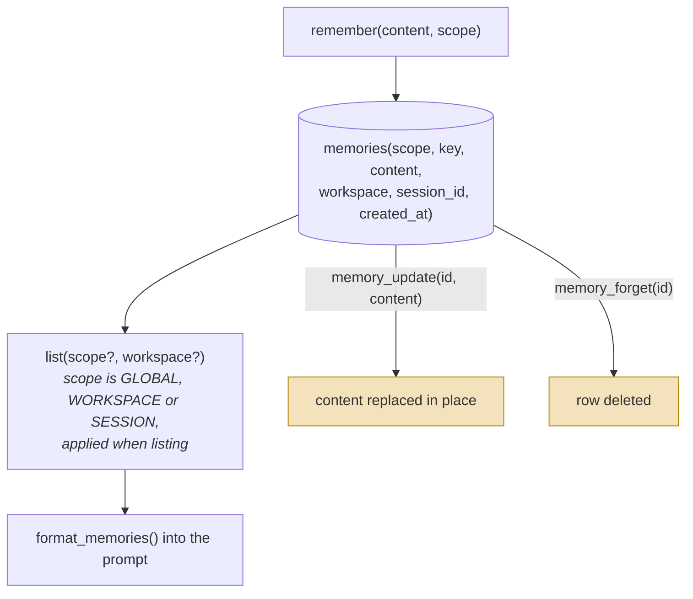

## 1. Executive Summary

OpenWorker is Andrew Ng's MIT-licensed AI coworker — a large desktop and CLI
agent with permissions, audit, risk classification, workspace trust, unattended
operation and self-wake. Its memory subsystem is **260 lines**: a `MemoryItem`,
a store interface, a SQLite implementation, and three tools.

By the atlas's usual measures that is unremarkable. The reason it is here is that
the memory's real artifact is not the code — it is the paragraph that governs the
model's use of it, and the comment above that paragraph:

```python
# When-to-remember rules, injected only when a memory store is wired. Without these,
# models either never call `remember` or save noise the repo already records.
```

That is a stated empirical finding about model behaviour, and it names a
**bimodal failure**: given a memory tool and no policy, models do not save
mediocre things — they either save nothing or save everything. Most systems in
this atlas have a memory tool with a one-line description and no stated
expectation of what happens next.

The policy itself is unusually specific for a prompt:

> "Use `remember` for durable facts: the user's corrections and stated
> preferences (**include the why**), and project context you couldn't rederive
> from the code. **Don't save what the repo already records** (code structure,
> git history, AGENTS.md) or details that only matter to the current task. Use
> **absolute dates**, never 'yesterday'."
>
> "Before saving, check the known-memories list: if an entry already covers it,
> **revise that entry** with `memory_update` instead of adding a near-duplicate;
> **retire** wrong or obsolete entries with `memory_forget`."
>
> "**Memories reflect when they were written.** If one names a file, flag, or
> URL, **verify it still exists** before relying on it."

Four mechanisms this atlas has documented as code appear here as instructions:
deduplication, supersession, an ROI test for what is worth storing, and
read-time staleness verification. [Magic Context](../magic-context/) builds a
whole re-verification subsystem to answer the last one; OpenWorker tells the
model to check.

Reservations, and they follow directly. A policy in a prompt is not enforced:
nothing rejects a near-duplicate, nothing records that a memory was retired, and
nothing detects when the model ignores the guidance. Retrieval is a filtered
list with no ranking. And `memory_forget` is a hard delete with no trace.

## 2. Mental Model



Four verbs and a scope enum. Both mutating verbs are destructive — replaced in
place, or deleted — so nothing records that a value was ever different.

There are no states. A memory exists or it does not, and the transition between
those is a tool call the model decides to make on the strength of a paragraph of
guidance.

## 3. Architecture

`coworker/memory/` is four files — `base.py` (`Scope`, `MemoryItem`,
`MemoryStore` ABC, `format_memories`), `sqlite_store.py`, `tools.py`,
`__init__.py` — totalling 260 lines. The store shares `coworker.db` with
sessions and workspaces.

The surrounding system is the opposite of small: `permissions.py`, `audit.py`,
`risk.py`, `workspace_trust.py`, `unattended.py`, `selfwake.py`, `secrets.py`,
`connectors/`, `skills/`, `personas/`, `automation/`. Memory does not connect to
any of it — grep finds no reference to memory in the audit, permission or
unattended paths, so an agent running unattended writes memories under exactly
the same rules as an attended one.

### Deployment and ergonomics

A `pip`-installable Python application with a SQLite file; nothing else to stand
up for memory. The store is one table you can read with any SQLite client, and
memory is optional — the tools and their guidance are wired only when a store is
configured, so the agent runs without it.

## 4. Essential Implementation Paths

### The guidance is the mechanism

Every clause in the policy maps to something another system in this atlas builds:

| The instruction | Built elsewhere as |
| --- | --- |
| "Don't save what the repo already records" | [GenericAgent](../genericagent/)'s ROI rule — an entry the model would act on unprompted costs tokens and returns nothing |
| "revise that entry instead of adding a near-duplicate" | dedupe and merge passes in [mem0](../mem0/), [agentmemory](../agentmemory/), [Memora](../memora/) |
| "retire wrong or obsolete entries" | supersession chains in [Graphiti](../graphiti/), [Atomic Agent](../atomic-agent/) |
| "verify it still exists before relying on it" | [Magic Context](../magic-context/)'s git-triggered re-verification |
| "include the why" | reason fields in [Core Memory](../core-memory/), [Verel](../verel/) |
| "use absolute dates" | nothing — most systems here have this bug |

The last row is worth pausing on. "Use absolute dates, never 'yesterday'" fixes
a failure the atlas has not otherwise named: a memory recorded as "the user is
travelling next week" is *wrong* by the time it is read, and no amount of
retrieval quality recovers it. It costs one clause in a prompt.

The honest reading of this table is not that prompting is as good as machinery —
it plainly is not, because none of it is enforced or observable. It is that a
260-line memory with a well-considered policy may outperform a 10,000-line one
with none, and several systems in this atlas ship the second.

### Conditional injection

The guidance is "injected only when a memory store is wired", so an agent
without memory does not carry instructions about a tool it lacks. That is the
[gate the expensive path](../../patterns/gate-the-expensive-path/) instinct
applied to prompt real estate — context is spent only when there is something to
spend it on.

### A `key` column with no visible use

The schema carries `key TEXT` alongside `content`, and `MemoryItem` exposes it,
but the three tools do not set it: `remember(content, scope)` has no key
parameter. The column is the hook for exactly the "revise the entry that already
covers this" behaviour the prompt asks the model to perform by reading the list —
keyed memory would make that a lookup rather than a judgement.

It reads as a design that knows where it would go next.

### Three scopes, applied on read

`GLOBAL | WORKSPACE | SESSION`, with `list()` filtering on scope and workspace.
That is a real boundary applied on the read path rather than a tag, which is more
than several larger systems here manage — though with a single local user it is
about organization rather than isolation.

## 5. Memory Data Model

`memories(id, scope, key, content, workspace, session_id, created_at)`.

Absent: trust state, provenance beyond a timestamp, supersession, tombstone,
audit, ranking. `memory_forget` deletes the row; nothing records that it existed
or why it went, which sits oddly beside an application that has a dedicated
`audit.py` for other operations.

## 6. Retrieval Mechanics

`list(scope, workspace, limit)` and `format_memories()` into the prompt. No
embedding, no lexical search, no ranking, no relevance — memory is small enough
to inject wholesale, which is the same bet [nanobot](../nanobot/) makes.

That bet holds while the store is small. Nothing here bounds growth, and the
prompt's "check the known-memories list" instruction assumes the list is short
enough to read.

## 7. Write Mechanics

Three tools, called at the model's discretion under the guidance above. No
extraction pass, no background consolidation, no dedupe check.

### Operational cost

Zero LLM cost on the memory path — no extraction, no summarization, no
consolidation. Writes are synchronous SQLite inserts, so nothing blocks and
nothing lags: a memory is retrievable the moment it is written, which is the
freshness property the [benchmarks page](../../benchmarks/) says nobody measures
and which falls out for free here.

The recurring cost is context: every memory in scope is injected on every turn,
so per-turn tokens grow linearly with the store and nothing caps it.

## 8. Agent Integration

`memory_tools(store, workspace=...)` returns `remember`, `memory_update` and
`memory_forget`, wired into the agent's tool set alongside base tools,
permissions and `AGENTS.md`. Memory is one optional component of a much larger
agent.

## 9. Reliability, Safety, and Trust

Strengths:

- **An explicit write policy**, addressing a stated failure of models without one.
- **A named empirical finding** — without guidance, models either never save or
  save noise.
- **Absolute-date discipline**, which nothing else here asks for.
- **Read-time staleness instruction**, cheap where others build subsystems.
- **Three scopes applied on read.**
- **Conditional injection**, so unused tools cost no context.
- **No LLM on the memory path**, so writes are instant and free.

Gaps:

- **Nothing is enforced.** Dedupe, retirement, ROI and verification are requests,
  and no signal exists when the model ignores them.
- **A delete leaves the store with no record of what it removed.** The tool call
  is audited, so *that* a forget happened is durable; nothing is keyed on the
  forgotten value, so the same fact is admitted again the next time the model
  proposes it.
- **`memory_read` is an unscoped third read path.** It takes a list of integer
  ids and calls `store.get(mid)` with no scope comparison, so a model that
  guesses or remembers an id can read a memory the injection path would not have
  shown it. Ids are sequential integers.
- **No ranking and no growth bound**, with everything in scope injected per turn.
- **No trust state, provenance, or supersession.**
- **`session` is a declared scope with no writer.** `remember` maps it to
  `WORKSPACE` on the way in — *"dead scope (spec §3): never save to it"* — so one
  of the three enum values is unreachable.
- **`key` exists and is unused.**

Three things belong on the strengths side that are unusual enough to name
separately.

**Every write is announced to the user, and an update carries its own undo.**
The `on_saved` hook pushes a `memory_saved` event to the session surface so the
transcript renders *"I'll remember that — … [Undo]"* inline. `memory_update`
captures the prior text *before* the write specifically so the Undo can restore
it, and the docstring records why the hook fires for updates at all: the
update-don't-duplicate rule means many saves arrive as edits, *"and those were
invisible (owner-hit 2026-07-28)."* The notice is best-effort by design —
*"the notice is never worth failing a write that already succeeded."*

**The user's rules outrank the agent's memories, and no tool can reach them.**
`user_rules` is a bounded settings field *"injected verbatim above auto
memories; on conflict the rule wins,"* and the module states the boundary as a
prohibition: *"**The agent never writes, edits, or deletes this** — no tool
touches it; the only writer is the Settings UI via the manager."* A
human-authored layer with declared precedence over what the agent learned, in a
store where the agent otherwise writes freely, is a cleaner separation than most
systems here attempt.

**The saving switch is checked live, in both directions.** `saving_enabled` is a
callable evaluated on each write rather than at engine build, so flipping the
Settings toggle applies to conversations already running — recorded as a
two-sided bug: *"off kept saving, then on kept refusing."* The write tools stay
registered and refuse with a message instructing the model to *"tell the user
plainly instead of implying you remembered it,"* while `memory_read` never
gates, on the stated principle that *"off = stop learning, not amnesia."*

## 10. Tests, Evals, and Benchmarks

`tests/test_memory.py` is 723 lines and `tests/test_memory_api.py` a further
197, against 540 lines of memory implementation — a test-to-code ratio near
1.7:1, which is at the top of anything in this corpus at this size. Nothing was
run for this review.

The suite is built around what must *not* happen. `test_workspace_scope_isolation`
asserts a sibling workspace lists nothing while the writing workspace lists one.
Several cases assert that a truncated body never reaches the index block, and
that with memory switched off the tools, the memories block and the guidance are
all absent from the system prompt.

The case worth copying is the mid-conversation delete:

```python
assert "prefers tea" in engine.messages[0]["content"]
store.delete(item.id)          # deleted while this conversation is open
assert "prefers tea" in engine.messages[0]["content"]      # frozen prompt keeps it
assert "prefers tea" not in engine.context_provider()      # live view drops it
# a conversation started AFTER the delete never sees it
assert "prefers tea" not in engine2.messages[0]["content"]
```

Three assertions pinning the difference between *frozen into a running
conversation*, *withheld from the live view*, and *gone from the next session* —
a distinction almost nothing else in this corpus tests, and one that matters
precisely because the design freezes memories into the prompt at session start.

Named cases also cover the live switch stopping writes mid-conversation, the
save notice carrying the previous text, a notice failure never failing the save,
and `remember` never persisting the dead `session` scope.

The measurable claim remains the one in the comment: that guidance changes model
behaviour from bimodal — never saving or saving noise — to useful. That is an A/B
test with the guidance toggled, and the finding is stated as though it were
observed, so someone may already have the data. No such measurement is
committed.

## 11. For Your Own Build

### Steal

- **Write the when-to-remember policy down**, and expect the failure to be
  bimodal without it. A tool description is not a policy.
- **"Use absolute dates, never yesterday."** One clause; prevents a class of
  memory that is wrong by the time it is read.
- **"Don't save what the repo already records."** The cheapest possible ROI test:
  if the agent could rederive it, storing it costs tokens forever and returns
  nothing.
- **"Include the why"** on preferences and corrections, so a later reader can
  tell a decision from a whim.
- **Tell the model that memories age**, and to verify anything a memory names
  before relying on it — a poor substitute for re-verification machinery and far
  better than nothing.
- **Inject tool guidance only when the tool exists.**

### Avoid

- **A hard delete with no record**, especially in a system that audits elsewhere.
- **Unbounded wholesale injection** — it works until the store grows, and nothing
  here notices when it does.
- **Assuming the policy is followed.** None of it is observable, so the first
  sign of drift is memory quality nobody can explain.

### Fit

Right as evidence that a small memory with a considered policy beats a large one
without: if you are choosing where to spend the next day, this repository argues
for the prompt over the pipeline. Wrong as a memory design to build on — there is
no ranking, no correction record, no trust model, and the discipline that makes
it work has no enforcement behind it. Read the guidance paragraph, not the
schema.

## 12. Open Questions

- Was the bimodal finding measured, and by how much does the guidance move
  behaviour?
- What is `key` for, and why do the tools not set it?
- What happens when the store outgrows wholesale injection?
- Why does memory sit outside the audit and permission machinery the rest of the
  application uses?
- Does an unattended run get different memory guidance? Nothing found suggests it
  does.

## Appendix: File Index

- Policy: `coworker/agent.py` (`_MEMORY_GUIDANCE`, and the comment above it).
- Model: `coworker/memory/base.py` (`Scope`, `MemoryItem`, `MemoryStore`,
  `format_memories`).
- Store: `coworker/memory/sqlite_store.py` (the `memories` table).
- Tools: `coworker/memory/tools.py` (`remember`, `memory_update`,
  `memory_forget`).

## History

**2026-08-25** — [`7fc3ee68e61b7e6610959a4068f15a2eda1e2630`](https://github.com/andrewyng/openworker/commit/7fc3ee68e61b7e6610959a4068f15a2eda1e2630) — re-pinned. Screened again before reading: no auto-run surface, three build-time execution surfaces, two unpinned surfaces and one dependency file inside the seven-day cooldown; nothing was installed and nothing was run. Two marks added, to three, and **both were earnable at the previous pin and were missed.**

`negative_eval` rests on `tests/test_memory.py`, which the previous reading recorded as *"no memory-specific test or benchmark was located."* The file was there, 189 lines, and already contained `test_workspace_scope_isolation` with its paired positive. It stands at 723 lines here. `audit_log` rests on `coworker/audit.py`, 174 lines at the previous pin with eighteen `_audit(` call sites in the engine — one of them in the common loop over every tool call, which is what makes it cover memory writes. The previous reading listed as a gap that *"`memory_forget` is a silent hard delete in an application that audits other operations."* The application audits that one too, and did then.

The common cause is one skipped step rather than two judgements: the reading enumerated `coworker/memory/`, found four files, and treated that directory as the subsystem. Neither the test tree nor the tool names were grepped for outside it, so a 189-line test file and a durable audit table sitting two directories away were invisible to a reading that never looked. **A memory subsystem is not a directory.** That lesson is recorded on the [overview's History](../../compare/#history).

What genuinely moved since the previous pin is `coworker/memory/settings.py`, which did not exist then: the live-checked saving switch and the user-rules block that no tool may write. Section 9 covers both, along with the save notice and its Undo.

**2026-07-28** — [`d3863966c9de39140e7a28cffdc71ae96614774b`](https://github.com/andrewyng/openworker/commit/d3863966c9de39140e7a28cffdc71ae96614774b) — first reading.
