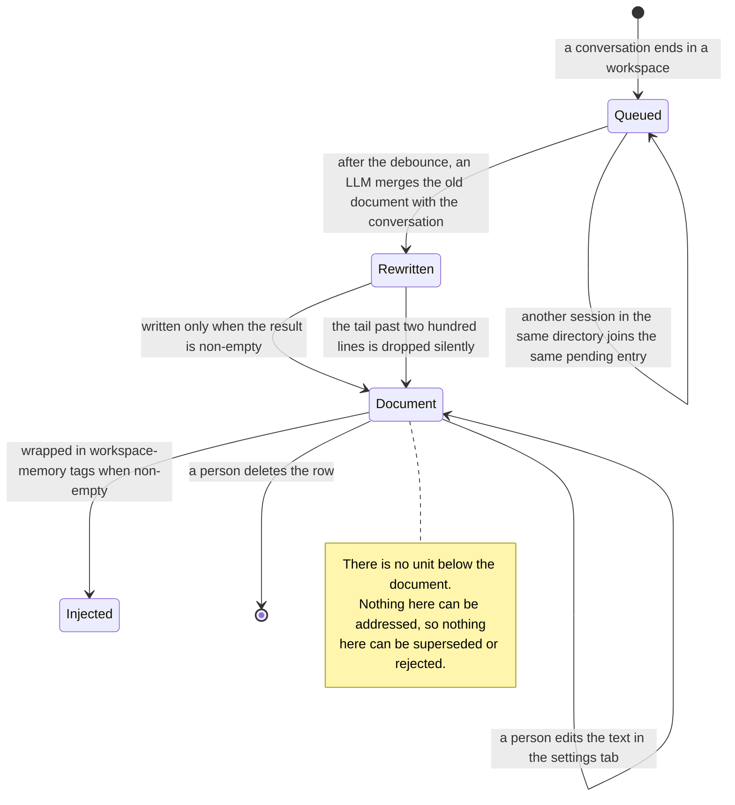

## 1. Executive Summary

OpenYak is a desktop agent platform — roughly 90,000 lines of Python on the
backend — whose memory is 859 lines and one idea: **each workspace directory gets
one plain-text document, and an LLM rewrites it after conversations.**

The model is `WorkspaceMemory`: an id, a `workspace_path` with a unique index, and
a `content` column. One row per directory, capped by the storage layer at 200
lines. There is no retrieval, no embedding, no scoring and nothing below the
document to address — the whole thing is wrapped in `<workspace-memory>` tags and
prepended to the system prompt when it is non-empty.

Three things are worth taking from it, and they are all in the update path.

**The debounce is keyed by workspace, not by session**, and the docstring says
why: *"so that concurrent sessions in the same workspace don't produce duplicate
or conflicting updates."* Two agents working in one directory collapse into a
single refresh rather than racing to overwrite each other's document. This atlas
finds a real answer to concurrent memory writes in a handful of systems; this is
one of them, and it costs a dictionary key.

**The rewrite refuses to write nothing.** Three guards in sequence: skip if no
conversation text could be extracted, skip if the LLM returned an empty response,
and write only `if new_content.strip()`. For a design whose every write destroys
the previous version, refusing the empty case is the minimum viable protection
and several systems here do not have it.

**The prompt forbids Markdown at length and the parser cleans up after it
anyway.** The instruction lists every construct to avoid — headings, bold,
italic, code, fences, links, blockquotes — and `parse_workspace_memory_response`
still strips outer code fences before storing. Instructing and then verifying is
the right order, and it is rare here.

The weaknesses follow from the same shape. **There is no floor, only a ceiling.**
An empty rewrite is refused; a three-line rewrite that replaces two hundred lines
is written without comment. [Soul of Waifu](../soul-of-waifu/) puts a length floor
on exactly this operation and is the smaller system. And the 200-line cap is
enforced by truncation — `result_lines[:MAX_WORKSPACE_MEMORY_LINES]` — so a model
that returns 250 lines loses the last fifty silently, with no marker and no log.

**And the repository ships a second, incompatible memory concept.** A bundled
plugin skill, `memory-management/SKILL.md`, describes a *"two-tier memory
system"* with *"CLAUDE.md for working memory, memory/ directory for the full
knowledge base"* — a filesystem design the backend does not implement and the
`workspace_memory` tables know nothing about. A reader who finds the skill first
will conclude the product has a knowledge base it does not have.

## 2. Mental Model

A memory is **the current state of one document about one directory**. Not a
fact, not a claim, not a row — a paragraph of plain text that is true until the
next conversation rewrites it.

That is the whole model, and its consequence is worth stating plainly: **nothing
in this system can be corrected, because nothing in it can be addressed.** There
is no id below the document, so there is no supersession, no tombstone, no trust
state and no provenance. A wrong sentence is fixed by an LLM choosing to drop it
on the next rewrite, or by a person opening the editor.

### How a thing becomes a belief

After a conversation in a workspace, `WorkspaceConversationContext` is queued —
session id, workspace path, messages, model id, timestamp. After the debounce,
the queue formats the conversation (user and assistant text only; tool calls and
intermediate results stripped, each message truncated to 2,000 characters), loads
the current document, and calls the model with `WORKSPACE_MEMORY_UPDATE_PROMPT`.

The prompt is a good specimen of the genre. It asks for information *"useful for
FUTURE sessions: project structure, conventions, decisions made, ongoing tasks,
known issues, user preferences"* and explicitly excludes conversation-specific
details, timestamps, `"user asked about X"` phrasing, temporary debugging states
and one-off commands. It tells the model to remove *"outdated or superseded
information"* — which is the only place supersession exists in this system, as an
instruction rather than a mechanism.

### How a belief stops being one

By not surviving a rewrite. That is the only automatic path: the model is asked
to preserve what is still relevant and drop what is not, and whatever it returns
becomes the document.

Beside that, a person can edit the text directly in the settings tab, or delete
the row entirely. Both are immediate and neither is recorded.

## 3. Architecture

A FastAPI backend with SQLAlchemy and a React frontend, shipped as a desktop
application. The memory subsystem is seven files under `backend/app/memory/` plus
an API module and a builtin tool.

**Persistence is one table.** `workspace_memory` with a unique index on
`workspace_path`, paths normalised before every read and write so the same
directory expressed two ways resolves to one row.

**The queue is the only moving part.** An in-process async queue with a pending
map keyed by workspace path, a debounce period, and a guard against re-entrancy
(*"already processing, skipping"*). It is not durable — a restart loses whatever
was pending, which for a memory refresh is the right trade.

**Injection is unconditional and unbudgeted** beyond the 200-line cap: if the
document is non-empty and memory is enabled, the whole thing goes into the system
prompt, wrapped in a tag. There is a test asserting it lands first.

### Deployment and ergonomics

A desktop install. The memory needs a database the app already has and a model
the app is already configured with — no vector store, no embedding provider, no
extra service.

The store is a text document with an editor in the settings tab, which makes it
the most directly repairable memory in this atlas after the file-based ones: what
the model reads is what you see, and you can fix it in place.

Apache-2.0, which after a run of source-available systems is worth saying plainly:
you can read, use, modify and redistribute this one.

## 4. Essential Implementation Paths

**Model** — `backend/app/memory/workspace_memory_model.py` (27 lines).

**Storage** — `workspace_memory_storage.py`: `_normalize_path`,
`_enforce_line_cap`, `get_workspace_memory` (`:42`, the read-path filter),
`upsert_workspace_memory`, `list_workspace_memories`, `delete_workspace_memory`.

**Update queue** — `workspace_memory_queue.py` (320 lines): the pending map, the
debounce, the re-entrancy guard, and the three write guards at `:148`, `:182` and
`:191`.

**Rewrite** — `workspace_memory_updater.py`:
`WORKSPACE_MEMORY_UPDATE_PROMPT`, `format_conversation_for_workspace_update`,
`parse_workspace_memory_response`.

**Injection** — `injection.py`: `build_workspace_memory_section`.

**API** — `backend/app/api/workspace_memory.py`: `GET /list`, `GET`, `PUT`,
`DELETE`, `POST /refresh`, `POST /export`.

**Human surface** — `frontend/src/components/settings/memory-tab.tsx`,
`frontend/src/hooks/use-workspace-memory.ts`.

**The other memory** — `backend/app/data/plugins/productivity/skills/memory-management/SKILL.md`.

## 5. Memory Data Model

Three columns and a timestamp mixin. `id` is a ULID, `workspace_path` is unique,
`content` is text defaulting to empty.

**Scope is the workspace path**, normalised and applied as the `WHERE` clause on
every read. It is the whole boundary — there is no user, agent, session or tenant
key, which is correct for a single-user desktop application and would be the
first thing to change for anything else.

**There is no provenance.** The document does not record which conversation
produced which line, which model wrote it, or when any particular sentence
entered. `TimestampMixin` gives the row a created and updated time; the content
has none.

**There is no unit below the document**, and that is the single fact that
determines everything in sections 6 through 9.

## 6. Retrieval Mechanics

There is none, and unlike [Dexto](../dexto/) — which also has none — there is not
even a filter, because there is only ever one row to fetch.

`build_workspace_memory_section` loads the document for the current workspace and
returns it wrapped in `<workspace-memory>` tags, or `None` when memory is
disabled, the workspace is empty or `"."`, or the content is blank.

The failure mode is the one every whole-document memory has: relevance is
whatever the last rewrite decided to keep. A fact that mattered three
conversations ago is present only if the model judged it worth preserving each
time in between, and nothing records that it was ever there.

## 7. Write Mechanics

**Deferred, debounced, and destructive.** The write is an LLM call that happens
after the conversation, not during it, so it costs the user no latency in the
turn — a better placement than [AgentSwarms](../agentswarms/), which awaits its
extraction inside the request.

The debounce keyed by workspace is the design's best decision. Two sessions in
one directory contribute to one refresh rather than each rewriting the document
from its own view of the conversation, which is the failure mode that makes
whole-document memory dangerous under concurrency.

**Every write is a full overwrite of the only copy.** There is no diff, no
version, no backup and no history. The previous document exists nowhere after the
`upsert` — so a bad rewrite is unrecoverable, and the only protection against one
is the non-empty check.

The `format_conversation_for_workspace_update` truncation to 2,000 characters per
message is worth noting as a quiet input bound: a long assistant answer is cut
before the model that decides what to remember ever sees the end of it.

## 8. Agent Integration

Memory reaches the model one way — the injected section — and the agent has one
builtin tool file (12 lines) beside it. The important surfaces are the API and
the settings tab.

`POST /refresh` lets a person force a regeneration rather than waiting for the
debounce, and `PUT` lets them replace the document outright. Together with the
delete dialog and the inline editor, that is a person editing the same text the
model reads — [memory as an editing surface](../../patterns/memory-as-an-editing-surface/)
rather than a viewer over a store, and the atlas's `human_review` mark.

`POST /export` exists and is the only path by which a document leaves the
database.

## 9. Reliability, Safety, and Trust

**Concurrency is handled and is the strong column.** The workspace-keyed pending
map plus the re-entrancy guard means the dangerous interleaving — two rewrites
from two stale reads — cannot happen within one process.

**There is no trust model, and the shape forbids one.** Nothing can be marked
uncertain, attributed, superseded or rejected, because there is nothing to mark.
The prompt asks the model to remove *"outdated or superseded information"*, which
places the entire correction semantics inside a sentence in a prompt.

**Prompt-injection exposure is direct.** The rewriting model reads the assistant's
own replies, so anything the agent repeated from a fetched page or a tool result
is a candidate for the durable document, and the document is injected verbatim
into every subsequent system prompt for that workspace. The prompt's exclusions
are about *relevance*, not about trust.

**Data loss is the standing risk.** A short rewrite replaces a long one, a
250-line rewrite loses fifty lines off the end, and neither event is logged or
surfaced. The fix for the first is a length floor — refuse a rewrite under some
fraction of the previous document, as Soul of Waifu does — and for the second, a
marker or a warning instead of a slice.

## 10. Tests, Evals, and Benchmarks

114 test files under `backend/tests/`, and **one of them touches memory**:
`test_session/test_prompt_assembler.py` asserts that the workspace-memory section
is placed first in the assembled prompt.

That leaves the whole update path untested. The assertions that are missing are
the ones that would catch this report's findings, and each is a few lines against
a pure function:

- `parse_workspace_memory_response` strips fences and caps at 200 lines.
- The queue does not write when the model returns an empty response.
- Two contexts for one workspace collapse to a single pending entry.
- `_normalize_path` maps two spellings of a directory to one row.

No benchmark and nothing to benchmark: with no retrieval there is no ranking to
score. I inspected these files; I did not run them.

## 11. For Your Own Build

### Steal

**Debounce by the thing being written, not by the writer.** Keying the pending
map on `workspace_path` rather than `session_id` is one line and it removes the
whole class of concurrent-rewrite bugs that whole-document memory otherwise has.
The docstring explains the choice, which is why it will survive a refactor.

**Refuse to write nothing.** Three guards — no conversation text, empty response,
empty parsed content — each one line, on a path where a write destroys the
previous version.

**Instruct and then verify.** The prompt bans Markdown in eight clauses and the
parser strips code fences anyway. Assume the model will ignore a formatting
instruction some of the time and clean up on the way in.

**Give the document an editor, not a viewer.** A `PUT`, a delete dialog and an
inline textarea over the exact text the model reads makes correction a
thirty-second job and needs no schema.

### Avoid

**Do not ship a ceiling without a floor.** Refusing an empty rewrite and
accepting a three-line one is protection against the failure that never happens
and none against the one that does. Compare the previous length to the new one
and refuse a collapse.

**Do not truncate the tail silently.** `lines[:200]` discards the end of what the
model wrote with no marker, no warning and no log line, so the document silently
loses whatever the model chose to put last — which, given the prompt asks for
sections, may be the most recent material.

**Do not ship a skill describing a memory system you did not build.** The bundled
`memory-management` skill documents a CLAUDE.md-plus-`memory/`-directory design
that no code here implements. Plugin content is documentation as far as a reader
is concerned, and two incompatible memory stories in one repository is worse than
either alone.

### Fit

This suits a single developer using the desktop app who wants each project to
carry a short, readable brief that keeps itself roughly current — and who will
open the settings tab when it drifts. Within that brief it is well judged: no
infrastructure, no retrieval to tune, a document you can read in ten seconds, and
concurrency handled properly.

It is the wrong shape for anything that must remember *facts* rather than
*context*. There is no unit to address, so there is no correction, no provenance
and no way to ask what the system believed last month — and adding any of those
means replacing the data model rather than extending it. The 200-line cap is the
honest signal of the intended scale.

## 12. Open Questions

- **How often does a rewrite lose material a user wanted?** Every refresh is a
  full regeneration with no diff and no history, so the failure is invisible by
  construction — and nothing logs the before-and-after lengths that would make it
  visible.
- **Does the 200-line truncation fire in practice?** The prompt states the limit
  and the parser enforces it; whether models respect it, and what is lost when
  they do not, is unmeasured.
- **Is the bundled memory-management skill vestigial or planned?** It describes a
  filesystem two-tier design that no backend code implements, and nothing in the
  repository reconciles the two.
- **What happens to the queue on shutdown?** The pending map is in-process, so a
  restart during a debounce window drops the refresh silently. Whether that is
  acceptable depends on how long the debounce is, which is configuration this
  report did not resolve.

## Appendix: File Index

**Model and storage** — `backend/app/memory/workspace_memory_model.py`,
`workspace_memory_storage.py`.

**Update path** — `backend/app/memory/workspace_memory_queue.py`,
`workspace_memory_updater.py`.

**Injection and config** — `backend/app/memory/injection.py`,
`backend/app/memory/config.py`.

**API** — `backend/app/api/workspace_memory.py`.

**Agent tool** — `backend/app/tool/builtin/memory.py`.

**Human surface** — `frontend/src/components/settings/memory-tab.tsx`,
`frontend/src/hooks/use-workspace-memory.ts`.

**The other memory** —
`backend/app/data/plugins/productivity/skills/memory-management/SKILL.md`.

**Tests** — `backend/tests/test_session/test_prompt_assembler.py`.

**Licence** — `LICENSE` (Apache-2.0).
