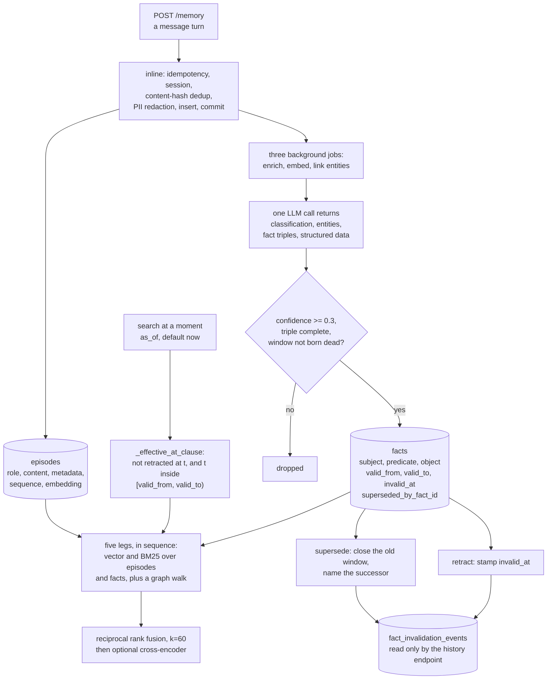

## 1. Executive Summary

OpenZync Core is the backend of a hosted agent-memory platform — AGPL-3.0 with
a commercial-licence file beside it, 562 commits between 5 June and 4 September
2026 by two authors, 72,199 lines of Python outside tests beside 89,713 lines
of tests holding 3,542 test functions. The screen found no auto-run surface,
seven build-time execution points in `conftest.py` files and a Makefile, two
unpinned surfaces and nothing inside the seven-day cooldown; nothing was
installed or run, and the read was made from a full clone. Storage is
PostgreSQL with pgvector, Redis for the job queues, and a pluggable graph
backend that defaults to FalkorDB with one graph per organisation and project.

**The memory has two units and the second one is where the design lives.** An
episode is the raw turn. A fact is what one LLM call extracted from it — a
subject, predicate and object, a confidence, and optionally a window saying
when it was true. That single call
(`workers/tasks/enrich_episode.py:316-328`, `temperature=0.0`) produces the
classification, the entities, the fact triples and the schema-driven structured
extractions together, and applies each section in its own savepoint so one bad
section does not lose the others. Facts below a confidence of 0.3 are dropped,
as are incomplete triples and windows born dead with `valid_from >= valid_to`
(`workers/tasks/extract_facts.py:33-92`).

**Validity time is real here, and it is applied through one predicate rather
than re-derived per query.** `_effective_at_clause(t)`
(`repositories/fact_repository.py:34-58`) builds the boolean expression that
says a fact is effective at `t`: not hard-retracted at `t`, and `t` inside
`[valid_from, valid_to)`. Both search legs apply it
(`services/hybrid_retriever.py:491-493`, `:597-599`), so does the point-in-time
reader and so does the project-wide reader, and an `as_of` parameter is threaded
from the route through the retriever into the graph backends. A GiST exclusion
constraint over `tstzrange(valid_from, valid_to)` enforces the non-overlap in
the database rather than trusting the application
(`migrations/versions/0024_add_temporal_exclusion_facts.py:66-80`). That earns
`bitemporal`, with one limit stated plainly: `valid_from` defaults to insert
time, so unless the extractor emits an explicit window the two axes collapse
onto each other.

Three more marks. `scope_enforced` on a project key in all four search legs
with Postgres row-level security beneath it. `audit_log` on a middleware that
enqueues a durable row for every non-exempt request. `negative_eval` on a test
that gives a superseded fact the *same embedding* as its successor, so the
superseded row must rank if the temporal filter fails, then asserts the
successor present and the predecessor absent in both the vector and the BM25 leg
(`tests/integration/test_fact_supersession.py:681-757`).

Four findings sit against the design. **A retracted fact cannot stop its own
return.** The conflict scan that runs before a write applies the same effective-at
clause (`repositories/fact_repository.py:571`), and the database-level guard is
scoped to live rows too (`0024:78`, `WHERE (invalid_at IS NULL)`), so a triple
someone retracted is invisible to the check that would have caught it coming
back, and it is simply inserted again. The `fact_invalidation_events` table
records why each fact died and is read by exactly one function, which serves a
history endpoint. **The organisation key is missing from the search SQL.** All
four legs filter on `project_id`; the retriever is constructed with `org_id` and
spends it on a Prometheus label. Isolation is real — a route guard above and
RLS below — but not in the query. **The cross-tenant tests do not run.** Every
test in `tests/security/test_cross_tenant.py` sits under a class-level skip, and
CI runs only the unit and integration directories. **Two documented things are
not there:** `episodes.token_count` is described in the model, returned to every
client and written by no code, and the community summaries the README places in
the assembled context are a hardcoded empty list in the retriever
(`services/hybrid_retriever.py:281`).

## 2. Mental Model

A memory is **a triple with a life**. The turn that produced it is kept, but the
thing retrieval ranks and filters is the extracted fact: subject, predicate,
object, and a window saying when that was so.

A fact stops being true in one of two ways, and the schema keeps them apart. It
can be **superseded** — a newer fact about the same subject and predicate closes
the old one's window with `valid_to = now` and names its successor — or it can
be **retracted**, which stamps `invalid_at` and is a claim about the record
rather than about the world. Both leave the row in place with its text intact,
and both are recorded as an event with a kind.

Retrieval is a question asked at a moment. The default moment is now, and a
caller can name another; every leg then asks which facts were effective then.
Nothing is scored on trust — the confidence the extractor assigned is used once,
at write time, to drop the weakest facts, and never consulted again.



## 3. Architecture

A FastAPI monolith in layers that are kept honest: `routers/` (thirty modules)
hold the endpoints, `services/` the business logic, `repositories/` every piece
of database access, `models/` the SQLAlchemy tables. `packages/` holds the
swappable parts — the graph backends, the reranker, the community algorithms.
`workers/tasks/` and `services/worker/` are two task trees registered into one
ARQ worker.

Sizes: `services` 18,265 lines, `packages` 9,354, `repositories` 7,088,
`core` 7,062, `routers` 6,844, `workers` 6,319, `migrations` 4,702 across 54
revisions, `schemas` 4,648, `middleware` 2,570, `models` 2,304.

The graph backend isolates tenants physically rather than by predicate: one
graph per organisation and project, keyed
`f"openzync_{org_id}_{project_id}"` (`packages/graph_backend/falkordb.py:171-172`).

### Deployment and ergonomics

- **What has to run:** PostgreSQL with three extensions, Redis, an ARQ worker,
  and a model endpoint for enrichment. FalkorDB for the graph, or SurrealDB.
  Compose and Helm charts ship, with OpenBao for secrets and a Grafana stack.
- **Fully local and offline:** no. The enrichment path needs a model, and
  without it a stored episode never becomes a fact.
- **Hand-repairable:** the store is Postgres with 54 migrations and JSON
  columns; the graph is rebuildable from it.
- **Install:** Compose for development, Helm for a cluster, with a bootstrap
  script that creates a migrator role owning the tables and an application role
  with CRUD only.

## 4. Essential Implementation Paths

- **Store a turn.** `services/memory_service.py:127` `ingest()` runs inline and
  numbered: idempotency key (`:184-186`), session resolve (`:207-208`),
  content-hash dedup (`:224-232`) with a race-safe claim into `ingest_dedup`
  (`:251-258`), sequence number (`:285`), PII detection and redaction
  (`:299-313`), batch insert (`:319-320`), blob upload (`:337-341`), commit
  (`:352`), enqueue (`:364`).
- **Extract.** `workers/tasks/enrich_episode.py:99-110` runs one LLM call
  (`:316-328`) returning every section at once and applies them in independent
  savepoints (`:121-127`), each flipping a bit in an enrichment bitmask
  (`workers/tasks/base.py:44-52`). `workers/tasks/extract_facts.py:39-117`
  drops facts under the 0.3 confidence floor (`:33`, `:58`), incomplete triples
  (`:66`) and windows where `valid_from >= valid_to` (`:81-92`), then resolves
  subject and object against known graph entities (`:120-172`).
- **Filter by time.** `repositories/fact_repository.py:34-58` is the one
  predicate. Its docstring names the trap it exists for: supersession closes a
  window rather than setting `invalid_at`, *"so filtering only on `invalid_at IS
  NULL` would let superseded facts leak into queries."*
- **Search.** `services/hybrid_retriever.py:86` runs five legs sequentially
  (`:149-228`), aborting the whole search if any fails (`:103-105`); the query
  is embedded once and shared (`:147`). Fusion is `_rrf_merge` (`:682-736`) with
  `RRF_K = 60`, applied to episodes and facts separately (`:234-242`) while
  entities bypass it (`:244-245`). An optional cross-encoder reranks afterwards
  (`:248-256`).
- **Supersede or retract.** `repositories/fact_repository.py:593` writes
  `valid_to = now` on the predecessor, called from
  `services/fact_invalidation_service.py:430`, `:471`, `:694`; the retract route
  is `routers/facts.py:191-241`. Both append to `fact_invalidation_events`
  (`repositories/fact_repository.py:676`), whose only reader is
  `get_fact_history` (`:719-744`).
- **Audit.** `middleware/audit.py:333-344` enqueues one job per non-exempt
  request; `services/worker/tasks/audit_log.py:72` and
  `services/audit_log_service.py:70` write the row.
- **Scope.** `dependencies/project_auth.py:34` gates the routes;
  `dependencies/db.py:73-83` sets `app.org_id` per request and each worker sets
  it per job; the RLS policies were created in the initial migration
  (`0001_initial_schema.py:266-316`) and extended to the graph tables in `0020`
  and `0025`.

## 5. Memory Data Model

An **episode** (`models/episode.py:25-123`): id, organisation, project, session,
user, role, content, metadata, embedding, `token_count`, sequence number, an
enrichment status bitmask, a soft-delete flag, and record timestamps.

A **fact** (`models/fact.py:26-153`): id, project, user, organisation — the last
carrying a comment that its integrity is *"application-enforced, not
DB-enforced"* (`:79-82`) — content, subject, predicate, object with their types
and optional entity ids, confidence, source episode, `valid_from`, `valid_to`,
`invalid_at`, `superseded_by_fact_id`, embedding and `embedded_at`.

A **fact invalidation event** (`models/fact_invalidation_event.py:25-99`) with a
CHECK restricting its kind to superseded, retracted, llm_invalidated or
time_expired (`0048:126-130`).

**Temporal:** two axes, kept apart and both read. `bitemporal` earned.

**Trust:** a confidence float, used once at extraction and never on a read.
`trust_state` withheld.

**Scoping:** organisation and project columns, RLS policies, route guards.
`scope_enforced` earned.

**Tombstone:** withheld — see section 9.

**A column with no writer.** `episodes.token_count` is documented in the model
as the message's approximate token count (`:38`), declared with a server
default of 0 in the migration (`0001:114`), and returned to every API consumer
(`schemas/mappers.py:93`). The insert names ten columns and that is not one of
them (`repositories/episode_repository.py:102-107`); it appears in the
statement only inside the `RETURNING` list (`:111`), read straight back out at
`:133`. `rg -n "UPDATE episodes"` finds nine statements and none touches it.
Every episode reports zero.

## 6. Retrieval Mechanics

Five legs, run one after another rather than concurrently, and a failure in any
one raises rather than degrading — the code is explicit that a partial result is
not offered. Vector legs use pgvector's cosine distance operator scored as
`1 - distance`; BM25 legs use `plainto_tsquery` with `ts_rank`; the graph leg
fans out over every configured backend, dedups by entity id, sorts by distance
and truncates at fifty.

Fusion is reciprocal rank at `k = 60`, and the interesting choice is that
episodes and facts are fused in separate pools while entities skip fusion
entirely — so the raw turn and the extracted claim compete within their own kind
rather than against each other.

**There is no relevance threshold anywhere on the read path.** The only cutoffs
are a result limit, the graph walk's fifty, and the reranker's top-k and top-n.
The single numeric threshold in the fact pipeline is the 0.3 confidence floor at
extraction time, and while `confidence` is selected into every result row it is
never used to rank or filter.

**Failure modes.** A stalled enrichment leaves an episode with no facts, which a
cron job reconciles. An embedding that never lands leaves a row invisible to the
vector legs, which filter on a non-empty embedding. And a fact whose window the
extractor did not set is effective from the moment it was written, which is the
right default and erases the distinction the schema exists to draw.

## 7. Write Mechanics

**The turn is stored before anything is understood.** Persistence, dedup and PII
redaction are inline and synchronous; extraction, embedding and entity linking
are jobs. That ordering is the right one — a model outage costs facts, not
turns.

**One call, four sections, four savepoints.** Classification, entities, facts
and structured extractions come back together and are applied independently, so
a malformed entity list does not cost the facts beside it. Each success flips a
bit in the episode's enrichment mask, which is what the reconciliation cron
reads.

**Correction is a new row.** Nothing edits a fact's text. Supersession closes
the predecessor's window and names the successor; retraction stamps
`invalid_at`. Both write an event naming the kind.

**What the write path does not do** is consult the dead. The conflict scan that
looks for facts to supersede applies the effective-at clause
(`repositories/fact_repository.py:569-571`), so it sees only live rows.

### Operational cost

- A write is one transaction plus three enqueues; no model call.
- Enrichment is one LLM call per episode at up to 8,192 output tokens.
- A search is five sequential database round trips plus one embedding, and an
  optional cross-encoder pass.

## 8. Agent Integration

The surface is HTTP: thirty routers covering memory, search, context, facts,
sessions, graph, schemas, webhooks and audit. Context assembly
(`services/context_service.py:124`) caches on the organisation, project, query
and as-of instant, then calls hybrid search.

The README's feature list names an MCP server twice. It is not in this
repository — every `mcp` token in the Python is a `must-change-password` JWT
claim — and the commercial-licence file places it in a separate repository
alongside the SDK, the frontend and the docs. The one interface here is a
Streamlit chat client.

## 9. Reliability, Safety, and Trust

**Bitemporal — awarded.** Validity and record time are separate columns, one
predicate applies validity on every read path, an as-of parameter reaches the
graph backends, and a GiST exclusion constraint enforces non-overlap in the
database. The predicate's own docstring explains why filtering on `invalid_at`
alone would be wrong, which is the kind of comment that survives a refactor.

**Scope — awarded, with the gap named.** A project column on every search leg, a
membership dependency on every route, and RLS policies on eleven tables driven
by a per-request session setting that workers set too. What the search SQL does
not carry is the organisation key: the retriever holds it and uses it for a
metrics label. Two repository methods make the asymmetry visible — the BM25
searches filter on the organisation while their vector siblings take no
organisation parameter at all (`repositories/fact_repository.py:1180-1181`
against `:1114`; `repositories/episode_repository.py:485` against `:434`) —
though both vector methods are dead code with no production caller.

**Audit log — awarded.** Every non-exempt request produces a durable row with
actor, action, resource and trace id, written by a worker so the request does
not pay for it, into a model documented as append-only and deliberately without
an `updated_at`. The entity-merge worker writes a second kind with before and
after.

**Negative evaluation — awarded, and the test is better than most here.**
Giving the superseded fact the same embedding as its successor removes the
possibility that the assertion passes because the row ranked badly. It must rank;
the filter is what keeps it out. Both legs are asserted, with the successor's
presence in the same block.

**Tombstone — withheld, and the near-miss is precise.** Everything needed is
present: a retraction that keeps the row, a `superseded_by_fact_id` naming the
successor, and a `fact_invalidation_events` table recording why each fact died
with a constrained kind. What is missing is a consultation. The conflict scan
that runs before a write filters to live facts, the database's exclusion
constraint carries `WHERE (invalid_at IS NULL)`, and the invalidation events are
read by one function serving a history endpoint. Retract a fact and re-assert
the identical triple and nothing objects.

**Trust state — withheld.** A confidence float, thresholded once at extraction
and never read on a retrieval path. There is no status on a fact or an episode;
the only constrained status vocabulary in the schema belongs to organisation
lifecycle. The `is_merged` flag on graph entities *is* applied as a read filter,
but it is a deduplication marker rather than a candidate-verified-rejected
ladder.

**Human review — withheld.** The only adjudication over memory content is the
retract endpoint, reachable by any credential with project write including an
API key. The one interface in the tree is a chat client; the admin dashboard the
README advertises is a separate repository.

**What is not covered.** `tests/security/test_cross_tenant.py` holds seven cases
under a class-level `@pytest.mark.skip`, and CI runs only the unit and
integration directories, so that file is never collected. The live cross-tenant
assertion that does run covers extraction schemas rather than memory. Given
that the search SQL leaves the organisation key to RLS, this is the gap worth
closing first.

## 10. Tests, Evals, and Benchmarks

3,542 test functions in 271 files and 89,713 lines, against 72,199 lines of
source: 3,150 unit, 364 integration, 14 in `tests/evals/`, 7 in
`tests/security/`, 5 end-to-end, one benchmark. The integration suite runs
against a real Postgres through testcontainers and is the one that carries the
temporal work.

`tests/evals/` measures **extraction quality only** — classification accuracy at
or above 0.85, entity type accuracy and recall at 0.80, structured extraction at
0.85, PII detection at 1.0 with regex rules — against committed golden files.
Three of the five need a live model, all are gated behind a `--run-eval` flag,
and no results are committed. Nothing in it measures retrieval.

A LongMemEval harness exists (`tests/benchmarks/test_longmemeval.py`) and cannot
run from this tree: it wants a live instance, a model judge, and a dataset
directory that is not in the repository. `benchmarks/results/` contains a
`.gitkeep`.

Two suites are dead. The end-to-end tests call routes that no longer exist —
they use a user-prefixed path for memory, sessions and search, and all three
moved under a project prefix — and they request a fixture their own conftest
declines to export. And the coverage configuration names a package that is not
in the tree, so coverage as configured measures nothing.

## 11. For Your Own Build

### Steal

- **Write the temporal predicate once and make every read path import it.** The
  failure this prevents is subtle and common: supersession that closes a window
  is invisible to a filter that only checks a retraction flag, and a per-query
  hand-rolled predicate will get that wrong somewhere.
- **Put the exclusion constraint in the database.** A GiST constraint over the
  validity range means an overlapping window is a write error rather than a
  ranking anomaly nobody notices.
- **Thread the as-of parameter all the way down**, including into the graph
  backend. A point-in-time query that is honest in SQL and approximate in the
  graph is worse than not having one.
- **Store the turn before you understand it.** Inline persistence with
  background extraction means a model outage costs facts, not conversations.
- **Apply each section of a multi-part extraction in its own savepoint**, so a
  malformed entity list does not cost the facts that parsed.
- **Give the excluded row the same embedding as the included one in your
  exclusion test.** Otherwise the test passes when ranking happens to bury it,
  and you learn nothing about the filter.

### Avoid

- **A retraction the write path cannot see.** Recording why a fact died and then
  scanning only live facts before the next write means the retraction informs a
  history endpoint and nothing else.
- **A scope key that lives in the route guard and the database but not the
  query.** Two of the three layers here are real; the missing one is the layer a
  reader inspecting the SQL would check.
- **Skipping the isolation suite.** Seven cross-tenant tests under a class-level
  skip, in a directory CI does not run, is the same as not having them.
- **Returning a column nothing writes.** Every episode reports a token count of
  zero to every client.

### Fit

Right for a team building a hosted memory where *when was this true* is a real
question and the answer has to survive being asked about the past. The temporal
work is the strongest part and it is done properly, from the shared predicate
down to the database constraint. Wrong if you need correction that prevents
re-assertion, any notion of a claim's standing beyond a float, a review surface,
or a system that runs without a model.

## 12. Open Questions

- Will the conflict scan ever see the dead? Dropping the effective-at clause
  from that one query, or checking the invalidation events beside it, is what
  separates a history endpoint from a tombstone.
- Will the organisation key reach the search SQL? RLS covers it today, and the
  two vector repository methods that omit the key while their BM25 siblings
  carry it suggest the asymmetry is an oversight rather than a decision.
- What unskips the cross-tenant suite? It needs a real database and three
  seeded organisations, which the integration suite already provisions.
- Is the confidence float worth keeping? It is computed by the model,
  thresholded once, carried on every row and returned in every result, and no
  read path consults it.

## Appendix: File Index

| Path | What it holds |
| --- | --- |
| `models/fact.py` | The fact table: the triple, `valid_from`/`valid_to` (122-127), `invalid_at` (128), `superseded_by_fact_id` (131) |
| `models/episode.py` | The turn: content, embedding, enrichment mask, `token_count` (87) |
| `models/fact_invalidation_event.py` | The death record and its constrained kind |
| `repositories/fact_repository.py` | `_effective_at_clause` (34-58), the conflict scan (569-571), supersession (593), the event write (676), `get_fact_history` (719-744) |
| `services/hybrid_retriever.py` | Five legs (149-228), the temporal filters (491-493, 597-599), `_rrf_merge` (682-736), the community placeholder (281) |
| `services/memory_service.py` | Inline ingest (127-364) and the three enqueues (659-672) |
| `workers/tasks/enrich_episode.py` | The single LLM call (316-328) and the savepoint sections (121-127) |
| `workers/tasks/extract_facts.py` | The 0.3 floor (33), the filters (39-117), entity resolution (120-172) |
| `middleware/audit.py` | The per-request audit enqueue (333-344) |
| `dependencies/db.py`, `dependencies/project_auth.py` | The RLS session setting (73-83) and the membership guard (34) |
| `migrations/versions/0001_initial_schema.py` | The tables and the RLS policies (266-316) |
| `migrations/versions/0024_add_temporal_exclusion_facts.py` | The GiST exclusion constraint (66-80) |
| `packages/graph_backend/falkordb.py` | One graph per organisation and project (171-172) |
| `tests/integration/test_fact_supersession.py` | The negative eval (681-757) |
| `tests/` | 3,542 test functions in 271 files, 89,713 lines |

**Searches recorded for the negative claims**

```sh
rg -i 'tombstone' .                                        # none
rg -i 'trust_state|verification_status|is_verified|needs_review' .   # none: no status on a memory
rg -i 'human_review|approve_fact|adjudicate' .             # none
rg -n 'token_count\s*=' --glob '*.py' .                    # 2: a RETURNING read-back and a test stub; no writer
rg -n 'UPDATE episodes' --glob '*.py' .                    # 9 statements, none touching token_count
rg -n 'search_by_vector' --glob '*.py' .                   # 2 definitions and their own tests; no production caller
rg -l -i 'mcp' --glob '*.py' .                             # every hit is the must-change-password JWT claim
rg -i 'FORCE ROW LEVEL SECURITY' .                         # none: the app role's RLS depends on table ownership
```

## History

**2026-09-08** — [`cf05de752d903d84c2a56802418bda1e311bb7f2`](https://github.com/openzync/openzync-core/commit/cf05de752d903d84c2a56802418bda1e311bb7f2) — first reading, at the head of `main`, four days after the last commit. Screened before anything was read: no auto-run surface, seven build-time execution points in `conftest.py` files and a Makefile, two unpinned surfaces, nothing inside the seven-day cooldown; nothing was installed or run, and the read was made from a full clone. Four marks. `bitemporal` rests on one shared predicate rather than on the columns: `_effective_at_clause` is applied by both search legs, the point-in-time reader and the project reader, with a database-level exclusion constraint under it. `scope_enforced` rests on a project key in all four search legs plus row-level security, with the organisation key's absence from that SQL stated in section 9. `audit_log` rests on a per-request enqueue into an append-only table. `negative_eval` rests on a case that gives the superseded row the same embedding as its successor so ranking cannot do the filter's work. `tombstone`, `trust_state` and `human_review` were each examined and withheld, the first with its near-miss in section 9. The reading covers the fact model, the temporal machinery, the ingest and enrichment pipeline, the hybrid retriever and the tenancy layers; the graph backends, the community algorithms, the webhook and blob subsystems and the thirty routers beyond memory, search, facts and audit were treated as context.
