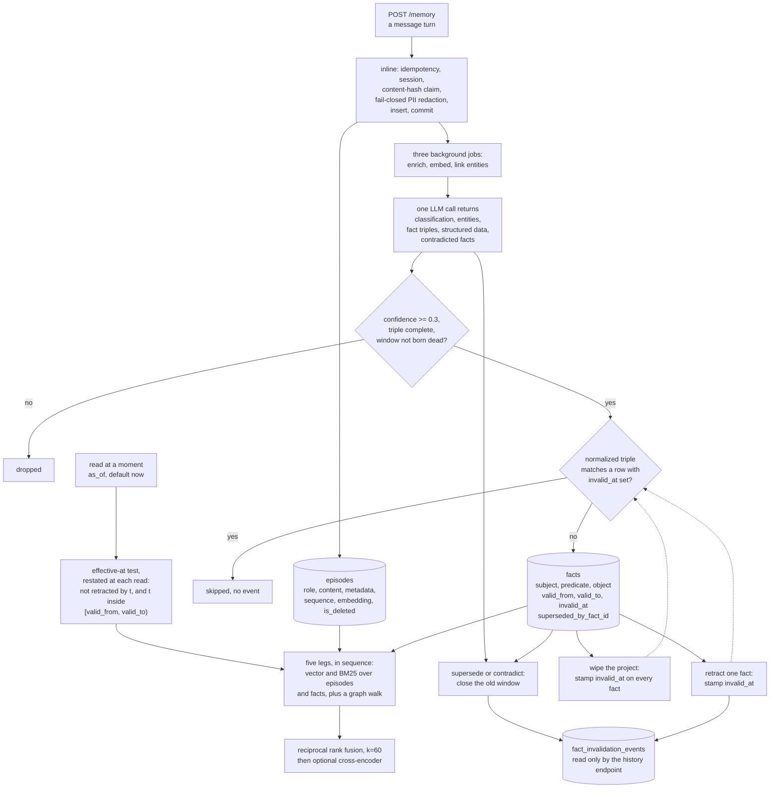

## 1. Executive Summary

OpenZync Core is the backend of a hosted agent-memory platform: a FastAPI
service over PostgreSQL with pgvector, an ARQ worker, and a pluggable graph
backend that defaults to FalkorDB. One LLM call per turn extracts fact triples
that carry a validity window, every fact search and listing filters on that
window at a chosen instant, and a retracted triple is refused when it is said
again. The weak side is deletion: the project wipe stamps the retraction column
on every fact, so wiped facts stay readable through an earlier `as_of` and every
wiped triple joins the refusal list.

The code is AGPL-3.0 with a commercial dual-licence file beside it. The screen
found no auto-run surface, nine build-time execution points (eight `conftest.py`
files and a Makefile), two unpinned surfaces, and `pyproject.toml` and
`requirements.txt` inside the seven-day cooldown. Nothing was installed, built
or run, and the read was made from a full clone.

**The memory has two units and the second one is where the design lives.** An
episode is the raw turn. A fact is what one LLM call extracted from it — a
subject, predicate and object, a confidence, and optionally a window saying
when it was true. That call (`workers/tasks/enrich_episode.py:366-376`,
`temperature=0.0`) returns the classification, the entities, the fact triples,
the structured extractions and a list of contradicted facts together. Each
section is applied in its own savepoint, so one bad section does not lose the
others. Facts below a confidence of 0.3 are dropped, as are incomplete triples
and windows born dead with `valid_from >= valid_to`
(`workers/tasks/extract_facts.py:39-117`).

**Validity time is tested on every fact search and listing.** A fact is
effective at `t` when it is not retracted at `t` and `t` lies inside
`[valid_from, valid_to)`. Both fact search legs apply that test
(`services/hybrid_retriever.py:546-549`, `:658-661`), as do the point-in-time
and project readers, the session listing, the prompt renderer's fact context and
the write path's conflict scan. An `as_of` instant travels from the context and
fact-listing routes through the retriever into the graph backends. That earns
`bitemporal`, with two limits. `valid_from` defaults to insert time, so without
an extracted window the two axes coincide. And the test is restated rather than
shared: `_effective_at_clause` (`repositories/fact_repository.py:49-74`) serves
three repository methods, and both search legs and five other readers write the
same three clauses inline. They agree at this commit, and nothing makes them
agree.

A GiST exclusion constraint over `tstzrange(valid_from, valid_to)` backs the
application in the database, over a narrower key than its name suggests: the
same triple within one source episode, among rows not retracted
(`migrations/versions/0024_add_temporal_exclusion_facts.py:66-80`). Overlapping
windows for one triple asserted by two episodes are legal.

Four more marks. `scope_enforced` rests on a project key in all four SQL search
legs, a per-project graph, and a membership guard on every route. `audit_log`
rests on a middleware that enqueues a durable row for every mutating request.
`negative_eval` rests on a test that gives a superseded fact the *same
embedding* as its successor, so the superseded row must rank if the filter
fails, then asserts it absent from the vector and the BM25 leg
(`tests/integration/test_fact_supersession.py:686-777`). And `tombstone`:
before either insert path writes, `find_retracted_by_match_keys`
(`repositories/fact_repository.py:592-648`) fetches the rows whose `invalid_at`
is set, keyed on normalized subject, predicate and object, and a match skips the
write (`services/fact_invalidation_service.py:448-465`, `:504-521`).

**A retraction stops its own return and a supersession does not, and the code
draws that line on purpose.** The conflict scan applies the effective-at test
and sees only live rows, so a triple closed by supersession is inserted again.
The comment above the tombstone fetch states the boundary: *"Superseded/expired-only
rows (invalid_at NULL) never match — re-assertion after supersession still
inserts."*

**The project wipe is a retraction of everything.** `DELETE
/v1/projects/{id}/memory` soft-deletes the episodes and stamps `invalid_at` on
every fact in the project (`repositories/fact_repository.py:1036-1058`), the
column the tombstone gate reads. Every triple the project held becomes a refusal
key: a user who wipes their memory and then says the same thing again has the
turn stored and the fact refused. The stamp is also time-scoped: a fact listing or context request with an
`as_of` before the wipe returns the wiped facts, because the effective-at test
asks whether a fact was retracted *by* `t`. No test covers either consequence.

**The search SQL carries the project key and not the organisation key.** The
four SQL legs filter on `project_id` alone (`services/hybrid_retriever.py:487`,
`:546`, `:605`, `:658`); the retriever holds the organisation for a metrics
label and the graph leg. Project ids are UUIDs behind a membership guard, so the
project filter is itself a tenant boundary. The organisation-keyed row-level
security under it binds only a role that does not own the tables. The
tag-deploy workflow migrates with the same `OZ_DATABASE_URL` the API serves on
(`.github/workflows/cd.yml:191-193`), and the comment above the session setup
records the application role as owner with `rls_forced = false`
(`dependencies/db.py:75-81`).

**The cross-tenant suite runs in one of the two CI pipelines.**
`TestCrossTenantIsolation` holds eight cases, the strongest a search leakage
test with a positive control. The GitLab pipeline in the tree runs
`pytest tests/security/` (`.gitlab-ci.yml:159`); the GitHub Actions workflow
collects `tests/unit/` and `tests/integration/` only. **Two documented things
are not there:** `episodes.token_count` is returned to every client and written
by no code, and the context formatter's community section is always handed an
empty list (`services/hybrid_retriever.py:352`).

## 2. Mental Model

A memory is **a triple with a life**. The turn that produced it is kept, but the
thing retrieval ranks and filters is the extracted fact: subject, predicate,
object, and a window saying when that was so.

A fact stops being true in one of three ways. It can be **superseded**: the same
normalized triple asserted again with different content closes the old window
with `valid_to = now` and names the successor. It can be **contradicted**: the
extraction call lists existing facts the new turn contradicts, and each is
closed the same way whatever its object. Or it can be **retracted**, which
stamps `invalid_at` and is a claim about the record rather than about the world.
All three leave the row and its text in place and append an event with a kind.
Only a retraction blocks the triple from coming back.

Retrieval is a question asked at a moment. The default moment is now, and a
caller can name another; every fact search then asks which facts were effective
then. Nothing is scored on trust — the confidence the extractor assigned drops
the weakest facts at write time, and no retrieval leg consults it.


```mermaid
%% caption: a turn is stored inline and enqueues one LLM call that returns entities, fact triples, structured data and contradicted facts; every fact search applies the same effective-at test at a chosen moment; supersession and contradiction close a window, retraction stamps invalid_at, and the retracted set is checked before every insert, which the project wipe fills with every fact
flowchart TB
    TURN["POST /memory<br/>a message turn"]
    INLINE["inline: idempotency, session,<br/>content-hash claim,<br/>fail-closed PII redaction,<br/>insert, commit"]
    EP[("episodes<br/>role, content, metadata,<br/>sequence, embedding, is_deleted")]
    JOB["three background jobs:<br/>enrich, embed, link entities"]
    LLM["one LLM call returns<br/>classification, entities,<br/>fact triples, structured data,<br/>contradicted facts"]
    FILT{"confidence &gt;= 0.3,<br/>triple complete,<br/>window not born dead?"}
    DROP["dropped"]
    TOMB{"normalized triple<br/>matches a row with<br/>invalid_at set?"}
    SKIP["skipped, no event"]
    FACT[("facts<br/>subject, predicate, object<br/>valid_from, valid_to, invalid_at<br/>superseded_by_fact_id")]
    SUP["supersede or contradict:<br/>close the old window"]
    RET["retract one fact:<br/>stamp invalid_at"]
    WIPE["wipe the project:<br/>stamp invalid_at on every fact"]
    EV[("fact_invalidation_events<br/>read only by the history endpoint")]
    Q["read at a moment<br/>as_of, default now"]
    EFF["effective-at test,<br/>restated at each read:<br/>not retracted by t, and t inside<br/>[valid_from, valid_to)"]
    LEGS["five legs, in sequence:<br/>vector and BM25 over episodes<br/>and facts, plus a graph walk"]
    RRF["reciprocal rank fusion, k=60<br/>then optional cross-encoder"]

    TURN --> INLINE
    INLINE --> EP
    INLINE --> JOB
    JOB --> LLM
    LLM --> FILT
    FILT -- no --> DROP
    FILT -- yes --> TOMB
    TOMB -- yes --> SKIP
    TOMB -- no --> FACT
    LLM --> SUP
    FACT --> SUP
    FACT --> RET
    FACT --> WIPE
    SUP --> EV
    RET --> EV
    RET -.-> TOMB
    WIPE -.-> TOMB
    Q --> EFF
    EFF --> LEGS
    EP --> LEGS
    FACT --> LEGS
    LEGS --> RRF
```

## 3. Architecture

A FastAPI monolith in layers that are kept honest: `routers/` (thirty-one
modules) hold the endpoints, `services/` the business logic, `repositories/`
the database access, `models/` the SQLAlchemy tables. `packages/` holds the
swappable parts — the graph backends, the reranker, the community algorithms.
`workers/tasks/` and `services/worker/` are two task trees registered into one
ARQ worker. The read side has exceptions to the layering: the hybrid retriever,
the prompt renderer and the observation service issue their own SQL against
`facts`.

Sizes: `services` 20,374 lines, `packages` 10,474, `repositories` 8,452,
`routers` 8,090, `core` 7,756, `workers` 6,813, `migrations` 5,491 across 62
revisions, `schemas` 5,138, `middleware` 2,574, `models` 2,471.

The graph backend isolates tenants physically rather than by predicate: one
graph per organisation and project, keyed
`f"openzync_{org_id}_{project_id}"` (`packages/graph_backend/falkordb.py:258-267`).

### Deployment and ergonomics

- **What has to run:** PostgreSQL with three extensions, Redis, an ARQ worker,
  and a model endpoint for enrichment. FalkorDB for the graph, or SurrealDB.
  Compose and Helm charts ship, with OpenBao for secrets and a Grafana stack.
- **Fully local and offline:** no. The enrichment path needs a model, and
  without it a stored episode never becomes a fact. PII redaction is fail-closed
  on OpenBao: when the redaction policy cannot be fetched, the ingest returns
  503 and stores nothing (`services/memory_service.py:734-792`).
- **Hand-repairable:** the store is Postgres with 62 migrations and JSON
  columns; the graph is rebuildable from it.
- **Install:** Compose for development, Helm for a cluster. The Compose
  `local-db` profile creates a migrator role that owns the schema and an
  application role with CRUD grants only (`scripts/init_postgres.sh:121-168`).
  The tag-deploy workflow runs `alembic upgrade head` with the database URL the
  API reads, so there one role owns the tables and serves requests.

## 4. Essential Implementation Paths

- **Store a turn.** `services/memory_service.py:170` `ingest()` runs inline and
  numbered: archived-project check (`:239`), idempotency key (`:250`), session
  resolve (`:273`), a content-hash claim that is the only dedup gate (`:325`),
  fail-closed PII redaction (`:432`), sequence numbers under a session row lock
  (`:455`), batch insert (`:465`), blob upload (`:499`), commit (`:514`) and
  three enqueues per episode (`:911-921`).
- **Extract.** `workers/tasks/enrich_episode.py` runs one LLM call (`:366-376`)
  returning every section at once and applies each in its own savepoint
  (`:438`, `:459`, `:507`, `:625`), flipping a bit in an enrichment bitmask
  (`workers/tasks/base.py:44-51`). `workers/tasks/extract_facts.py:39-117`
  drops facts under the 0.3 floor (`:33`, `:58`), incomplete triples (`:66`)
  and born-dead windows (`:81`), then resolves subject and object against known
  graph entities (`:120-183`).
- **Filter by time.** `repositories/fact_repository.py:49-74` is the predicate
  as a SQLAlchemy expression. Its docstring names the trap it exists for:
  supersession closes a window rather than setting `invalid_at`, *"so filtering
  only on `invalid_at IS NULL` would let superseded facts leak into queries."*
  The same test appears as SQL text in the vector fact leg
  (`services/hybrid_retriever.py:546-549`), the session listing
  (`repositories/fact_repository.py:1148-1150`), the prompt renderer
  (`services/worker/prompt_renderer.py:679-681`) and the observation service
  (`services/observation_service.py:904-906`).
- **Search.** `services/hybrid_retriever.py:89` runs five legs sequentially
  (`:171-268`), raising if any fails; the query is embedded once and shared
  (`:154`). Fusion is `_rrf_merge` (`:745-800`) at `RRF_K = 60`, applied to
  episodes and facts separately (`:278-288`) while entities bypass it (`:289`).
  An optional cross-encoder reranks afterwards (`:313-341`).
- **Supersede, contradict or retract.** Supersession closes a window at
  `services/fact_invalidation_service.py:467` and `:524`; the LLM contradiction
  pass at `:747`, gated per organisation and on by default
  (`workers/tasks/enrich_episode.py:401-407`). Retraction is
  `POST /facts/{id}/retract` (`routers/facts.py:203-256`), stamping `invalid_at`
  at `services/fact_service.py:348`. All three append to
  `fact_invalidation_events` (`repositories/fact_repository.py:718-760`), whose
  only reader is `get_fact_history` (`:761-848`).
- **Wipe.** `services/memory_service.py:586-651` checks that the body echoes the
  project id, soft-deletes episodes and facts (`:620-621`) and writes a
  `memory.wipe` audit row (`:635-649`).
- **Audit.** `middleware/audit.py:333-345` enqueues one job per request that is
  not a GET, an OPTIONS or an exempt path (`:243`);
  `services/worker/tasks/audit_log.py:71` writes the row.
- **Scope.** `dependencies/project_auth.py:34` gates the routes;
  `dependencies/db.py:94-100` sets `app.org_id` per request and each worker sets
  it per job; the RLS policies were created in the initial migration
  (`0001_initial_schema.py:266-278`) and extended to later tables.

## 5. Memory Data Model

An **episode** (`models/episode.py:28-147`): id, organisation, project,
session, user, role, content, metadata, a 768-dimension embedding,
`token_count`, sequence number, an enrichment status bitmask, a soft-delete
flag, and record timestamps. A partial unique index keeps sequence numbers
unique per session among live rows (`:131-140`).

A **fact** (`models/fact.py:26-164`): id, project, user, organisation — the last
carrying a comment that its integrity is *"application-enforced, not
DB-enforced"* (`:80-81`) — content, subject, predicate, object with their types
and optional entity ids, confidence, source episode, `valid_from`, `valid_to`,
`invalid_at` (`:122-130`), `superseded_by_fact_id`, embedding and `embedded_at`.

A **fact invalidation event** (`models/fact_invalidation_event.py:25-105`) with a
CHECK restricting its kind to superseded, retracted, llm_invalidated or
time_expired (`0048:126-130`). No code writes `time_expired`.

**Temporal:** two axes, kept apart and both read. `bitemporal` earned.

**Trust:** a confidence float, used once at extraction and offered as a sort key
on the fact listings (`repositories/fact_repository.py:33-46`); no retrieval
leg reads it. `trust_state` withheld.

**Scoping:** organisation and project columns, route guards, per-project
graphs, and RLS policies whose reach depends on the database role.
`scope_enforced` earned.

**Tombstone:** earned — see section 9.

**A column with no writer.** `episodes.token_count` is documented in the model
as the message's approximate token count (`:42`), declared with a server default
of 0 in the migration (`0001:114`), and returned to every API consumer
(`schemas/mappers.py:92`). The insert names ten columns and that is not one of
them (`repositories/episode_repository.py:124-127`); it appears in the statement
only inside the `RETURNING` list (`:131`), read straight back at `:153`. Every
episode reports zero.

## 6. Retrieval Mechanics

Five legs, run one after another rather than concurrently, and a failure in any
one raises rather than degrading — the code is explicit that a partial result is
not offered. Vector legs use pgvector's cosine distance operator scored as
`1 - distance`; BM25 legs use `plainto_tsquery` with `ts_rank`; the graph leg
fans out over every configured backend, dedups by entity id, sorts by distance
and truncates at fifty.

Fusion is reciprocal rank at `k = 60`, and the interesting choice is that
episodes and facts are fused in separate pools while entities skip fusion
entirely — so the raw turn and the extracted claim compete within their own kind
rather than against each other.

**There is no relevance threshold anywhere on the read path.** The only cutoffs
are a result limit, the graph walk's fifty, and the reranker's top-k and top-n.
The single numeric threshold in the fact pipeline is the 0.3 confidence floor at
extraction time. `confidence` is selected into every result row and is a sort
key on the fact listings; no search leg ranks or filters on it.

**Failure modes.** A stalled enrichment leaves an episode with no facts, which a
cron job reconciles. An embedding that never lands leaves a row invisible to the
vector legs, which require one; migration `0054` nulled every embedding that was
not 768 dimensions and left those rows to the reconcile pass. And a fact whose
window the extractor did not set is effective from the moment it was written,
which is the right default and erases the distinction the schema exists to draw.

## 7. Write Mechanics

**The turn is stored before anything is understood.** Persistence, dedup and PII
redaction are inline and synchronous; extraction, embedding and entity linking
are jobs. A model outage costs facts, not turns. A redaction outage costs turns:
content with no known redaction policy is refused with 503 rather than stored.

**One call, four sections, four savepoints.** Classification, entities, facts
and structured extractions come back together and are applied independently, so
a malformed entity list does not cost the facts beside it. The contradiction
list is applied inside the facts savepoint, so a failure rolls back the facts
and the invalidations together. Each success flips a bit in the episode's
enrichment mask, which is what the reconciliation cron reads.

**Correction is a new row.** Nothing edits a fact's text. The deterministic path
supersedes only on the same normalized subject, predicate *and* object with
different content (`services/fact_invalidation_service.py:937-983`). A new
object for the same subject and predicate closes the old fact only if the LLM
lists it as contradicted.

**What the write path consults.** The conflict scan applies the effective-at
test (`repositories/fact_repository.py:582-590`), so it sees only live rows. The
retracted set is fetched separately and consulted before either insert path, so
of the closed rows only those with `invalid_at` set speak.

**The wipe writes into that set.** `soft_delete_by_project` stamps `invalid_at`
on every fact in the project not yet retracted
(`repositories/fact_repository.py:1036-1058`), and `find_retracted_by_match_keys`
selects on `invalid_at IS NOT NULL` alone (`:644`). So the wipe turns every
triple the project held, superseded ones included, into a tombstone, and writes
no invalidation event for any of them. The content-hash claim table is
append-only and the wipe leaves it alone, so an identical batch resent to the
same session is answered as already ingested. Nothing purges the soft-deleted
rows: the route's docstring promises a hard purge after 30 days, and the one
purge in the tree is a TODO for user deletion (`services/user_service.py:498`).

Until [`f8c5acd0775301d3b1d2efab344e0eb83f59d47c`](https://github.com/openzync/openzync-core/commit/f8c5acd0775301d3b1d2efab344e0eb83f59d47c)
on 29 September 2026, the wipe did not persist under uvicorn. The route returned
`None` on a 204, uvicorn rejected the serialised `null` body, and the session
teardown rolled the wipe back, in the fix's own account
(`routers/memory.py:235-238`).

### Operational cost

- A write is one transaction plus three enqueues; no model call.
- Enrichment is one LLM call per episode at up to 8,192 output tokens.
- A search is five sequential database round trips plus one embedding, and an
  optional cross-encoder pass.

## 8. Agent Integration

The surface is HTTP: thirty-one router modules covering memory, search, context,
facts, sessions, graph, schemas, webhooks, audit and LLM usage. Context assembly
(`services/context_service.py:124`) caches on the organisation, project, query
and as-of instant, then calls hybrid search with that instant (`:215-216`).

The README's feature list names an MCP server twice. It is not in this
repository — every `mcp` token in the Python is a `must-change-password` JWT
claim — and the commercial-licence file places it in a separate repository
alongside the SDK, the frontend and the docs. The one interface here is a
Streamlit chat client.

## 9. Reliability, Safety, and Trust

**Bitemporal — awarded.** Validity and record time are separate columns, every
fact search and listing applies the effective-at test, an as-of parameter
reaches the graph backends, and a GiST exclusion constraint forbids overlapping
windows for one triple within one episode. The predicate's docstring explains
why filtering on `invalid_at` alone would be wrong. The explanation lives in one
place and the test in eight: `_effective_at_clause` and its three importers,
the BM25 fact leg rebuilding it in SQLAlchemy
(`services/hybrid_retriever.py:658-661`), and six sites writing it as SQL text.

**Scope — awarded on the project key.** A project column in every search leg, a
per-project graph, and a membership dependency on every route. What the search
SQL does not carry is the organisation key: the retriever holds it for a metrics
label and the graph leg. All four repository search methods filter on the
organisation (`repositories/fact_repository.py:1227`, `:1288`;
`repositories/episode_repository.py:445`, `:498`), and none is on the search
path. The two vector methods have no production caller, and the BM25 pair feeds
only the enrichment prompt (`services/worker/prompt_renderer.py:398`, `:445`).

**Row-level security fails closed where it applies, and whether it applies is a
deployment property.** The policy reads `current_setting('app.bypass_rls', true)
= 'true' OR organization_id = current_setting('app.org_id')::UUID`
(`migrations/versions/0001_initial_schema.py:276-277`). An unset `app.org_id`
raises rather than returning rows, and `dependencies/db.py:94-100` sets both
settings transaction-locally. No migration forces RLS, so the table owner
bypasses it. The `local-db` profile keeps ownership with a migrator role; the
tag-deploy workflow does not, and the session setup's comment relies on the
owner bypass for signup.

**Audit log — awarded.** Every mutating request produces a durable row with
actor, action, resource and trace id, written by a worker so the request does
not pay for it, into a model documented as append-only and deliberately without
an `updated_at`. GET requests are not audited. The wipe and the entity merge
write their own rows.

**Negative evaluation — awarded, and the test is better than most here.**
Giving the superseded fact the same embedding as its successor removes the
possibility that the assertion passes because the row ranked badly. It must
rank; the filter is what keeps it out. Both legs are asserted, with the
successor's presence in the same block. The cross-tenant search case adds a
scope-boundary assertion with a positive control first
(`tests/security/test_cross_tenant.py:367`).

**Tombstone — earned, on a gate narrower than the retraction machinery around
it.** A retraction keeps the row, `superseded_by_fact_id` names a successor, and
`fact_invalidation_events` records why each fact died. The consultation is what
earns the mark: `find_retracted_by_match_keys` pulls the rows whose `invalid_at`
is set, `_name_identity_of_fact` keys them on the normalized
`(subject, predicate, object)`, and both insert paths test an incoming entry
against that set. A match skips the row and emits no event.

Four committed cases hold it, and the fourth is what makes the other three mean
something. Re-asserting the same triple is skipped
(`tests/integration/test_fact_supersession.py:1215`). A **case variant** whose
content differs is skipped too, and the docstring says the content was chosen so
the skip cannot come from the identical-content path (`:1269`). Two mocked unit
cases follow: a tombstone beats a live row
(`tests/unit/test_fact_invalidation_service.py:1542`), and when neither matches
the insert happens (`:1585`), the control that stops the gate passing by
refusing everything. The wipe is a second producer of the same state, and no
test covers what it does to the gate.

**Trust state — withheld.** A confidence float, thresholded once at extraction
and never read by a retrieval leg. There is no status on a fact or an episode;
the only constrained status vocabulary in the schema belongs to organisation
lifecycle. The `is_merged` flag on the Postgres graph backend's entities is a
read filter, but it is a deduplication marker rather than a
candidate-verified-rejected ladder.

**Human review — withheld.** The only adjudication over memory content is the
retract endpoint, which requires the same `project:write` permission as the
write routes, so the credential that writes can retract. The one interface in
the tree is a chat client; the admin dashboard the README advertises is a
separate repository.

**What is not covered.** No test asserts what the wipe does to the tombstone
gate or to `as_of` reads; the wipe test counts episodes and not facts. The
cross-tenant search case runs as the `postgres` superuser in testcontainers, so
it exercises the project filter and the route guard, not RLS.

## 10. Tests, Evals, and Benchmarks

3,673 test functions: 3,234 unit, 410 integration, 14 in `tests/evals/`, 8 in
`tests/security/`, 5 end-to-end, one benchmark and one at the root. The
integration suite runs against a real Postgres through testcontainers and is the
one that carries the temporal work. GitHub Actions runs unit and integration on
pull requests into `master` (`.github/workflows/ci.yml:143`, `:201`). The GitLab
pipeline runs those and `tests/security/` (`.gitlab-ci.yml:159`); the
repository does not show whether a GitLab instance executes it.

`tests/evals/` measures **extraction quality only** — classification accuracy at
or above 0.85, entity type accuracy and recall at 0.80, structured extraction at
0.85, PII detection at 1.0 with regex rules — against committed golden files.
Three of the five need a live model, all are gated behind a `--run-eval` flag,
and no results are committed. Nothing in it measures retrieval.

A LongMemEval harness exists (`tests/benchmarks/test_longmemeval.py`) and cannot
run from this tree: it wants a live instance, a model judge, and a dataset
directory that is not in the repository. `benchmarks/results/` contains a
`.gitkeep`, and the benchmark workflow was deleted on 21 September 2026.

One suite is dead: the end-to-end tests call `/v1/users/{user_id}/memory`,
`/sessions` and `/search`, and all three live under a project prefix
(`routers/memory.py:51`). The coverage `source` in `pyproject.toml` names an
`openzync` package that is not in the tree. The CI invocations pass `--cov=` per
directory, so the CI figure is real, and a bare `pytest --cov` measures nothing.

Three fixes in this history say how a defect passed a green suite, and they
share a cause. The wipe test asserted the wipe over httpx's ASGI transport,
while uvicorn rejected the `null` body on the 204 and rolled the wipe back
(`tests/integration/conftest.py:574-580`). The mypy step
sat after ruff in one job, so a ruff failure meant it never ran, and the
workflow comment records 599 type errors unseen. The Docker images installed an
unpinned extra while CI installed the frozen requirements, so the API
crash-looped on a SQLAlchemy release CI had never run. Each time, what the suite
exercised was not what shipped.

## 11. For Your Own Build

### Steal

- **Write the temporal predicate once and import it at every read.** The failure
  this prevents is subtle and common: supersession that closes a window is
  invisible to a filter that checks only a retraction flag. This repository has
  the shared expression and three importers; its other readers restate it,
  which is the drift a shared version exists to stop.
- **Put an exclusion constraint in the database**, and key it as widely as the
  invariant you mean. A GiST constraint over the validity range turns an
  overlapping window into a write error; keyed per episode, it guards only
  within one episode.
- **Thread the as-of parameter all the way down**, including into the graph
  backend. A point-in-time query that is honest in SQL and approximate in the
  graph is worse than not having one.
- **Store the turn before you understand it.** Inline persistence with
  background extraction means a model outage costs facts, not conversations.
- **Apply each section of a multi-part extraction in its own savepoint**, so a
  malformed entity list does not cost the facts that parsed.
- **Give the excluded row the same embedding as the included one in your
  exclusion test.** Otherwise the test passes when ranking happens to bury it,
  and you learn nothing about the filter.

### Avoid

- **One column for "the user rejected this" and "the user deleted everything".**
  A tombstone keyed on the retraction stamp turns a wipe into a list of things
  the system will not learn again, and a time-scoped stamp leaves the wiped
  facts one `as_of` away.
- **Two CI pipelines that disagree about what runs.** The cross-tenant suite is
  collected by one and not the other, and nothing in the test file shows it.
- **A scope key that lives in the route guard and the database but not the
  query**, when the database layer depends on which role owns the tables.
- **A test client laxer than the server.** The wipe passed its test and did not
  persist in deployment.
- **Returning a column nothing writes.** Every episode reports a token count of
  zero to every client.

### Fit

Right for a team building a hosted memory where *when was this true* is a real
question and the answer has to survive being asked about the past. The temporal
work is the strongest part and it is done carefully, from the effective-at test
down to the as-of graph walk. Wrong if you need a deletion that removes content,
correction that refuses a superseded value, any notion of a claim's standing
beyond a float, a review surface, or a system that runs without a model.

## 12. Open Questions

- Is the wipe meant to be a retraction? It stamps the column the tombstone gate
  reads and the as-of filter treats as time-scoped, so a wiped project refuses
  its old triples and returns them to an earlier `as_of`.
- Will a *superseded* triple ever be refused on re-assertion? The retracted set
  is consulted and the superseded set is not, which the code states as a choice
  rather than an omission.
- Do the vector legs use the HNSW indexes migration `0054` created? They order
  by a computed score expression rather than by `embedding <=> :q`, the form a
  pgvector index serves; no query plan was run for this reading.
- Is the confidence float worth keeping? It is computed by the model,
  thresholded once, carried on every row and offered as a sort key, and no
  retrieval leg consults it.

## Appendix: File Index

| Path | What it holds |
| --- | --- |
| `models/fact.py` | The fact table: the triple, `valid_from`/`valid_to`/`invalid_at` (122-130), `superseded_by_fact_id` (131) |
| `models/episode.py` | The turn: content, embedding, enrichment mask, `token_count` (95) |
| `models/fact_invalidation_event.py` | The death record and its constrained kind |
| `repositories/fact_repository.py` | `_effective_at_clause` (49-74), the conflict scan (531-590), the tombstone fetch (592-648), `set_valid_to` (650), `set_invalid_at` (669), the event write (718-760), `get_fact_history` (761-848), the point-in-time reader (884-966), the project wipe (1036-1058), the session listing (1061-1226) |
| `services/fact_invalidation_service.py` | Supersession identity (29-40), the tombstone scan (387-404) and skips (448-465, 504-521), LLM invalidations (636-760), `_candidate_conflicts` (937-983) |
| `services/hybrid_retriever.py` | Five legs (171-268), the fact leg filters (546-549, 658-661), the graph leg (671-744), `_rrf_merge` (745-800), the community placeholder (352) |
| `services/memory_service.py` | Inline ingest (170-584), the enqueues (911-921), the wipe (586-651) |
| `workers/tasks/enrich_episode.py` | The single LLM call (366-376), the invalidation gate (401-407), the savepoint sections (435-640) |
| `workers/tasks/extract_facts.py` | The 0.3 floor (33), the filters (39-117), entity resolution (120-183) |
| `middleware/audit.py` | The GET and OPTIONS skip (243) and the per-request enqueue (333-345) |
| `dependencies/db.py`, `dependencies/project_auth.py` | The owner-bypass comment (75-81), the RLS session setting (94-100) and the membership guard (34) |
| `migrations/versions/0001_initial_schema.py` | The tables and the RLS policies (266-278) |
| `migrations/versions/0024_add_temporal_exclusion_facts.py` | The GiST exclusion constraint, per source episode (66-80) |
| `packages/graph_backend/falkordb.py` | One graph per organisation and project (258-267) |
| `tests/integration/test_fact_supersession.py` | The negative eval (686-777), org scoping (841), the tombstone cases (1205-1338) |
| `tests/security/test_cross_tenant.py` | Eight cross-tenant cases; the search leakage case (367) |
| `.gitlab-ci.yml`, `.github/workflows/ci.yml` | The pipeline that runs `tests/security/` (159) and the one that does not |

**Searches recorded for the negative claims**

```sh
rg -l -i 'tombstone' .                                     # 4 files: the gate, its repository fetch and two test files
rg -i 'trust_state|verification_status|is_verified|needs_review' .   # none: no status on a memory
rg -n -i "'(pending|candidate|verified|unverified|rejected|approved|disputed)'" --glob '*.py' models migrations   # organisation lifecycle only
rg -i 'human_review|approve_fact|adjudicate' .             # none
rg -n 'token_count' --glob '*.py' . | rg -v '^\./tests/'   # model, migration, schema, mapper, RETURNING and read-back; no writer
rg -n '_effective_at_clause' --glob '*.py' . | rg -v '^\./tests/'    # one definition, three repository callers, one comment
rg -n 'search_by_vector|search_by_bm25' --glob '*.py' . | rg -v '^\./tests/'   # 4 definitions; callers: prompt_renderer BM25 only
rg -n 'soft_delete_by_project' --glob '*.py' . | rg -v '^\./tests/'  # 2 definitions; one caller, the wipe
rg -n 'llm_invalidated|time_expired' --glob '*.py' . | rg -v '^\./(tests|migrations)/'   # llm_invalidated written once; time_expired never
rg -n -i 'purge' --glob '*.py' workers services routers | rg -v -i 'cache|context'   # the wipe route's docstring, a Phase 2 stub in user_service.py, a queue docstring; no purge task
rg -n 'tests/security' .github Makefile .gitlab-ci.yml     # .gitlab-ci.yml only
rg -l -i 'mcp' --glob '*.py' .                             # every hit is the must-change-password JWT claim
rg -i 'FORCE ROW LEVEL SECURITY' .                         # none: the table owner bypasses RLS
rg -l -i 'wipe' $(rg -l -i 'tombstone|as_of' tests)       # none: no test combines the wipe with the gate or an as_of read
rg -n 'confidence' services/hybrid_retriever.py packages/reranker   # selected into rows; no ORDER BY or WHERE on it
rg -n 'log_action' --glob '*.py' workers services         # the audit worker, the wipe and the entity merge
rg -n -i 'values\(.*content|SET content' --glob '*.py' repositories services workers   # none: no fact text is edited
rg -n 'UPDATE audit_logs|DELETE FROM audit_logs|update\(AuditLog|delete\(AuditLog' --glob '*.py' .   # none
```

## History

**2026-09-30** — [`17cea04bdebac1ff7a0c78c2f0b0139bc0bd2d03`](https://github.com/openzync/openzync-core/commit/17cea04bdebac1ff7a0c78c2f0b0139bc0bd2d03) — 57 commits on, 193 files. Screened before reading: no auto-run surface, nine build-time execution points, two unpinned surfaces, `pyproject.toml` and `requirements.txt` inside the cooldown; nothing installed, built or run. No mark moved. Since [`f8c5acd0775301d3b1d2efab344e0eb83f59d47c`](https://github.com/openzync/openzync-core/commit/f8c5acd0775301d3b1d2efab344e0eb83f59d47c) the project wipe persists; it stamps `invalid_at` on every fact, so each wiped triple is a tombstone and stays readable to an earlier `as_of` ([section 7](#7-write-mechanics)). Five published claims overstated the system at the previous pin: the search legs restate the effective-at test rather than import it; no repository search method is on the search path, and the vector pair already took `org_id`; RLS binds only a non-owner role; the GiST constraint is per episode; GET requests are not audited. One understated it: `.gitlab-ci.yml` runs `tests/security/`. Census added.

**2026-09-17** — [`da95554bd9989fdf50858816a0b79bbdd275c816`](https://github.com/openzync/openzync-core/commit/da95554bd9989fdf50858816a0b79bbdd275c816) — re-read 29 commits on, 290 files and +5,226/-1,907. **Marks move from four to five: `tombstone` is earned.** The first finding recorded against this design was that a retracted fact could not stop its own return, and the project closed it. `find_retracted_by_match_keys` fetches rows whose `invalid_at` is set, `_name_identity_of_fact` keys them on the normalized `(subject, predicate, object)`, and both insert paths test an incoming entry against that set before writing — a match skips the row, logs `fact_invalidation.tombstone_skip` and emits no supersession event. It is keyed on the value rather than the row, which is what the mark asks for.

The gate is deliberately narrower than the machinery around it, and the code says so rather than leaving it to be inferred: *"Superseded/expired-only rows (invalid_at NULL) never match — re-assertion after supersession still inserts."* So the risk survives in a sharper form — supersession does not refuse a re-assertion — and section 12's open question is rewritten to ask about that rather than about the dead in general. Four committed cases hold the gate, and the fourth is what makes the others mean something: the same triple skipped, a case variant skipped with the test's own docstring explaining that its content was chosen so the skip cannot come from the identical-content path, a tombstone beating a live row, and — the control — neither matching, insert happens.

The isolation finding is half closed and got stranger. `TestCrossTenantIsolation` carried a class-level `@pytest.mark.skip(reason="Requires real DB + 3 seeded organizations")`; commit `ce40f9f` added the three org fixtures and removed the skip, and the class holds eight cases. `.github/workflows/ci.yml` still invokes only `pytest tests/unit/` and `pytest tests/unit/ tests/integration/`, and no job names `tests/security/` — so the suite is runnable and uncollected, a narrower gap than a skip and a harder one to see, because nothing in the test file shows it.

Eighteen line anchors moved and are corrected against this commit; one was resolved by inferring an offset and then re-checked against the file, which put it two lines from where the inference had it. `dependencies/project_auth.py`, `services/audit_log_service.py`, `models/audit_log.py` and the audit middleware's enqueue at `middleware/audit.py:333-344` are byte-identical or unmoved, so the `audit_log` evidence stands as written. The bitemporal predicate is unchanged and gained a comment separating supersession from retraction. Screened again before reading: no auto-run surface, eight build-time execution surfaces, two unpinned surfaces, one dependency file inside the seven-day cooldown. Nothing was installed and nothing was run.

**2026-09-13** — re-read at the same commit; `cf05de752d903d84c2a56802418bda1e311bb7f2` is still the repository head, so nothing upstream has moved and `analyzed_at` is unchanged. Both of the report's first two findings hold, and **one of them was published wider than the code supports.**

*"The organisation key is missing from the search SQL. All four legs filter on `project_id`"* was wrong. Both BM25 legs take an `org_id` argument and compile `AND organization_id = :org_id` (`repositories/fact_repository.py:1180-1181`, `repositories/episode_repository.py:484-485`); the graph leg selects a per-tenant graph keyed on the organisation; and the conflict scan on the write path filters `Fact.organization_id` at `:569`. The key is absent from exactly two methods — `search_by_vector` in each repository, which take no organisation parameter at all, so a caller could not pass one. The report's own section 12 had this right while section 1 did not, which is the worse direction: a reader meets section 1 first. Section 1, the `scope_enforced` record and the risks line are corrected to the narrower claim.

Two things were added rather than corrected. The row-level security beneath the SQL **fails closed**: the policy reads `current_setting('app.org_id')` without `missing_ok`, so a session where the GUC was never set raises instead of returning rows, and `dependencies/db.py:73-83` writes both settings transaction-locally, so a pooled connection cannot carry one request's organisation into the next. And the skipped suite is the adjacent unasserted case for exactly this gap: `TestCrossTenantIsolation` carries a class-level skip at `tests/security/test_cross_tenant.py:50` and no CI job names that directory, while the conflict scan's organisation isolation *is* covered by a case in `tests/integration/`, which CI does run. The retraction finding is unchanged and its open question stays open.

**2026-09-08** — [`cf05de752d903d84c2a56802418bda1e311bb7f2`](https://github.com/openzync/openzync-core/commit/cf05de752d903d84c2a56802418bda1e311bb7f2) — first reading, at the head of `main`, four days after the last commit. Screened before anything was read: no auto-run surface, seven build-time execution points in `conftest.py` files and a Makefile, two unpinned surfaces, nothing inside the seven-day cooldown; nothing was installed or run, and the read was made from a full clone. Four marks. `bitemporal` rests on one shared predicate rather than on the columns: `_effective_at_clause` is applied by both search legs, the point-in-time reader and the project reader, with a database-level exclusion constraint under it. `scope_enforced` rests on a project key in all four search legs plus row-level security, with the organisation key's absence from that SQL stated in section 9. `audit_log` rests on a per-request enqueue into an append-only table. `negative_eval` rests on a case that gives the superseded row the same embedding as its successor so ranking cannot do the filter's work. `tombstone`, `trust_state` and `human_review` were each examined and withheld, the first with its near-miss in section 9. The reading covers the fact model, the temporal machinery, the ingest and enrichment pipeline, the hybrid retriever and the tenancy layers; the graph backends, the community algorithms, the webhook and blob subsystems and the thirty routers beyond memory, search, facts and audit were treated as context.
