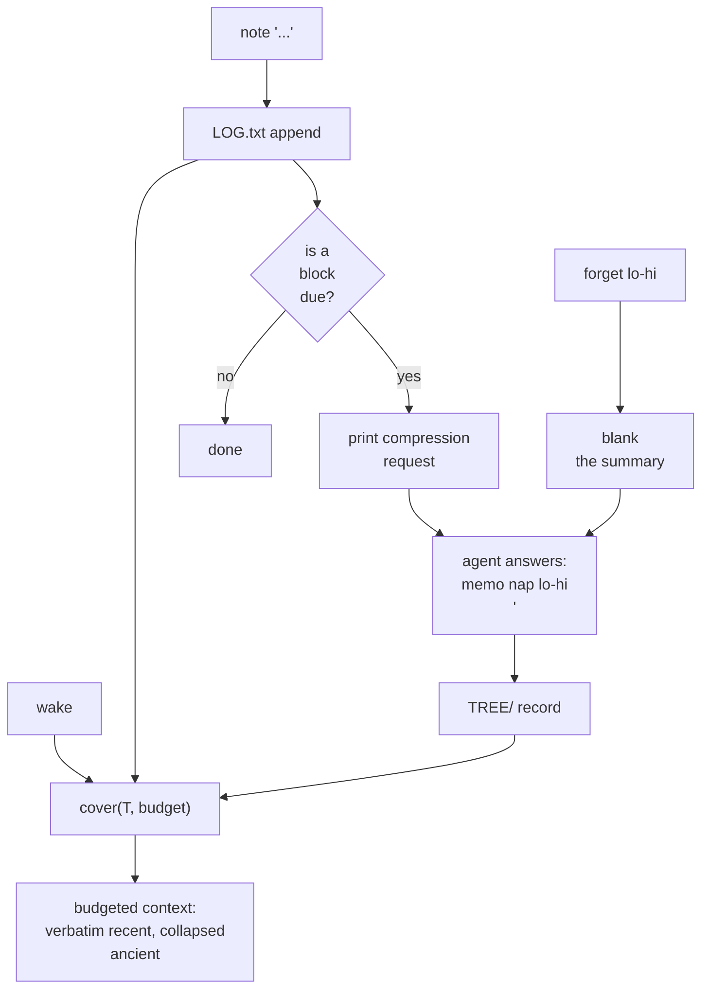

## 1. Executive Summary

> **Licence: none.** There is no `LICENSE` file in this repository, so all
> rights are reserved by default and the code cannot be reused. This atlas
> normally skips unlicensed repositories for that reason. It is reviewed here as
> an exception, because its mechanisms are worth reading — the
> exception is about *reading* it, not about using it. Ask the author
> before adopting anything below.

OptMem is about 860 lines of dependency-free Python in a single file called
`memo`, plus a 426-token prompt block you paste into `AGENTS.md` or `CLAUDE.md`.
That is the whole integration. Its commands are `wake`, `note`, `nap`, `recall`,
`zoom`, `forget`, `config`.

It is small and opinionated, and three positions define it.

**Nothing ever runs in the background.** Not "a queue you can disable" — there
is no background path at all. When `note` appends a memory and a compression
becomes due, the compression is *printed in the output of `note`* for the agent
to answer before its next action. Consolidation is a turn the agent already had
to take, rather than a job that rewrites memory while nobody is watching.

**Detail decays by geometry rather than by policy.** Memories form a binary merge
tree over an append-only log, and `wake` prints a *cover* of that tree chosen to
fit a line budget:

```python
def cover(T, budget):
    """The blocks `memo wake` prints: at most `budget` of them, finest near T.

    Detail decays with age, so recent memories stay verbatim and ancient ones
    collapse. If everything fits, nothing is compressed at all."""
```

The tuning knob is a single `alpha`, binary-searched so that a block "stays whole
iff its size is at most `alpha` times its age". Nothing scores importance,
nothing embeds, nothing ranks. Recency wins because older material is
structurally coarser, and the last clause is the good part: **if everything
fits, nothing is compressed at all.**

**Position is identity.** Records are fixed width, so there is no index:

> "memory `i` lives at `i*LOG_REC` of `LOG.txt`, and block `[k*s,(k+1)*s)` lives
> at `k*TREE_REC` of `TREE/<s>`. Padding costs ~2x on disk and buys O(1)
> everywhere."

The README states the resulting numbers — a million memories is 608 MB and `wake`
takes 0.03s — a committed **storage footprint and recall latency at scale**, the
two metrics the [benchmarks page](../../benchmarks/) finds projects rarely
publish.

Reservations beyond the licence: there is no scope, no trust state, no
correction of a recorded memory, and no multi-user story. `forget` drops a
*summary*, not a memory. The log is append-only in the strong sense — it is never
edited — which is a feature for auditability and means a wrong memory stays
wrong forever.

## 2. Mental Model

```text
~/.optmem/
  memo          one file of Python 3, no dependencies
  memory/
    LOG.txt     every memory, one per line, append-only, never edited
    TREE/       the summaries: a cache, rebuildable from the log alone
    config      the sizes

LOG.txt   #0 #1 #2 #3 #4 #5 #6 #7 ...        fixed-width records
TREE/2    [0,2) [2,4) [4,6) [6,8)            each one line
TREE/4    [0,4)       [4,8)
TREE/8    [0,8)

wake  ──▶ cover(T, budget): coarse blocks for old memories,
          verbatim records for recent ones, at most `budget` lines

note  ──▶ append; if a block is now due, PRINT the compression request
nap   ──▶ the agent answers it: one line, ≤ ENTRY_CHARS
forget ─▶ drop a summary; the next nap rebuilds it from the log
```

## 3. Architecture

One file. The parts worth naming:

- `cover` / `_cover` — the budgeted tile of the merge tree.
- `pending` / `pending_count` — which blocks are due, "one stat per level, never
  a scan".
- `nap_prompt` / `next_nap` — the compression request handed to the agent.
- `log_*` / `tree_*` — fixed-width record access by offset.
- `repair`, `parse`, `records` — tolerance for partial writes.



## 4. Essential Implementation Paths

### Consolidation with no scheduler

Consolidation usually runs in a worker, a cron, a queue, or a hook — and pays
for it. The
[benchmarks page](../../benchmarks/) names *write-to-readable lag* as a metric
nobody measures, and the [recoverable background work](../../patterns/recoverable-background-work/)
pattern exists because background passes lose data when they fail.

OptMem's answer is to have no background. `note` appends and then, if a block has
come due, prints the compression request as part of its own output; the prompt
instructs the agent to answer it "before your next action". Write-to-readable lag
is zero because there is no asynchronous step, and there is no queue to drain,
retry, monitor, or lose.

What it costs is honest: the agent pays for consolidation in its own turn, and a
compression is only as good as the model that happens to be running. What it buys
is that **no process can change your memory while you are not looking**.

`pending_count` deserves note for a detail most such loops get wrong: levels are
clamped at zero, because "a level can hold MORE blocks than T needs — T is a
snapshot, and memories keep arriving while an agent reads".

### The cover, and why it is not a ranker

`_cover(T, alpha)` tiles `[0,T)` with aligned power-of-two blocks, keeping a
block whole "iff its size is at most `alpha` times its age". `cover(T, budget)`
binary-searches `alpha` over sixty iterations to hit a line budget, then spends
any leftover budget by splitting the *newest* remaining block, "where detail is
worth most".

This is a retrieval policy with no query in it. It answers "what should the agent
see at session start", not "what matches this question" — and for a memory whose
whole purpose is orientation rather than lookup, that is the right question.
Compare [GenericAgent](../genericagent/), which reaches a similar place through a
hand-written ROI rule, and [Hermes Agent](../hermes-agent/), which freezes a
budgeted block into the prompt. OptMem gets there with a closed-form geometry and
one constant.

The atlas's [decay and reinforcement](../../patterns/decay-and-reinforcement/)
pattern warns that decay is usually a tuning surface nothing validates. Here
there is nothing to tune per memory kind: age determines resolution, and the only
parameter is how many lines you are willing to read.

### An append-only log that is genuinely never edited

`LOG.txt` is described as "every memory, one per line, append-only, never
edited", and `TREE/` as "a cache, rebuildable from the log alone". `recall`
searches "every memory ever recorded, word for word".

That is [evidence before belief](../../patterns/evidence-before-belief/) in its
purest form: the derived layer
cannot corrupt the evidence, because the code never writes to the evidence except
by appending. `WAKE_LINES` is explicitly "a reading budget, not a storage budget:
change it whenever, in either direction, and nothing is recomputed".

### `forget` corrects the summary, not the memory

`memo forget <lo>-<hi>` "drop[s] a bad summary; the next nap rebuilds it". This
is the only correction verb, and it operates on the derived layer.

That is a coherent position rather than an oversight — if the log is the evidence
and the tree is a projection, then a bad compression is a projection bug and the
fix is to recompute it. It also means OptMem has *no* way to correct a memory
itself: a wrong `note` is in the log forever, and will keep being folded into
every summary above it. The system has an unusually strong answer to "can I trust
what I read" and no answer at all to "what if what I recorded was wrong".

### Failure handling in a file format

Several small decisions treat partial writes as normal:

- A blank half-block is diagnosed rather than propagated — `nap_prompt` dies with
  the exact command to run: "The summary of #a-b is blank. Run: `memo forget
  a-b`", because "pending() lists a block only after its halves settled, so a
  missing half is a blank record — a corrupt write."
- `repair` drops a torn trailing record before the next append, so a crash
  mid-write cannot misalign every later record; `test.py` writes half a record
  and checks the next `note` lands whole with the expected id.
- Ids are assigned inside a cross-process lock (`fcntl.flock`, or `msvcrt` on
  Windows); the tests start sixteen `note` processes at once and require ids
  `#0`–`#15` with no collision.
- The store is "UTF-8 by construction, so the tool reads and prints UTF-8 no
  matter what the machine's locale says. Without this, one arrow in a memory
  makes wake crash on a latin-1 locale."

An error message that contains the command that fixes it is a small thing;
[MemPalace](../mempalace/)'s repair tooling does the same.

### Transport limits are a first-class concern

> "Every harness truncates a command that prints too much, and each drops a
> different piece: Claude Code cuts the middle at 30,000 chars, pi cuts the head
> at 50 KB, Codex budgets 10,000 tokens. So the memory is handed over in parts
> that fit all of them. These are transport limits, not memory limits."

The design starts from the fact that the *harness* silently truncates
tool output, that each one truncates a different region, and that a memory block
sized for a token budget can therefore arrive with its middle missing. For a
design whose entire delivery mechanism is "print a lot of text at session start",
that is the difference between working and appearing to work.

Related, and equally practical: "After `curl | sh` nothing is on PATH, so a bare
`memo nap 0-1 '...'` would not [run]: the tool names itself." Every printed
command is emitted with the path that will actually execute.

## 5. Memory Data Model

One line, at most 280 bytes of UTF-8, fixed width (a 320-byte record), addressed
by position. Each record carries its id and the date of the `note`; there are no
tags, no type, no source, no scope and no status.

The prompt does the work a schema would elsewhere: it tells the agent to record
"a task worth real effort, a fact or insight the user teaches you, anything you
learn about their life (even indirectly), any event of lasting effect", and "Do
not register redundant memories."

What is absent is trust state,
provenance, scope, supersession, tombstones, contradiction handling. The
compression prompt carries the only epistemic instruction in the system: "Keep
what has lasting effect, drop what does not. **Invent nothing.**"

## 6. Retrieval Mechanics

Two paths. `wake` prints the budgeted cover — the whole memory, at
age-appropriate resolution, with no query. `recall <regex>` searches every raw
memory word for word, which is exact and unranked.

There is no embedding model, so there is no version to migrate and no drift when
a provider changes a model. `zoom <lo>-<hi>` opens a block into its two halves
for reading down the tree.

## 7. Write Mechanics

`note` appends one line and may return a compression request. That is the entire
write path. There is no extraction, no LLM at write time, no queue.

It is [zero-LLM capture](../../patterns/zero-llm-capture/) with the enrichment
step moved into the agent's own turn rather than into a worker.

## 8. Agent Integration

A prompt block pasted into `AGENTS.md` or `CLAUDE.md`, instructing the agent to
run `memo wake` "before any other tool call, in every session, and then do
exactly what it prints, to the end of its output", to `note` whenever something
worth keeping happens, and to answer a compression request "before your next
action".

`$MEMORY_DIR` relocates the store — "a synced folder, a git repo" — which is the
entire multi-device and versioning story.

## 9. Reliability, Safety, and Trust

Strengths:

- **No background work at all**, so write-to-readable lag is zero and nothing
  rewrites memory unobserved.
- **A genuinely append-only log**, never edited, with everything else
  rebuildable from it.
- **Detail decaying by geometry**, with one parameter and a closed form.
- **"If everything fits, nothing is compressed"** — no lossy step until one is
  needed.
- **No index to keep in sync**, because position is identity.
- **Reading budget decoupled from storage**, changeable in either direction with
  nothing recomputed.
- **Committed footprint and latency numbers** at a million memories.
- **Harness truncation treated as a real constraint.**
- **Errors that print the command that fixes them.**
- **No embedding model**, so no vector migration and no provider drift.

Gaps:

- **No licence.** All rights reserved; nothing here is reusable as it stands.
- **No correction of a recorded memory.** A wrong `note` is permanent and is
  folded into every summary above it forever.
- **No scope, no trust state, no provenance, no multi-user story.**
- **Consolidation quality depends on whichever model is in the chair** when a
  block comes due, and nothing records which one it was.
- **Compression is irreversible in practice** — the log is retained, but once an
  old block is coarse, `wake` will not show its detail again unless someone
  zooms deliberately.
- **The agent must comply.** The whole design rests on a prompt instructing the
  model to run `wake` first and answer naps promptly; nothing enforces it.

## 10. Tests, Evals, and Benchmarks

`test.py` is 614 lines against an 859-line tool, and the README's scale figures
(608 MB and 0.03s at a million memories) are committed footprint-and-latency
numbers.

The tests assert invariants of the cover and the store rather than retrieval
exclusions: a part rendered as of `T` is byte-identical after a later `note` and
after compressions paid mid-wake, a future `T` is refused, `init` on a lived-in
store leaves every file's fingerprint unchanged, `forget` returns the tree to
its size, and `recall` stays under the harness cap and says it was capped. None
asserts that particular material must not be returned, so `negative_eval` is not
awarded.

Nothing was run for this review. There is no quality benchmark, and the thing
worth measuring is specific: **how much is lost by the geometric cover**. Because
the log is retained, that is directly answerable — compare an agent given
`wake`'s output against one given the raw log, on questions about old material —
and it does not appear to have been done.

## 11. For Your Own Build

### Steal

- **Consider having no background work.** If consolidation can be requested
  inline in the output of the write command, the queue, the worker, the lag, the
  retry logic and the "who changed my memory" question all disappear together.
- **Let resolution decay with age by construction.** A closed-form cover over a
  merge tree needs one parameter, is deterministic, and cannot drift the way a
  tuned scoring policy does.
- **Do not compress until you must.** "If everything fits, nothing is compressed
  at all" should be the default for any budgeted summarizer.
- **Separate the reading budget from the storage budget**, so changing how much
  you read recomputes nothing.
- **Make position identity** where records can be fixed width — it removes an
  index and a class of sync bugs for a constant factor on disk.
- **Treat harness truncation as a real constraint.** Tool output is silently cut
  at different places by different harnesses; a system that prints its whole
  memory needs to know that.
- **Put the fix in the error.** "Run: `memo forget 4-7`" is worth more than a
  stack trace.
- **Publish footprint and latency at scale.** Two numbers, and almost nobody has
  them.

### Avoid

- **No licence**, which forecloses reuse regardless of quality.
- **An append-only log with no correction path** — auditability bought at the
  price of never being able to fix a wrong entry.
- **A design that depends entirely on prompt compliance** for its write and
  consolidation discipline.

### Fit

Borrow the *ideas*, not the code, and not without asking: the no-background
posture, the geometric cover, the reading-budget/storage-budget split, and the
harness-truncation awareness are all transferable to systems that also have
scope, trust and correction.

Do not copy the data model into anything that needs to fix a mistake. OptMem is
a memory you can always trust to be what was written, and can never repair.

## 12. Open Questions

- How much is lost by the cover, relative to the raw log, on questions about old
  material?
- What happens when a wrong memory is recorded — is there any intended workflow
  beyond noting a correction later and hoping the compression prefers it?
- Which model produced each summary? Nothing records it, and quality varies.
- Would a licence be added on request? Everything above is unusable without one.

## Appendix: File Index

- The tool: `memo` — `cover`/`_cover`, `pending`/`pending_count`,
  `nap_prompt`/`next_nap`, `log_*`/`tree_*`, `repair`, `parse`, `records`.
- The prompt: `README.md`, "The prompt" section — the whole integration.
- Tests: `test.py`.
- Store layout: `~/.optmem/memory/{LOG.txt,TREE/,config}`, relocatable with
  `$MEMORY_DIR`.

## Appendix: Recorded Searches

Checked against the repository tree at the pinned revision on 2026-09-20,
without a clone, during a corpus-wide audit of absence claims. The command is
the check that was actually run, not a local equivalent.

| Claim | Check | Result at this pin |
| --- | --- | --- |
| No licence file exists anywhere in the tree | `GET /repos/<owner>/<repo>/git/trees/<this revision>?recursive=1`, filtered for a path matching `licen[cs]e` or `COPYING` | Nothing. The whole repository is 13 blobs. |
| No test file exists anywhere in the tree | the same tree, filtered for `tests?/`, `__tests__/`, `test_*`, `*_test.*` and `*.test.*` | Nothing. |


## History

**2026-09-15** — [`1fb164cf39028047781f72ac3bb1e5a691c1dcb0`](https://github.com/VictorTaelin/OptMem/commit/1fb164cf39028047781f72ac3bb1e5a691c1dcb0) — three commits on, 2026-07-30. Screened before reading: no auto-run surface, no build-time execution, one unpinned surface (`install.sh` fetches `memo` from `main`); nothing was installed or run. The default `WAKE_LINES` dropped from 208 to 96 (about 8k tokens in two parts), and every limit is stated in bytes. Still no licence file. `audit_log` kept, with the record naming `log_append` as the sole writer and the unrecorded summary layer.

**2026-07-28** — [`e36da55815951d50d103d7242d92cf9a71ceee96`](https://github.com/VictorTaelin/OptMem/commit/e36da55815951d50d103d7242d92cf9a71ceee96) — first reading.
