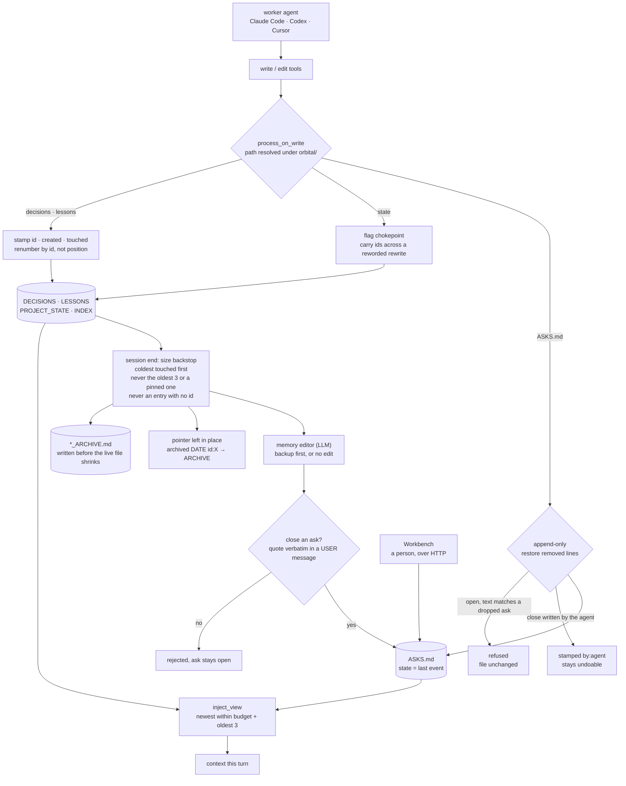

## 1. Executive Summary

Orbital is a desktop project agent: it owns the folder, and Claude Code, Codex
and Cursor are interchangeable workers it delegates to. The README's pitch is
about that swap — a usage limit hit mid-task, another agent picking up the same
conversation — and the memory design follows from it. If the context has to
survive the agent, it has to live in files a person can open.

So memory here is four markdown files in `orbital/`, plus a fifth that is not
like the others.

**The four are budgeted, and going over budget moves entries rather than
dropping them.** DECISIONS and LESSONS demote their coldest entries into an
archive file and leave a pointer line in their place — dated, carrying the
entry's id, naming the archive — so the live file still says what left and
where it went. PROJECT_STATE will only move lines older than a fourteen-day
probation window, and when everything left is recent it simply stays over
budget: *"over budget beats losing current work."*

**The fifth is ASKS.md, and it is an event log.** An ask is something waiting on
the user that must outlive the conversation it came up in. One event per line,
and an ask's state is its last event. That shape carries three of this report's
four marks.

**A commitment the user dropped cannot be written again.** The agent's write
path keys each new ask on its own normalised text, finds the dropped one, and
refuses the line outright — the test asserts the file comes back byte-identical.
That is the corpus's usual failure mode solved: a rejection that survives the
agent forgetting it happened.

**And the agent cannot claim to be the user.** A close it writes is stamped
`by:agent` even when it typed `by:user`, which is precisely what keeps that
close undoable from the Workbench. The automated memory editor is held to a
harder rule still: it may close an ask only by quoting the user verbatim, and
the quote is checked against user-role messages in the session it names.

What is missing is any notion of belief. No entry anywhere carries a status
saying whether it is still true.

## 2. Mental Model

Two different things are called memory here and they behave differently.

**Durable prose** — decisions, lessons, current state, an index — is a file the
agent reads and rewrites. Orbital's job is to keep that rewriting from
destroying anything: it stamps machine ids so entries survive being reworded,
re-applies a format contract the agent cannot delete, and when the file grows
past its budget it moves the coldest entries out rather than letting a
consolidation pass decide what to delete.

**Asks** are the opposite: nobody rewrites them. Every change is a new line,
identity is an id nobody may alter, and the current picture is computed by
folding the log. The module says why the design changed: the old `[user]`
bullets inside PROJECT_STATE were reworded constantly, so every consumer had to
reconstruct an item's identity with a fuzzy title matcher, and *"in practice
nothing ever recorded 'done'."*

The lesson generalises past this repository. When the representation is prose an
agent rewrites, identity has to be something the rewrite cannot touch.

## 3. Architecture

## 4. Essential Implementation Paths

- **Layer-1 spine:** `agent_os/agent/memory_entries.py` — budgets, stamping,
  injection view, demotion, the write-path entry point.
- **Asks:** `agent_os/agent/asks.py` — the grammar, the fold, the append-only
  write path and the dropped refusal.
- **Session-end backstop:** `agent_os/agent/workspace_files.py`,
  `_apply_hard_caps`.
- **LLM editor:** `agent_os/agent/memory_editor.py` — backup, prompt, choices,
  and the quote-checked ask closes.
- **Person's surface:** `agent_os/api/routes/workbench.py`.
- **Legacy store:** `agent_os/agent/retractions.py` — read once, by the
  migration.

## 5. Memory Data Model

Each durable entry carries a one-line HTML comment holding `id`, `created`,
`touched` and sometimes `tag`. The comment is invisible in rendered markdown,
sits where the trim will not reach it, and is re-applied at both write
chokepoints when the agent strips it. Entries are keyed by id rather than by
position, which is what lets LESSONS be renumbered contiguously after the
on-disk numbering drifts.

Every file also carries a `<!--format ...-->` contract on line 1 describing the
grammar the agent must write in. It is normalised rather than preserved on each
write, and the comment explaining that change is worth reading, because the bug
it fixes is a common one: the contract used only ever to be *prepended when
missing*, so every project that already had a header was pinned to whatever
contract shipped the day its file was created, and every rule added afterwards
silently never applied to it.

The contract is also excluded from the file's own budget, and the note says why
in numbers: PROJECT_STATE's header had reached 498 tokens, 46% of that file's
consolidation target, *"putting a real project permanently over budget with no
route down."*

An ask is not a record at all. It is whatever the log's last event for its id
says, which is why nobody can rewrite one into meaning something else.

## 6. Retrieval Mechanics

There is no query. Each turn the four files are injected whole, up to a budget
derived from the active model's context window rather than hardcoded, and when a
file is over the cap the view shows the newest entries that fit plus the oldest
three — foundational entries cluster at the head and are always kept — with a
note saying what was omitted. Asks ride along as their own block: the open ones,
then a short list headed *"Dropped by the user — never re-propose."*

The budget floors are the measured sizes of a healthy project with headroom,
deliberately set *above* the full clean set so a normal project injects
everything and only a runaway overflows. Consolidation aims a thousand tokens
below the soft budget rather than at it, and that comment is the one to steal:
a pass that lands exactly on the threshold re-trips the flag as soon as the next
entry is appended, *"which is how a project ends up checkpointing continuously
without ever getting quieter."*

## 7. Write Mechanics

Everything the agent writes to a memory file passes `process_on_write`, which
resolves the path, requires its parent to be the project's own `orbital`
directory, and dispatches by basename. The routing detail worth noting is that
the hard cap is deliberately *not* applied here — the write path stays cheap and
never demotes mid-edit; demotion happens at session end.

The session-end backstop is deterministic and never calls a model. It fires only
on a file over its soft budget, demotes coldest-`touched` first, and protects
three classes of entry: the oldest three, anything tagged pinned, and anything
with no id — that last one on the stated ground that an unaddressable entry
could not be recalled, so moving it would be losing it. It also skips a move
whose pointer would be longer than the entry it replaces.

The ordering is explicit and correct: the archive is appended **before** the live
file is shrunk, and an `OSError` on either step leaves the live file intact,
logged as *"over budget beats losing entries."*

Then the LLM editor runs, and it cannot start without a backup — if copying the
four live files fails, the run returns `failed` and edits nothing.

## 8. Agent Integration

Installers for Windows and macOS, a daemon, a web Workbench, a calendar hub that
reads dated lines out of PROJECT_STATE, and transports for Claude Code, Codex
and Cursor. Sub-agents get a prompt block built from the same dropped-asks list
the main loop uses.

## 9. Reliability, Safety, and Trust

**Tombstone — awarded**, on the refusal in the asks write path rather than on
anything in the four files. The value is the ask's own text, normalised;
the record is the drop event in an append-only log; the consumer is the
agent's own write path, which declines to append and hands back the id, the
date and the only legitimate route — a `reopen` carrying the user's words. Two
limits belong on the record. The match is exact-normalised, so a rephrasing
gets through. And the fuzzy matcher built for exactly that case, at a 0.75
threshold, is sitting unused in `retractions.py` — see section 12.

**Audit log — awarded.** ASKS.md is a named append-only event record and it is
the store, not a sidecar. The enforcement is on the agent's write path, which
restores every line the agent removed or altered, in order. The actor is not
self-reported: an agent-written close is re-stamped `by:agent` regardless of
what it claimed, and a close with no actor at all is folded as `agent` so it
stays undoable. The limit is coverage: the four budgeted files have no
equivalent log. Their history is five backups deep plus dated sections in the
archives.

**Human review — awarded**, on three things that have to hold together. The
person's surface is a set of HTTP routes the Workbench drives, and nothing in
the agent's tool registry reaches asks. The automated editor — the thing most
likely to be mistaken for a person — is held to a verified quote: it names an
ask, a session and a phrase, and the close lands only if that phrase occurs in
a message of that session whose role *and* source are the user, which excludes
assistant turns and injected rows. And the agent's own close is attributed
honestly rather than trusted, which is what leaves the person an undo. The
weak spot is that same path: a close the agent writes without quoting anyone is
warned about and still appended.

**Negative eval — awarded.** See the evidence record; the quote-from-the-
assistant row is the one that makes the table more than a shape check.

**Trust state — withheld.** Nothing here records whether a stored thing is
still true. The ask lifecycle is the closest candidate and is a task state, not
an epistemic one: `done` means handled and `dropped` means the user said no,
neither of which says a claim is unreliable. On the durable side there is only a
`pinned` tag and a `touched` date; DECISIONS carries the instruction to
supersede contradictions in its format contract, which is a sentence addressed
to the model rather than a field anything filters on.

**Bi-temporal — withheld.** Entries carry `created` and `touched`, and an ask
may carry a `due`. Those are record times and a deadline; no read answers what
the project state was as of a past date.

**Scope enforced — withheld.** The boundary is the project folder, and the
memory-file router does resolve symlinks before requiring the parent to be that
project's own `orbital` directory — a real containment check, and the session
name in an editor close is pattern-matched against path escape, with a test for
it. But containment is not a stored scope key applied on a read path, and no
query here carries one.

## 10. Tests, Evals, and Benchmarks

**No paper.** Searched the README, both translations and `docs/` for `arxiv`,
`@article`, `@misc` and `doi.org`, and looked for a `CITATION.cff`: the only
hits are a screenshot caption showing the agent browsing arxiv.org.

616 test files with a `pytest.ini`, organised into unit, integration, e2e,
platform, regression and smoke. The three that carry the marks are in section 9,
and the pattern they share is asserting refusal by *equality* — `out == prev` —
rather than by the absence of a substring. An equality assertion cannot pass
because the appended line was spelled differently than the test expected.

The editor's rejection table deserves the last word. Its fixture writes a
session in which the assistant says *"English it is, and I will ship it today"*
— plausible, on topic, and exactly what a model summarising the conversation
would reach for. The table asserts that a close quoting it is rejected and the
ask stays open. Most negative tests are built from material that is obviously
wrong; this one is built from material that is wrong in the way the system
would actually fail.

No retrieval benchmark is committed and none is claimed.

## 11. For Your Own Build

- **Refuse the re-add, do not just warn about it.** The dropped-ask check
  declines to append and says which ask and when. A prompt line asking the model
  not to re-propose something is not the same mechanism, and this repository
  ships both — one in the write path, one in the injected block.
- **Never let the writer self-report the actor.** Overwriting the agent's
  `by:user` with `by:agent` costs one line and is what makes every other
  guarantee about who closed something mean anything.
- **Protect the unaddressable entry.** Refusing to archive an entry with no id,
  because it could not be recalled afterwards, is the kind of rule you only
  write after losing something.
- **Write the archive before you shrink the source**, and leave the source
  intact when the archive write fails.
- **Aim consolidation below the threshold, not at it**, or the flag re-trips on
  the next append and the project checkpoints forever.
- **Normalise a code-owned format contract instead of preserving it**, or every
  project silently keeps whichever version of the rules shipped the day its file
  was created.

## 12. Open Questions

- `retractions.py` is a complete value-keyed rejection store — append-only,
  with a fuzzy title matcher at a 0.75 threshold built to catch a retracted item
  reappearing under a rephrased title. Its own docstring says the write
  chokepoint calls that matcher and that the store is injected as a constraint
  block every turn. At this pin neither is true: `reconcile_flags` takes the
  retraction list as a parameter and deletes it on the first line as *accepted
  for call-site compatibility and ignored*, `render_constraints` has no caller
  at all, and `list_retractions` has exactly one, in the first-run migration
  that converts each retraction into an open-then-dropped pair in ASKS.md. The
  successor mechanism is real and tested — but it matches on exact normalised
  text, so the migration traded a fuzzy matcher for an exact one. Is that
  deliberate, and is the module now dead code that should go?
- The budgets are floored at sizes measured against one named model with a
  million-token window, with a proportional scale-down below roughly eighty
  thousand. What happens to a project whose files were grown under the large
  window when the active model is switched to a small one?
- A close the agent writes without a quote is warned about and kept. Given the
  editor path rejects exactly that, is the agent path's leniency a deliberate
  gradient, or the older rule?

## Appendix: File Index

- Budgets, stamping, injection, demotion: `agent_os/agent/memory_entries.py`
- Asks grammar, fold, write path: `agent_os/agent/asks.py`
- PROJECT_STATE bullets: `agent_os/agent/state_blocks.py`,
  `agent_os/agent/flag_chokepoint.py`
- Session-end backstop: `agent_os/agent/workspace_files.py`
- LLM editor and quote-checked closes: `agent_os/agent/memory_editor.py`
- Person's surface: `agent_os/api/routes/workbench.py`
- Legacy rejection store: `agent_os/agent/retractions.py`
- Tests: `tests/unit/test_asks.py`, `tests/unit/test_memory_editor_asks.py`,
  `tests/unit/test_memory_floor.py`, `tests/unit/test_layer1_lifecycle.py`,
  `tests/unit/test_retractions.py`

## History

**2026-09-19** — [`6b4999444392a512c31b6219926e785dd7e30cea`](https://github.com/zqiren/Orbital/commit/6b4999444392a512c31b6219926e785dd7e30cea) — first reading, at the head of `main`. Screened with `scripts/screen_repo.py` before anything was read: eight manifests inside the seven-day cooldown, an artefact of a `--depth 1` clone; a Windows `setup.py` and four `conftest.py` files that execute at install or collection time; non-registry and floating dependency sources in the web and demo packages; and an `AGENTS.md` and a `CLAUDE.md` addressed to a reading agent, read as data throughout. Nothing was installed, built or run. GPL-3.0 with a matching `NOTICE` and no rider. Four marks. The reading covered the Layer-1 budget spine, the demotion and floor paths and their protections, the session-end backstop and its ordering, the asks grammar and fold, the append-only write path and its refusals, the LLM editor's backup and quote-checked closes, the Workbench routes, and the tests the marks rest on; the transports, the calendar hub, the budget ledger and the desktop and installer trees were read as context rather than as subject. Three marks are withheld with reasons in section 9. The finding worth carrying forward is in section 12: the repository contains a complete, tested, fuzzy-matched rejection store whose two documented consumers have both been removed, and whose successor matches on exact text — a case where the mark is earned by the newer mechanism and the older one is strictly stronger.
