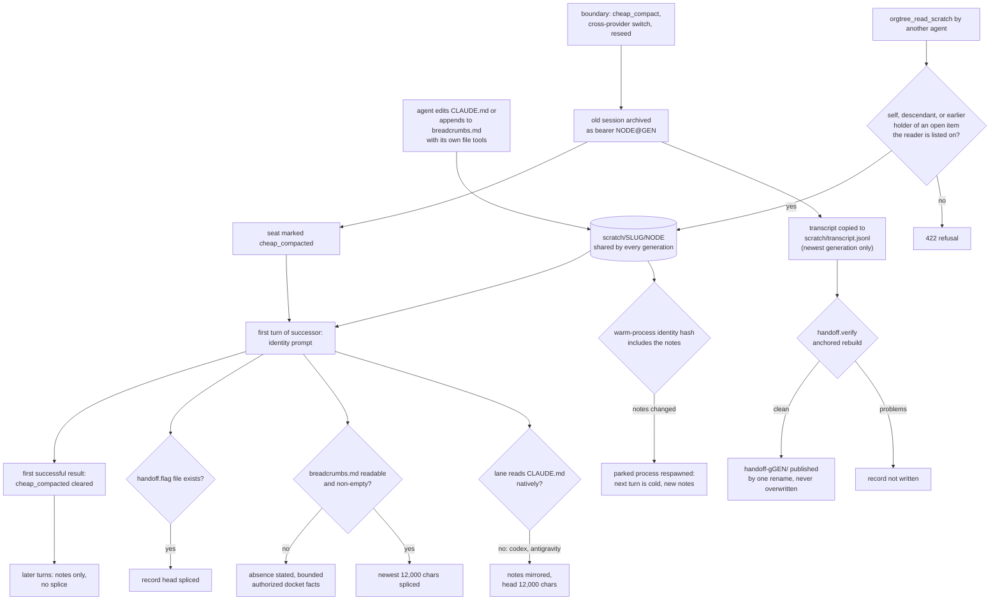

## 1. Executive Summary

Orgtree is a Windows desktop app for running a persistent team of coding agents
— Claude Code, Codex, Antigravity and OpenRouter models — arranged as an org
chart, with a Python engine, a PostgreSQL store, a docket, mail and delegation.
Its memory is deliberately plain: each agent keeps a `CLAUDE.md` of standing
notes and a `breadcrumbs.md` log in its own scratch folder, and the engine makes
sure both reach the next session.

What is notable is how much engineering goes into the delivery of two text
files. The notes are mirrored into the managed prompt on lanes whose CLI does
not read `CLAUDE.md`. Editing them moves a warm-process identity hash so no
parked process serves stale notes. A cheap compaction splices the breadcrumb
tail into the successor's first turn only, with declared truncation and a
fallback that refuses to invent notes.

What is weak is the memory itself. The files carry no type, author, time or
status, and `breadcrumbs.md` is append-only only because the prompt asks.

The rest of the app is out of scope here: the docket is a task tracker, mail is
messaging, and the [scope note](../../families/#not-in-scope-conversation-window-management)
says why. Three adjacent mechanisms are covered because they carry content
across a session boundary. Archived sessions — *knowledge bearers* — can be
read or rehired. A hash-checked *handoff record* is published at every
boundary. A V1 import carries Claude Code's own auto-memory directory.

The code is a successor to
[claude-orgtree](https://github.com/Maurdekye/claude-orgtree), from which
`THIRD_PARTY_NOTICES.md` says source was reused under MIT. The mail hub lives in
a submodule, [orgtree-mailhub](https://github.com/Maurdekye/orgtree-mailhub) at
`6e856eec8ccfbcf8d16451123903b9d2ce16450b`, and holds no memory.

One mark, `negative_eval`, on a test that an agent holding one docket item
cannot read an unrelated earlier holder's breadcrumbs, after a positive
control. Section 9 names the six withheld.

## 2. Mental Model

A memory is a line in a Markdown file the agent wrote about itself. It becomes
a belief when the agent saves the file, and it is believed by whichever session
next loads the file. Nothing is extracted, scored or reconciled. It stops being
one when the agent edits it away, or when the user deletes the agent and the
scratch folder goes with it.

**Two files, two reading conventions.** `CLAUDE.md` is curated: the prompt
calls it *"standing notes"* that survive compaction, and a cut keeps the head
(`engine/backend/orgtree/supervisor.py:9625-9629`, `:7429-7433`).
`breadcrumbs.md` is a log: the prompt asks the agent to append *"important
events, decisions, findings and open threads AS THEY HAPPEN"*, newest last, and
to write *"for that stranger"* who will succeed it. A cut keeps the tail
(`:9535-9547`, `:7518-7520`). The breadcrumb instruction is rendered only when
the agent has an edit or shell tool.

**A session boundary is where memory is tested.** A cheap compaction, a
cross-provider model switch or a reseed archives the old session as a bearer
`<node>@<gen>` and starts the seat on an empty session
(`engine/backend/orgtree/ledger.py:5403-5503`). The successor's only carried
state is what the files say, plus whatever it chooses to read from the archived
transcript or by rehiring the bearer as its own subordinate
(`engine/backend/orgtree/events_render.py:647-659`).

**The successor is told what is a claim.** The handoff record's prompt header
calls itself *"NOT memory, NOT a summary a model wrote"* and says *"a
predecessor claim is a claim until you open its cited line in transcript.jsonl"*
(`supervisor.py:7569-7576`). The notes carry no such label. On the non-Claude
lanes they arrive under *"You wrote these; they are yours to revise"*, and the
Claude CLI loads `CLAUDE.md` with no framing from Orgtree at all.

## 3. Architecture

The desktop app is Electron and React; the engine is a Python FastAPI service
under `engine/backend/orgtree/`, launched by `engine/launch.py`, over a
PostgreSQL instance the installer bundles. Rust crates under `engine/native/`
cover the store schema, receipts and scope clamping. The engine spawns each
agent's CLI with `cwd` set to that agent's scratch folder
(`supervisor.py:21900-21902`), which is why a Claude Code agent loads its own
`CLAUDE.md` without help.

**The memory is files; its bookkeeping is rows.** `scratch_dir` maps a node id
to `scratch/<slug>/<node>`, strips the `@gen` suffix so every generation of a
seat shares one folder, and creates it on demand (`supervisor.py:3548-3569`).
The node document — bearer lineage, `generation`, `predecessor`, the
`cheap_compacted` marker — lives in the org's store. `store.py` documents JSON
and SQLite backends; the README and 3.0 release notes describe the move to the
bundled PostgreSQL.

**The managed prompt is the injection point.** `identity_prompt`
(`supervisor.py:8868-9643`) ends with the standing-notes mirror, any
`CLAUDE.md` from granted folders, the breadcrumb block and the handoff block,
in that order (`:9638-9642`). It rides `--append-system-prompt-file` on the
Claude lane, the managed `AGENTS.md` on Codex and a plugin workspace on
Antigravity, per the comments at `:7268-7272` and `:7382-7390`.

**Freshness is enforced by respawn.** `native_startup_context_digest` hashes the
instruction files Claude Code loads once per session — the `CLAUDE.md` chain
above the scratch folder, each granted folder's `CLAUDE.md`, and the first
25 KiB or 200 lines of Claude Code's own auto-memory `MEMORY.md`
(`engine/backend/orgtree/warmpool.py:852-858`, `:781-785`, `:975-978`). An edit
moves the hash and a parked process is replaced before its next turn.

The mail hub submodule is a cross-machine relay with a SQLite queue and a
30-day retention sweep (`engine/mailhub` README); it stores no memory.

### Deployment and ergonomics

The packaged app is a Windows installer that carries Electron, a Python
runtime and PostgreSQL; provider CLIs and accounts are installed separately.
Nothing extra is needed for memory, and no API key is needed to store a note,
because storing a note is saving a file. The store is entirely human-readable
and repairable with a text editor. The engine-side state that decides what is
spliced — `cheap_compacted`, `generation` — is in the database and is not.

## 4. Essential Implementation Paths

**Write.** No engine code writes either notes file. The agent uses its CLI's
Edit or shell tools, and `ro_deny_rules` guarantees its own scratch folder is
never denied by a read-only grant, because, per its docstring, that folder is
where the charter *"requires it to keep breadcrumbs.md/CLAUDE.md"*
(`supervisor.py:12288-12297`). `breadcrumbs.append_note`
(`engine/backend/orgtree/breadcrumbs.py:97-156`) appends in the file's existing
encoding, caps a note at 2,000 characters and refuses to touch undecodable
bytes; its only callers are tests.

**Read at session start.** `_standing_notes_block` (`supervisor.py:7366-7448`)
returns nothing on lanes in `_NATIVE_CLAUDEMD_PROVIDERS` — Claude and
OpenRouter, which runs the Claude CLI — unless the turn uses the Codex harness.
Otherwise it renders the head 12,000 characters, states the scale of any cut,
and renders a notice when the file exists but cannot be read.

**Boundary.** `orgtree_cheap_compact` (`engine/backend/orgtree/mcptool.py:1422-1434`)
reaches `_archive_session_in_place` (`ledger.py:5403-5503`): the old node dict
is copied to `<nid>@<gen>` as an archived bearer with tools stripped, the seat
gets a fresh `session_id`, and `cheap_compacted` is set (`:5502`). After the
commit, `export_predecessor_transcript_deferred` copies the old session's
transcript to `scratch/transcript.jsonl` under a per-destination lock, ordered
by generation, then calls `_publish_handoff_record`
(`supervisor.py:4290-4366`, `:4570-4630`).

**Handoff record.** `_publish_handoff_record` captures the transcript lines,
prompt-view sidecar rows, node doc, mailbox and grants, runs `handoff.verify`
with all three anchors, and writes nothing if verification reports a problem
(`supervisor.py:4619-4625`). `handoff.write_generation` stages
`record.json`, `record.md` and `manifest.json` and publishes them with one
rename, refusing an existing generation (`engine/backend/orgtree/handoff.py:966-997`).

**First turn after the boundary.** `_breadcrumbs_block` (`supervisor.py:7472-7526`)
and `_handoff_block` (`:7532-7578`) render only while `cheap_compacted` is set.
`_retire_breadcrumb_splice` clears it at the first successful result boundary
(`:15252-15279`). The handoff block also requires `handoff_flag_on()`, the
existence of `<ORGTREE_DATA>/handoff.flag` (`:4460-4467`).

**Cross-agent read.** `orgtree_read_scratch` and `orgtree_read_transcript`
(`mcptool.py:1966-1996`) call `_agent_read_access`
(`engine/backend/orgtree/api.py:10872-10914`), then resolve the path under the
target's real scratch path with a separator-anchored prefix test and return at
most 20,000 characters (`:13283-13300`). The item route is
`Org.work_item_read_grant` (`ledger.py:13250-13290`).

**Forget.** `Org.delete` refuses any actor but the user (`ledger.py:6001-6009`);
`supervisor.forget` then removes the base scratch folders and leaves the
provider transcripts under `~/.claude` (`supervisor.py:35615-35634`). Retiring
keeps the folder and the session for a later rehire (`mcptool.py:1408-1419`).

**V1 import of Claude auto-memory.** `desktop_native_claude_memory.py` ports
Claude Code's project-key derivation, stages the source `memory/` directory with
a SHA-256 manifest, refuses a shared or changed destination, and publishes it by
rename (`engine/backend/orgtree/desktop_native_claude_memory.py:1-16`,
`:284-336`, `:440-472`). The route is mounted at `/api/desktop/import-v1`
(`engine/backend/orgtree/desktop_import.py:55`).

## 5. Memory Data Model

| Artifact | Where | Notes |
| --- | --- | --- |
| standing notes | `scratch/<slug>/<node>/CLAUDE.md` | free Markdown, agent-curated, head-cut at 12,000 chars on mirrored lanes |
| breadcrumb log | `scratch/<slug>/<node>/breadcrumbs.md` | free Markdown, newest last by convention, tail-cut at 12,000 chars |
| transcript copy | `scratch/<slug>/<node>/transcript.jsonl` + `.generation` marker | newest predecessor only |
| handoff record | `scratch/<slug>/<node>/handoff-g<gen>/` | `record.json`, `record.md`, `manifest.json`; one directory per generation |
| knowledge bearer | node row `<node>@<gen>` | `state: archived`, `bearer_state: knowledge`, `successor`, tools stripped |
| splice marker | node field `cheap_compacted` | set at the boundary, cleared after the first successful turn |

**Scope is the folder.** A record has no owner field because it is a file in
its owner's directory, and lineage ids share that directory. Generations of one
seat therefore share notes and breadcrumbs, which is the intent: the log is
continuous across a reset.

**The transcript copy is single-slot.** The export docstring says a later cheap
compact *"overwrites the copy with the newer generation's — earlier generations
stay reachable by rehiring their bearers"* (`supervisor.py:4280-4283`). The
handoff records, by contrast, accumulate one directory per generation.

**No temporal, provenance or status fields exist on the notes.** Time is file
mtime; authorship is the folder. The handoff record carries rich provenance —
line hashes, roles, omission counts, a worktree fingerprint — but it is a
derived index of a transcript, not a memory an agent can correct.

## 6. Retrieval Mechanics

Nothing ranks or searches. Retrieval is whole-file loading at session start,
plus whatever the agent reads on purpose.

On the Claude and OpenRouter lanes the CLI loads `CLAUDE.md` itself, and
Orgtree adds nothing. On Codex and Antigravity the mirror carries the head
12,000 characters with a notice stating how many were cut. The breadcrumb splice
carries the newest 12,000 characters, and the notice says to *"read the file
itself for the rest"* (`supervisor.py:7518-7526`).

**The first-turn-only splice is a cache decision.** The docstring of
`_retire_breadcrumb_splice` says re-splicing a file the agent appends to every
turn would re-dirty the prompt each turn, and puts the measured stake at
roughly 24% against 61% of cold starts prevented (`supervisor.py:15253-15257`).
The cost is that turn two onward sees the breadcrumbs only through the
conversation history, which a later normal compaction may summarise away.

**A missing log is announced, not papered over.** When `breadcrumbs.md` is
absent, unreadable or empty, the block says so and substitutes up to four rows
of authorized docket facts — slug, title, status, `done_so_far`,
`working_on_next` — drawn through `work_list` with the viewer's own disclosure
rules (`:7454-7469`, `:7499-7515`; `:4470-4476`).

**Other agents' material is read by path.** `orgtree_read_scratch` lists a
directory or returns one file. There is no query, so an inheriting agent must
know to look; the reassignment mail tells it the item grants the read.

## 7. Write Mechanics

Writes are the agent's own file edits, synchronous with its turn, visible to
the next session immediately and to a parked process after the identity hash
forces a respawn. No model call extracts, summarises or deduplicates anything,
and no engine verb writes either notes file. The managed prompt is the only
writer-side policy: append breadcrumbs as things happen, keep the notes short
because each edit restarts the process.

**Update is overwrite; append is a convention.** An agent can rewrite or
truncate `breadcrumbs.md` with the same tools it appends with. The engine reads
the file's bytes as found and never repairs it. `append_note` would enforce
append-in-place, but nothing calls it outside tests.

**Agent-generated content is all there is.** A breadcrumb records what the agent
believed at the time, and the successor receives it as text under a heading that
names its origin. Nothing filters content, and a prompt-injected line written
into `breadcrumbs.md` reaches the successor's system prompt on the next reset.

### Operational cost

- Write: a file edit inside the agent's turn; no engine work.
- Boundary: one transcript copy plus one handoff capture and verification under
  the export lock. The handoff docstring measures 0.09 s on a 1.5 MB session and
  0.81 s on an 8.4 MB one (`handoff.py:38-42`).
- Background: auto cheap compact is opt-in. `_auto_cheap_cfg` returns nothing
  unless the org or node setting has `enabled`, and the only tunable is a
  context-fraction floor between 0.05 and 0.95 (`supervisor.py:13555-13573`).
- Read: up to 12,000 characters of notes on mirrored lanes every session, plus
  up to 12,000 of breadcrumbs and 12,000 of handoff record on one turn after a
  reset. Each sits in the system prompt, so a notes edit costs a cold start.

## 8. Agent Integration

The agent is told about its memory in the managed system prompt and handles it
with its own CLI tools. The MCP server registers no remember, recall or forget
verb (`rg -n '"name": "orgtree_' engine/backend/orgtree/mcptool.py`); the
memory-adjacent tools are `orgtree_read_scratch`, `orgtree_read_transcript`,
`orgtree_cheap_compact` (refused on oneself), `orgtree_rehire` and
`orgtree_retire`.

Lifecycle notices tell a successor where its memory went. The self-relation
cheap-compact notice says the session is fresh, the breadcrumbs are spliced
when they exist, the transcript is at `transcript.jsonl`, and the predecessor
can be rehired as a subordinate *"to interrogate it directly"*
(`events_render.py:647-659`).

**The provider-lane mirror is the transferable part.** The docstring of
`_standing_notes_block` records that Codex reads `AGENTS.md` and never
`CLAUDE.md`, *"measured 2026-09-04 with `codex debug prompt-input`"*, so those
agents had kept *"a compaction-survival file that NOTHING READ"*
(`supervisor.py:7370-7376`). The fix renders the notes into the prompt identity
component that is already hashed on every lane, so invalidation comes free.
`test_6k_its_standing_notes_are_mirrored_into_the_prompt` pins the mirror for
an OpenRouter agent on the Codex harness
(`tests/test_openrouter_harness.py:394-404`).

## 9. Reliability, Safety, and Trust

**Absence is made visible.** A present-but-unreadable notes file, org charter
or breadcrumb log renders a notice in the prompt rather than nothing
(`supervisor.py:7419-7424`, `:7306-7317`, `:7505-7510`). A truncated one says
how much is missing. This is the failure the code's comments return to most:
*"a mechanism everybody believes in that does nothing"* (`:7379-7380`).

**The handoff record is careful and mostly dark.** It is verified before it is
written and never overwritten. Its prompt splice and notice, though, need a
`handoff.flag` file, which the docstring describes as a runtime switch an
operator creates in the data root, off by default with the record still
written to disk (`supervisor.py:4460-4467`); no code in the tree creates it
(Recorded searches). The
module docstring says each rule has *"a rejected forgery in
tests/test_handoff_record.py"* (`handoff.py:15-16`). That file does not exist
at the pin or anywhere in this repository's history. The only test calling
`handoff.verify` asserts it returns no problems for an unforged capture
(`tests/test_handoff_resilient_breadcrumbs.py:61-102`).

**No provenance on the notes.** A line in `breadcrumbs.md` cannot say which
generation wrote it or when, so a successor cannot tell its predecessor's
verified finding from a guess written under pressure.

**Privacy.** Delete is user-only and removes the scratch folder; the provider's
own transcripts under `~/.claude` are left in place by design
(`supervisor.py:35615-35619`).

Capability marks:

- `negative_eval` — awarded; evidence in section 10.
- `tombstone` — nothing records a rejected value. The only tombstones in the
  engine mark spent watchdogs and removed mail entries.
- `trust_state` — the notes have no status. The handoff record's
  "a claim is a claim" framing is prompt text, not a field any read filters on.
- `bitemporal` — no time field beyond file mtime.
- `scope_enforced` — withheld: the partition is one folder per seat with no
  key on a record. `_agent_read_access` is an authorisation check choosing which
  folder a request may open, a real boundary of a different kind.
- `audit_log` — no record of note mutations; edits are file writes by the
  agent's CLI. The handoff generations record session boundaries, and the
  operation receipts cover Orgtree tool calls, where `orgtree_read_scratch` is
  classed `NONE` (`engine/backend/orgtree/opreceipts.py:148`).
- `human_review` — nothing waits for a person. The user can edit the org
  charter through the org.md editor (`api.py:10604-10650`), which is authoring.

## 10. Tests, Evals, and Benchmarks

Nothing was installed, built or run for this report. Everything below is from
reading the tests at the pin and the committed baseline in
`docs/test-baseline.json`, which records 481 Python modules passing and 39 failing on
28 September 2026 at commit `654658f982ef6f4b6ebdaebd1df18bcef3525145`, a
pre-pin commit, on the SQLite store.

**The negative case.** `tests/test_item_scoped_reads.py` builds five peers under
one coordinator and two docket items, and writes distinct text into two agents'
`breadcrumbs.md` (`:71-77`). `test_holding_one_item_grants_nothing_about_another`
asserts the holder of one item is refused the breadcrumbs of the earlier holder
of the other, then asserts that the other item's holder reads the same file
through the item route (`:152-164`). Further cases assert refusal for unrelated
peers in three directions on both tools, for a superior, for the current holder,
and after the item archives. A refuse-everything implementation fails
`test_new_holder_reads_the_archived_previous_holders_material`, which checks the
file's text (`:117-128`).

**Breadcrumb persistence.** `BreadcrumbPersistenceTests` pins UTF-16 detection
without a BOM, one BOM after an append, malformed bytes left untouched, and an
empty note not creating the file (`tests/test_handoff_resilient_breadcrumbs.py:13-58`).
All four exercise `append_note`, which nothing in production calls.

**Splice retirement.** `test_retire_breadcrumb_splice` asserts the marker is
cleared and that the write does not hold the document lock
(`tests/test_pg3e_b_sessions.py:162-165`). No test asserts the breadcrumb
block's text, its 12,000-character tail cut, or its docket fallback
(`rg -n '_breadcrumbs_block|BREADCRUMBS_TAIL' tests`).

**Claude auto-memory import.** `tests/test_desktop_native_memory.py` is in the
baseline's failing list since at least 16 September 2026, with a
`ResourceWarning` about an unclosed database as the recorded error.

No retrieval-quality evaluation exists, which fits a design that does not
retrieve. No paper or citation block is in the tree.

## 11. For Your Own Build

### Steal

- **Make the memory promise true per provider, not per product.** If agents run
  on several CLIs, check which instruction file each actually loads, and render
  the notes into the prompt where the CLI will not. Pin it with a test that
  plants a marker string.
- **Put memory files in the process identity hash.** A warm process that
  outlives a notes edit serves the old notes; hashing the files the CLI loads
  at startup turns staleness into a respawn.
- **Splice the recovery log once, then stop.** Give a summary-less successor the
  tail of its predecessor's log on turn one and drop it after the first
  successful result, so the prompt prefix stays cacheable.
- **Say when memory is missing.** "Unreadable", "empty" and "cut, N characters
  remain" must each look different from "no notes".
- **Scope inherited reads by the work item, not the org chart.** A reassigned
  ticket's new holder reads earlier holders' notes; an unrelated peer does not;
  the read ends when the item closes. Test every refusal beside its grant.

### Avoid

- **An append-only log enforced by prose.** If the log is the recovery
  mechanism, route writes through an append function the agent cannot bypass,
  or record a hash per entry so a rewrite is detectable.
- **Docstrings that cite tests the tree does not hold.** A reader takes "each
  with a rejected forgery in" a named file as coverage.
- **A flag that only a hand can create.** A feature gated on a file nothing
  writes is off in every deployment, and its tests will not notice.
- **A single-slot copy of the last transcript.** Two resets in a row leave the
  successor's folder pointing at the newest predecessor only.

### Fit

This suits an operator who already runs several provider CLIs as a team and
wants each agent's own notes to survive resets reliably, without adopting a
memory service. The memory layer assumes agents that write honest logs, and
it gives a successor nothing to weigh one line against another. A reader who
needs memories shared across agents by topic, searched rather than loaded, or
checked before they are acted on should take the delivery and invalidation
machinery and put a real store under it. A reader who wants a memory system
alone would be adopting an org-chart desktop to get two files per agent.

## 12. Open Questions

- Is `handoff.flag` created by any deployment or release step outside this
  repository, and did `tests/test_handoff_record.py` exist in claude-orgtree?
- Does the Claude CLI's own auto-memory, which the warm hash tracks, carry
  content across Orgtree's cheap compactions in practice, and do agents use it
  beside `CLAUDE.md`?
- How often do agents rewrite rather than append to `breadcrumbs.md`?
- Does any desktop client still call `/api/desktop/import-v1`, given the README
  says Orgtree 3 no longer imports V1 organizations?

## Appendix: File Index

- **Prompt assembly and splices:** `engine/backend/orgtree/supervisor.py`
  (`_standing_notes_block`, `_breadcrumbs_block`, `_handoff_block`,
  `identity_prompt`, `_retire_breadcrumb_splice`, `handoff_flag_on`).
- **Boundary and lineage:** `engine/backend/orgtree/ledger.py`
  (`_archive_session_in_place`, `delete`, `work_item_read_grant`),
  `supervisor.py` (`export_predecessor_transcript_deferred`,
  `_publish_handoff_record`, `forget`, `scratch_dir`).
- **Files:** `engine/backend/orgtree/breadcrumbs.py`,
  `engine/backend/orgtree/handoff.py`,
  `engine/backend/orgtree/desktop_native_claude_memory.py`.
- **Freshness:** `engine/backend/orgtree/warmpool.py`
  (`native_startup_context_digest`).
- **Agent surface:** `engine/backend/orgtree/mcptool.py`,
  `engine/backend/orgtree/api.py` (`_agent_read_access`, agent tool dispatch),
  `engine/backend/orgtree/events_render.py`.
- **Tests:** `tests/test_item_scoped_reads.py`,
  `tests/test_handoff_resilient_breadcrumbs.py`,
  `tests/test_openrouter_harness.py`, `tests/test_pg3e_b_sessions.py`,
  `docs/test-baseline.json`.

### Recorded searches

Checked against the checkout at the pinned revision.

- `git grep -n 'append_note'` — the definition in `breadcrumbs.py` and four calls in `tests/test_handoff_resilient_breadcrumbs.py`; no production caller.
- `git grep -n 'handoff\.flag'` — only `supervisor.py`, where `handoff_flag_on` reads it and docstrings mention it; nothing creates it, in `tools/`, `tests/` or the app.
- `git log --all --oneline -- '*test_handoff_record*'` — no commit; `git ls-files | grep -i handoff` lists one test module, `tests/test_handoff_resilient_breadcrumbs.py`.
- `git grep -nE "open\([^)]*(breadcrumbs|CLAUDE)\.md[^)]*['\"](w|a)" -- engine` — no match; the org.md editor writes the workspace `CLAUDE.md` through a path variable (`api.py:10626-10628`), and no engine path writes a scratch notes file.
- `git grep -n -i 'tomb' -- engine` — watchdog tombs, a mail-entry tombstone and a cost accumulator; nothing keyed on note content.
- `rg -n '"name": "orgtree_' engine/backend/orgtree/mcptool.py` — 48 tools; none named remember, recall, forget or note.
- `git grep -n 'import-v1' -- apps packages engine tools` — the engine router prefix and two recovery routes in `engine/launch.py`; no caller in `apps/` or `packages/`.
- `rg -n '_breadcrumbs_block|BREADCRUMBS_TAIL|_standing_notes_block' tests` — one call to `_standing_notes_block` in `test_openrouter_harness.py`; none to the breadcrumb block.
- `grep -rniE 'memor|remember|recall|breadcrumb' engine/mailhub --exclude-dir=.git` — a session-name note, a durable `.corrupt-*` sibling and a web UI cache; no memory store.
- `git grep -liE 'arxiv|bibtex|@article|@misc|doi\.org'` — no match, and no `CITATION.cff`.

## History

**2026-10-01** — [`0151d66ec5f1a5e4a297dc9f07dc65fbb18739e2`](https://github.com/Maurdekye/orgtree/commit/0151d66ec5f1a5e4a297dc9f07dc65fbb18739e2) — first reading, at the head of `main`, release 3.0.6 dated the same day. One mark, `negative_eval`. The `engine/mailhub` submodule was read at its pinned commit. Screened before reading: 1 auto-run surface (`.gitmodules`), 1 build-time execution point (`engine/native/store-schema/build.rs`), `FRESH` on `package.json` and `package-lock.json` and on Cargo manifests under `engine/native/` — a real cooldown, since the clone is full — and `FLOAT` on `package.json` with a lockfile present; the mail hub's screen found `FLOAT` on `requirements.txt` only. No `AGENTS.md` or `CLAUDE.md` is in the tree. Nothing installed, built or run. The org chart, docket and mail are out of scope.
