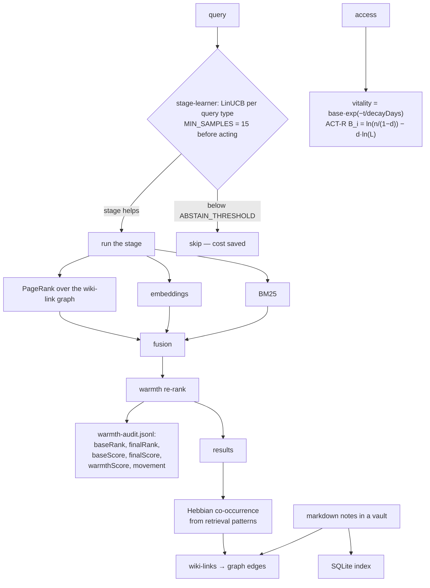

## 1. Executive Summary

Ori Mnemos is persistent memory as a markdown vault — notes on disk, wiki-links
as graph edges, git as version control, a SQLite index, an MCP server, and no
database or cloud dependency. "Markdown on disk. Wiki-links as graph edges. Git
as version control. No database lock-in, no cloud dependency, no vendor
capture."

**The mechanism worth the report is `src/core/stage-learner.ts`:**

> "Stage meta-learning via LinUCB contextual bandits. Layer 3 of retrieval
> intelligence — each retrieval stage learns whether it helps or hurts for
> different query types, and auto-skips stages that don't help. The pipeline
> configures itself.
>
> Research: LinUCB (Li et al. 2010), ACQO curriculum, SmartRAG cost-aware, MoE
> load balancing (Shazeer), cascade classifiers, Vespa time budgets."

Most hybrid retrievers in this atlas run every arm on every query and fuse the
results. This one treats each stage as an arm of a bandit, learns per query type
whether that stage earns its latency, and skips it when it does not — with an
`ABSTAIN_THRESHOLD`, a `COST_PENALTY_ALPHA`, a `LOAD_BALANCE_LAMBDA`, a
`MIN_SAMPLES` floor before it acts, and a `TIME_BUDGET_MS`. The cognitive claims
around it are also real: `vitality.ts` implements exponential decay *and* the
ACT-R base-level activation equation, written out —
`B_i = ln(n/(1-d)) - d*ln(L)`.

**And the second thing worth taking is a log** — `warmth-audit.jsonl` records,
per result, `baseRank`, `finalRank`, `baseScore`, `finalScore`, `warmthScore`
and `movement`. Not just what the personalisation signal did, but what the
ranking would have been without it, per query, with a CLI command to read it
back.

**The benchmark claims are where this report spends its time**, because the
repository contains two tables that do not agree with each other and no run
artifact that could settle which is right — section 10.

## 2. Mental Model

A vault of markdown notes. Wiki-links between them are graph edges. Retrieval
fuses lexical, semantic and graph signals; a bandit decides which of those
stages to run; vitality and importance scores decay and reinforce from access.

## 3. Architecture

`src/core/` holds the engine: `vitality`, `ranking`, `noteindex`, `importance`,
`stage-learner`, `engine`, `warmth-audit`, `explore-audit`, `config`. Plus
`src/cli/`, `src/providers/`, `adapters/`, a `scaffold/`, and Smithery packaging
for MCP distribution.

Two design documents sit at the root — `RETRIEVAL_INTELLIGENCE_SPEC.md` and
`PLAN_NMF_LOCAL_DECOMPOSITION.md` — which is a good sign about how the retrieval
layer was arrived at.

About 25,000 lines of TypeScript, 35 test files.

## 4. Essential Implementation Paths

**Gate the pipeline** — `src/core/stage-learner.ts` (the framing and citations
`:1-9`, the constants `:13-23`).

**Decay** — `src/core/vitality.ts` (`computeVitality` `:11-22`, the ACT-R
base-level activation below it `:24-`).

**Explain a rank** — `src/core/warmth-audit.ts` (`WarmthAuditEntry` `:6-14`,
`WarmthAuditEvent` `:16-`), `src/core/explore-audit.ts`,
`src/index.ts` (`warmth-audit` CLI subcommand `:131`).

**Evaluate** — `bench/hotpotqa-eval.ts`, `bench/locomo-eval.ts`,
`bench/mem0-hotpotqa.py`, `bench/README.md`.

## 5. Memory Data Model

Markdown files, wiki-links, and a SQLite index over them. Vitality is
`base · exp(−t / decayDays)` clamped to `[0, base]`, and ACT-R base-level
activation is available beside it.

There is no status field, no supersession pointer, no tombstone and no
provenance beyond the note itself — correction is editing the markdown, which is
consistent with "git as version control" and means the memory layer inherits
git's answer rather than having one.

## 6. Retrieval Mechanics

BM25 plus embeddings plus PageRank over the wiki-link graph, fused, then a
warmth re-rank, with the stage learner deciding which arms to run.

The bandit's guards are the part to study. `MIN_SAMPLES = 15` before it will act
on a stage, `VARIANCE_THRESHOLD` and `ABSTAIN_THRESHOLD` so it declines to
decide when it cannot, `COST_PENALTY_ALPHA` so a stage must be worth its cost
rather than merely non-harmful, `LOAD_BALANCE_LAMBDA` borrowed from
mixture-of-experts so one arm cannot starve the others, and `TIME_BUDGET_MS` as
a hard ceiling. A self-configuring pipeline that abstains, waits for evidence,
and prices latency is a considerably more careful design than "learn the
weights".

**Scope is structural** — one vault per project, `.ori/` inside it. No stored
scope key was found as a read-path predicate, though the CLI has a
`cross-project` inspection mode.

## 7. Write Mechanics

Notes are written to the vault; the index derives edges from wiki-links; Hebbian
co-occurrence strengthens edges from retrieval patterns, so the graph learns from
what gets recalled together.

Nothing marks a note wrong, stale or superseded. Vitality decays with time since
access, which is a recency model rather than a truth model — an old note that is
still correct decays the same way as an old note that stopped being true.

## 8. Agent Integration

An MCP server distributed through Smithery, a CLI with inspection subcommands
(`orphans`, `dangling`, `backlinks`, `cross-project`, `ranked`, `similar`,
`important`, `fading`, `warmth-audit`), adapters, and a scaffold for new vaults.

`fading` and `warmth-audit` as first-class CLI commands are worth noting: the
operator can ask what the system is forgetting and why a result ranked where it
did, without reading code.

## 9. Reliability, Safety, and Trust

**One mark, and it is `negative_eval`** — section 10 has the cases. No
bitemporality, no scope key on the read path, and no human review.

The two withholdings worth stating are the ones a reader would expect to go the
other way. **`status` is not a trust state.** It takes two values, `active` and
`archived`, and the only place either is compared is `buildIndex` in
`src/core/engine.ts:533`, which skips an archived note while assembling the
SQLite projection. So an archived note is unreachable because it was never
indexed, not because a read consulted its status — the status governs what
enters the index rather than what a query returns, and the mark asks for the
second. It is also a lifecycle flag rather than a judgement about whether the
note is true, which is the other half of what the mark counts.

**Archiving is not a tombstone** for the same structural reason it usually is
not: it is keyed on the note, not on the value the note carried. Nothing consults
the archived set when a new note is written, so the same content can be written
again the day after it is archived and nothing notices.

The two JSONL audits — `warmth-audit.jsonl` and `explore-audit.jsonl` — are
retrieval-side records, which is the half the `audit_log` mark excludes. They are
nonetheless the best ranking-explainability artifact in this batch, because they
carry the **counterfactual**: `baseRank` and `baseScore` next to `finalRank` and
`finalScore`, with `movement` computed. Most systems that log a re-rank record
the outcome; this records what the outcome would have been without the signal,
which is what makes the signal's value measurable rather than asserted.

The risk is section 10's.

## 10. Tests, Evals, and Benchmarks

**Two committed harnesses, three tables, and no run artifact.**

`bench/` contains `hotpotqa-eval.ts`, `locomo-eval.ts` and
`mem0-hotpotqa.py` — so both sides of the Mem0 comparison are run in-house,
which is better practice than importing a competitor's published figure.

**The test suite is 57 files and 862 tests, and 21 of those files were invisible
to git.** `.gitignore` carried `tests/*` plus a hand-maintained allowlist of 36
`!` lines, so a newly written test shipped only if someone remembered to exempt
it. `tests/fixtures/` was ignored too, which meant even the 36 allowlisted files
could not run from a clean clone. The commit that replaced the allowlist with a
tracked directory names the hidden files — `atomic-writes`, `frontmatter`,
`promote`, `tracking`, `indexstore`, `bm25-store`, `graph-metrics-cache`,
`cli-learning-wiring`, `health-learning` — and states the mechanism better than a
summary can:

> "Deny-by-default on a test directory fails silently and in the worst
> direction: the suite still passes locally, so nothing tells you the evidence
> never shipped."

That is the generalisable part. A deny-by-default rule over a directory whose
contents are the evidence produces a repository that looks tested and ships
nothing to test it with, and no local run can detect it.

**Committed negative assertions.** `rankByFading` is given `alive` at 0.8,
`fading` at 0.1 and `dead` at 0.0 against a 0.3 threshold, and the case asserts
`expect(fading.map((f) => f.title)).not.toContain("alive")` beside
`expect(fading.length).toBe(2)` — the second assertion is what stops the first
from passing on a filter that excludes everything. `prune` repeats the shape
keyed on a value: a note written with `status: archived` must not appear among
new candidates, while `expect(result.data.zones.archived)
.toBeGreaterThanOrEqual(1)` proves the note reached the store rather than never
landing, and a high-vitality hub note and a popular note are each asserted absent
on their own reasoning. On the search path, BM25 returns `[]` for a no-match
query and for a stopword-only query, against an index the case immediately above
proves returns a ranked result. `negative_eval` is earned.

**But `.gitignore` excludes `bench/data/` and `bench/results/`**, and
`bench/README.md` says "JSON output from each benchmark run stored in `results/`
with timestamps". Excluding third-party datasets is reasonable; excluding every
result means no number in the repository is backed by a committed run.

**And the tables disagree.**

The README's HotpotQA table reports Ori **F1 0.68** against Mem0's 0.33.
`bench/README.md`'s HotpotQA table, "50 questions, same dataset, same scoring",
reports **Ori explore F1 52.3%**, LLM-F1 41.0%, against Mem0's F1 25.7%,
LLM-F1 18.8%. Recall@5 matches across both (90% and 29%); the F1 figures do not,
and 0.68 corresponds to neither 0.523 nor 0.410.

The README's LoCoMo table reports **Ori single-hop 37.69, multi-hop 29.31**.
`bench/README.md`'s LoCoMo table reports, over the same 695 questions,
single-hop F1 19.9% and multi-hop F1 24.6%, with Recall 55.6%/38.2%, MRR
29.9%/38.8% and AnsF1 70.6%/61.3%. Neither headline number appears in it.

These may be different metrics from different runs — the Mem0 paper reports a
judge score, and an AnsF1 or a J-score is a plausible origin for 37.69 — and
**nothing in the repository says which**, because the results directory is
ignored. Two tables in one repository giving different numbers for the same
system on the same benchmark, with no artifact to adjudicate, is the finding.

**Two further points of method.**

The LoCoMo table's baselines are "from [Mem0 paper] (Table 1)" while Ori was
"evaluated with GPT-4.1-mini for answer generation" — so the answer model differs
between the rows being compared, and the table does not say so. To its credit
the table shows **Mem0 ahead on single-hop** (38.72 against 37.69) and bolds both
rows: a near-tie presented as a near-tie.

The HotpotQA result is the stronger claim and the weaker comparison. Mem0's
memory is extraction-based — it distils facts and discards source text — and
`bench/mem0-hotpotqa.py` ingests each question's document set through that
pipeline (the README notes "~500 LLM calls") before measuring **recall of source
documents**. That is a workload mem0 is not built for, so 29% is more plausibly a
fit result than a quality one, and "Ori retrieves the right information 3× more
often" generalises past what the experiment can support. [Fidelis](../fidelis/)
makes exactly this point about its own two paths, and it applies here.

**I ran nothing.** The disagreement above is between two documents in the
repository, not between the repository and any measurement of mine.

## 11. For Your Own Build

### Steal

- **Make each retrieval stage an arm of a bandit and let the pipeline skip
  itself.** Learning per query type whether a stage earns its latency is a better
  answer than running every arm on every query and tuning fusion weights.
- **Give the learner permission to abstain.** `MIN_SAMPLES = 15`, a variance
  threshold and an abstain threshold mean it declines to decide rather than
  acting on three observations.
- **Price latency into the reward.** A `COST_PENALTY_ALPHA` makes a stage justify
  its cost, not merely avoid harming quality — and `LOAD_BALANCE_LAMBDA` stops
  one arm starving the rest.
- **Log the counterfactual rank, not just the final one.** `baseRank`,
  `finalRank` and `movement` per result makes a re-ranking signal's contribution
  measurable after the fact; logging only the final ranking makes it an article
  of faith.
- **Put `fading` and `warmth-audit` in the CLI.** An operator should be able to
  ask what the system is forgetting and why something ranked where it did.
- **Cite the papers next to the constants.** LinUCB (Li et al. 2010), SmartRAG,
  MoE load balancing — named where the code is, so a reader can check the
  derivation.
- **Run both sides of a competitor comparison yourself.** `mem0-hotpotqa.py`
  committed beside `hotpotqa-eval.ts` is the right shape.

### Avoid

- **Do not `.gitignore` your results directory and then cite results.** The
  datasets can stay out; a `summary.json` per run is small and is the only thing
  that makes a table checkable.
- **Do not publish two tables of the same benchmark with different numbers.** If
  the README quotes a different metric from the bench file, name the metric in
  both.
- **Do not compare against another paper's baseline with a different answer
  model** without saying so — even when, as here, the comparison is presented
  fairly and the competitor is shown winning a row.
- **Do not benchmark a competitor on a workload it is not built for and report
  the ratio as a quality result.** An extraction-based memory measured on
  source-document recall is being asked the wrong question.

### Fit

A good fit if you already keep an Obsidian-style vault and want retrieval over it
that improves with use, with no database and no cloud. The bandit-gated pipeline
and the ACT-R vitality model are real, well-cited work.

Treat the benchmark tables as unverified until a results file lands. The
mechanisms are the reason to look.

## 12. Open Questions

- **Which metric is 37.69?** No committed run reconciles the README's LoCoMo
  numbers with the bench file's.
- **Where does F1 0.68 come from?** The bench README's HotpotQA F1 figures are
  0.523 and 0.410.
- **Does the stage learner ever converge to skipping a stage in practice?** The
  guards are careful; nothing reports what it learned.
- **What is in `RETRIEVAL_INTELLIGENCE_SPEC.md`?** The layers it describes were
  not read in full.

## Appendix: File Index

**Stage learning** — `src/core/stage-learner.ts` (the docstring and citations
`:1-9`, `LINUCB_ALPHA`, `MIN_SAMPLES`, `ABSTAIN_THRESHOLD`,
`COST_PENALTY_ALPHA`, `LOAD_BALANCE_LAMBDA`, `TIME_BUDGET_MS` `:13-23`)

**Decay and activation** — `src/core/vitality.ts` (`VitalityParams` `:1-4`,
`computeVitality` `:11-22`, the ACT-R base-level formula `:24-`),
`src/core/importance.ts`

**Ranking and explanation** — `src/core/ranking.ts`, `src/core/noteindex.ts`,
`src/core/warmth-audit.ts` (`WarmthAuditEntry` with `baseRank`/`finalRank`/
`movement` `:6-14`), `src/core/explore-audit.ts`, `src/index.ts` (the CLI
subcommands `:91-92`, `:131`)

**Benchmarks** — `bench/README.md` (the HotpotQA table `:35-41`, the LoCoMo table
`:43-51`, the results-directory promise `:57-59`), `bench/hotpotqa-eval.ts`,
`bench/locomo-eval.ts`, `bench/mem0-hotpotqa.py` (`create_mem0_instance` `:84`,
`ingest_question` `:112`, `query_mem0` `:127`), `.gitignore` (`bench/data/`
`:82`, `bench/results/` `:84`)

**Claims** — `README.md` (the HotpotQA table `:17-27`, the LoCoMo table
`:30-44`), `RETRIEVAL_INTELLIGENCE_SPEC.md`,
`PLAN_NMF_LOCAL_DECOMPOSITION.md`

## History

**2026-09-17** — [`db5d32248a635dea870a02ecdfa241b4e36738f0`](https://github.com/aayoawoyemi/ori-mnemos/commit/db5d32248a635dea870a02ecdfa241b4e36738f0) — re-read ten commits past the previous pin, across a 0.7.0 "correctness release" of 70 files and about 11,500 added lines. Marks move from none to `negative_eval`. The cases that earn it are in `tests/core/ranking.test.ts`, `tests/cli/prune.test.ts` and `tests/core/bm25.test.ts`, and each pairs the must-not-appear assertion with something proving the fixture was present, which is the pairing the rubric requires. `trust_state` and `tombstone` are examined and withheld, with the reasoning in section 9: `status` is compared only in `buildIndex` at `src/core/engine.ts:533`, so it governs what enters the projection rather than what a read returns, and archiving keys on the note rather than on the value it carried. The benchmark disagreement that the previous reading centred on is unchanged at this pin and was re-checked rather than assumed: `README.md` still reports HotpotQA F1 0.68 while `bench/README.md` still reports Ori explore F1 52.3% and LLM-F1 41.0% over "50 questions, same dataset, same scoring", Recall@5 still agrees at 90%, and `.gitignore` still excludes `bench/results/`, so no number in the repository is backed by a committed run. The previous reading's count of "35 test files" is corrected to 57: `.gitignore` held `tests/*` plus a 36-entry allowlist, 21 files on disk were never tracked, and `tests/fixtures/` was ignored as well — so the count the atlas published was downstream of the same defect the project fixed in `5301a9c`. Screened again before reading: three auto-run surfaces including a `.claude/settings.json` declaring SessionStart, PreToolUse and Stop hooks, one build-time execution surface, one unpinned surface, and `package.json` changed inside the seven-day cooldown. Nothing was installed, nothing was run, and no benchmark was executed.

**2026-08-09** — [`56c04fa547cf11e2dad8fc503aa049d9ed024f8f`](https://github.com/aayoawoyemi/ori-mnemos/commit/56c04fa547cf11e2dad8fc503aa049d9ed024f8f) — first reading. Screened before reading; the tree was read, never installed, and no benchmark was run. The benchmark discrepancy recorded here is between two documents in the repository.
