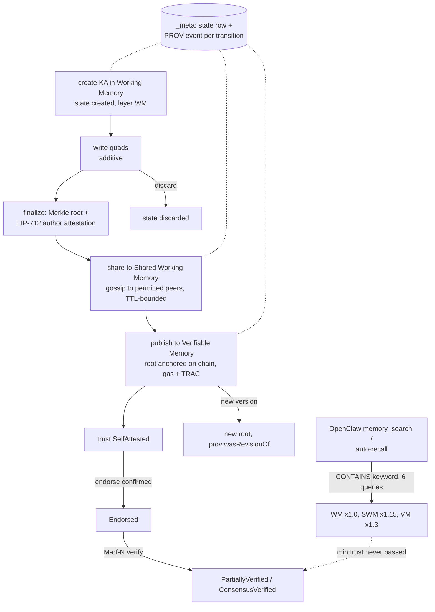

## 1. Executive Summary

OriginTrail's DKG V10 is the node software for a decentralized knowledge graph,
repositioned as "the shared, verifiable memory layer for multi-agent AI
systems". This monorepo — Apache-2.0, 9,128 commits since 22 February 2026, about
470,000 lines of non-test TypeScript and 1,569 test files across its packages —
holds the node daemon, the CLI, a web UI, protocol packages, chain modules, and
adapters that plug the node into OpenClaw, Hermes, ElizaOS and MCP clients. Most
of that volume is network, chain, publishing and synchronization machinery; this
report reads the parts that decide what an agent remembers and recalls.

The memory model is three layers of RDF, and it is the part worth studying:

- **Working Memory** is a private draft graph per agent in a context graph —
  free, local, and invisible to peers.
- **Shared Working Memory** is gossip-replicated to the context graph's
  permitted peers, TTL-bounded, still free.
- **Verifiable Memory** is a Knowledge Asset whose Merkle root is anchored on
  chain for gas and TRAC, with a trust level that only the protocol writes:
  `SelfAttested`, then `Endorsed`, `PartiallyVerified` or `ConsensusVerified` as
  endorsements and M-of-N verifications confirm.

Every step between layers is an explicit operation — finalize (seal with an
EIP-712 author signature), share, publish — and each writes a lifecycle state
and, by default, a PROV event into the context graph's `_meta` graph.
`assertNoUserAuthoredTrustLevelQuads` refuses a write that tries to set a trust
level itself (`packages/core/src/trust.ts:79-90`). A person can drive the same
progression from the node UI.

The weakness is on the recall side. The OpenClaw memory slot — the path an agent
takes when it searches memory or gets auto-recall before a prompt — issues six
SPARQL queries matching any literal of at least twenty characters that contains
a query keyword, ranks by that overlap times a per-layer weight (Verifiable 1.3,
Shared 1.15, Working 1.0), and never passes the minimum-trust filter the query
engine supports. A self-attested verifiable asset and a consensus-verified one
rank the same. The trust levels are real, protocol-written and filterable on
request; the default agent recall does not ask.

Two marks: `scope_enforced`, `negative_eval`. `human_review` is withheld, and
the layered model is the reason it looked earned rather than the reason it is:
a draft really does wait in Working Memory and really is invisible from Shared
Working Memory until something promotes it — the `negative_eval` case pins
exactly that. What promotes it is not an actor the producing agent cannot be.
The node UI's "Propose" and "Ratify" buttons call the same operations the
shipped MCP server hands the model directly: `dkg_knowledge_asset_share` and
`dkg_knowledge_asset_publish`, beside `dkg_knowledge_asset_finalize` and
`dkg_knowledge_asset_discard` (`packages/mcp-dkg/src/tools/assertions.ts`). An
agent can write a draft, share it and publish it without a person in the loop,
so the layers separate *confidence* rather than *authority*.

## 2. Mental Model

A unit of memory is a **Knowledge Asset**: a named set of RDF quads inside a
**context graph** (the UI calls these projects), optionally inside a named
**sub-graph**. Its lifecycle subject lives in `did:dkg:context-graph:<id>/_meta`
at `urn:dkg:assertion:<cg>:<agent>:<name>` (`packages/core/src/constants.ts:558`)
and carries `dkg:state` and `dkg:memoryLayer`.

The states are `created`, `promoted`, `published`, `finalized` and `discarded`.
The layers are Working, Shared and Verifiable. Trust is a separate axis on
verifiable content.

How a claim becomes more believed is how far it travels and who signs it:



Nothing marks a claim wrong. A draft is discarded and recreated; a published
asset gets a new committed version linked to the prior one; shared memory ages
out. Nothing records a rejected value, so `tombstone` is withheld. No read takes
a time and returns what was believed then, so `bitemporal` is withheld.

`trust_state` is withheld on the read side. The trust levels are discrete,
stored, and written only by the protocol — `dkg-agent-endorse.ts:422` stamps
`Endorsed`, `:678-679` chooses `PartiallyVerified` or `SelfAttested`, `:749`
`ConsensusVerified`. The query engine can filter verifiable memory to a minimum
level (`packages/query/src/sparql-min-trust.ts`), and the daemon validates
`minTrust` only for `view: 'verifiable-memory'`
(`packages/cli/src/daemon/routes/query.ts:508-527`). But no default read
excludes a lower level: the filter applies only when a caller passes it, the
Hermes plugin passes it only when the model supplies `min_trust`, and the
OpenClaw memory slot never does.

## 3. Architecture

| Package | Non-test role |
| --- | --- |
| `packages/agent` | `DKGAgent`: context graphs, queries, endorsement, publishing orchestration, shared-memory hosting and recovery |
| `packages/publisher` | Lifecycle metadata, share, publish and update, storage acknowledgements |
| `packages/query` | The query engine: view resolution, read-only guard, graph-scope rewriting, min-trust injection |
| `packages/storage` | Triple store adapters — managed Oxigraph, Blazegraph, a SPARQL HTTP adapter — and graph management |
| `packages/core` | Memory model, URI constants, trust predicates, P2P primitives |
| `packages/chain`, `packages/evm-module` | Chain client and contracts |
| `packages/cli` | The `dkg` command and the daemon with its HTTP routes |
| `packages/node-ui` | The dashboard |
| `packages/adapter-openclaw`, `adapter-hermes`, `adapter-elizaos`, `adapter-prime-agent`, `mcp-dkg` | Agent integrations |

A node is a long-running daemon on `127.0.0.1:9200` with a local triple store.
Named graphs carry the layering: a context graph's data graph, its
`_shared_memory` graph, per-agent Working Memory graphs, per-asset verifiable
graphs, `_meta`, and private partitions.

### Deployment and ergonomics

- **What has to run:** Node.js 22 and the daemon, installed from npm as
  `@origintrail-official/dkg`. `dkg openclaw setup`, `dkg hermes setup` and
  `dkg mcp setup` configure the node, start it, optionally fund wallets from a
  testnet faucet, and register the adapter.
- **Local memory needs no chain.** Working and Shared Working Memory work
  without funds; only publishing to Verifiable Memory costs gas and TRAC.
  Setup defaults to `mainnet-gnosis`, where there is no faucet.
- **Storage** is a daemon-managed Oxigraph server on local RocksDB by default
  (`packages/cli/src/store-wizard.ts:158`), and a node operator can point at
  Blazegraph or a SPARQL endpoint. A file-backed shared-memory
  snapshot store garbage-collects by file age and free-space watermarks and
  does not inspect RDF references.
- **Hand-repairable:** the store is standard RDF with SPARQL, but the
  lifecycle rows, Merkle seals and chain commitments that must agree with it
  are not something to edit by hand.

The screen of this checkout found two auto-running surfaces — `.cursor/mcp.json`
and three Cursor rules files, read as data — two build-time execution points (a
pytest `conftest.py` and a CLI `postinstall` that bundles binaries), no
manifests inside the seven-day cooldown, and 58 unpinned surfaces across 139
scanned files. Nothing was installed, built or run.

## 4. Essential Implementation Paths

- **Lifecycle metadata** — `packages/publisher/src/metadata.ts`:
  `generateAssertionCreatedMetadata` (`:2123`), `…PromotedMetadata` (`:2210`),
  `…UpdatedMetadata` (`:2321`, with `prov:wasRevisionOf` to the prior root),
  `…DiscardedMetadata` (`:2380`). Each sets the state row and, unless
  `provenanceEvents` is `false`, appends a `prov:Activity` event node.
- **Query** — `DKGAgent.query` in `packages/agent/src/dkg-agent-query.ts`:
  read-only guard first, then context-graph read authority, Working Memory
  isolation (`:425-434` states the invariant), private-graph denial, then the
  engine. `packages/query/src/dkg-query-engine.ts` resolves a view to exact
  graphs and graph prefixes and rewrites the SPARQL to the allowed set.
- **HTTP query gate** — `packages/cli/src/daemon/routes/query.ts:551-586`:
  caller identity from the token; node-operator tokens pass; unauthenticated
  Working Memory reads are limited to the node-default agent's aliases.
- **Trust** — `packages/core/src/trust.ts` (predicate, literal builder,
  user-authored refusal); `packages/agent/src/dkg-agent-endorse.ts` (the
  writers); `packages/query/src/sparql-min-trust.ts` (the filter).
- **OpenClaw memory slot** — `packages/adapter-openclaw/src/DkgMemoryPlugin.ts`:
  `search` and `searchNarrow` (`:158-167`) share `runSearch`, which builds the
  keyword SPARQL, the layer plans with weights (`:291`, `:299`, `:307`), runs
  them with the resolved agent address, and deduplicates by context graph and
  subject URI keeping the highest layer (`:387-435`).
- **Chat persistence** — `ChatTurnWriter.ts:3961` posts each user and assistant
  pair to `/api/openclaw-channel/persist-turn`; recall reaches those turns
  through the agent-context graph's Working Memory.
- **UI promotion** — `VerifyOnDkgButton` in
  `packages/node-ui/src/ui/views/project/components/ka.tsx:55-70`.

## 5. Memory Data Model

Content is RDF quads, so the shape is whatever the writer chooses. The memory
slot's recall is deliberately schema-free for that reason: any subject, any
predicate, any literal.

The lifecycle subject in `_meta` carries `prov:wasAttributedTo` the author's
agent DID, `dkg:assertionName`, `dkg:assertionGraph`, `dkg:state`,
`dkg:memoryLayer`, and once identity is reserved a KA number and UAL. Event nodes
at `<subject>/event/<id>` carry a type (`AssertionCreated`, `AssertionPromoted`,
`AssertionUpdated`, `AssertionDiscarded`) and `prov:startedAtTime`.

**The lifecycle history is not an append-only audit log.** It records
transitions, not the quad writes inside a draft; `provenanceEvents: false`
("lite mode", `dkg-publisher.ts:528-534`) drops the event nodes entirely; and the
legacy-migration classifier notes that orphan event rows surviving a cleared
draft are swept away by the next create (`legacy-wm-migration.ts:398-410`).
Verifiable versions are anchored on chain, which is a different mechanism. So
`audit_log` is withheld.

**Scope** has three levels. A context graph has an access policy and allow-list
(`DKG_ALLOWED_AGENT`, `DKG_PARTICIPANT_AGENT`); shared-memory gossip for a gated
graph must carry a signed envelope from one of those agents. Sub-graphs partition
a context graph. Working Memory is a graph whose URI encodes the agent address,
and the query path checks an agent-scoped caller against it — tested in both
directions. The exception is deliberate and documented at the route: a
node-operator token can read any local agent's Working Memory, and the OpenClaw
adapter authenticates that way.

## 6. Retrieval Mechanics

Two surfaces.

**SPARQL through `/api/query`** with a `view`, a context graph, optional
sub-graph and assertion name, and for verifiable memory an optional `minTrust`.
Only read-only queries pass; caller dataset clauses are refused and graph
variables are constrained to the view's allowed set. This is precise and
powerful, and it assumes the caller knows the shape of the graph.

**The OpenClaw memory slot**, used by the `memory_search` tool and by
`before_prompt_build` auto-recall. It splits the query into lowercase keywords of
at least two characters and issues

```sparql
SELECT ?uri ?pred ?text WHERE {
  ?uri ?pred ?text .
  FILTER(isLiteral(?text))
  FILTER(STRLEN(STR(?text)) >= 20)
  FILTER(CONTAINS(LCASE(STR(?text)), "k1") || …)
} LIMIT n
```

against Working, Shared and Verifiable views of the agent-context graph and, when
a project is selected, of the project graph — three or six queries per call.
Hits are ranked by keyword overlap times the layer weight and deduplicated so the
same subject surfaces once at its highest layer. Auto-recall caps at five hits,
HTML-escapes every snippet and wraps the block in untrusted-data framing with a
sentinel that strips it from persisted assistant text.

There is no vector arm and no graph traversal in that path. A query's recall is
bounded by literal substring matching over every literal in six graphs; an entity
known only by an IRI or a short label is not found, and a verbose chat turn that
mentions a keyword in passing competes with a curated fact. The adapter's prompt
guidance tells the model to retry Working Memory reads under alternate identity
forms before concluding a project is empty, which says how easy it is for a read
to miss.

## 7. Write Mechanics

Writes to Working Memory are additive quad inserts to a named draft and are
visible to the author's next query. Finalize computes the canonical Merkle root
and signs an EIP-712 author attestation; a draft edited after finalize fails a
later promote with a stale-seal error rather than publishing a mismatch
(`e2e-memory-layers.test.ts:782`). Share moves the finalized draft to Shared
Working Memory and gossips it; publish commits selected shared content to chain.
Share and publish have async job variants with recovery.

Chat turns from OpenClaw and Hermes channels are persisted by the adapters on
agent end, with markers and watermarks so replays after reset or compaction do
not duplicate a turn. Document import (`dkg ka import-file`) extracts files into
Working Memory, with MarkItDown binaries bundled by the CLI's `postinstall`.

No write blocks on a model. There is no extraction of facts from chat turns into
structured memory in the recall path read here — turns are stored as literals
and found by substring. Conflict handling is structural: drafts are private,
versions are linked, and nothing compares two claims for contradiction.

Background work is network work: gossip catch-up, chain reconciliation, async
share and publish queues, random-sampling proofs, and snapshot garbage
collection. None rewrites memory content.

## 8. Agent Integration

- **OpenClaw:** a memory-slot capability for `memory_search` and auto-recall,
  node tools for context graphs, Knowledge Assets, sub-graphs, file import and
  semantic enrichment, a channel plugin for chat, and a synced `dkg-node` skill.
- **Hermes:** a Python plugin whose tools include a query accepting `min_trust`.
- **MCP:** `mcp-dkg` registers tools into Cursor, Claude Code, Claude Desktop,
  Windsurf, VS Code, Cline and Codex CLI.
- **ElizaOS and Prime Agent** adapters.

Agency is high and explicit. The model decides what to write, when to share,
and — where funds exist — when to publish; the adapter's system prompt carries
rules for inviting peers to private projects. The node UI gives a person the
same promotion controls per entity.

## 9. Reliability, Safety, and Trust

**Trust metadata cannot be forged by the author.** A quad with the trust-level
predicate in an author's payload is refused, trust quads are excluded from the
Merkle recompute so publisher and responder agree (the comment records a July
2026 mismatch incident that motivated the single source of truth), and levels
above self-attested come only from confirmations.

**Isolation fails closed on the read path.** A cross-agent Working Memory read by
an agent-scoped token returns nothing rather than an error, an omitted address
defaults to the caller, and a mutation smuggled into a denied read is rejected by
the read-only guard before the denial short-circuits.

**The recall path treats memory as untrusted input.** Escaping, framing and a
sentinel strip are applied to every auto-recalled snippet, including content
from peers' shared memory, which is exactly the content an injection would use.

**But the trust model does not reach the model.** The layer weight is the only
signal the slot passes on, and a peer's gossip-replicated Shared Working Memory
ranks above the agent's own Working Memory by design.

**Shared memory is bounded by operations, not meaning.** Snapshot garbage
collection frees disk by file age and watermarks; what is lost is whatever is
oldest.

## 10. Tests, Evals, and Benchmarks

1,569 test files across the packages, 412 of them in `packages/agent`, plus
`devnet/` scenario packages that exercise multi-node flows. None was run for this
report.

The memory-layer suite is the relevant one. `e2e-memory-layers.test.ts:432`
writes a draft, asserts it is readable in Working Memory, and asserts it is
absent from Shared Working Memory and the data graph; `:461` and `:539` assert
the analogous boundaries for shared and published data; `:782` asserts a draft
edited after sealing cannot be promoted. `wm-multi-agent-isolation-extra.test.ts`
asserts that B cannot read A's Working Memory by naming A (`:151`) while A reading
its own returns the fact (`:188`), and that the graph URI encodes the agent
address (`:452`). That earns `negative_eval`.

Not tested in what was read: that auto-recall excludes anything by trust level,
and any retrieval-quality measure for the memory slot. No memory benchmark result
is committed; `docs/reports` holds two network scale and release test reports, not
retrieval evaluations.

## 11. For Your Own Build

### Steal

- **Make the private-to-shared-to-anchored path explicit.** Three layers with a
  named operation between each one keeps drafts private by default and makes
  sharing a decision.
- **Let only the protocol write trust.** Refuse author-supplied trust
  predicates, and exclude protocol bookkeeping from content hashes.
- **Encode the owner in the graph name, then check the caller anyway.** A
  per-agent graph URI plus a caller-matches-target check, with the omitted
  address defaulting to the caller, closes both the naming and the omission
  holes.
- **Frame recalled memory as untrusted data** and strip the framing from what
  gets persisted.

### Avoid

- **A trust signal the recall path ignores.** If verification costs money and
  signatures, the agent's default search should be able to prefer — or require —
  what was verified.
- **Substring recall over every literal.** It is schema-free, and it confuses a
  passing mention with a fact.
- **Optional history.** A lifecycle event log that a performance flag can turn
  off and a re-create can sweep is not an audit trail.

### Fit

This suits teams that genuinely need knowledge to cross organizational or node
boundaries with provenance someone else can verify — multi-party research,
supply-chain data, shared agent findings between companies — and are prepared to
run a node, hold keys, and pay for anchoring.

For a single agent or a single team on one machine, it is a great deal of
infrastructure for what the default recall delivers: a keyword scan over a local
triple store. Adopt it for the layering and the verifiability, and plan to
replace the recall.

## 12. Open Questions

- **Is semantic enrichment wired into recall anywhere?** The OpenClaw node plugin
  writes semantic enrichment; the memory slot read here does not consult it.
- **What does an operator token's cross-agent read mean on a multi-user node?**
  The route treats it as the node owner's prerogative.
- **How do shared-memory TTL expiry and snapshot garbage collection interact
  with a draft a peer has not yet published?**

## Appendix: File Index

**Model and trust**

- `packages/core/src/constants.ts` — graph and lifecycle URIs
- `packages/core/src/memory-model.ts` — `MemoryLayer`, `TrustLevel`
- `packages/core/src/trust.ts` — trust predicate and refusal
- `packages/agent/src/dkg-agent-endorse.ts` — trust writers

**Lifecycle**

- `packages/publisher/src/metadata.ts` — lifecycle quads and events
- `packages/publisher/src/dkg-publisher.ts` — share, publish, discard, `provenanceEvents`
- `packages/publisher/src/legacy-wm-migration.ts`

**Read path**

- `packages/agent/src/dkg-agent-query.ts`
- `packages/query/src/dkg-query-engine.ts`, `sparql-graph-scope.ts`, `sparql-min-trust.ts`, `sparql-guard.ts`
- `packages/cli/src/daemon/routes/query.ts`

**Agent integration**

- `packages/adapter-openclaw/src/DkgMemoryPlugin.ts`, `ChatTurnWriter.ts`, `tools/memory-tools.ts`
- `packages/adapter-hermes/hermes-plugin/`
- `packages/mcp-dkg/src/`

**UI**

- `packages/node-ui/src/ui/views/project/components/ka.tsx`, `entities.tsx`

**Docs**

- `docs/how-dkg-works/memory-layers.md`, `docs/use-dkg/knowledge-asset-lifecycle.md`, `docs/use-dkg/swm-public-snapshot-gc.md`

**Tests**

- `packages/agent/test/e2e-memory-layers.test.ts`, `wm-multi-agent-isolation-extra.test.ts`

**Searches behind the absence claims**

- `rg -n "minTrust|min_trust" packages/adapter-openclaw/src packages/adapter-hermes packages/mcp-dkg/src`
- `rg -n "/event/" packages/publisher/src packages/agent/src packages/storage/src`
- `rg -n "TRUST_LEVEL_PREDICATE" packages/core/src packages/agent/src packages/publisher/src`

## History

**2026-09-19** — audited at the unchanged pin [`d499fb2d5bce5b4717c62c2dd1fda93dc7495f21`](https://github.com/OriginTrail/dkg/commit/d499fb2d5bce5b4717c62c2dd1fda93dc7495f21); nothing upstream moved, so the correction is ours. `human_review` is **withdrawn**, and the record's own closing clause was the answer: nothing reaches the other layers without one of the UI calls *"or an agent making the same call"*. The shipped MCP server was enumerated rather than assumed, and it hands the model `dkg_knowledge_asset_share`, `dkg_knowledge_asset_publish`, `dkg_knowledge_asset_finalize` and `dkg_knowledge_asset_discard` — every verb behind the UI's "Propose" and "Ratify" buttons. The layering itself is not in question and keeps its credit: `scope_enforced` and `negative_eval` both stand, the latter on `WM data is not visible in SWM or default data graph`, which is the assertion that makes the withholding checkable. What the layers separate is confidence, not authority. Screened again first; nothing was installed and no suite was run.

**2026-09-15** — [`d499fb2d5bce5b4717c62c2dd1fda93dc7495f21`](https://github.com/OriginTrail/dkg/commit/d499fb2d5bce5b4717c62c2dd1fda93dc7495f21) — first reading, at a commit dated 10 September 2026. Screened before opening: two auto-running editor surfaces read as data, two build-time execution points, no manifests inside the seven-day cooldown, 58 unpinned surfaces. Nothing was installed, built or run. The reading covered the memory model, the query and trust paths, lifecycle metadata, the OpenClaw memory slot and the memory-layer tests, not the chain, economics or synchronization packages.
