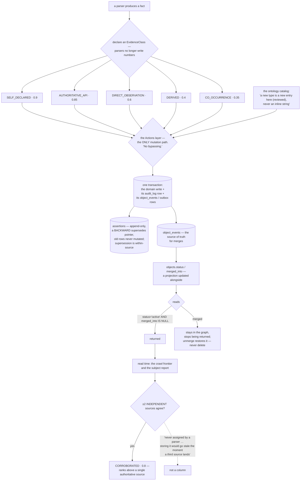

## 1. Executive Summary

Osiris is "[t]he persistent memory and coordination graph for AI agents" —
AGPL-3.0, Python 3.12+, 269,603 lines with 6,388 test functions, over PostgreSQL
16 with `pg_trgm` and a Redis 7 event bus, exposed as a streamable-HTTP MCP
server with native Claude Code hooks. It describes itself as
"[a] self-hosted, harness-agnostic, provenance-first entity-graph engine",
turning agent reasoning, architectural rulings, loose ends and inter-agent
messages into "durable, queryable, event-sourced graph memory across context
windows, compactions, and harness boundaries".

The module to read is eighty lines long and fixes something this atlas finds
almost everywhere.

**Parsers stopped writing confidence numbers.** The evidence module opens with
the defect:

> "Before this module, every parser invented its own confidence number (0.4 →
> 0.99) with no shared meaning, so 'noise' was baked into the graph as
> fake-precise facts and nothing downstream could reason about *why* a node was
> believed. Here we grade each fact by HOW it was obtained, and derive its
> confidence from that class. Parsers stop writing numbers; they declare an
> `EvidenceClass`."

Five classes a parser may declare — self-declared, authoritative API, direct
observation, derived, co-occurrence — each projecting a base confidence. The
`confidence` column survives because the constraint, the entity-resolution
scorers and the report views read it, "but it is now a *projection* of the class,
not a guess".

**The sixth class cannot be claimed.** CORROBORATED:

> "is never assigned by a parser — it is computed at read time when ≥2
> independent sources agree … Storing it would go stale the moment a third source
> lands."

Two things there. Corroboration requires *independent* sources, so an agent
restating its own claim does not manufacture it — the failure
[OWASP's memory guard](../agent-memory-guard/) describes as a threat and most
systems here leave open. And it is recomputed rather than cached, because a
stored corroboration is a claim about a world that keeps changing. It ranks above
a single authoritative source in the strength order, which is the correct
ordering and the one a cached flag would eventually get wrong.

**One write path, and the audit row rides with the write.** The actions layer's
header is the contract:

> "The Actions layer — the *only* mutation path into the ontology. Every method is
> atomic: the domain write, its `audit_log` row, and any `outbox` /
> `object_events` rows all commit in one transaction. UI clicks, helper outputs,
> and analyst edits must all go through here. No bypassing."

Underneath: assertions are append-only with a *backward* `supersedes` pointer and
"old rows are never mutated"; supersession is scoped within a source rather than
across the multi-source set, so one source correcting itself does not silence
another; merges are events with `objects.status` and `merged_into` maintained as
a projection; and cascades go through a durable outbox "(not fire-and-forget
pub/sub)", so an effect cannot be lost independently of the write that caused it.

That status is the second mark. Reads carry it — `o.status='active' AND
o.merged_into IS NULL` on threads, `o.status='active'` on decisions and on agent
lookups — so a merged object stays in the graph and stops being returned. Unmerge
is a first-class action that restores it to active and clears the projection,
under a rule of never deleting.

The ontology is a declared catalog rather than a framework: "[a] new type is a new
entry here (reviewed), never an inline string", after types were "invented inline
by each parser and scattered across the UI, the parsers, and the docs". Every
surface — the UI's colours and shapes, the generic object view, the validators —
reads the one catalog.

What is not here is an isolation boundary. Agents, projects and threads are
object types inside one graph, not partitions of it, so what separates one
agent's memory from another's is the graph's shape rather than a predicate a
reader cannot omit. For a self-hosted single-operator deployment that is
coherent; it is the thing to establish before a shared one.

And the evidence classes grade and rank but never withhold. A co-occurrence fact
at 0.35 comes back beside a self-declared one at 0.9, so a consumer that ignores
the class treats them as peers — the protection lives in the reader. The base
confidences are constants with no stated derivation, which is what the module
intends (a shared ordering, not calibrated probabilities) and worth naming
because a downstream reader may take 0.85 for a likelihood.

## 2. Mental Model

An **assertion** is one source saying one thing. It is never edited.

A **confidence** is not something a parser chooses. The *class* is.

**Corroboration** is a question asked at read time, never an answer stored.

A **merge** is an event; the status is only its shadow.

## 3. Architecture

| Area | Role |
| --- | --- |
| `src/actions/core.py` | The only mutation path, and its invariants |
| `src/parsers/evidence.py` | The evidence-class taxonomy and its projections |
| `src/ontology/` | The declared catalog, labels, entity resolution |
| `src/orchestrator/` | The frontier, sources, compositions |
| `src/mcp_server.py` | The agent surface (12,403 lines) |
| `src/cli.py` | The operator surface (8,328) |
| `src/workers/`, `src/dissemination/` | Background work and delivery |

## 4. Essential Implementation Paths

`src/parsers/evidence.py:1-41` — the defect, the classes, and the one that
cannot be claimed.

`src/actions/core.py:1-13` — one path, one transaction, three invariants.

`src/ontology/schema.py:1-21` — why the catalog exists and what it is not.

## 5. Memory Data Model

Objects of declared types with graded properties and links, every property and
link carrying provenance as a kernel-wide invariant. An assertion is one source's
claim; the multi-source set is preserved because supersession is within-source,
which is the detail that keeps a self-correcting parser from silencing an
independent one — and is also what makes read-time corroboration meaningful.

## 6. Retrieval Mechanics

Graph traversal and trigram search over active objects, with the frontier reading
the evidence class to decide "what is the strongest reason this node is here".
Ranking by strength rather than by a raw number is what the class taxonomy buys.

## 7. Write Mechanics

Covered above. The unmerge path is worth a second look: it restores the merged
object to active and clears the projection while leaving assertions in place —
"resolve-on-read" — so undoing a merge does not require rewriting anything that
was asserted.

## 8. Agent Integration

A streamable-HTTP MCP server, native Claude Code hooks, and a plugin for another
harness. Screening flags three auto-run surfaces, which is what a hook-installing
MCP server looks like.

## 9. Reliability, Safety, and Trust

The evidence taxonomy and the single write path are the trust story, and they are
complementary: one makes it impossible to write a fact without saying how it was
obtained, the other makes it impossible to write anything without recording that
it happened.

The gap is enforcement at read time. Nothing withholds a weakly-graded fact, and
nothing partitions one agent's view from another's.

## 10. Tests, Evals, and Benchmarks

6,388 test functions, with the largest suites covering capture, triggers, the CLI
and agents. Nothing was installed or run for this reading.

## 11. For Your Own Build

Grade the fact by how you got it, then derive the number. A parser that picks
0.72 is guessing; a parser that says "co-occurrence" is reporting, and the number
becomes a shared ordering everyone downstream can reason about.

Never let corroboration be self-asserted or stored. Require independent sources,
compute it at read time, and the third source that arrives tomorrow changes the
answer instead of contradicting a cached flag.

Commit the audit row in the write's transaction. An audit that can fail
separately from the mutation is an audit with silent gaps.

Scope supersession to the source. One source correcting itself should not delete
another source's disagreement, and the multi-source set is what corroboration is
computed over.

And put the type catalog in one reviewed place. Types invented inline by each
parser is the state this project migrated away from, and the migration is the
evidence that it costs something.

## 12. Open Questions

Whether anything filters by evidence class. The classes rank and project a
confidence; no read was found that withholds below a threshold.

What isolates one agent from another. Agents are object types in a shared graph,
and no partition predicate was found.

How the base confidences were chosen. They are constants with a stated ordering
and no stated derivation.

## Appendix: File Index

| Path | What to read it for |
| --- | --- |
| `src/parsers/evidence.py:1-41` | Numbers replaced by classes, and one class that cannot be claimed |
| `src/actions/core.py:1-13` | One mutation path and what rides with every write |
| `src/actions/core.py:688-692` | Unmerge, restore, never delete |
| `src/ontology/schema.py:1-21` | A catalog, not a framework |

## History

**2026-09-16** — [`5de1b36678aa6d41c0a5e4c5f13619de569012a3`](https://github.com/asuramaya/osiris/commit/5de1b36678aa6d41c0a5e4c5f13619de569012a3) — first reading, at a commit dated 16 September 2026. Screened before opening, from a shallow clone: eleven files scanned, three auto-run surfaces, one build-time execution point, no unpinned surfaces and three dependency files inside the seven-day cooldown. Nothing was installed, built or run.
