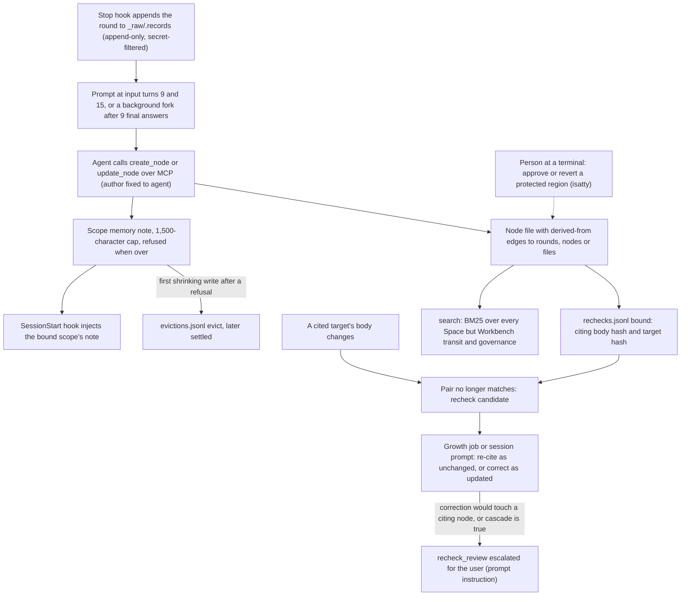

## 1. Executive Summary

osk-system is a local Markdown memory vault for coding agents. Session hooks
for Claude Code, Codex, Kiro and Antigravity capture every conversation round
verbatim into an append-only `_raw/` record. At fixed turns, or in a background
fork, the agent distills durable claims into nodes over MCP, each citing its
evidence down to the round. BM25 search, a per-scope shared note injected at
session start, and an Obsidian graph bring them back.

What is notable is the provenance machinery. Every `derived-from` pair is bound
to a hash of both bodies in an append-only ledger, so a changed source turns
every citing node into a recheck candidate, and the candidacy propagates along
citations. The ledgers carry UUIDv7 ids and causal parents, so two devices'
appends merge by Git union and a fork is reported, not silently resolved.

What is weak is the read side. Search covers every Space, every scope included,
while writes are confined to a session's bound scope. The cascade stop on
corrections and the rule that an agent's inference about the user needs
confirmation are prompt and governance text. Node creation and edits are
recorded nowhere but Git.

The design is written down as law. A Korean constitution, bylaws and mechanism
document under `_governance/` define Spaces, nodes, ledgers and authority. The
engine cites them article by article in its comments, and `_governance/records/`
holds 24 dated deliberation records. `docs/FORMAT.md` is an English,
non-normative commentary on the on-disk format.

The licence is MIT. A Korean rider in `LICENSE` declares the governing
documents the author's own work; it does not restrict analysis.

One mark: `negative_eval`, on a regression case asserting that a node's
replaced body is no longer found by its old text, after a positive control.
Section 9 names the six withheld.

## 2. Mental Model

A memory is a **node**: a Markdown file whose title is its handle. Its
frontmatter carries a server-assigned id, two KST timestamps, `author` (`user`
or `agent`), `drafter` (a model name), a one-line summary, and two optional
typed edges, `derived-from` and `conflicts`
(`_governance/_engine/osk/contract.py:202`; `docs/FORMAT.md` section 2). A node
lives in one of three Spaces: Scope for a project, Domain for knowledge reused
across projects, Person for the user model.

Beneath the nodes sit two non-node stores. The **raw record** is the verbatim
transcript, in numbered rounds, which only grows. The **scope memory** is one
note per scope, capped at 1,500 characters and shared by every session and
device (`osk/scope_memory.py:35`). The cap is deliberate: an over-limit write is
refused rather than truncated, so the refusal itself is the signal to distill
into a node (`osk/scope_memory.py:1-22`).

A claim becomes a node when the agent writes it, and nothing else decides.
Every MCP write stamps `author: "agent"` (`osk/write.py:1108-1110`), and no
reader consults the field. There is no candidate state and no review before a
node is searchable. The README puts it as trust coming *"from sources,
relations and history, not from an approval stamp"*.

A node stops being current in three ways, none of them a state. The agent
rewrites it in place under a hash or anchor check. A cited target's body
changes, which makes the pair a recheck candidate until the agent re-cites it
as `unchanged` or corrects the node as `updated` (`osk/rechecks.py:193-230`).
Or a person deletes the file. A contradiction can be filed as a conflict
candidate keyed on both parties' content hashes and adjudicated in a case file
the engine does not write (`osk/write.py:1866-1914`).

Protected regions add an after-the-fact lane. A person marks a directory
protected and the engine keeps the approved snapshot as content-addressed
objects. Agent edits still take effect at once, and the difference waits as a
changeset the person approves or reverts at a terminal (`osk/cli.py:19-28`).

## 3. Architecture

The runtime is one Python package, `_governance/_engine/osk/`, behind three
surfaces. `mcp_server.py` is a FastMCP stdio server with 12 tools. `osk/cli.py`
is the operator and hook CLI. Three hook scripts under `scripts/hooks/` handle
session start, prompt submit and stop, with per-host adapters in
`osk/harness/`. Dependencies are `mcp`, `pydantic`, `PyYAML` and `rank-bm25`
(`_governance/_engine/requirements.txt`).

Persistence is the vault directory. Nodes are files; ledgers are JSON Lines
under `00_Scope/Workbench/_ledger/`; approved snapshots are content-addressed
objects beside them. Device-owned state — locks, hook-run records, integration
cursors, distillation journals — lives in the repository's Git directory and is
never synchronized (`docs/FORMAT.md` section 1).

Every ledger append takes an exclusive file lock, refuses a structurally
damaged ledger, assigns a monotone UUIDv7, sets `parents` to every current head,
and fsyncs the line and, on creation, the directory (`osk/core.py:691-755`).
`.gitattributes` merges ledgers with `merge=union`, so lines appended on two
devices both survive and the next append joins the branches.

Search is computed from the files. `Searcher` tokenizes title, summary and body
into ASCII words and character bigrams and builds `BM25Okapi` on first search
(`osk/search.py:24-58`). The server caches the index behind a fingerprint of
paths, mtimes and sizes, and refuses to trust it inside the mtime race window
(`mcp_server.py:59-112`).

Background work runs in three places. A subscription fork re-runs the source
session's harness after every 9 successful final answers
(`osk/response_growth.py:18-22`). A scheduled growth runner spawns a harness CLI
with a bounded job manifest (`osk/growth.py:1021-1038`). An optional daemon
commits, pulls with rebase and pushes the vault (`vault_sync.py:1-15`).

### Deployment and ergonomics

Nothing has to run but Python 3.11 and Git. There is no database, no embedding
model and no network service; the store is human-readable Markdown and JSON
Lines, and `docs/FORMAT.md` documents how to repair a ledger by hand.

The documented install has an agent clone a release tag and run
`scripts/setup.py --interactive`, which creates a venv, records the release
baseline and registers MCP and hooks per host after a confirmation. The
background fork needs a logged-in subscription CLI; without it, review falls
back to in-session prompts. Updates arrive as attested releases whose
`release.json` hashes every file, applied in a journalled transaction
(`docs/FORMAT.md` section 7).

## 4. Essential Implementation Paths

**Capture.** The Stop hook (`scripts/hooks/capture_stop.py`) reads the host
transcript through `osk/transcripts.py` and appends rounds through
`raw.append_round`. That call secret-filters seven patterns and accepts a write
only when the file's bytes are a prefix of the new bytes (`docs/FORMAT.md`
section 6.1). The MCP `append_raw` tool is the same path for hosts without hooks
(`mcp_server.py:468-476`).

**Review cadence.** `osk/integration.py` keeps a durable per-conversation cursor
with `SOFT, HARD = 9, 15` (`osk/integration.py:17`), and the prompt-submit hook
asks for an in-session review at those input turns. `osk/response_growth.py`
runs the background fork instead when the host CLI passes its checks, and falls
back after two unfinished forks (`osk/response_growth.py:18-22`).

**Node write.** `write.create_node` takes the mutation lock, builds one index,
and checks the title, edges, session key and routing. It refuses a landing in a
scope other than the session's bound one (`osk/write.py:1040-1053`), requires a
cluster's hub before its first other node, and refuses portable-name
collisions. It then renders and validates, writes atomically, binds the session
on first success, and appends recheck records (`osk/write.py:1017-1147`).
`update_node` requires `expect_hash` for a full body or a unique `old_text`
anchor (`mcp_server.py:415-437`).

**Citation topology.** `_topology_of` refuses a Scope node citing another
scope's nodes or raw rounds, a Domain node citing raw rounds directly, and any
node citing Workbench work state (`osk/write.py:591-643`).

**Recheck.** `rechecks.after_write` records `bound` for new pairs and carries
complete pairs forward when the body changes (`osk/rechecks.py:409-420`).
`rechecks.candidates` lists every pair whose recorded hashes no longer match,
with `next`, the citing nodes, and `cascade`, whether the target's current body
came from a recheck correction (`osk/rechecks.py:193-230`).

**Scope memory.** `scope_memory.replace` takes `edits` as unique anchors or
`text` with `expect_hash`, measures the cap after filtering, and refuses an
over-limit result. On the first shrinking write after a refusal it records the
removed lines as an `evict` before the file changes
(`osk/scope_memory.py:293-490`).

**Retrieval and injection.** `search` calls `Searcher.view_search`, which is
`work_search` (`mcp_server.py:178-182`; `osk/search.py:60-92`). The
SessionStart hook resolves the session key from the Git repository. For a bound
scope it injects the scope memory with its hash, recheck notes, pending reviews
and eviction items, folding blocks to the host's context budget
(`scripts/hooks/claude_session_start.py:211-236`, `466-500`).

**Authority.** `osk protect`, `approve`, `revert` and `unprotect` call
`_confirm`, which exits when stdin is not a terminal and has no bypass flag
(`osk/cli.py:19-28`, `572-640`). `validate.surface_lint` walks the MCP
modules' AST and fails on a call to any of those verbs or an append to the
approvals, signatures or pins ledgers (`osk/validate.py:537-539`, `778-791`).

## 5. Memory Data Model

The node contract admits exactly six required keys and two edges; any other key
is an error (`osk/contract.py:202`; `docs/FORMAT.md` section 2.1). The id is the
identity: two readable files with one id make every read and write by that id
or title refuse until a person resolves it (`mcp_server.py:186-239`). Titles
are unique vault-wide after NFC and case folding, because they are file names
on NTFS and APFS.

Scope is physical. A node's Space and top-level cluster come from its path
(`graph.space_of`); there is no scope column. A session key is bound to one
scope in `routing.jsonl` (`docs/FORMAT.md` section 4.3). The key is the main
repository's directory name, or that name plus 8 hex digits of a root commit
when an unrelated repository already owns the name.

Temporal fields are `created` and `updated` at minute precision, and the
ledgers' `at`. There is no validity time. Correction is in-place overwrite with
the old body left to Git; the recheck ledger keeps body hashes, not bodies. The
approval store keeps every approved file version by content hash, but only for
protected regions.

The `conflicts` edge accepts only an open case the node is a party to
(`osk/write.py:591-602`). The candidate ledger keys each candidate on a
`sha256` of its type and each party's `id@file-hash`, so a dismissal suppresses
only the same parties at the same bytes (`osk/write.py:1909-1914`).

## 6. Retrieval Mechanics

Retrieval is lexical and tool-mediated. A query is tokenized like the corpus; a
document is a candidate when it shares a token with the query or its title
equals the query, and an exact title sorts first regardless of score
(`osk/search.py:60-75`). Each hit returns title, path, id, summary, `updated`
and the BM25 score, and the tool's description tells the model to `read_node`
before citing. `k` defaults to 8 and is capped at 50 (`mcp_server.py:178-182`).

What search does not filter is the finding. It excludes only Workbench transit
and governance nodes (`osk/search.py:50-53`); every scope, Domain and Person
node is in one corpus. This is deliberate: Constitution article 11(3) defines
work search as a union over all Spaces in which *"locality는 순위 자질이며
검색 관문이 아니다"* — locality ranks results and does not gate them. The
ranking half is not built — `work_search`
sorts by exact title and BM25 score only (`osk/search.py:74-75`).

A node that is a recheck candidate, or a party to an open conflict case, is
returned without a marker. Those states surface in `overview` and the
session-start block instead.

`read_node` pages a long body by outline or character range, at most 4,000
characters per call, and withholds the CAS hash from a partial read so an
excerpt cannot authorize a full replacement (`mcp_server.py:250-297`).
`read_raw` defaults to a selected review view capped at 6,000 characters
(`mcp_server.py:300-313`).

Session-start injection is bounded by the host budget, and the scope memory is
at most 1,500 characters. When a conversation already received the same hash, a
one-line pointer replaces the full note
(`scripts/hooks/claude_session_start.py:199-209`).

## 7. Write Mechanics

Writes are agent-driven and synchronous from the tool's side: the node is
searchable as soon as `create_node` returns. The cadence decides when they
happen: in-session prompts at input turns 9 and 15, or a background fork after
every 9 final answers that does not block the user's session. The README states
that a subscription failure never falls back to paid API calls.

Deduplication is the agent's job, steered by the tool text, which tells it to
correct the same claim and conditions in place, and by the global title
uniqueness check. `record_candidate` files a contradiction, duplication,
competition or delegation-overlap for a person, deduplicated on its basis
(`osk/write.py:1866-1906`). There is no extraction model in the engine; the
calling agent writes every byte of meaning.

Noise filtering is the secret filter on raw records, scope memory and
distillations from raw; node bodies are not filtered, by design. A distillation
job journals its source refs and resumes after a crash, and its receipts
*"prove persisted bytes and references, never semantic correctness"*
(`osk/distillation.py:1-5`).

### Operational cost

The write path costs the user nothing beyond the agent's own turns, and the
fork reuses the source session's prompt cache. `docs/response-growth.md`
reports a 98.74% cache hit for a Codex app fork in one measured experiment. No
background pass rewrites the whole store: growth jobs are bounded by
`BATCH_SIZE = 4` and `MAX_LIMIT = 20` (`osk/growth.py:25-27`). Search rebuilds
BM25 over every node when any node changes; `docs/performance-index.md` records
about 75 ms after a raw-only change and about 2 s cold at 5,000 nodes, on one
Windows machine.

## 8. Agent Integration

The agent holds 12 tools: `search`, `read_node`, `read_raw`, `overview`,
`run_validators`, `create_node`, `update_node`, `move_nodes`, `move_cluster`,
`record_candidate`, `append_raw` and `scope_memory`. Unknown arguments are
rejected before dispatch, and the server refuses to start if it cannot install
that rejection (`mcp_server.py:497-522`). No tool deletes a node, approves a
region, appends a pin, or writes a case file.

Injection is automatic at session start, and the agent is told to search before
answering memory questions (`scripts/hooks/claude_session_start.py:239-246`).
`setup.py` registers the server and hooks for four hosts; another MCP client
gets the tools but no capture or cadence. A fifth host needs an adapter in
`osk/harness/` with transcript parsing, completion ids and hook budgets, and
the README lists what each new harness must verify.

## 9. Reliability, Safety, and Trust

**Provenance is the strongest property.** A node can cite a raw round by
coordinate, and the round's hash excludes trailing newlines so appending does
not change it. A citation is bound to both bodies' hashes, and a changed source
reopens every citing node until it is re-read. A re-citation records only the
state the agent read in that session, so an unread target reports
`recheck_unread` instead of closing (`docs/FORMAT.md` section 4.10).

**The cascade stop is a prompt.** The growth runner tells the agent not to
apply a correction that would require changing a node in `next`, and never to
correct when `cascade` is true (`osk/growth.py:447-457`). `update_node` does not
consult either field; `cascade` is produced only for the candidate report and
the job manifest.

**Scope is open on read, by design.** A session bound to scope A cannot write
into scope B, and a scope-A node cannot cite scope B
(`osk/write.py:1040-1053`, `629-642`). Search returns scope B's nodes to that
session, and `read_node` and `read_raw` take no session at all. The
constitution asks for locality as a ranking feature instead, which the search
code does not apply.

**Concurrency and sync.** One mutation lock serializes writes on a device, and
CAS on full rewrites catches another device's pulled edit. Ledger forks across
devices leave a subject unresolved until a joining record, and approvals wait
for a person's sealing approve.

**Marks.**

- `negative_eval` — awarded. `test_read_cache_dependencies` asserts a node is
  found by its original text, rewrites the body, asserts the new text finds it,
  then asserts the old text no longer does
  (`tests/test_regression.py:11105-11126`). `test_retrieval.py:37-42` asserts
  Workbench-transit and governance nodes stay out of search beside found
  controls. Both run in CI through the regression runner.
- `tombstone` — withheld. The candidate ledger's `dismiss` is keyed on the
  parties' ids and file hashes, not on a rejected value, and the engine never
  appends one (`osk/write.py:1866-1869`). A growth `no_value` review suppresses
  re-comparing the same source set at the same bytes; nothing stops the same
  claim being written again.
- `trust_state` — withheld. `author` is a two-valued field fixed to `agent` on
  every MCP write, and no read path filters on it. The Person-space rule that an
  agent's inference is not the user's fact without confirmation has no gate in
  `osk/write.py`.
- `bitemporal` — withheld. `created` and `updated` are record times only.
- `scope_enforced` — withheld. Scope is a directory, not a key on the node, and
  `search` reads every Space with no predicate (`osk/search.py:50-53`). The
  session binding confines writes and session-start injection: a real boundary
  on the write side and a physical partition on the injection side.
- `audit_log` — withheld. The ledgers are append-only and well built, but none
  records node creation or edits; `ledger_append` has no call in the create or
  update path beyond routing and candidates. `evictions.jsonl` records only lines
  cut after an over-limit refusal and states that ordinary cleanup is not
  recorded (`osk/evictions.py:1-8`). `approvals.jsonl` records a person's
  decisions about region snapshots. Git history is the mutation record.
- `human_review` — withheld. The approve and revert verbs pass the actor test:
  off the MCP surface, AST-guarded, and refused without a terminal
  (`osk/cli.py:19-28`). But agent edits to a protected region take effect at
  once and search reads the working copy (`osk/search.py:8-10`), so nothing
  waits. The one reader of approved state, the delegation check, returns `hold`
  whether or not the delegation is approved (`osk/authority.py:124-170`).

## 10. Tests, Evals, and Benchmarks

I did not run the suite. CI runs `tests/test_regression.py` on Windows and
Linux with Python 3.11 and 3.12, and on macOS as advisory
(`.github/workflows/ci.yml:41-82`). The runner is a fail-collecting `check()`
harness with 179 test functions. It also runs 15 isolated suites as
subprocesses — capture, integration, growth, retrieval, organization, setup —
and counts a suite's skip as a skip, never a pass
(`tests/test_regression.py:11846-11880`). `tests/conftest.py` makes a `check()`
failure fail under pytest too, written after v3.2.0 shipped with pytest
reporting "103 passed" over failing checks.

Memory-specific coverage is deep on write integrity: CAS, duplicate ids,
portable names, topology, ledger damage, multi-device forks, recheck carrying,
eviction recording and approval lifecycles. Retrieval coverage is thin.
`test_retrieval.py` checks title precedence, BM25 order and the two excluded
classes; nothing measures recall or precision on a labelled set.

`tests/test_adversarial.py` kills processes during updates and checks five
invariants, and is run by hand: no CI job or runner references it.
`benchmarks/` holds latency benchmarks for index and sync with CSV results dated
22 September 2026; they measure speed, not retrieval quality. No paper is cited
in the tree.

Tests I would want: a cross-scope read case — write in A, search from B, assert
absence — which would fail at this commit. A check that a recheck candidate is
flagged on the search hit. A test that `update_node` refuses a correction when
`cascade` is true, which would also fail.

## 11. For Your Own Build

### Steal

- **Bind each citation to both bodies' hashes.** A ledger row of citing node,
  citing body hash, target and target body hash turns "the source changed" into
  a mechanical candidate list. Recording only the version the agent read stops
  a re-citation from closing on an unread change.
- **Give append-only ledgers causal parents, not timestamps.** UUIDv7 ids plus
  `parents` set to the current heads make a Git union merge safe, and make a
  fork visible as several maxima that the reader can refuse to resolve.
- **Refuse over the cap; never truncate.** A small shared note that rejects an
  over-limit write forces distillation into durable nodes, and logging what was
  cut after the refusal keeps the forced edit from losing material.
- **Lint the tool surface for authority verbs.** An AST check that fails when
  the MCP module calls approve or revert, or appends to the authority ledgers,
  keeps the boundary from eroding in refactors.

### Avoid

- **Confining writes by scope and leaving search open.** Write-side rules look
  like isolation and do not stop a bound session reading every other project's
  nodes. If locality is meant to rank rather than gate, build the ranking
  before relying on it.
- **Putting the stop condition in the prompt.** A cascade rule the write tool
  never checks holds only as long as the model follows it.
- **A review lane whose approved state no read consults.** An approved snapshot
  that search ignores, and a delegation check that holds either way, give a
  person a ceremony rather than a gate.

### Fit

This suits one developer who wants a durable, inspectable knowledge base across
several coding agents and will read Markdown and diffs. It assumes a maintainer
who accepts governance by documents, most of them in Korean, and a design that
moves through dated amendments. It is a poor fit where projects must not see
each other's knowledge, where several people share a vault with different
rights, or where the operator needs semantic recall. The README says protected
regions are not a security boundary. A team wanting a library to embed will
find an application with its own constitution instead.

## 12. Open Questions

- How often does the background fork complete a review in practice, and how
  many nodes does a typical review write? The README marks autonomous growth as
  experimental and under measurement.
- Is a locality term planned for `work_search`? Constitution article 11(3)
  names locality as a ranking feature, and the engine has no code for it.
- What does the eviction docstring's measurement of cleanup at 93% and
  distillation at 7% over 14 days rest on? The record
  `_governance/records/2026-09-02-eviction-ledger.md` was not read.
- Does `osk check`, which always returns `hold`, have a consumer outside the
  CLI?

## Appendix: File Index

- Storage and schema: `_governance/_engine/osk/contract.py`, `osk/core.py`,
  `osk/graph.py`, `docs/FORMAT.md`, `.gitattributes`.
- Write path: `osk/write.py`, `osk/distillation.py`, `osk/scope_memory.py`,
  `osk/evictions.py`, `osk/raw.py`, `osk/secrets.py`.
- Retrieval: `osk/search.py`, `mcp_server.py` (`search`, `read_node`,
  `read_raw`).
- Context assembly: `scripts/hooks/claude_session_start.py`,
  `scripts/hooks/claude_prompt_submit.py`, `osk/hook_text.py`.
- Background: `osk/integration.py`, `osk/response_growth.py`, `osk/growth.py`,
  `osk/rechecks.py`, `osk/organization.py`, `vault_sync.py`, `sync_daemon.py`.
- Authority: `osk/approvals.py`, `osk/authority.py`, `osk/cli.py`,
  `osk/validate.py`.
- MCP and hooks: `mcp_server.py`, `osk/harness/`, `scripts/setup.py`.
- Tests: `tests/test_regression.py`, `tests/test_retrieval.py`,
  `tests/conftest.py`, `.github/workflows/ci.yml`.

### Recorded searches

Checked against the checkout at the pinned revision, from the repository root.

- `rg -n '@mcp.tool' _governance/_engine/mcp_server.py` — 12 tools; none named for delete, approve, protect, pin or case.
- `rg -n 'unlink\(|os\.remove|rmtree|def delete|delete_node' _governance/_engine/osk/write.py _governance/_engine/osk/distillation.py _governance/_engine/mcp_server.py` — one match, a temporary file in `_atomic_write`.
- `rg -n '"author"|\[.author.\]|get\(.author' _governance/_engine/osk _governance/_engine/scripts _governance/_engine/mcp_server.py` — the contract list, the validator and the one writer in `write.py`; no reader.
- `rg -n 'ledger_append\(' _governance/_engine/osk _governance/_engine/scripts _governance/_engine/mcp_server.py` — callers in `cli.py` (validators), `evictions.py`, `write.py` (routing, candidates), `approvals.py`, `update.py` and `growth.py`; none in the node create or update path.
- `rg -n 'approvals\.' _governance/_engine/osk _governance/_engine/scripts _governance/_engine/mcp_server.py -g '!**/osk/approvals.py'` — calls in `authority.py`, `cli.py`, `update.py`, `validate.py` and `write.py` (`record_move`), and a comment in `graph.py`; none in `search.py` or the hooks.
- `rg -n 'cascade' _governance/_engine/osk _governance/_engine/mcp_server.py` — `rechecks.py` and the growth prompt only.
- `rg -n 'CASE-|case_no|"dismiss"|dismiss' _governance/_engine/osk _governance/_engine/scripts _governance/_engine/mcp_server.py` — readers and validators; no writer of a case file or a `dismiss` record.
- `rg -n 'discarded|no_value' _governance/_engine/osk` — outcome vocabularies, prompts and settlement checks in `cli.py`, `evictions.py`, `growth.py` and `integration.py`; no reader that refuses a later write.
- `rg -n 'PERSON|Delegation' _governance/_engine/osk/write.py _governance/_engine/osk/graph.py` — layout constants and messages; no confirmation gate on Person writes.
- `rg -n 'test_adversarial' _governance/_engine/tests/test_regression.py .github/` — no match.
- `rg -n 'locality' _governance/_engine` — no match; the term appears in the governing documents only.
- `grep -rliE 'arxiv|bibtex|@article|@misc|doi\.org' . --exclude-dir=.git` — no match, and no `CITATION.cff`.
- `find . -iname AGENTS.md -o -iname CLAUDE.md -o -iname GEMINI.md`, excluding `.git` — none.

## History

**2026-10-03** — [`edf9523fe32c5d9a08ab41b95dd464b3d0fe433f`](https://github.com/lpaiu-cs/osk-system/commit/edf9523fe32c5d9a08ab41b95dd464b3d0fe433f) — first reading, at release v4.1.3, a commit dated 3 October 2026. One mark, `negative_eval`. Screened before reading: 0 auto-run surfaces, 3 build-time execution points (two `setup.py` files and `tests/conftest.py`), 1 dependency file inside the cooldown — every file in a depth-1 clone dates to the tip — and 1 unpinned surface, `requirements.txt`, which CI constrains with `constraints.txt`. No `.gitattributes` filter driver and no submodules; `docs/INSTALL-AGENT.md`, written for agents, was read as data. Nothing installed, built or run.
